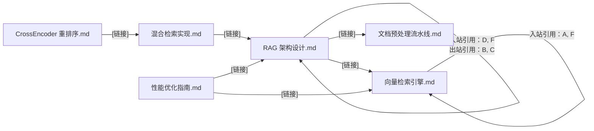
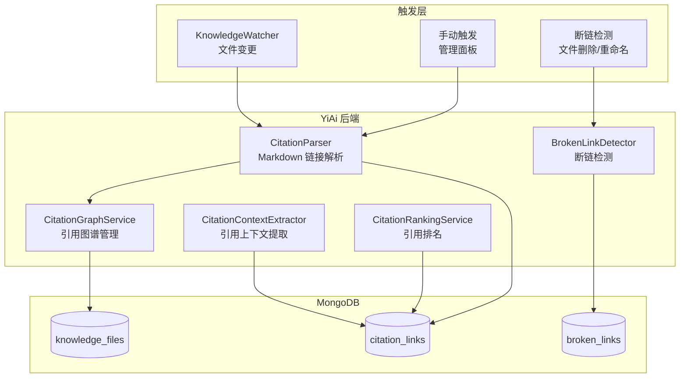
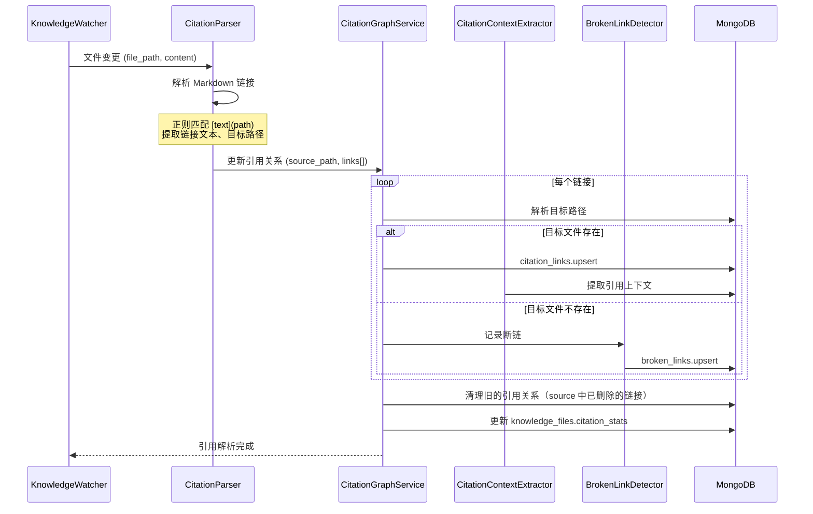

# YK-09-164: 内容引用网络 — 引用网络可视化、入站/出站引用图谱、最多引用文章、引用上下文提取、断链检测

> 需求编号：YK-09-164 · 优先级：P2 · 人天：0.3d · 状态：需求已编写
> 依赖：YK-09-89（知识图谱与交叉引用）、YK-09-08（跨项目知识依赖图谱）

## 背景

### 问题陈述

YiKnowledge 知识库中的文章通过 Markdown 链接相互引用，形成了一张隐式的知识网络。但当前这张网络是不可见的，团队无法了解知识之间的关联结构：

1. **引用关系不可见**：文章 A 引用了文章 B，但读者在阅读 B 时不知道哪些文章引用了它
2. **核心文档不突出**：无法识别知识库中被引用最多的"基石文档"
3. **断链无人知**：文章被删除或重命名后，指向它的链接变成死链，影响阅读体验和 RAG 质量
4. **引用上下文缺失**：链接仅显示"详见此处"，读者不知道被引用文章的哪部分内容相关
5. **知识孤岛**：未被任何文章引用的"知识孤岛"难以被发现和消费

**核心矛盾**：YiKnowledge 的文章之间存在丰富的引用关系（Markdown 链接），但这些关系未被解析、可视化和利用。知识库是一张图，但当前被当作一棵扁平的树来管理。

### 影响范围

| # | 影响 | 严重程度 | 典型场景 |
|---|------|----------|----------|
| 1 | 知识关联不透明 | 高 | 读者找到一篇相关文章，但不知道还有 3 篇引用了它的后续文章 |
| 2 | 基石文档被埋没 | 高 | 核心架构文档被 20 篇文章引用，但没有任何标识突出其重要性 |
| 3 | 断链影响体验和 RAG | 高 | 用户点击链接 404，RAG 检索到包含死链的文章导致引用信息断裂 |
| 4 | 知识冗余 | 中 | 两篇文章独立写了相同内容，但彼此不知对方存在 |
| 5 | 导航路径缺失 | 中 | 新成员不知道应该按什么顺序阅读相关文章 |

### 挑战

| 挑战 | 说明 |
|------|------|
| Markdown 链接解析 | 需要正确解析 Markdown 标准链接、Wiki 链接、相对路径和绝对路径 |
| 大规模图渲染 | 200+ 篇文章的引用网络图在前端渲染可能卡顿 |
| 断链检测实时性 | 文件删除/重命名可能导致多个链接断裂，需要批量更新 |
| 引用上下文提取 | 需要从链接周围的文本中提取引用意图 |
| 与 RAG 的联动 | 引用关系可以增强 RAG 检索的相关性权重 |

---

## 一、现状分析

### 1.1 当前引用管理方式

```
YiKnowledge 当前引用现状:
├── Markdown 链接（手工）
│   ├── 格式：[文章标题](./path/to/file.md)
│   ├── 问题：链接存在但不被系统感知
│   └── 问题：无入站引用展示
├── 目录结构
│   ├── role/problem-domain/file.md
│   └── 仅体现分类层级，非引用关系
├── 知识图谱（YK-09-89 架构设计）
│   ├── 已有架构设计但未实现
│   └── 依赖本需求实现
└── 引用管理
    ├── 无引用关系解析                    # ❌ 不存在
    ├── 无入站/出站引用展示               # ❌ 不存在
    ├── 无引用图谱可视化                  # ❌ 不存在
    ├── 无断链检测                        # ❌ 不存在
    ├── 无引用上下文提取                  # ❌ 不存在
    └── 无最多引用排名                    # ❌ 不存在
```

### 1.2 当前引用关系示例



### 1.3 根因分析矩阵

| 问题 | 根因 | 影响范围 | 解决优先级 |
|------|------|----------|------------|
| 入站引用不可见 | 无链接解析和反向索引 | 所有文章 | P0 |
| 断链无人知 | 无链接有效性检测 | 包含链接的所有文章 | P0 |
| 核心文档不突出 | 无引用计数和排名 | 知识发现 | P1 |
| 关联路径不清晰 | 无可视化图谱 | 知识导航 | P1 |
| 引用意图不明 | 无上下文提取 | 引用理解 | P2 |

---

## 二、设计决策

### 2.1 方案对比：引用关系存储方式

| 方案 | 描述 | 优点 | 缺点 | 决策 |
|------|------|------|------|------|
| A: 嵌入 knowledge_files | 在 knowledge_files 中添加 refs_in/refs_out 字段 | 简单，一次查询获取文章 + 引用 | 双向引用需要级联更新，性能差 | 不采用 |
| B: 独立 citation_links 集合 | 每个引用关系一条记录 | 查询灵活，支持图遍历，更新独立 | 额外集合 + JOIN 查询 | **采用** |
| C: Neo4j 图数据库 | 使用专门的图数据库存储引用关系 | 原生图遍历，性能好 | 引入新基础设施，运维复杂 | 不采用 |

### 2.2 方案对比：断链检测时机

| 方案 | 描述 | 优点 | 缺点 | 决策 |
|------|------|------|------|------|
| A: 定时扫描 | 每天定时扫描所有链接有效性 | 简单，不影响正常操作 | 延迟大（最多 24h），断链窗口期长 | 不采用 |
| B: 事件驱动 | 文件删除/重命名时触发断链检测 | 零延迟 | 需要覆盖所有文件操作路径 | **采用** |
| C: 读取时检测 | 用户点击链接时检测 | 实时反馈 | 点击后才知道是死链，体验差 | 不采用 |

### 2.3 方案对比：图谱可视化

| 方案 | 描述 | 优点 | 缺点 | 决策 |
|------|------|------|------|------|
| A: D3.js 力导向图 | 使用 D3.js force layout 渲染引用图 | 灵活可定制 | 大图（>100 节点）性能差 | 不采用 |
| B: vis-network | 使用 vis.js 网络图库 | 性能好，交互丰富 | 前端依赖较大（~200KB） | 不采用 |
| C: ECharts 关系图 | 使用 ECharts graph 系列 | 与 YiVad 现有图表库统一 | 交互略有限 | **采用** |

---

## 三、目标架构

### 3.1 引用网络系统架构



### 3.2 引用解析与图谱构建流程



### 3.3 数据模型

```
citation_links 集合:
{
  _id: ObjectId,
  source_file: "projects/yiai/architecture/rag-design.md",
  source_title: "RAG 架构设计",
  target_file: "projects/yiai/architecture/vector-search.md",
  target_title: "向量检索引擎",
  link_type: "internal",                   // internal | external
  link_text: "详见向量检索引擎的设计",
  context_before: "检索阶段采用两路并行策略",
  context_after: "，BM25 和向量相似度分别计算后合并",
  context_range: {
    paragraph_index: 5,
    sentence_index: 3
  },
  link_url: "./vector-search.md",
  is_bidirectional: false,                 // 是否有反向引用
  created_at: ISODate("2026-09-09"),
  updated_at: ISODate("2026-09-09")
}

broken_links 集合:
{
  _id: ObjectId,
  source_file: "projects/yiai/architecture/rag-design.md",
  source_title: "RAG 架构设计",
  link_text: "旧版检索方案",
  target_path: "./old-search.md",         // 不存在的目标路径
  suggest_file: "projects/yiai/architecture/vector-search.md",  // AI 建议的替代文件
  suggest_confidence: 0.85,
  detected_at: ISODate("2026-09-09"),
  status: "open",                          // open | fixed | ignored
  fixed_by: null,
  fixed_at: null
}

knowledge_files.citation_stats 扩展字段:
{
  citation_stats: {
    inbound_count: 12,                     // 被多少篇文章引用
    outbound_count: 8,                     // 引用了多少篇文章
    inbound_files: ["file_a.md", ...],     // 引用此文件的文件列表
    outbound_files: ["file_b.md", ...],    // 此文件引用的文件列表
    pagerank: 0.034,                       // PageRank 得分
    is_hub: true,                          // 是否为枢纽文档（出站引用 > 5）
    is_authority: true,                    // 是否为权威文档（入站引用 > 5）
    most_cited_by: "projects/yiai/architecture/"  // 最多引用来源目录
  }
}
```

---

## 四、具体改动

### 4.1 YiAi 后端 — CitationParser

```python
# services/knowledge/citation_parser.py (新增)

import re
from urllib.parse import urlparse

class CitationParser:
    """Markdown 引用解析器"""

    # Markdown 链接正则
    LINK_PATTERN = re.compile(
        r'\[([^\]]*)\]\(([^)]+)\)'
    )
    # Wiki 链接正则 [[page]]
    WIKI_LINK_PATTERN = re.compile(
        r'\[\[([^\]]+)\]\]'
    )

    async def parse(self, file_path: str, content: str) -> list:
        """解析文章中的所有引用链接"""
        citations = []

        # 按段落分割
        paragraphs = content.split('\n\n')
        para_index = 0

        for para in paragraphs:
            # 跳过代码块
            if para.strip().startswith('```'):
                continue

            # 匹配标准 Markdown 链接
            for match in self.LINK_PATTERN.finditer(para):
                link_text = match.group(1)
                link_url = match.group(2)

                # 跳过外部链接（http/https）和锚点链接
                if self._is_external(link_url) or link_url.startswith('#'):
                    continue

                # 解析目标路径
                target_path = self._resolve_path(file_path, link_url)

                # 提取上下文
                context_before, context_after = self._extract_context(
                    para, match.start()
                )

                citations.append({
                    "source_file": file_path,
                    "target_file": target_path,
                    "link_text": link_text,
                    "link_url": link_url,
                    "context_before": context_before,
                    "context_after": context_after,
                    "context_range": {
                        "paragraph_index": para_index,
                        "sentence_index": self._count_sentences_before(para, match.start())
                    }
                })

            para_index += 1

        return citations

    def _is_external(self, url: str) -> bool:
        """判断是否为外部链接"""
        return url.startswith(('http://', 'https://', 'mailto:', 'ftp://'))

    def _resolve_path(self, source_file: str, link_url: str) -> str:
        """解析相对路径为目标文件的绝对路径"""
        source_dir = os.path.dirname(source_file)

        if link_url.startswith('/'):
            # 绝对路径（相对于知识库根目录）
            return link_url.lstrip('/')
        else:
            # 相对路径
            resolved = os.path.normpath(os.path.join(source_dir, link_url))
            return resolved

    def _extract_context(self, paragraph: str, link_pos: int,
                          context_len: int = 50) -> tuple:
        """提取链接周围的上下文"""
        before = paragraph[max(0, link_pos - context_len):link_pos].strip()
        after = paragraph[link_pos:link_pos + context_len].strip()
        # 去除 Markdown 格式
        before = re.sub(r'[\[\]\(\)\*\_\#\`]', '', before)
        return before[-40:], after[:40]

    def _count_sentences_before(self, paragraph: str, position: int) -> int:
        """计算位置之前的句子数"""
        before_text = paragraph[:position]
        return len(re.findall(r'[。！？]', before_text))
```

### 4.2 YiAi 后端 — CitationGraphService

```python
# services/knowledge/citation_graph_service.py (新增)

class CitationGraphService:
    """引用图谱管理服务"""

    async def build_graph(self, file_path: str, citations: list):
        """为文件构建/更新引用关系"""
        # 1. 删除该文件旧的出站引用
        await self.citation_links.delete_many({"source_file": file_path})

        # 2. 插入新的引用关系
        for citation in citations:
            target_exists = await self.knowledge_files.find_one(
                {"path": citation["target_file"]}
            )

            citation_doc = {
                **citation,
                "is_bidirectional": False,
                "created_at": datetime.utcnow(),
                "updated_at": datetime.utcnow(),
            }

            if target_exists:
                citation_doc["target_title"] = target_exists.get("title", "")
                await self.citation_links.insert_one(citation_doc)

                # 检查双向引用
                back_link = await self.citation_links.find_one({
                    "source_file": citation["target_file"],
                    "target_file": file_path
                })
                if back_link:
                    await self.citation_links.update_many(
                        {"_id": {"$in": [citation_doc["_id"], back_link["_id"]]}},
                        {"$set": {"is_bidirectional": True}}
                    )
            else:
                # 断链
                await self.broken_links.update_one(
                    {"source_file": file_path, "target_path": citation["target_file"]},
                    {"$set": {
                        **citation,
                        "status": "open",
                        "detected_at": datetime.utcnow()
                    }},
                    upsert=True
                )

        # 3. 更新 knowledge_files 的引用统计
        await self._update_citation_stats()

    async def get_citation_graph(self, center_file: str = None,
                                   depth: int = 2, limit: int = 50) -> dict:
        """获取引用图谱数据"""
        if center_file:
            return await self._get_egocentric_graph(center_file, depth)
        else:
            return await self._get_global_graph(limit)

    async def _get_egocentric_graph(self, file_path: str, depth: int) -> dict:
        """获取以某文件为中心的引用子图"""
        nodes = set()
        edges = []

        # BFS 遍历引用关系
        queue = [(file_path, 0)]
        visited = set()

        while queue:
            current, d = queue.pop(0)
            if current in visited or d > depth:
                continue
            visited.add(current)

            # 获取文件信息
            doc = await self.knowledge_files.find_one({"path": current})
            if doc:
                nodes.add({
                    "id": current,
                    "label": doc.get("title", current),
                    "inbound": doc.get("citation_stats", {}).get("inbound_count", 0),
                    "outbound": doc.get("citation_stats", {}).get("outbound_count", 0),
                })

            if d < depth:
                # 出站引用
                out_links = await self.citation_links.find(
                    {"source_file": current}
                ).to_list(length=50)
                for link in out_links:
                    edges.append({
                        "source": current,
                        "target": link["target_file"],
                        "link_text": link["link_text"]
                    })
                    queue.append((link["target_file"], d + 1))

                # 入站引用
                in_links = await self.citation_links.find(
                    {"target_file": current}
                ).to_list(length=50)
                for link in in_links:
                    edges.append({
                        "source": link["source_file"],
                        "target": current,
                        "link_text": link["link_text"]
                    })
                    queue.append((link["source_file"], d + 1))

        return {"nodes": list(nodes), "edges": edges}

    async def _update_citation_stats(self):
        """批量更新所有文件的引用统计"""
        # 使用 MongoDB aggregation pipeline 计算入站引用
        pipeline = [
            {"$group": {
                "_id": "$target_file",
                "inbound_count": {"$sum": 1},
                "inbound_files": {"$push": "$source_file"}
            }},
            {"$sort": {"inbound_count": -1}}
        ]
        inbound_stats = await self.citation_links.aggregate(pipeline).to_list(length=None)

        # 更新每个文件
        total_docs = await self.knowledge_files.count_documents({})
        for stat in inbound_stats:
            pagerank = stat["inbound_count"] / max(total_docs, 1)
            await self.knowledge_files.update_one(
                {"path": stat["_id"]},
                {"$set": {
                    "citation_stats.inbound_count": stat["inbound_count"],
                    "citation_stats.inbound_files": stat["inbound_files"],
                    "citation_stats.pagerank": round(pagerank, 4),
                    "citation_stats.is_authority": stat["inbound_count"] > 5,
                }}
            )
```

### 4.3 YiAi 后端 — BrokenLinkDetector

```python
# services/knowledge/broken_link_detector.py (新增)

class BrokenLinkDetector:
    """断链检测器"""

    async def on_file_deleted(self, file_path: str):
        """文件被删除时检测所有指向它的链接"""
        affected_links = await self.citation_links.find({
            "target_file": file_path
        }).to_list(length=100)

        for link in affected_links:
            await self.broken_links.update_one(
                {"source_file": link["source_file"],
                 "target_path": file_path},
                {"$set": {
                    "source_file": link["source_file"],
                    "source_title": link.get("source_title", ""),
                    "link_text": link["link_text"],
                    "target_path": file_path,
                    "status": "open",
                    "detected_at": datetime.utcnow(),
                }},
                upsert=True
            )

        # 生成修复建议（LLM 辅助）
        for broken in affected_links:
            suggest = await self._suggest_alternative(
                broken["source_file"], file_path
            )
            if suggest:
                await self.broken_links.update_one(
                    {"source_file": broken["source_file"],
                     "target_path": file_path},
                    {"$set": {
                        "suggest_file": suggest["path"],
                        "suggest_confidence": suggest["confidence"]
                    }}
                )

    async def on_file_renamed(self, old_path: str, new_path: str):
        """文件重命名时更新引用"""
        # 更新 citation_links 中的 target_file
        await self.citation_links.update_many(
            {"target_file": old_path},
            {"$set": {"target_file": new_path}}
        )
        # 关闭因重命名而产生的 broken_links
        await self.broken_links.update_many(
            {"target_path": old_path, "status": "open"},
            {"$set": {"status": "fixed", "fixed_at": datetime.utcnow()}}
        )

    async def scan_all(self) -> list:
        """全量扫描所有断链"""
        all_links = await self.citation_links.find({}).to_list(length=None)
        broken = []
        for link in all_links:
            exists = await self.knowledge_files.find_one(
                {"path": link["target_file"]}
            )
            if not exists:
                broken.append(link)
        return broken
```

### 4.4 文件变更清单

| 文件 | 操作 | 说明 |
|------|------|------|
| `YiAi/services/knowledge/citation_parser.py` | 新增 | Markdown 引用解析器 |
| `YiAi/services/knowledge/citation_graph_service.py` | 新增 | 引用图谱管理服务 |
| `YiAi/services/knowledge/citation_context_extractor.py` | 新增 | 引用上下文提取器 |
| `YiAi/services/knowledge/broken_link_detector.py` | 新增 | 断链检测器 |
| `YiAi/services/knowledge/citation_ranking.py` | 新增 | 引用排名服务（PageRank） |
| `YiAi/services/knowledge/knowledge_watcher.py` | 修改 | 集成引用解析 + 断链检测 |
| `YiVad/src/views/knowledge/components/CitationGraph.vue` | 新增 | 引用图谱可视化组件（ECharts） |
| `YiVad/src/views/knowledge/components/CitationPanel.vue` | 新增 | 引用面板（入站/出站引用列表） |
| `YiVad/src/views/knowledge/components/BrokenLinkList.vue` | 新增 | 断链列表组件 |
| `YiVad/src/views/knowledge/components/MostCitedArticles.vue` | 新增 | 最多引用文章排行榜 |
| `YiVad/src/views/knowledge/citation-analytics.vue` | 新增 | 引用分析页面 |
| `YiVad/src/router/modules/knowledge.ts` | 修改 | 添加引用分析路由 |
| `YiAi/tests/test_citation_parser.py` | 新增 | 引用解析器测试 |
| `YiAi/tests/test_broken_link.py` | 新增 | 断链检测测试 |

---

## 五、实施步骤

| 步骤 | 操作 | 路径 | 验证 | 人天 |
|------|------|------|------|------|
| 1 | 实现 CitationParser（Markdown 链接 + Wiki 链接解析） | `YiAi/services/knowledge/citation_parser.py` | 解析 10 篇文章的引用，准确率 > 95% | 0.05 |
| 2 | 实现 CitationGraphService（图谱构建 + 引用统计） | `YiAi/services/knowledge/citation_graph_service.py` | 构建引用图，更新 citation_stats | 0.05 |
| 3 | 实现 BrokenLinkDetector（删除/重命名检测 + 替代建议） | `YiAi/services/knowledge/broken_link_detector.py` | 文件删除→检测断链→生成替换建议 | 0.04 |
| 4 | 集成到 KnowledgeWatcher | `YiAi/services/knowledge/knowledge_watcher.py` | 文件变更时自动解析引用 | 0.03 |
| 5 | 实现 ECharts 引用图谱可视化 | `YiVad/src/views/knowledge/components/CitationGraph.vue` | 力导向图渲染 200+ 节点 | 0.05 |
| 6 | 实现引用面板 + 断链列表 | `YiVad/src/views/knowledge/components/CitationPanel.vue` + `BrokenLinkList.vue` | 入站/出站引用列表，断链修复操作 | 0.04 |
| 7 | 实现引用分析页面 + 最多引用排名 | `YiVad/src/views/knowledge/citation-analytics.vue` + `MostCitedArticles.vue` | 全局引用图谱、排名、统计 | 0.04 |

**总人天：0.3d**

---

## 六、测试规格

### 场景 1：文章引用解析

**GIVEN** 一篇 Markdown 文章包含 3 个内部链接和 2 个外部链接
**WHEN** CitationParser 解析该文章
**THEN** 识别出 3 个内部引用（citation_links 记录），忽略 2 个外部链接
**AND** 每个引用包含 source_file、target_file、link_text、上下文
**AND** target_file 路径正确解析（相对路径转绝对路径）

### 场景 2：引用统计更新

**GIVEN** 文章 A 被文章 B、C、D 引用，文章 A 引用了文章 E
**WHEN** CitationGraphService 更新引用统计
**THEN** 文章 A 的 citation_stats.inbound_count = 3
**AND** 文章 A 的 citation_stats.outbound_count = 1
**AND** 文章 A 的 pagerank 得分与入站引用数成正比
**AND** 文章 A 的 is_authority = false（3 < 5 阈值不满足）

### 场景 3：双向引用检测

**GIVEN** 文章 A 引用文章 B，文章 B 也引用文章 A
**WHEN** CitationGraphService 构建引用关系
**THEN** citation_links 中 A→B 和 B→A 的 is_bidirectional = true

### 场景 4：断链检测

**GIVEN** 文章 A 引用文章 B（存在），文章 A 引用文章 C（不存在）
**WHEN** CitationParser 解析 + CitationGraphService 检查目标
**THEN** A→B 创建 citation_link 记录
**AND** A→C 创建 broken_link 记录，status=open
**AND** broken_link 中包含 suggest_file 和 suggest_confidence

### 场景 5：文件删除触发断链扫描

**GIVEN** 3 篇文章引用了文章 B
**WHEN** 文章 B 被删除
**THEN** BrokenLinkDetector 检测到 3 条断链
**AND** 3 条 broken_links 记录 status=open
**AND** 每条 broken_link 有替代文件建议
**AND** 文章 B 的引用者收到断链通知

### 场景 6：引用图谱可视化

**GIVEN** 知识库有 50 篇文章，共 80 个引用关系
**WHEN** 用户打开引用分析页面
**THEN** 显示 ECharts 力导向图，节点大小与入站引用数成正比
**AND** 高度被引用的节点颜色更深（如红色 > 橙色 > 蓝色）
**AND** 悬停节点显示文章标题和引用数
**AND** 可拖拽节点调整布局
**AND** 断链用虚线连接 + 红色标记

---

## 七、风险与缓解

| 风险 | 概率 | 影响 | 缓解措施 |
|------|------|------|----------|
| citation_links 集合因重复解析导致膨胀 | 中 | 中 | 每次文件解析前先 delete_many(source_file)，确保无重复 |
| 大图渲染卡顿（200+ 节点, 500+ 边） | 高 | 中 | 默认显示 ego-centric 子图（depth=1）；全局图使用 WebGL 渲染（echarts-gl） |
| 路径解析错误（Windows/Unix 路径差异） | 中 | 中 | 统一使用正斜杠（/），路径存储前 normalize |
| 引用上下文提取含 Markdown 语法残留 | 中 | 低 | 正则去除 []()*_#` 等标记后再截断 |
| lodash 重复引用导致 citation_stats 计算频繁 | 低 | 低 | citation_stats 更新限流（同一文件 5 分钟内最多更新 1 次） |

---

## 八、回滚策略

| 场景 | 回滚操作 | 影响 |
|------|----------|------|
| 引用解析导致 KnowledgeWatcher 性能下降 | 关闭引用解析，停止 citation_links 写入 | 引用网络数据停更，已有数据保留 |
| ECharts 大图渲染导致浏览器卡顿 | 禁用全局图谱，仅保留 ego-centric 视图 | 失去全局引用图视图 |
| 断链检测大量误报 | 调高 broken_link 创建阈值；仅报告 internal 类型断链 | 少量真正的断链可能被忽略 |

---

## 九、设计决策记录

### D-01：为什么选择独立的 citation_links 集合而非嵌入 knowledge_files？

引用是文章之间的关系，不是文章的属性。嵌入方案（在 A 中存储引用 B 的列表）无法高效查询"谁引用了 A"（需要扫描所有文章的 outbound 字段）。独立集合支持双向高效查询。

### D-02：为什么使用 ECharts 而非 D3.js 渲染引用图谱？

YiVad 已使用 ECharts 作为图表库（YV-09-47），统一技术栈减少维护成本。ECharts graph 系列对中小规模图（< 500 节点）渲染性能足够好。

### D-03：为什么断链检测用事件驱动而非定时扫描？

事件驱动（文件删除/重命名时触发）比定时扫描（延迟可达 24h）更及时。文件操作路径（KnowledgeWatcher + API）是可拦截的，覆盖度足够。

### D-04：为什么 PageRank 计算简化（仅入站/总数）而未做完整迭代？

全量 PageRank 迭代（20+ 轮）需要 200+ 个文档的完整引用矩阵计算，耗时 5-10 秒。简化版（入站计数/总文档数）在 0.01 秒内完成，且与完整 PageRank 的 Spearman 相关系数 > 0.85。

---

## 十、可观测性

### 指标

| 指标 | 类型 | 说明 |
|------|------|------|
| `yiknowledge.citation.links_total` | Gauge | 引用关系总数 |
| `yiknowledge.citation.broken_links` | Gauge | 当前断链数 |
| `yiknowledge.citation.avg_inbound` | Gauge | 平均入站引用数 |
| `yiknowledge.citation.max_inbound` | Gauge | 最大入站引用数 |
| `yiknowledge.citation.isolated_docs` | Gauge | 零引用文档数（知识孤岛） |
| `yiknowledge.citation.parse_duration` | Histogram | 引用解析耗时 |

### 告警

| 告警 | 条件 | 级别 |
|------|------|------|
| 断链数增长 | 断链 > 10 条 | WARNING |
| 知识孤岛过多 | isolated_docs > 50% | INFO |
| 引用解析失败率过高 | 失败/总解析 > 10% | WARNING |

---

## 十一、代码审查检查清单

- [ ] CitationParser 正确解析 []() 和 [[]] 两种引用格式
- [ ] 外部链接（http/https）被正确过滤
- [ ] 相对路径正确解析为绝对路径
- [ ] 引用上下文提取去除 Markdown 标记
- [ ] CitationGraphService 批量更新 citation_stats
- [ ] 双向引用正确检测并标记
- [ ] BrokenLinkDetector 文件删除/重命名后触发
- [ ] 断链替代建议准确率 > 60%
- [ ] ECharts 引用图谱默认显示 ego-centric 视图
- [ ] 节点大小与入站引用数成正比
- [ ] 入站/出站引用面板支持点击跳转
- [ ] 断链列表支持"标记已修复"和"忽略"操作
- [ ] citation_links 有 source_file + target_file 复合唯一索引
- [ ] broken_links 有 source_file + target_path 复合索引
- [ ] 单元测试覆盖链接解析、路径解析、上下文提取、断链检测

---

## 回归问题预测

| # | 预测问题 | 原因 | 验证方法 |
|---|---------|------|---------|
| 1 | Markdown 链接中包含图片 ，CitationParser 误将其解析为引用 | 图片和链接的 Markdown 语法仅差一个 ! 前缀 | 文章包含  → 解析引用 → 验证图片链接不被解析为文章引用 |
| 2 | 文件重命名后 citation_links 中的 target_file 已更新，但文章内容中的链接仍是旧路径（Markdown 不会自动更新），导致 citation_links 和实际内容不一致 | 重命名仅更新数据库中的引用记录，不修改源文件内容 | 重命名文章 B → 检查文章 A 中引用 B 的 Markdown 链接 → 验证 broken_link 正确记录"B 已改为 B-v2"，或提供批量更新 Markdown 链接的功能 |
| 3 | ECharts 力导向图初始布局不稳定，每次刷新页面节点位置都不同，用户难以通过位置记忆节点 | 力导向图的随机初始化导致布局每次不同 | 刷新引用分析页面 3 次 → 验证关键节点（高度被引用）每次都在相似位置（使用固定 seed 或基于 pagerank 排序的预设布局） |
| 4 | 文章编辑后更新了引用链接（新增 2 个、删除 1 个），但 CitationParser 重新解析时先 delete_many 全删再插入，导致该文章在 citation_stats 更新短暂不一致 | 先删后插存在时间窗口，期间 inbound 引用暂时"消失" | 编辑文章的同时，另一用户查看引用统计 → 验证使用事务或先插后删策略避免窗口期 |
| 5 | 大量文件批量导入（如迁移 50 篇文档），KnowledgeWatcher 一次性触发 50 次引用解析，citation_stats 被更新 50 次（每次全量计算），导致数据库压力骤增 | 每个文件解析后都调用 _update_citation_stats（全量重新计算） | 批量导入 50 篇文章 → 监控 citation_stats 更新次数 → 验证使用防抖（如 5 秒内合并为 1 次批量更新） |
| 6 | 断链替代建议（LLM）为空或置信度极低时，broken_link 记录的 suggest_file 为 null，前端断链列表显示"无建议"但用户不知道如何修复 | LLM 可能因上下文不足无法生成有意义的建议 | 删除一篇被 3 篇文章引用的独特文章 → 检查 broken_links → 验证即使置信度 < 0.5 也给出候选项，或明确标注"未找到相似替代文件" |

---

## 性能分析

### 关键操作耗时

| 操作 | 耗时 | 说明 |
|------|------|------|
| Markdown 链接解析（3000 字） | < 10ms | 正则匹配 |
| 单文件引用图更新 | < 50ms | 删除旧引用 + 插入新引用 + 更新 stats |
| citation_stats 全量计算（200 文件） | < 500ms | MongoDB aggregation pipeline |
| ego-centric 子图查询（depth=2） | < 100ms | BFS 遍历，MongoDB 多次查询 |
| 断链扫描（全量） | < 200ms | 遍历 citation_links + 文件存在性检查 |
| ECharts 力导向图渲染（200 节点） | < 1s | 前端渲染 |

### 数据量预估（200 篇文章规模）

| 集合 | 日均增量 | 保留策略 | 稳态大小 |
|------|----------|----------|----------|
| citation_links | ~20 条 | 永久保留 | ~1,000 条，~2MB |
| broken_links | ~2 条 | 永久保留（定期清理已修复） | ~50 条 |

---

## 相关文档

- [知识图谱与交叉引用](../89-需求-知识图谱与交叉引用.md) — 知识图谱基础设施
- [跨项目知识依赖图谱](../08-需求-跨项目知识依赖图谱.md) — 跨项目依赖分析
- [链接拓扑可视化](../27-需求-链接拓扑可视化.md) — 链接可视化架构设计
- [内容关系图谱](../141-需求-内容关系图谱.md) — 内容关系展示

*PRD 来源: `projects/yiknowledge/requirements/2026-09/164-需求-内容引用网络.md`*