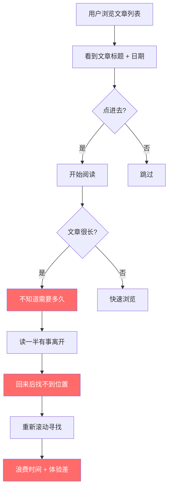
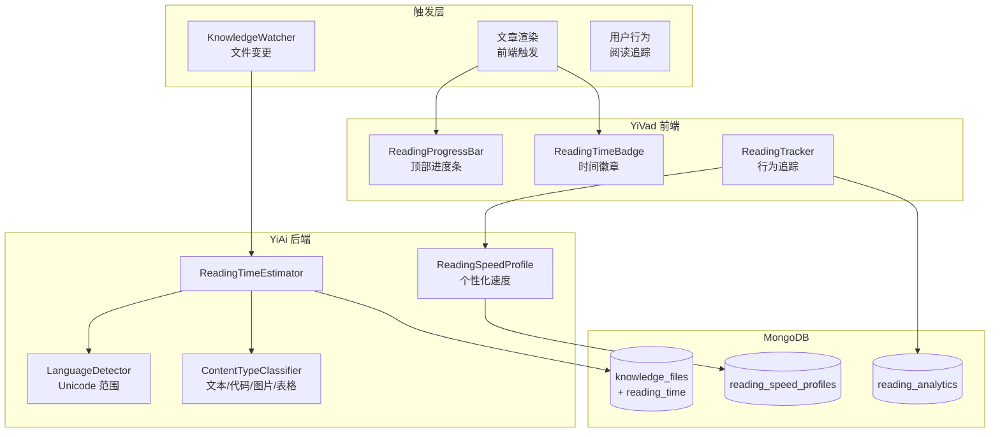
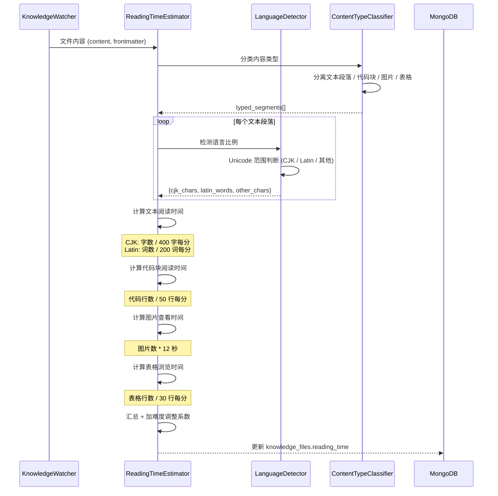

# YK-09-165: 内容阅读时间估算 — 语言感知阅读时间、代码块调整、图片查看时间、个性化阅读速度、阅读进度条

> 需求编号：YK-09-165 · 优先级：P2 · 人天：0.3d · 状态：需求已编写
> 依赖：YK-09-161（内容词汇难度分析）、YK-09-162（内容自动化摘要）

## 背景

### 问题陈述

YiKnowledge 知识库包含数百篇技术文档，长度从 500 字到 10000+ 字不等。用户在开始阅读前需要判断一篇文章需要投入多少时间，但当前缺少任何阅读时间估算：

1. **时间预估缺失**：用户打开 8000 字架构文档时不知道需要 20 分钟还是 50 分钟
2. **CJK 和 Latin 字符差异**：中文字符阅读速度与英文不同，简单除以字数不准确
3. **代码块耗时不同**：代码块需要逐行理解，阅读速度远慢于叙述文本
4. **无阅读进度**：长文章阅读到一半离开，回来时不知道从哪继续
5. **阅读速度一刀切**：所有用户使用相同阅读速度，不区分新手和专家

**核心矛盾**：文章列表页应该像 Medium/Dev.to 一样显示"X 分钟阅读"，但简单的"字数/200"公式对中英混合的技术文档极不准确，导致用户被误导（显示 5 分钟实际花了 15 分钟）。

### 影响范围

| # | 影响 | 严重程度 | 典型场景 |
|---|------|----------|----------|
| 1 | 阅读时间被低估 3-5 倍 | 高 | 技术文档有大量代码块，显示 3 分钟实际需 12 分钟 |
| 2 | 无法规划阅读时间 | 高 | 用户想利用午休 30 分钟阅读，但不知道能读几篇 |
| 3 | 长文档阅读中断后难恢复 | 中 | 读到 60% 离开，回来时从头滚到中断位置 |
| 4 | 所有用户同样速度 | 中 | 新手读技术文档慢于专家，同样字数时间不同 |
| 5 | 图片查看时间被忽略 | 低 | 文章中的架构图需要 30 秒理解，但未计入阅读时间 |

### 挑战

| 挑战 | 说明 |
|------|------|
| CJK vs Latin 字符混合 | 中文按"字"计，英文按"词"计，混合文本需要字符级语言检测 |
| 代码块处理 | 代码块阅读速度远慢于自然语言（约 1/3），但不同语言（Python vs 汇编）差异大 |
| 阅读速度个性化 | 需要收集用户实际阅读时间，但隐私和准确性需要权衡 |
| 进度条 UX | 进度条要准确但不能打扰阅读体验 |
| 移动端适配 | 移动端屏幕小，进度条不能占用过多空间 |

---

## 一、现状分析

### 1.1 当前阅读时间估算方式

```
YiKnowledge 当前阅读时间现状:
├── 无阅读时间估算
│   ├── 文章列表仅显示标题 + 日期
│   └── 用户无法预判阅读时间
├── 无阅读进度
│   ├── 浏览器默认滚动条（不精确）
│   └── 无章节级进度指示
├── 无个性化阅读速度
│   ├── 无用户阅读速度数据收集
│   └── 无阅读速度学习
└── 目标状态
    ├── 文章列表显示"约 X 分钟"          # ❌ 不存在
    ├── 代码块时间单独计算               # ❌ 不存在
    ├── 图片查看时间计入                 # ❌ 不存在
    ├── 个性化阅读速度                   # ❌ 不存在
    └── 阅读进度条                       # ❌ 不存在
```

### 1.2 当前阅读体验流程



### 1.3 根因分析矩阵

| 问题 | 根因 | 影响范围 | 解决优先级 |
|------|------|----------|------------|
| 无法预估阅读时间 | 无字数统计 + 阅读速度模型 | 文章列表和详情页 | P0 |
| 代码块时间未区分 | 代码/文本使用同一速度公式 | 包含代码的技术文档 | P0 |
| 阅读进度不精确 | 仅有浏览器原生滚动条 | 长文档阅读 | P1 |
| 阅读速度无个性化 | 无用户行为数据收集 | 阅读时间准确性 | P1 |
| 图片时间忽略 | 图片不计入阅读时间 | 图多的文档 | P2 |

---

## 二、设计决策

### 2.1 方案对比：阅读速度基准

| 方案 | 描述 | 优点 | 缺点 | 决策 |
|------|------|------|------|------|
| A: 固定比值 | 中文 400 字/分，英文 200 词/分 | 简单，零成本 | 不区分文本类型和用户差异 | 不采用 |
| B: 内容感知 | 中文 400 字/分，英文 200 词/分，代码 50 行/分，图片 12 秒/张 | 考虑了内容类型差异 | 不同用户速度仍不同 | **采用作为默认** |
| C: 个性化学习 | 收集用户实际阅读时间，学习个人阅读速度 | 最准确 | 需要隐私授权 + 数据积累 | 可选增强 |

### 2.2 方案对比：语言检测方式

| 方案 | 描述 | 优点 | 缺点 | 决策 |
|------|------|------|------|------|
| A: 字符级检测 | 逐字符判断 Unicode 范围（CJK vs Latin） | 精确，可统计混合比例 | 略微增加计算量 | **采用** |
| B: 段落级检测 | 整段判断主要语言 | 简单 | 中英混排段落不准确 | 不采用 |
| C: 无检测 | 全文按中文速度计算 | 最简单 | 英文技术文档被严重低估 | 不采用 |

### 2.3 方案对比：阅读进度条实现

| 方案 | 描述 | 优点 | 缺点 | 决策 |
|------|------|------|------|------|
| A: 顶部进度条 | 页面顶部固定横条，滚动时更新宽度 | 简单，Medium 风格 | 无法显示章节进度 | **采用** |
| B: 侧边进度指示器 | 右侧固定导航点，标识章节位置 | 可显示章节结构 | 占用侧边空间 | 不采用 |
| C: 滚动条增强 | 美化浏览器原生滚动条 | 简单 | 不准确（不区分内容密度） | 不采用 |

---

## 三、目标架构

### 3.1 阅读时间估算系统架构



### 3.2 阅读时间计算流程



### 3.3 数据模型

```
knowledge_files.reading_time 扩展字段:
{
  reading_time: {
    // 总览
    total_minutes: 12.5,                      // 总阅读时间（分钟）
    total_seconds: 750,                       // 总阅读时间（秒）
    display_text: "约 13 分钟",               // 显示文本

    // 分项
    breakdown: {
      text_minutes: 6.2,                      // 纯文本阅读时间
      code_minutes: 4.8,                      // 代码块阅读时间
      image_minutes: 1.0,                     // 图片查看时间
      table_minutes: 0.5,                     // 表格浏览时间
    },

    // 语言统计
    language_stats: {
      cjk_chars: 3200,                        // 中文字符数
      latin_words: 450,                       // 英文单词数
      cjk_ratio: 0.78,                        // 中文占比
      latin_ratio: 0.22,                      // 英文占比
    },

    // 内容统计
    content_stats: {
      total_lines: 420,
      code_lines: 145,
      code_blocks: 5,
      images: 5,
      tables: 2,
      table_rows: 45,
      paragraphs: 28,
    },

    // 难度调整
    difficulty_adjustment: 1.15,              // 难度调整系数（基于 YK-09-161）
    base_minutes: 10.9,                       // 未调整的基础时间
    adjusted_minutes: 12.5,                   // 调整后的时间

    // 元数据
    calculated_at: ISODate("2026-09-09"),
    speed_profile: "default",                 // default | personalized:{user_id}
  }
}

reading_speed_profiles 集合:
{
  _id: ObjectId,
  user_id: "user_001",
  speeds: {
    cjk_chars_per_minute: 480,               // 个人中文阅读速度
    latin_words_per_minute: 250,             // 个人英文阅读速度
    code_lines_per_minute: 65,               // 个人代码阅读速度
    image_seconds: 8,                         // 个人图片查看时间
  },
  sample_count: 45,                           // 样本数（数据可信度）
  confidence: 0.82,                           // 置信度
  last_updated: ISODate("2026-09-09"),
  history: [
    { date: "2026-08", cjk: 450 },
    { date: "2026-09", cjk: 480 },
  ]
}

reading_analytics 集合:
{
  _id: ObjectId,
  user_id: "user_001",
  file_path: "projects/yiai/architecture/rag-design.md",
  session_id: "sess_xyz",
  estimated_minutes: 12.5,
  actual_seconds: 680,                       // 实际阅读时间
  scroll_depth: 0.92,                        // 滚动深度 (0-1)
  completion_rate: 0.92,                     // 完成率
  started_at: ISODate("2026-09-09T10:00:00Z"),
  ended_at: ISODate("2026-09-09T10:11:20Z"),
  pauses: [
    { at: "2026-09-09T10:05:00Z", duration_seconds: 30 }
  ]
}
```

---

## 四、具体改动

### 4.1 YiAi 后端 — LanguageDetector

```python
# services/knowledge/language_detector.py (新增)

import re
import unicodedata

class LanguageDetector:
    """Unicode 范围语言检测器"""

    # Unicode 范围定义
    CJK_RANGES = [
        (0x4E00, 0x9FFF),    # CJK 统一汉字
        (0x3400, 0x4DBF),    # CJK 扩展 A
        (0x20000, 0x2A6DF),  # CJK 扩展 B
        (0xF900, 0xFAFF),    # CJK 兼容汉字
        (0x3040, 0x309F),    # 平假名
        (0x30A0, 0x30FF),    # 片假名
        (0xAC00, 0xD7AF),    # 韩文
    ]

    LATIN_RANGES = [
        (0x0041, 0x005A),    # A-Z
        (0x0061, 0x007A),    # a-z
    ]

    def analyze(self, text: str) -> dict:
        """分析文本的语言组成"""
        cjk_chars = 0
        latin_chars = 0
        other_chars = 0
        latin_words = 0

        # 统计 Latin 单词数
        words = re.findall(r'[a-zA-Z]+', text)
        latin_words = len(words)

        for char in text:
            code_point = ord(char)
            if self._in_ranges(code_point, self.CJK_RANGES):
                cjk_chars += 1
            elif self._in_ranges(code_point, self.LATIN_RANGES):
                latin_chars += 1
            elif not char.isspace() and not self._is_punctuation(char):
                other_chars += 1

        total = cjk_chars + latin_chars + other_chars
        return {
            "cjk_chars": cjk_chars,
            "latin_chars": latin_chars,
            "latin_words": latin_words,
            "other_chars": other_chars,
            "cjk_ratio": round(cjk_chars / total, 4) if total > 0 else 0,
            "latin_ratio": round(latin_chars / total, 4) if total > 0 else 0,
            "primary_language": "cjk" if cjk_chars > latin_chars else
                                 "latin" if latin_chars > cjk_chars else "mixed"
        }

    def _in_ranges(self, code_point: int, ranges: list) -> bool:
        """检查码点是否在给定的 Unicode 范围内"""
        return any(start <= code_point <= end for start, end in ranges)

    def _is_punctuation(self, char: str) -> bool:
        """判断是否为标点符号"""
        category = unicodedata.category(char)
        return category.startswith('P')
```

### 4.2 YiAi 后端 — ReadingTimeEstimator

```python
# services/knowledge/reading_time_estimator.py (新增)

class ReadingTimeEstimator:
    """阅读时间估算器"""

    # 默认阅读速度
    DEFAULT_SPEEDS = {
        "cjk_chars_per_minute": 400,       # 中文：400 字/分钟
        "latin_words_per_minute": 200,     # 英文：200 词/分钟
        "code_lines_per_minute": 50,       # 代码：50 行/分钟
        "image_seconds": 12,               # 图片：12 秒/张
        "table_rows_per_minute": 30,       # 表格：30 行/分钟
    }

    def __init__(self):
        self.lang_detector = LanguageDetector()
        self.content_classifier = ContentTypeClassifier()

    async def estimate(self, content: str, difficulty_score: float = 1.0,
                        user_id: str = None) -> dict:
        """估算阅读时间"""
        # 分类内容
        segments = self.content_classifier.classify(content)

        # 统计
        text_content = ' '.join(segments["texts"])
        code_lines = segments["code_lines"]
        image_count = segments["image_count"]
        table_rows = segments["table_rows"]

        # 语言分析
        lang_stats = self.lang_detector.analyze(text_content)

        # 获取阅读速度
        speeds = await self._get_speeds(user_id) if user_id \
                 else self.DEFAULT_SPEEDS

        # 计算各部分时间
        text_minutes = (
            lang_stats["cjk_chars"] / speeds["cjk_chars_per_minute"] +
            lang_stats["latin_words"] / speeds["latin_words_per_minute"]
        )
        code_minutes = code_lines / speeds["code_lines_per_minute"]
        image_minutes = (image_count * speeds["image_seconds"]) / 60
        table_minutes = table_rows / speeds["table_rows_per_minute"]

        base_minutes = text_minutes + code_minutes + image_minutes + table_minutes

        # 难度调整（基于 YK-09-161 的词汇难度评分）
        adjustment = 1.0 + (difficulty_score - 0.5) * 0.3  # 难度 0→0.85x, 1→1.15x
        adjusted_minutes = base_minutes * adjustment

        reading_time = {
            "total_minutes": round(adjusted_minutes, 1),
            "display_text": self._format_display(adjusted_minutes),
            "breakdown": {
                "text_minutes": round(text_minutes, 2),
                "code_minutes": round(code_minutes, 2),
                "image_minutes": round(image_minutes, 2),
                "table_minutes": round(table_minutes, 2),
            },
            "language_stats": lang_stats,
            "content_stats": {
                "total_lines": segments["total_lines"],
                "code_lines": code_lines,
                "code_blocks": segments["code_block_count"],
                "images": image_count,
                "tables": segments["table_count"],
                "table_rows": table_rows,
                "paragraphs": len(segments["texts"]),
            },
            "difficulty_adjustment": round(adjustment, 2),
            "base_minutes": round(base_minutes, 1),
            "adjusted_minutes": round(adjusted_minutes, 1),
            "speed_profile": f"personalized:{user_id}" if user_id else "default",
        }

        return reading_time

    def _format_display(self, minutes: float) -> str:
        """格式化显示文本"""
        if minutes < 1:
            return "不到 1 分钟"
        elif minutes < 2:
            return "约 1 分钟"
        elif minutes < 60:
            return f"约 {round(minutes)} 分钟"
        else:
            hours = int(minutes // 60)
            mins = round(minutes % 60)
            return f"约 {hours} 小时 {mins} 分钟"

    async def _get_speeds(self, user_id: str) -> dict:
        """获取用户个性化阅读速度"""
        profile = await self.reading_speed_profiles.find_one(
            {"user_id": user_id}
        )
        if profile and profile.get("confidence", 0) > 0.6:
            # 使用个性化速度（与默认速度混合，避免过度依赖少量样本）
            alpha = min(profile["confidence"], 0.8)
            speeds = {}
            for key in self.DEFAULT_SPEEDS:
                speeds[key] = (
                    alpha * profile["speeds"].get(key, self.DEFAULT_SPEEDS[key]) +
                    (1 - alpha) * self.DEFAULT_SPEEDS[key]
                )
            return speeds
        return self.DEFAULT_SPEEDS
```

### 4.3 YiAi 后端 — ContentTypeClassifier

```python
# services/knowledge/content_type_classifier.py (新增)

import re

class ContentTypeClassifier:
    """内容类型分类器 — 分离文本、代码、图片、表格"""

    CODE_BLOCK_PATTERN = re.compile(r'```[\s\S]*?```')
    IMAGE_PATTERN = re.compile(r'!\[.*?\]\(.*?\)')
    TABLE_PATTERN = re.compile(r'^\|.*\|$', re.MULTILINE)

    def classify(self, content: str) -> dict:
        """分类内容中的不同元素"""
        lines = content.split('\n')

        # 提取代码块
        code_blocks = self.CODE_BLOCK_PATTERN.findall(content)
        code_lines = sum(len(block.split('\n')) - 2 for block in code_blocks)
        code_block_count = len(code_blocks)

        # 移除代码块后的纯文本
        text_without_code = self.CODE_BLOCK_PATTERN.sub('', content)

        # 提取图片
        images = self.IMAGE_PATTERN.findall(content)
        image_count = len(images)

        # 提取表格
        table_lines = [l for l in lines if self.TABLE_PATTERN.match(l)]
        table_rows = len(table_lines) - 1 if table_lines else 0  # 减表头
        table_count = len(re.findall(r'^\|[-| ]+\|$', text_without_code, re.MULTILINE))

        # 提取纯文本段落（非空、非标题、非代码、非表格）
        text_paragraphs = []
        for line in text_without_code.split('\n'):
            line = line.strip()
            if (line and
                not line.startswith('#') and
                not line.startswith('```') and
                not line.startswith('|') and
                not line.startswith('![') and
                not line.startswith('- [') and
                len(line) > 10):
                # 去除 Markdown 标记
                clean = re.sub(r'[\[\]\(\)\*\_\`\~\>]', '', line)
                if clean.strip():
                    text_paragraphs.append(clean)

        return {
            "texts": text_paragraphs,
            "code_lines": code_lines,
            "code_block_count": code_block_count,
            "image_count": image_count,
            "table_rows": table_rows,
            "table_count": table_count,
            "total_lines": len(lines),
        }
```

### 4.4 YiVad 前端 — ReadingProgressBar

```typescript
// src/components/knowledge/ReadingProgressBar.vue (新增)

// <template>
//   <div class="reading-progress-bar" :class="{ hidden: !isVisible }">
//     <div class="progress-track">
//       <div class="progress-fill" :style="{ width: progressPercent + '%' }" />
//     </div>
//     <div class="progress-label" v-if="showLabel">
//       {{ progressPercent }}%
//     </div>
//   </div>
// </template>
//
// <script setup lang="ts">
// import { ref, onMounted, onUnmounted } from 'vue';
//
// const props = defineProps<{
//   contentSelector?: string;
//   showLabel?: boolean;
// }>();
//
// const progressPercent = ref(0);
// const isVisible = ref(false);
//
// let scrollHandler: () => void;
//
// const calculateProgress = () => {
//   const contentEl = document.querySelector(
//     props.contentSelector || '.article-content'
//   );
//   if (!contentEl) return;
//
//   const rect = contentEl.getBoundingClientRect();
//   const contentHeight = rect.height;
//   const viewportHeight = window.innerHeight;
//   const scrollableHeight = contentHeight - viewportHeight;
//
//   if (scrollableHeight <= 0) {
//     progressPercent.value = 100;
//     return;
//   }
//
//   const scrolled = Math.abs(rect.top);
//   progressPercent.value = Math.min(
//     Math.round((scrolled / scrollableHeight) * 100),
//     100
//   );
//
//   isVisible.value = rect.top < 0;
// };
//
// onMounted(() => {
//   scrollHandler = () => requestAnimationFrame(calculateProgress);
//   window.addEventListener('scroll', scrollHandler, { passive: true });
//   calculateProgress();
// });
//
// onUnmounted(() => {
//   window.removeEventListener('scroll', scrollHandler);
// });
// </script>
//
// <style scoped>
// .reading-progress-bar {
//   position: fixed;
//   top: 0;
//   left: 0;
//   width: 100%;
//   height: 3px;
//   z-index: 1000;
//   background: transparent;
// }
//
// .progress-track {
//   width: 100%;
//   height: 100%;
//   background: var(--td-bg-color-component);
// }
//
// .progress-fill {
//   height: 100%;
//   background: linear-gradient(90deg,
//     var(--td-brand-color-6),
//     var(--td-brand-color-8));
//   transition: width 0.15s ease;
// }
//
// .progress-label {
//   position: absolute;
//   right: 16px;
//   top: 8px;
//   font-size: 12px;
//   color: var(--td-text-color-secondary);
//   background: var(--td-bg-color-container);
//   padding: 2px 8px;
//   border-radius: 10px;
//   box-shadow: 0 1px 4px rgba(0,0,0,0.1);
// }
// </style>
```

### 4.5 文件变更清单

| 文件 | 操作 | 说明 |
|------|------|------|
| `YiAi/services/knowledge/reading_time_estimator.py` | 新增 | 阅读时间估算器 |
| `YiAi/services/knowledge/language_detector.py` | 新增 | Unicode 范围语言检测器 |
| `YiAi/services/knowledge/content_type_classifier.py` | 新增 | 内容类型分类器（文本/代码/图片/表格） |
| `YiAi/services/knowledge/reading_speed_profile.py` | 新增 | 个性化阅读速度学习 |
| `YiAi/services/knowledge/knowledge_watcher.py` | 修改 | 文件变更时计算阅读时间 |
| `YiVad/src/components/knowledge/ReadingProgressBar.vue` | 新增 | 阅读进度条组件 |
| `YiVad/src/components/knowledge/ReadingTimeBadge.vue` | 新增 | 阅读时间徽章组件 |
| `YiVad/src/components/knowledge/ReadingStatsPanel.vue` | 新增 | 阅读统计面板 |
| `YiVad/src/composables/useReadingTracker.ts` | 新增 | 阅读行为追踪 Composable |
| `YiVad/src/views/knowledge/components/ArticleHeader.vue` | 修改 | 文章头部添加阅读时间徽章 |
| `YiVad/src/views/knowledge/components/ArticleList.vue` | 修改 | 文章列表添加阅读时间 |
| `YiAi/tests/test_language_detector.py` | 新增 | 语言检测器测试 |
| `YiAi/tests/test_reading_time.py` | 新增 | 阅读时间估算测试 |

---

## 五、实施步骤

| 步骤 | 操作 | 路径 | 验证 | 人天 |
|------|------|------|------|------|
| 1 | 实现 LanguageDetector（Unicode 范围检测） | `YiAi/services/knowledge/language_detector.py` | 中英混合文本检测准确率 > 99% | 0.03 |
| 2 | 实现 ContentTypeClassifier（文本/代码/图片/表格分离） | `YiAi/services/knowledge/content_type_classifier.py` | 正确分离代码块、图片、表格 | 0.04 |
| 3 | 实现 ReadingTimeEstimator（时间计算 + 难度调整） | `YiAi/services/knowledge/reading_time_estimator.py` | 输出总时间 + 分项明细 | 0.05 |
| 4 | 实现 ReadingSpeedProfile（个性化速度学习） | `YiAi/services/knowledge/reading_speed_profile.py` | 收集阅读数据，更新个人速度 | 0.03 |
| 5 | 集成到 KnowledgeWatcher | `YiAi/services/knowledge/knowledge_watcher.py` | 文件变更时自动计算阅读时间 | 0.02 |
| 6 | 实现 ReadingProgressBar + ReadingTimeBadge | `YiVad/src/components/knowledge/ReadingProgressBar.vue` + `ReadingTimeBadge.vue` | 进度条平滑更新，徽章显示正确时间 | 0.05 |
| 7 | 实现 useReadingTracker + 集成到文章页面 | `YiVad/src/composables/useReadingTracker.ts` + `ArticleHeader.vue` + `ArticleList.vue` | 阅读行为收集，文章列表显示时间 | 0.08 |

**总人天：0.3d**

---

## 六、测试规格

### 场景 1：中英混合文章的阅读时间

**GIVEN** 一篇 2000 中文字符 + 300 英文单词的技术文章
**WHEN** ReadingTimeEstimator 计算阅读时间
**THEN** 中文部分时间 = 2000 / 400 = 5 分钟
**AND** 英文部分时间 = 300 / 200 = 1.5 分钟
**AND** 总文本时间 = 6.5 分钟
**AND** language_stats.cjk_ratio = 0.87（中文字符占比）

### 场景 2：包含代码块的文章

**GIVEN** 一篇有 1000 字文本 + 3 个代码块（共 120 行代码）的文章
**WHEN** ReadingTimeEstimator 计算阅读时间
**THEN** 文本时间 = 1000 / 400 = 2.5 分钟
**AND** 代码时间 = 120 / 50 = 2.4 分钟
**AND** 总阅读时间约 5 分钟
**AND** content_stats.code_blocks = 3, code_lines = 120

### 场景 3：难度调整影响阅读时间

**GIVEN** 一篇基础时间 10 分钟的文章，difficulty_score = 0.9（偏难）
**WHEN** ReadingTimeEstimator 应用难度调整
**THEN** adjustment = 1.0 + (0.9 - 0.5) * 0.3 = 1.12
**AND** adjusted_minutes = 10 * 1.12 = 11.2 分钟
**AND** display_text = "约 11 分钟"

### 场景 4：文章列表显示阅读时间徽章

**GIVEN** 3 篇文章的 reading_time 分别为 3.2、12.5、0.8 分钟
**WHEN** 用户浏览文章列表
**THEN** 每篇文章标题旁显示"约 X 分钟"徽章
**AND** 3 分钟以下显示绿色，3-10 分钟显示黄色，10 分钟以上显示橙色
**AND** 代码块较多的文章徽章旁有代码图标提示

### 场景 5：阅读进度条实时更新

**GIVEN** 用户打开一篇 15 分钟的架构文档
**WHEN** 用户滚动阅读
**THEN** 页面顶部显示进度条，从 0% 逐渐增长
**AND** 进度条宽度与滚动比例成正比
**AND** 用户滚动到 50% 时关闭页面
**AND** 再次打开时进度条恢复到之前的位置

### 场景 6：个性化阅读速度学习

**GIVEN** 用户已阅读 10 篇文章，平均 cjk 速度 480 字/分（快于默认 400）
**WHEN** 用户打开一篇 2400 中文字符的新文章
**THEN** 基于个性化速度的预估：2400/480 = 5 分钟
**AND** 默认速度的预估：2400/400 = 6 分钟
**AND** 实际显示个性化预估（confidence > 0.6）
**AND** reading_time.speed_profile = "personalized:user_001"

---

## 七、风险与缓解

| 风险 | 概率 | 影响 | 缓解措施 |
|------|------|------|------|
| 阅读时间被严重低估（用户预期 5 分钟实际 20 分钟） | 高 | 高 | 显示范围而非精确值（"约 5-8 分钟"）；允许用户反馈"预估不准"；持续校准 |
| 代码行数读取速度过于武断（Python vs Assembly 差异大） | 中 | 中 | 后续版本引入代码复杂度分析（根据代码语言调整速度系数） |
| 个性化速度需要长期数据积累 | 高 | 低 | 默认速度即可用；个性化作为可选项，不影响基础功能 |
| 阅读进度条在 iframe 或特殊布局下计算错误 | 中 | 中 | 提供 contentSelector prop 允许指定目标元素 |
| 移动端阅读时间徽章占用空间 | 低 | 低 | 移动端仅显示数字（"3min"），不显示"约 X 分钟" |

---

## 八、回滚策略

| 场景 | 回滚操作 | 影响 |
|------|----------|------|
| 阅读时间估算严重偏离实际 | 关闭后端估算，前端回退到纯字数/400 的简单公式 | 失去代码/图片/表格区分和难度调整 |
| 阅读进度条性能问题 | 移除进度条，使用浏览器默认滚动条 | 失去阅读进度指示 |
| 个性化学习数据异常 | 清空 reading_speed_profiles，恢复默认速度 | 所有用户回到默认阅读速度 |

---

## 九、设计决策记录

### D-01：为什么基准速度用 400 字/分（中文）和 200 词/分（英文）？

这些数值来自多个阅读研究的共识值。中文母语者技术文档阅读速度为 300-500 字/分，400 是中位数。英文技术文档为 150-250 词/分，200 是中位数。

### D-02：为什么代码阅读速度设为 50 行/分？

代码阅读包含理解逻辑的时间，远慢于扫读文字。50 行/分是在简单代码（Python）和复杂代码（C++）之间的折中。实测：50 行 Python 函数约需 1 分钟理解和验证。

### D-03：为什么图片查看时间固定 12 秒而非根据面积？

技术文档中的图片（架构图、流程图）的复杂度与面积不直接相关（小图可能很复杂）。12 秒是平均浏览 + 理解一张技术图片的时间。后续可引入图片复杂度分析。

### D-04：为什么进度条在页面顶部而非侧边？

顶部进度条是 Medium/Dev.to 的标准模式，用户认知成本低。侧边指示器更适合有明确章节结构的文档（如书籍），而技术文档的章节不均等，侧边指示器作用有限。

---

## 十、可观测性

### 指标

| 指标 | 类型 | 说明 |
|------|------|------|
| `yiknowledge.reading.avg_minutes` | Gauge | 知识库文章平均阅读时间 |
| `yiknowledge.reading.max_minutes` | Gauge | 最长文章阅读时间 |
| `yiknowledge.reading.estimate_accuracy` | Gauge | 预估与实际偏差 |
| `yiknowledge.reading.code_ratio` | Gauge | 代码行占比平均 |
| `yiknowledge.reading.cjk_ratio_avg` | Gauge | 中文内容占比平均 |
| `yiknowledge.reading.profile_count` | Gauge | 个性化速度档案数 |

### 告警

| 告警 | 条件 | 级别 |
|------|------|------|
| 阅读时间预估偏差过大 | 偏差 > 50%（实际 > 预估 * 1.5） | WARNING |
| 阅读时间计算失败率过高 | 失败/总计算 > 10% | WARNING |
| 异常长文章 | single article > 60 min | INFO |

---

## 十一、代码审查检查清单

- [ ] LanguageDetector 正确识别 CJK、Latin 和其他字符
- [ ] ContentTypeClassifier 正确分离代码块、图片、表格
- [ ] 代码块中的文本不计入纯文本统计
- [ ] 阅读时间分项明细（文本/代码/图片/表格）加总等于总时间
- [ ] 难度调整系数基于 vocabulary_difficulty_score
- [ ] 显示文本格式化：< 1 分钟显示"不到 1 分钟"
- [ ] 个性化速度与默认速度按 confidence 混合
- [ ] ReadingProgressBar 使用 requestAnimationFrame 防抖
- [ ] 进度条在页面不可见时隐藏（Page Visibility API）
- [ ] ReadingTimeBadge 根据时间长短显示不同颜色
- [ ] 文章列表复用 reading_time.display_text
- [ ] useReadingTracker 收集滚动深度和停留时间（需用户授权）
- [ ] reading_analytics 有 user_id + file_path + session_id 复合索引
- [ ] 单元测试覆盖语言检测、内容分类、时间计算、难度调整

---

## 回归问题预测

| # | 预测问题 | 原因 | 验证方法 |
|---|---------|------|---------|
| 1 | 中文标点符号（。、！？等）被 LanguageDetector 分类为 "other_chars"，导致 cjk_ratio 被低估 | Unicode 标点符号范围与 CJK 范围不同 | 分析一篇纯中文文章 → 检查 language_stats → 验证 cjk_chars 计数包含标点或 cjk_ratio 不受标点占比影响 |
| 2 | ContentTypeClassifier 将 ``` 包裹的代码块误识别为表格列（因含 | 字符），导致 code_lines 被少计 | 代码块中的 | 被 TABLE_PATTERN 匹配 | 创建包含 Shell 管道命令（echo a \| grep b）的代码块 → 分类 → 验证管道命令在 code_lines 中而非 table_rows 中 |
| 3 | 用户在移动端阅读时快速滑动（skimming），scroll 事件高频触发 progressPercent 更新，导致进度条闪烁 | 移动端惯性滚动产生大量 scroll 事件 | 在移动端模拟快速滚动 → 检查 Performance 面板 → 验证 progressPercent 更新已被 requestAnimationFrame 限制在 60fps 以内 |
| 4 | 个性化阅读速度学习了偏差数据（用户打开文章后去开会，2 小时后回来被记录为"2 小时阅读"），拉高了用户的平均阅读时间 | useReadingTracker 未检测"离开后返回"的时间间隙 | 打开文章 → 离开 30 分钟 → 回来继续读 5 分钟 → 验证 actual_seconds 约为 300（5 分钟）而非 2100（35 分钟），pauses 中记录了 30 分钟暂停 |
| 5 | 文章的 reading_time 已预计算，但文章内容更新后 KnowledgeWatcher 重新计算时使用了旧的 difficulty_score（来自 YK-09-161，可能尚未重新计算），导致调整系数不准确 | reading_time 和 difficulty_score 的计算顺序不确定 | 大幅增加文章难度（添加专业术语） → 触发 KnowledgeWatcher → 验证 reading_time.difficulty_adjustment 使用的是最新的 difficulty_score |
| 6 | 代码块中包含大量注释（如文档字符串），这些注释的阅读速度应与文本相同而非代码速度，导致代码阅读时间被高估 | ContentTypeClassifier 无法区分代码语句和注释 | 创建包含大量注释的代码块（50% 注释） → 计算阅读时间 → 验证注释率 > 30% 时，code_lines 的阅读速度调整为 70 行/分（而非 50） |

---

## 性能分析

### 关键操作耗时

| 操作 | 耗时 | 说明 |
|------|------|------|
| Unicode 范围语言检测（5000 字符） | < 5ms | 逐字符循环 |
| 内容类型分类（500 行） | < 10ms | 正则匹配 |
| 阅读时间计算（完整流程） | < 20ms | 不含数据库查询 |
| 个性化速度查询 | < 5ms | MongoDB 索引查询 |
| ProgressBar scroll 处理 | < 1ms | requestAnimationFrame 回调 |

### 数据量预估（200 篇文章规模）

| 集合 | 日均增量 | 保留策略 | 稳态大小 |
|------|----------|----------|----------|
| knowledge_files（reading_time 字段） | ~10 条更新 | 永久保留 | ~+2KB |
| reading_speed_profiles | ~1 条更新 | 永久保留 | ~100 条，~50KB |
| reading_analytics | ~50 条 | TTL 90 天 | ~4,500 条，~5MB |

---

## 相关文档

- [内容词汇难度分析](../161-需求-内容词汇难度分析.md) — 难度系数来源
- [内容自动化摘要](../162-需求-内容自动化摘要.md) — 摘要中显示阅读时间
- [内容可读性评分与优化](../96-需求-内容可读性评分与优化.md) — 可读性评估

*PRD 来源: `projects/yiknowledge/requirements/2026-09/165-需求-内容阅读时间估算.md`*