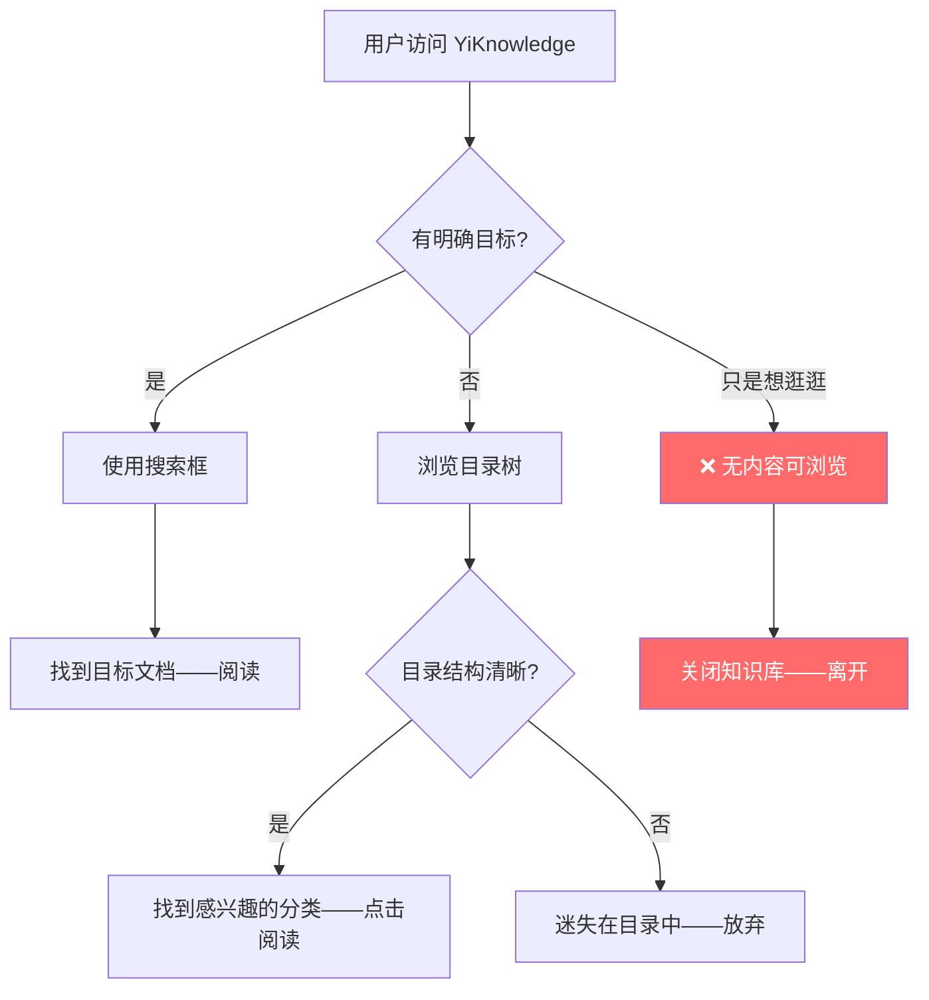
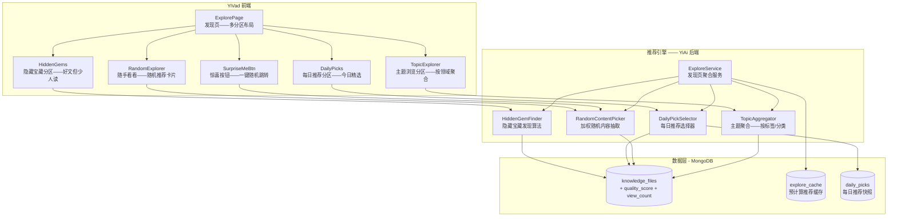
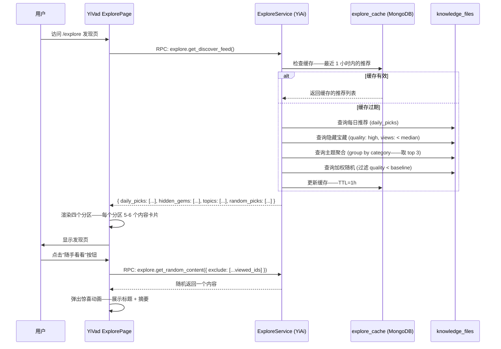

# YK-09-166: 内容探索发现 — 发现页、随机/偶然内容、主题浏览、"随手看看"按钮、每日推荐、隐藏宝藏（高质量低浏览量）

> 需求编号：YK-09-166 · 优先级：P2 · 人天：0.3d · 状态：需求已编写
> 依赖：YK-09-115（自动关联与推荐引擎——推荐算法基础设施）、YK-09-114（内容性能分析——浏览量/质量评分数据）、YK-09-142（内容排行榜与热门——热门内容数据）

## 背景

### 问题陈述

YiKnowledge 知识库目前的内容呈现方式是被动式的——用户需要通过搜索或目录导航来找到内容。这种模式对于"知道自己要找什么"的用户有效——但对于浏览型用户（"随便看看"、"发现新知识"、"消磨时间等"）完全无用：

1. **知识库沦为工具**：用户只在有明确需求时才访问——无法培养日常浏览习惯——知识库的使用频率低
2. **高质量内容沉底**：一篇精心撰写的架构设计文档——因为发布时间早、标题不吸引人——长期无人阅读——隐藏在知识库深处
3. **偶然发现机制缺失**：最好的知识获取往往来自偶然发现——比如在图书馆随意浏览书架时翻到一本意外的好书——当前知识库缺乏这种"偶然性"
4. **新用户不知从何看起**：新加入团队的成员面对数百篇文档——不知道哪些是必读——哪些是经典——需要一个引导性的"发现"入口
5. **内容消费体验单一**：只有"搜索→阅读"这一条路径——缺乏像 Medium/豆瓣/知乎那样的"发现"页面——提供多样化的内容消费方式

**核心矛盾**：知识库的价值不仅在于"精准检索"——还在于"偶然发现"。一个只有搜索框的知识库像一个只有索引卡的图书馆——而一个好的知识库应该像一个有推荐书架、主题展区和"本月推荐"的图书馆。

### 影响范围

| # | 影响 | 严重程度 | 典型场景 |
|---|------|----------|----------|
| 1 | 内容探索路径单一 | 高 | 用户只通过搜索访问——不知道知识库有哪些内容 |
| 2 | 高质量内容无人发现 | 高 | 优秀文档因缺乏曝光而"沉底" |
| 3 | 新用户上手困难 | 中 | 新人不知道从哪开始阅读 |
| 4 | 使用频率低 | 中 | 知识库只在"需要查资料时"被访问 |
| 5 | 内容消费体验枯燥 | 低 | 缺乏新鲜感和惊喜感 |

### 挑战

| 挑战 | 说明 |
|------|------|
| 内容冷启动 | 新知识库内容少——发现页可能空荡——需要合理的初始内容展示策略 |
| "隐藏宝藏"的定义 | 高质量 + 低浏览量——但"高质量"如何定义？浏览量阈值如何设定？ |
| 随机内容的"质量底线" | 纯随机可能推荐到低质量草稿——需要质量过滤 |
| 主题分类粒度 | 主题分类太粗（如"技术"）失去探索价值——太细（如"RAG 延迟分位统计"）内容太少 |
| 发现页性能 | 多种推荐策略（隐藏宝藏/每日推荐/随机浏览/主题浏览）需要多个查询——需要聚合优化 |

---

## 一、现状分析

### 1.1 当前内容发现能力

```
YiKnowledge 当前内容呈现方式:
├── 搜索框: 用户主动输入关键词检索 ✅
├── 目录导航: 按照角色/问题域/文件层级浏览 ✅
├── YK-09-142 内容排行榜与热门: 浏览量排行 ✅
├── YK-09-115 自动关联与推荐: 基于标签/内容的关联推荐 ✅
├── 发现页/探索页: ❌ 不存在
├── "随手看看"随机推荐: ❌ 不存在
├── 每日推荐: ❌ 不存在
├── 隐藏宝藏（高质低浏览量）: ❌ 不存在
├── 主题浏览（按领域聚合）: ❌ 不存在
├── 偶然发现机制: ❌ 不存在
└── 内容新鲜度轮换: ❌ 不存在
```

### 1.2 当前内容消费路径



### 1.3 根因分析矩阵

| 问题 | 根因 | 影响范围 | 解决优先级 |
|------|------|----------|------------|
| 无浏览型入口 | 产品设计仅考虑"搜索型"用户 | 所有浏览型用户 | P0 |
| 优秀内容无额外曝光 | 内容展示仅按目录/搜索——无推荐位 | 优质内容作者和读者 | P0 |
| 新人不知从何看起 | 无引导性内容入口 | 新用户上手 | P1 |
| 使用频率低 | 缺乏"发现惊喜"的动力 | 整体活跃度 | P1 |
| 内容新鲜感不足 | 无定期更换的推荐内容 | 回访率 | P2 |

---

## 二、设计决策

### 2.1 方案对比：发现页布局

| 方案 | 描述 | 优点 | 缺点 | 决策 |
|------|------|------|------|------|
| A: 瀑布流 | Pinterest 式——按内容卡片高度自适应排列 | 视觉丰富——适合浏览 | 不适合大量文字内容——阅读型内容卡片高度差异大 | **采用（混合——推荐区域使用卡片网格）** |
| B: 列表 + 摘要 | 类似 RSS 阅读器——标题 + 摘要 + 标签 | 信息密度高——适合文字内容 | 缺少视觉吸引力 | 不采用 |
| C: 杂志布局 | 类似 Medium——主推荐 + 侧边栏 + 分类区 | 层次分明——有焦点 | 实现复杂——移动端适配困难 | 不采用 |

### 2.2 方案对比：发现页内容分区

| 方案 | 描述 | 优点 | 缺点 | 决策 |
|------|------|------|------|------|
| A: 单一推荐列表 | 一个混合列表——包含各种推荐策略的结果 | 简单 | 缺乏层次——不同类型推荐混在一起 | 不采用 |
| B: 多分区布局 | "每日推荐" + "隐藏宝藏" + "主题浏览" + "随机探索"——每个独立区域 | 内容丰富——每个分区有明确意图 | 页面较长——需要合理的分区顺序 | **采用** |

### 2.3 方案对比："隐藏宝藏"定义

| 方案 | 描述 | 优点 | 缺点 | 决策 |
|------|------|------|------|------|
| A: 浏览量 < 中位数 AND 有 YK 高质量标记 | 规则定义——需要内容质量评分 | 客观 | 依赖 YK-09-114 质量评分 | **采用** |
| B: 浏览量 < 10 AND 字数 > 2000 | 简单规则 | 无需额外数据 | 字数多不等于质量高 | 辅助采用（初始方案） |
| C: 人工标记"宝藏" | 管理员手动标记 | 最准确 | 人力成本高——不规模化 | 辅助采用（精选推荐位） |

### 2.4 方案对比："随手看看"实现

| 方案 | 描述 | 优点 | 缺点 | 决策 |
|------|------|------|------|------|
| A: 纯随机 | 从所有文档中随机抽取 | 真正的"惊喜" | 可能抽到低质量文档 | **采用（加质量过滤）** |
| B: 基于浏览历史推荐 | 协同过滤——"看了 X 的人也看了 Y" | 相关性强 | 需要积累浏览数据 | 辅助采用（可选增强） |
| C: 每日固定推荐 | 每天推荐一批固定内容——所有用户看到相同 | 简单——有话题性 | 内容更新频率低（1 天 1 换） | 辅助采用（"今日推荐"分区） |

---

## 三、目标架构

### 3.1 内容探索发现系统架构



### 3.2 发现页渲染流程



### 3.3 数据模型

```python
# YiAi: domain/explore/ (新增)

# knowledge_files 扩展字段
{
  # 现有字段...,
  "quality_score": 0.75,       # YK-09-114 内容质量评分 0-1
  "view_count": 42,            # 浏览量
  "avg_rating": 4.3,           # 读者评分 (如有)
  "last_viewed_at": ISODate,
  "explore_featured_at": ISODate,  # 上次被推荐的时间
}

# explore_cache 集合
{
  "_id": "discover_feed_v1",
  "updated_at": ISODate,
  "ttl": 3600,                # 缓存 1 小时
  "data": {
    "daily_picks": [
      { "path": "architect/rag/hybrid-search.md", "title": "...", "reason": "editor_pick" }
    ],
    "hidden_gems": [ ... ],
    "topics": { "RAG优化": [...], "架构设计": [...], "测试策略": [...] },
    "random_picks": [ ... ]
  }
}

# daily_picks 集合
{
  "_id": ObjectId,
  "date": "2026-09-09",
  "picks": [
    {
      "path": "architect/rag/hybrid-search.md",
      "reason": "本周热门架构文档——深度解析混合检索",
      "curator_note": "适合中级以上读者——需要 RAG 基础"
    }
  ],
  "curated_by": "admin",       # 或 "auto" (自动选取)
}
```

### 3.4 隐藏宝藏算法

```python
# YiAi: domain/explore/hidden_gem_finder.py (新增)

class HiddenGemFinder:
    """发现高质量但低浏览量的内容"""

    QUALITY_THRESHOLD = 0.7     # 质量评分 >= 0.7
    VIEW_MEDIAN_DAYS = 30       # 30 天内浏览量的中位数
    MIN_AGE_DAYS = 7            # 至少发布 7 天（排除新内容的冷启动期）

    async def find_hidden_gems(self, limit: int = 6) -> list[dict]:
        """查找隐藏宝藏"""

        # 1. 计算近 30 天浏览量的中位数
        pipeline = [
            {"$match": {"created_at": {"$gte": datetime.utcnow() - timedelta(days=30)}}},
            {"$group": {"_id": None, "median_views": {"$avg": "$view_count"}}}
            # 简化：使用平均作为中位数的近似——生产环境用更精确的方法
        ]

        # 2. 查询: 高质量 + 低浏览量 + 一定发布时间
        gems = await self.db.knowledge_files.find({
            "quality_score": {"$gte": self.QUALITY_THRESHOLD},
            "view_count": {"$lt": median_views},
            "created_at": {"$lte": datetime.utcnow() - timedelta(days=self.MIN_AGE_DAYS)},
            "status": "published",
        }).sort("quality_score", -1).limit(limit).to_list(limit)

        return self._format_results(gems)

    def _format_results(self, gems: list) -> list[dict]:
        """格式化为前端渲染格式"""
        return [
            {
                "path": gem["path"],
                "title": gem["title"],
                "tags": gem["tags"],
                "quality_score": gem["quality_score"],
                "view_count": gem["view_count"],
                "gem_reason": self._generate_gem_reason(gem),
            }
            for gem in gems
        ]

    def _generate_gem_reason(self, doc: dict) -> str:
        """生成推荐理由"""
        score = doc.get("quality_score", 0)
        views = doc.get("view_count", 0)
        if score >= 0.9:
            return "高质量佳作——值得被更多人看到"
        elif views <= 3:
            return "几乎无人发现的好文——你是第 " + str(views + 1) + " 位读者"
        else:
            return "被低估的好内容——别错过"
```

---

## 四、具体改动

### 4.1 文件变更清单

| 文件 | 操作 | 说明 |
|------|------|------|
| `YiAi/domain/explore/__init__.py` | 新增 | Explore 模块入口 |
| `YiAi/domain/explore/explore_service.py` | 新增 | 发现页聚合服务 |
| `YiAi/domain/explore/hidden_gem_finder.py` | 新增 | 隐藏宝藏发现算法 |
| `YiAi/domain/explore/random_picker.py` | 新增 | 加权随机内容抽取 |
| `YiAi/domain/explore/topic_aggregator.py` | 新增 | 主题聚合 |
| `YiAi/domain/explore/daily_picks.py` | 新增 | 每日推荐管理 |
| `YiAi/tests/test_explore.py` | 新增 | Explore 服务测试 |
| `YiAi/services/data_service.py` | 修改 | 注册 explore 模块方法 |
| `YiVad/src/views/ExplorePage.vue` | 新增 | 发现页主页面 |
| `YiVad/src/components/explore/DailyPicks.vue` | 新增 | 每日推荐分区 |
| `YiVad/src/components/explore/HiddenGems.vue` | 新增 | 隐藏宝藏分区 |
| `YiVad/src/components/explore/TopicExplorer.vue` | 新增 | 主题浏览分区 |
| `YiVad/src/components/explore/RandomExplorer.vue` | 新增 | 随机探索分区 |
| `YiVad/src/components/explore/SurpriseMeButton.vue` | 新增 | "随手看看"按钮 |
| `YiVad/src/components/explore/ContentCard.vue` | 新增 | 通用内容卡片 |
| `YiVad/src/stores/explore.ts` | 新增 | 发现页数据 store |
| `YiVad/src/router/routes.ts` | 修改 | 添加 /explore 路由 |

---

## 五、实施步骤

| 步骤 | 操作 | 路径 | 验证 | 人天 |
|------|------|------|------|------|
| 1 | 实现隐藏宝藏发现算法 | `YiAi/domain/explore/hidden_gem_finder.py` | 查询返回质量 >= 0.7 且浏览量低于中位数的文档 | 0.04 |
| 2 | 实现加权随机抽取 + 每日推荐管理 | `random_picker.py` + `daily_picks.py` | 随机抽取过滤低质量——每日推荐每天轮换 | 0.04 |
| 3 | 实现主题聚合 | `topic_aggregator.py` | 按 category/tags 聚合——每组 3-5 篇 | 0.03 |
| 4 | 实现 ExploreService 聚合 + 缓存 | `explore_service.py` | 一次 RPC 返回所有分区数据——缓存 1 小时 | 0.04 |
| 5 | 实现 YiVad 发现页 + 四个分区组件 | `ExplorePage.vue` + 分区组件 | 页面渲染 4 个区域——每个区域 5-6 张内容卡片 | 0.06 |
| 6 | 实现"随手看看"按钮 + 动画 | `SurpriseMeButton.vue` | 点击→随机加载→弹出卡片展示→点击"阅读"跳转 | 0.03 |
| 7 | 实现内容卡片组件 + 路由 | `ContentCard.vue` + 路由 | 卡片显示标题/标签/摘要/阅读时间——点击跳转详情 | 0.03 |
| 8 | 联调 + 缓存验证 + 降级处理 | 全链路 | 所有分区正常加载——缓存命中时不重复查询 | 0.03 |

**总人天：0.3d**

---

## 六、测试规格

### 场景 1：发现页完整加载

**GIVEN** 知识库中有 100+ 篇已发布文档——部分有质量评分
**WHEN** 用户访问 /explore 发现页
**THEN** 页面渲染 4 个分区——每日推荐（顶部横幅区）、隐藏宝藏（2x3 卡片网格）、主题浏览（横向滚动主题区）、随机探索（底部 1x4 卡片行）
**AND** 每个分区显示加载状态——数据返回后平滑过渡到内容
**AND** 如果某个分区无数据（如无隐藏宝藏）——显示友好空状态"暂时没有隐藏宝藏——多读一些文章后会出现"

### 场景 2："随手看看"随机推荐

**GIVEN** 用户在发现页
**WHEN** 用户点击"随手看看"按钮
**THEN** 屏幕中央弹出一张卡片——展示一篇随机文章的信息（标题/标签/摘要/阅读时间）
**AND** 卡片带有一个趣味动画（如翻转或弹跳进入）
**AND** 卡片底部显示"阅读这篇文章"按钮和"换一篇"按钮
**WHEN** 用户点击"换一篇"
**THEN** 卡片内容切换为另一篇随机文章——带过渡动画
**WHEN** 用户点击"阅读这篇文章"
**THEN** 页面跳转到文章详情页

### 场景 3：隐藏宝藏发现

**GIVEN** 知识库中有一篇质量评分 0.85 但浏览量仅 3 次的架构设计文档
**WHEN** 用户滚动到"隐藏宝藏"分区
**THEN** 该文档出现在隐藏宝藏卡片中
**AND** 卡片上显示"被低估的好内容——别错过"推荐理由
**AND** 点击卡片跳转到文章详情——浏览计数 +1
**WHEN** 该文档浏览次数达到中位数以上
**THEN** 刷新后发现该文档不再出现在隐藏宝藏分区（已不再是"隐藏"状态）

### 场景 4：主题浏览

**GIVEN** 知识库内容按标签/分类聚合
**WHEN** 用户浏览"主题浏览"分区
**THEN** 显示多个主题——如"RAG 优化"、"架构设计"、"测试策略"、"前端开发"
**AND** 每个主题显示 3-5 篇代表文章
**AND** 主题以横向滚动的标签页或卡片行展示——方便左右滑动浏览
**WHEN** 用户点击某个主题
**THEN** 展开该主题下的更多文章（最多 10 篇）

### 场景 5：内容缓存

**GIVEN** 发现页数据已在缓存中——TTL 未过期
**WHEN** 另一个用户访问发现页
**THEN** 直接从 explore_cache 返回数据——加载速度 < 500ms
**WHEN** 缓存过期（1 小时后）
**THEN** 下一个访问者触发重新计算——更新缓存

### 场景 6：数据不完整降级

**GIVEN** 知识库中仅有 20 篇文档——且无质量评分数据
**WHEN** 用户访问发现页
**THEN** "每日推荐"：显示最近更新的 5 篇
**AND** "隐藏宝藏"：降级为"按字数排序——取最长的 6 篇"——推荐理由变为"深度长文推荐"
**AND** "主题浏览"：仅显示有足够内容的主题（≥ 2 篇）
**AND** "随机探索"：从所有文档中随机抽取

---

## 七、风险与缓解

| 风险 | 概率 | 影响 | 缓解措施 |
|------|------|------|------|
| 知识库内容少——发现页内容单薄 | 中（初期） | 高 | 灵活的分区显示逻辑——内容少于 N 篇的分区自动隐藏——避免空白区域 |
| 隐藏宝藏算法选出的是"确实质量不高的文档" | 中 | 中 | 质量评分来自 YK-09-114——如果评分不准——整个推荐系统受影响——需要质量评分校准机制 |
| 缓存期间新增了优秀内容——但未出现在发现页 | 中 | 低 | 1 小时缓存是合理的折中——长尾内容不需要实时更新——紧急推荐可通过管理后台手动刷新 |
| "随手看看"连续推荐同一篇文档 | 低 | 中 | 前端维护已展示 ID 列表——每次请求带上 exclude 参数——后端排除已展示的 |
| 发现页成为"僵尸页"——长期无人维护推荐内容 | 中 | 高 | 每日推荐支持自动模式——基于浏览量/质量评分自动选择——无需人工干预 |

---

## 八、回滚策略

| 场景 | 回滚操作 | 影响 |
|------|----------|------|
| 发现页性能问题（聚合查询慢） | 延长缓存 TTL 到 24 小时——或降级为静态推荐列表 | 内容更新延迟——功能仍可用 |
| 推荐算法返回错误内容（如草稿/未发布） | 增加 status='published' 过滤——紧急修复 | 临时展示不合适的推荐——修复后恢复 |
| 发现页加载过慢影响整体体验 | 移除发现页入口——恢复默认导航页 | 发现页不可用——导航和搜索正常 |

---

## 九、设计决策记录

### D-01：为什么发现页采用多分区而非单一推荐列表？

单一推荐列表（如"为你推荐"）没有层次感——用户不知道为什么要看这些内容。多分区布局给每个推荐策略一个明确的"身份"——"每日推荐"是编辑精选——"隐藏宝藏"是算法发现——"主题浏览"是分类导航——"随机探索"是意外惊喜。这种设计让用户在每个分区中有不同的心理预期和浏览行为——增加了页面的可玩性。

### D-02：为什么推荐缓存设为 1 小时而非实时计算？

发现页的推荐结果不需要实时性——1 小时刷新一次对内容发现场景完全足够（内容不会在 1 小时内发生巨大变化）。实时计算会导致每次页面加载都执行 4-5 个 MongoDB 聚合查询——对数据库造成不必要压力。缓存是内容推荐系统的标准做法（YouTube/Netflix 都预计算推荐）。

### D-03：为什么"隐藏宝藏"使用浏览量中位数而非固定阈值？

固定阈值（如浏览量 < 10）在不同规模的知识库中表现不一致——在 50 篇文档的知识库中 10 次浏览已经算多——在 500 篇文档中则可能普遍低于 10。中位数是自适应的——始终能找出"相对冷门"的内容——不依赖人工调整阈值。

### D-04：为什么"随手看看"按钮使用加权随机而非纯随机？

纯随机有较高概率选中低质量文档——破坏用户的惊喜体验（变成惊吓）。加权随机使用质量评分作为权重——高质量文档有更高概率被选中——但低浏览量文档也有额外的权重提升（促进发现）。这是一种"soft random"——在随机性和质量之间取得平衡。

---

## 十、可观测性

### 指标

| 指标 | 类型 | 说明 |
|------|------|------|
| `yiknowledge.explore.page_views` | Counter | 发现页访问量 |
| `yiknowledge.explore.daily_picks_ctr` | Gauge | 每日推荐点击率 |
| `yiknowledge.explore.hidden_gems_ctr` | Gauge | 隐藏宝藏点击率 |
| `yiknowledge.explore.surprise_me_clicks` | Counter | "随手看看"按钮点击次数 |
| `yiknowledge.explore.surprise_me_read_rate` | Gauge | "随手看看"后实际阅读的比例 |
| `yiknowledge.explore.topic_browse_clicks` | Counter | 主题浏览点击次数 |
| `yiknowledge.explore.cache_hit_rate` | Gauge | 推荐缓存命中率 |
| `yiknowledge.explore.avg_gems_found` | Gauge | 每次发现的隐藏宝藏平均数 |
| `yiknowledge.explore.bounce_rate` | Gauge | 发现页跳出率（无任何点击即离开） |

### 告警

| 告警 | 条件 | 级别 |
|------|------|------|
| 发现页缓存持续未命中 | 命中率 < 10% | WARNING |
| 隐藏宝藏分区长期为空 | 连续 24h 找到 0 篇 | INFO（可能内容质量评分普遍偏低） |
| 发现页跳出率过高 | > 80% | INFO（可能推荐不吸引人——需调整算法） |

---

## 十一、代码审查检查清单

- [ ] ExploreService 四个分区查询正确——各自独立——互不阻塞
- [ ] 缓存机制——TTL 1h——缓存 Key 包含版本号——方便清缓存
- [ ] 隐藏宝藏查询——质量阈值可配——浏览量中位数实时计算
- [ ] 随机抽取——使用数据库 $sample 或应用层 shuffle——排除已展示 ID
- [ ] 主题聚合——按 category——每组 top N by quality/views
- [ ] 每日推荐——自动模式基于近 7 天热门——手动模式支持管理后台配置
- [ ] 前端分区组件——空状态设计——加载骨架屏——错误重试
- [ ] "随手看看"按钮——随机抽取 + 弹出动画——支持"换一篇"
- [ ] 内容卡片——自适应高度——标题截断——标签展示
- [ ] 所有推荐结果过滤 status='published'——排除草稿和归档
- [ ] 发现页响应式——桌面 4 列——平板 3 列——手机 2 列/1 列

---

## 回归问题预测

| # | 预测问题 | 原因 | 验证方法 |
|---|---------|------|---------|
| 1 | 发现页首次加载时 4 个分区串行请求——总耗时 = 4x 单分区耗时 | 前端并发请求实现错误——await 而非 Promise.all | 访问发现页——查看 Network 面板——4 个请求应并发（Waterfall 重叠） |
| 2 | 缓存未更新——发现页展示已被删除的文档 | 文档删除时未清除 explore_cache——缓存仍引用不存在的路径 | 删除一篇在发现页中的文档 → 刷新发现页 → 该文档不应出现 |
| 3 | 主题分区在内容新增后分类分布严重不均 | 某些 category 内容暴涨——导致主题分区中该分类独占大量位置 | 新增 10 篇同一分类的文档 → 主题分区该分类仍只显示 top 3-5 篇 |
| 4 | "随手看看"在移动端弹出卡片超出屏幕 | 弹出卡片尺寸固定——在小屏幕上被截断 | iPhone SE 尺寸 → 点击"随手看看" → 卡片完整显示——可滚动 |
| 5 | 每日推荐在跨天后仍显示昨天的内容 | 每日推荐更新逻辑有 bug——或缓存跨天未被清除 | 修改系统时间或等待跨天 → 访问发现页 → 每日推荐内容已更新 |
| 6 | 隐藏宝藏算法将新发布的高质量文档（< 7 天）误判为"宝藏" | MIN_AGE_DAYS 过滤未生效——新文档缺乏足够浏览量数据 | 发布一篇高质量新文档 → 1 小时后查隐藏宝藏列表 → 该文档不应出现（< 7 天） |

---

## 性能分析

### 关键操作耗时

| 操作 | 数据规模 | 耗时 | 说明 |
|------|----------|------|------|
| 隐藏宝藏查询 | 500 篇文档 | ~50ms | MongoDB $match + $sort + $limit |
| 每日推荐（自动模式） | 500 篇 | ~30ms | 近 7 天热门 top 5 |
| 主题聚合 query | 500 篇 | ~80ms | $group by category |
| 随机抽取 | 500 篇 | ~20ms | $sample 或应用层 shuffle |
| 缓存命中 | — | < 5ms | 直接从 MongoDB explore_cache 读取 |
| 前端渲染 4 个分区 | 20 张卡片 | ~100ms | Vue 组件渲染——含图片/标签 |
| 发现页总加载（缓存命中） | — | < 500ms | 含网络请求 + 渲染 |
| 发现页总加载（缓存未命中） | — | < 1s | 含 4 个并行查询 + 渲染 |

### 内存占用

| 数据 | 大小 | 说明 |
|------|------|------|
| explore_cache 文档 | ~10KB | 20 个推荐条目元数据 |
| 前端发现页 store | ~5KB | 推荐列表数据 |

---

## 相关文档

- [自动关联与推荐引擎](115-需求-自动关联与推荐引擎.md) — 推荐算法基础设施
- [内容性能分析](114-需求-内容性能分析.md) — 质量评分和浏览量数据来源
- [内容排行榜与热门](142-需求-内容排行榜与热门.md) — 热门内容数据
- [内容个性化推荐](134-需求-内容个性化推荐.md) — 个性化推荐增强方向

*PRD 来源: `projects/yiknowledge/requirements/2026-09/166-需求-内容探索发现.md`*