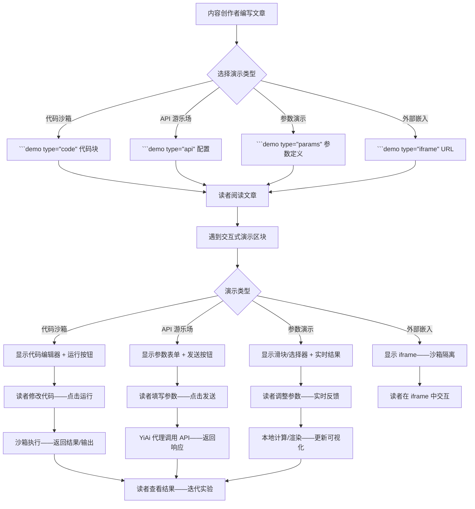
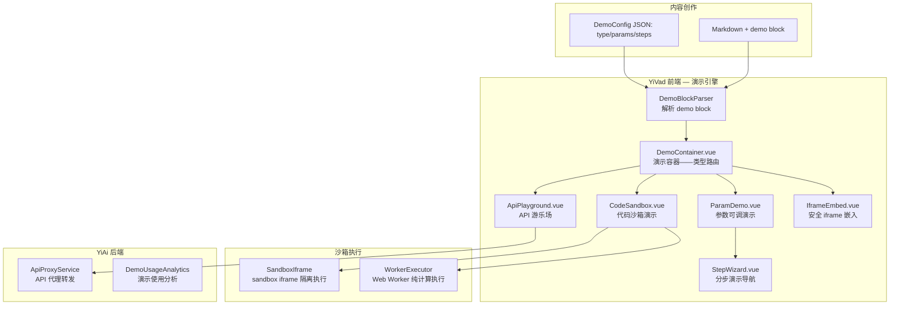

# YK-09-171: 内容交互式演示 — 文章中嵌入交互式演示、代码沙箱、API 游乐场、可配置参数、分步演示、Demo 嵌入

> 需求编号：YK-09-171 · 优先级：P2 · 人天：0.3d · 状态：需求已编写
> 依赖：YK-09-120（图表与可视化嵌入——嵌入机制参考）、YK-09-117（代码执行沙箱——YiPet 已有沙箱参考）、YK-09-170（内容嵌入式测验——嵌入式组件系统参考）

## 背景

### 问题陈述

技术文档的最大痛点之一是"纸上谈兵"——读者看了 API 文档但不清楚实际调用的效果——读了算法描述但不理解参数变化如何影响结果。交互式演示让读者在阅读的同时动手实验：

1. **API 文档缺乏实操**：REST API 文档列出 endpoint 和参数——但读者想"实际调用一下看看返回什么"——当前只能复制 curl 到终端——上下文切换打断阅读
2. **算法参数不可调**：文章解释"BM25 的 k1 参数控制词频饱和度"——但读者不知道 k1=1.2 和 k1=2.0 的实际效果差异——缺少可视化对比
3. **CSS/UI 效果无法预览**：UI 组件文档中的 CSS 代码——读者想看不同属性值的效果——需要自己创建 HTML 文件——门槛高
4. **学习曲线陡峭**：复杂的系统（如 RAG pipeline）有多步骤——静态文档难以传达流程——交互式演示可以逐步骤展示
5. **代码示例无法运行**：文章中的代码片段——读者想修改参数运行看结果——但只能"读"不能"执行"

**核心矛盾**：静态文档与动态理解之间的鸿沟。交互式演示填补了"阅读文档"和"动手实践"之间的空白——让知识从"被告知"变成"被体验"。

### 影响范围

| # | 影响 | 严重程度 | 典型场景 |
|---|------|----------|----------|
| 1 | API 文档无实操验证 | 高 | 开发者需切换终端验证——打断阅读心流 |
| 2 | 算法参数理解困难 | 高 | BM25/向量检索参数影响不可视——抽象理解 |
| 3 | UI/CSS 效果不可预览 | 中 | 组件文档缺少实时效果展示 |
| 4 | 多步骤流程难以传达 | 中 | 复杂流程仅靠文字描述——读者理解偏差大 |
| 5 | 代码示例不能修改运行 | 中 | 无法"调参实验"——学习深度受限 |

### 挑战

| 挑战 | 说明 |
|------|------|
| 沙箱安全性 | 用户代码在浏览器中执行——需要隔离——防止影响页面其他部分 |
| 第三方 API 调用 | API 游乐场需真实调用后端——CORS 限制——需要后端代理 |
| 嵌入语法标准化 | 不同的演示类型（API/code/css/算法）需要统一的嵌入语法 |
| iframe 与主页面的通信 | 沙箱 iframe 的结果需要传回主页面——postMessage 是标准方式——但需要协议设计 |
| 静态站点兼容 | YiKnowledge 可能导出为静态站点——交互式演示在静态模式下如何工作 |

---

## 一、现状分析

### 1.1 当前内容演示能力

```
YiKnowledge 当前内容交互能力:
├── YK-09-120 图表与可视化嵌入: Mermaid/ECharts 图表 ✅
├── YK-09-170 内容嵌入式测验: 选择题/判断题/填空题 ✅
├── Markdown 代码块: 静态代码展示 + 语法高亮 ✅
├── 代码沙箱执行: ❌ 不存在（YiPet 有——但 YiKnowledge 未集成）
├── API 游乐场: ❌ 不存在
├── 参数可调演示: ❌ 不存在
├── 分步交互式演示: ❌ 不存在
├── iframe 嵌入外部 Demo: ❌ 存在基础 iframe——无安全策略
├── 演示结果可视化: ❌ 不存在
└── 代码一键运行: ❌ 不存在
```

### 1.2 交互式演示流程



### 1.3 根因分析矩阵

| 问题 | 根因 | 影响范围 | 解决优先级 |
|------|------|----------|------------|
| 无交互式演示框架 | Markdown 渲染仅支持静态内容 | 所有需要动手实践的内容 | P0 |
| 无代码沙箱集成 | YiPet 沙箱未跨项目复用到 YiVad | 代码示例无法运行 | P0 |
| 无 API 代理调用 | 浏览器 CORS 限制——前端无法直接调第三方 API | API 文档无实操验证 | P1 |
| 无参数可调演示 | 未实现参数驱动渲染组件 | 算法/组件文档缺乏交互性 | P1 |
| iframe 嵌入无安全策略 | 未使用 sandbox 属性——XSS 风险 | 外部 Demo 嵌入有安全隐患 | P2 |

---

## 二、设计决策

### 2.1 方案对比：代码沙箱实现

| 方案 | 描述 | 优点 | 缺点 | 决策 |
|------|------|------|------|------|
| A: sandbox iframe + postMessage | 创建 sandbox iframe——注入用户代码——postMessage 返回结果 | 强隔离——不影响主页面——安全 | 无法访问主页面 DOM——不能调用主页面 API | **采用（代码执行）** |
| B: Web Worker 执行 | 在 Worker 中 eval 用户代码——消息返回结果 | 独立线程——不阻塞 UI | 无 DOM API——console.log 不工作 | 辅助采用（纯计算代码） |
| C: 服务端沙箱（YiAi） | 代码发送到 YiAi——Docker 容器中执行 | 最安全——支持任意语言 | 延迟高——需要 Docker 环境——0.3d 不可行 | 不采用 |

### 2.2 方案对比：API 游乐场

| 方案 | 描述 | 优点 | 缺点 | 决策 |
|------|------|------|------|------|
| A: YiAi 代理转发 | 前端发 RPC 到 YiAi——YiAi 代理请求目标 API——返回结果 | 突破 CORS——统一鉴权——可记录日志 | 增加一跳网络延迟——后端负载 | **采用** |
| B: 浏览器直接调用 | 前端 fetch 直接调用目标 API | 零延迟——零后端负载 | CORS 限制——大部分 API 不支持 | 不采用（仅同源 API 可行） |
| C: 预录制响应（Mock） | 创作者预先录制 API 响应——读者看到的是回放 | 零延迟——零后端——不依赖外部 API 可用性 | 不能真实调用——参数不可变 | 辅助采用（API 不可用时的降级） |

### 2.3 方案对比：演示嵌入语法

| 方案 | 描述 | 优点 | 缺点 | 决策 |
|------|------|------|------|------|
| A: 统一 ```demo fenced block | ```demo type="code" / type="api" / type="params" | 统一入口——易记忆——解析器单一 | type 属性区分——需要解析逻辑 | **采用** |
| B: 不同类型不同 block 标记 | ```code-demo / ```api-playground / ```param-demo | 语义清晰——不同标记不同解析器 | 标记类型多——创作者需记住多种语法 | 不采用 |
| C: HTML 自定义元素 | <code-demo>...</code-demo> 直接写在 Markdown 中 | 标准 HTML——任何渲染器兼容 | Markdown 中写 HTML 繁琐——易出错 | 不采用 |

### 2.4 方案对比：分步演示导航

| 方案 | 描述 | 优点 | 缺点 | 决策 |
|------|------|------|------|------|
| A: 步骤条 + 下一步按钮 | 顶部步骤指示器——用户按"下一步"逐步推进 | 引导清晰——适合教程 | 用户不能自由跳转——可能感到被限制 | **采用（默认模式）** |
| B: Tab 自由切换 | 每个步骤一个 Tab——用户自由切换 | 灵活——快速跳转 | 步骤之间的依赖关系可能被打破 | 辅助采用（高级模式） |
| C: 时间线滚动 | 所有步骤纵向排列——类似长图文 | 全貌可见 | 长内容滚动疲劳 | 不采用 |

---

## 三、目标架构

### 3.1 交互式演示系统架构



### 3.2 演示 Markdown 语法

````markdown
## API 调用示例

以下是调用知识检索 API 的交互式演示——你可以修改参数实际调用：

```demo
{
  "type": "api",
  "id": "demo-rag-search-001",
  "title": "RAG 检索 API 调用示例",
  "config": {
    "method": "POST",
    "url": "http://localhost:10086/rag/search",
    "headers": {
      "Content-Type": "application/json"
    },
    "params": [
      {
        "name": "query",
        "type": "text",
        "label": "检索问题",
        "default": "什么是混合检索？",
        "placeholder": "输入你的问题..."
      },
      {
        "name": "top_k",
        "type": "range",
        "label": "返回结果数",
        "default": 5,
        "min": 1,
        "max": 20,
        "step": 1
      },
      {
        "name": "alpha",
        "type": "range",
        "label": "混合检索权重 α",
        "description": "0=纯关键词, 1=纯语义",
        "default": 0.7,
        "min": 0,
        "max": 1,
        "step": 0.1
      }
    ]
  }
}
```

## BM25 参数调参演示

调整 k1 和 b 参数——实时查看它们如何影响词频饱和度和文档长度归一化：

```demo
{
  "type": "params",
  "id": "demo-bm25-params",
  "title": "BM25 参数调参演示",
  "config": {
    "function": "bm25Score",
    "params": [
      {
        "name": "k1",
        "type": "range",
        "label": "k1（词频饱和度）",
        "default": 1.2,
        "min": 0,
        "max": 3,
        "step": 0.1
      },
      {
        "name": "b",
        "type": "range",
        "label": "b（文档长度归一化）",
        "default": 0.75,
        "min": 0,
        "max": 1,
        "step": 0.05
      },
      {
        "name": "tf",
        "type": "range",
        "label": "词频 (tf)",
        "default": 5,
        "min": 1,
        "max": 30,
        "step": 1
      }
    ],
    "visualization": "chart",
    "chartConfig": {
      "type": "line",
      "xAxis": "tf",
      "yAxis": "score"
    }
  }
}
```
````

### 3.3 数据模型

```typescript
// YiVad/src/types/demo.ts (新增)

type DemoType = 'code' | 'api' | 'params' | 'iframe' | 'steps';

interface DemoDefinition {
  type: DemoType;
  id: string;
  title: string;
  config: CodeDemoConfig | ApiDemoConfig | ParamDemoConfig | IframeConfig | StepsConfig;
}

interface CodeDemoConfig {
  language: string;             // javascript / python / css / html
  code: string;                 // 默认代码
  editable: boolean;            // 用户是否可修改
  runnable: boolean;            // 是否可运行
  sandboxMode: 'iframe' | 'worker';
  expected?: string;            // 预期输出提示
}

interface ApiDemoConfig {
  method: 'GET' | 'POST' | 'PUT' | 'DELETE';
  url: string;
  headers: Record<string, string>;
  params: ApiParam[];
  proxyRequired: boolean;       // 是否需 YiAi 代理
  mockResponse?: any;           // 预录制响应（降级用）
}

interface ApiParam {
  name: string;
  type: 'text' | 'number' | 'range' | 'select' | 'textarea';
  label: string;
  description?: string;
  default: any;
  required?: boolean;
  min?: number;
  max?: number;
  step?: number;
  options?: { label: string; value: any }[];
}

interface ParamDemoConfig {
  function: string;             // JS 函数名——在 Worker 中执行
  params: ApiParam[];
  visualization: 'chart' | 'text' | 'canvas';
  chartConfig?: any;
}

interface IframeConfig {
  url: string;
  sandbox: string;              // sandbox 属性值
  allow: string;                // allow 属性值
  width?: number;
  height?: number;
  responsive: boolean;
}

interface StepsConfig {
  steps: {
    title: string;
    content: string;            // Markdown
    demo?: DemoDefinition;      // 嵌入子演示
    check?: {                   // 可选的交互检查
      question: string;
      answer: string;
    };
  }[];
  allowFreeNavigation: boolean;
}
```

---

## 四、具体改动

### 4.1 文件变更清单

| 文件 | 操作 | 说明 |
|------|------|------|
| `YiVad/src/types/demo.ts` | 新增 | 演示相关类型定义 |
| `YiVad/src/utils/markdown/demo-parser.ts` | 新增 | demo block 解析器 |
| `YiVad/src/utils/sandbox/iframe-executor.ts` | 新增 | iframe 沙箱执行器 |
| `YiVad/src/utils/sandbox/worker-executor.ts` | 新增 | Web Worker 执行器 |
| `YiVad/src/components/demo/DemoContainer.vue` | 新增 | 演示容器——类型路由 |
| `YiVad/src/components/demo/CodeSandbox.vue` | 新增 | 代码沙箱组件 |
| `YiVad/src/components/demo/ApiPlayground.vue` | 新增 | API 游乐场组件 |
| `YiVad/src/components/demo/ParamDemo.vue` | 新增 | 参数可调演示 |
| `YiVad/src/components/demo/StepWizard.vue` | 新增 | 分步演示导航 |
| `YiVad/src/components/demo/IframeEmbed.vue` | 新增 | 安全 iframe 嵌入 |
| `YiVad/src/components/demo/DemoOutput.vue` | 新增 | 演示输出面板——结果/日志/可视化 |
| `YiAi/services/proxy/api_proxy.py` | 新增 | API 代理转发服务 |
| `YiAi/domain/demo/demo_service.py` | 新增 | 演示使用统计服务 |
| `YiAi/tests/test_api_proxy.py` | 新增 | API 代理测试 |

### 4.2 沙箱 iframe 通信协议

```typescript
// 主页面 → sandbox iframe
interface SandboxRequest {
  type: 'execute';
  code: string;
  language: string;
  requestId: string;
}

// sandbox iframe → 主页面
interface SandboxResponse {
  type: 'result' | 'error' | 'log' | 'progress';
  requestId: string;
  data?: {
    result?: any;               // 执行结果
    output?: string;            // console.log 输出
    error?: {
      name: string;
      message: string;
      stack?: string;
    };
    executionTimeMs?: number;
  };
}
```

---

## 五、实施步骤

| 步骤 | 操作 | 路径 | 验证 | 人天 |
|------|------|------|------|------|
| 1 | 定义 DemoDefinition JSON Schema——5 种类型 | `demo.ts` | Schema 验证——code/api/params/iframe/steps 全部覆盖 | 0.02 |
| 2 | 实现 demo block 解析器 | `demo-parser.ts` | Markdown 含 demo block→解析为 DemoDefinition→替换占位符 | 0.03 |
| 3 | 实现 iframe 沙箱执行器 | `iframe-executor.ts` | sandbox iframe 中执行 JS→postMessage 返回结果→捕获 console.log | 0.05 |
| 4 | 实现 Web Worker 执行器 | `worker-executor.ts` | Worker 中执行纯计算函数→返回结果——BM25/余弦相似度等 | 0.03 |
| 5 | 实现代码沙箱 UI | `CodeSandbox.vue` | 代码编辑器 + 运行按钮 + 输出面板——编辑器支持语法高亮 | 0.04 |
| 6 | 实现 API 游乐场 UI | `ApiPlayground.vue` | 参数表单 + 发送按钮 + JSON 响应查看器——格式化高亮 | 0.04 |
| 7 | 实现参数演示 UI | `ParamDemo.vue` | 滑块/选择器 + 实时 Chart——拖拽即更新 | 0.04 |
| 8 | 实现分步演示 UI | `StepWizard.vue` | 步骤条 + 前进/后退——每步内容 + 可选演示 | 0.03 |
| 9 | 实现 YiAi API 代理 | `api_proxy.py` | 代理转发第三方 API→突破 CORS→返回结果 | 0.02 |

**总人天：0.3d**

---

## 六、测试规格

### 场景 1：代码沙箱——JavaScript 执行

**GIVEN** 一篇关于数组操作的文章——含 ```demo type="code" language="javascript"
**WHEN** 读者在代码编辑器中将默认代码改为 `[1,2,3].map(x => x * 2)`
**AND** 点击"运行"
**THEN** sandbox iframe 中执行代码——输出面板显示 `[2, 4, 6]`
**AND** 执行时间显示——如"执行耗时: 0.8ms"
**WHEN** 代码有语法错误——`[1,2,3].map(x => x *  2)`
**THEN** 输出面板显示红色错误信息——`SyntaxError: Unexpected token`

### 场景 2：API 游乐场——代理调用 RAG 接口

**GIVEN** 一篇 RAG API 文档——含 ```demo type="api"——目标 URL http://localhost:10086/rag/search
**WHEN** 读者在参数表单中输入 query="混合检索"——top_k=3——alpha=0.7
**AND** 点击"发送"
**THEN** 请求通过 YiAi 代理转发到 RAG endpoint——返回 JSON 响应
**AND** 响应以格式化的 JSON 显示——键高亮——可折叠嵌套对象
**AND** 显示请求耗时——如"响应时间: 234ms"
**WHEN** API 返回错误 500
**THEN** 显示错误信息 + HTTP 状态码——参数表单保留——读者可修改后重试

### 场景 3：参数演示——BM25 实时可视化

**GIVEN** 一篇 BM25 算法文章——含 ```demo type="params"——参数 k1/b/tf——可视化 chart
**WHEN** 读者拖动 k1 滑块从 1.2 到 2.5
**THEN** 折线图实时更新——显示不同 k1 值下——BM25 分数随词频变化的曲线
**AND** 可以对比——切换显示/隐藏不同 k1 值的曲线
**AND** 鼠标悬停曲线上的点——显示精确的 BM25 分数值

### 场景 4：分步演示——RAG Pipeline

**GIVEN** 一篇 RAG Pipeline 教程——含 ```demo type="steps"——5 个步骤
**WHEN** 读者点击"开始演示"
**THEN** 步骤 1 高亮——标题"文档分块"——显示分块策略的图示和代码
**AND** 读者点击"下一步"→步骤 2"向量化"——前一步骤标记为完成
**AND** 步骤条显示进度"2/5"——不允许跳步（默认模式）
**AND** 到达步骤 5 后——显示"完成所有步骤——你可以自由浏览所有步骤"

### 场景 5：安全 iframe 嵌入

**GIVEN** 一篇文章嵌入外部 Demo——```demo type="iframe" url="https://example.com/demo"
**WHEN** 渲染时——创建 iframe 带有 sandbox 属性
**THEN** iframe 使用 `sandbox="allow-scripts allow-same-origin"` 隔离
**AND** iframe 内的脚本不会影响主页面——主页面无法访问 iframe 内部
**AND** iframe 响应式——宽度跟随文章内容区域——高度由内容决定或固定

### 场景 6：演示结果对比——参数变化影响

**GIVEN** BM25 参数演示——用户调整了 3 组参数
**WHEN** 用户点击"对比结果"
**THEN** 3 组参数的结果并排显示——k1=1.2 的曲线 vs k1=2.0 的曲线
**AND** 用户可以选择保留/删除某组数据
**AND** 导出对比图为 PNG——用于报告或分享

---

## 七、风险与缓解

| 风险 | 概率 | 影响 | 缓解措施 |
|------|------|------|------|
| sandbox iframe 中无限循环——页面无响应 | 中 | 中 | 执行超时 5 秒——超时后终止 iframe——重新创建——提示"代码执行超时——请检查是否有死循环" |
| API 代理被滥用——作为开放代理攻击其他服务 | 中 | 高 | 仅允许代理预设 URL 白名单——创作者定义 demo 时声明 target URL——随意 URL 的请求被拒绝 |
| API 代理返回敏感信息（如内网数据） | 低 | 高 | 响应内容截断——超过 100KB 截断——过滤敏感 header（Set-Cookie/Authorization） |
| 外部 iframe 加载缓慢——文章渲染卡住 | 低 | 中 | iframe 懒加载——仅当滚动到视口内时才加载——默认显示占位符 |
| Worker 中 BM25 计算逻辑与 YiAi 实现不一致 | 中 | 低 | Worker 中的 BM25 为教学简化版——添加注释说明"此为简化实现——实际生产环境计算可能略有差异" |

---

## 八、回滚策略

| 场景 | 回滚操作 | 影响 |
|------|----------|------|
| sandbox iframe 跨浏览器兼容问题严重 | 禁用代码执行——代码编辑器仅展示——不可运行 | 代码执行不可用——代码展示和编辑正常 |
| API 代理服务压力过大或安全事件 | 禁用 API 代理——API 游乐场仅显示 Mock 数据 | 实时 API 调用不可用——预录制响应可用 |
| 参数演示计算逻辑有 bug | 标记为"实验性功能"——显示警告提示 | 参数演示可用但结果标注为不可靠 |

---

## 九、设计决策记录

### D-01：为什么选择 sandbox iframe 而非简单的 eval？

eval 在当前页面的上下文中执行代码——意味着可以访问 DOM、全局变量、cookie——安全风险极高。sandbox iframe 创建了独立的浏览上下文——`sandbox="allow-scripts"` 仅允许脚本执行——禁止访问父页面、禁止表单提交、禁止弹窗。即使代码中有恶意操作——影响也仅限于 iframe 内部。对于 YiKnowledge 的"读者可执行代码"场景——安全性是最高优先级。

### D-02：为什么 API 代理需要 URL 白名单？

API 代理如果不设限制——就可能成为"开放代理"——攻击者可以用它扫描内网、攻击第三方服务——YiAi 服务器 IP 会被封禁。白名单机制：只有当 URL 匹配创作者在 demo block 中声明的 pattern 时——才允许代理转发。白名单在 DemoDefinition 创建时注册——运行时不允许动态 URL。

### D-03：为什么参数演示的计算放在 Web Worker 而非主线程？

BM25 分数计算、向量余弦相似度这类计算——参数变化时需要快速重算。在主线程中高频计算会阻塞 UI 渲染——导致滑块拖拽卡顿。Web Worker 在独立线程中运行——不阻塞 UI。BM25 计算逻辑是纯 JavaScript 函数——不需要 DOM API——完全适合 Worker 环境。

### D-04：为什么分步演示默认不允许跳步？

教程和学习路径设计有顺序依赖——步骤 2 的概念建立在步骤 1 之上。允许跳步可能导致读者错过关键概念——然后无法理解后续步骤。`allowFreeNavigation: false`（默认）确保学习顺序——`true` 则允许读者自由探索——由创作者根据内容类型决定。

---

## 十、可观测性

### 指标

| 指标 | 类型 | 说明 |
|------|------|------|
| `yiknowledge.demo.total_demos` | Counter | 创建的演示总数 |
| `yiknowledge.demo.type_code_ratio` | Gauge | 代码沙箱占比 |
| `yiknowledge.demo.type_api_ratio` | Gauge | API 游乐场占比 |
| `yiknowledge.demo.type_params_ratio` | Gauge | 参数演示占比 |
| `yiknowledge.demo.execution_count` | Counter | 代码执行总次数 |
| `yiknowledge.demo.api_call_count` | Counter | API 代理调用次数 |
| `yiknowledge.demo.avg_execution_time` | Histogram | 平均执行时间 |
| `yiknowledge.demo.execution_error_rate` | Gauge | 代码执行错误率 |
| `yiknowledge.demo.params_interaction_count` | Counter | 参数调整交互次数 |

### 告警

| 告警 | 条件 | 级别 |
|------|------|------|
| 代码执行超时率高 | > 20% | WARNING（可能是死循环代码示例） |
| API 代理错误率高 | > 30% | WARNING（目标 API 可能不可用） |
| sandbox iframe 创建失败 | > 5 次/小时 | WARNING（浏览器兼容性或资源问题） |
| API 代理调用异常流量 | 短时间内大量请求 | CRITICAL（可能被滥用——检查白名单） |

---

## 十一、代码审查检查清单

- [ ] demo block JSON Schema 验证——必填字段缺失时给出清晰错误提示
- [ ] sandbox iframe——sandbox 属性正确——allow-scripts 但禁止 allow-top-navigation
- [ ] postMessage 通信——验证 origin——防止跨域消息伪造
- [ ] 执行超时——5 秒 timeout——超时后清理 iframe——创建新实例
- [ ] 代码编辑器——支持语法高亮（CodeMirror/Monaco）——支持 tab 缩进
- [ ] API 代理——URL 白名单匹配——仅允许预设 pattern 的目标
- [ ] API 响应——截断超长响应——过滤敏感 header
- [ ] 参数演示——debounce 滑块更新——300ms 防抖——避免过度重算
- [ ] Worker 创建和销毁——组件卸载时 terminate Worker
- [ ] 分步演示——步骤状态管理——已完成/当前/待处理的视觉区分
- [ ] iframe 嵌入——loading="lazy"——IntersectionObserver 触发加载
- [ ] 错误边界——演示组件异常不导致整个页面崩溃——显示降级 UI

---

## 回归问题预测

| # | 预测问题 | 原因 | 验证方法 |
|---|---------|------|---------|
| 1 | sandbox iframe 中 console.log 拦截不完整——部分日志丢失 | console 对象的所有方法需要逐一 hook——遗漏了 console.table/console.group | 代码中调用 console.log/error/warn/table→输出面板显示所有日志 |
| 2 | API 代理请求中包含 Cookie——泄露了 YiAi 的 session | HTTP 请求库默认携带 Cookie——代理转发时未剥离 | 代理请求的目标服务器日志中——不应出现 YiAi 相关的 Cookie |
| 3 | 参数演示的 Chart 在 DPR > 1 屏幕上尺寸计算错误——Canvas 模糊 | Chart 使用 Canvas——未根据 DPR 调整物理像素 | Retina 屏幕→Chart 清晰——无模糊——DPI 适配正确 |
| 4 | 分步演示中——某一步包含的嵌套 demo 未正确加载 | 嵌套解析器未递归处理——或 demo block 的嵌套深度限制 | 3 层嵌套 demo→所有层级的演示正常渲染 |
| 5 | 代码沙箱中异步代码（Promise/async）的结果无法捕获 | eval 同步返回——Promise 的结果在微任务中——sandbox iframe 的消息在 Promise resolve 后才发送 | 代码 `await fetch('...')`→等待异步完成→结果正确传回主页面 |
| 6 | Web Worker 中使用的库函数（如 math.js）未内联到 Worker 代码中 | Worker 通过 URL 创建——importScripts 无法加载外部依赖 | 含依赖的函数→Worker 执行→结果正确——（需将依赖打包到 Worker bundle 中） |

---

## 性能分析

### 关键操作耗时

| 操作 | 数据量 | 耗时 | 说明 |
|------|------|------|------|
| sandbox iframe 创建 | — | 10-30ms | 含 HTML 注入和初始化 |
| JS 代码执行（简单数组操作） | — | < 5ms | 在 iframe 中 eval |
| JS 代码执行（循环 100 万次） | — | < 500ms | 沙箱中——速度与主线程相同 |
| API 代理转发 | — | 50-200ms + 目标 API 耗时 | 增加一跳延迟 |
| BM25 参数计算（Worker） | 30 个 tf 值 × 3 参数 | < 10ms | Worker 中——不阻塞 UI |
| Chart 渲染（ECharts） | 1 条曲线——30 个点 | < 50ms | Canvas 渲染 |

### 内存开销

| 资源 | 内存 | 说明 |
|------|------|------|
| sandbox iframe | ~5-10MB | 独立浏览上下文 |
| Web Worker | ~2-5MB | 独立线程 + 代码 |
| 代码编辑器（Monaco） | ~15-20MB | 完整编辑器 |
| API 响应缓存（单次） | ~10KB-100KB | JSON 响应 |

---

## 相关文档

- [图表与可视化嵌入](120-需求-图表与可视化嵌入.md) — 嵌入机制和图表渲染
- [内容嵌入式测验](170-需求-内容嵌入式测验.md) — 嵌入式组件系统
- [代码执行沙箱](117-需求-代码执行沙箱.md) — YiPet 沙箱参考（YiPet）
- [内容编排与学习路径](121-需求-内容编排与学习路径.md) — 分步学习参考

*PRD 来源: `projects/yiknowledge/requirements/2026-09/171-需求-内容交互式演示.md`*