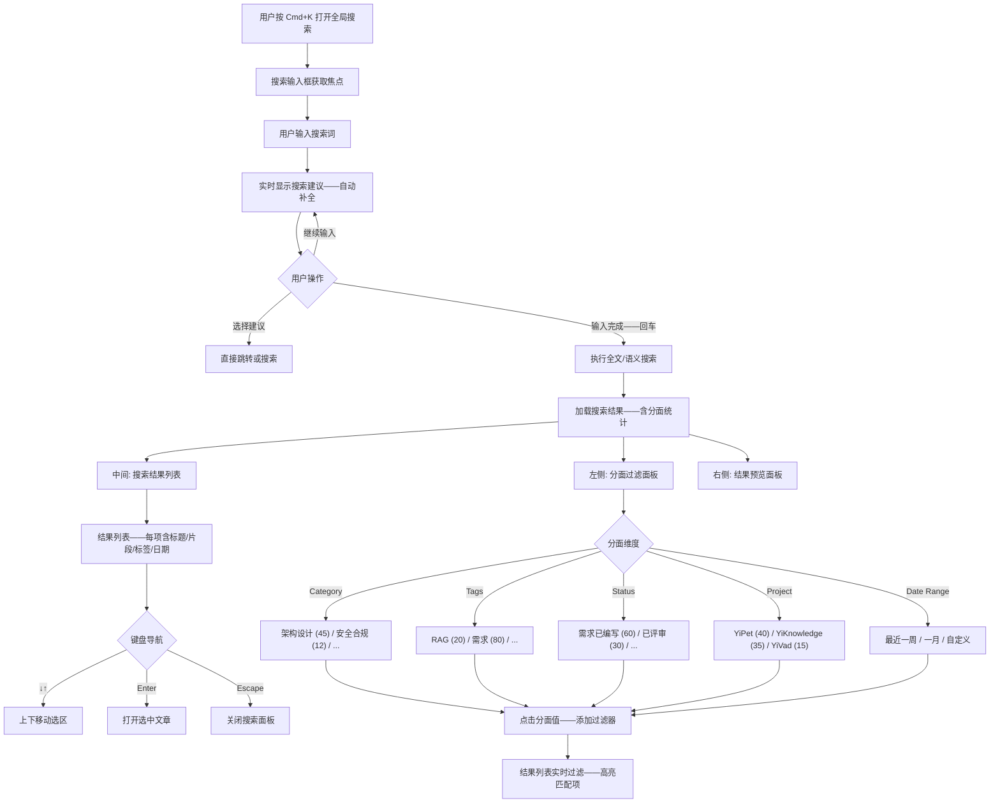
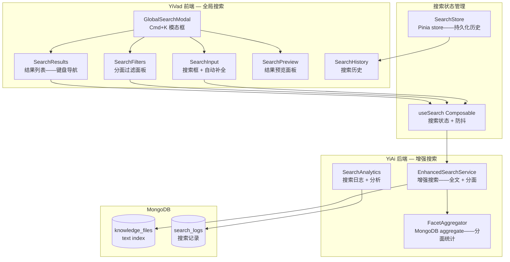
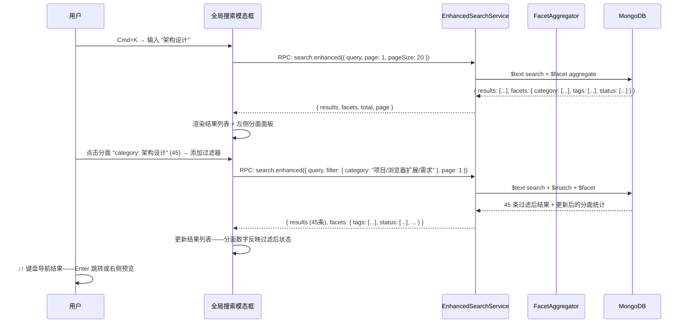

# YK-09-172: 内容全局搜索优化 — 全知识库增强搜索、分面搜索、搜索过滤器、搜索结果分组、键盘导航、搜索快捷键

> 需求编号：YK-09-172 · 优先级：P2 · 人天：0.3d · 状态：需求已编写
> 依赖：YK-09-18（搜索分析与趋势洞察——搜索分析基础设施）、YK-09-55（查询意图分类——意图识别）、YK-09-67（查询自动补全建议——补全功能）

## 背景

### 问题陈述

YiKnowledge 已有基础的 RAG 检索（YK-09-14/18/55 等）和全文搜索能力——但当前的搜索体验是"输入关键词 → 返回结果列表"的简单模式。大型知识库（500+ 文档）的用户需要更强大的搜索工具来快速定位内容：

1. **搜索结果无筛选**：搜索"架构设计"返回 200 条结果——用户只想看 P0 状态的架构设计文档——但无法按状态/category/标签缩小范围
2. **无分面搜索**：搜索结果不显示"架构设计有 45 条——安全合规有 12 条——性能优化有 30 条"的分布——用户不知道结果的全貌
3. **无键盘导航**：用户在搜索结果中只能用鼠标点击切换——无法用方向键快速浏览——效率低——打断心流
4. **无搜索结果分组**：类别/项目/标签维度的聚合缺失——所有结果混杂在一列表中——用户需手动扫描辨别
5. **搜索入口不便捷**：需要先打开 YiVad 管理后台——导航到知识库页面——才能搜索——缺少全局搜索快捷键

**核心矛盾**：YiKnowledge 的内容在快速增长（当前月增 20+ 需求文档）——基础搜索的"大海捞针"模式已不适配。分面搜索 + 过滤器 + 键盘导航是成熟知识库系统（如 Confluence/Notion/Algolia）的标准配置——在 0.3d 预算内实现轻量版——显著提升搜索效率。

### 影响范围

| # | 影响 | 严重程度 | 典型场景 |
|---|------|----------|----------|
| 1 | 搜索结果过多——无法快速定位 | 高 | 500+ 文档——搜索"需求"返回 300 条——逐条查看耗时 |
| 2 | 无法按维度筛选 | 高 | 想看"2026 年 P0 优先级的架构设计需求"——无筛选器 |
| 3 | 搜索无分面统计——信息盲区 | 中 | 不知道搜索结果的分布——哪些分类内容多——哪些少 |
| 4 | 键盘用户效率低 | 中 | 鼠标点击切换结果——开发者和键盘重度用户期望方向键导航 |
| 5 | 无全局搜索快捷键 | 中 | 每次搜索需要点击搜索框——Cmd+K 是行业标准 |

### 挑战

| 挑战 | 说明 |
|------|------|
| 分面搜索的实时计算 | 每次搜索后需要按 category/tag/status/project 维度聚合——MongoDB aggregate 在大量文档下的性能 |
| 搜索状态管理 | 搜索词 + 过滤器 + 排序 + 分页——多个状态需要同步——URL 参数或 store |
| 前端搜索体验 | 搜索结果实时更新——高亮匹配文字——预览片段——键盘导航——需要流畅的 UX |
| 与 RAG 语义搜索的关系 | 全局搜索是全文/元数据搜索——与 RAG 语义搜索（向量相似度）是两个系统——需要区分 |
| 搜索分析数据收集 | 需要无侵入地收集搜索行为——用于未来搜索排序优化 |

---

## 一、现状分析

### 1.1 当前搜索能力

```
YiKnowledge 当前搜索能力:
├── RAG 语义搜索: 向量相似度检索 ✅
├── 全文关键词搜索: MongoDB text index ✅
├── 过滤条件: category/tag 基础过滤 ✅
├── 搜索建议/自动补全: YK-09-67 基础版 ✅
├── 分面搜索——按维度统计分布: ❌ 不存在
├── 搜索结果实时筛选面板: ❌ 不存在
├── 搜索结果分组折叠: ❌ 不存在
├── 键盘导航搜索结果: ❌ 不存在
├── 全局搜索快捷键 (Cmd+K): ❌ 不存在
├── 搜索历史记录: ❌ 不存在
├── 搜索结果高亮和预览片段: ❌ 基础高亮——无上下文预览
├── 搜索排序选项（相关度/日期/标题）: ❌ 不存在
└── 高级搜索语法（AND/OR/NOT）: ❌ 不存在
```

### 1.2 增强搜索流程



### 1.3 根因分析矩阵

| 问题 | 根因 | 影响范围 | 解决优先级 |
|------|------|----------|------------|
| 无分面搜索 | 未实现搜索结果的多维聚合统计 | 搜索结果无法按维度筛选——大海捞针 | P0 |
| 无过滤器实时应用 | 筛选仅支持搜索前预设——搜索后不可调整 | 先筛选再搜索 vs 先搜索再筛选——后者更灵活 | P0 |
| 无键盘导航 | 搜索结果仅鼠标交互——无键盘事件绑定 | 键盘用户效率低 | P1 |
| 无全局搜索快捷键 | 未实现全局 Cmd+K 快捷键监听 | 搜索入口不便——需手动点击 | P1 |
| 无搜索结果分组 | 所有结果平铺——无分层聚合展示 | 结果的类别/category 关系不清晰 | P2 |

---

## 二、设计决策

### 2.1 方案对比：分面搜索实现

| 方案 | 描述 | 优点 | 缺点 | 决策 |
|------|------|------|------|------|
| A: 后端 aggregate pipeline | MongoDB aggregate——搜索后按维度 facet 聚合 | 性能好——数据在数据库侧计算——减少传输 | 需要新的 RPC 接口——aggregate 语法复杂 | **采用（主力）** |
| B: 前端聚合 | 搜索返回全部结果——前端 JavaScript 按维度分组计数 | 零后端改动——实现简单 | 大量结果时前端内存和计算压力大 | 辅助采用（结果 < 200 条） |
| C: Elasticsearch 分面 | 引入 ES 替换 MongoDB 搜索——原生分面支持 | 最强大——专业的搜索和分析引擎 | 引入新基础设施——0.3d 不可行 | 不采用 |

### 2.2 方案对比：键盘导航实现

| 方案 | 描述 | 优点 | 缺点 | 决策 |
|------|------|------|------|------|
| A: 自定义键盘事件管理 | 监听 keydown——↓↑EnterEscape——管理焦点索引 | 完全控制——支持组合键 | 需要处理焦点管理——滚动跟随 | **采用** |
| B: aria-activedescendant + roving tabindex | 使用 WAI-ARIA 标准模式——仅搜索列表有 tabindex=0 | 无障碍友好——语义正确 | 实现稍复杂——对简单场景来说 over-engineered | 不采用（0.3d 内——简单实现足够） |
| C: 纯 CSS + :focus-within | 用 CSS 伪类管理焦点——减少 JS | 最小 JS | 功能受限——无法实现 Enter 跳转等 | 不采用 |

### 2.3 方案对比：全局搜索入口

| 方案 | 描述 | 优点 | 缺点 | 决策 |
|------|------|------|------|------|
| A: 全局 Cmd+K 快捷键——模态框 | 任意页面 Cmd+K → 弹出搜索模态框——类似 Spotlight/Algolia | 行业标准——用户预期——不打断页面状态 | 需要在根组件注册全局事件——模态框层级管理 | **采用** |
| B: 导航栏搜索框 | 固定在顶部导航栏——类似 Google | 始终可见——点击即用 | 占用导航栏空间——移动端不友好 | 辅助采用（桌面端附加入口） |
| C: 侧边栏搜索面板 | 搜索结果在侧边栏展开——类似 VS Code | 结果不遮挡内容——可固定显示 | 实现复杂——侧边栏管理——0.3d 内不优先 | 不采用 |

### 2.4 方案对比：搜索结果预览

| 方案 | 描述 | 优点 | 缺点 | 决策 |
|------|------|------|------|------|
| A: 右侧面板预览 | 选中结果时——右侧面板显示文章内容预览（Markdown 渲染） | 不用跳转即可判断内容相关性 | 占用屏幕空间——需要后端提供预览内容 API | **采用（选中时触发）** |
| B: 卡片展开预览 | 点击结果卡片展开——内联显示预览 | 不改变布局——更紧凑 | 展开卡片可能打乱列表布局——多个展开时混乱 | 不采用 |
| C: 仅显示元数据 | 结果仅显示标题/摘要/标签——无完整预览 | 简单——性能好 | 摘要可能不足以判断相关性——增加无效跳转 | 不采用 |

---

## 三、目标架构

### 3.1 增强搜索系统架构



### 3.2 分面搜索 API 数据流



### 3.3 数据模型

```typescript
// YiVad/src/types/search.ts (新增)

interface SearchQuery {
  query: string;                 // 搜索词
  filters: SearchFilters;        // 过滤器
  sort: SearchSort;              // 排序
  page: number;                  // 分页
  pageSize: number;              // 每页条数, 默认 20
}

interface SearchFilters {
  categories: string[];          // 类别筛选
  tags: string[];                // 标签筛选
  statuses: string[];            // 状态筛选
  projects: string[];            // 项目筛选
  priority: string[];            // 优先级筛选 P0/P1/P2
  dateRange: {
    start: string | null;        // ISO date
    end: string | null;
  };
  owners: string[];              // 负责人筛选
}

type SearchSort = 'relevance' | 'updated_desc' | 'updated_asc' | 'title_asc' | 'title_desc';

interface SearchResult {
  path: string;
  title: string;
  excerpt: string;               // 匹配文字周围的上下文预览
  tags: string[];
  category: string;
  project: string;
  priority: string;
  status: string;
  owner: string;
  updated: string;
  score: number;                 // 相关性得分
  highlights: {                  // 高亮位置
    title: [number, number][];
    excerpt: [number, number][];
  };
}

interface SearchResponse {
  results: SearchResult[];
  facets: SearchFacets;
  total: number;
  page: number;
  pageSize: number;
  totalPages: number;
  took: number;                  // 搜索耗时 ms
}

interface SearchFacets {
  categories: FacetBucket[];
  tags: FacetBucket[];
  statuses: FacetBucket[];
  projects: FacetBucket[];
  priority: FacetBucket[];
  owners: FacetBucket[];
}

interface FacetBucket {
  key: string;                   // 分面值
  count: number;                 // 匹配结果数
  selected: boolean;             // 是否已被选中
}

// 搜索历史
interface SearchHistoryItem {
  query: string;
  filters: SearchFilters;
  timestamp: number;
  resultCount: number;
}
```

### 3.4 MongoDB Aggregate 分面查询

```python
# YiAi/domain/search/enhanced_search_service.py (新增)

async def enhanced_search(self, query: str, filters: dict, sort: str, page: int, page_size: int):
    collection = self.db.knowledge_files

    # 基础匹配管道
    pipeline = [
        {"$match": self._build_match_stage(query, filters)},
        {"$sort": self._build_sort_stage(sort)},
    ]

    # 分面聚合——在过滤后的结果上计算
    facet_pipeline = [
        {"$facet": {
            "results": [
                {"$skip": (page - 1) * page_size},
                {"$limit": page_size},
                {"$project": self._projection()},
            ],
            "total": [{"$count": "count"}],
            "categories": [
                {"$group": {"_id": "$category", "count": {"$sum": 1}}},
                {"$sort": {"count": -1}},
            ],
            "tags": [
                {"$unwind": "$tags"},
                {"$group": {"_id": "$tags", "count": {"$sum": 1}}},
                {"$sort": {"count": -1}},
                {"$limit": 20},
            ],
            "statuses": [
                {"$group": {"_id": "$status", "count": {"$sum": 1}}},
                {"$sort": {"count": -1}},
            ],
            "projects": [
                {"$group": {"_id": "$project", "count": {"$sum": 1}}},
                {"$sort": {"count": -1}},
            ],
            "priority": [
                {"$group": {"_id": "$priority", "count": {"$sum": 1}}},
                {"$sort": {"_id": 1}},
            ],
        }},
    ]

    full_pipeline = pipeline + facet_pipeline
    result = await collection.aggregate(full_pipeline).to_list(1)
    return self._format_response(result[0], page, page_size)
```

---

## 四、具体改动

### 4.1 文件变更清单

| 文件 | 操作 | 说明 |
|------|------|------|
| `YiVad/src/types/search.ts` | 新增 | 搜索相关类型定义 |
| `YiVad/src/composables/useSearch.ts` | 新增 | 搜索状态管理 + 防抖 + 键盘导航 |
| `YiVad/src/composables/useKeyboardNavigation.ts` | 新增 | 通用键盘导航 composable |
| `YiVad/src/components/search/GlobalSearchModal.vue` | 新增 | Cmd+K 全局搜索模态框 |
| `YiVad/src/components/search/SearchInput.vue` | 新增 | 搜索输入框 + 自动补全 + 历史 |
| `YiVad/src/components/search/SearchFilters.vue` | 新增 | 分面过滤面板 |
| `YiVad/src/components/search/SearchResults.vue` | 新增 | 搜索结果列表——键盘导航 |
| `YiVad/src/components/search/SearchPreview.vue` | 新增 | 结果预览面板 |
| `YiVad/src/components/search/FacetBucket.vue` | 新增 | 单个分面桶——可选/计数 |
| `YiVad/src/stores/search.ts` | 新增 | 搜索历史 Pinia store |
| `YiAi/domain/search/enhanced_search_service.py` | 新增 | 增强搜索服务——分面聚合 |
| `YiAi/domain/search/search_analytics.py` | 新增 | 搜索行为分析 |
| `YiAi/tests/test_enhanced_search.py` | 新增 | 增强搜索测试 |

### 4.2 键盘导航实现

```typescript
// YiVad/src/composables/useKeyboardNavigation.ts (新增)

/**
 * 通用键盘导航 composable
 * 支持 ↓↑ Enter Escape 导航列表项
 */
function useKeyboardNavigation(options: {
  itemCount: Ref<number>;
  onSelect: (index: number) => void;
  onClose: () => void;
  enabled: Ref<boolean>;
}) {
  const activeIndex = ref(-1);

  function handleKeydown(e: KeyboardEvent) {
    if (!options.enabled.value) return;

    switch (e.key) {
      case 'ArrowDown':
        e.preventDefault();
        activeIndex.value = Math.min(activeIndex.value + 1, options.itemCount.value - 1);
        scrollToActive();
        break;
      case 'ArrowUp':
        e.preventDefault();
        activeIndex.value = Math.max(activeIndex.value - 1, 0);
        scrollToActive();
        break;
      case 'Enter':
        e.preventDefault();
        if (activeIndex.value >= 0) {
          options.onSelect(activeIndex.value);
        }
        break;
      case 'Escape':
        e.preventDefault();
        options.onClose();
        break;
    }
  }

  function scrollToActive() {
    nextTick(() => {
      const el = document.querySelector(`[data-search-index="${activeIndex.value}"]`);
      el?.scrollIntoView({ block: 'nearest', behavior: 'smooth' });
    });
  }

  onMounted(() => window.addEventListener('keydown', handleKeydown));
  onUnmounted(() => window.removeEventListener('keydown', handleKeydown));

  return { activeIndex };
}
```

---

## 五、实施步骤

| 步骤 | 操作 | 路径 | 验证 | 人天 |
|------|------|------|------|------|
| 1 | 实现 YiAi EnhancedSearchService——分面 aggregate | `enhanced_search_service.py` | 搜索"架构"→返回结果 + 分面统计——categories/tags/statuses 计数正确 | 0.04 |
| 2 | 实现前端搜索 API 调用——类型定义 + 请求 | `search.ts` + API 层 | RPC 调用——参数正确——响应解析 | 0.02 |
| 3 | 实现全局搜索模态框 + Cmd+K 快捷键 | `GlobalSearchModal.vue` | Cmd+K→弹出模态框——Esc→关闭——背景遮罩 | 0.03 |
| 4 | 实现搜索输入框 + 防抖 + 自动补全 | `SearchInput.vue` + `useSearch.ts` | 输入"架构"→300ms 防抖后触发搜索→显示自动补全建议 | 0.03 |
| 5 | 实现分面过滤面板 | `SearchFilters.vue` | 搜索→左侧显示分面——点击"架构设计(45)"→过滤到 45 条 | 0.04 |
| 6 | 实现搜索结果列表 + 键盘导航 | `SearchResults.vue` + `useKeyboardNavigation.ts` | ↓↑ 切换选区→Enter 跳转→高亮跟随——滚动自动跟随 | 0.04 |
| 7 | 实现结果预览面板 | `SearchPreview.vue` | 选中结果→右侧显示文章内容预览——Markdown 渲染 | 0.04 |
| 8 | 实现搜索历史 store | `search.ts` + Pinia persist | 搜索后→历史记录保存→下次打开全局搜索→显示最近搜索 | 0.03 |
| 9 | 实现搜索分析日志 | `search_analytics.py` | 每次搜索→记录搜索词/过滤器/结果数/耗时 | 0.03 |

**总人天：0.3d**

---

## 六、测试规格

### 场景 1：Cmd+K 全局搜索 + 关键词搜索

**GIVEN** 用户在 YiVad 任意页面
**WHEN** 用户按下 Cmd+K（Windows: Ctrl+K）
**THEN** 全局搜索模态框弹出——搜索输入框自动获取焦点
**AND** 模态框背景有半透明遮罩——点击遮罩关闭
**WHEN** 用户输入"混合检索"——按 Enter
**THEN** 显示匹配结果——标题含高亮匹配文字——摘要显示匹配上下文
**AND** 左侧分面面板显示——如"categories: 架构设计(12) / 需求(5)"

### 场景 2：分面过滤——多条件交叉筛选

**GIVEN** 搜索"架构设计"返回 45 条结果
**WHEN** 用户在分面面板中点击 category "架构设计"(30)
**THEN** 结果过滤到 30 条——分面数字更新——tags 分面重新计算
**WHEN** 用户继续点击 priority "P0"(15)
**THEN** 结果过滤到 15 条——同时满足 category=架构设计 AND priority=P0
**AND** 已激活的过滤器在顶部以"标签"形式显示——可单独点击 × 移除
**AND** 移除 category 过滤器——结果恢复为仅 priority=P0 的结果集

### 场景 3：键盘导航搜索结果

**GIVEN** 搜索结果列表显示 20 条——当前无选中
**WHEN** 用户按下 ↓
**THEN** 第 1 条结果高亮（背景色变化）——activeIndex = 0
**WHEN** 用户连续按 ↓ 3 次
**THEN** activeIndex = 3——第 4 条结果高亮——列表自动滚动确保该项可见
**WHEN** 用户按 ↑
**THEN** activeIndex = 2——第 3 条结果高亮
**WHEN** 用户按 Enter
**THEN** 跳转到第 3 条结果的文章页面——关闭搜索模态框

### 场景 4：搜索结果排序

**GIVEN** 搜索返回 45 条结果——默认按"相关度"排序
**WHEN** 用户切换排序为"最近更新"
**THEN** 结果按 updated 字段降序排列——最近更新的文章排在前面
**AND** 搜索 URL 参数变化——可分享带排序参数的搜索链接
**WHEN** 用户切换排序为"标题字母序"
**THEN** 结果按标题升序排列——分面数字保持不变（仅排序变化）

### 场景 5：搜索预览面板

**GIVEN** 搜索结果列表——activeIndex = 2（键盘或鼠标选中第 3 条）
**WHEN** 预览面板启用（右侧）
**THEN** 右侧面板显示第 3 条文章的 Markdown 渲染预览——前 500 字
**AND** 搜索词在预览中高亮——如搜索"混合检索"——预览中"混合检索"以黄色背景标记
**AND** 面板中有关联标签和元数据——更新日期/作者/优先级
**WHEN** 用户切换选区到第 5 条
**THEN** 预览面板内容切换为第 5 条文章

### 场景 6：搜索历史 + 无结果处理

**GIVEN** 用户之前搜索过"架构设计"和"RAG"
**WHEN** 用户打开全局搜索——尚未输入
**THEN** 显示搜索历史——"架构设计 (45 条)"和"RAG (20 条)"——点击可快速重新搜索
**AND** 可以逐条删除或全部清除搜索历史
**WHEN** 用户搜索"不存在的内容 xyz123"
**THEN** 显示空结果状态——"未找到匹配 'xyz123' 的内容"
**AND** 建议"尝试其他搜索词"或"浏览所有内容"链接
**AND** 分面面板显示全部为 0

---

## 七、风险与缓解

| 风险 | 概率 | 影响 | 缓解措施 |
|------|------|------|------|
| MongoDB $facet 在大量文档下性能下降 | 中 | 中 | $facet 应用在已过滤的结果集上——而非全量——限制搜索结果最大 500 条——超过后提示"结果过多——请添加过滤器缩小范围" |
| 分面数字在用户快速切换过滤器时"闪烁" | 低 | 低 | 防抖 300ms 后才发送新请求——避免连续快速切换导致的中间状态 |
| 键盘导航与页面其他键盘快捷键冲突 | 中 | 中 | 仅在搜索模态框打开时拦截键盘事件——关闭后恢复——使用 stopPropagation 隔离 |
| 搜索模态框在第三方页面（YiPet bridge）不可用 | 低 | 低 | 搜索模态框仅在 YiVad 中可用——YiPet 中保持原有的基础搜索 |
| 搜索分析日志过大——撑爆 MongoDB | 低 | 中 | 日志 TTL 索引——90 天后自动删除——定期聚合旧数据 |

---

## 八、回滚策略

| 场景 | 回滚操作 | 影响 |
|------|----------|------|
| 分面搜索 aggregate 性能问题——搜索超时 | 降级为基础搜索——不返回 facets——仅返回结果列表 | 分面过滤不可用——搜索功能正常 |
| 全局搜索模态框与路由切换冲突 | 禁用 Cmd+K 快捷键——保留导航栏搜索框入口 | 快捷键不可用——点击入口正常 |
| 搜索预览面板加载内容导致文章页面卡顿 | 默认关闭预览面板——仅当用户手动点击"预览"时才加载 | 预览功能变为手动触发 |

---

## 九、设计决策记录

### D-01：为什么分面聚合在后端（MongoDB aggregate）而非前端？

MongoDB 的 $facet 管道可以在单次查询中同时返回"搜索结果"和"分面统计"——性能远优于前端聚合（前端需要下载全部结果后才能分组）。$facet 操作发生在一个查询中——MongoDB 只做一次索引扫描。前端聚合在结果超过 200 条时内存和计算压力显著增加——影响用户体验。

### D-02：为什么使用 Cmd+K 而非 Cmd+F 作为全局搜索快捷键？

Cmd+F 是浏览器的"页面内查找"快捷键——已被占用且用户习惯根深蒂固。Cmd+K 是 Notion/Linear/Slack/GitHub/Vercel 等现代工具的"全局命令/搜索"快捷键标准——用户有明确的预期。Ctrl+K 在 Windows 上同样适用。

### D-03：为什么搜索结果预览是右侧面板而非内联展开？

内联展开会破坏列表的布局稳定性——多个展开时滚动位置跳跃——用户迷失。右侧面板保持列表布局不变——预览内容独立空间——用户可以边浏览列表边对照预览。视觉设计上——列表和面板的独立滚动也符合 VS Code / macOS Finder 等工具的交互范式。

### D-04：为什么分面过滤是"AND"逻辑而非"OR"？

"OR"逻辑（category=A OR tag=B）返回的结果数量不减反增——不符合"过滤缩小范围"的直觉。"AND"逻辑（category=A AND tag=B）每一步过滤都缩小结果集——用户始终在"找得更精准"——符合分层钻取的探索模型。大多数知识库搜索（Confluence/Notion/Elastic）都使用 AND 逻辑。

---

## 十、可观测性

### 指标

| 指标 | 类型 | 说明 |
|------|------|------|
| `yiknowledge.search.global_open_count` | Counter | Cmd+K 打开次数 |
| `yiknowledge.search.query_count` | Counter | 搜索执行次数 |
| `yiknowledge.search.avg_query_length` | Gauge | 平均搜索词长度 |
| `yiknowledge.search.facet_usage_rate` | Gauge | 使用过滤器的搜索比例 |
| `yiknowledge.search.avg_filters_per_search` | Gauge | 每次搜索平均使用的过滤器数 |
| `yiknowledge.search.top_facet_clicks` | Counter | 最常点击的分面值 |
| `yiknowledge.search.keyboard_nav_rate` | Gauge | 使用键盘导航的用户比例 |
| `yiknowledge.search.preview_view_rate` | Gauge | 预览面板使用率 |
| `yiknowledge.search.zero_results_rate` | Gauge | 零结果搜索比例——衡量搜索召回 |
| `yiknowledge.search.avg_response_time` | Histogram | 搜索响应时间 |
| `yiknowledge.search.result_click_rate` | Gauge | 搜索后有结果点击的比例 |

### 告警

| 告警 | 条件 | 级别 |
|------|------|------|
| 搜索零结果率过高 | > 30% | WARNING（搜索召回问题或用户搜索习惯不匹配） |
| 搜索响应时间过长 | P95 > 2s | WARNING（MongoDB aggregate 性能——考虑加索引） |
| 搜索后无点击率过高 | > 50% | INFO（搜索结果不相关或摘要信息不足） |

---

## 十一、代码审查检查清单

- [ ] Cmd+K 快捷键在 input/textarea/select 中不触发——避免与文本编辑冲突
- [ ] 搜索防抖 300ms——快速输入不发送多余请求
- [ ] 分面 aggregate——facet 阶段仅在过滤后数据上计算——数字准确
- [ ] 过滤器"标签"样式——激活状态明显——每个可单独关闭——全部清除按钮
- [ ] 键盘导航——activeIndex 范围检查——不超出 itemCount
- [ ] 键盘导航——滚动跟随——smooth behavior——不跳变
- [ ] 搜索模态框——打开/关闭动画——transition 不卡顿
- [ ] 搜索历史——存储最多 20 条——最近排前——持久化
- [ ] 结果高亮——搜索词在标题和摘要中的位置标记正确
- [ ] 零结果状态——友好的空状态 UI——非空白页面
- [ ] 搜索 URL 同步——`?q=xxx&category=yyy`——可分享搜索链接
- [ ] MongoDB text index 存在——$text 搜索可用——无 text index 时降级为 regex
- [ ] 搜索日志——异步非阻塞写入——搜索响应不等待日志

---

## 回归问题预测

| # | 预测问题 | 原因 | 验证方法 |
|---|---------|------|---------|
| 1 | Cmd+K 在中文输入法中触发搜索——拼音输入时按 K 触发模态框 | 中文输入法 compositionstart/compositionend 事件未正确处理 | 中文输入法激活→输入拼音"搜"(sou)→按 K→不触发搜索→确认拼音后再按 Cmd+K 才触发 |
| 2 | 分面过滤后 total 计数与实际结果数不一致 | aggregate 中 total facet 阶段的 count 和 results 阶段的 skip/limit 相互影响 | 过滤后→total 显示 15→结果列表 15 条→翻页后总数一致 |
| 3 | 快速切换过滤器——多个请求并发——后发的请求结果覆盖了先发的 | 未使用请求序列号或 AbortController——导致 race condition | 连续切换 3 次过滤器→最终显示的结果对应最后一次请求——无闪烁回跳 |
| 4 | 搜索预览面板加载文章内容时——Markdown 中的 mermaid 图表渲染错误 | Mermaid 在动态加载的内容中需要重新初始化——预览面板未触发 | 搜索结果含 mermaid 图表→预览面板→图表正常渲染 |
| 5 | 键盘导航在结果动态更新时 activeIndex 失效 | 搜索结果更新——DOM 重建——但 activeIndex 未重置——可能超出新列表范围 | 搜索→↓选中第 3 条→修改搜索词→结果变化→activeIndex 重置为 -1 |
| 6 | MongoDB text index 搜索中文分词不准确——"混合检索"返回空结果 | MongoDB 默认中文分词使用 ICU tokenizer——分词结果可能与预期不同 | "混合检索"→至少返回标题/内容包含"混合"或"检索"的文档——不返回空 |

---

## 性能分析

### 关键操作耗时

| 操作 | 文档数 | 耗时 | 说明 |
|------|------|------|------|
| 全库搜索 + 分面（无过滤） | 500 文档 | 100-300ms | MongoDB $text + $facet |
| 搜索 + 分面（带过滤条件） | 50 文档 | 50-100ms | 过滤后数据量小 |
| 搜索建议/自动补全 | 500 文档 | 20-50ms | 仅匹配标题 prefix——非全文 |
| 搜索历史读写（localStorage） | 20 条 | < 1ms | 同步操作 |
| 结果预览加载（单篇文章） | 1 文档 | 50-100ms | 读取文件 + Markdown 渲染 |
| 搜索模态框打开动画 | — | 150-300ms | CSS transition——需流畅 |

### 传输大小

| 数据 | 大小 | 说明 |
|------|------|------|
| 搜索响应（20 条结果 + 分面） | 10-30KB | JSON——含摘要 |
| 搜索结果预览（1 篇文章） | 5-50KB | Markdown源码 |
| 搜索历史（20 条） | 1-2KB | localStorage |

---

## 相关文档

- [搜索分析与趋势洞察](18-需求-搜索分析与趋势洞察.md) — 搜索分析基础设施
- [查询意图分类](55-需求-查询意图分类.md) — 意图识别
- [查询自动补全建议](67-需求-查询自动补全建议.md) — 补全功能
- [RAG 混合检索 Alpha 调优](14-需求-RAG混合检索Alpha调优.md) — RAG 搜索对比

*PRD 来源: `projects/yiknowledge/requirements/2026-09/172-需求-内容全局搜索优化.md`*