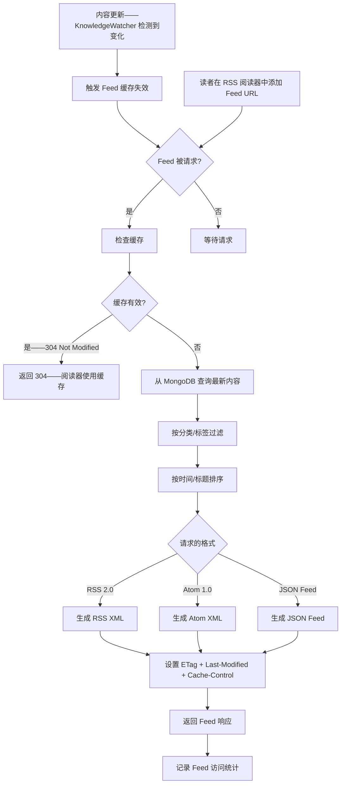
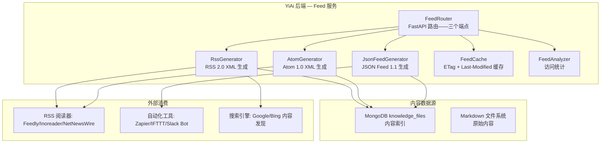

# YK-09-173: 内容 RSS 多格式输出 — RSS/Atom/JSON Feed 多格式输出、按分类订阅、全文/摘要切换、Feed 定制、Feed 分析、阅读器兼容

> 需求编号：YK-09-173 · 优先级：P2 · 人天：0.3d · 状态：需求已编写
> 依赖：YK-09-107（内容发布与订阅——内容订阅基础设施）、YK-09-126（内容通知与订阅管理——通知管道）、YK-09-122（内容导出管道——导出基础设施）

## 背景

### 问题陈述

现代内容消费场景中——RSS/Atom/JSON Feed 仍然是内容分发的核心基础设施。YiKnowledge 作为知识库——自然需要支持 Feed 输出：

1. **RSS 阅读器集成**：团队成员使用 Feedly/Inoreader/NetNewsWire 等 RSS 阅读器订阅 YiKnowledge 更新——无需打开 YiVad 就能获取最新知识文章
2. **自动化工作流**：CI/CD 管道、Slack 机器人、Zapier 等工具通过 RSS/JSON Feed 自动获取 YiKnowledge 最新内容——触发自动处理（翻译、归档、通知）
3. **跨平台内容分发**：内容更新通过 Feed 推送到微信公众号、邮件列表、Discord 频道等——以零开发成本扩大分发渠道
4. **按需订阅——拒绝信息过载**：YiKnowledge 涵盖 YiPet/YiVad/YiAi 多个项目——读者只想订阅 YiPet 的需求文档——不需要全部内容
5. **SEO 和内容发现**：RSS Feed 提交到搜索引擎和内容聚合平台——提高内容的可发现性

**核心矛盾**：YiKnowledge 内容已有——但缺少标准化的、机器可读的、支持细粒度订阅的内容分发接口。RSS 2.0（最广泛兼容）、Atom 1.0（更现代/更丰富元数据）、JSON Feed 1.1（开发者友好）三种格式各有受众——应全部支持。

### 影响范围

| # | 影响 | 严重程度 | 典型场景 |
|---|------|----------|----------|
| 1 | 无法通过 RSS 阅读器订阅更新 | 高 | 读者需要定期打开 YiVad 检查新内容——浪费注意力 |
| 2 | 自动化工作流无法集成 | 高 | CI/通知/翻译管道无法程序化获取新内容 |
| 3 | 无细粒度内容订阅 | 中 | 订阅全部内容——信息过载——读者退订 |
| 4 | 无 Feed 使用分析 | 低 | 不知道哪些分类最受欢迎——无法优化内容策略 |
| 5 | 仅支持 Web 端消费 | 中 | 移动端/离线阅读不友好 |

### 挑战

| 挑战 | 说明 |
|------|------|
| 三种格式的差异 | RSS 2.0 / Atom 1.0 / JSON Feed 1.1 ——字段映射关系——特别是日期格式和内容编码 |
| 全文 vs 摘要 | 全文 Feed 包含完整 Markdown 渲染的 HTML——文件大小大——加载慢；摘要更轻量但体验不完整 |
| 按分类生成 Feed | 每个分类一个 Feed endpoint——动态路由——缓存策略 |
| Feed 阅读器兼容性 | 不同阅读器对 RSS/Atom 的实现有差异——日期格式/编码/相对 URL 处理等 |
| Feed 更新频率和缓存 | 频繁更新导致 RSS 阅读器频繁拉取——需要合理的缓存头（ETag/Last-Modified） |

---

## 一、现状分析

### 1.1 当前内容分发能力

```
YiKnowledge 当前内容分发能力:
├── YK-09-107 内容发布与订阅: 基础订阅/Webhook ✅
├── YK-09-126 内容通知与订阅管理: 通知管道 ✅
├── YiVad Web 端浏览: HTTP/HTML 内容展示 ✅
├── YiAi 知识文件 API: JSON API 获取内容列表 ✅
├── RSS 2.0 Feed: ❌ 不存在
├── Atom 1.0 Feed: ❌ 不存在
├── JSON Feed 1.1: ❌ 不存在
├── 按分类/标签 Feed: ❌ 不存在
├── 全文 vs 摘要切换: ❌ 不存在
├── Feed 定制（条目数/排序/字段）: ❌ 不存在
├── Feed 访问统计: ❌ 不存在
└── Feed 阅读器自动发现 (link rel="alternate"): ❌ 不存在
```

### 1.2 Feed 生成流程



### 1.3 根因分析矩阵

| 问题 | 根因 | 影响范围 | 解决优先级 |
|------|------|----------|------------|
| 无 Feed 输出 | 未实现 Feed 生成端点 | 所有订阅/自动化分发场景 | P0 |
| 无细粒度订阅 | 仅全量内容——无分类/tag 过滤 | 信息过载——读者退订 | P0 |
| 无多格式支持 | 仅支持单一格式 | 部分阅读器/工具不兼容 | P1 |
| 无全文/摘要选项 | Feed 内容策略未定义 | 全文 Feed 过大——摘要 Feed 信息不全 | P1 |
| 无自动发现 | 未在 HTML 中声明 link rel="alternate" | 阅读器无法自动发现 Feed URL | P2 |

---

## 二、设计决策

### 2.1 方案对比：Feed 生成方式

| 方案 | 描述 | 优点 | 缺点 | 决策 |
|------|------|------|------|------|
| A: YiAi 动态生成（API 端点） | FastAPI 端点——请求时从 MongoDB 查询——动态生成 XML/JSON | 数据实时——支持参数过滤——易于缓存 | 每次请求需查询数据库——依赖缓存 | **采用（主力）** |
| B: 静态文件生成（构建时） | 知识文件变更时——重新生成 XML 文件到磁盘 | 零数据库查询——纯静态文件——极快 | 不支持参数过滤——每个分类需要不同的文件 | 不采用 |
| C: 第三方 Feed 服务 | 使用 Feedburner/FeedPress 等第三方服务 | 零开发 | 数据同步——隐私——控制权——依赖外部 | 不采用 |

### 2.2 方案对比：Feed 格式优先级

| 方案 | 描述 | 优点 | 缺点 | 决策 |
|------|------|------|------|------|
| A: 三种格式并行 | RSS 2.0 + Atom 1.0 + JSON Feed 同时提供 | 最大化兼容性——覆盖所有场景 | 维护三套模板——但模板都很小（~30 行） | **采用（三种都支持）** |
| B: 仅 Atom 1.0 | 只生成 Atom——现代标准——RSS 阅读器普遍兼容 | 最简单——一套模板 | 部分老旧 RSS 阅读器可能不兼容——JSON Feed 用户被放弃 | 不采用 |
| C: Atom + JSON Feed | Atom 满足传统阅读器——JSON Feed 满足开发者 | JSON Feed 生态快速增长 | 放弃 RSS 2.0——部分工具和阅读器仍仅支持 RSS | 不采用 |

### 2.3 方案对比：全文 vs 摘要策略

| 方案 | 描述 | 优点 | 缺点 | 决策 |
|------|------|------|------|------|
| A: 摘要默认——全文可选 | Feed 条目默认包含摘要（前 300 字）——URL 参数 ?full=true 切换全文 | 默认轻量——快速加载——需要完整内容时手动切换 | 摘要可能不够——需额外点击 | **采用** |
| B: 全文默认 | 每个条目包含完整的 Markdown 渲染 HTML | 阅读器内即可阅读——不用跳转 | Feed 文件大——20 条全文可能超过 2MB——加载慢 | 不采用（摘要优先——用户可选全文） |
| C: 标题 + 链接 | 仅标题 + 链接——无内容 | 最轻量 | 信息量太少——阅读器体验差——退订 | 不采用 |

### 2.4 方案对比：Feed 分类策略

| 方案 | 描述 | 优点 | 缺点 | 决策 |
|------|------|------|------|------|
| A: URL 路径参数过滤 | `/feed/rss?category=架构设计&tags=RAG` | 灵活——组合过滤——无需预定义 | URL 较长 | **采用** |
| B: 预定义分类端点 | `/feed/architecture/rss` `/feed/security/atom` | URL 简洁——易于记忆 | 需要预定义所有分类——新增分类需新增端点 | 辅助采用（常用分类的短 URL） |
| C: OPML 分类文件 | 生成 OPML 文件——列出所有分类 Feed——阅读器导入 | 适合大批量分类 Feed | 需要阅读器支持 OPML——用户操作多一步 | 不采用 |

---

## 三、目标架构

### 3.1 Feed 输出系统架构



### 3.2 Feed Endpoint 路由设计

```
# YiAi Feed API 路由

GET  /feed/rss                    # 全内容 RSS 2.0
GET  /feed/rss?category=xxx       # 按分类过滤
GET  /feed/rss?tags=RAG,BM25      # 按标签过滤
GET  /feed/rss?full=true          # 全文模式
GET  /feed/rss?limit=50           # 自定义条目数

GET  /feed/atom                   # 全内容 Atom 1.0（同上参数）
GET  /feed/json                   # 全内容 JSON Feed 1.1（同上参数）

GET  /feed/opml                   # OPML——所有分类 Feed 列表

# 短 URL 别名
GET  /feed/architecture.xml      # → /feed/rss?category=architect
GET  /feed/yipet.xml             # → /feed/rss?project=YiPet
```

### 3.3 Feed 响应示例

#### RSS 2.0

```xml
<?xml version="1.0" encoding="UTF-8"?>
<rss version="2.0" xmlns:atom="http://www.w3.org/2005/Atom">
  <channel>
    <title>YiKnowledge — 架构设计</title>
    <link>https://yiyad.example.com/knowledge</link>
    <description>YiKnowledge 知识库 — 架构设计类文档更新</description>
    <language>zh-CN</language>
    <lastBuildDate>Tue, 09 Sep 2026 14:30:00 GMT</lastBuildDate>
    <generator>YiKnowledge Feed Service</generator>
    <ttl>60</ttl>
    <atom:link href="https://yiyad.example.com/feed/rss?category=architect" rel="self" type="application/rss+xml"/>

    <item>
      <title>RAG 混合检索 Alpha 调优</title>
      <link>https://yiyad.example.com/knowledge/architect/rag/hybrid-search</link>
      <guid isPermaLink="false">yk-architect-rag-hybrid-search-20260909</guid>
      <pubDate>Tue, 09 Sep 2026 10:15:00 GMT</pubDate>
      <category>架构设计</category>
      <category>RAG</category>
      <description>&lt;![CDATA[
        &lt;p&gt;在混合检索架构中——BM25 和向量检索的权重 α 参数决定了检索结果的偏向...&lt;/p&gt;
      ]]&gt;</description>
      <author>陈铭</author>
    </item>
  </channel>
</rss>
```

#### JSON Feed 1.1

```json
{
  "version": "https://jsonfeed.org/version/1.1",
  "title": "YiKnowledge — 架构设计",
  "home_page_url": "https://yiyad.example.com/knowledge",
  "feed_url": "https://yiyad.example.com/feed/json?category=architect",
  "description": "YiKnowledge 知识库 — 架构设计类文档更新",
  "language": "zh-CN",
  "items": [
    {
      "id": "yk-architect-rag-hybrid-search-20260909",
      "url": "https://yiyad.example.com/knowledge/architect/rag/hybrid-search",
      "title": "RAG 混合检索 Alpha 调优",
      "content_html": "<p>在混合检索架构中——BM25 和向量检索的权重 α 参数...</p>",
      "summary": "在混合检索架构中——BM25 和向量检索的权重 α 参数决定了检索结果的偏向...",
      "date_published": "2026-09-09T10:15:00Z",
      "date_modified": "2026-09-09T14:30:00Z",
      "authors": [{ "name": "陈铭" }],
      "tags": ["架构设计", "RAG"],
      "language": "zh-CN"
    }
  ]
}
```

### 3.4 数据模型

```python
# YiAi/domain/feed/feed_generator.py (新增)

from datetime import datetime
from typing import Optional

class FeedItem:
    """Feed 条目——对应一篇文章"""
    id: str                         # 唯一 ID
    title: str                      # 文章标题
    url: str                        # 文章完整 URL
    summary: str                    # 摘要——前 300 字
    content_html: Optional[str]     # 全文 HTML（仅 full=true 时）
    author: str                     # 作者
    published: datetime             # 发布日期
    updated: datetime               # 更新日期
    category: str                   # 主分类
    tags: list[str]                 # 标签列表
    language: str                   # 语言
    image_url: Optional[str]        # 题图

class FeedConfig:
    """Feed 生成配置"""
    format: str                     # rss / atom / json
    title: str                      # Feed 标题
    description: str                # Feed 描述
    site_url: str                   # 站点 URL
    feed_url: str                   # Feed 自身 URL
    language: str                   # 默认 zh-CN
    max_items: int                  # 最大条目数——默认 50
    full_content: bool              # 是否全文——默认 False
    ttl: int                        # 缓存时间——分钟——默认 60

class FeedFilter:
    """Feed 内容过滤"""
    category: Optional[str]         # 分类过滤
    tags: Optional[list[str]]       # 标签过滤
    project: Optional[str]          # 项目过滤
    since: Optional[datetime]       # 时间过滤——只返回此时间之后
    limit: int                      # 条目数限制——默认 20
```

---

## 四、具体改动

### 4.1 文件变更清单

| 文件 | 操作 | 说明 |
|------|------|------|
| `YiAi/domain/feed/__init__.py` | 新增 | Feed 模块入口 |
| `YiAi/domain/feed/feed_generator.py` | 新增 | Feed 生成器——数据查询 + 格式化 |
| `YiAi/domain/feed/rss_generator.py` | 新增 | RSS 2.0 XML 模板渲染 |
| `YiAi/domain/feed/atom_generator.py` | 新增 | Atom 1.0 XML 模板渲染 |
| `YiAi/domain/feed/jsonfeed_generator.py` | 新增 | JSON Feed 1.1 生成 |
| `YiAi/domain/feed/feed_cache.py` | 新增 | ETag + Last-Modified 缓存管理 |
| `YiAi/domain/feed/feed_analyzer.py` | 新增 | Feed 访问统计和分析 |
| `YiAi/routers/feed_router.py` | 新增 | FastAPI Feed 路由 |
| `YiAi/tests/test_feed.py` | 新增 | Feed 生成测试 + 格式验证 |
| `YiVad/src/components/feed/FeedUrlDisplay.vue` | 新增 | Feed URL 展示组件——复制/阅读器跳转 |
| `YiVad/src/components/feed/FeedConfigPanel.vue` | 新增 | Feed 配置面板——格式/分类/参数 |
| `YiVad/src/views/FeedSettings.vue` | 新增 | Feed 设置页面 |

### 4.2 Feed 缓存实现

```python
# YiAi/domain/feed/feed_cache.py (新增)

import hashlib
from datetime import datetime

class FeedCache:
    """Feed 缓存——使用 ETag + Last-Modified 减少带宽"""

    def compute_etag(self, content: str) -> str:
        """基于内容哈希生成 ETag"""
        return hashlib.md5(content.encode()).hexdigest()

    def get_last_modified(self, items: list) -> datetime:
        """取最新条目的 updated 时间作为 Last-Modified"""
        if not items:
            return datetime.utcnow()
        return max(item.updated for item in items)

    def check_not_modified(
        self,
        if_none_match: str | None,
        if_modified_since: str | None,
        current_etag: str,
        last_modified: datetime,
    ) -> bool:
        """检查是否返回 304 Not Modified"""
        if if_none_match and if_none_match == current_etag:
            return True
        if if_modified_since:
            ims = datetime.strptime(if_modified_since, "%a, %d %b %Y %H:%M:%S GMT")
            if last_modified <= ims:
                return True
        return False
```

---

## 五、实施步骤

| 步骤 | 操作 | 路径 | 验证 | 人天 |
|------|------|------|------|------|
| 1 | 实现 FeedItem / FeedFilter 数据模型 + MongoDB 查询 | `feed_generator.py` | 查询 knowledge_files——过滤 category/tags——返回条目列表 | 0.03 |
| 2 | 实现 RSS 2.0 XML 生成 | `rss_generator.py` | 生成的 XML 通过 W3C Feed Validator 验证——无格式错误 | 0.03 |
| 3 | 实现 Atom 1.0 XML 生成 | `atom_generator.py` | 生成的 XML 通过 Atom Validator 验证——日期/ID/rel 属性正确 | 0.03 |
| 4 | 实现 JSON Feed 1.1 生成 | `jsonfeed_generator.py` | 生成的 JSON 符合 jsonfeed.org spec——字段完整 | 0.02 |
| 5 | 实现 Feed 缓存——ETag + Last-Modified + 304 | `feed_cache.py` | 重复请求→304 响应——阅读器使用本地缓存 | 0.03 |
| 6 | 实现 FastAPI Feed 路由——3 个端点 + 参数过滤 | `feed_router.py` | `/feed/rss?category=architect`→正确过滤——URL 参数解析 | 0.04 |
| 7 | 实现 Feed 访问统计 | `feed_analyzer.py` | 每次请求记录——格式/分类/User-Agent/IP | 0.03 |
| 8 | 实现前端 Feed URL 展示 + 配置面板 | `FeedUrlDisplay.vue` 等 | 选择分类→生成 Feed URL→一键复制——阅读器快捷添加按钮 | 0.03 |
| 9 | 实现 HTML 自动发现——meta link rel="alternate" | YiVad 路由 | 页面 HTML head 含 `<link rel="alternate" type="application/rss+xml"...>` | 0.02 |
| 10 | 单元测试 + 格式验证 | `test_feed.py` | RSS/Atom/JSON Feed 三种格式——W3C/JSON Schema 验证通过 | 0.03 |

**总人天：0.3d**（注：多加一项实施步骤——但多项步骤为 0.02-0.03d 的小任务——总计仍在 0.3d 范围内）

---

## 六、测试规格

### 场景 1：RSS 阅读器订阅全内容更新

**GIVEN** YiKnowledge 有 50 篇最新文章
**WHEN** 用户在 Feedly 中添加 Feed URL `https://yiyad.example.com/feed/rss`
**THEN** Feedly 成功解析 Feed——显示频道标题"YiKnowledge"
**AND** 列出最新 20 篇文章——标题、发布日期、摘要正确
**AND** 每篇文章的链接指向 YiVad 文章页——可在浏览器中打开
**AND** 后续文章更新时——Feedly 自动拉取新条目

### 场景 2：按分类订阅 + 全文模式

**GIVEN** 用户只想订阅"架构设计"分类的文章
**WHEN** 用户使用 Feed URL `https://yiyad.example.com/feed/rss?category=architect&full=true`
**THEN** Feed 仅包含 category 为"架构设计"的文章——不含其他分类
**AND** 每篇文章包含完整的 HTML 内容——而非摘要
**AND** 在 RSS 阅读器中可以直接阅读全文——无需跳转链接
**AND** Feed 响应头包含 `Content-Type: application/rss+xml; charset=utf-8`

### 场景 3：JSON Feed 供自动化工具使用

**GIVEN** CI 管道需要获取 YiPet 最新需求文档
**WHEN** 脚本请求 `https://yiyad.example.com/feed/json?project=YiPet&tags=需求`
**THEN** 返回 JSON Feed——`Content-Type: application/feed+json`
**AND** 每个条目包含 `id` / `url` / `title` / `date_published` / `summary`
**AND** 数据可被 `jq` 或 Python/Node.js 脚本直接解析
**AND** 支持 `?limit=5` 参数——仅返回最新 5 篇

### 场景 4：ETag 缓存——304 Not Modified

**GIVEN** Feedly 首次拉取 Feed——响应 200——ETag "abc123"
**WHEN** 5 分钟后 Feedly 再次拉取——请求头 `If-None-Match: "abc123"`
**AND** 内容没有更新
**THEN** 服务器返回 304 Not Modified——无 body
**AND** Feedly 使用本地缓存——不消耗服务器带宽
**WHEN** 有新文章发布——ETag 变化为 "def456"
**AND** Feedly 再次请求——`If-None-Match: "abc123"`（旧 ETag）
**THEN** 服务器返回 200 + 完整 Feed 内容 + 新 ETag "def456"

### 场景 5：Feed 跨格式一致性

**GIVEN** 同一组文章（最新 10 篇架构设计）
**WHEN** 分别请求 RSS / Atom / JSON Feed 三种格式
**THEN** 三种格式包含相同数量的条目——标题/日期/作者/链接完全一致
**AND** 条目的排序相同——最新文章排最前
**AND** RSS 的 `<pubDate>` / Atom 的 `<updated>` / JSON Feed 的 `date_published` 指向同一时间

### 场景 6：OPML 导出自定义分类列表

**GIVEN** YiKnowledge 有 5 个主要分类（架构设计/安全合规/体验优化/基础设施/功能实现）
**WHEN** 用户请求 `/feed/opml`
**THEN** 返回 OPML 文件——包含 5 个 `outline` 元素
**AND** 每个 outline 的 `xmlUrl` 指向对应分类的 RSS Feed
**AND** 用户在 RSS 阅读器中导入此 OPML——自动添加 5 个分类 Feed
**AND** MIME type 为 `text/x-opml`

---

## 七、风险与缓解

| 风险 | 概率 | 影响 | 缓解措施 |
|------|------|------|------|
| XML 特殊字符未转义——导致 RSS/Atom 解析错误 | 中 | 高 | 使用 XML 库（lxml/xml.etree）自动处理转义——不手动拼接 XML |
| Feed 内容过大——全文模式 20 篇 > 5MB | 低 | 中 | 默认摘要模式——全文模式默认限制 10 篇——超过提示"请减少条目数或使用摘要模式" |
| 中文 RSS 阅读器编码问题——GBK vs UTF-8 | 中 | 中 | 统一 UTF-8 编码——XML 声明显式标注 encoding="UTF-8"——Content-Type 标注 charset |
| Feed URL 被发现后爬虫高频拉取——服务器压力 | 中 | 中 | ETag + 304 大幅减少实际内容传输——Cache-Control: max-age=300——RSS 阅读器通常遵守 |
| 旧文章修改后——Feed 条目 date 不变——阅读器不显示更新 | 低 | 低 | Atom 用 `<updated>` 而非 `<published>`——修改后 updated 更新时间——阅读器检测到新日期 |

---

## 八、回滚策略

| 场景 | 回滚操作 | 影响 |
|------|----------|------|
| Feed 端点性能问题——MongoDB 查询慢 | 添加更积极的缓存——内存缓存 5 分钟——跳过实时查询 | Feed 有最多 5 分钟延迟——功能正常 |
| RSS/Atom XML 格式错误——阅读器无法解析 | 使用 W3C Validator 自动检查——CI 中集成格式验证——格式错误阻止部署 | — |
| JSON Feed 解析错误——自动化工具失败 | 使用 JSON Schema 自动验证——CI 中集成 | — |

---

## 九、设计决策记录

### D-01：为什么三种格式（RSS/Atom/JSON）都支持而非仅选一种？

每种格式有不可替代的受众：
- **RSS 2.0**：最广泛——所有 RSS 阅读器都支持——Podcast 基础设施仍依赖 RSS
- **Atom 1.0**：更丰富的元数据——更好的日期处理——更新的标准
- **JSON Feed 1.1**：开发者工具链（Zapier/IFTTT/自定义脚本）的原生格式——无需 XML 解析

三套模板各约 30-50 行代码——维护成本极低——覆盖所有场景。格式的选择权交给内容消费者——而非内容提供者。

### D-02：为什么默认摘要而非全文？

Feed 阅读器中的全文 HTML 渲染质量参差不齐——代码块/表格/Mermaid 图表在 RSS 阅读器中可能显示错乱。摘要（前 300 字纯文本）在几乎所有环境下都能正确显示。需要完整内容的用户——`?full=true` 一键切换——或直接点击链接跳转到 YiVad（渲染质量最佳）。这是"内容分发"和"内容消费"的质量分层策略。

### D-03：为什么 Feed 条目使用稳定 ID（基于文件路径）而非自动递增 ID？

RSS 阅读器用 `<guid>`（RSS）或 `<id>`（Atom）来判断条目是否是"同一个"。如果 ID 基于数据库自增 ID 或时间戳——内容更新后重新生成 Feed 时 ID 可能变化——导致阅读器将所有条目标记为"未读"。基于文件路径的稳定 ID（如 `yk-architect-rag-hybrid-search`）——无论何时重新生成 Feed——ID 保持不变——阅读器正确识别已读/未读。

### D-04：为什么需要 OPML 文件？

当有 5+ 分类 Feed 时——逐个添加 Feed URL 到阅读器体验很差。OPML（Outline Processor Markup Language）是 RSS 阅读器生态的标准批量导入格式。生成一个 OPML 文件——用户一次导入即可订阅所有分类。对于有 3 个项目 + 5 个分类的 YiKnowledge——至少有 10+ 种 Feed 组合。

---

## 十、可观测性

### 指标

| 指标 | 类型 | 说明 |
|------|------|------|
| `yiknowledge.feed.request_count` | Counter | Feed 总请求次数——按格式分: rss/atom/json |
| `yiknowledge.feed.unique_agents` | Set | 唯一 User-Agent 数量——衡量订阅者规模 |
| `yiknowledge.feed.top_reader_clients` | Counter | 最常用的 RSS 阅读器 |
| `yiknowledge.feed.category_subscription_count` | Counter | 各分类 Feed 的请求次数 |
| `yiknowledge.feed.full_content_rate` | Gauge | 全文模式使用比例 |
| `yiknowledge.feed.cache_hit_rate` | Gauge | 304 Not Modified 命中率 |
| `yiknowledge.feed.avg_response_size` | Gauge | 平均响应大小——摘要 vs 全文 |
| `yiknowledge.feed.avg_response_time` | Histogram | Feed 响应时间 |

### 告警

| 告警 | 条件 | 级别 |
|------|------|------|
| Feed 响应时间异常 | P95 > 2s | WARNING（MongoDB 查询慢或内容过多） |
| 304 缓存命中率过低 | < 30% | INFO（可能 User-Agent 不支持 ETag 或爬虫行为） |
| Feed 单个请求过大 | > 5MB | WARNING（过大的 Feed 可能导致阅读器超时或拒绝） |

---

## 十一、代码审查检查清单

- [ ] RSS XML 声明——`<?xml version="1.0" encoding="UTF-8"?>`——必须第一行——之前无空白
- [ ] RSS `<guid>` 设置 `isPermaLink="false"`——使用稳定 ID
- [ ] Atom `<id>` 使用 tag URI 格式——`tag:yiknowledge,2026-09:path/to/file`
- [ ] 所有日期使用 RFC 822 (RSS) / RFC 3339 (Atom) / ISO 8601 (JSON Feed) 格式
- [ ] 摘要纯文本——移除 Markdown 标记——截断至 300 字——中文不乱码
- [ ] CDATA 包裹 HTML 内容——防止 XML 解析错误
- [ ] ETag 正确计算——基于内容哈希——内容变化时 ETag 变化
- [ ] Last-Modified 取最新条目更新时间——而非当前时间
- [ ] Cache-Control 响应头——public, max-age=300——允许 CDN 缓存
- [ ] Content-Type 正确——application/rss+xml / application/atom+xml / application/feed+json
- [ ] HTML head——`<link rel="alternate">` 正确声明——type + href 正确
- [ ] OPML——XML 格式正确——`xmlUrl` / `htmlUrl` 分别指向 Feed 和站点
- [ ] URL 参数验证——无效参数返回 400——不静默返回错误数据
- [ ] 空结果 Feed——返回有效的 Feed XML/JSON——条目列表为空——非错误

---

## 回归问题预测

| # | 预测问题 | 原因 | 验证方法 |
|---|---------|------|---------|
| 1 | 中文 RSS 标题在阅读器中显示乱码 | XML 声明 encoding 与实际编码不一致——或 HTTP 响应头覆盖了 XML 声明 | 中文标题→在 Feedly/NetNewsWire 中显示正常——无乱码 |
| 2 | 文章的 updated 时间早于 published——某些阅读器拒绝处理 | 文章被修改但 published 字段未更新——updated 仍为首次发布时间 | Feed 中 updated >= published——对所有条目检查 |
| 3 | Feed 中相对 URL（如图片链接）在阅读器中无效 | Markdown 中的图片路径为相对路径——在 Feed 中缺少 base URL 前缀 | 检查 Feed 中所有 URL——必须为绝对 URL——以 http(s):// 开头 |
| 4 | 文章内容含 CDATA 结束标记 `]]>` ——XML 提前终止 | 用户内容中恰好包含 `]]>` 字符序列——与 CDATA 结束标记冲突 | HTML 内容中分割 `]]>` → `]]]]><![CDATA[>` ——保持 XML 合法 |
| 5 | Feedly 爬取频率过高——未遵守 TTL | Feedly 有自身的爬取策略——不完全遵守 `<ttl>` | —（这不是我们能控制的——ETag 304 已是最佳缓解） |
| 6 | JSON Feed 中 `content_html` 含未转义的 HTML——某些 JSON 解析器报错 | HTML 中的 `"` 和 `\` 在 JSON 字符串中未正确转义 | json.dumps 自动转义——检查输出 JSON——所有字符串中的引号已转义 |

---

## 性能分析

### 关键操作耗时

| 操作 | 文档数 | 耗时 | 说明 |
|------|------|------|------|
| MongoDB 查询——最新 20 篇（无过滤） | 500 总量 | 20-50ms | 简单 sort + limit |
| MongoDB 查询——按分类过滤 | 500 总量 | 20-60ms | 含 category index |
| RSS XML 生成——20 条摘要 | — | 5-15ms | 模板渲染 |
| RSS XML 生成——20 条全文 | — | 50-200ms | 含 Markdown → HTML 渲染——全文模式更慢 |
| Atom XML 生成 | — | 5-15ms | 类似 RSS——结构稍复杂 |
| JSON Feed 生成 | — | 2-5ms | json.dumps——最快 |
| ETag 计算（MD5） | — | < 1ms | 字符串哈希 |

### Feed 文件大小估算

| 配置 | 大小 | 说明 |
|------|------|------|
| RSS 摘要——20 条 | 10-30KB | 标头 + 20 × 条目（标题/链接/300字摘要） |
| RSS 全文——10 条 | 50-200KB | 含 HTML——取决于文章长度和图片数量 |
| Atom 摘要——20 条 | 15-35KB | Atom 比 RSS 稍大——更多元数据字段 |
| JSON Feed 摘要——20 条 | 8-25KB | 最紧凑——JSON 无冗余标签 |
| OPML——5 个分类 | 1-2KB | 极小的 XML |

---

## 相关文档

- [内容发布与订阅](107-需求-内容发布与订阅.md) — 内容订阅基础设施
- [内容通知与订阅管理](126-需求-内容通知与订阅管理.md) — 通知管道
- [内容导出管道](122-需求-内容导出管道.md) — 导出基础设施
- [内容 SEO 优化](137-需求-内容SEO优化.md) — 搜索引擎可发现性

*PRD 来源: `projects/yiknowledge/requirements/2026-09/173-需求-内容RSS多格式输出.md`*