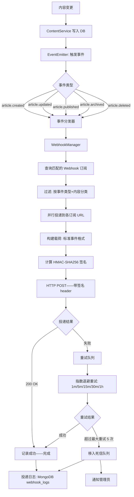
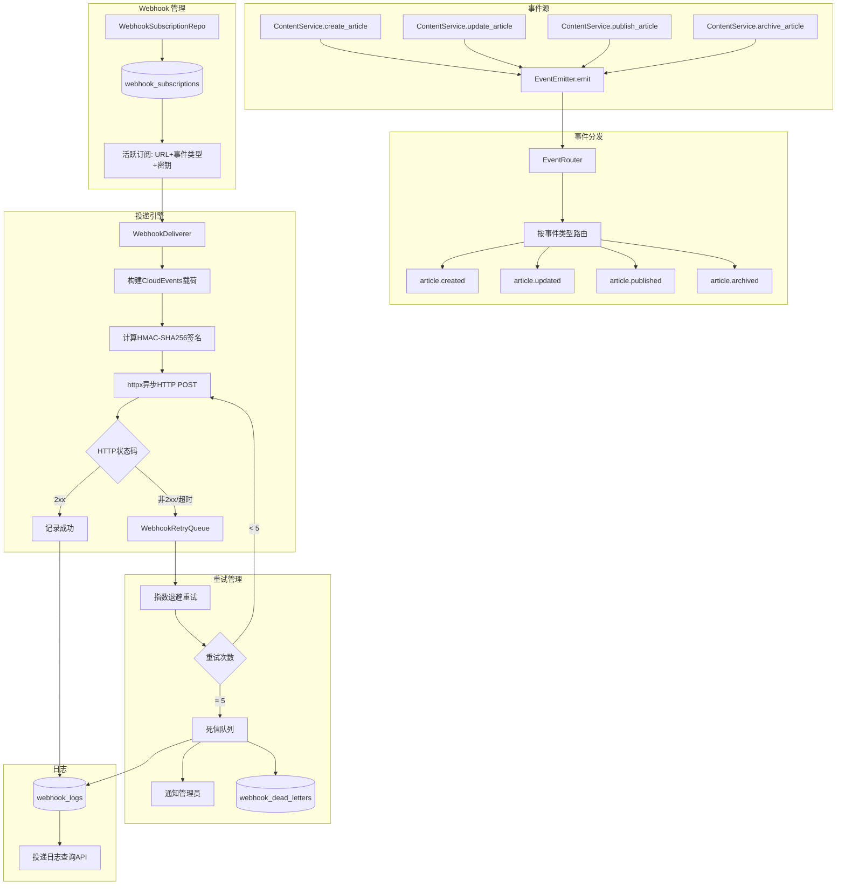

# YK-09-175: 内容Webhook通知 — 文章创建/更新/发布/归档事件、Webhook注册、投递重试、载荷格式、安全签名

> 需求编号：YK-09-175 · 优先级：P2 · 人天：0.3d · 状态：需求已编写
> 依赖：YK-09-67（Webhook管理界面——复用 Webhook 配置基础设施）、YK-09-126（内容通知与订阅管理——复用通知管道）、YK-09-107（内容发布与订阅——复用发布事件）

## 背景

### 问题陈述

YiKnowledge 知识库内容变更时（创建/更新/发布/归档）——下游系统无法被动感知——只能通过定期轮询 API 来检测变化。在内容驱动的工作流中——实时性至关重要：

1. **无事件通知**：文章发布后——下游系统（CI 管道、前端网站、搜索引擎索引）不知道——直到下次轮询才发现——延迟 5-30 分钟
2. **无 Webhook**：无法注册回调 URL——GitHub 式的 Webhook 机制缺失——每个下游系统都需要自己写轮询逻辑——代码重复
3. **无投递重试**：Webhook 投递失败后——没有重试机制——网络抖动或下游服务短暂不可用——事件永久丢失
4. **无安全验证**：下游系统收到 Webhook——无法验证请求确实来自 YiKnowledge——存在伪造攻击风险
5. **无事件类型过滤**：下游系统只想关注"已发布"事件——却收到所有事件——浪费处理资源

**核心矛盾**：内容驱动的工作流需要"推"模式——但当前只有"拉"模式（API 轮询）。目标是在 YiKnowledge 中构建标准的 Webhook 事件系统——让下游系统订阅内容变更事件——实现内容变化时的实时级联反应。

### 影响范围

| # | 影响 | 严重程度 | 典型场景 |
|---|------|----------|----------|
| 1 | 下游感知延迟——5-30 分钟 | 高 | 文章发布后——文档站点 30 分钟后才更新——用户体验差 |
| 2 | 每个下游系统都要写轮询 | 高 | 5 个下游系统——5 套不同的轮询实现 |
| 3 | 事件丢失——无重试 | 高 | Webhook 投递时下游 502——事件永远丢失——需要手动补偿 |
| 4 | 无安全验证——伪造风险 | 中 | 攻击者伪造 Webhook 请求——下游系统执行恶意操作 |
| 5 | 无法按需订阅——资源浪费 | 中 | 订阅者收到大量不关心的事件——过滤处理增加开销 |

### 挑战

| 挑战 | 说明 |
|------|------|
| Webhook 投递可靠性 | 保证 at-least-once 投递——失败重试指数退避——最终一致性 |
| 载荷格式标准化 | 定义标准事件格式——支持版本化——向后兼容 |
| 签名验证 | HMAC-SHA256 签名——密钥管理——下游验证指南 |
| 重试队列设计 | 失败事件暂存——定时重试——最大重试次数——死信队列 |
| 并发投递 | 多个 Webhook 订阅者——并行投递——不锁定 |

---

## 一、现状分析

### 1.1 当前事件通知能力

```
YiKnowledge 事件通知现状:
├── 内容发布与订阅（YK-09-107）
│   ├── 内部发布流程 ✅
│   └── 限制: 只服务于 YiKnowledge 内部——外部无法订阅
├── 通知偏好中心（YK-09-61）
│   ├── 用户通知偏好设置 ✅
│   └── 限制: 面向用户——非系统间事件通知
├── Webhook 管理界面（YK-09-67）
│   ├── Webhook 注册和管理 UI ✅
│   └── 限制: 通用框架——未集成内容事件——无投递实现
├── 通知与订阅管理（YK-09-126）
│   ├── 通知管道 ✅
│   └── 限制: 面向站内通知——非外部 Webhook

缺失:
├── 内容事件定义: article.created/updated/published/archived/deleted   # ❌ 无——无事件类型
├── 事件发布: 在内容变更时触发事件                                    # ❌ 无——只有数据库写入——无事件广播
├── Webhook 注册: 注册回调 URL+事件类型+密钥                          # ❌ 无——注册 API 未实现
├── Webhook 投递: HTTP POST 到回调 URL                                # ❌ 无——无 HTTP 投递
├── 投递重试: 失败后自动重试——指数退避                                # ❌ 无——无重试机制
├── 签名: HMAC-SHA256 签名——下游验证                                  # ❌ 无——无安全验证
├── 投递日志: 记录每次投递的成功/失败+状态                             # ❌ 无——无日志——无人调试
├── 死信队列: 超过最大重试次数的事件存储                              # ❌ 无——事件丢弃无记录
└── 批量事件: 批量操作只触发一个事件                                  # ❌ 无——批量操作触发 N 个事件——Webhook 爆炸
```

### 1.2 Webhook 投递流程



### 1.3 根因分析矩阵

| 缺失能力 | 根因 | 技术障碍 | 优先级 |
|----------|------|----------|--------|
| 内容事件定义和发布 | 无事件系统——内容变更是纯 DB 操作 | ContentService 中埋点事件发布 | P0 |
| Webhook 注册 | 无注册 API——无存储 | webhook_subscriptions 集合+注册 API | P0 |
| HTTP 投递 | 无 HTTP 客户端——无异步投递 | httpx/aiohttp 异步投递——连接池 | P0 |
| 投递重试 | 无重试队列——无退避策略 | asyncio 队列+指数退避定时器 | P0 |
| 签名验证 | 无签名计算——无密钥管理 | HMAC-SHA256 标准实现+密钥存储 | P1 |
| 投递日志 | 无日志记录 | webhook_logs 集合——按 subscription 索引 | P1 |
| 死信队列 | 无失败事件持久化 | 独立集合或 webhook_logs 的 status 字段 | P2 |

---

## 二、设计决策

### 决策表 1：投递可靠性——at-least-once vs exactly-once

| 选项 | 描述 | 优点 | 缺点 | 决策 |
|------|------|------|------|------|
| A: at-least-once | 保证至少投递一次——可能重复——下游去重 | 实现简单——可靠性高 | 下游需要幂等处理 | ✅ 选中 |
| B: exactly-once | 保证精确投递一次——不重复不丢失 | 下游无需去重——体验完美 | 实现极复杂——分布式事务——两阶段提交 | ❌ |
| C: at-most-once | 投递一次——失败不重试 | 最简单 | 事件丢失——不可接受 | ❌ |

**决策**：选择 A（at-least-once）。在分布式系统中——exactly-once 极其困难且不切实际（两阶段提交/分布式事务）。at-least-once 是 Webhook 系统的行业标准（GitHub/Stripe/Slack）——通过重试保证投递——要求下游实现幂等（通过 event_id 去重）。这个方案平衡了可靠性和实现复杂度。

### 决策表 2：重试策略——指数退避

| 选项 | 描述 | 优点 | 缺点 | 决策 |
|------|------|------|------|------|
| A: 固定间隔重试 | 每 N 分钟重试一次 | 简单 | 下游恢复后可能立即被打重试流量 | ❌ |
| B: 指数退避 | 1m→5m→15m→30m→1h→放弃 | 给下游恢复时间——不冲击 | 失败事件延迟增长 | ✅ 选中 |
| C: 持续重试 | 永不放弃——一直重试 | 最终必达 | 死事件永久占用资源——队列爆炸 | ❌ |

**决策**：选择 B（指数退避——最多 5 次）。指数退避是标准的重试策略——当下游短暂不可用时逐渐拉长重试间隔。5 次重试 + 1h 间隔覆盖了绝大多数恢复场景。超过 5 次后移入死信队列——人工介入——避免无限重试浪费资源。

### 决策表 3：载荷格式——标准化事件格式

| 选项 | 描述 | 优点 | 缺点 | 决策 |
|------|------|------|------|------|
| A: 自定义 JSON | 自定义 JSON 结构——每次事件不同 | 灵活——可适应不同事件 | 不标准——下游解析复杂 | ❌ |
| B: CloudEvents 规范 | 遵循 CNCF CloudEvents 标准 | 业界标准——跨平台 | 稍微"重"——字段较多 | ✅ 选中 |
| C: 仅文章 ID | 只传递文章 ID——下游自己查询 | 载荷最小 | 下游需要再次 API 调用——延迟 | ❌ |

**决策**：选择 B（CloudEvents 规范）。CloudEvents 是 CNCF 制定的标准事件格式——被 Knative、Azure Event Grid、AWS EventBridge 等广泛采用。使用标准格式意味着下游可以使用统一的 SDK 解析——而不是每个系统自定义格式。格式版本化——v1 稳定。

### 决策表 4：Webhook 签名方案

| 选项 | 描述 | 优点 | 缺点 | 决策 |
|------|------|------|------|------|
| A: HMAC-SHA256 | 使用共享密钥对载荷计算 HMAC——在 header 中传递 | 标准——安全——简单——GitHub 同款 | 密钥共享——双方需安全保管 | ✅ 选中 |
| B: JWT 签名 | 使用私钥签名 JWT——公钥验证 | 非对称——安全 | 复杂——JWT 载荷大——不适合 Webhook | ❌ |
| C: 无签名 | 不签名——靠 HTTPS 保证安全 | 最简单 | 不安全——可被伪造——URL 伪造风险 | ❌ |

**决策**：选择 A（HMAC-SHA256）。HMAC-SHA256 是 Webhook 安全的事实标准——GitHub/Stripe/Slack 全部使用。客户端用共享密钥对请求体计算 HMAC——放在 X-Webhook-Signature header 中。下游使用相同的密钥验证——匹配即证明来源于 YiKnowledge。

---

## 三、目标架构

### 3.1 Webhook 系统架构



### 3.2 Webhook 数据模型

```typescript
// CloudEvents 格式载荷
interface WebhookPayload {
  // CloudEvents 标准字段
  specversion: string;        // "1.0"
  type: string;               // "yk.article.published"
  source: string;             // "/yiknowledge/projects/yivad"
  subject: string;            // 文章 slug
  id: string;                 // 唯一事件 ID
  time: string;               // ISO 8601 时间戳
  datacontenttype: string;    // "application/json"
  
  // 自定义扩展（CloudEvents 允许）
  ykarticleid: string;        // 文章 ID
  ykarticletitle: string;     // 文章标题
  ykarticleversion: number;   // 文章版本号
  
  // 事件数据
  data: {
    article: {
      id: string;
      title: string;
      slug: string;
      status: string;
      tags: string[];
      category: string;
      author: string;
      version: number;
      publishedAt?: string;
      updatedAt: string;
    };
    changes?: {                // 仅 update 事件
      fields: string[];        // 变更的字段列表
      previousVersion: number;
    };
  };
}

// Webhook 订阅
interface WebhookSubscription {
  id: string;
  name: string;                // 订阅名称
  url: string;                 // 回调 URL
  events: string[];            // 订阅的事件类型 ["article.published", "article.updated"]
  secret: string;              // HMAC 签名密钥（SHA-256 hash 存储）
  filters?: {                  // 可选过滤
    categories?: string[];     // 只关注特定分类
    tags?: string[];           // 只关注特定标签
  };
  headers?: Record<string, string>; // 自定义 HTTP 头
  enabled: boolean;
  retryConfig: {
    maxRetries: number;        // 最大重试次数——默认 5
    retryInterval: number[];   // 重试间隔秒——默认 [60, 300, 900, 1800, 3600]
  };
  createdAt: string;
  updatedAt: string;
}

// 投递日志
interface WebhookDeliveryLog {
  id: string;
  subscriptionId: string;      // 关联订阅
  eventId: string;             // 关联事件 ID
  eventType: string;
  url: string;                 // 回调 URL
  status: 'pending' | 'success' | 'failed' | 'dead_letter';
  httpStatus?: number;         // 下游返回的 HTTP 状态码
  requestBody: string;         // 发送的载荷
  requestHeaders: Record<string, string>;
  responseBody?: string;       // 下游返回的响应体
  responseHeaders?: Record<string, string>;
  duration: number;            // 投递耗时 ms
  attempt: number;             // 第几次投递
  error?: string;              // 错误信息
  createdAt: string;
}
```

---

## 四、具体改动

### 4.1 文件变更清单——YiAi 后端

| 文件 | 操作 | 说明 |
|------|------|------|
| `services/webhook/event_emitter.py` | 新增 | 事件发布器——埋点到 ContentService |
| `services/webhook/webhook_manager.py` | 新增 | Webhook 订阅管理——注册/列表/更新/删除 |
| `services/webhook/webhook_deliverer.py` | 新增 | Webhook 投递引擎——HTTP POST+签名+日志 |
| `services/webhook/retry_queue.py` | 新增 | 重试队列——指数退避+死信处理 |
| `services/webhook/payload_builder.py` | 新增 | CloudEvents 载荷构建 |
| `services/webhook/signature.py` | 新增 | HMAC-SHA256 签名计算 |
| `domain/webhook/webhook_service.py` | 新增 | Webhook 业务服务层 |
| `domain/webhook/webhook_repo.py` | 新增 | Webhook 订阅 MongoDB 数据访问 |
| `domain/webhook/delivery_log_repo.py` | 新增 | 投递日志 MongoDB 数据访问 |
| `models/webhook.py` | 新增 | Webhook 数据模型 |
| `routes/webhook/management.py` | 新增 | Webhook 管理 REST API |
| `routes/content/content_events.py` | 修改 | 内容变更时触发事件 |
| `main.py` | 修改 | 启动 Webhook 重试队列后台任务 |

### 4.2 核心代码：事件发射器

```python
# services/webhook/event_emitter.py
import asyncio
import uuid
from datetime import datetime
from typing import Optional
from services.webhook.webhook_manager import WebhookManager
from services.webhook.payload_builder import PayloadBuilder
from services.webhook.webhook_deliverer import WebhookDeliverer

class EventEmitter:
    """内容事件发布器——在 ContentService 中调用"""
    
    def __init__(self):
        self.webhook_manager = WebhookManager()
        self.payload_builder = PayloadBuilder()
        self.deliverer = WebhookDeliverer()
    
    async def emit(
        self,
        event_type: str,
        article_data: dict,
        changes: Optional[dict] = None,
    ) -> None:
        """发布事件——异步投递到所有匹配的 Webhook"""
        
        event_id = str(uuid.uuid4())
        event_time = datetime.utcnow().isoformat() + "Z"
        
        # 1. 查询匹配的 Webhook 订阅
        subscriptions = await self.webhook_manager.get_matching_subscriptions(
            event_type=event_type,
            article_data=article_data,
        )
        
        if not subscriptions:
            return
        
        # 2. 构建 CloudEvents 载荷（一次构建——所有订阅共享）
        payload = self.payload_builder.build(
            event_type=event_type,
            event_id=event_id,
            event_time=event_time,
            article_data=article_data,
            changes=changes,
        )
        
        # 3. 并行投递到所有订阅 URL
        tasks = [
            self.deliverer.deliver(
                subscription=sub,
                event_id=event_id,
                event_type=event_type,
                payload=payload,
            )
            for sub in subscriptions
        ]
        
        # 并行执行——不阻塞
        asyncio.create_task(self._deliver_all(tasks))
    
    async def _deliver_all(self, tasks: list):
        """并行投递——不等待所有完成"""
        results = await asyncio.gather(*tasks, return_exceptions=True)
        for i, result in enumerate(results):
            if isinstance(result, Exception):
                print(f"[EventEmitter] Deliver error: {result}")


# 全局单例
event_emitter = EventEmitter()
```

### 4.3 核心代码：Webhook 投递引擎

```python
# services/webhook/webhook_deliverer.py
import httpx
import time
from services.webhook.signature import WebhookSignature
from services.webhook.retry_queue import RetryQueue
from domain.webhook.delivery_log_repo import DeliveryLogRepo

class WebhookDeliverer:
    """Webhook 投递引擎——HTTP POST + 签名 + 重试"""
    
    def __init__(self, timeout: int = 10):
        self.client = httpx.AsyncClient(timeout=timeout)
        self.signer = WebhookSignature()
        self.retry_queue = RetryQueue(self)
        self.log_repo = DeliveryLogRepo()
    
    async def deliver(
        self,
        subscription: dict,
        event_id: str,
        event_type: str,
        payload: dict,
        attempt: int = 1,
    ) -> dict:
        """投递 Webhook 到订阅 URL"""
        
        url = subscription["url"]
        secret = subscription["secret"]
        payload_bytes = json.dumps(payload).encode("utf-8")
        
        # 计算签名
        signature = self.signer.compute(payload_bytes, secret)
        
        # 构建请求头
        headers = {
            "Content-Type": "application/json",
            "X-Webhook-ID": event_id,
            "X-Webhook-Event": event_type,
            "X-Webhook-Signature": f"sha256={signature}",
            "X-Webhook-Delivery": str(uuid.uuid4()),
            "User-Agent": "YiKnowledge-Webhook/1.0",
        }
        
        if subscription.get("headers"):
            headers.update(subscription["headers"])
        
        # 执行投递
        start_time = time.time()
        try:
            response = await self.client.post(url, content=payload_bytes, headers=headers)
            duration = int((time.time() - start_time) * 1000)
            
            log_data = {
                "subscriptionId": subscription["id"],
                "eventId": event_id,
                "eventType": event_type,
                "url": url,
                "status": "success" if 200 <= response.status_code < 300 else "failed",
                "httpStatus": response.status_code,
                "requestBody": payload_bytes.decode(),
                "requestHeaders": {k: v for k, v in headers.items() if k != "X-Webhook-Signature"},
                "responseBody": response.text[:1000],  # 截断
                "duration": duration,
                "attempt": attempt,
            }
            
            # 记录日志
            await self.log_repo.create(log_data)
            
            # 失败时进入重试队列
            if log_data["status"] == "failed":
                await self.retry_queue.enqueue(subscription, event_id, event_type, payload, attempt)
            
            return log_data
            
        except Exception as e:
            duration = int((time.time() - start_time) * 1000)
            
            log_data = {
                "subscriptionId": subscription["id"],
                "eventId": event_id,
                "eventType": event_type,
                "url": url,
                "status": "failed",
                "httpStatus": None,
                "requestBody": payload_bytes.decode(),
                "duration": duration,
                "attempt": attempt,
                "error": str(e),
            }
            
            await self.log_repo.create(log_data)
            await self.retry_queue.enqueue(subscription, event_id, event_type, payload, attempt)
            
            return log_data
    
    async def close(self):
        await self.client.aclose()
```

### 4.4 核心代码：重试队列

```python
# services/webhook/retry_queue.py
import asyncio
from datetime import datetime, timedelta

class RetryQueue:
    """Webhook 投递重试队列——指数退避"""
    
    # 默认重试间隔（秒）
    DEFAULT_RETRY_INTERVALS = [60, 300, 900, 1800, 3600]  # 1m, 5m, 15m, 30m, 1h
    MAX_RETRIES = 5
    
    def __init__(self, deliverer: 'WebhookDeliverer'):
        self.deliverer = deliverer
        self._queue: asyncio.Queue = asyncio.Queue()
        self._worker_task = None
    
    async def enqueue(
        self,
        subscription: dict,
        event_id: str,
        event_type: str,
        payload: dict,
        current_attempt: int,
    ) -> None:
        """加入重试队列"""
        
        max_retries = subscription.get("retryConfig", {}).get("maxRetries", self.MAX_RETRIES)
        intervals = subscription.get("retryConfig", {}).get("retryInterval", self.DEFAULT_RETRY_INTERVALS)
        
        if current_attempt >= max_retries:
            # 超过最大重试次数——移入死信队列
            await self._move_to_dead_letter(subscription, event_id, event_type, payload, current_attempt)
            return
        
        # 计算重试延迟
        delay_index = min(current_attempt - 1, len(intervals) - 1)
        delay = intervals[delay_index]
        
        # 加入队列——带延迟
        await self._queue.put({
            "subscription": subscription,
            "event_id": event_id,
            "event_type": event_type,
            "payload": payload,
            "attempt": current_attempt + 1,
            "retry_at": datetime.utcnow() + timedelta(seconds=delay),
        })
    
    async def _move_to_dead_letter(
        self, subscription: dict, event_id: str, event_type: str, payload: dict, attempts: int
    ):
        """移入死信队列——记录失败事件"""
        from domain.webhook.dead_letter_repo import DeadLetterRepo
        repo = DeadLetterRepo()
        await repo.create({
            "subscriptionId": subscription["id"],
            "url": subscription["url"],
            "eventId": event_id,
            "eventType": event_type,
            "payload": payload,
            "attempts": attempts,
            "status": "dead_letter",
            "createdAt": datetime.utcnow().isoformat(),
        })
        print(f"[RetryQueue] Dead letter: {event_id} to {subscription['url']} after {attempts} attempts")
    
    async def start_worker(self):
        """启动后台重试工作器"""
        self._worker_task = asyncio.create_task(self._worker_loop())
    
    async def _worker_loop(self):
        """后台循环——处理重试队列"""
        while True:
            try:
                item = await self._queue.get()
                
                # 等待到预定重试时间
                now = datetime.utcnow()
                if item["retry_at"] > now:
                    wait_seconds = (item["retry_at"] - now).total_seconds()
                    await asyncio.sleep(wait_seconds)
                
                # 执行重试投递
                await self.deliverer.deliver(
                    subscription=item["subscription"],
                    event_id=item["event_id"],
                    event_type=item["event_type"],
                    payload=item["payload"],
                    attempt=item["attempt"],
                )
                
                self._queue.task_done()
                
            except asyncio.CancelledError:
                break
            except Exception as e:
                print(f"[RetryQueue] Worker error: {e}")
    
    async def stop_worker(self):
        if self._worker_task:
            self._worker_task.cancel()
```

### 4.5 核心代码：HMAC 签名

```python
# services/webhook/signature.py
import hmac
import hashlib

class WebhookSignature:
    """Webhook HMAC-SHA256 签名"""
    
    def compute(self, payload: bytes, secret: str) -> str:
        """计算 HMAC-SHA256 签名"""
        mac = hmac.new(
            secret.encode("utf-8"),
            payload,
            hashlib.sha256,
        )
        return mac.hexdigest()
    
    def verify(self, payload: bytes, signature: str, secret: str) -> bool:
        """验证 HMAC-SHA256 签名"""
        expected = self.compute(payload, secret)
        return hmac.compare_digest(expected, signature.split("sha256=")[-1])
```

---

## 五、实施步骤

### 步骤 1：事件系统 (0.07d)

1. 定义 CloudEvents 载荷规范——event type/source/data 字段
2. 实现 `PayloadBuilder`——标准化载荷构建
3. 实现 `EventEmitter`——事件发布接口

### 步骤 2：Webhook 订阅管理 (0.06d)

1. 创建 `webhook_subscriptions` MongoDB 集合和模型
2. 实现 `WebhookManager`——注册/列表/更新/删除/查询匹配
3. 实现 Webhook 管理 REST API——CRUD+测试发送

### 步骤 3：投递引擎 (0.08d)

1. 实现 `WebhookSignature`——HMAC-SHA256 签名
2. 实现 `WebhookDeliverer`——HTTP POST 异步投递
3. 实现 `DeliveryLogRepo`——投递日志存储

### 步骤 4：重试和死信 (0.06d)

1. 实现 `RetryQueue`——重试队列+指数退避
2. 实现死信队列——超过最大重试的事件存储
3. 启动后台重试工作器

### 步骤 5：集成 ContentService (0.03d)

1. 在 `ContentService` 的关键方法中插入 `EventEmitter.emit`
2. 创建/更新/发布/归档——事件链路验证
3. 端到端测试——创建文章→事件触发→Webhook 投递→下游接收

---

## 六、测试规格

### 测试 1：文章发布触发 Webhook 事件

| 项目 | 内容 |
|------|------|
| 优先级 | P0 |
| 前置条件 | 注册 Webhook——callback URL=http://localhost:9999——事件=article.published |
| 测试步骤 | 1. 发布一篇文章 2. 检查 Webhook 回调接收 |
| 预期结果 | 回调 URL 收到 POST 请求——载荷符合 CloudEvents 规范——X-Webhook-Event=article.published——X-Webhook-Signature 非空——载荷包含文章完整数据 |

### 测试 2：HMAC 签名验证

| 项目 | 内容 |
|------|------|
| 优先级 | P0 |
| 前置条件 | Webhook 订阅有 secret="test_secret_key" |
| 测试步骤 | 1. 触发 Webhook 2. 下游接收载荷和签名 3. 使用相同密钥验证签名 4. 篡改载荷后验证 |
| 预期结果 | 原始载荷签名验证通过——篡改后的载荷（哪怕 1 字节）验证失败——hmac.compare_digest 防时序攻击 |

### 测试 3：投递失败——重试和死信

| 项目 | 内容 |
|------|------|
| 优先级 | P0 |
| 前置条件 | Webhook URL 返回 500 |
| 测试步骤 | 1. 触发事件——Webhook 投递失败 2. 等待 1 分钟——检查自动重试 3. 持续让 URL 500——等待 5 次重试全部失败 4. 检查死信队列 |
| 预期结果 | 首次投递失败——日志记录 status=failed——1m 后自动重试第 2 次——5m 后第 3 次——5 次全部失败后——事件进入死信队列——status=dead_letter——管理员通知 |

### 测试 4：多 Webhook 并行投递——互不阻塞

| 项目 | 内容 |
|------|------|
| 优先级 | P1 |
| 前置条件 | 订阅 3 个 Webhook——其中 1 个 URL 超时 |
| 测试步骤 | 1. 触发事件 2. 观察投递行为 |
| 预期结果 | 正常的 2 个 Webhook 正常投递成功——超时的进入重试队列——3 个投递并行执行——互不阻塞——总延迟由最快的决定非最慢的 |

### 测试 5：事件过滤——只接收订阅的事件类型

| 项目 | 内容 |
|------|------|
| 优先级 | P1 |
| 前置条件 | Webhook A 订阅 article.published——Webhook B 订阅 article.updated |
| 测试步骤 | 1. 发布一篇文章——检查 A 和 B 的投递 2. 更新一篇文章——再次检查 |
| 预期结果 | 发布时——A 收到——B 未收到——更新时——A 未收到——B 收到——过滤正确 |

### 测试 6：投递日志可查询

| 项目 | 内容 |
|------|------|
| 优先级 | P2 |
| 前置条件 | 已有 10 条投递日志——包含成功/失败/死信 |
| 测试步骤 | 1. GET /api/webhook/logs?subscriptionId=xxx 2. GET /api/webhook/logs?status=failed |
| 预期结果 | 第 1 次返回该订阅的所有日志——含请求/响应/耗时——第 2 次只返回失败状态的日志——日志可排序按时间——包含重试次数信息 |

---

## 七、风险与缓解

| 风险 | 概率 | 影响 | 缓解措施 |
|------|------|------|------|
| 下游 URL 永远不可用——大量死信 | 中 | 中 | 订阅健康检查——连续 N 次失败自动禁用订阅——通知管理员 |
| 载荷过大——网络传输超时 | 低 | 中 | 载荷限制文章摘要+metadata——不包含完整内容——完整内容通过 API 获取 |
| HMAC 密钥泄露——签名可被伪造 | 低 | 高 | 密钥 SHA-256 存储——支持密钥轮换——泄露后吊销旧密钥生成新密钥 |
| 重试队列内存溢出——大量失败事件堆积 | 低 | 中 | 队列大小限制(1000)——超出后拒绝新事件——记录丢弃日志 |
| 投递引擎关闭时未投递完 | 低 | 低 | 优雅关闭——等待队列清空或超时 30s |

---

## 八、回滚策略

1. **功能级回滚**：Webhook 是 opt-in——未注册订阅=无影响——ContentService 事件调用 try-catch 保护——不影响内容 CRUD
2. **代码级回滚**：`services/webhook/` 目录独立——删除后在 ContentService 移除事件调用
3. **数据回滚**：`webhook_subscriptions` 和 `webhook_logs` 集合独立——删除不影响其他数据
4. **回滚验证**：确认内容创建/更新/发布/归档正常——不抛出异常——无 Webhook 日志

---

## 九、设计决策记录

### D-01：at-least-once 投递——下游幂等

**上下文**：需要在可靠性和实现复杂度之间取得平衡。

**决策**：使用 at-least-once 投递保证——通过 event_id 让下游实现幂等——每个事件包含唯一 ID。

**理由**：at-least-once 是 Webhook 的工业标准（GitHub/Stripe/Slack）——通过重试保证可靠性——要求下游幂等处理。event_id 是 UUID v4——碰撞概率极低——下游可以用 event_id 去重——如果收到相同 event_id 的第二次投递——忽略即可。

### D-02：CloudEvents 标准格式

**上下文**：需要定义 Webhook 载荷——兼容性是一个关键考量。

**决策**：采用 CNCF CloudEvents 1.0 规范——specversion/type/source/subject/id/time/data 标准字段——扩展自定义属性。

**理由**：CloudEvents 是云端事件的开放标准——被主流云厂商和开源项目广泛支持。采用标准格式——下游可以使用 CloudEvents SDK 解析——不需要理解自定义格式。自定扩展字段（yk* 前缀）放入自定义属性——不破坏标准字段。

### D-03：HMAC-SHA256 签名——GitHub 同方案

**上下文**：下游需要验证 Webhook 请求的来源真实性。

**决策**：使用 HMAC-SHA256 对请求体签名——签名通过 X-Webhook-Signature header 传递——格式 `sha256=<hex>`。

**理由**：HMAC-SHA256 签名是 GitHub Webhook 的标准方案——被数百万开发者验证和使用。共享密钥安全可靠——验证算法简单——几乎所有语言都可以在 5 行代码内实现验证。hmac.compare_digest 防时序攻击。

### D-04：指数退避最多 5 次重试

**上下文**：Webhook 投递失败需要重试——但不能无限重试。

**决策**：使用指数退避——间隔 1m→5m→15m→30m→1h——最多 5 次——超过移入死信队列。

**理由**：5 次重试覆盖了下游从短暂故障到中等恢复时间（总计约 2 小时）。超过 5 次通常是下游永久不可用——继续重试浪费资源——移入死信队列——人工介入。指数退避避免了重试风暴——给下游恢复时间。

---

## 十、可观测性

| 指标 | 采集方式 | 阈值 |
|------|----------|------|
| Webhook 事件触发次数 | 按事件类型计数 | — |
| Webhook 投递总量 | Deliverer.deliver 调用次数 | — |
| 投递成功率 | success/total | > 95% |
| 投递平均延迟 | duration 字段平均 | < 2s |
| 重试次数分布 | 按 attempt 值计数 | attempt=1 占比 > 85% |
| 死信事件数量 | dead_letter status 计数 | < 10/天 |
| 重试队列长度 | _queue.qsize() | < 100 |
| 下游响应时间分布 | duration 字段 P50/P95 | P50 < 1s, P95 < 5s |
| 最频繁的失败原因 | error 字段分组 | — |
| 各订阅事件分布 | 按 subscriptionId+eventType 分组 | — |

---

## 十一、代码审查检查清单

- [ ] `EventEmitter.emit`——try-catch 保护——内容 CRUD 不因 Webhook 失败受影响
- [ ] `PayloadBuilder`——所有 CloudEvents 必需字段都已填充——无 null
- [ ] `WebhookDeliverer`——httpx AsyncClient 连接池大小和超时设置合理
- [ ] `WebhookDeliverer`——签名密钥从存储读取——不硬编码
- [ ] `WebhookDeliverer`——大响应体截断——防止内存问题
- [ ] `RetryQueue`——asyncio.Queue 有界——maxsize 限制——防止无限增长
- [ ] `RetryQueue._worker_loop`——退出条件——CancelledError 捕获+break
- [ ] `WebhookSignature`——hmac.compare_digest 防时序攻击
- [ ] 死信队列——包含完整的原始事件数据——支持手动重投
- [ ] `DeliveryLogRepo`——日志保留策略——定期清理 N 天前的日志
- [ ] ContentService 事件调用——asyncio.create_task 非阻塞——无等待
- [ ] 重试工作器在应用关闭时 graceful shutdown

---

## 回归问题预测

| # | 预测问题 | 触发条件 | 检测方式 |
|---|----------|----------|----------|
| 1 | 内容操作因 Webhook 调用变慢 | emit 使用 await 而非 create_task | 检查 emit 调用——确保使用 create_task |
| 2 | 签名密钥轮换后旧 Webhook 失败 | 更新密钥——未通知下游 | 密钥轮换时保留旧密钥 24h 过渡期 |
| 3 | 重试队列中过时事件的 URL 已变更 | 订阅 URL 更新——队列中旧 URL 的事件 | 重试时重新从 DB 读取 URL——不缓存 |
| 4 | 投递日志无限增长——磁盘不足 | 无日志清理策略 | TTL 索引——30 天自动删除旧日志 |
| 5 | 并发投递对同一 URL 的连接复用问题 | httpx 连接池 key 冲突 | 使用独立 client 实例 per deliverer |
| 6 | 死信队列无人工干预入口 | 管理员不知道有死信事件 | 死信通知+管理 API 支持查看+手动重投 |

---

## 性能分析

| 操作 | 订阅数 | 事件类型 | 预期耗时 | 瓶颈 | 优化策略 |
|------|--------|----------|----------|------|------|
| 事件发布—查询匹配订阅 | 10 | — | < 10ms | MongoDB 查询 | 索引: events+enabled |
| 载荷构建 | — | — | < 5ms | JSON 序列化 | ujson/orjson 优化 |
| HMAC 签名计算 | — | — | < 1ms | SHA256 hash | 微秒级——忽略 |
| 单次 HTTP 投递 | 1 | — | < 500ms | 网络+下游处理 | 异步——不影响事件发布 |
| 并行投递—10 个订阅 | 10 | — | < 1s | 最慢的下游 | asyncio.gather——并发 |
| 重试调度 | 1 | — | < 5ms | 队列操作 | Queue.put O(1) |
| 投递日志写入 | 1 | — | < 5ms | MongoDB insert | 异步——独立于投递 |
| 内容创建（加 Webhook） | 10 订阅 | — | < 50ms | 内容写入+事件触发 | 事件触发异步——不增加创建时间 |