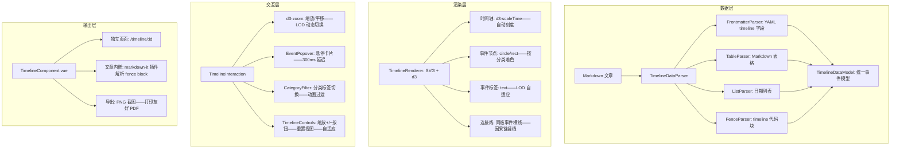

# YK-09-178: 内容交互时间线 — 时间事件可视化、缩放/平移、事件卡片预览、分类筛选、文章内嵌

> 需求编号：YK-09-178 · 优先级：P2 · 人天：0.3d · 状态：需求已编写
> 依赖：YK-09-120（图表与可视化嵌入——复用图表嵌入能力，时间线为图表变体）、YK-09-107（内容导航树优化——复用导航侧边栏组件）、YK-09-91（搜索分析与内容推荐——时间线事件可按分类搜索）

## 背景

### 问题陈述

YiKnowledge 知识库包含大量按时间组织的文章——技术演进历史、项目里程碑、版本发布记录、架构决策时间线。但这些时间序列内容以纯文本+日期形式呈现——缺乏可视化——读者难以直观感知事件的时间分布和因果关系：

1. **时间信息无法可视化**：文章描述"2024 年 3 月上线 V1.0——6 月上线 V2.0——9 月重构架构"——读者只能逐句阅读——无法一眼看清时间跨度和发展节奏
2. **事件因果关系不可见**：多个时间事件之间的依赖关系、因果链——隐藏在文本中——没有可视化手段呈现
3. **无法缩放/平移时间轴**：当时间跨度几百年（如编程语言发展史）或几毫秒（如性能优化 timeline）——固定比例无法适应用户的观察尺度
4. **事件详情需跳转**：时间线上看到事件标题——想看详情需要点击跳转到文章——阅读完再返回——流程中断
5. **无法按分类过滤**："只显示架构相关事件"——无法在时间线上快速筛选——所有事件堆在一起——信息过载

**核心矛盾**：知识库中大量的时间序列信息——以线性文本承载——读者无法可视化浏览——信息提取效率低。目标是为时间序列内容提供交互式时间线可视化——支持缩放/平移——事件卡片悬停预览——分类筛选——可在文章中嵌入——将时间信息从"读"升级为"看"。

### 影响范围

| # | 影响 | 严重程度 | 典型场景 |
|---|------|----------|----------|
| 1 | 时间信息缺乏可视化 | 高 | 技术演进文章含 20 个里程碑——只能逐句阅读——无法快速扫描 |
| 2 | 无法感知时间密度 | 中 | 一段时期密集发生多个事件——文本看不出节奏——时间线一目了然 |
| 3 | 大跨度时间轴不友好 | 中 | 1990-2025 的时间线——所有事件挤在一起——需要缩放 |
| 4 | 事件详情查看打断阅读 | 中 | 点击事件→跳转文章→返回——流程断裂——体验差 |
| 5 | 时间线不区分事件类别 | 低 | 架构决策、版本发布、团队变动混在一起——无法聚焦 |

### 挑战

| 挑战 | 说明 |
|------|------|
| 时间线渲染引擎 | 从 Markdown 时间数据生成可视化时间线——处理不规则的日期间距——自适应布局 |
| 缩放/平移交互 | 大跨度时间线的缩放——保持事件标签不重叠——缩放时 LOD 切换 |
| 事件卡片预览 | 悬停事件点→popover 显示摘要——快速浏览——不离开当前页面 |
| 数据解析 | 从 Markdown frontmatter 或表格解析时间数据——支持多种输入格式 |
| 文章内嵌 | 时间线作为 Markdown 扩展语法嵌入文章——渲染时替换为交互组件 |

---

## 一、现状分析

### 1.1 当前时间内容可视化能力

```
YiKnowledge 时间内容当前呈现方式:
├── 纯文本+日期
│   ├── 列表格式: "- 2024-03: V1.0 上线" ✅
│   ├── 表格格式: | 日期 | 事件 | ✅
│   └── 限制: 线性文本——无可视化——无法缩放——无交互
├── 图表嵌入（YK-09-120）
│   ├── Mermaid/图片嵌入支持 ✅
│   └── 限制: Mermaid 时间线图（gantt）——静态图片——不可交互
├── 时间排序
│   ├── 文章按 created 排序 ✅
│   └── 限制: 按文章级别排序——非事件级别——无法跨文章聚合

缺失:
├── 时间线可视化: 水平/垂直时间轴——交互式缩放/平移                     # ❌ 无——无时间线组件
├── 事件卡片: 悬停事件点——popover 展示摘要——阅读更多                    # ❌ 无——无卡片预览
├── 分类筛选: 按事件标签——按 category——多选筛选                         # ❌ 无——无筛选
├── 缩放控制: 缩放滑块——日/月/年粒度——时间范围拖拽                     # ❌ 无——无缩放
├── 文章内嵌: Markdown 语法 ```timeline ... ``` 嵌入                   # ❌ 无——无嵌入语法
├── 事件聚合: 跨多篇文章的时间事件聚合到一个时间线                        # ❌ 无——无聚合
├── 时间密度图: 时间轴上显示事件密度热力图                               # ❌ 无——无热力图
├── 导航跳转: 点击事件→跳转到对应文章/段落                               # ❌ 无——无跳转
├── 打印友好: 打印时展开完整时间线——包含所有事件详情                     # ❌ 无——无打印模式
└── 响应式: 移动端重置为垂直列表+日期                                    # ❌ 无——无响应式
```

### 1.2 时间线系统数据流

```mermaid
graph TD
    A[Markdown 文章] --> B[解析时间数据]
    B --> C1[YAML Frontmatter: timeline 字段]
    B --> C2[Markdown 表格: | 日期 | 事件 | 分类 |]
    B --> C3[Markdown 列表: - 2024-03: 事件描述]
    B --> C4[专用语法块: `timeline ... `]

    C1 --> D[TimelineDataParser]
    C2 --> D
    C3 --> D
    C4 --> D

    D --> E[TimelineEvent[]]
    E --> F[TimelineRenderer]
    F --> G[交互式时间线组件]

    G --> H[缩放/平移交互: d3-zoom]
    G --> I[事件卡片: popover 悬停预览]
    G --> J[分类筛选: category 标签切换]
    G --> K[时间刻度: 自适应粒度——年/月/日]

    G --> L{用户交互}
    L -->|点击事件| M[展开详情——支持跳转文章链接]
    L -->|缩放| N[调整时间刻度——LOD 切换事件标签]
    L -->|筛选| O[过滤事件——隐藏不匹配事件]
    L -->|打印| P[展开完整时间线——所有事件详情可见]
```

### 1.3 根因分析矩阵

| 缺失能力 | 根因 | 技术障碍 | 优先级 |
|----------|------|----------|--------|
| 时间线可视化 | 无时间线组件——仅依赖文本 | SVG/Canvas 时间线引擎——事件布局算法 | P0 |
| 缩放/平移交互 | 无交互——固定视图 | d3-zoom 或自定义缩放——LOD 事件标签处理 | P0 |
| 事件卡片预览 | 无 popover——需跳转 | 事件悬停→popover 定位→摘要数据渲染 | P0 |
| 数据解析 | 无标准时间数据格式 | Markdown frontmatter/表格/列表→统一事件模型 | P1 |
| 分类筛选 | 无事件分类/标签 | 事件标签系统——筛选器 UI——动画过渡 | P1 |
| 文章内嵌 | 无 Markdown 扩展语法 | markdown-it 插件——自定义 fence block 渲染 | P1 |

---

## 二、设计决策

### 决策表 1：时间线渲染技术选型

| 选项 | 描述 | 优点 | 缺点 | 决策 |
|------|------|------|------|------|
| A: SVG + d3 | 使用 d3.js 控制 SVG 元素——时间线节点/连线/标签 | 矢量——无限缩放——交互成熟——d3-zoom | 大数据量（>1000事件）DOM 可能多 | ✅ 选中 |
| B: Canvas 自绘 | 纯 Canvas 2D 渲染时间线 | 性能极好——适合超大量事件 | 交互实现复杂——文字渲染不清晰——无矢量缩放 | ❌ |
| C: ECharts 时间轴 | 使用 ECharts timeline/gantt 组件 | 复用图表基础设施 | 时间线非标准图表——定制困难——不灵活 | ❌ |

**决策**：选择 A（SVG + d3）。知识库时间线的事件数量通常在 10-200 个——SVG DOM 节点在可控范围内。d3.js 是数据可视化标准库——d3-zoom 提供成熟的缩放/平移交互——d3-scaleTime 处理时间轴刻度。SVG 矢量特性保证缩放后文字仍然清晰——打印效果好。

### 决策表 2：时间数据输入格式

| 选项 | 描述 | 优点 | 缺点 | 决策 |
|------|------|------|------|------|
| A: 多种格式兼容 | 同时支持 frontmatter/表格/列表/代码块——自动检测 | 灵活——作者选择最方便的格式 | 解析逻辑稍复杂——多种解析器 | ✅ 选中 |
| B: 专用 frontmatter 格式 | 只支持 YAML frontmatter timeline 字段 | 结构化——类型安全 | 限制作者——严格格式——门槛高 | ❌ |
| C: 专用代码块格式 | 只支持 `timeline` 代码块 | 独立——不影响其他内容 | 语法需要学习——不直观 | ❌ |

**决策**：选择 A（多种格式兼容）。不同作者偏好不同格式——从现有文章的表格时间线直接可用——无需重写。优先级：1) `timeline` 代码块（专用——最精确） 2) frontmatter timeline 字段（结构化） 3) Markdown 表格（已有内容兼容） 4) 日期列表（最宽松——自动识别）。解析时自动检测格式——统一输出为 TimelineEvent[] 模型。

### 决策表 3：缩放/平移交互方案

| 选项 | 描述 | 优点 | 缺点 | 决策 |
|------|------|------|------|------|
| A: d3-zoom 连续缩放 | 鼠标滚轮连续缩放——拖拽平移——d3-zoom 原生 | 流畅——自然——标准交互 | 需要处理事件标签 LOD——不同缩放级别的标签密度 | ✅ 选中 |
| B: 固定粒度切换 | 日/月/年三个粒度——按钮切换 | 简单——标签不重叠 | 不够灵活——无法看自定义范围 | ❌ |
| C: 范围选择器 | 日期范围选择器——输入起止日期 | 精确 | 操作不直观——需要先知道日期范围 | ❌ |

**决策**：选择 A（d3-zoom 连续缩放）。连续缩放是地图类应用的交互标准——用户熟悉——在时间线中同样适用。缩放时动态调整事件标签密度——基于 LOD 策略：远：只显示年份——中：显示月份+大事件标题——近：显示完整日期+事件标题+摘要。d3-zoom 同时支持触控板手势——Mac 用户流畅使用。

### 决策表 4：事件卡片预览方案

| 选项 | 描述 | 优点 | 缺点 | 决策 |
|------|------|------|------|------|
| A: Popover 悬浮预览 | 鼠标悬停事件点——弹出卡片——含标题/摘要/分类/时间 | 不打断浏览流程——即时 | 需要处理卡片定位——视口边界 | ✅ 选中 |
| B: 侧边展开面板 | 点击事件——右侧展开详情面板 | 信息完整——可以包含长文本 | 遮挡时间线——打断视觉流 | ❌ |
| C: 内联展开 | 点击事件——时间线内嵌展开详情 | 保持上下文——不跳转 | 布局变化——其他事件位置移动——体验不稳定 | ❌ |

**决策**：选择 A（Popover 悬浮预览）。悬停即显示——300ms 延迟防止误触发——卡片包含事件标题、日期、分类标签、摘要（前 120 字）和"阅读详情"链接。卡片自动定位——事件点在屏幕边缘时——卡片向相反方向弹出——确保始终可见。popover 不打断时间线的视觉流——用户扫一眼即可决定是否深入了解。

---

## 三、目标架构

### 3.1 时间线系统架构



### 3.2 时间线数据模型

```typescript
// 时间线事件
interface TimelineEvent {
  id: string;
  date: string;                // ISO 日期——如 "2024-03-15" 或 "2024-03"
  endDate?: string;            // 可选结束日期——表示持续事件
  title: string;               // 事件标题——简短
  description?: string;        // 事件描述——支持 Markdown
  category: string;            // 事件分类——如 "架构" "发布" "决策"
  tags?: string[];             // 额外标签
  color?: string;              // 自定义颜色——覆盖默认分类色
  icon?: string;               // 自定义图标——如 "🚀" "🔧"
  link?: string;               // 关联文章链接
  importance: 'high' | 'medium' | 'low'; // 重要性——影响节点大小
  relatedEvents?: string[];    // 关联事件 ID——连线用
}

// 时间线配置
interface TimelineConfig {
  id: string;
  title: string;
  description?: string;
  events: TimelineEvent[];
  layout: 'horizontal' | 'vertical';       // 布局方向——默认 horizontal
  groupBy?: 'category' | 'none';           // 分组——相同分类事件在相同轨道
  dateFormat: string;                      // 日期显示格式
  height?: number;                         // 组件高度——默认 400px
  showDensityChart: boolean;               // 是否显示密度图
  enableZoom: boolean;                     // 是否启用缩放——默认 true
  enableFilter: boolean;                   // 是否启用筛选——默认 true
  defaultZoom?: { startDate: string; endDate: string };
}

// 时间线数据解析器
interface TimelineDataParser {
  parseFromFrontmatter(frontmatter: Record<string, any>): TimelineEvent[];
  parseFromTable(tableContent: string): TimelineEvent[];
  parseFromList(listContent: string): TimelineEvent[];
  parseFromFence(fenceContent: string): TimelineEvent[];
  autoDetect(markdown: string, frontmatter: Record<string, any>): TimelineConfig | null;
}

// LOD 级别
type LODLevel = 'year' | 'month' | 'week' | 'day';

interface LODConfig {
  level: LODLevel;
  labelFormat: (date: Date) => string;
  minEventSpacing: number;     // 最小事件间距 px
  showDescription: boolean;    // 是否显示摘要
  showConnector: boolean;      // 是否显示连接线
}
```

---

## 四、具体改动

### 4.1 文件变更清单——YiVad 前端

| 文件 | 操作 | 说明 |
|------|------|------|
| `src/components/Timeline/TimelineComponent.vue` | 新增 | 时间线主组件——SVG+交互容器 |
| `src/components/Timeline/TimelineRenderer.ts` | 新增 | d3 渲染引擎——SVG 绘制 |
| `src/components/Timeline/TimelineInteraction.ts` | 新增 | 交互控制——缩放/平移/筛选 |
| `src/components/Timeline/EventPopover.vue` | 新增 | 事件卡片 popover 组件 |
| `src/components/Timeline/CategoryFilter.vue` | 新增 | 分类筛选器组件 |
| `src/components/Timeline/TimelineControls.vue` | 新增 | 缩放控制工具栏 |
| `src/components/Timeline/useTimeline.ts` | 新增 | 时间线 composable |
| `src/components/Timeline/types.ts` | 新增 | 类型定义 |
| `src/components/Timeline/index.ts` | 新增 | 导出 |

### 4.2 文件变更清单——YiAi 后端 + YiKnowledge

| 文件 | 操作 | 说明 |
|------|------|------|
| `services/timeline/timeline_parser.py` | 新增 | Markdown 时间数据解析器 |
| `routes/api/v1/timeline.py` | 新增 | 时间线聚合 API——跨文章事件聚合 |
| `YiKnowledge/.../markdown-it-timeline.js` | 新增 | markdown-it 插件——`timeline` fence 渲染 |

### 4.3 核心代码：d3 时间线渲染引擎

```typescript
// src/components/Timeline/TimelineRenderer.ts
import * as d3 from 'd3';

export class TimelineRenderer {
  private svg: d3.Selection<SVGSVGElement, unknown, null, undefined>;
  private g: d3.Selection<SVGGElement, unknown, null, undefined>;
  private xScale: d3.ScaleTime<number, number>;
  private yScale: d3.ScaleBand<string>;
  private zoom: d3.ZoomBehavior<SVGSVGElement, unknown>;

  constructor(container: HTMLElement, width: number, height: number) {
    this.svg = d3.select(container)
      .append('svg')
      .attr('width', width)
      .attr('height', height)
      .attr('viewBox', [0, 0, width, height]);

    this.g = this.svg.append('g');

    this.xScale = d3.scaleTime().range([50, width - 50]);
    this.yScale = d3.scaleBand().range([30, height - 30]).padding(0.3);

    this.zoom = d3.zoom<SVGSVGElement, unknown>()
      .scaleExtent([0.5, 20])
      .translateExtent([[0, 0], [width, height]])
      .extent([[0, 0], [width, height]])
      .on('zoom', (event) => {
        this.g.attr('transform', event.transform);
        this.updateLOD(event.transform.k);
      });

    this.svg.call(this.zoom);
  }

  /** 渲染时间线 */
  render(config: TimelineConfig): void {
    const { events } = config;
    // 设置比例尺
    const dateExtent = d3.extent(events, e => new Date(e.date)) as [Date, Date];
    this.xScale.domain([d3.timeMonth.offset(dateExtent[0], -1), d3.timeMonth.offset(dateExtent[1], 1)]);

    // 按分类分组——设置 Y 轴轨道
    const categories = [...new Set(events.map(e => e.category))];
    this.yScale.domain(categories);

    // 绘制时间轴
    this.drawAxis();

    // 绘制事件节点
    this.drawEvents(events);

    // 绘制事件标签
    this.drawLabels(events);

    // 绘制事件间连接线
    this.drawConnectors(events);
  }

  /** 绘制时间轴 */
  private drawAxis(): void {
    const axis = d3.axisBottom(this.xScale)
      .ticks(d3.timeMonth.every(3))
      .tickFormat(d3.timeFormat('%Y-%m'));

    this.g.append('g')
      .attr('class', 'timeline-axis')
      .attr('transform', `translate(0, ${this.yScale.range()[1]})`)
      .call(axis);
  }

  /** 绘制事件节点 */
  private drawEvents(events: TimelineEvent[]): void {
    const nodes = this.g.selectAll('.timeline-event')
      .data(events, (d: any) => d.id);

    const nodeEnter = nodes.enter().append('g')
      .attr('class', 'timeline-event')
      .attr('transform', d => {
        const x = this.xScale(new Date(d.date));
        const y = this.yScale(d.category) || 0;
        return `translate(${x}, ${y})`;
      });

    // 事件圆点——分类着色
    nodeEnter.append('circle')
      .attr('r', d => d.importance === 'high' ? 8 : d.importance === 'medium' ? 6 : 4)
      .attr('fill', d => d.color || getCategoryColor(d.category))
      .attr('stroke', '#fff')
      .attr('stroke-width', 2)
      .style('cursor', 'pointer');

    // 事件标题标签
    nodeEnter.append('text')
      .attr('dx', 12)
      .attr('dy', 4)
      .text(d => d.title)
      .attr('font-size', 12)
      .attr('fill', '#333')
      .style('cursor', 'pointer');

    nodes.exit().remove();
  }

  /** 根据缩放级别更新 LOD */
  private updateLOD(scale: number): void {
    if (scale < 1.5) {
      // 远距离: 只显示年份标签
      this.g.selectAll('.timeline-event text')
        .text((d: any) => new Date(d.date).getFullYear().toString())
        .attr('font-size', 10);
    } else if (scale < 3) {
      // 中距离: 显示事件标题
      this.g.selectAll('.timeline-event text')
        .text((d: any) => d.title)
        .attr('font-size', 11);
    } else {
      // 近距离: 显示日期+标题
      this.g.selectAll('.timeline-event text')
        .text((d: any) => `${d3.timeFormat('%m-%d')(new Date(d.date))} ${d.title}`)
        .attr('font-size', 12);
    }
  }

  private drawLabels(events: TimelineEvent[]): void { /* 标签绘制——含防重叠算法 */ }
  private drawConnectors(events: TimelineEvent[]): void { /* 关联事件连线 */ }
}

function getCategoryColor(category: string): string {
  const colors: Record<string, string> = {
    '架构': '#5470c6', '发布': '#91cc75', '决策': '#fac858',
    '事件': '#ee6666', '里程碑': '#73c0de', '默认': '#9a60b4',
  };
  return colors[category] || colors['默认'];
}
```

### 4.4 核心代码：Markdown 时间数据解析器

```python
# services/timeline/timeline_parser.py
import re
import yaml
from datetime import datetime
from typing import List, Optional
from pydantic import BaseModel

class TimelineEvent(BaseModel):
    id: str
    date: str
    end_date: Optional[str] = None
    title: str
    description: Optional[str] = None
    category: str = "事件"
    tags: List[str] = []
    importance: str = "medium"
    link: Optional[str] = None

class TimelineDataParser:
    """Markdown 时间线数据解析器——支持 4 种输入格式"""

    def parse_from_frontmatter(self, frontmatter: dict) -> List[TimelineEvent]:
        """从 YAML frontmatter timeline 字段解析"""
        timeline_data = frontmatter.get("timeline", [])
        if not isinstance(timeline_data, list):
            return []
        return [self._dict_to_event(item, idx) for idx, item in enumerate(timeline_data)]

    def parse_from_table(self, table_content: str) -> List[TimelineEvent]:
        """从 Markdown 表格解析——| 日期 | 事件 | 分类 |"""
        lines = table_content.strip().split("\n")
        events = []
        for idx, line in enumerate(lines):
            if not line.startswith("|") or "---" in line:
                continue
            cells = [c.strip() for c in line.split("|")[1:-1]]
            if len(cells) < 2:
                continue
            events.append(TimelineEvent(
                id=f"table_{idx}",
                date=cells[0],
                title=cells[1] if len(cells) > 1 else "",
                category=cells[2] if len(cells) > 2 else "事件",
                description=cells[3] if len(cells) > 3 else None,
            ))
        return events

    def parse_from_list(self, list_content: str) -> List[TimelineEvent]:
        """从日期列表解析——- 2024-03: 事件描述"""
        pattern = r"-\s*(\d{4}-\d{2}(?:-\d{2})?)\s*[:：]\s*(.+?)(?:\n|$)"
        matches = re.findall(pattern, list_content, re.MULTILINE)
        return [
            TimelineEvent(id=f"list_{idx}", date=m[0], title=m[1].strip())
            for idx, m in enumerate(matches)
        ]

    def parse_from_fence(self, fence_content: str) -> List[TimelineEvent]:
        """从 timeline 代码块解析——YAML 格式"""
        try:
            data = yaml.safe_load(fence_content)
            if isinstance(data, list):
                return [self._dict_to_event(item, idx) for idx, item in enumerate(data)]
            if isinstance(data, dict) and "events" in data:
                return [self._dict_to_event(item, idx) for idx, item in enumerate(data["events"])]
            return []
        except yaml.YAMLError:
            return []

    def auto_detect(self, markdown: str, frontmatter: dict) -> Optional[dict]:
        """自动检测时间线数据——按优先级返回"""
        # 1. timeline 代码块
        fence_match = re.search(r'```timeline\s*\n(.*?)```', markdown, re.DOTALL)
        if fence_match:
            return {"events": self.parse_from_fence(fence_match.group(1)), "source": "fence"}

        # 2. frontmatter timeline 字段
        fm_events = self.parse_from_frontmatter(frontmatter)
        if fm_events:
            return {"events": fm_events, "source": "frontmatter"}

        # 3. Markdown 表格（包含日期列）
        table_match = re.search(r'(\|.*\|.*\n\|[-| ]+\|\n(?:\|.*\|.*\n?)+)', markdown)
        if table_match:
            return {"events": self.parse_from_table(table_match.group(1)), "source": "table"}

        # 4. 日期列表
        list_events = self.parse_from_list(markdown)
        if list_events:
            return {"events": list_events, "source": "list"}

        return None

    def _dict_to_event(self, item: dict, idx: int) -> TimelineEvent:
        return TimelineEvent(
            id=item.get("id", f"evt_{idx}"),
            date=item.get("date", ""),
            end_date=item.get("endDate"),
            title=item.get("title", ""),
            description=item.get("description"),
            category=item.get("category", "事件"),
            tags=item.get("tags", []),
            importance=item.get("importance", "medium"),
            link=item.get("link"),
        )
```

---

## 五、实施步骤

### 步骤 1：时间线数据解析 (0.07d)

1. 实现 `timeline_parser.py`——4 种格式解析器——统一定时事件模型
2. 实现 markdown-it 插件——`timeline` fence block 注册
3. 实现前端 `TimelineDataParser` TypeScript 版本——与后端共享解析逻辑
4. 数据解析单元测试——4 种格式输入→↔统一输出

### 步骤 2：时间线渲染引擎 (0.10d)

1. 实现 `TimelineRenderer.ts`——d3 SVG 渲染——时间轴/事件节点/标签/连线
2. 实现 LOD 策略——3 级缩放自动切换标签密度
3. 实现事件标签防重叠算法——force-collide 模拟
4. 实现 d3-zoom 集成——连续缩放+平移——触控板支持

### 步骤 3：交互与 UI (0.08d)

1. 实现 `EventPopover.vue`——悬停卡片——300ms 延迟——边界检测
2. 实现 `CategoryFilter.vue`——分类筛选器——动画过渡
3. 实现 `TimelineControls.vue`——缩放控制/重置/适应窗口按钮
4. 实现 `TimelineComponent.vue`——主组件——组合渲染+交互

### 步骤 4：集成与测试 (0.05d)

1. 文章页面集成时间线——检测文章中的时间数据——自动渲染
2. 实现独立时间线页面——显示跨文章事件聚合
3. 响应式测试——移动端布局切换为垂直列表
4. 打印友好模式测试

---

## 六、测试规格

### 测试 1：时间线数据解析——四种格式

| 项目 | 内容 |
|------|------|
| 优先级 | P0 |
| 前置条件 | 4 篇文章——分别使用 frontmatter/表格/列表/代码块提供时间数据 |
| 测试步骤 | 1. 分别解析 4 篇文章 2. 检查输出的 TimelineEvent[] |
| 预期结果 | 4 种格式均正确解析——输出统一的事件模型——日期/标题/分类字段完整——列表格式自动识别"YYYY-MM: 标题"模式——代码块 YAML 正确解析 |

### 测试 2：时间线渲染——10 个事件水平时间轴

| 项目 | 内容 |
|------|------|
| 优先级 | P0 |
| 前置条件 | 10 个事件——2024-01 到 2024-12——3 个分类 |
| 测试步骤 | 1. 加载文章——包含时间线数据 2. 检查 SVG 渲染 |
| 预期结果 | 时间轴从左到右——事件节点按分类着色——分类在 Y 轴——事件标签不重叠——年份刻度正确——总宽度自适应容器 |

### 测试 3：缩放与平移——大跨度时间线

| 项目 | 内容 |
|------|------|
| 优先级 | P0 |
| 前置条件 | 时间线 1990-2025——50 个事件 |
| 测试步骤 | 1. 鼠标滚轮缩放 2. 拖拽平移 3. 观察 LOD 变化 4. 双击重置 |
| 预期结果 | 缩放流畅——远距只显示年份——中距离显示标题——近距离显示日期+标题——拖拽平移实时响应——双击重置回完整时间线视图 |

### 测试 4：事件卡片 Popover——悬停预览

| 项目 | 内容 |
|------|------|
| 优先级 | P1 |
| 前置条件 | 时间线已渲染——事件有描述和链接 |
| 测试步骤 | 1. 鼠标悬停事件节点 300ms 2. 观察 popover 卡片 3. 移开鼠标 |
| 预期结果 | 300ms 后 popover 显示——含标题/日期/分类标签/摘要——有"阅读详情"链接——节点在屏幕边缘时卡片自动调整方向——鼠标移开卡片消失 |

### 测试 5：分类筛选——过滤时间线

| 项目 | 内容 |
|------|------|
| 优先级 | P1 |
| 前置条件 | 事件含 3 个分类: 架构(5)/发布(3)/决策(2)——全部显示 |
| 测试步骤 | 1. 取消勾选"架构" 2. 观察时间线 3. 取消勾选"决策" 4. 全部勾选 |
| 预期结果 | "架构"事件淡出消失——"发布"和"决策"保留——"决策"取消后只剩"发布"——全部勾选后恢复——筛选动画过渡流畅 |

### 测试 6：时间线文章内嵌——Markdown 渲染

| 项目 | 内容 |
|------|------|
| 优先级 | P2 |
| 前置条件 | 文章含 `` ```timeline ... ``` `` 代码块 |
| 测试步骤 | 1. 渲染文章 2. 检查时间线块位置 3. 与时间线交互 |
| 预期结果 | timeline 代码块被替换为交互式时间线组件——非原始代码——交互正常工作——时间线在文章内容流中——前后文本正常 |

---

## 七、风险与缓解

| 风险 | 概率 | 影响 | 缓解措施 |
|------|------|------|------|
| 大事件数（>500）SVG 性能 | 低 | 中 | 事件数超过 200 时启用虚拟化——只渲染可视范围内的事件——超出部分不创建 DOM 节点 |
| d3-zoom 与触控板兼容性 | 低 | 中 | d3-zoom 原生支持触控板 pinch——Windows 触控板测试——Safari 手势冲突检测 |
| 事件标签重叠 | 中 | 中 | 力导向碰撞检测——forceCollide 模拟——重叠时自动调整标签高度——或缩写标签文本 |
| 日期格式识别错误 | 中 | 低 | 支持多日期格式——ISO 8601/Chinese/ambiguous——解析失败标记为"未知日期"——提示修正 |
| markdown-it 插件与其他插件冲突 | 低 | 低 | timeline fence 独立块——不干扰其他 fence——优先级最低——与其他插件前测整合 |

---

## 八、回滚策略

1. **功能级回滚**：时间线是 opt-in 功能——文章不包含 timeline 数据时不渲染——无影响
2. **代码级回滚**：`Timeline/` 目录移除——markdown-it 插件注销——不影响文章正常渲染
3. **数据回滚**：frontmatter timeline 字段不影响其他功能——删除字段即可
4. **回滚验证**：文章渲染正常——代码块正常——无 SVG 渲染错误——无 JS 错误

---

## 九、设计决策记录

### D-01：SVG + d3 渲染——非 Canvas

**上下文**：时间线需要矢量缩放和文字渲染——技术栈需要选择。

**决策**：使用 SVG + d3.js 渲染时间线——而非 Canvas。

**理由**：知识库时间线的事件数通常在 10-200 个——SVG 节点数完全可控。SVG 是矢量图形——缩放后文字清晰——打印效果好。d3-zoom 是成熟的缩放/平移方案。Canvas 在大数据量时性能更好——但文字渲染差——交互事件绑定复杂——不适合这种交互密集、文字密集的场景。

### D-02：四种格式兼容——非单一格式

**上下文**：不同作者使用不同格式组织时间数据——需要选择输入格式。

**决策**：同时支持 frontmatter/表格/列表/代码块四种格式——解析器自动检测。

**理由**：降低使用门槛——作者使用最方便的格式。已有文章中的表格和列表时间数据可直接解析——无需重写。代码块格式提供最大的灵活性——支持 YAML 结构——适合复杂时间线。优先级: timeline 代码块 > frontmatter > 表格 > 列表——确保精确格式优先。

### D-03：d3-zoom 连续缩放——非固定粒度

**上下文**：时间线跨度可变——需要缩放交互。

**决策**：使用 d3-zoom 连续缩放——鼠标滚轮+拖拽——非固定粒度切换按钮。

**理由**：连续缩放是地图交互的标准——用户熟悉。在时间线上同样的交互模式——缩放查看不同时间范围。LOD 策略在缩放时自动切换标签密度——远：年份——中：月+标题——近：完整日期+标题+摘要。固定粒度按钮（日/月/年）作为补充——快速跳转到预设粒度。

### D-04：事件悬停 Popover——非侧边面板

**上下文**：事件详情需要展示——不打断浏览流程。

**决策**：悬停事件节点 300ms 后弹出 Popover 卡片——显示摘要——点击跳转详情。

**理由**：Popover 是信息预览的标准模式——不打断时间线的视觉流。300ms 延迟防止快速划过时频繁触发。卡片显示关键信息——满足大部分浏览需求。需要完整信息时可点击"阅读详情"跳转原文——符合渐进式信息披露原则。

---

## 十、可观测性

| 指标 | 采集方式 | 阈值 |
|------|----------|------|
| 时间线渲染次数 | TimelineComponent mount 计数 | — |
| 事件平均数量 | events.length 直方图 | — |
| 数据格式分布 | 解析来源（frontmatter/table/list/fence）| — |
| 缩放交互次数 | d3-zoom 事件计数 | — |
| Popover 打开次数 | hover 触发 popover 计数 | — |
| 分类筛选使用次数 | CategoryFilter toggle 计数 | — |
| SVG 节点数量 | g.timeline-event 子节点计数 | < 500 |
| 渲染耗时 | mount 到 SVG 绘制完成 | < 200ms |
| 缩放帧率 | zoom 期间 FPS | > 30fps |
| 事件跳转次数 | 点击 popover"阅读详情"链接计数 | — |

---

## 十一、代码审查检查清单

- [ ] `TimelineRenderer`——SVG viewBox 设置正确——响应式容器大小变化
- [ ] `TimelineRenderer`——d3-zoom scaleExtent 设置——防止过度缩放——最小 0.5 最大 20
- [ ] `TimelineRenderer.drawEvents`——d3 enter/update/exit 模式——数据变更正确更新
- [ ] `TimelineRenderer.updateLOD`——基于 scale 的 LOD 阈值——不同级别标签格式不同
- [ ] `EventPopover`——定位计算——视口边界检测——卡片不超出屏幕
- [ ] `EventPopover`——300ms 延迟定时器——组件卸载时清除——防止内存泄漏
- [ ] `CategoryFilter`——全选/全不选交互——至少保留一个分类可见
- [ ] `TimelineDataParser.auto_detect`——优先级正确——fence > frontmatter > table > list
- [ ] `TimelineDataParser.parse_from_table`——表头行过滤——数据行非空检查
- [ ] markdown-it 插件——`timeline` fence 注册——不与其他语言冲突
- [ ] 响应式——移动端切换为 vertical 布局——宽度 < 768px 触发
- [ ] SVG cleanup——组件卸载时 remove SVG 元素——清除事件监听

---

## 回归问题预测

| # | 预测问题 | 触发条件 | 检测方式 |
|---|----------|----------|----------|
| 1 | 日期解析失败——事件不显示 | 非标准日期格式——如"2024年3月中旬" | 解析时 try-catch——失败标记"未知"——不阻塞其他事件 |
| 2 | 缩放后事件标签消失 | scale 变化——LOD 计算错误 | updateLOD 单元测试——验证各 scale 范围标签正确 |
| 3 | 移动端触摸与缩放冲突 | touch 事件被 d3-zoom 和浏览器默认缩放双重处理 | touch-action: none 设置——d3-zoom 独占触摸事件 |
| 4 | SVG 内容在 markdown 容器中溢出 | SVG 宽度超过文章容器 | viewBox + preserveAspectRatio——始终适应容器 |
| 5 | popover 在 iframe 中定位错误 | 文章在 iframe 中渲染——popover 使用绝对定位 | popover 使用 fixed 定位——基于鼠标事件 clientX/clientY |
| 6 | 分类颜色不够用——超过 10 分类 | 文章定义 15 个分类 | 颜色循环——第 11 个重新使用第 1 个颜色 |

---

## 性能分析

| 操作 | 事件数 | 预期耗时 | 瓶颈 | 优化策略 |
|------|--------|----------|------|------|
| 数据解析——frontmatter | 20 | < 1ms | YAML 反序列化 | Python yaml.safe_load——纯内存 |
| 数据解析——表格 | 50 | < 2ms | 字符串 split+遍历 | O(n)——文本长度 |
| SVG 渲染——初始 | 50 | < 50ms | DOM 节点创建 | d3 enter/append——批量创建 |
| SVG 渲染——初始 | 200 | < 150ms | DOM 节点创建 | 超过 200 启用虚拟化 |
| 缩放交互 | — | < 8ms/帧 | SVG transform | GPU 加速的 CSS transform——d3 内部优化 |
| popover 渲染 | 1 | < 10ms | popover DOM 创建+定位 | 单次创建——CSS transition 动画 |
| 分类筛选 | 50 | < 20ms | SVG 节点 opacity 切换 | CSS transition——所有节点同步动画 |
| 移动端垂直列表 | 50 | < 30ms | DOM 列表创建 | Vue v-for 渲染——虚拟列表可选 |