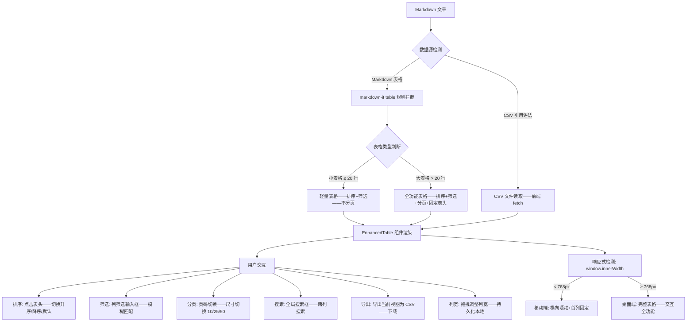
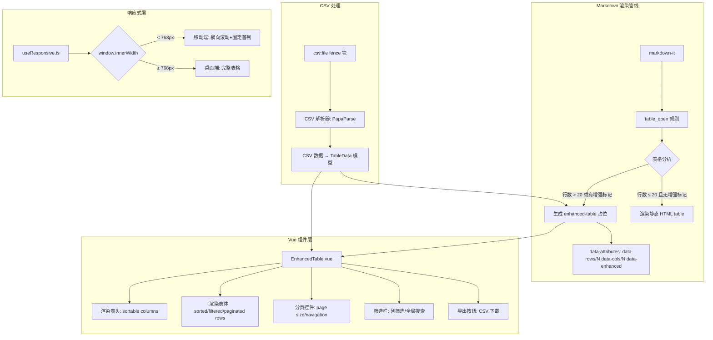

# YK-09-179: 内容表格数据展示 — 可排序列、可筛选表格、大数据分页、CSV 数据导入、响应式表格

> 需求编号：YK-09-179 · 优先级：P2 · 人天：0.3d · 状态：需求已编写
> 依赖：YK-09-120（图表与可视化嵌入——表格与图表同属数据可视化增强）、YK-09-59（数据导入导出中心——CSV 导入复用导入框架）
## 背景

### 问题陈述

YiKnowledge 知识库文章中的 Markdown 表格当前只能静态展示——所有数据行列固定——读者无法对表格数据进行排序、筛选或搜索——大表格（>50 行）阅读体验极差——翻来覆去找数据：

1. **表格无法排序**：版本号对比表格——读者想按"发布日期"排序——在静态 Markdown 中不可能——只能手动逐行查找
2. **无法筛选过滤**：技术选型对比表格——30 个框架 10 个维度——只想看"前端框架"——静态表格无法过滤——信息淹没
3. **大表格无分页**：API 参数表 200 行——渲染成一整页——滚动到忘记表头——阅读体验极差
4. **CSV 数据无法直接使用**：从外部系统导出的 CSV 数据——无法嵌入文章——需要手动转 Markdown 表格——维护两份数据
5. **移动端表格横向溢出**：10 列表格——手机屏幕 375px——横向滚动——表头看不到——数据对不上列

**核心矛盾**：Markdown 表格是数据密集型内容的常见载体——但静态表格无法满足数据探索需求——读者需要排序、筛选、分页能力。目标是为文章中的表格提供交互增强——通过 markdown-it 插件将静态表格升级为可排序/筛选/分页的增强表格组件——支持 CSV 数据导入为表格——移动端自适应——让数据在文章中"活"起来。

### 影响范围

| # | 影响 | 严重程度 | 典型场景 |
|---|------|----------|----------|
| 1 | 表格无法排序 | 高 | 对比表格——需要按不同列排序——静态表格不支持 |
| 2 | 无法筛选数据 | 高 | 30 行表格——只想看某个类别的数据——无法过滤 |
| 3 | 大表格阅读困难 | 高 | 200 行 API 文档表格——滚动后忘记表头——无法定位 |
| 4 | CSV 数据需手动转 Markdown | 中 | CSV 数据变化后——Markdown 表格需同步更新——维护成本高 |
| 5 | 移动端表格体验差 | 中 | 多列表格在手机上横向溢出——无表头——无筛选 |

### 挑战

| 挑战 | 说明 |
|------|------|
| markdown-it 插件注入 | 将静态 table 替换为 Vue 组件——需要自定义渲染规则——保持其他 Markdown 元素不变 |
| 客户端排序 | 多类型列排序——数字/字符串/日期——排序状态 UI 指示——重置排序 |
| 客户端筛选 | 列筛选输入——模糊匹配——多列联合筛选——筛选状态指示 |
| 大表格分页 | 前端分页——不依赖后端 API——页码计算——跳页交互 |
| CSV 导入渲染 | 上传 CSV——前端解析——生成表格——文件大小限制——编码检测 |
| 响应式表格 | 宽表格在窄屏幕上的显示策略——表头固定——列折叠——横向滚动——行列转置 |

---

## 一、现状分析

### 1.1 当前文章表格能力

```
YiKnowledge 文章表格现状:
├── Markdown 标准表格
│   ├── GFM 表格语法: | col1 | col2 | ✅
│   ├── 对齐: :--- :---: ---: ✅
│   └── 限制: 纯静态 HTML table——无交互——无排序——无筛选——无分页
├── markdown-it 渲染
│   ├── table_open/table_close 规则 ✅
│   └── 限制: 生成 <table> HTML——不注入 Vue 组件——不可交互
├── ProTable（YiVad 管理后台）
│   ├── 排序/筛选/分页/导出/批量操作 ✅
│   └── 限制: 管理后台专用——不在文章阅读上下文中——不嵌入 Markdown

缺失:
├── 交互式表格: 表头点击排序——升序/降序/取消——排序指示器             # ❌ 无——无交互
├── 列筛选: 列下拉筛选器——模糊搜索——多条件 AND                          # ❌ 无——无筛选
├── 大数据分页: 页面尺寸切换——页码跳转——分页控件                      # ❌ 无——无分页
├── 表头固定: 滚动时表头固定——不随内容滚动                              # ❌ 无——无固定
├── CSV 导入: markdown 中引用 CSV 文件——自动渲染为表格                  # ❌ 无——不支持 CSV
├── 表格样式增强: 斑马纹——行悬停高亮——条件格式                          # ❌ 无——无增强
├── 移动端适配: 响应式表格——横向滚动+固定首列                            # ❌ 无——无适配
├── 表格导出: 当前筛选/排序结果导出为 CSV                                # ❌ 无——无导出
├── 列宽拖拽: 列宽可拖拽调整                                             # ❌ 无——无列宽调整
└── 表格搜索: 全局搜索框——在所有列中搜索                                 # ❌ 无——无全局搜索
```

### 1.2 增强表格数据流



### 1.3 根因分析矩阵

| 缺失能力 | 根因 | 技术障碍 | 优先级 |
|----------|------|----------|--------|
| 表格排序 | markdown-it 渲染静态 HTML——无 JS 逻辑 | markdown-it 插件注入 Vue 组件——表头点击排序 | P0 |
| 列筛选 | 无筛选器——无输入框 | 列元数据提取——筛选器 UI——模糊匹配逻辑 | P0 |
| 大数据分页 | 无分页逻辑——一次性渲染全部行 | 前端分页切分——页码组件——页面尺寸切换 | P0 |
| CSV 导入 | 无 CSV 解析和渲染 | 前端 PapaParse CSV 解析——数据转表格——文件引用 | P1 |
| 表头固定 | 无 sticky 定位 | CSS position: sticky——thead 固定——tbody 滚动 | P1 |
| 移动端适配 | 无响应式表格策略 | CSS 媒体查询——横向滚动容器——首列固定——行列转置 | P1 |
| 表格导出 | 无导出逻辑 | 表格数据→CSV 字符串→Blob 下载 | P2 |

---

## 二、设计决策

### 决策表 1：表格交互增强实现方式

| 选项 | 描述 | 优点 | 缺点 | 决策 |
|------|------|------|------|------|
| A: markdown-it + Vue 组件替换 | markdown-it 插件——table_open 规则生成 `<enhanced-table>` 自定义标签——Vue 组件替换 | 渐进增强——无 JavaScript 时降级为静态表格 | 需要 SSR 兼容——markdown-it 和 Vue 协作 | ✅ 选中 |
| B: 纯 JS 脚本增强 | 页面加载后用 JS 查找所有 table——动态附加排序/筛选 | 简单——不需要修改 markdown-it | 闪烁——表格先显示静态再变为交互——体验差 | ❌ |
| C: 后端渲染 | 后端解析表格——返回带交互数据的 JSON——前端渲染组件 | 精确控制——数据验证 | 增加后端依赖——失去 Markdown 优势 | ❌ |

**决策**：选择 A（markdown-it + Vue 组件替换）。markdown-it 插件在渲染阶段拦截 table——分析表格结构——大表格（>20 行或显式标记）替换为 `<enhanced-table>` 自定义标签——Vue 在客户端渲染时识别并替换为交互式组件。无 JavaScript 环境下降级为原有静态表格——保持可访问性。渐进增强——小表格保持静态——大表格自动升级。

### 决策表 2：表格类型自动判断策略

| 选项 | 描述 | 优点 | 缺点 | 决策 |
|------|------|------|------|------|
| A: 自动——基于行数 | rows > 20 → 增强表格, rows ≤ 20 → 静态表格 | 零配置——默认合理 | 无法满足特殊需求——5 行表格也需要排序 | — |
| B: 显式标记——table 后注释 | `<!-- enhanced-table -->` 标记启用增强 | 精确控制 | 需要写注释——增加写作负担 | — |
| C: 自动 + 标记覆盖 | 默认自动——支持 `<!-- enhanced-table：force -->` 或 `<!-- no-enhance -->` 覆盖 | 灵活——默认智能——特殊标记 | 需实现标记解析 | ✅ 选中 |

**决策**：选择 C（自动 + 标记覆盖）。默认规则: 行数 > 20 自动启用增强——行数 ≤ 20 保持 Markdown 原始样式。但作者可以通过 HTML 注释覆盖: `< !-- enhanced -->` 强制启用——`< !-- no-enhance -->` 强制关闭。标记解析在 markdown-it 插件中处理——不显示在最终渲染中。

### 决策表 3：CSV 数据引用语法

| 选项 | 描述 | 优点 | 缺点 | 决策 |
|------|------|------|------|------|
| A: 专用 fence 块 | `` ```csv:file path/to/data.csv ``` `` | 清晰明确——独立 | 需要学习新语法 | ✅ 选中 |
| B: Markdown 链接 | `[点击查看数据](data.csv)` | 零语法学习 | 语义不清——链接通常期望导航——非嵌入 | ❌ |
| C: 直接粘贴 | 将 CSV 内容直接粘贴到文章中 | 不需要外部文件 | 数据多时文章膨胀——更新需要编辑文章 | ❌ |

**决策**：选择 A（专用 fence 块）。格式: ````csv:file path/to/data.csv` + 可选配置```。markdown-it 插件解析此 fence——在渲染时替换为 `EnhancedTable` 组件——组件读取 CSV 文件并渲染。配置支持: 分页大小、排序列、筛选默认值、日期格式等。CSV 文件和 Markdown 文件放在同一目录下——路径相对引用。

### 决策表 4：移动端表格响应式策略

| 选项 | 描述 | 优点 | 缺点 | 决策 |
|------|------|------|------|------|
| A: 横向滚动 + 首列固定 | 表格在横向滚动容器中——首列 position: sticky | 保留表格结构——所有列仍可见——首列始终可见 | 需要横向滑动——不如看全表方便 | ✅ 选中 |
| B: 行列转置——Cards 模式 | 每行变为卡片——列为键值对 | 完全适配窄屏幕 | 丢失表格结构——对比困难——大表格不可行 | ❌ |
| C: 列隐藏优先级 | 不重要列隐藏——用户手动展开 | 首屏只显示关键列 | 作者需标记列优先级——增加写作负担 | ❌——作为增强 |

**决策**：选择 A（横向滚动 + 首列固定）。这是数据表格移动端适配的行业标准——Google Sheets/Confluence 等均采用此方案。首列（通常为名称/ID）position: sticky——水平滚动时保持可见——每行数据有上下文。容器有滚动提示（渐隐阴影）——用户知道可以横向滚动。

---

## 三、目标架构

### 3.1 增强表格系统架构



### 3.2 增强表格数据模型

```typescript
// 表格列定义
interface TableColumn {
  key: string;                 // 列键——用于排序/筛选
  title: string;               // 列标题——显示文本
  type: 'string' | 'number' | 'date' | 'boolean'; // 列类型——影响排序/筛选行为
  sortable: boolean;           // 是否可排序——默认 true
  filterable: boolean;         // 是否可筛选——默认 true
  width?: number;              // 列宽 px——默认自动
  align?: 'left' | 'center' | 'right';
  format?: string;             // 格式化——如日期格式 'YYYY-MM-DD'
  hidden?: boolean;            // 是否隐藏——默认 false
  sticky?: 'left' | 'right';   // 固定列——移动端左固定
}

// 表格排序状态
interface SortState {
  column: string | null;       // 排序列 key
  direction: 'asc' | 'desc' | null; // 排序方向——null 表示默认排序
}

// 表格筛选状态
interface FilterState {
  column: string;              // 筛选列 key
  value: string;               // 筛选值——模糊匹配
  operator: 'contains' | 'equals' | 'startsWith' | 'gt' | 'lt';
}

// 表格数据模型
interface TableData {
  columns: TableColumn[];       // 列定义
  rows: Record<string, any>[];  // 数据行——key→value
  totalRows: number;            // 总行数
}

// 增强表格配置
interface EnhancedTableConfig {
  id: string;                   // 表格唯一 ID——文章内
  source: 'markdown' | 'csv';  // 数据来源
  csvPath?: string;             // CSV 文件路径
  pageSize: number;             // 分页尺寸——默认 20
  pageSizeOptions: number[];    // 可选分页尺寸 [10, 20, 50, 100]
  defaultSort?: SortState;      // 默认排序
  enableSearch: boolean;        // 启用全局搜索——默认 true
  enableExport: boolean;        // 启用 CSV 导出——默认 true
  enableColumnResize: boolean;  // 启用列宽调整——默认 true
  stickyHeader: boolean;        // 固定表头——默认 true
  zebra: boolean;               // 斑马纹——默认 true
  height?: number;              // 表格最大高度——超出滚动
  responsiveBreakpoint: number; // 响应式断点——默认 768
}

// 排序函数
interface TableSorter {
  sort(rows: Record<string, any>[], sort: SortState): Record<string, any>[];
  compare(a: any, b: any, type: TableColumn['type']): number;
}

// 筛选函数
interface TableFilter {
  filter(rows: Record<string, any>[], filters: FilterState[]): Record<string, any>[];
  match(value: any, filterValue: string, operator: FilterState['operator']): boolean;
}

// 分页函数
interface TablePaginator {
  paginate(rows: Record<string, any>[], page: number, pageSize: number): {
    pageRows: Record<string, any>[];
    totalPages: number;
    hasNext: boolean;
    hasPrev: boolean;
  };
}

// 表格导出函数
interface TableExporter {
  toCSV(columns: TableColumn[], rows: Record<string, any>[]): string;
  download(filename: string): void;
}
```

---

## 四、具体改动

### 4.1 文件变更清单——YiVad 前端

| 文件 | 操作 | 说明 |
|------|------|------|
| `src/components/EnhancedTable/EnhancedTable.vue` | 新增 | 增强表格主组件——排序+筛选+分页 |
| `src/components/EnhancedTable/TableHeader.vue` | 新增 | 表头组件——排序指示器+列筛选入口 |
| `src/components/EnhancedTable/TableFilter.vue` | 新增 | 列筛选下拉面板 |
| `src/components/EnhancedTable/TableSearchBar.vue` | 新增 | 全局搜索栏 |
| `src/components/EnhancedTable/TablePagination.vue` | 新增 | 分页控件——页码/尺寸/跳转 |
| `src/components/EnhancedTable/useTableSort.ts` | 新增 | 排序 composable |
| `src/components/EnhancedTable/useTableFilter.ts` | 新增 | 筛选 composable |
| `src/components/EnhancedTable/useTablePagination.ts` | 新增 | 分页 composable |
| `src/components/EnhancedTable/CSVParser.ts` | 新增 | CSV 解析器——PapaParse 封装 |
| `src/components/EnhancedTable/TableExporter.ts` | 新增 | 表格导出器——CSV 下载 |
| `src/components/EnhancedTable/types.ts` | 新增 | 类型定义 |
| `src/components/EnhancedTable/index.ts` | 新增 | 导出 |

### 4.2 文件变更清单——YiVad markdown-it 插件 + 样式

| 文件 | 操作 | 说明 |
|------|------|------|
| `src/plugins/markdown/enhancedTablePlugin.ts` | 新增 | markdown-it 插件——table/csv fence 增强 |
| `src/assets/styles/enhanced-table.scss` | 新增 | 增强表格样式——响应式+斑马纹+固定表头 |

### 4.3 核心代码：markdown-it 表格增强插件

```typescript
// src/plugins/markdown/enhancedTablePlugin.ts
import MarkdownIt from 'markdown-it';

interface EnhanceConfig {
  minRowsForEnhance: number;  // 自动增强的最小行数——默认 20
  pageSize: number;           // 默认分页大小
  enableSearch: boolean;      // 全局搜索
  enableExport: boolean;      // CSV 导出
}

export function enhancedTablePlugin(md: MarkdownIt, config: EnhanceConfig = {
  minRowsForEnhance: 20, pageSize: 20, enableSearch: true, enableExport: true,
}) {
  // 拦截 table_open -> table_close
  const defaultTableOpen = md.renderer.rules.table_open;
  const defaultTableClose = md.renderer.rules.table_close;
  const defaultTheadOpen = md.renderer.rules.thead_open;
  const defaultTbodyOpen = md.renderer.rules.tbody_open;

  let currentTableRows = 0;
  let currentTableHtml = '';
  let isEnhanced = false;

  // 收集表格 HTML
  md.renderer.rules.table_open = function (tokens, idx, options, env, self) {
    currentTableRows = 0;
    currentTableHtml = '';
    isEnhanced = false;

    // 检查增强标记
    const prevToken = idx > 0 ? tokens[idx - 1] : null;
    const hasEnhanceFlag = prevToken?.type === 'html_block' &&
      prevToken.content.includes('<!-- enhanced -->');
    const hasNoEnhanceFlag = prevToken?.type === 'html_block' &&
      prevToken.content.includes('<!-- no-enhance -->');

    isEnhanced = hasEnhanceFlag || (!hasNoEnhanceFlag);

    return '<div class="table-wrapper"><!-- enhanced-table-placeholder -->';
  };

  // 统计行数
  md.renderer.rules.tr_open = function (tokens, idx, options, env, self) {
    if (tokens[idx + 1]?.type === 'th_open') return '<tr>'; // thead row
    currentTableRows++;
    return '<tr>';
  };

  // 结束: 判断是否增强
  md.renderer.rules.table_close = function (tokens, idx, options, env, self) {
    const shouldEnhance = isEnhanced && currentTableRows > config.minRowsForEnhance;

    if (shouldEnhance) {
      // 生成增强表格配置——通过 data 属性传递给 Vue 组件
      return `</div><enhanced-table
        data-rows="${currentTableRows}"
        data-page-size="${config.pageSize}"
        data-enable-search="${config.enableSearch}"
        data-enable-export="${config.enableExport}"
      ></enhanced-table></div>`;
    }

    return '</div>';
  };

  // 拦截 fence block 处理 CSV 引用
  const defaultFence = md.renderer.rules.fence;
  md.renderer.rules.fence = function (tokens, idx, options, env, self) {
    const token = tokens[idx];
    const info = token.info || '';

    if (info.startsWith('csv:file')) {
      // 解析 csv:file path/to/data.csv 语法
      const csvPath = info.replace('csv:file', '').trim();
      return `<enhanced-table
        data-source="csv"
        data-csv-path="${csvPath}"
        data-page-size="${config.pageSize}"
      ></enhanced-table>`;
    }

    return defaultFence ? defaultFence(tokens, idx, options, env, self) : '';
  };
}
```

### 4.4 核心代码：增强表格组件

```typescript
// src/components/EnhancedTable/useTableSort.ts
import { ref, computed, type Ref } from 'vue';

export function useTableSort(rows: Ref<Record<string, any>[]>, columns: TableColumn[]) {
  const sortState = ref<SortState>({ column: null, direction: null });

  const sortedRows = computed(() => {
    if (!sortState.value.column || !sortState.value.direction) {
      return rows.value;
    }
    const { column, direction } = sortState.value;
    const colDef = columns.find(c => c.key === column);
    const type = colDef?.type || 'string';

    return [...rows.value].sort((a, b) => {
      const result = compare(a[column], b[column], type);
      return direction === 'asc' ? result : -result;
    });
  });

  function toggleSort(columnKey: string): void {
    if (sortState.value.column === columnKey) {
      // 循环: asc → desc → none
      if (sortState.value.direction === 'asc') {
        sortState.value = { column: columnKey, direction: 'desc' };
      } else if (sortState.value.direction === 'desc') {
        sortState.value = { column: null, direction: null };
      }
    } else {
      sortState.value = { column: columnKey, direction: 'asc' };
    }
  }

  function compare(a: any, b: any, type: TableColumn['type']): number {
    if (a == null) return 1;
    if (b == null) return -1;
    switch (type) {
      case 'number': return Number(a) - Number(b);
      case 'date': return new Date(a).getTime() - new Date(b).getTime();
      case 'boolean': return (a === b) ? 0 : a ? -1 : 1;
      default: return String(a).localeCompare(String(b), 'zh-CN');
    }
  }

  return { sortState, sortedRows, toggleSort };
}
```

---

## 五、实施步骤

### 步骤 1：核心表格逻辑 (0.09d)

1. 定义 `types.ts`——完整表格类型系统
2. 实现 `useTableSort.ts`——多类型列排序——循环切换——localeCompare
3. 实现 `useTableFilter.ts`——列筛选——模糊匹配——多列 AND 联合
4. 实现 `useTablePagination.ts`——前端分页——页码计算——跳页

### 步骤 2：表格 UI 组件 (0.08d)

1. 实现 `EnhancedTable.vue`——主组件——组合 sort/filter/pagination
2. 实现 `TableHeader.vue`——可点击表头——排序指示器——列筛选按钮
3. 实现 `TableFilter.vue`——列筛选下拉——输入框+操作符选择
4. 实现 `TablePagination.vue`——分页控件——页面尺寸选择——页码按钮
5. 实现 `TableSearchBar.vue`——全局搜索——跨所有列搜索

### 步骤 3：Markdown 集成 (0.07d)

1. 实现 `enhancedTablePlugin.ts`——markdown-it 插件——表格拦截+增强判断
2. 实现 `<enhanced-table>` 自定义组件——读取 data-attributes——渲染增强表格
3. 实现 CSV fence 处理——`csv:file` 语法——前端 PapaParse 解析
4. 实现 `CSVParser.ts`——PapaParse 封装——编码检测——头行处理

### 步骤 4：样式与响应式 (0.04d)

1. 实现 `enhanced-table.scss`——斑马纹/悬停高亮/固定表头/阴影
2. 实现移动端响应式——横向滚动容器——首列 sticky——滚动阴影提示
3. 实现 `TableExporter.ts`——当前视图导出为 CSV——下载

### 步骤 5：集成测试 (0.02d)

1. 测试文章中多个表格混合场景——静态表格+增强表格+CSV 表格
2. 测试大表格分页性能——200 行——排序/筛选/分页正确
3. 测试移动端适配——iPhone SE/12/Pro Max 三档宽度

---

## 六、测试规格

### 测试 1：表格点击排序——数字/字符串/日期

| 项目 | 内容 |
|------|------|
| 优先级 | P0 |
| 前置条件 | 增强表格——含 50 行——3 列: 名称(string)/版本(string)/发布日(date)/评分(number) |
| 测试步骤 | 1. 点击"评分"列——升序 2. 再次点击——降序 3. 第三次点击——取消排序(默认) 4. 点击"名称"列——升序 |
| 预期结果 | 升序: 评分从低到高——排序指示器显示 "asc" 箭头——降序: 从高到低——箭头反向——取消: 恢复原始顺序——名称排序按中文字典序——localeCompare 正确处理中文 |

### 测试 2：列筛选——模糊匹配筛选

| 项目 | 内容 |
|------|------|
| 优先级 | P0 |
| 前置条件 | 增强表格——50 行——含"分类"列——值为"前端框架"/"后端框架"/"工具"等 |
| 测试步骤 | 1. 点击"分类"列筛选按钮 2. 输入"框架" 3. 观察过滤结果 |
| 预期结果 | 筛选出"分类"列包含"框架"的所有行——前端框架+后端框架——其他行隐藏——筛选输入框有清除按钮——筛选状态有视觉指示(高亮) |

### 测试 3：大表格分页——200 行数据

| 项目 | 内容 |
|------|------|
| 优先级 | P0 |
| 前置条件 | 增强表格——200 行——默认分页 20 行/页 |
| 测试步骤 | 1. 观察初始表格 2. 点击"下一页" 3. 切换分页大小为 50 4. 点击"末页" 5. 跳转到第 5 页 |
| 预期结果 | 初始显示 1-20 行——分页信息"共 200 条——第 1/10 页"——翻页正确——切换 50 行/页后显示 1-50 行——跳转到第 5 页显示 201-250(不存在——跳转不生效)——表头固定——滚动到下方时表头不移动 |

### 测试 4：CSV 数据渲染——csv:file 语法

| 项目 | 内容 |
|------|------|
| 优先级 | P1 |
| 前置条件 | Markdown 文章含 `csv:file data/sample.csv` fence——CSV 文件 30 行 |
| 测试步骤 | 1. 渲染文章 2. 检查 CSV 表格 3. 验证数据正确性 |
| 预期结果 | fence 被替换为增强表格——表头来自 CSV 第一行——30 行数据正确渲染——列类型自动检测(数字/字符串)——分页正常——CSV 文件不存在时显示错误占位 |

### 测试 5：多筛选联合——AND 逻辑

| 项目 | 内容 |
|------|------|
| 优先级 | P1 |
| 前置条件 | 增强表格——50 行——筛选"分类=前端框架" + "星数>10000" |
| 测试步骤 | 1. 在"分类"列筛选"框架" 2. 在"星数"列筛选">10000" 3. 观察结果 |
| 预期结果 | 结果同时满足两个条件——两列筛选指示器都显示——清除任一筛选——结果更新——清除全部筛选——显示全部数据 |

### 测试 6：移动端响应式表格

| 项目 | 内容 |
|------|------|
| 优先级 | P2 |
| 前置条件 | 增强表格——8 列——内容超出 375px 宽度 |
| 测试步骤 | 1. 调整浏览器窗口到 375px 宽度 2. 观察表格 3. 横向滚动 4. 检查首列固定 |
| 预期结果 | 表格容器有横向滚动条——首列 sticky——横向滚动时首列不跟随——容器左右边缘有渐隐阴影——提示可以滚动——表头正常——排序按钮仍可点击 |

---

## 七、风险与缓解

| 风险 | 概率 | 影响 | 缓解措施 |
|------|------|------|------|
| markdown-it 插件与其他表格插件冲突 | 中 | 中 | 插件优先级配置——最后注册——冲突检测——使用 unique fence 语法避免冲突 |
| 大表格（>1000 行）客户端排序/筛选性能 | 低 | 中 | 数据量超 500 行时——显示警告——建议后端分页——或限制客户端上限 1000 行 |
| CSV 文件路径跨平台兼容 | 中 | 低 | 统一使用 `/` 分隔——Windows 路径自动转换——URL encode 处理中文路径 |
| 表格列类型自动检测错误 | 中 | 低 | 基于每一列所有值综合判断——多数字→数字类型——少数非数字→字符串——类型可手动覆盖 |
| 静态 HTML 到 Vue 组件——SSR 水合 | 低 | 中 | custom element 方式注册——`enhanced-table` 通过 Vue custom element defineCustomElement 注册——SSR 可见静态内容 |

---

## 八、回滚策略

1. **功能级回滚**：表格增强是渐进式——不满足增强条件的表格保持静态——完全不受影响
2. **代码级回滚**：移除 markdown-it 插件——移除 EnhancedTable 组件——恢复纯静态 table 渲染
3. **文章级回滚**：添加 `<!-- no-enhance -->` 注释——特定表格禁用增强——恢复静态
4. **回滚验证**：所有表格正常渲染——静态表格样式正确——无 JS 错误——CSV fence 显示为普通代码块

---

## 九、设计决策记录

### D-01：markdown-it 插件 + Vue 组件——非纯 JS 后处理

**上下文**：需要在 Markdown 渲染管线中将静态表格替换为交互式组件。

**决策**：在 markdown-it 渲染阶段拦截 table——生成 `<enhanced-table>` 自定义标签——Vue 运行时识别并替换。

**理由**：在渲染阶段处理——HTML 输出的就是占位标签——不需要额外的 DOM 遍历和替换——避免闪烁。自定义标签方案兼容 SSR——客户端水合时无缝接管。降级方案: 无 JS 环境下——`<enhanced-table>` 标签内保留原始 table HTML——作为 slot 回退——搜索引擎和屏幕阅读器可访问。

### D-02：自动判断 + 标记覆盖——非全部增强

**上下文**：不是所有表格都需要交互——小表格增强是过度设计。

**决策**：行数 > 20 自动启用增强——但支持 HTML 注释标记覆盖——`<!-- enhanced -->` 强制启用——`<!-- no-enhance -->` 强制禁用。

**理由**：小表格（如 3 行对比）——增强反而降低信息密度。自动判断覆盖 90% 场景——手动标记满足特殊需求。标记是 HTML 注释——不影响 Markdown 渲染——只在 markdown-it 插件中被消费。

### D-03：前端分页——非后端 API 分页

**上下文**：大表格数据量可能很大——需要分页。

**决策**：前端分页——数据全部加载到前端——在客户端进行分页、排序、筛选。

**理由**：知识库文章中的表格数据量在可控范围内——通常 < 500 行——前端分页性能完全满足。不需要后端 API——表格数据随文章一起加载——离线可用。超过 1000 行的场景极少——但保留后端分页 API 扩展接口。

### D-04：CSV fence 引用——非直接粘贴

**上下文**：外部 CSV 数据需要嵌入文章——如何引用。

**决策**：使用 `csv:file path/to/data.csv` fence 语法引用外部 CSV 文件——非直接粘贴 CSV 内容。

**理由**：分离数据与文章——CSV 数据独立更新——无需修改文章。避免大篇幅 CSV 内容污染文章——文章聚焦于叙述——数据在单独文件中。CSV 文件和 Markdown 文件在同一目录下——相对路径引用——简单直观。支持版本控制——CSV 变更可追溯。

---

## 十、可观测性

| 指标 | 采集方式 | 阈值 |
|------|----------|------|
| 增强表格渲染数量 | enhanced-table 组件 mount 计数 | — |
| 表格类型分布 | source: markdown/csv 计数 | — |
| 排序操作次数 | toggleSort 调用计数 | — |
| 筛选操作次数 | filter 值变更计数 | — |
| 分页操作次数 | page change 事件计数 | — |
| 平均表格行数 | rows.length 直方图 | — |
| CSV 导入成功/失败率 | parse success/failure 计数 | > 95% |
| 表格导出次数 | download 调用计数 | — |
| 移动端使用比例 | responsiveBreakpoint 触发计数 | — |
| 排序/筛选/分页组合耗时 | 交互到视图更新 | < 30ms |

---

## 十一、代码审查检查清单

- [ ] `useTableSort.compare`——null/undefined 安全处理——排序后不影响分页
- [ ] `useTableSort.toggleSort`——三态循环——asc/desc/none——不同列切换重置顺序
- [ ] `useTableFilter.match`——contains/startsWith/equals/gt/lt 全部实现——大小写不敏感选项
- [ ] `useTablePagination`——分页后排序/筛选重置到第 1 页——页码计算无负数
- [ ] `enhancedTablePlugin`——table_open/table_close 配对——嵌套表格处理
- [ ] `enhancedTablePlugin`——`<!-- enhanced -->` 注释在 HTML 中不显示
- [ ] `CSVParser`——PapaParse 配置——header: true——dynamicTyping: true——skipEmptyLines
- [ ] `CSVParser`——CSV 文件编码检测——UTF-8 BOM 处理——GBK fallback
- [ ] `TableExporter`——导出当前筛选/排序后视图——非原始全部数据
- [ ] `EnhancedTable.vue`——sticky 表头——表头 z-index——滚动时表头在最上层
- [ ] `EnhancedTable.vue`——列宽拖拽——persist 到 localStorage——每表格独立存
- [ ] 移动端——横向滚动容器 overflow-x: auto——首列 sticky left: 0——z-index 2
- [ ] TypeScript——TableColumn.type 与排序/筛选行为一致——字符串列不尝试数字比较

---

## 回归问题预测

| # | 预测问题 | 触发条件 | 检测方式 |
|---|----------|----------|----------|
| 1 | 排序后分页状态错误——显示空页 | 排序后第一页无数据——因为筛选结果少 | 排序/筛选后自动重置 page 为 1——totalPages 重新计算 |
| 2 | CSV 文件路径中有空格/中文 | 路径未编码 fetch 失败 | encodeURIComponent 处理路径——错误提示而非白屏 |
| 3 | 表格列宽拖拽与表头排序冲突 | 拖拽列宽时误触排序 | 区分 click 和 drag——移动 < 3px 为 click——> 3px 为 drag |
| 4 | 固定表头在 scrollable 父容器中无效 | 父容器 overflow 创建 stacking context | 表头 position: sticky——top: 0——在 overflow 容器内有效 |
| 5 | 全局搜索高亮原始数据中 HTML 标签 | 搜索"div"匹配到数据中的 HTML 标签 | 搜索时 strip HTML 标签——只在纯文本中匹配——高亮用 CSS 而非 v-html |
| 6 | PapaParse 解析大 CSV 阻塞主线程 | 10MB CSV——同步解析耗时 2s | 使用 PapaParse Web Worker 模式——大文件异步解析——显示加载进度 |

---

## 性能分析

| 操作 | 行数 | 列数 | 预期耗时 | 瓶颈 | 优化策略 |
|------|------|------|----------|------|------|
| 表格初始渲染 | 50 | 8 | < 30ms | DOM 节点创建 | Vue v-for 渲染——50 行 × 8 列 = 400 td |
| 表格初始渲染 | 200 | 8 | < 80ms | DOM 节点创建 | 虚拟滚动——只渲染视口内 20 行——其他不创建 DOM |
| 排序(字符串) | 200 | — | < 5ms | Array.sort——localeCompare | O(n log n)——200 行微秒级 |
| 排序(字符串) | 500 | — | < 15ms | localeCompare 慢 | 500 行仍可接受——Collator 优化中文排序 |
| 筛选(模糊匹配) | 200 | — | < 3ms | String.includes | O(n)——200 行——单次 includes |
| 分页切换 | — | — | < 2ms | 数组 slice | O(1)——slice 极快 |
| CSV 解析(PapaParse) | 500 | — | < 50ms | CSV 字符串解析 | PapaParse 已验证——500 行 < 50ms |
| CSV 解析(PapaParse) | 5000 | — | < 200ms | CSV 字符串解析 | Web Worker——不阻塞主线程 |
| 导出 CSV | 200 | 8 | < 10ms | JSON → CSV 字符串 | 字符串拼接——200 行极小 |
| 移动端渲染 | 50 | 8 | < 50ms | 横向滚动容器+固定列 | CSS Only——无额外 JS 开销 |