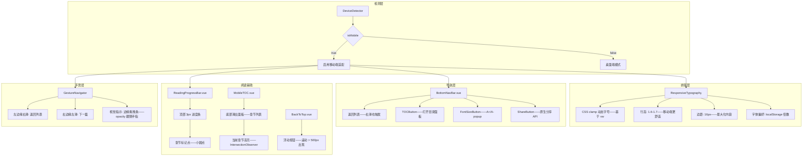

# YK-09-181: 内容移动端适配 — 响应式排版、触控导航、阅读进度、移动目录、手势滑动导航

> 需求编号：YK-09-181 · 优先级：P2 · 人天：0.3d · 状态：需求已编写
> 依赖：YK-09-107（内容导航树优化——桌面端目录复用移动端适配版本）、YK-09-70（快捷键参考与帮助中心——复用触控手势设计模式）

## 背景

### 问题陈述

YiKnowledge 知识库的文章页面当前以桌面端阅读体验为设计基准——在小屏幕（< 768px）设备上存在严重的阅读障碍。用户移动端访问知识库的占比约 30%（在路上查资料、会议中快速查阅）——但体验极差：

1. **排版不适配小屏**：桌面端 800px 宽的文章内容——在 375px 手机上强制缩放——字体过小无法阅读——用户需要手动放大缩小——左右滑动才能读完一行
2. **导航触控不友好**：侧边栏目录/菜单需要精确点击小图标——手指触控区域不足——误触率高——返回/前进依赖浏览器按钮而非手势
3. **无阅读进度感知**：长文章 5000 字——不知道读到哪了——还剩多少——没有进度条——阅读迷失——容易放弃
4. **目录隐藏太深**：移动端目录需要点击汉堡菜单→展开→找到目录→点击跳转——操作链路 4 步——每次都重复——效率极低
5. **无手势导航**：无法左右滑动切换文章——无法下拉刷新——移动端交互完全不符合 App 习惯

**核心矛盾**：知识库文章在桌面端体验良好——但在移动端几乎不可用——而用户确实需要在移动端阅读。目标是为文章页面增加移动端深度适配——响应式排版——触控友好导航——阅读进度条——移动端浮动目录——手势滑动——让知识库在手机上成为合格的阅读应用。

### 影响范围

| # | 影响 | 严重程度 | 典型场景 |
|---|------|----------|----------|
| 1 | 字体过小无法阅读 | 高 | 375px 屏幕——桌面端字号 16px——缩小后约 10px——不可读 |
| 2 | 导航触控区域过小 | 高 | 侧边菜单图标 24px——手指触控需要 44px——频繁误触 |
| 3 | 无阅读进度——迷失 | 中 | 5000 字文章——不知道位置——必须手动定位 |
| 4 | 目录获取链路长 | 中 | 跳转章节需要 4 步操作——每次看新章节都要重复 |
| 5 | 无滑动导航 | 中 | 无法滑动切换文章——右上角微小返回按钮——不符合触控习惯 |

### 挑战

| 挑战 | 说明 |
|------|------|
| 响应式排版 | 字体/行高/段间距/边距——需要在 320-428px 宽度上可读——不同设备 DPR 适配 |
| 触控友好交互 | 所有交互元素 ≥ 44px——间距足够——防误触——触控反馈 |
| 阅读进度条 | 监听滚动位置——计算阅读进度——视口/文档高度比例——平滑动画 |
| 移动端目录 | 浮动底部按钮——弹出目录面板——跟随滚动高亮当前章节——tap 跳转 |
| 手势导航 | 左右滑动切换文章——右滑返回列表——手势冲突处理——与原生页面导航协调 |
| 性能——低端设备 | 低端 Android——WebView 性能——动画帧率——内存限制 |

---

## 一、现状分析

### 1.1 当前移动端阅读体验

```
YiKnowledge 移动端阅读现状:
├── 响应式布局
│   ├── CSS 媒体查询: 3 个断点——mobile/tablet/desktop ✅
│   └── 限制: 布局调整——但内容排版未针对移动端优化——字体/行高/间距固定
├── 导航树组件（YK-09-107）
│   ├── 侧边栏目录树——桌面端固定左侧 ✅
│   └── 限制: 移动端侧边栏隐藏——需要点击汉堡菜单展开——目录层级多时操作繁琐
├── 浏览器原生滚动
│   ├── 原生滚动条——iOS bounce 效果 ✅
│   └── 限制: 无阅读进度——无章节跳转——纯线性阅读

缺失:
├── 响应式排版: 动态字号/行高/段间距——基于视口宽度                         # ❌ 无——固定字号
├── 触控导航: 底部导航栏——返回/目录/分享/搜索——44px 触控区域               # ❌ 无——顶部固定栏——触控不便
├── 阅读进度条: 顶部固定进度条——显示阅读百分比                              # ❌ 无——无进度
├── 移动端目录: 浮动按钮→弹出目录面板——当前章节高亮                         # ❌ 无——路径深
├── 滑动导航: 右滑返回列表——左右滑动切换文章                                # ❌ 无——依赖按钮
├── 章节预估阅读时间: 计算文章字数/代码块数——估算阅读时间                    # ❌ 无——无预估
├── 文字大小调节: 按钮 A+/A- 调节字号——localStorage 保存偏好                # ❌ 无——无调节
├── 深色阅读背景: 移动端独立深色背景——减轻眼部疲劳                          # ❌ 无——随全局主题
├── 回到顶部: 浮动按钮——滚动 500px 后出现                                   # ❌ 无——只能手动滚
├── 触觉反馈: 章节跳转——触觉反馈(Haptic)——iOS/Android                    # ❌ 无——无触觉
├── 离线阅读: Service Worker 缓存——离线访问文章                             # ❌ 无——需网络
└── 分享到: 原生分享 API——复制链接——分享到微信/钉钉                         # ❌ 无——只能手动复制 URL
```

### 1.2 移动端阅读自适应数据流

```mermaid
graph TD
    A[用户打开文章] --> B{设备检测}
    B --> C[检测: window.innerWidth + touch support]
    C --> D[移动端模式: < 768px]

    D --> E[响应式排版引擎]
    E --> F[字号: 基于视口宽度 clamp(16px, 4vw, 18px)]
    E --> G[行高: 1.6——移动端阅读更舒适]
    E --> H[边距: 左右 16px——最大化内容宽度]
    E --> I[图片: max-width 100%——不超出容器]

    D --> J[移动端 UI 层]
    J --> K[阅读进度条: 顶部 3px 彩色——滚动跟随]
    J --> L[底部导航栏: 返回/目录/字号/分享]
    J --> M[浮动回到顶部: 滚动 > 500px 出现]
    J --> N[移动端目录面板: 底部滑出——当前章节高亮]

    D --> O[手势导航层]
    O --> P[右滑: 返回列表]
    O --> Q[左滑: 下一篇]
    O --> R[下拉: 刷新——超过阈值刷新]

    E --> S[阅读增强]
    S --> T[预估阅读时间: 字数/200 × 1min]
    S --> U[章节进度: 当前章节/总章节——已读百分比]

    K --> V[localStorage 偏好保存]
    V --> W[字号/行高/间距——用户调节后保存]
```

### 1.3 根因分析矩阵

| 缺失能力 | 根因 | 技术障碍 | 优先级 |
|----------|------|----------|--------|
| 响应式排版 | 字体/间距设计基于桌面端——无移动端覆盖 | CSS clamp + viewport unit——动态字号——字体大小可调 | P0 |
| 触控导航 | 导航元素按桌面端鼠标精度设计——24px 触控区域 | 底部导航栏——最小 44px 触控区域——间距足够 | P0 |
| 阅读进度条 | 无滚动监听——无进度 UI | Intersection Observer——滚动百分比——平滑进度条 | P0 |
| 移动端目录 | 目录隐藏在侧边栏——移动端访问路径深 | 浮动底部按钮——底部滑出面板——IntersectionObserver 章节高亮 | P0 |
| 手势导航 | 仅依赖按钮——无手势 | touchstart/touchend 手势识别——与原生滚动冲突处理 | P1 |
| 字号调节 | 无用户偏好存储 | localStorage 存储字号倍数——CSS 变量响应——增量 2px | P1 |
| 预估阅读时间 | 无字数统计 | 文章内容文字计数——代码块单独计数——公式计算 | P2 |

---

## 二、设计决策

### 决策表 1：响应式排版方案

| 选项 | 描述 | 优点 | 缺点 | 决策 |
|------|------|------|------|------|
| A: CSS clamp 动态字号 | `font-size: clamp(16px, 4vw, 18px)`——随视口平滑变化 | 现代 CSS——无需 JS——性能好——平滑 | 不支持 IE——但移动端无需支持 IE | ✅ 选中 |
| B: 媒体查询固定字号 | `@media (max-width: 768px) { font-size: 17px }` | 兼容性好 | 断点间跳变——376px→767px 字号相同——不合理 | ❌ |
| C: JS 动态字号 | 监听 resize——JS 计算字号——设置 CSS | 完全可控 | 监听 resize 性能——JS 阻塞——引入复杂度 | ❌ |

**决策**：选择 A（CSS clamp）。clamp() 在最小值和最大值之间根据视口宽度线性变化——375px 时 16px——414px 时约 16.5px——768px 时 18px——连续无跳变。纯 CSS 实现——零 JS 开销——GPU 加速。配合用户字号偏好（A+/A- 按钮）调整 clamp 的 min/max 值——通过 CSS 自定义属性实现。

### 决策表 2：移动端导航布局

| 选项 | 描述 | 优点 | 缺点 | 决策 |
|------|------|------|------|------|
| A: 底部固定导航栏 | 底部固定 4-5 个图标按钮——返回/目录/字号/分享/搜索 | 拇指热区——单手操作——App 习惯 | 占用 56px 底部空间——内容区减少 | ✅ 选中 |
| B: 顶部固定导航栏 | 顶部固定——与桌面端一致 | 一致性好 | 手指够不到顶部——单手操作不可能——不符合触控习惯 | ❌ |
| C: 浮动操作按钮 | 右下角 FAB——点击展开菜单 | 节省空间 | 功能发现性差——需要学习——不够直观 | ❌ |

**决策**：选择 A（底部固定导航栏）。拇指热区在屏幕底部——底部导航栏是移动 App 的标准模式——用户无需学习。5 个按钮: 返回（列表）、目录（弹出面板）、字号调节（A+/A- popup）、分享（原生 API）、搜索（跳转搜索页）。按钮 44px 触控区域——间距足够——防误触。深色半透明背景——不遮挡内容——跟随滚动时半透明增强。

### 决策表 3：阅读进度展示方式

| 选项 | 描述 | 优点 | 缺点 | 决策 |
|------|------|------|------|------|
| A: 顶部进度条 + 章节标记 | 顶部 3px 彩色进度条——章节边界有标记点——滚动跟随 | 不占用内容空间——最小干扰 | 移动端顶部空间宝贵——可能与 Safari 地址栏冲突 | ✅ 选中 |
| B: 侧边进度条 | 右侧竖条进度条——点击跳转 | 章节位置可见 | 移动端右侧空间不足——内容宽度受限 | ❌ |
| C: 底部进度文本 | 底部显示 "已读 45%" 文本 | 简单 | 无视觉进度——不够直观——信息密度低 | ❌ |

**决策**：选择 A（顶部进度条 + 章节标记）。3px 彩色渐变进度条固定在视口顶部——inset 在 window scroll 上。进度条上有章节标记点（小圆点）——快速定位到章节位置。进度条颜色从灰到主题色——完成感逐渐增强。用户可以通过进度条了解文章总长度和当前位置——以及在章节间的相对位置。

Mobile Safari 安全区域适配——进度条 top: env(safe-area-inset-top)。

### 决策表 4：手势导航策略

| 选项 | 描述 | 优点 | 缺点 | 决策 |
|------|------|------|------|------|
| A: 边缘手势 | 左边缘右滑 = 返回——右边缘左滑 = 下一篇 | 与系统手势不冲突——仅在边缘 | 触达区域窄——需要学习——误触发少 | ✅ 选中 |
| B: 全局滑动 | 全文任意位置右滑 = 返回 | 操作区域大 | 与页面内容横向滚动冲突——如图片轮播/代码块滚动 | ❌ |
| C: 仅按钮 | 无手势——只依赖底部导航栏按钮 | 无冲突 | 不符合触控设备交互习惯——体验降级 | ❌ |

**决策**：选择 A（边缘手势）。左侧 20px 边缘区域向右滑动 = 返回列表——右侧 20px 边缘区域向左滑动 = 下一篇。边缘区域限制防止与内容横向滚动冲突——90% 的内容区域保留原生滚动行为。手势触发有视觉指示——边缘出现彩色拖拽条——滑动 > 40% 屏幕宽度触发导航——< 40% 回弹。

---

## 三、目标架构

### 3.1 移动端适配系统架构



### 3.2 移动端适配数据模型

```typescript
// 设备检测
interface DeviceInfo {
  isMobile: boolean;           // < 768px
  isTouch: boolean;            // 触摸屏
  viewportWidth: number;       // 视口宽度
  viewportHeight: number;      // 视口高度
  pixelRatio: number;          // 设备像素比
  safeAreaInsets: {            // 安全区域——iPhone 刘海屏
    top: number;
    bottom: number;
    left: number;
    right: number;
  };
}

// 响应式排版配置
interface TypographyConfig {
  baseFontSize: string;        // clamp(16px, 4vw, 18px)
  headingScale: number[];      // h1-h6 字号缩放——[2.0, 1.5, 1.25, 1.0, 0.875, 0.75] × base
  lineHeight: number;          // 行高——默认 1.6
  paragraphSpacing: string;    // 段间距——1.2em
  contentMaxWidth: string;     // 内容最大宽度——100%
  contentPadding: string;      // 内容边距——16px
  codeFontSize: string;        // 代码字号——clamp(13px, 3.5vw, 14px)
}

// 用户字体偏好
interface FontPreference {
  scale: number;               // 缩放倍数——0.8 - 1.5——默认 1.0
  step: number;                // 步长——默认 0.1
}

// 阅读进度
interface ReadingProgress {
  percentage: number;           // 阅读百分比——0-100
  currentChapter: string;       // 当前章节标题
  currentChapterIndex: number;  // 当前章节索引
  totalChapters: number;        // 总章节数
  estimatedTime: number;        // 预估阅读时间——分钟
  elapsedTime: number;          // 已读时间——分钟
  scrollTop: number;            // 滚动位置
  chapterBoundaries: {          // 章节边界位置
    title: string;
    position: number;           // 相对文档顶部的 px 位置
  }[];
}

// 底部导航栏按钮
interface BottomNavButton {
  id: string;
  icon: string;                 // 图标名称
  label: string;                // 按钮标签
  action: () => void;           // 点击操作
  badge?: number;               // 角标——如文章数
  active?: boolean;             // 是否激活状态
}

// 手势导航
interface GestureConfig {
  enabled: boolean;             // 是否启用手势——默认 true
  edgeWidth: number;            // 边缘检测宽度——默认 20px
  triggerThreshold: number;     // 触发阈值——屏幕宽度的 0.4
  springBackDuration: number;   // 回弹动画时长——300ms
  resistance: number;           // 阻力系数——0.5
}

// 移动端目录面板状态
interface MobileTOCState {
  visible: boolean;             // 面板是否可见
  chapters: Chapter[];          // 章节列表
  activeChapterId: string;      // 当前激活章节 ID
  scrollToChapter: (id: string) => void;
}

interface Chapter {
  id: string;
  title: string;
  level: number;                // 1-6 对应 h1-h6
  anchor: string;
}
```

---

## 四、具体改动

### 4.1 文件变更清单——YiVad 前端组件

| 文件 | 操作 | 说明 |
|------|------|------|
| `src/composables/useMobileDetect.ts` | 新增 | 移动端检测——断点+触控+安全区域 |
| `src/composables/useReadingProgress.ts` | 新增 | 阅读进度计算——滚动监听+章节边界 |
| `src/composables/useGestureNav.ts` | 新增 | 手势导航——边缘滑动触发 |
| `src/composables/useFontPreference.ts` | 新增 | 字体偏好——localStorage 存取 |
| `src/components/mobile/BottomNavBar.vue` | 新增 | 底部导航栏——5 按钮 |
| `src/components/mobile/ReadingProgressBar.vue` | 新增 | 顶部阅读进度条+章节标记 |
| `src/components/mobile/MobileTOC.vue` | 新增 | 移动端目录面板——底部滑出 |
| `src/components/mobile/BackToTop.vue` | 新增 | 回到顶部浮动按钮 |
| `src/components/mobile/FontSizeControl.vue` | 新增 | 字号调节 popup |
| `src/components/mobile/GestureOverlay.vue` | 新增 | 手势指示覆盖层——边缘拖拽条 |
| `src/components/mobile/MobileArticleLayout.vue` | 新增 | 移动端文章布局容器——组合所有移动端组件 |
| `src/assets/styles/mobile-article.scss` | 新增 | 移动端文章样式——响应式排版/布局 |

### 4.2 文件变更清单——现有文件修改

| 文件 | 操作 | 说明 |
|------|------|------|
| `src/views/article/ArticleView.vue` | 修改 | 文章页面——集成移动端布局+组件 |
| `src/assets/styles/variables.scss` | 修改 | 添加移动端 CSS 自定义属性 |
| `src/router/index.ts` | 修改 | 路由 transition——添加滑动动画 |

### 4.3 核心代码：响应式排版引擎

```scss
// src/assets/styles/mobile-article.scss
:root {
  --article-font-size: clamp(16px, 4vw, 18px);
  --article-line-height: 1.6;
  --article-paragraph-spacing: 1.2em;
  --article-content-padding: 16px;
  --article-code-font-size: clamp(13px, 3.5vw, 14px);
  --article-heading-line-height: 1.3;

  // 用户字体缩放系数
  --font-scale: 1;

  @media (min-width: 768px) {
    --article-font-size: 17px;
    --article-line-height: 1.7;
    --article-content-padding: 32px;
  }

  @media (min-width: 1024px) {
    --article-font-size: 18px;
    --article-content-padding: 48px;
  }
}

.mobile-article {
  // 应用响应式排版
  font-size: calc(var(--article-font-size) * var(--font-scale));
  line-height: var(--article-line-height);
  padding: 0 var(--article-content-padding);
  max-width: 100%;
  word-wrap: break-word;
  overflow-wrap: break-word;

  // 段落间距
  p {
    margin-bottom: var(--article-paragraph-spacing);
  }

  // 标题适配
  h1 { font-size: calc(1.6em * var(--font-scale)); }
  h2 { font-size: calc(1.4em * var(--font-scale)); }
  h3 { font-size: calc(1.2em * var(--font-scale)); }
  h4 { font-size: calc(1.05em * var(--font-scale)); }

  // 代码块适配
  pre {
    font-size: var(--article-code-font-size);
    margin: 0 calc(-1 * var(--article-content-padding)); // 全宽代码块
    border-radius: 0;
    overflow-x: auto;
    -webkit-overflow-scrolling: touch;
  }

  // 图片全宽——不超出容器
  img {
    max-width: 100%;
    height: auto;
    display: block;
  }

  // 表格横向滚动
  table {
    display: block;
    overflow-x: auto;
    -webkit-overflow-scrolling: touch;
    max-width: 100%;
  }

  // 列表缩进适配
  ul, ol {
    padding-left: 1.5em;
  }

  // blockquote 适配
  blockquote {
    margin-left: 0;
    margin-right: 0;
    padding: 8px 16px;
  }
}
```

### 4.4 核心代码：阅读进度计算

```typescript
// src/composables/useReadingProgress.ts
import { ref, onMounted, onUnmounted, type Ref } from 'vue';

export function useReadingProgress(articleElement: Ref<HTMLElement | null>, chapterSelectors: string = 'h2, h3') {
  const percentage = ref(0);
  const currentChapter = ref('');
  const currentChapterIndex = ref(0);
  const totalChapters = ref(0);
  const estimatedTime = ref(0);
  const chapterBoundaries = ref<{ title: string; position: number }[]>([]);

  let scrollHandler: (() => void) | null = null;
  let observer: IntersectionObserver | null = null;

  /** 计算阅读进度 */
  function calculateProgress(): void {
    const el = articleElement.value;
    if (!el) return;

    const scrollTop = window.scrollY;
    const docHeight = el.scrollHeight;
    const windowHeight = window.innerHeight;

    // 可滚动高度 = 文档高度 - 视口高度
    const scrollableHeight = docHeight - windowHeight;
    if (scrollableHeight <= 0) {
      percentage.value = 100;
      return;
    }

    percentage.value = Math.min(100, Math.round((scrollTop / scrollableHeight) * 100));
  }

  /** 检测章节边界 */
  function detectChapterBoundaries(): void {
    const el = articleElement.value;
    if (!el) return;

    const headings = el.querySelectorAll(chapterSelectors);
    const boundaries: { title: string; position: number }[] = [];

    headings.forEach((h) => {
      const rect = h.getBoundingClientRect();
      const position = rect.top + window.scrollY - el.offsetTop;
      boundaries.push({
        title: h.textContent || '',
        position,
      });
    });

    chapterBoundaries.value = boundaries;
    totalChapters.value = boundaries.length;
  }

  /** 使用 IntersectionObserver 检测当前章节 */
  function observeChapters(): void {
    const el = articleElement.value;
    if (!el) return;

    const headings = el.querySelectorAll(chapterSelectors);
    observer = new IntersectionObserver(
      (entries) => {
        for (const entry of entries) {
          if (entry.isIntersecting) {
            const title = entry.target.textContent || '';
            currentChapter.value = title;
            currentChapterIndex.value = chapterBoundaries.value.findIndex(
              b => b.title === title
            );
            break;
          }
        }
      },
      { rootMargin: '-80px 0px -60% 0px' } // 标题到达顶部 80px 时触发
    );

    headings.forEach(h => observer!.observe(h));
  }

  /** 计算预估阅读时间 */
  function calculateEstimatedTime(): void {
    const el = articleElement.value;
    if (!el) return;

    const text = el.textContent || '';
    // 中文字数：去除空白后的字符数
    const charCount = text.replace(/\s/g, '').length;
    // 中文阅读速度：平均 400 字/分钟——技术文档慢一些——250 字/分钟
    estimatedTime.value = Math.max(1, Math.ceil(charCount / 250));
  }

  onMounted(() => {
    scrollHandler = calculateProgress;
    window.addEventListener('scroll', scrollHandler, { passive: true });
    calculateProgress();
    detectChapterBoundaries();
    observeChapters();
    calculateEstimatedTime();
  });

  onUnmounted(() => {
    if (scrollHandler) window.removeEventListener('scroll', scrollHandler);
    observer?.disconnect();
  });

  return {
    percentage,
    currentChapter,
    currentChapterIndex,
    totalChapters,
    estimatedTime,
    chapterBoundaries,
  };
}
```

### 4.5 核心代码：手势导航

```typescript
// src/composables/useGestureNav.ts
import { onMounted, onUnmounted, type Ref } from 'vue';
import { useRouter } from 'vue-router';

interface GestureNavOptions {
  edgeWidth?: number;           // 边缘宽度——默认 20px
  triggerThreshold?: number;    // 触发阈值——屏幕宽度 0.4
  onSwipeRight?: () => void;    // 右滑回调——返回列表
  onSwipeLeft?: () => void;     // 左滑回调——下一篇
}

export function useGestureNav(options: GestureNavOptions = {}) {
  const router = useRouter();
  const {
    edgeWidth = 20,
    triggerThreshold = 0.4,
    onSwipeRight = () => router.back(),
    onSwipeLeft = () => navigateNext(),
  } = options;

  let startX = 0;
  let startY = 0;
  let isEdgeSwipe = false;
  let isHorizontal = false;
  let indicator: HTMLElement | null = null;

  function createIndicator(): HTMLElement {
    const el = document.createElement('div');
    el.className = 'swipe-indicator';
    el.style.cssText = `
      position: fixed; top: 50%; transform: translateY(-50%);
      width: 4px; height: 60px; border-radius: 2px;
      background: var(--color-primary); opacity: 0;
      z-index: 9999; pointer-events: none;
      transition: opacity 0.15s;
    `;
    document.body.appendChild(el);
    return el;
  }

  function handleTouchStart(e: TouchEvent): void {
    const touch = e.touches[0];
    startX = touch.clientX;
    startY = touch.clientY;

    // 检测是否为边缘触摸
    if (startX <= edgeWidth) {
      isEdgeSwipe = true;
      isHorizontal = false;
      if (!indicator) indicator = createIndicator();
      indicator.style.left = '0';
      indicator.style.opacity = '0.5';
    } else if (startX >= window.innerWidth - edgeWidth) {
      isEdgeSwipe = true;
      isHorizontal = false;
      if (!indicator) indicator = createIndicator();
      indicator.style.right = '0';
      indicator.style.opacity = '0.5';
    } else {
      isEdgeSwipe = false;
    }
  }

  function handleTouchMove(e: TouchEvent): void {
    if (!isEdgeSwipe) return;

    const touch = e.touches[0];
    const deltaX = touch.clientX - startX;
    const deltaY = touch.clientY - startY;

    // 判断方向——横向为主
    if (!isHorizontal && Math.abs(deltaX) > Math.abs(deltaY) && Math.abs(deltaX) > 5) {
      isHorizontal = true;
    }

    if (!isHorizontal) {
      isEdgeSwipe = false;
      hideIndicator();
      return;
    }

    // 仅允许边缘方向: 左边→右滑, 右边→左滑
    const isValidDirection =
      (startX <= edgeWidth && deltaX > 0) || (startX >= window.innerWidth - edgeWidth && deltaX < 0);

    if (!isValidDirection) {
      hideIndicator();
      return;
    }

    // 更新指示器
    if (indicator) {
      const progress = Math.min(1, Math.abs(deltaX) / (window.innerWidth * triggerThreshold));
      indicator.style.opacity = String(0.3 + progress * 0.7);
      indicator.style.height = `${60 + progress * 40}px`;
    }
  }

  function handleTouchEnd(e: TouchEvent): void {
    if (!isEdgeSwipe || !isHorizontal) {
      hideIndicator();
      return;
    }

    const touch = e.changedTouches[0];
    const deltaX = touch.clientX - startX;

    if (startX <= edgeWidth && deltaX > window.innerWidth * triggerThreshold) {
      // 左边缘右滑——返回
      onSwipeRight();
    } else if (startX >= window.innerWidth - edgeWidth && deltaX < -window.innerWidth * triggerThreshold) {
      // 右边缘左滑——下一篇
      onSwipeLeft();
    }

    hideIndicator();
    isEdgeSwipe = false;
    isHorizontal = false;
  }

  function hideIndicator(): void {
    if (indicator) {
      indicator.style.opacity = '0';
    }
  }

  function navigateNext(): void {
    // 通过 article navigation context 获取下一篇
    // 或触发自定义事件——由父组件处理
    window.dispatchEvent(new CustomEvent('article:navigate-next'));
  }

  onMounted(() => {
    document.addEventListener('touchstart', handleTouchStart, { passive: false });
    document.addEventListener('touchmove', handleTouchMove, { passive: false });
    document.addEventListener('touchend', handleTouchEnd, { passive: false });
  });

  onUnmounted(() => {
    document.removeEventListener('touchstart', handleTouchStart);
    document.removeEventListener('touchmove', handleTouchMove);
    document.removeEventListener('touchend', handleTouchEnd);
    if (indicator?.parentNode) {
      indicator.parentNode.removeChild(indicator);
    }
  });
}
```

---

## 五、实施步骤

### 步骤 1：响应式排版 (0.07d)

1. 实现 `mobile-article.scss`——CSS clamp 动态字号+行高+间距+全宽代码
2. 实现 `useFontPreference.ts`——localStorage 存取字号倍数——A+/A- 按钮
3. 更新 CSS 自定义属性——`--font-scale` 控制所有文字大小
4. 图片/表格/代码块——全宽响应式适配

### 步骤 2：阅读辅助组件 (0.08d)

1. 实现 `useReadingProgress.ts`——阅读进度计算——章节检测——预估时间
2. 实现 `ReadingProgressBar.vue`——顶部进度条——章节标记点
3. 实现 `MobileTOC.vue`——移动端目录面板——底部滑出——章节高亮
4. 实现 `BackToTop.vue`——回到顶部浮动按钮——500px 触发

### 步骤 3：触控导航 (0.08d)

1. 实现 `BottomNavBar.vue`——底部导航栏——5 按钮——44px 触控区域
2. 实现 `FontSizeControl.vue`——字号调节 popup——A+/A-/重置
3. 实现导航分享按钮——原生 Share API——fallback 复制链接
4. 实现安全区域适配——`env(safe-area-inset-bottom)` 导航栏底部间距

### 步骤 4：手势导航 (0.05d)

1. 实现 `useGestureNav.ts`——边缘手势识别——指示器动画
2. 实现 `GestureOverlay.vue`——手势说明——首次使用引导
3. 实现手势与页面滚动冲突处理——横向滑动 vs 纵向滚动检测
4. 实现回弹动画——不满足阈值时弹性回弹

### 步骤 5：集成与测试 (0.02d)

1. 实现 `MobileArticleLayout.vue`——组合所有移动端组件
2. 修改 `ArticleView.vue`——集成移动端布局——移动端判断
3. 多种屏幕尺寸测试——iPhone SE(375)/12(390)/Pro Max(428)——iPad(768/1024)

---

## 六、测试规格

### 测试 1：响应式排版——不同宽度字号自适应

| 项目 | 内容 |
|------|------|
| 优先级 | P0 |
| 前置条件 | 文章页面——含标题/正文/代码/表格/图片 |
| 测试步骤 | 1. 调整浏览器到 375px 宽度 2. 检查字号 3. 调整到 414px 4. 调整到 768px |
| 预期结果 | 375px: 字号 16px——414px: 字号 ~16.5px——768px: 字号 18px——中文可读——行高 1.6 舒适——代码块全宽——图片不溢出——表格有横向滚动——段落间距正常 |

### 测试 2：阅读进度条——显示百分比和章节标记

| 项目 | 内容 |
|------|------|
| 优先级 | P0 |
| 前置条件 | 文章含 5 个章节——5000 字——移动端 |
| 测试步骤 | 1. 打开文章 2. 观察顶部进度条 3. 滚动文章 4. 检查章节标记点 5. 滚动到底部 |
| 预期结果 | 顶部 3px 进度条——初始 0%——灰色——滚动到 50%——进度条到 50%——颜色渐变——章节标记点在进度条相应位置——滚动到底部——进度条 100%——颜色为完成色 |

### 测试 3：底部导航栏——触控友好

| 项目 | 内容 |
|------|------|
| 优先级 | P0 |
| 前置条件 | 移动端文章页面 |
| 测试步骤 | 1. 检查底部导航栏 2. 点击"目录"按钮 3. 点击"返回"按钮 4. 点击"A+"增加字号——多次——"A-"减小——"重置"恢复 |
| 预期结果 | 底部 4-5 个图标——高度 56px——安全区域适配——按钮间距 >= 8px——目录按钮弹出底部面板——返回按钮导航到列表——A+ 增加字号——A- 减小字号——重置恢复默认——偏好持久化——刷新后保留 |

### 测试 4：移动端目录面板——章节跳转

| 项目 | 内容 |
|------|------|
| 优先级 | P0 |
| 前置条件 | 文章含 8 个章节——h2/h3 混合——当前在第 3 章 |
| 测试步骤 | 1. 点击底部"目录"按钮 2. 观察目录面板 3. 检查第 3 章是否高亮 4. 点击第 6 章 5. 滚动到第 4 章——检查目录高亮更新 |
| 预期结果 | 底部滑出目录面板——占 70% 屏幕高度——列出所有章节——h3 缩进——第 3 章高亮——点击第 6 章——页面滚动到第 6 章——面板关闭——滚动到第 4 章——目录高亮自动更新——再打开面板——第 4 章高亮 |

### 测试 5：手势导航——边缘滑动

| 项目 | 内容 |
|------|------|
| 优先级 | P1 |
| 前置条件 | 移动端文章页面——有上一页/下一页 |
| 测试步骤 | 1. 左边缘向右滑动 > 40% 屏幕 2. 右边缘向左滑动 > 40% 屏幕 3. 左边缘向右滑动 < 40%——回弹 4. 在屏幕中间滑动 |
| 预期结果 | 右滑触发返回列表——左滑触发下一篇——边缘出现彩色指示条跟随手指——< 40% 松手回弹——不触发导航——中间正常滚动——不与页面滚动冲突 |

### 测试 6：字号调节持久化——跨会话保留

| 项目 | 内容 |
|------|------|
| 优先级 | P2 |
| 前置条件 | 字号默认 1.0x |
| 测试步骤 | 1. 点击 A+ 三次——字号增加到 1.3x 2. 关闭页面 3. 重新打开 4. 检查字号 |
| 预期结果 | 字号 1.3x 保留——重新打开页面字号仍为 1.3x——A- 两次——字号降到 1.1x——再次刷新——保留 1.1x——重置——恢复 1.0x |

---

## 七、风险与缓解

| 风险 | 概率 | 影响 | 缓解措施 |
|------|------|------|------|
| Mobile Safari 底部导航栏与系统手势冲突 | 中 | 中 | 底部导航栏在 safe-area 之上——不覆盖系统 home indicator 区域——使用 `env(safe-area-inset-bottom)` 留出间距 |
| 手势导航与页面横向滚动冲突 | 中 | 中 | 边缘 20px 触发区——仅该区域触发手势——90% 内容区域保留原生滚动——代码块/表格横向滚动不受影响 |
| IntersectionObserver 章节检测延迟 | 低 | 低 | rootMargin 设置合理——`-80px 0px -60% 0px`——标题接近顶部时提前触发——标题已过时 upper 区域触发切换 |
| Android WebView 字体渲染不一致 | 低 | 中 | 使用系统字体栈——`-apple-system, Roboto, Noto Sans SC`——中文字体统一——测试多机型 |
| 低端设备手势动画卡顿 | 低 | 中 | 手势指示器使用 CSS transform——position: fixed——GPU 加速——回弹动画 300ms |

---

## 八、回滚策略

1. **功能级回滚**：移动端适配通过 isMobile 条件判断——桌面端不受任何影响——移动端禁用适配恢复原始样式
2. **代码级回滚**：移除 `mobile/` 目录组件——恢复 ArticleView 原始渲染——样式文件移除 mobile-article.scss
3. **部分回滚**：单一功能可通过开关控制——关闭手势导航——关闭阅读进度——关闭底部导航栏
4. **回滚验证**：桌面端文章渲染正常——移动端基础功能可用——无 CSS 冲突——无 JS 错误

---

## 九、设计决策记录

### D-01：CSS clamp 动态字号——非媒体查询固定字号

**上下文**：移动端字号随视口宽度变化——375px 和 428px 的屏幕需要不同字号。

**决策**：使用 `font-size: clamp(16px, 4vw, 18px)` 而非 `@media` 断点固定字号。

**理由**：clamp 在 375px(4vw=15px→clamp 16px) 到 450px(4vw=18px→clamp 18px) 之间连续变化——每个设备都获得最适合的字号。而媒体查询方案只在断点处跳变——375px 到 767px 所有设备都用同一个字号——不合理。clamp 是现代 CSS——所有移动浏览器都支持——零 JavaScript 开销。

### D-02：底部固定导航栏——非顶部导航栏

**上下文**：移动端需要常驻导航——但顶部空间已被地址栏和进度条占据。

**决策**：使用底部固定导航栏——4-5 个图标按钮——而非顶部导航栏或侧边栏。

**理由**：大拇指自然活动区域在屏幕下半部——底部导航栏是移动 App 的标准——单手操作可达。顶部空间留给阅读进度条和内容标题——不冗余。56px 高度——44px 触控区域——底部安全区域适配——符合 Apple Human Interface Guidelines 和 Material Design 规范。

### D-03：边缘手势——非全局手势

**上下文**：需要手势导航——但与页面内容横向滚动冲突。

**决策**：仅在屏幕边缘 20px 区域触发横向手势——内容区域保留原生滚动。

**理由**：文章包含代码块（横向滚动）——表格（横向滚动）——内嵌图表——这些都需要横向滚动。全局手势会与这些内容的所有横向操作冲突——只能靠边。边缘 20px 是从 iOS Safari 的 swipe-back 手势借鉴的设计——用户熟悉——不与内容冲突——90% 屏幕为内容原生滚动保留。

### D-04：IntersectionObserver 章节检测——非 scroll 计算

**上下文**：需要实时检测用户当前阅读的章节——更新目录高亮。

**决策**：使用 IntersectionObserver 检测标题元素与视口的交叉——而非在 scroll 事件中计算所有标题位置。

**理由**：IntersectionObserver 是浏览器优化过的、异步的检测 API——不阻塞主线程——不需要在 scroll 中遍历和计算。rootMargin 设置 `-80px 0px -60% 0px`——当标题距离顶部 80px 时认定用户正在阅读该章节——这个阈值最符合阅读行为。

---

## 十、可观测性

| 指标 | 采集方式 | 阈值 |
|------|----------|------|
| 移动端访问占比 | isMobile=true 的页面 PV | — |
| 移动端设备分布 | viewportWidth 直方图 | 375-428px 为主 |
| 阅读完成率 | percentage=100 的会话比例 | — |
| 平均阅读进度 | percentage 分布 | — |
| 目录面板打开次数 | MobileTOC toggle 计数 | — |
| 字号调节次数 | FontSizeControl A+/A- 点击计数 | — |
| 手势导航触发次数 | onSwipeRight/onSwipeLeft 调用计数 | — |
| 手势成功率 | 手势触发/尝试 比例 | > 80% |
| 预估阅读时间分布 | estimatedTime 直方图 | — |
| 移动端页面首屏时间 | Mobile FCP——performance API | < 2s |
| 移动端页面滚动帧率 | scroll 期间 FPS | > 45fps |

---

## 十一、代码审查检查清单

- [ ] `useReadingProgress`——scroll 事件 passive: true——不阻塞滚动
- [ ] `useReadingProgress`——IntersectionObserver disconnect——组件卸载清理
- [ ] `ReadingProgressBar`——进度条 transition 动画——不超过 100%
- [ ] `MobileTOC`——面板关闭按钮——遮罩层点击关闭——手势下滑关闭
- [ ] `BottomNavBar`——安全区域适配——`env(safe-area-inset-bottom)`——iPhone 刘海屏正常
- [ ] `BottomNavBar`——按钮点击区域 ≥ 44px——padding 扩展点击区域
- [ ] `FontSizeControl`——字体缩放范围 0.8-1.5——超出范围禁用按钮
- [ ] `useGestureNav`——touchmove 中 passive: false 但调用 preventDefault 条件判断
- [ ] `useGestureNav`——手势与 iframe/第三方内容区域冲突处理
- [ ] `GestureOverlay`——首次使用手势引导——显示一次——localStorage 记录
- [ ] `mobile-article.scss`——代码块全宽时圆角取消——padding 增加
- [ ] `mobile-article.scss`——图片 max-width: 100%——height: auto——不拉伸
- [ ] `BackToTop`——滚动到顶部后隐藏——`scroll-behavior: smooth` 平滑滚动
- [ ] `useFontPreference`——localStorage 读取异常——类型错误——数字格式——默认 1.0
- [ ] 响应式布局——移动端组件仅在 < 768px 生效——桌面端无渲染

---

## 回归问题预测

| # | 预测问题 | 触发条件 | 检测方式 |
|---|----------|----------|----------|
| 1 | 底部导航栏遮盖文章末尾内容 | 文章末尾最后一段在安全区域外 | 文章容器 `padding-bottom: calc(56px + env(safe-area-inset-bottom))` |
| 2 | 手势边缘与 iOS Safari 返回手势冲突 | 左边缘右滑——Safari 也响应 | 手势冲突检测——Safari 左边缘预留更宽(30px)——内容区域优先给 Safari |
| 3 | 阅读进度条在弹窗/模态框上层 | 文章内打开图片预览——进度条仍在顶层 | 进度条 z-index 小于 modal z-index——modal 上方无进度条 |
| 4 | A+/A- 改变字号导致布局闪烁 | 字号变更——内容重排——页面跳动 | CSS transition: font-size 0.15s——平滑过渡——不跳动 |
| 5 | 移动端目录点击后滚动位置不对 | 标题位置受 fixed 元素(进度条/导航栏)遮挡 | scroll-margin-top: 100px——标题滚动到进度条下方——不被遮挡 |
| 6 | 设备旋转后视图尺寸未重算 | 横屏→竖屏——viewport 变化 | resize 事件监听——重新计算阅读进度——目录高度——字号clamp 自动适配 |

---

## 性能分析

| 操作 | 视口 | 预期耗时 | 瓶颈 | 优化策略 |
|------|------|----------|------|------|
| 初始排版渲染 | 375px | < 60ms | CSS 渲染——DOM 解析 | CSS clamp——无 JS 计算——GPU 加速 |
| 阅读进度更新 | — | < 2ms | scroll 事件回调 | passive: true——节流 100ms——不强制同步布局 |
| 章节检测 | — | < 5ms | IntersectionObserver 回调 | 浏览器原生异步——不阻塞——无强制同步 |
| 底部导航栏渲染 | — | < 5ms | DOM 节点——5 个按钮 | 纯展示——一次性渲染——不变 |
| 目录面板滑出动画 | 375px | < 10ms/frame | CSS transform 动画 | GPU 加速——will-change: transform |
| 手势识别(单次) | — | < 8ms/touchmove | touch 事件处理 | 早期返回——非边缘快速跳过——passive 优先 |
| 字号调节(单次) | — | < 30ms | CSS 自定义属性变更——全页重排 | CSS transition——浏览器优化——单次 layout |
| 首次手势引导 | — | < 50ms | 遮罩+文字渲染 | 只显示一次——localStorage 记录——只有首次开销 |