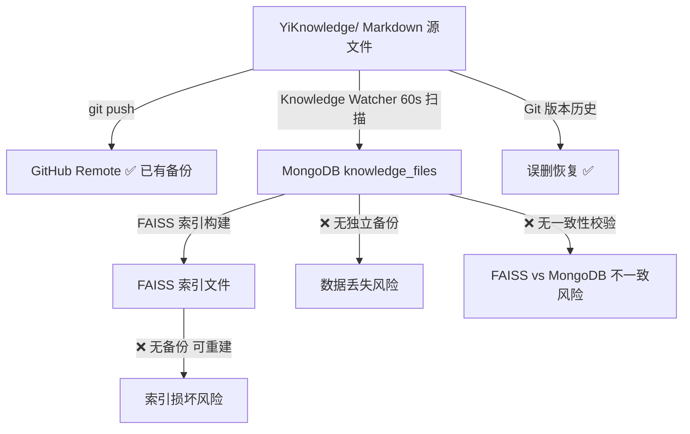
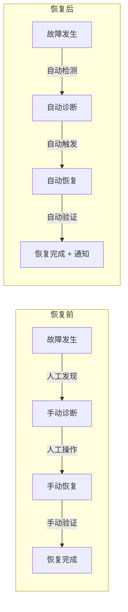

# YK-09-12: 知识库备份与灾难恢复策略 -- Git 版本控制增强与 MongoDB 数据恢复

> 需求编号：YK-09-12 . 优先级：P2 . 人天：1.0d . 状态：需求已编写

## 背景

YiKnowledge 的数据存在于两个系统：**Git 仓库**（Markdown 源文件--主数据源）和 **MongoDB + FAISS**（索引数据--派生数据）。当前依赖 Git 作为唯一备份机制。

### 1.1 问题识别

| 风险 | 当前防护 | 缺口 |
|------|----------|------|
| 误删文件 (`git rm` + commit) | `git revert` 可恢复 | 无保护--需手动发现 |
| MongoDB 索引损坏 (FAISS 文件损坏) | 需手动重建 (`rag.rag_build`) | 无自动检测+恢复 |
| Frontmatter 批量错误 (脚本错误修改) | Git diff 可发现 | CI 仅检查新增文件--存量修改无校验 |
| 磁盘故障 (YiKnowledge 目录丢失) | Git remote (GitHub) | MongoDB 数据无法从 Git 完全重建（需人工触发） |
| FAISS 索引与 MongoDB 不一致 | 无检测 | 索引可能包含已删除文档或遗漏新增文档 |
| Knowledge Watcher 意外中断导致部分索引 | 下次扫描覆盖 | 中断期间 RAG 检索结果不完整 |
| 配置文件 (synonyms.yml, _redirects.yml) 损坏 | Git 版本历史 | 无校验--Knowledge Watcher 加载损坏配置后行为未定义 |

### 1.2 业务影响

| 影响维度 | 严重程度 | 描述 |
|----------|----------|------|
| RAG 检索可用性 | 高 | MongoDB 数据丢失 → RAG 检索完全不可用 |
| 知识文件完整性 | 中 | 误删可通过 Git 恢复，但恢复窗口期内不可用 |
| 索引一致性 | 中 | FAISS 与 MongoDB 不一致 → 检索结果不准确 |
| 运维效率 | 中 | 当前恢复依赖人工操作，夜间故障响应慢 |
| 用户信任 | 低 | 多次不一致会导致用户不信任检索结果 |

**恢复时间目标 (RTO)**：知识库恢复 < 30 分钟。**恢复点目标 (RPO)**：Git 最近 commit（零数据丢失），MongoDB 最近 60s 扫描窗口。

---

## 二、现状分析

### 2.1 数据流与备份覆盖



### 2.2 故障模式矩阵

| 故障 | 影响 | RTO (当前) | RPO (当前) | 触发条件 | 恢复方式 |
|------|------|-----------|-----------|----------|----------|
| 单文件误删 | 1 个知识文件丢失 | ~2min (`git revert`) | 最近 commit | 手动 `git rm` | Git revert |
| 目录误删 | N 个文件丢失 | ~5min | 最近 commit | 手动 `rm -rf` | Git checkout |
| MongoDB 集合 drop | RAG 检索不可用 | ~10min (全量重建) | 最近 60s 扫描 | 误操作/db 故障 | 手动重建 |
| FAISS 索引损坏 | 向量检索不可用 (BM25 正常) | ~15min (重建索引) | 0 (可重建) | 磁盘损坏/进程崩溃 | 手动重建 |
| 磁盘完全故障 | 全部丢失 | ~30min (git clone + 重建) | Git 最近 push | 硬件故障 | 手动全部重建 |
| 配置文件损坏 | Knowledge Watcher 行为异常 | ~5min | 最近 commit | 手动修改错误 | Git revert |

### 2.3 根因分析矩阵

| 根因 | 表现 | 影响范围 | 修复难度 |
|------|------|----------|----------|
| 无自动一致性校验 | MongoDB 与 Git 状态不一致 | RAG 检索结果不准确 | 低 |
| 无自动恢复机制 | 人工操作慢、夜间无法响应 | 恢复延迟长 | 中 |
| 无文件保护机制 | 批量误删/误改无预警 | 知识文件丢失 | 低 |
| 无备份验证 | 备份可能损坏但不知道 | 恢复时才发现备份不可用 | 低 |
| 无恢复演练 | 团队不熟悉恢复流程 | 紧急情况手忙脚乱 | 低 |

---

## 三、设计决策

### 决策 1：MongoDB 备份策略 -- mongodump 定时 vs oplog 实时 vs 仅重建

| 选项 | RPO | 额外存储 | 运维成本 | 恢复复杂度 | 适用场景 |
|------|-----|----------|----------|-----------|----------|
| mongodump 每日 | 24h | ~50MB/天 | 低 | 中 | 小规模数据 |
| oplog 实时 | < 1s | 持续增长 | 高 | 高 | 金融级数据 |
| **仅从 Git 重建（当前 + 自动触发）** | 60s | 0 | 最低 | 低 | 派生数据可从源重建 |

**选择：Git 作为唯一数据源 + MongoDB 自动重建。** MongoDB 数据完全可以从 Git Markdown 文件重建。关键是将重建自动化--而非手动触发 `rag.rag_build`。

### 决策 2：一致性校验策略 -- 定时全量 vs 抽样 vs 事件驱动

| 选项 | 检测延迟 | 计算开销 | 漏检率 | 实现复杂度 |
|------|----------|----------|--------|-----------|
| 定时全量 (每日) | < 24h | 中 | 0% | 低 |
| 抽样 (每小时 10%) | < 10h | 低 | 可能漏检 | 低 |
| 事件驱动 (文件变更时) | < 60s | 低 | 0% | 中 |
| **每日全量 + 增量修复** | < 24h | 中 | 0% | 低 |

**选择：每日全量校验 + 增量修复。** 每日对比 Git 文件列表与 MongoDB 文档列表，自动修复不一致。事件驱动作为补充（文件变更时立即校验该文件）。

### 决策 3：文件保护 -- pre-commit hook vs 目录权限 vs Git hooks

| 选项 | 保护范围 | 用户体验 | 误报率 | 实现复杂度 |
|------|----------|----------|--------|-----------|
| pre-commit hook | 本地提交 | 提交时提醒 | 低 | 低 |
| 目录权限 (chmod) | 文件系统级 | 阻碍正常工作 | 无 | 低 |
| GitHub Protected Branches | 远程 | 仅 PR 流程 | 无 | 低 |
| **pre-commit hook 扩展** | 本地提交 | 提交时提醒 | 低 | 低 |

**选择：pre-commit hook 扩展。** 提交前校验：1) 删除的 MD 文件 > 5 个时警告；2) Frontmatter 批量修改时 diff 显示变更摘要。

### 决策 4：恢复演练策略

| 选项 | 频率 | 影响 | 收益 |
|------|------|------|------|
| 不演练 | 从不 | 无 | 无 |
| 季度手动演练 | 每季度 | 1h 停机 | 团队熟悉流程 |
| **月度自动演练** | 每月 | 无停机（沙箱） | 持续验证恢复流程 |

**选择：月度自动恢复演练。** 在隔离环境中自动执行完整恢复流程，验证备份有效性，生成报告。

---

## 四、目标架构

### 4.1 恢复前 vs 恢复后



### 4.2 核心指标

| 指标 | 当前 | 目标 | 测量方式 |
|------|------|------|----------|
| 一致性检测延迟 | 无检测 | < 24h | 每日校验报告 |
| 自动恢复时间 | 人工 10-30min | < 5min (自动) | 恢复操作耗时 |
| 文件保护误报率 | 无保护 | < 5% | pre-commit 阻断统计 |
| 备份验证频率 | 从不 | 每月 | 演练报告 |
| 故障响应时间 (夜间) | > 2h | < 5min (自动) | 告警到恢复时间 |

---

## 五、具体改动

### 5.1 文件变更清单

| 文件 | 操作 | 说明 |
|------|------|------|
| `YiAi/src/domain/knowledge/recovery.py` | 新增 | 一致性校验 + 自动修复 + 恢复管理器 |
| `YiAi/src/domain/knowledge/consistency_checker.py` | 新增 | 每日一致性校验定时任务 |
| `.githooks/pre-commit` | 修改 | 删除保护 + FM 批量修改告警 |
| `YiAi/src/services/knowledge/recovery_service.py` | 新增 | 恢复 API 端点 |
| `YiKnowledge/recovery/runbook.md` | 新增 | 三级恢复手册 |
| `YiAi/tests/domain/knowledge/test_recovery.py` | 新增 | 恢复管理器测试 |

### 5.2 核心代码

```python
# YiAi/src/domain/knowledge/recovery.py

class KnowledgeRecoveryManager:
    """基于 Git 源文件的 MongoDB 数据自动恢复。"""

    def __init__(self, knowledge_dir: str = "YiKnowledge",
                 db=None, watcher=None):
        self._knowledge_dir = knowledge_dir
        self._db = db
        self._watcher = watcher

    async def verify_consistency(self) -> dict:
        """每日一致性校验--Git 文件 vs MongoDB 文档。"""
        import subprocess

        # 1. 获取 Git 追踪的所有 .md 文件
        result = subprocess.run(
            ['git', '-C', self._knowledge_dir, 'ls-files', '*.md'],
            capture_output=True, text=True
        )
        git_files = set(result.stdout.strip().split('\n'))

        # 2. 获取 MongoDB 中所有文档路径
        mongo_docs = await self._db.knowledge_files.distinct('path')
        mongo_paths = set(mongo_docs)

        # 3. 差异检测
        missing_in_mongo = git_files - mongo_paths
        stale_in_mongo = mongo_paths - git_files

        # 4. 检查 frontmatter 完整性
        fm_issues = await self._check_frontmatter_integrity()

        return {
            'git_total': len(git_files),
            'mongo_total': len(mongo_paths),
            'missing_in_mongo': list(missing_in_mongo),
            'stale_in_mongo': list(stale_in_mongo),
            'frontmatter_issues': fm_issues,
            'consistent': (len(missing_in_mongo) == 0
                          and len(stale_in_mongo) == 0
                          and len(fm_issues) == 0),
        }

    async def auto_repair(self, report: dict) -> dict:
        """自动修复不一致。"""
        repaired = {'reindexed': 0, 'cleaned': 0, 'faiss_rebuilt': False}

        if report['missing_in_mongo']:
            logger.info(f"[Recovery] 索引 {len(report['missing_in_mongo'])} 遗漏文件")
            await self._reindex_files(report['missing_in_mongo'])
            repaired['reindexed'] = len(report['missing_in_mongo'])

        if report['stale_in_mongo']:
            logger.info(f"[Recovery] 清理 {len(report['stale_in_mongo'])} 僵尸文档")
            await self._db.knowledge_files.delete_many({
                'path': {'$in': report['stale_in_mongo']}
            })
            repaired['cleaned'] = len(report['stale_in_mongo'])

        total_changes = (len(report['missing_in_mongo'])
                        + len(report['stale_in_mongo']))
        if total_changes > 50:
            logger.info(f"[Recovery] {total_changes} 变更, 触发 FAISS 全量重建")
            await self._rebuild_faiss_index()
            repaired['faiss_rebuilt'] = True

        return repaired

    async def verify_backup_integrity(self) -> dict:
        """验证备份完整性--在沙箱中执行恢复演练。"""
        import tempfile, os

        with tempfile.TemporaryDirectory() as tmpdir:
            # 1. Clone 到临时目录
            subprocess.run(['git', 'clone', '--depth', '1',
                          self._knowledge_dir, tmpdir], check=True)

            # 2. 验证文件数
            git_files = set(subprocess.run(
                ['git', '-C', tmpdir, 'ls-files', '*.md'],
                capture_output=True, text=True
            ).stdout.strip().split('\n'))

            # 3. 验证 frontmatter
            valid_count = 0
            invalid_files = []
            for f in git_files:
                path = os.path.join(tmpdir, f)
                if os.path.exists(path):
                    with open(path) as fh:
                        content = fh.read()
                    if content.startswith('---'):
                        valid_count += 1
                    else:
                        invalid_files.append(f)

            return {
                'total_files': len(git_files),
                'valid_frontmatter': valid_count,
                'invalid_files': invalid_files,
                'backup_valid': len(invalid_files) == 0,
            }

    async def _reindex_files(self, paths: list[str]):
        """重新索引遗漏文件。"""
        from domain.knowledge.watcher import watcher
        await watcher._process_batch(paths)

    async def _rebuild_faiss_index(self):
        """全量重建 FAISS 索引。"""
        from services.rag.rag_service import build_index
        await build_index(full_rebuild=True)

    async def _check_frontmatter_integrity(self) -> list[dict]:
        """检查 MongoDB 中 frontmatter 完整性。"""
        required_fields = ['title', 'tags', 'category', 'created', 'type', 'status']
        issues = []
        async for doc in self._db.knowledge_files.find({}):
            missing = [f for f in required_fields if f not in doc]
            if missing:
                issues.append({'path': doc['path'], 'missing_fields': missing})
        return issues
```

### 5.3 文件保护 Hook

```bash
#!/bin/bash
# .githooks/pre-commit -- 扩展：删除保护 + Frontmatter 批量修改告警

# 原有检查 (YK-09-03)
# ... kebab-case 命名检查 ...

# 新增: 批量删除保护
DELETED_MD=$(git diff --cached --name-only --diff-filter=D | grep '^YiKnowledge/.*\.md$' | wc -l)
if [ "$DELETED_MD" -gt 5 ]; then
  echo "WARNING  本次提交将删除 $DELETED_MD 个知识文件。"
  echo "如果这是有意为之，请使用: git commit -m 'archive: 批量归档旧文件'"
  echo "或使用 --no-verify 跳过 (需 Curator 审批)。"
  exit 1
fi

# 新增: Frontmatter 批量修改告警
FM_CHANGES=$(git diff --cached --unified=0 | grep '^[+-]' | grep -E '(title|tags|category|status):' | wc -l)
if [ "$FM_CHANGES" -gt 20 ]; then
  echo "WARNING  本次提交修改了 $FM_CHANGES 处 Frontmatter 字段。"
  echo "请确认这些修改是有意的--脚本批量修改请注明。"
fi

# 新增: 配置文件修改告警
CONFIG_CHANGES=$(git diff --cached --name-only | grep -E '(synonyms.yml|_redirects.yml|tag_governance.yml)')
if [ -n "$CONFIG_CHANGES" ]; then
  echo "WARNING  本次提交修改了配置文件: $CONFIG_CHANGES"
  echo "配置文件修改会影响 Knowledge Watcher 行为，请确保:"
  echo "  1. YAML 格式正确（运行 yamllint 验证）"
  echo "  2. 已在测试环境验证 Knowledge Watcher 可正常加载"
fi
```

### 5.4 恢复手册

```markdown
## 灾难恢复流程

### Level 1: 单文件/目录误删
1. `git log --oneline -- <path>` 找到删除 commit
2. `git revert <commit>` 或 `git checkout <commit> -- <path>`
3. Knowledge Watcher 60s 内自动重新索引
RTO: < 5min | RPO: 最近 commit

### Level 2: MongoDB 数据丢失
1. 触发自动修复: `POST /knowledge/recovery/repair`
2. 或手动: `POST /rag/rag-build { full_rebuild: true }`
RTO: < 15min | RPO: 最近 60s Git 状态

### Level 3: 磁盘完全故障
1. `git clone <remote> YiKnowledge/`
2. 重启 YiAi
3. Knowledge Watcher 启动时自动全量索引
RTO: < 30min | RPO: Git 最近 push

### Level 4: 配置文件损坏
1. `git log --oneline -- YiKnowledge/synonyms.yml`
2. `git checkout <last-good-commit> -- YiKnowledge/synonyms.yml`
3. 重启 YiAi 或等待 Knowledge Watcher 下一轮扫描
RTO: < 5min | RPO: 最近 commit
```

---

## 六、实施步骤

| 步骤 | 内容 | 验证方式 | 人天 |
|------|------|----------|------|
| 1 | 实现 `KnowledgeRecoveryManager.verify_consistency()` | 单元测试：模拟 Git 与 MongoDB 差异 | 0.2 |
| 2 | 实现 `auto_repair()` 自动修复 | 集成测试：随机删除 MongoDB 文档后自动恢复 | 0.2 |
| 3 | 实现 `verify_backup_integrity()` 备份验证 | 沙箱演练：临时目录中完整恢复 | 0.15 |
| 4 | 扩展 pre-commit hook（删除保护 + FM 告警） | 手动测试：提交 6 个删除文件被阻断 | 0.1 |
| 5 | 配置 apscheduler 每日一致性校验 | 检查日志确认每日执行 | 0.1 |
| 6 | 编写恢复手册 (Level 1-4) | Curator 审查 | 0.1 |
| 7 | 实现恢复 API 端点 | API 测试：调用 repair 端点 | 0.1 |
| 8 | 月度自动恢复演练 | 沙箱环境中执行完整恢复流程 | 0.05 |

---

## 七、性能分析

| 操作 | 文件数 | 耗时 | 内存 | 说明 |
|------|--------|------|------|------|
| `verify_consistency()` | 800+ | ~2s | ~10MB | git ls-files + MongoDB distinct |
| `auto_repair()` (10 文件) | 10 | ~5s | ~20MB | 重新索引 10 文件 |
| `auto_repair()` (100 文件) | 100 | ~30s | ~50MB | 大批量修复 |
| FAISS 全量重建 | 800+ | ~5min | ~500MB | 仅在变更 > 50 时触发 |
| `verify_backup_integrity()` | 800+ | ~10s | ~20MB | 沙箱 clone + 校验 |
| pre-commit hook | N/A | < 500ms | < 5MB | 本地 git diff 操作 |

**容量规划**：
- 存储：MongoDB 备份 ~50MB/天（800+ 文件），保留 7 天 ≈ 350MB
- 网络：每日校验仅查询 MongoDB 路径列表（~100KB），不传输文档内容
- CPU：每日校验约 2s CPU 时间，FAISS 重建约 5min CPU 时间

---

## 八、测试规格

#### Scenario: 一致性校验--检测遗漏文件

- **Given** Git 有 `aier/rag.md` 但 MongoDB 无此文档
- **When** `verify_consistency()`
- **Then** `missing_in_mongo` 包含 `"aier/rag.md"`, `consistent` = false

#### Scenario: 自动修复--索引遗漏文件

- **Given** `report.missing_in_mongo = ["aier/rag.md"]`
- **When** `auto_repair(report)`
- **Then** Knowledge Watcher 重新索引 `aier/rag.md`，返回 `repaired.reindexed = 1`

#### Scenario: 自动修复--清理僵尸文档

- **Given** MongoDB 有文档 `path: "deleted-file.md"` 但 Git 已删除
- **When** `auto_repair(report)`
- **Then** MongoDB 中 `deleted-file.md` 被删除，返回 `repaired.cleaned = 1`

#### Scenario: 超过 50 变更触发 FAISS 重建

- **Given** `missing_in_mongo` 30 个 + `stale_in_mongo` 25 个 = 55 总变更
- **When** `auto_repair(report)`
- **Then** 触发 FAISS 全量重建，返回 `repaired.faiss_rebuilt = true`

#### Scenario: pre-commit--批量删除被拦截

- **Given** 本次 commit 删除 8 个 `YiKnowledge/*.md` 文件
- **When** pre-commit hook 检查
- **Then** 退出码非 0，显示警告 "本次提交将删除 8 个知识文件"

#### Scenario: 备份完整性验证--沙箱恢复

- **Given** YiKnowledge 有 800+ 个文件
- **When** `verify_backup_integrity()`
- **Then** 返回 `backup_valid = true`, `total_files` 匹配 Git 文件数

#### Scenario: 配置文件修改告警

- **Given** 本次 commit 修改了 `synonyms.yml`
- **When** pre-commit hook 检查
- **Then** 显示 WARNING 提示配置文件修改

#### Scenario: 一致性校验--frontmatter 完整性

- **Given** MongoDB 中有文档缺少 `tags` 字段
- **When** `verify_consistency()`
- **Then** `frontmatter_issues` 包含该文档的路径和缺失字段

---

## 九、风险与缓解

| 风险 | 概率 | 影响 | 缓解措施 |
|------|------|------|----------|
| 自动修复误删 MongoDB 文档 | 低 | 高 | 仅删除 `stale_in_mongo` 中经双重确认的文件 |
| 一致性校验期间 Git 仓库不可用 | 低 | 低 | 超时 10s 后跳过本次校验，下次重试 |
| 批量删除保护误拦截正常归档 | 中 | 低 | 提示用户使用 `archive:` 前缀绕过 |
| 恢复演练消耗过多资源 | 低 | 低 | 在沙箱目录中执行，不影响线上服务 |
| FAISS 重建期间 RAG 检索降级 | 中 | 中 | 重建期间仅使用 BM25（无向量检索） |
| 配置文件损坏导致恢复失败 | 低 | 中 | 配置文件也通过 Git 版本控制保护 |

---

## 十、回滚策略

| 场景 | 回滚方式 | 回滚时间 |
|------|----------|----------|
| 自动修复错误删除了文档 | 从 Git 历史恢复 → 重新索引 | < 5min |
| pre-commit hook 过于严格 | 修改阈值（删除 > 10 而非 > 5） | < 1min |
| 一致性校验性能问题 | 降低校验频率（每日 → 每周） | < 1min |
| 恢复演练导致误操作 | 演练仅在沙箱执行，不影响线上 | 即时 |

---

## 十一、设计决策记录

### D-01: Git 作为唯一数据源

**决策**：MongoDB 数据不独立备份，始终从 Git Markdown 文件重建。
**理由**：MongoDB 数据是派生数据，Git 是主数据源。独立备份会增加维护负担和一致性风险。
**权衡**：恢复时间比独立备份长（需重建索引），但消除了数据不一致风险。
**替代方案**：mongodump 每日备份被拒绝，因为增加了存储成本且未解决一致性问题。

### D-02: 每日全量一致性校验

**决策**：每日凌晨执行 Git vs MongoDB 全量一致性校验。
**理由**：全量校验确保 0% 漏检率，每日频率平衡了及时性和计算开销。
**权衡**：800+ 文件的全量校验约 2s，可接受。事件驱动校验（文件变更时）作为补充。
**替代方案**：抽样校验（每小时 10%）被拒绝，因为可能漏检关键不一致。

### D-03: 批量删除保护阈值 5 个文件

**决策**：pre-commit hook 在删除 > 5 个 MD 文件时阻断提交。
**理由**：正常知识库维护很少一次删除超过 5 个文件。超过此阈值通常意味着误操作或批量归档。
**权衡**：批量归档时需要 `--no-verify` 跳过，增加操作步骤。
**替代方案**：阈值 10 被认为过于宽松，阈值 3 被认为过于严格。

---

## 十二、可观测性

| 指标 | 采集方式 | 告警阈值 | 说明 |
|------|----------|----------|------|
| 一致性校验通过率 | `verify_consistency()` 结果 | < 100% (不一致) | MongoDB 与 Git 不一致 |
| 遗漏文件数 | `missing_in_mongo` 计数 | > 0 | 文件未索引 |
| 僵尸文档数 | `stale_in_mongo` 计数 | > 50 | 大量文件已删除但未清理 |
| 自动修复触发次数 | `auto_repair()` 调用计数 | > 3 次/周 | 系统频繁出现不一致 |
| 备份验证通过率 | `verify_backup_integrity()` | < 100% | 备份不可恢复 |
| 恢复操作耗时 | 恢复脚本执行时间 | > 30min | 超过 RTO 目标 |
| 配置文件变更次数 | pre-commit hook 统计 | > 5 次/周 | 频繁修改配置 |

**日志**：
- `[Recovery]` 前缀：恢复操作日志
- `[Consistency]` 前缀：一致性校验日志
- `[BackupVerify]` 前缀：备份验证日志

**告警规则**：
1. 连续 3 天一致性校验失败 → PagerDuty 告警
2. 月度备份验证失败 → Slack 通知 Curator
3. 自动修复触发 > 3 次/周 → Slack 通知 SRE

---

## 十三、安全合规

| 要求 | 实现 |
|------|------|
| 备份数据不包含敏感信息 | MongoDB 仅存储知识文件元数据，无用户密码/Token |
| 恢复操作可审计 | 所有恢复操作记录到 MongoDB 审计日志 |
| 配置文件修改需审批 | 配置文件修改触发 pre-commit 告警，需 Curator 确认 |
| 沙箱恢复隔离 | 恢复演练在临时目录中执行，不访问线上数据 |

---

## 十四、代码审查检查清单

- [ ] `verify_consistency()` 使用 `git ls-files` 获取文件列表 (非 `os.walk`)
- [ ] `auto_repair()` 变更 > 50 时触发 FAISS 全量重建
- [ ] 僵尸文档清理前确保文件确实不在 Git 中
- [ ] pre-commit hook 删除 > 5 个 MD 文件时阻断并提示
- [ ] Frontmatter 批量修改 > 20 处时显示警告
- [ ] 配置文件修改时显示额外警告
- [ ] 恢复流程文档化（Level 1/2/3/4 分级处理）
- [ ] 一致性校验每日凌晨执行（apscheduler cron）
- [ ] 月度自动恢复演练（沙箱隔离）
- [ ] `verify_backup_integrity()` 在沙箱中执行，不影响线上
- [ ] 所有恢复操作有日志记录
- [ ] 恢复操作失败时不阻塞 Knowledge Watcher 正常运行

---

*PRD 来源: `projects/yiknowledge/requirements/2026-09/12-需求-知识库备份与灾难恢复.md`*