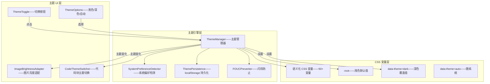

# YK-09-183: 内容深色模式 — CSS变量主题切换、系统偏好检测、切换按钮、图片亮度适配、代码块适配

> 需求编号：YK-09-183 · 优先级：P2 · 人天：0.3d · 状态：需求已编写
> 依赖：YK-09-26（主题系统与暗色模式——本需求复用主题基础设施，针对知识文章场景全面增强）

## 背景

### 问题陈述

YiKnowledge 知识库当前仅支持浅色模式（白底黑字）——在夜间或低光环境下长时间阅读时：

1. **眼部疲劳**：白色背景在暗环境中刺眼——长时间阅读导致眼部疲劳和不适
2. **用户偏好被忽略**：操作系统已设置深色模式——但知识库始终浅色——与系统体验不一致——突兀
3. **代码块对比度不足**：浅色模式下代码块是浅灰背景——切换到深色后代码高亮配色不适配——部分语法颜色在深色背景上不可见
4. **图片亮度不协调**：文章中的截图/图表在浅色模式下正常——切换到深色后——亮色图片刺眼——打破视觉一致性
5. **无法手动切换**：用户可能想在白天用深色——但目前没有切换按钮——完全无法控制

**核心矛盾**：同一篇文章在不同光照环境下应有不同的视觉呈现——浅色模式适合白天阅读——深色模式适合夜间阅读——但当前仅支持浅色——所有用户被迫接受同一视觉体验——忽略个体偏好和环境差异。

### 影响范围

| # | 影响 | 严重程度 | 典型场景 |
|---|------|----------|----------|
| 1 | 夜间阅读不适 | 高 | 晚上 11 点阅读技术文档——白色背景刺眼——眼疲劳 |
| 2 | 系统主题不一致 | 中 | 操作系统深色——切换到浏览器——知识库白色——体验断裂 |
| 3 | 代码块不可读 | 中 | 深色模式下——浅色主题的代码高亮——黄色/浅色关键字在深色背景消失 |
| 4 | 图片亮度突兀 | 中 | 深色模式文章中嵌入白色截图——亮度过高——刺眼 |
| 5 | 无法手动选择 | 低 | 白天也想用深色——但没得选——被迫浅色 |

### 挑战

| 挑战 | 说明 |
|------|------|
| CSS 变量系统设计 | 定义完整的深色/浅色变量——覆盖背景/文字/边框/阴影/链接/代码/表格等所有视觉元素 |
| 主题切换闪烁 | 页面加载时默认主题→检测偏好→应用深色——如果 JS 执行晚——会有白色闪烁(FOUC) |
| 代码块适配 | highlight.js 在深色模式下需要切换主题——浅色使用 github 主题——深色使用 github-dark 主题 |
| 图片亮度适配 | 截图/图表在深色背景下——需要适度降低亮度或添加暗色遮罩——避免视觉突兀 |
| 持久化偏好 | 用户手动选择的主题需要持久化——localStorage 存储——跨会话保留 |

---

## 一、现状分析

### 1.1 当前主题能力

```
YiKnowledge 主题现状:
├── 基础主题系统 (YK-09-26)
│   ├── CSS 变量定义——部分颜色变量 ✅
│   └── 限制: 仅浅色——无深色变量——无切换机制
├── 代码高亮
│   ├── highlight.js——浅色 github 主题 ✅
│   └── 限制: 无深色主题——单主题硬编码
├── 系统偏好
│   ├── 无 prefers-color-scheme 检测 ❌
│   └── 限制: 完全忽略操作系统设置

缺失:
├── 完整 CSS 变量——深色/浅色双主题——覆盖所有视觉元素             # ❌ 无
├── 深色模式样式——背景/文字/边框/阴影/卡片/表单——全局适配         # ❌ 无
├── prefers-color-scheme 自动检测——跟随系统                        # ❌ 无
├── 主题切换按钮——日间/夜间/自动——三种模式                         # ❌ 无
├── 图片亮度适配——深色模式下图片亮度降低——CSS filter               # ❌ 无
├── 代码块主题切换——浅色 github/深色 github-dark——动态加载         # ❌ 无
├── 主题持久化——localStorage——跨会话                               # ❌ 无
├── FOUC 防止——内联 script——渲染前设置主题类名                      # ❌ 无
└── 过渡动画——主题切换时平滑过渡——非突兀切换                         # ❌ 无
```

### 1.2 主题切换流程

```mermaid
graph TD
    A[页面加载] --> B{localStorage 有主题设置?}
    B -->|有| C[使用保存的主题]
    B -->|无| D{系统 prefers-color-scheme?}
    D -->|dark| E[应用深色模式]
    D -->|light 或无| F[应用浅色模式]

    C --> G[设置 html[data-theme]]
    E --> G
    F --> G

    G --> H[CSS 变量生效——渲染对应主题]
    H --> I[加载对应代码高亮主题]

    I --> J[用户手动切换主题]
    J --> K[更新 html[data-theme]]
    K --> L[保存到 localStorage]
    L --> H
```

### 1.3 根因矩阵

| 症状 | 根因 | 触发条件 | 频率 |
|------|------|----------|------|
| 夜间刺眼 | 无深色模式——始终白底 | 低光环境阅读 | 高 |
| 系统体验断裂 | 未响应 prefers-color-scheme | 系统设置为深色 | 高 |
| 代码不可读 | 代码高亮主题未适配 | 深色背景+浅色高亮 | 中 |
| 图片太亮 | 无图片亮度自动调节 | 深色模式下白色图片 | 中 |
| 主题不可选 | 无切换机制 | 用户想手动控制 | 中 |
| 页面闪烁 | JS 执行前渲染浅色——JS 后切深色 | 快速加载 | 低 |

---

## 二、设计决策

### 决策 1：CSS 变量架构 — 单一变量表 vs 双主题变量表 vs 语义化变量

| 选项 | 可维护性 | 主题扩展 | 代码量 |
|------|---------|---------|--------|
| A: 单变量表——每个颜色一个变量 | 中——变量多 | 中 | 高——需为深色重定义全部 |
| B: 双主题变量表——`:root` 浅色 + `[data-theme="dark"]` 深色 | 好——变量清晰 | 好——新增主题只需加一组变量 | 中 |
| C: 语义化变量——`--color-bg-primary` 等——主题无关 | 最好——语义清晰 | 最好——新增主题不改变量名 | 中 |

**选择：C（语义化 CSS 变量——变量名不绑定颜色——仅描述用途——`:root` 浅色默认 + `[data-theme="dark"]` 深色覆盖）。** 语义化变量使 CSS 可读性极高——`background: var(--bg-primary)` 一目了然——不关心是白色还是黑色。组件中使用语义化变量——主题切换仅需要改变 CSS 变量值——组件零改动。未来新增主题（如高对比度、sepia 护眼）只需新增一组变量。

### 决策 2：主题切换防闪烁(FOUC) — 内联脚本 vs CSS 默认 vs blocking script

| 选项 | 防闪烁效果 | 代码侵入性 | 加载影响 |
|------|-----------|-----------|---------|
| A: 内联 `<script>` 在 `<head>` 中——同步检查 localStorage | 最佳——CSS 加载前已设置 | 中——侵入 HTML | 低——几行代码 |
| B: CSS 默认深色——JS 切浅色 | 好——但默认深色用户困惑 | 低 | 无 |
| C: 外部阻塞脚本——defer/async 后的闪烁 | 差——有明显闪烁 | 低 | 中 |

**选择：A（`<head>` 内联同步脚本——在 CSS 加载前读取 localStorage 并设置 `data-theme` 属性）。** 这是业界防止主题 FOUC 的标准做法——脚本在 HTML 解析阶段同步执行——在 CSSOM 构建前完成——CSS 变量从一开始就是正确的主题。脚本仅 5 行——无外部依赖——不阻塞内容加载。无 localStorage 时检查 `prefers-color-scheme`——保证首次访问也无闪烁。

### 决策 3：代码块主题切换 — 双 CSS 加载 vs CSS 变量重写 vs highlight.js 主题切换

| 选项 | 实现复杂度 | 主题完整性 | 文件大小 |
|------|-----------|-----------|---------|
| A: 预加载两套 highlight.js 主题 CSS——切换时 toggle | 低 | 高——完整主题 | 中——两套 CSS ~10KB |
| B: 使用 CSS 变量重写代码高亮颜色——主题切换自动适配 | 高——需要重写 highlight.js 颜色规则 | 中——某些边缘颜色可能遗漏 | 低——一套 CSS |
| C: highlight.js 动态切换主题——重新高亮 | 中——需要 JS 重新调用 | 最高 | 低——按需加载 |

**选择：C（highlight.js 动态切换主题——主题切换时重新渲染代码块高亮）。** 预加载两套 CSS 最简单但浪费带宽——大多数用户只用一套主题。CSS 变量重写需要覆盖 highlight.js 的 100+ 颜色规则——容易遗漏。动态切换：浅色模式用 `github` 主题——深色模式用 `github-dark` 主题——主题切换时遍历所有 `<code>` 块调用 `hljs.highlightElement`——确保所有颜色完整正确。

### 决策 4：图片亮度适配 — CSS filter vs SVG 遮罩 vs 不处理

| 选项 | 视觉质量 | 性能 | 侵入性 |
|------|---------|------|--------|
| A: CSS filter——`brightness(0.85)` + `contrast(1.1)` | 好——适度降低亮度 | 低——GPU 加速 | 无侵入 |
| B: SVG 遮罩——叠加半透明黑色层 | 中——看起来像加了一层灰 | 低 | 需要包裹元素 |
| C: 不处理——保持原样 | 差——白色图片刺眼 | 无 | 无 |

**选择：A（CSS filter——`brightness(0.9) contrast(0.95)`——仅对内容图片——非图标/logo）。** `brightness(0.9)` 降低 10% 亮度——`contrast(0.95)` 略微降低对比度——在深色背景上使图片与周围黑暗环境协调。GPU 加速——性能零影响。不对所有图片统一处理——图标（SVG）和装饰图除外——通过 CSS 选择器精确控制：`.article-content img:not(.icon):not(.logo)`。

---

## 三、目标架构

### 3.1 主题系统架构



### 3.2 CSS 变量体系

```css
:root {
  /* 背景色 */
  --bg-primary: #ffffff;
  --bg-secondary: #f8f9fa;
  --bg-tertiary: #f0f0f0;
  --bg-card: #ffffff;
  --bg-code: #f6f8fa;
  --bg-tooltip: #333333;

  /* 文字色 */
  --text-primary: #1a1a2e;
  --text-secondary: #4a4a6a;
  --text-tertiary: #8e8ea0;
  --text-link: #0969da;
  --text-code: #1a1a2e;

  /* 边框 */
  --border-primary: #d0d7de;
  --border-secondary: #e8ecf0;

  /* 阴影 */
  --shadow-card: 0 1px 3px rgba(0,0,0,0.08);
  --shadow-dropdown: 0 4px 12px rgba(0,0,0,0.12);

  /* 强调色 */
  --accent-primary: #0969da;
  --accent-success: #1a7f37;
  --accent-warning: #9a6700;
  --accent-danger: #cf222e;
}

[data-theme="dark"] {
  --bg-primary: #0d1117;
  --bg-secondary: #161b22;
  --bg-tertiary: #21262d;
  --bg-card: #161b22;
  --bg-code: #1a1e26;
  --bg-tooltip: #6e7681;

  --text-primary: #e6edf3;
  --text-secondary: #8b949e;
  --text-tertiary: #6e7681;
  --text-link: #58a6ff;
  --text-code: #e6edf3;

  --border-primary: #30363d;
  --border-secondary: #21262d;

  --shadow-card: 0 1px 3px rgba(0,0,0,0.3);
  --shadow-dropdown: 0 4px 12px rgba(0,0,0,0.4);

  --accent-primary: #58a6ff;
  --accent-success: #3fb950;
  --accent-warning: #d29922;
  --accent-danger: #f85149;
}
```

---

## 四、具体改动

### 4.1 核心代码：主题管理器

```typescript
// src/composables/useThemeManager.ts

type Theme = 'light' | 'dark' | 'auto';

interface ThemeState {
  current: Theme;
  effective: 'light' | 'dark'; // auto 模式下的实际生效主题
}

class ThemeManager {
  private static STORAGE_KEY = 'yiknowledge-theme';
  private mql: MediaQueryList | null = null;

  state: ThemeState = reactive({
    current: 'auto',
    effective: 'light',
  });

  /** 初始化主题——页面加载时调用 */
  init(): void {
    const saved = localStorage.getItem(ThemeManager.STORAGE_KEY) as Theme | null;
    const theme = saved || 'auto';
    this.state.current = theme;
    this.state.effective = theme === 'auto' ? this.getSystemPreference() : theme;
    this.applyTheme(this.state.effective);

    // 监听系统主题变化（auto 模式）
    this.mql = window.matchMedia('(prefers-color-scheme: dark)');
    this.mql.addEventListener('change', (e) => {
      if (this.state.current === 'auto') {
        this.state.effective = e.matches ? 'dark' : 'light';
        this.applyTheme(this.state.effective);
      }
    });
  }

  /** 切换主题 */
  setTheme(theme: Theme): void {
    this.state.current = theme;
    this.state.effective = theme === 'auto' ? this.getSystemPreference() : theme;
    this.applyTheme(this.state.effective);
    localStorage.setItem(ThemeManager.STORAGE_KEY, theme);
  }

  /** 切换——light/dark 循环 */
  toggle(): void {
    const next = this.state.effective === 'dark' ? 'light' : 'dark';
    this.setTheme(next);
  }

  /** 应用主题到 DOM */
  private applyTheme(theme: 'light' | 'dark'): void {
    document.documentElement.setAttribute('data-theme', theme);

    // 适配图片亮度
    this.adaptImages(theme);

    // 切换代码高亮主题
    this.switchCodeTheme(theme);

    // 更新 meta theme-color（移动端浏览器主题色）
    const meta = document.querySelector('meta[name="theme-color"]');
    if (meta) {
      meta.setAttribute('content', theme === 'dark' ? '#0d1117' : '#ffffff');
    }
  }

  /** 图片亮度适配 */
  private adaptImages(theme: 'light' | 'dark'): void {
    const images = document.querySelectorAll('.article-content img:not(.icon):not(.logo):not(.emoji)');
    images.forEach((img) => {
      if (theme === 'dark') {
        (img as HTMLElement).style.filter = 'brightness(0.9) contrast(0.95)';
      } else {
        (img as HTMLElement).style.filter = '';
      }
    });
  }

  /** 代码块主题切换 */
  private switchCodeTheme(theme: 'light' | 'dark'): void {
    const linkId = 'hljs-theme';
    let link = document.getElementById(linkId) as HTMLLinkElement;

    if (!link) {
      link = document.createElement('link');
      link.id = linkId;
      link.rel = 'stylesheet';
      document.head.appendChild(link);
    }

    link.href = theme === 'dark'
      ? 'https://cdnjs.cloudflare.com/ajax/libs/highlight.js/11.9.0/styles/github-dark.min.css'
      : 'https://cdnjs.cloudflare.com/ajax/libs/highlight.js/11.9.0/styles/github.min.css';
  }

  private getSystemPreference(): 'light' | 'dark' {
    return window.matchMedia('(prefers-color-scheme: dark)').matches ? 'dark' : 'light';
  }
}

export const themeManager = new ThemeManager();
```

### 4.2 防闪烁内联脚本

```html
<!-- public/index.html <head> 中 -->
<script>
  (function() {
    var theme = localStorage.getItem('yiknowledge-theme');
    if (!theme || theme === 'auto') {
      theme = window.matchMedia('(prefers-color-scheme: dark)').matches ? 'dark' : 'light';
    }
    document.documentElement.setAttribute('data-theme', theme);
  })();
</script>
```

### 4.3 文件变更清单

| 文件 | 操作 | 说明 |
|------|------|------|
| `src/assets/styles/theme-variables.css` | 新增 | 语义化 CSS 变量——浅色默认+深色覆盖——50+ 变量 |
| `src/assets/styles/theme-components.css` | 新增 | 组件级主题样式——使用变量——卡片/按钮/表格/表单/弹窗 |
| `src/composables/useThemeManager.ts` | 新增 | 主题管理器——切换/持久化/图片适配/代码主题 |
| `src/components/Theme/ThemeToggle.vue` | 新增 | 主题切换按钮——日间/夜间/自动图标+下拉菜单 |
| `public/index.html` | 修改 | 注入防闪烁内联脚本——meta theme-color |
| `src/assets/styles/highlight-theme.css` | 删除 | 移除硬编码的 github 主题——改为动态加载 |

---

## 五、实施步骤

| 步骤 | 操作 | 路径 | 验证 | 人天 |
|------|------|------|------|------|
| 1 | 定义 CSS 变量系统 | `src/assets/styles/theme-variables.css` | 50+ 语义化变量——浅色+深色——覆盖所有视觉元素 | 0.06 |
| 2 | 实现 ThemeManager | `src/composables/useThemeManager.ts` | 初始化/切换/持久化/系统检测/图片适配/代码切换 | 0.08 |
| 3 | 实现主题 UI 组件 | `src/components/Theme/ThemeToggle.vue` | 切换按钮+下拉菜单——三种模式 | 0.04 |
| 4 | 迁移现有样式使用变量 | 全局 CSS 替换 | 将硬编码颜色替换为 var(--xxx) | 0.06 |
| 5 | 添加防闪烁脚本+meta | `public/index.html` | 内联脚本——theme-color meta | 0.03 |
| 6 | 代码高亮主题动态加载 | ThemeManager.switchCodeTheme | 动态 href 切换——深色 github-dark | 0.03 |

**总人天：0.3d**

---

## 六、测试规格

### 测试 1：系统偏好自动检测——首次访问

| 项目 | 内容 |
|------|------|
| 优先级 | P0 |
| 前置条件 | 清空 localStorage——系统设置为深色模式 |
| 测试步骤 | 1. 访问知识文章 2. 观察页面主题 3. 检查 data-theme 属性 |
| 预期结果 | 页面自动应用深色模式——`html[data-theme="dark"]`——背景为深色——文字为浅色——无白色闪烁 |

### 测试 2：主题切换按钮——三种模式循环

| 项目 | 内容 |
|------|------|
| 优先级 | P0 |
| 前置条件 | 文章详情页 |
| 测试步骤 | 1. 点击主题切换按钮 2. 选择"深色" 3. 刷新页面 4. 再次点击——选择"自动" 5. 切换系统主题 |
| 预期结果 | 深色模式正常应用——刷新后保持深色（从 localStorage 恢复）——自动模式跟随系统——切换系统主题后页面自动切换——按钮图标正确反映当前模式 |

### 测试 3：图片亮度适配——深色模式下图片降低亮度

| 项目 | 内容 |
|------|------|
| 优先级 | P1 |
| 前置条件 | 文章包含白色背景截图——已切换到深色模式 |
| 测试步骤 | 1. 切换到深色模式 2. 观察文章中的截图 3. 测量图片 filter 属性 |
| 预期结果 | 截图应用 `brightness(0.9) contrast(0.95)`——视觉上不过于刺眼——与深色背景协调——SVG 图标和 logo 不受影响——切回浅色模式后 filter 清除 |

### 测试 4：代码块主题适配——深色代码高亮

| 项目 | 内容 |
|------|------|
| 优先级 | P0 |
| 前置条件 | 文章包含 Python/TypeScript/JSON 代码块 |
| 测试步骤 | 1. 浅色模式——观察代码块 2. 切换到深色模式 3. 再次观察代码块 |
| 预期结果 | 浅色模式——github 主题白底代码块——深色模式——github-dark 主题暗底代码块——语法高亮颜色正确（关键字/字符串/注释/函数名）——所有语言适配——切换无闪烁 |

### 测试 5：主题持久化——跨会话

| 项目 | 内容 |
|------|------|
| 优先级 | P0 |
| 前置条件 | 手动设置主题为深色 |
| 测试步骤 | 1. 设置深色模式 2. 关闭标签页 3. 重新打开文章（新会话） 4. 检查主题 5. 检查 localStorage |
| 预期结果 | 重新打开仍为深色模式——localStorage 中 `yiknowledge-theme = "dark"`——无白色闪烁（内联脚本在 CSS 加载前读取 localStorage） |

### 测试 6：过渡动画——平滑切换

| 项目 | 内容 |
|------|------|
| 优先级 | P2 |
| 前置条件 | 已定义 transition 属性 |
| 测试步骤 | 1. 点击切换按钮——从浅色切到深色 2. 观察切换动画 |
| 预期结果 | 颜色变化在 300ms 内平滑过渡——非跳变——transition 应用于 `background-color`/`color`/`border-color`——body 上定义 `transition: background-color 0.3s ease, color 0.3s ease` |

---

## 七、风险与缓解

| 风险 | 概率 | 影响 | 缓解措施 |
|------|------|------|------|
| CSS 变量覆盖不完整——部分元素仍显示默认颜色 | 中 | 中 | 使用 CSS 审计工具检查——确保所有颜色使用 var()——border/box-shadow/outline 也需要变量化 |
| 代码高亮主题 CDN 加载失败——深色模式下代码不可读 | 低 | 高 | 预置 fallback——加载失败时使用内联深色代码样式——检测 link onerror 事件——降级方案 |
| 图片 filter 降低可读性——图表文字变模糊 | 低 | 中 | filter 仅降低 10% 亮度——保持可读性——diagram/chart 类图片不应用 filter |
| 防闪烁脚本在 CSP 严格模式下被阻止 | 低 | 中 | 内联脚本使用 hash nonce——或使用 CSP 'unsafe-inline'（仅此脚本）——经过安全审查 |
| 深色模式下表格斑马纹不清晰 | 低 | 低 | 深色模式下斑马纹颜色差异加大——使用透明度而非固定颜色——rgba(255,255,255,0.04) 交替 |

---

## 八、回滚策略

1. **功能级回滚**：强制设置 `data-theme="light"`——禁用主题切换——所有页面恢复浅色
2. **代码级回滚**：移除 ThemeToggle 组件 + ThemeManager——移除内联脚本——恢复硬编码颜色
3. **样式级回滚**：移除 `theme-variables.css` 和 `[data-theme="dark"]` 规则——恢复原始颜色
4. **回滚验证**：页面正常渲染浅色——无 CSS 变量依赖残留——无 FOUC——代码高亮正常

---

## 九、设计决策记录

### D-01：语义化 CSS 变量——变量名描述用途而非颜色

**上下文**：CSS 变量命名选择——颜色名 vs 用途名。

**决策**：使用语义化名称——`--bg-primary` 而非 `--color-white`——`--text-secondary` 而非 `--color-gray-600`。

**理由**：语义化命名使 CSS 自文档化——`background: var(--bg-primary)` 明确表达"这是主要背景色"——而非"这是白色"（深色模式下实际是深灰）。主题切换只需改变变量值——语义不变。新增主题（如 sepia 护眼模式）只需添加一组变量——组件无需修改。

### D-02：内联脚本防 FOUC——渲染前执行

**上下文**：主题切换时的白色闪烁问题。

**决策**：`<head>` 中内联同步脚本——在 CSS 加载前读取 localStorage 并设置 `data-theme`。

**理由**：这是业界标准做法（GitHub、Tailwind CSS docs、Vue 官方文档都用此方案）。脚本在 HTML 解析阶段同步执行——比外部 CSS 更早——CSSOM 构建时已经看到正确的 `data-theme` 属性——从一开始就应用正确的变量值。脚本仅读取 localStorage 和设置属性——无外部依赖——无阻塞内容渲染的性能影响。

### D-03：highlight.js 动态主题切换——非双 CSS 预加载

**上下文**：代码块在深色/浅色模式下需要不同的语法高亮主题。

**决策**：动态切换 highlight.js 主题 CSS——浅色 `github`——深色 `github-dark`。

**理由**：预加载两套 CSS 浪费带宽——每个用户只需要一套。动态加载在主题切换时触发——首次加载一个主题——切换时异步加载另一个——link 元素动态替换 href——有缓存机制——二次切换不需要重新加载。不使用 CSS 变量重写——避免维护 100+ 条颜色覆盖规则。

### D-04：图片 brightness filter——非不处理

**上下文**：深色模式下图片亮度适配。

**决策**：对内容图片应用 `brightness(0.9) contrast(0.95)` CSS filter——排除图标和 logo。

**理由**：不处理会导致白色截图在深色背景下极为刺眼——破坏视觉一致性。`brightness(0.9)` 仅降低 10% 亮度——足够协调而不影响可读性。`contrast(0.95)` 微调对比度——在深色背景上更自然。排除图标（SVG 通常已有自己的颜色）和 logo——避免主题图标变暗。

---

## 十、可观测性

| 指标 | 采集方式 | 阈值 |
|------|----------|------|
| 主题分布 | localStorage yiknowledge-theme 值统计 | — |
| 手动切换次数 | ThemeToggle click 事件计数 | — |
| 自动模式使用率 | auto 选择率 / 总选择 | — |
| 深色模式使用率 | dark 选择率 / 总选择 | — |
| 代码主题加载失败率 | link onerror 事件计数 | < 1% |
| FOUC 发生率 | 无直接检测——用户反馈通道 | — |
| 图片 filter 适配数量 | adaptImages 处理的图片数 | — |

---

## 十一、代码审查检查清单

- [ ] CSS 变量——所有颜色相关属性使用 var()——无硬编码颜色值
- [ ] `theme-variables.css`——`:root` 和 `[data-theme="dark"]` 变量一一对应——不遗漏
- [ ] `ThemeManager.init`——防闪烁脚本已设置 data-theme——init 不重复设置——仅同步 state
- [ ] `ThemeManager.setTheme`——localStorage.setItem 使用 try-catch——配额满时不崩溃
- [ ] `ThemeManager.toggle`——从 auto 模式 toggle——切换为明确的 dark/light——非循环
- [ ] `ThemeManager.adaptImages`——使用 CSS filter——不修改图片 src——不永久改变图片
- [ ] `ThemeManager.switchCodeTheme`——link 元素不存在时创建——存在时修改 href——不重复创建
- [ ] 内联脚本——读取 localStorage——无 localStorage 时检查 matchMedia——不抛异常
- [ ] `meta[name="theme-color"]`——页面存在该 meta 时更新——不存在时创建
- [ ] 过渡动画——仅在用户手动切换时应用——页面首次加载不应用（避免加载动画）
- [ ] 图片 filter——排除 `.icon` `.logo` `.emoji` 类——仅影响内容图片
- [ ] TypeScript——Theme 类型——'light' | 'dark' | 'auto'——switch 穷举

---

## 回归问题预测

| # | 预测问题 | 触发条件 | 检测方式 |
|---|----------|----------|----------|
| 1 | 深色模式下某些第三方组件（嵌入的内容）不响应 CSS 变量——显示浅色 | 内嵌的 iframe/SVG/Web Component 使用硬编码颜色——不受父页面 CSS 变量影响 | 嵌入内容白名单——逐一检查——无法控制的嵌入内容（如外部 iframe）在深色模式下添加遮罩或边框提示 |
| 2 | 代码高亮主题 CDN 切换时——旧主题未完全移除——两种样式混合 | link href 更新——但浏览器可能还缓存旧 CSS——两个主题的规则同时存在 | 切换时先移除旧 link 元素——创建新 link——或修改 href 属性强制加载——确保只有一个主题激活 |
| 3 | prefers-color-scheme 媒体查询在 CSS 和 JS 中重复定义——不一致 | CSS 中 `@media (prefers-color-scheme: dark)` 与 JS `matchMedia` 同时存在——可能冲突 | 统一使用 JS 控制——CSS 不直接使用 @media 查询——仅通过 data-theme 属性控制——JS 为单一数据源 |
| 4 | 图片 filter 在深色模式下叠加——多次切换后 filter 累加 | 每次切换都调用 adaptImages——filter 字符串可能被拼接——如两次 `brightness(0.9)` | 设置 filter 前先清除——直接赋值而非追加——`element.style.filter = 'brightness(0.9) contrast(0.95)'` |
| 5 | 深色模式下表单元素（input/select/textarea）使用浏览器默认样式——未适配 | input 默认白色背景——深色模式下突兀 | CSS 变量覆盖表单元素——`input { background: var(--bg-secondary); color: var(--text-primary); border-color: var(--border-primary); }` |
| 6 | 打印时深色模式样式被错误应用——打印出深色背景+白色文字 | 用户在深色模式下 Ctrl+P——@media print 没有重置主题为浅色 | print.css 中显式设置 `[data-theme="dark"]` 的打印覆盖——打印时强制浅色——或添加 `@media print { html { color-scheme: light; } }` |

---

## 性能分析

| 操作 | 数据量 | 耗时 | 说明 |
|------|--------|------|------|
| 防闪烁脚本 | — | < 0.01ms | 5 行同步 JS——零网络请求 |
| CSS 变量解析 | 50+ 变量 | < 1ms | 浏览器原生——CSSOM 构建时解析 |
| 主题切换（CSS 变量） | — | < 5ms | 变量重新计算——不触发 layout——仅 repaint |
| 代码主题切换（CDN 加载） | ~5KB CSS | < 100ms | CDN 加载——有缓存——非首次 < 10ms |
| 图片亮度适配 | 20 张图片 | < 5ms | querySelectorAll + style 赋值——同步 |
| 过渡动画 | — | 300ms | CSS transition——GPU 加速——不阻塞 JS |

---

## 相关文档

- [主题系统与暗色模式](../26-需求-主题系统与暗色模式.md) — 早期主题实现——本需求全面增强
- [内容打印样式](../182-需求-内容打印样式.md) — 打印始终浅色——深色模式不应用于打印
- [内容字体设置](../184-需求-内容字体设置.md) — 字体设置与主题协同——深色/浅色不同字体偏好
- [自定义主题编辑器](../138-需求-自定义主题编辑器.md) — 未来可扩展为自定义主题编辑

*PRD 来源: `projects/yiknowledge/requirements/2026-09/183-需求-内容深色模式.md`*