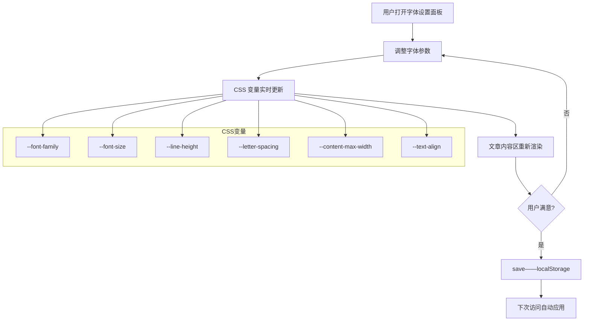
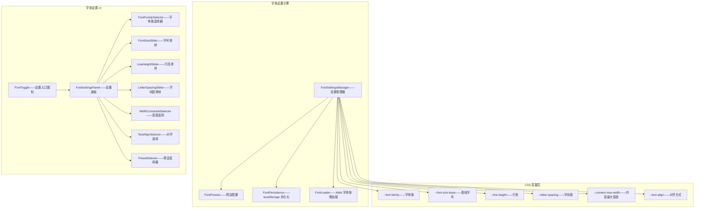

# YK-09-184: 内容字体设置 — 字体族/字号/行高/字间距、宽度约束、对齐方式、阅读障碍友好字体、设置持久化

> 需求编号：YK-09-184 · 优先级：P2 · 人天：0.3d · 状态：需求已编写
> 依赖：YK-09-96（内容可读性评分与优化——本需求从可读性优化角度提供字体层面的控制）、YK-09-138（内容辅助功能面板——字体设置是辅助功能面板的重要组成部分）

## 背景

### 问题陈述

YiKnowledge 知识库文章使用固定的字体设置——所有用户看到相同的字体大小、行距和字间距。但不同用户的视觉需求和阅读偏好差异巨大：

1. **老年/视力不佳用户**：默认 16px 字号太小——需要放大到 20px+ 才能舒适阅读——但页面缺乏字体调整功能——只能通过浏览器缩放——但缩放影响布局
2. **阅读障碍用户**：标准字体（如系统默认宋体/Helvetica）对阅读障碍用户不友好——字母容易混淆（b/d/p/q）——需要特殊的阅读障碍友好字体（如 OpenDyslexic）
3. **长文阅读舒适度差**：行高和字间距对长文阅读体验影响巨大——默认 1.5 行高在手机上好——但在大屏上显得稀疏——用户有不同偏好
4. **宽度过宽难以聚焦**：全宽文本在大屏上每行 150+ 字符——眼睛横向扫描距离过长——容易串行——理想的阅读宽度是 65-75 字符/行
5. **字体族偏好**：有人喜欢无衬线体（阅读更快）——有人喜欢衬线体（长时间阅读更舒适）——有人需要等宽字体辅助技术阅读

**核心矛盾**：阅读是非常个人化的体验——不同用户的视觉条件和阅读习惯要求不同的字体设置——但当前固定字体无法满足多样化的需求。目标是提供可调节的字体设置面板——允许用户自定义字体族、字号、行高、字间距、宽度约束、对齐方式——设置持久化到 localStorage。

### 影响范围

| # | 影响 | 严重程度 | 典型场景 |
|---|------|----------|----------|
| 1 | 视力不佳用户无法阅读 | 高 | 50 岁以上用户——16px 字号模糊——无法舒适阅读 |
| 2 | 阅读障碍用户排斥 | 中 | 阅读障碍者——标准字体字母混淆——阅读速度极慢 |
| 3 | 长文阅读疲劳 | 高 | 阅读 30 分钟技术文档——眼睛酸痛——需要调整行距和字间距 |
| 4 | 宽屏阅读串行 | 中 | 27 寸显示器——一行 200 字符——视线跟踪困难——频繁串行 |
| 5 | 字体偏好被忽略 | 中 | 喜欢衬线体——但页面是无衬线——阅读体验不佳 |

### 挑战

| 挑战 | 说明 |
|------|------|
| CSS 变量化字体属性 | 将字体族/字号/行高/字间距从硬编码迁移到 CSS 变量——响应式调整 |
| 阅读障碍字体加载 | OpenDyslexic 字体文件 ~200KB——按需加载——不增加首屏加载——不阻塞渲染 |
| 设置面板 UI | 提供直观的字体调整控件——字号滑块/字体族下拉/行高滑块/字间距滑块——所见即所得 |
| 与深色模式协同 | 不同主题下——字体设置可能有不同的默认值——协同工作而不冲突 |
| 移动端适配 | 手机上字体设置面板的布局——控件适合手指操作——不遮挡阅读内容 |
| 性能 | CSS 变量变化触发 repaint——避免频繁 layout——使用 `will-change` 或 `contain` 优化 |

---

## 一、现状分析

### 1.1 当前字体设置

```
YiKnowledge 字体设置现状:
├── 全局字体
│   ├── font-family: 系统默认——(-apple-system, sans-serif) ✅
│   └── 限制: 单一字体族——用户无法切换——阅读障碍用户无特殊字体
├── 字号
│   ├── 基础 16px ✅
│   └── 限制: 固定大小——浏览器缩放影响全局布局——非仅文本
├── 行高/字间距
│   ├── line-height: 1.6——letter-spacing: 0 ✅
│   └── 限制: 固定——长文阅读可能需要更大行高——密集文字需要字间距
├── 内容宽度
│   ├── max-width: 800px ✅
│   └── 限制: 固定——大屏浪费空间——但用户无法调整
├── 可读性 (YK-09-96)
│   ├── 内容可读性评分——分析文字难度 ✅
│   └── 限制: 分析但不优化——评分后无字体层面的改进建议

缺失:
├── 字体族选择: 无衬线/衬线/等宽/阅读障碍友好——下拉选择                     # ❌ 无
├── 字号调节: 12px-24px 滑块——实时预览——非浏览器缩放                          # ❌ 无
├── 行高调节: 1.2-2.0 滑块——紧凑/舒适/宽松                                    # ❌ 无
├── 字间距调节: -0.5px-2px 滑块——密集/标准/宽松                                # ❌ 无
├── 宽度约束: 窄(600px)/标准(800px)/宽(1000px)/全宽                             # ❌ 无
├── 对齐方式: 左对齐/两端对齐                                                    # ❌ 无
├── 阅读障碍友好字体: OpenDyslexic——按需加载                                    # ❌ 无
├── 设置持久化: localStorage——跨会话跨文章                                      # ❌ 无
├── 预览模式: 设置面板旁实时预览——所见即所得                                     # ❌ 无
└── 重置按钮: 一键还原默认设置                                                  # ❌ 无
```

### 1.2 字体设置影响范围



### 1.3 根因矩阵

| 症状 | 根因 | 触发条件 | 频率 |
|------|------|----------|------|
| 视力不佳阅读困难 | 字号固定——无放大选项 | 视力 0.5 以下用户 | 中 |
| 阅读障碍体验差 | 无阅读障碍友好字体 | 阅读障碍用户 5-10% 人口 | 中 |
| 长文阅读疲劳 | 行高/字间距不可调 | 阅读 20min+ 技术文档 | 高 |
| 宽屏串行 | 宽度约束固定 | 27"+ 显示器 | 中 |
| 字体偏好不满足 | 无字体族选择 | 个人偏好差异 | 中 |

---

## 二、设计决策

### 决策 1：字体设置应用范围 — 仅文章内容 vs 全局 vs 可配置

| 选项 | 影响范围 | 风险 | 实现复杂度 |
|------|---------|------|-----------|
| A: 仅文章内容区 (`.article-content`) | 限定——不影响 UI | 低——侧边栏导航保持原样 | 低 |
| B: 全局 (body/html) | 整个页面——包括 UI | 中——可能破坏导航/按钮布局 | 中 |
| C: 可配置——内容区默认——可选全局 | 灵活 | 中 | 中 |

**选择：A（仅文章内容区）。** 字体设置的目标是优化阅读体验——非改变应用 UI。文章内容区的字体调整不应影响侧边栏、导航栏、工具栏——这些 UI 元素的字体保持设计一致性。CSS 变量作用域限定在 `.article-content` 内——不泄露到全局——干净隔离。

### 决策 2：字体族选择范围 — 仅系统字体 vs 包含 Web 字体 vs 混合

| 选项 | 加载速度 | 字体丰富度 | 文件大小 |
|------|---------|-----------|---------|
| A: 仅系统字体——`system-ui`, `serif`, `monospace` | 最快——零加载 | 有限——3 种 | 0 |
| B: 包含 Web 字体——Google Fonts 等 | 慢——需要下载 | 丰富——数十种 | 大——每种 100-400KB |
| C: 混合——系统字体 + 阅读障碍字体（按需） | 快——仅阅读障碍 Web 字体 | 够用——5-6 种 | 极小——0-200KB |

**选择：C（混合——4 种系统字体族 + OpenDyslexic 按需加载）。** 预置 4 种字体族：`sans-serif`（系统默认无衬线）、`serif`（系统衬线）、`monospace`（等宽）、`dyslexia-friendly`（阅读障碍友好——OpenDyslexic）。系统字体不需要下载——零额外加载。OpenDyslexic 字体仅在选择时动态加载——约 200KB——使用 `font-display: swap` 确保文本在字体加载期间可见。不引入 Google Fonts——避免外部依赖和隐私问题。

### 决策 3：设置面板 UI — 弹窗 vs 侧边栏 vs 浮动面板

| 选项 | 空间利用 | 预览方便性 | 移动端适配 |
|------|---------|-----------|-----------|
| A: 弹窗——Modal 居中 | 遮挡内容——不便预览 | 差——看不到完整文章 | 中 |
| B: 侧边栏——右侧固定面板 | 挤压内容区 | 好——内容在左侧实时预览 | 差——小屏幕太窄 |
| C: 浮动面板——右下角可拖拽+展开 | 不挤压内容 | 最好——面板+内容同时可见 | 好——移到顶部或底部 |

**选择：C（右下角浮动面板——图标触发——展开为侧拉面板——内容区可见——所见即所得）。** 弹窗遮挡内容——用户调整参数后需要关闭弹窗才能看到效果——往返操作繁琐。固定侧边栏在手机上不可行——挤压内容区。浮动面板从右下角展开——内容区同时可见——滑块调整实时预览——类似 YouTube 播放器设置或 Google Docs 工具面板。移动端面板自适应为底部抽屉。

### 决策 4：字号调节方式 — 百分比缩放 vs 绝对 px vs rem 调整

| 选项 | 精度 | 与布局关系 | 实现 |
|------|------|-----------|------|
| A: 百分比——100%/125%/150% | 粗糙——跳跃大 | 基于默认——不涉及单位换算 | 低 |
| B: 绝对 px——12px-24px 1px 步进 | 精确——1px 步进 | 忽略其他元素的相对大小 | 中 |
| C: rem 调整——改变根字号——内容区 rem 基于此 | 精确——全局响应 | 影响所有使用 rem 的元素 | 中 |

**选择：C（rem 调整——通过 CSS 变量 `--font-size-base` 控制内容区字号——所有子元素使用 rem）。** 百分比缩放精度不够——25% 一跳（16px→20px）——中间值无法表示。绝对 px 忽略了 h1-h6 的字号比例关系——如果 base 改为 18px——标题应该按比例放大。rem 调整：修改 `--font-size-base` 变量——内容区所有 rem 单位自动按比例缩放——标题/段落/代码/引用保持正确的尺寸关系。变量范围 12px-24px——1px 步进——滑块精度和范围兼顾。

---

## 三、目标架构

### 3.1 字体设置系统架构



### 3.2 字体设置预设

```typescript
const FONT_PRESETS = {
  default: {
    fontFamily: 'sans-serif',
    fontSize: 16,
    lineHeight: 1.6,
    letterSpacing: 0,
    maxWidth: 800,
    textAlign: 'left',
    label: '默认设置',
  },
  comfortable: {
    fontFamily: 'sans-serif',
    fontSize: 18,
    lineHeight: 1.8,
    letterSpacing: 0.3,
    maxWidth: 750,
    textAlign: 'left',
    label: '舒适阅读',
  },
  compact: {
    fontFamily: 'sans-serif',
    fontSize: 14,
    lineHeight: 1.4,
    letterSpacing: -0.2,
    maxWidth: 900,
    textAlign: 'justify',
    label: '紧凑模式',
  },
  dyslexia: {
    fontFamily: 'dyslexia-friendly',
    fontSize: 18,
    lineHeight: 2.0,
    letterSpacing: 1.5,
    maxWidth: 700,
    textAlign: 'left',
    label: '阅读障碍友好',
  },
  serif: {
    fontFamily: 'serif',
    fontSize: 17,
    lineHeight: 1.7,
    letterSpacing: 0.2,
    maxWidth: 750,
    textAlign: 'justify',
    label: '经典衬线',
  },
};
```

---

## 四、具体改动

### 4.1 核心代码：字体设置管理器

```typescript
// src/composables/useFontSettings.ts

interface FontSettings {
  fontFamily: 'sans-serif' | 'serif' | 'monospace' | 'dyslexia-friendly';
  fontSize: number; // 12-24
  lineHeight: number; // 1.2-2.0
  letterSpacing: number; // -0.5-2.0 (px)
  maxWidth: 600 | 700 | 800 | 1000 | 0; // 0 = 全宽
  textAlign: 'left' | 'justify';
}

const DEFAULTS: FontSettings = {
  fontFamily: 'sans-serif',
  fontSize: 16,
  lineHeight: 1.6,
  letterSpacing: 0,
  maxWidth: 800,
  textAlign: 'left',
};

class FontSettingsManager {
  private static STORAGE_KEY = 'yiknowledge-font-settings';
  private dyslexiaFontLoaded = false;

  settings: FontSettings;

  constructor() {
    this.settings = this.load();
  }

  /** 加载设置 */
  load(): FontSettings {
    try {
      const saved = localStorage.getItem(FontSettingsManager.STORAGE_KEY);
      if (saved) return { ...DEFAULTS, ...JSON.parse(saved) };
    } catch {}
    return { ...DEFAULTS };
  }

  /** 保存设置 */
  save(): void {
    localStorage.setItem(FontSettingsManager.STORAGE_KEY, JSON.stringify(this.settings));
  }

  /** 更新单个设置 */
  update<K extends keyof FontSettings>(key: K, value: FontSettings[K]): void {
    this.settings[key] = value;

    if (key === 'fontFamily' && value === 'dyslexia-friendly') {
      this.loadDyslexiaFont();
    }

    this.applyToDOM();
    this.save();
  }

  /** 应用设置到 DOM */
  applyToDOM(): void {
    const { fontFamily, fontSize, lineHeight, letterSpacing, maxWidth, textAlign } = this.settings;
    const root = document.documentElement;
    const content = document.querySelector('.article-content') as HTMLElement;

    if (content) {
      content.style.setProperty('--font-family', this.getFontFamilyCSS(fontFamily));
      content.style.setProperty('--font-size-base', `${fontSize}px`);
      content.style.setProperty('--line-height', String(lineHeight));
      content.style.setProperty('--letter-spacing', `${letterSpacing}px`);
      content.style.setProperty('--content-max-width', maxWidth === 0 ? 'none' : `${maxWidth}px`);
      content.style.setProperty('--text-align', textAlign);
    }
  }

  /** 获取字体族 CSS 值 */
  private getFontFamilyCSS(family: FontSettings['fontFamily']): string {
    switch (family) {
      case 'sans-serif':
        return '-apple-system, BlinkMacSystemFont, "Segoe UI", Roboto, sans-serif';
      case 'serif':
        return 'Georgia, "Times New Roman", "Songti SC", serif';
      case 'monospace':
        return '"SF Mono", "Fira Code", "Fira Mono", "Roboto Mono", monospace';
      case 'dyslexia-friendly':
        return '"OpenDyslexic", "OpenDyslexicMono", sans-serif';
      default:
        return 'sans-serif';
    }
  }

  /** 按需加载阅读障碍友好字体 */
  private loadDyslexiaFont(): void {
    if (this.dyslexiaFontLoaded) return;

    const link = document.createElement('link');
    link.rel = 'stylesheet';
    link.href = '/fonts/OpenDyslexic/stylesheet.css';
    document.head.appendChild(link);
    this.dyslexiaFontLoaded = true;
  }

  /** 应用预设 */
  applyPreset(preset: keyof typeof FONT_PRESETS): void {
    const settings = FONT_PRESETS[preset];
    Object.assign(this.settings, settings);
    this.applyToDOM();
    this.save();
  }

  /** 重置为默认 */
  reset(): void {
    Object.assign(this.settings, DEFAULTS);
    this.applyToDOM();
    this.save();
  }

  /** 获取已加载的 Web 字体状态 */
  isDyslexiaFontLoaded(): boolean {
    return this.dyslexiaFontLoaded;
  }
}

export const fontSettingsManager = new FontSettingsManager();
```

### 4.2 核心代码：字体设置面板

```vue
<!-- src/components/FontSettings/FontSettingsPanel.vue -->
<template>
  <Transition name="slide-right">
    <div v-if="isOpen" class="font-settings-panel">
      <div class="panel-header">
        <h3>字体设置</h3>
        <button @click="close" class="close-btn">&times;</button>
      </div>

      <div class="panel-body">
        <!-- 预设选择 -->
        <div class="setting-group">
          <label>预设方案</label>
          <select v-model="selectedPreset" @change="applyPreset">
            <option value="">自定义</option>
            <option v-for="(preset, key) in presets" :key="key" :value="key">
              {{ preset.label }}
            </option>
          </select>
        </div>

        <!-- 字体族 -->
        <div class="setting-group">
          <label>字体族</label>
          <select v-model="settings.fontFamily" @change="update('fontFamily', $event.target.value)">
            <option value="sans-serif">无衬线体 (Sans-serif)</option>
            <option value="serif">衬线体 (Serif)</option>
            <option value="monospace">等宽字体 (Monospace)</option>
            <option value="dyslexia-friendly">阅读障碍友好 (OpenDyslexic)</option>
          </select>
        </div>

        <!-- 字号 -->
        <div class="setting-group">
          <label>字号: {{ settings.fontSize }}px</label>
          <input type="range" :min="12" :max="24" :step="1"
            :value="settings.fontSize"
            @input="update('fontSize', Number($event.target.value))">
        </div>

        <!-- 行高 -->
        <div class="setting-group">
          <label>行高: {{ settings.lineHeight.toFixed(1) }}</label>
          <input type="range" :min="1.2" :max="2.0" :step="0.1"
            :value="settings.lineHeight"
            @input="update('lineHeight', Number($event.target.value))">
        </div>

        <!-- 字间距 -->
        <div class="setting-group">
          <label>字间距: {{ settings.letterSpacing > 0 ? '+' : '' }}{{ settings.letterSpacing }}px</label>
          <input type="range" :min="-0.5" :max="2.0" :step="0.1"
            :value="settings.letterSpacing"
            @input="update('letterSpacing', Number($event.target.value))">
        </div>

        <!-- 宽度约束 -->
        <div class="setting-group">
          <label>内容宽度</label>
          <select v-model="settings.maxWidth" @change="update('maxWidth', Number($event.target.value))">
            <option :value="600">窄 (600px)</option>
            <option :value="700">较窄 (700px)</option>
            <option :value="800">标准 (800px)</option>
            <option :value="1000">宽 (1000px)</option>
            <option :value="0">全宽</option>
          </select>
        </div>

        <!-- 对齐方式 -->
        <div class="setting-group">
          <label>对齐方式</label>
          <div class="align-buttons">
            <button :class="{ active: settings.textAlign === 'left' }"
              @click="update('textAlign', 'left')">左对齐</button>
            <button :class="{ active: settings.textAlign === 'justify' }"
              @click="update('textAlign', 'justify')">两端对齐</button>
          </div>
        </div>

        <!-- 重置 -->
        <button @click="reset" class="reset-btn">重置为默认</button>
      </div>
    </div>
  </Transition>
</template>
```

### 4.3 文件变更清单

| 文件 | 操作 | 说明 |
|------|------|------|
| `src/composables/useFontSettings.ts` | 新增 | 字体设置管理器——加载/保存/应用/预设/重置 |
| `src/components/FontSettings/FontSettingsPanel.vue` | 新增 | 字体设置面板——滑块/选择器/预设/重置 |
| `src/components/FontSettings/FontToggle.vue` | 新增 | 字体设置入口图标——浮动按钮 |
| `src/assets/styles/font-settings.css` | 新增 | 字体设置面板样式——浮动面板/滑块/选择器 |
| `public/fonts/OpenDyslexic/` | 新增 | OpenDyslexic 字体文件——woff2 格式 |
| `src/assets/styles/article-content.css` | 修改 | 文章内容区使用 CSS 变量——字体属性从变量读取 |

---

## 五、实施步骤

| 步骤 | 操作 | 路径 | 验证 | 人天 |
|------|------|------|------|------|
| 1 | 实现 FontSettingsManager | `src/composables/useFontSettings.ts` | 加载/保存/更新/应用/预设/重置/DOM 更新 | 0.06 |
| 2 | 实现字体设置 UI | `src/components/FontSettings/*.vue` | 面板+入口+滑块+选择器+预设+重置 | 0.08 |
| 3 | 准备 OpenDyslexic 字体 | `public/fonts/OpenDyslexic/` | 下载字体——woff2 格式——创建 CSS | 0.03 |
| 4 | 迁移文章内容区样式 | `src/assets/styles/article-content.css` | 字体属性使用 var()——变量化 | 0.05 |
| 5 | 初始化+集成到文章页 | `src/main.ts` + ArticleDetailView | 页面加载时初始化——应用已保存设置 | 0.04 |
| 6 | 移动端适配 | 响应式样式 | 面板在移动端改为底部抽屉——适合手指操作 | 0.04 |

**总人天：0.3d**

---

## 六、测试规格

### 测试 1：字号调节——实时预览

| 项目 | 内容 |
|------|------|
| 优先级 | P0 |
| 前置条件 | 文章详情页——打开字体设置面板 |
| 测试步骤 | 1. 拖动字号滑块从 16px 到 20px 2. 观察文章内容 3. 拖动到 12px 4. 检查 h1-h6 标题字号 |
| 预期结果 | 文章内容字号实时变化——无闪烁——h1-h6 保持正确的比例关系——代码块和引用块字号同步缩放——侧边栏和导航栏字号不变 |

### 测试 2：字体族切换——4 种字体

| 项目 | 内容 |
|------|------|
| 优先级 | P0 |
| 前置条件 | 文章详情页 |
| 测试步骤 | 1. 选择"衬线体"——观察字体 2. 选择"等宽字体" 3. 选择"阅读障碍友好"——观察加载过程 |
| 预期结果 | 衬线体: Georgia/宋体——等宽字体: 每字符等宽——阅读障碍友好: OpenDyslexic 字体（字母底部加重——区分 b/d/p/q）——字体族切换时 `font-display: swap` 使文本保持可见 |

### 测试 3：行高和字间距——长文阅读优化

| 项目 | 内容 |
|------|------|
| 优先级 | P1 |
| 前置条件 | 长文（3000+ 字） |
| 测试步骤 | 1. 行高设为 1.2——阅读 30s 2. 行高设为 2.0——阅读 30s 3. 字间距设为 2px——观察 |
| 预期结果 | 行高 1.2 紧凑——行与行之间空隙小——行高 2.0 宽松——每行之间有明显间隔——字间距 2px 每个字符间距增大——适合阅读障碍用户——不破坏单词完整性 |

### 测试 4：宽度约束——4 档切换

| 项目 | 内容 |
|------|------|
| 优先级 | P1 |
| 前置条件 | 27 寸显示器——2560px 宽 |
| 测试步骤 | 1. 选择"窄 (600px)" 2. 选择"标准 (800px)" 3. 选择"全宽" 4. 观察内容区域宽度变化 |
| 预期结果 | 600px: 内容居中——每行约 65 字符——阅读舒适——全宽: 内容撑满屏幕——每行 150+ 字符——用户需自行权衡——切换平滑——内容区域有 max-width transition |

### 测试 5：设置持久化——跨会话

| 项目 | 内容 |
|------|------|
| 优先级 | P0 |
| 前置条件 | 修改字体设置为 serif/18px/1.8/0.5px/700px |
| 测试步骤 | 1. 关闭浏览器 2. 重新打开文章 3. 打开另一篇文章 4. 检查设置面板 |
| 预期结果 | 所有文章使用相同的字体设置——设置从 localStorage 自动恢复——面板显示正确的当前值——预设选择器显示"自定义"——预设与当前设置不完全匹配时显示自定义 |

### 测试 6：预设方案——一键切换

| 项目 | 内容 |
|------|------|
| 优先级 | P1 |
| 前置条件 | 字体设置面板打开——当前为默认设置 |
| 测试步骤 | 1. 选择"舒适阅读"预设 2. 观察设置变化和文章效果 3. 选择"阅读障碍友好"预设 4. 选择"紧凑模式"预设 |
| 预期结果 | 舒适阅读: 18px/1.8/0.3px——阅读障碍友好: OpenDyslexic/18px/2.0/1.5px——紧凑模式: 14px/1.4/-0.2px/两端对齐——预设切换立即生效——滑块和选择器同步更新 |

---

## 七、风险与缓解

| 风险 | 概率 | 影响 | 缓解措施 |
|------|------|------|------|
| OpenDyslexic 字体文件加载慢——首字空白 | 中 | 中 | font-display: swap——加载期间使用系统字体——加载后切换——文件压缩为 woff2 (~80KB) |
| CSS 变量变化触发全页 repaint——性能抖动 | 低 | 中 | 变量作用域限定在 `.article-content`——使用 `contain: layout style` 隔离重绘——will-change 提示浏览器优化 |
| 字体设置面板在移动端遮挡文章内容 | 中 | 低 | 移动端面板改为底部抽屉——从底向上滑入——不遮挡整篇——用户可上滑查看内容 |
| 等宽字体对中文不友好——中文字符等宽但视觉不协调 | 低 | 低 | 等宽字体仅影响代码块和英文——中文使用系统默认等宽字体——在字体族 fallback 中保留中文字体 |
| 阅读障碍字体与某些符号/代码不兼容 | 低 | 中 | OpenDyslexic 不含 CJK 字符——中文字符使用系统字体——仅拉丁字符使用 OpenDyslexic |

---

## 八、回滚策略

1. **功能级回滚**：隐藏字体设置入口——用户无法打开面板——CSS 变量保留默认值——文章显示默认字体
2. **代码级回滚**：移除 `FontSettings/` 组件目录和 `useFontSettings`——移除 CSS 变量——恢复硬编码字体值
3. **数据级回滚**：清除 localStorage `yiknowledge-font-settings`——恢复默认
4. **回滚验证**：文章正常渲染——无 CSS 变量依赖——无字体加载错误——默认字体显示正确

---

## 九、设计决策记录

### D-01：rem 基础调整——字号比例关系自动保持

**上下文**：字号调整时应保持 h1-h6 和正文的比例关系。

**决策**：使用 CSS 变量 `--font-size-base` 控制基础字号——标题使用 rem 单位——修改基础字号时标题自动缩放。

**理由**：如果使用 px 修改字号——只改变正文——标题保持原来的大小——比例失调（16px 正文 + 24px h2 合理——20px 正文 + 24px h2 标题太小）。rem 确保正文 16px→20px 时——h2 从 24px→30px（1.5rem→30px 计算：20×1.5=30）——比例不变。代码块、引用块也使用 rem——整体保持一致。

### D-02：OpenDyslexic 按需加载——非预加载

**上下文**：阅读障碍友好字体的加载策略。

**决策**：仅在选择该字体族时动态加载——默认不加载——使用 `font-display: swap`。

**理由**：OpenDyslexic 字体文件 ~80KB (woff2)——对于不需要的用户是浪费带宽。阅读障碍用户比例约 5-10%——按需加载节省 90%+ 用户的带宽。`font-display: swap` 确保字体加载期间文本可见（使用 fallback 系统字体）——加载完成后平滑切换——无 FOIT（Flash of Invisible Text）问题。

### D-03：浮动面板——右下角侧拉——所见即所得

**上下文**：字体设置面板的 UI 形式。

**决策**：右下角浮动图标——点击展开侧拉面板——内容区同时可见——实时预览。

**理由**：弹窗遮挡内容——用户不知道参数变化的效果——需要反复打开/关闭——操作繁琐。浮动面板在右侧展开——左侧文章内容完整可见——拖动滑块时实时看到效果——所见即所得。类似 VS Code 设置、Chrome DevTools 的编辑模式——用户熟悉。

### D-04：5 种预设——覆盖主要使用场景

**上下文**：预设方案的种类。

**决策**：默认/舒适阅读/紧凑模式/阅读障碍友好/经典衬线——5 种预设。

**理由**：预设降低选择成本——大多数用户不关心精确参数——只需要"看起来舒服"。5 种预设覆盖主要场景：默认（基线）、舒适（大字号大行高）、紧凑（小字号小行高+两端对齐）、阅读障碍（特殊字体+大间距）、经典衬线（传统纸质阅读体验）。预设选中后——用户仍可微调——灵活性保留。

---

## 十、可观测性

| 指标 | 采集方式 | 阈值 |
|------|----------|------|
| 字体设置面板打开次数 | FontSettingsPanel mount 计数 | — |
| 字体族选择分布 | fontFamily 变更次数分布 | — |
| 阅读障碍字体使用率 | dyslexia-friendly 选择次数 | — |
| 平均字号设置 | fontSize 值的平均值 | — |
| 预设使用率 | 预设选择 vs 自定义的比例 | — |
| 设置重置次数 | reset 调用次数 | — |
| OpenDyslexic 字体加载耗时 | Resource Timing API | < 500ms |
| 字体设置改变耗时 | update→repaint 时间差 | < 50ms |

---

## 十一、代码审查检查清单

- [ ] `FontSettingsManager.load`——localStorage 不存在时返回 DEFAULTS——不抛异常
- [ ] `FontSettingsManager.load`——localStorage JSON 解析失败——catch——返回 DEFAULTS——不崩溃
- [ ] `FontSettingsManager.update`——fontFamily 切换为 dyslexia-friendly 时调用 loadDyslexiaFont
- [ ] `FontSettingsManager.update`——fontFamily 从 dyslexia-friendly 切换走时——不卸载字体——已下载的字体保留
- [ ] `FontSettingsManager.applyToDOM`——`.article-content` 不存在时跳过——不抛异常
- [ ] `FontSettingsManager.loadDyslexiaFont`——字体已加载时跳过——不重复创建 link 元素
- [ ] `FontSettingsPanel`——滑块 min/max/step 正确——值范围映射正确
- [ ] `FontSettingsPanel`——预设选中后——individual 滑块同步更新——显示正确的预设值
- [ ] `FontSettingsPanel`——关闭面板时不清除设置——仅隐藏面板
- [ ] `FontSettingsPanel`——移动端检测——切换为底部抽屉模式——使用 max-width 媒体查询
- [ ] CSS 变量——文章内容区的所有字体相关属性使用 var()——无硬编码值
- [ ] rem 单位——标题/代码/引用使用 rem——基础字号 `font-size: var(--font-size-base)`
- [ ] TypeScript——FontSettings 接口——所有字段非 optional——必填——类型安全

---

## 回归问题预测

| # | 预测问题 | 触发条件 | 检测方式 |
|---|----------|----------|----------|
| 1 | 字体设置应用到全局而非仅文章内容区——导航/侧边栏被影响 | CSS 变量作用域未限定——变量设置在 body/html 上 | CSS 变量通过 `.article-content` 设置——非全局——审查所有 var() 引用限定在内容区内 |
| 2 | 阅读障碍字体加载慢——用户在字体加载期间看到 fallback 字体闪烁 | OpenDyslexic 80KB——弱网下加载 2s+——fallback 字体视觉差异大 | font-display: swap 已启用——但应预加载——选择 dyslexia 时添加 `<link rel="preload">` 到 head——加速加载 |
| 3 | rem 调整后——代码块中的 Tab 缩进宽度不匹配 | 代码块使用 `tab-size` 属性——是 CSS 属性——不受 rem 影响 | 代码块的 `tab-size` 不使用 rem——用固定 2/4 空格——保持代码缩进一致性——或同样用 rem 调整 |
| 4 | 两端对齐在窄宽度下单词间距过大——产生"河流效应" | 600px 宽度 + justify——英文单词间距被拉伸——视觉上出现空白河流 | 使用 `hyphens: auto` + `text-justify: inter-word`——浏览器自动断字——减少单词间距——中文默认两端对齐效果好 |
| 5 | 字体设置面板在 iOS Safari 上——滑块拖动不灵敏——手指触摸需要精确 | iOS Safari 对 range input 的触摸区域小——默认 20px 高度不够 | 增加滑块触摸区域——使用 `-webkit-appearance: none` + 自定义轨道——至少 44px 高度（iOS HIG 标准） |
| 6 | 等宽字体选择后——中文标点全角/半角混排——视觉不一致 | 等宽字体下——全角中文标点占 2 字符宽——半角英文标点占 1 字符宽——混排不对齐 | 等宽字体模式仅应用于代码块——中文正文不推荐等宽字体——在字体族选择中注明"等宽字体主要适用于代码阅读" |

---

## 性能分析

| 操作 | 数据量 | 耗时 | 说明 |
|------|--------|------|------|
| 字体设置加载（localStorage） | < 200B | < 1ms | JSON.parse——同步 |
| CSS 变量更新 | 6 个变量 | < 5ms | 浏览器 repaint——不触发 layout |
| 文章内容重新渲染 | 全文 | < 50ms | 仅 repaint——DOM 不变——position 不变 |
| OpenDyslexic 字体加载 | ~80KB woff2 | < 500ms (初次) < 10ms (缓存) | 异步——不阻塞渲染 |
| 面板打开动画 | — | 300ms | CSS transition——GPU 加速 |
| 滑块拖动更新 | — | < 16ms (60fps) | requestAnimationFrame 节流 |

---

## 相关文档

- [内容深色模式](../183-需求-内容深色模式.md) — 字体设置与深色模式协同——不同主题不同默认字体
- [内容专注阅读](../185-需求-内容专注阅读.md) — 专注阅读模式——字体设置是阅读体验的核心
- [内容可读性评分与优化](../96-需求-内容可读性评分与优化.md) — 可读性评分从字体层面给出优化建议
- [内容辅助功能面板](../138-需求-内容辅助功能面板.md) — 字体设置是辅助功能面板的组成部分

*PRD 来源: `projects/yiknowledge/requirements/2026-09/184-需求-内容字体设置.md`*