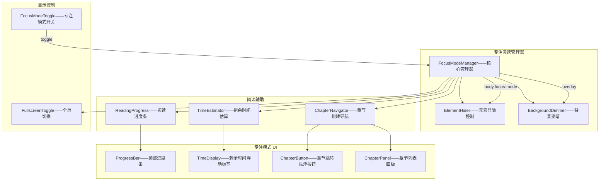
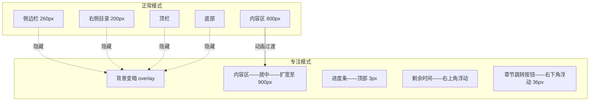

# YK-09-185: 内容专注阅读 — 隐藏侧边栏、背景变暗、阅读进度条、预计剩余时间、章节跳转导航、全屏切换

> 需求编号：YK-09-185 · 优先级：P2 · 人天：0.3d · 状态：需求已编写
> 依赖：YK-09-165（内容阅读时间估算——复用阅读时间计算逻辑）、YK-09-184（内容字体设置——专注阅读模式下字体设置保持生效）

## 背景

### 问题陈述

YiKnowledge 知识文章页面包含丰富的导航元素——侧边栏、顶栏、面包屑、相关文章推荐——这些元素在日常浏览中有用——但用户深入阅读长文时成为干扰：

1. **视觉噪音过多**：侧边栏目录、导航链接、相关文章卡片、评论区——分散注意力——打断阅读流
2. **阅读进度不感知**：阅读 50 页的技术文档——不知道读了百分之几——不知道还要花多少时间——缺乏完成预期
3. **章节导航不便**：长文中跳转章节需要滚回顶部看目录——或手动滚动——没有悬浮的章节跳转——打断阅读上下文
4. **背景干扰**：页面背景和周围元素明亮——在大屏上——余光能看到侧边栏内容——难以完全沉浸
5. **无法全屏阅读**：浏览器工具栏、标签栏、系统栏占据空间——希望有纯内容全屏模式（类似 iBooks/Kindle 的阅读模式）

**核心矛盾**：侧边栏和导航元素在浏览时有价值——但在深入阅读时是干扰。目标是提供专注阅读模式——一键切换——隐藏所有非内容元素——背景变暗——显示阅读进度——预计剩余时间——章节跳转——支持全屏。

### 影响范围

| # | 影响 | 严重程度 | 典型场景 |
|---|------|----------|----------|
| 1 | 阅读时视觉干扰 | 高 | 30 分钟深度阅读——余光不断被侧边栏标题吸引——难以专注 |
| 2 | 不知阅读进度 | 高 | 读长文档——不知道还有多少——焦虑——放弃阅读 |
| 3 | 章节跳转打断流 | 中 | 需要查看其他章节——滚回顶部——找目录——跳转——再滚回来——上下文丢失 |
| 4 | 阅读时长不可预期 | 中 | 打开一篇不知道长度的文章——无法判断是否有时间读完——不敢开始 |
| 5 | 非内容元素占用注意力 | 中 | 底部的评论区/相关文章——读完正文后——惯性继续阅读——分散精力 |

### 挑战

| 挑战 | 说明 |
|------|------|
| 元素隐藏/显示动画 | 侧边栏平滑收起——内容区平滑扩展——非跳跃——用户不失去位置感 |
| 阅读进度精确计算 | 基于滚动位置和总内容高度计算——标题和图片可能影响高度——精确匹配 |
| 预计剩余时间 | 基于内容字数和平均阅读速度——同时考虑代码块/表格——不同内容类型阅读速度不同 |
| 章节跳转悬浮 | 悬浮按钮/面板——不遮挡内容——按需展开——自动高亮当前章节 |
| 全屏 API | Fullscreen API——浏览器兼容性——退出全屏时恢复状态——ESC 键处理 |
| 与深色模式/字体设置协同 | 专注阅读模式下——深色模式更舒适——字体设置保持——三者不冲突 |

---

## 一、现状分析

### 1.1 当前阅读模式

```
YiKnowledge 阅读体验现状:
├── 页面布局
│   ├── 左侧边栏——目录树
│   ├── 顶栏——面包屑+工具栏
│   ├── 内容区——文章正文
│   ├── 右侧边栏——本文目录(TOC)
│   ├── 底部——评论区+相关文章+页脚
│   └── 限制: 所有元素始终可见——无专注模式——干扰多
├── 阅读时间 (YK-09-165)
│   ├── 内容阅读时间估算 ✅
│   └── 限制: 仅在文章元数据中显示——阅读中不可见——不随时间更新
├── 内容导航 (YK-09-112)
│   ├── 导航树优化 ✅
│   └── 限制: 在侧边栏中——非悬浮——需要离开内容区操作
├── 全屏 (YK-09-157)
│   ├── 仪表盘全屏模式——仅限仪表盘 ✅
│   └── 限制: 非文章阅读——不含章节导航和进度——非通用组件

缺失:
├── 专注阅读模式: 一键隐藏所有非内容元素——沉浸阅读                         # ❌ 无
├── 背景变暗: 半透明遮罩覆盖背景——内容区聚焦                                  # ❌ 无
├── 阅读进度条: 顶部细线进度条——显示阅读百分比                                 # ❌ 无
├── 预计剩余时间: 动态计算剩余阅读时间——基于当前位置                            # ❌ 无
├── 章节跳转: 悬浮面板——显示文章目录——点击跳转——当前章节高亮                    # ❌ 无
├── 全屏切换: Fullscreen API——纯内容全屏——ESC 退出                            # ❌ 无
├── 进入/退出动画: 侧边栏滑出——内容扩宽——平滑过渡                              # ❌ 无
└── ESC 键退出: 按 ESC 退出专注模式——返回正常阅读                                # ❌ 无
```

### 1.2 专注阅读模式数据流

```mermaid
graph TD
    A[用户点击"专注阅读"按钮] --> B[FocusMode 激活]
    B --> C[隐藏侧边栏+顶栏+底部]
    B --> D[背景变暗——overlay]
    B --> E[显示阅读进度条]
    B --> F[显示预计剩余时间]
    B --> G[显示章节跳转悬浮按钮]
    B --> H[可选全屏——Fullscreen API]

    C --> I[内容区居中扩宽——动画]
    D --> I
    E --> I
    F --> I
    G --> I

    I --> J[用户阅读中]
    J --> K{操作}
    K -->|滚动| L[更新进度条+剩余时间]
    K -->|点击章节跳转| M[平滑滚动到章节]
    K -->|按 ESC| N[退出专注模式]
    K -->|点击全屏| O[进入全屏]

    N --> P[恢复侧边栏+所有UI]
    N --> Q[移除背景遮罩]
    N --> R[隐藏进度/时间/跳跃]
```

### 1.3 根因矩阵

| 症状 | 根因 | 触发条件 | 频率 |
|------|------|----------|------|
| 阅读时视觉干扰 | 无专注模式——所有 UI 元素始终可见 | 深度阅读长文 | 高 |
| 进度不感知 | 无阅读进度条——无剩余时间 | 阅读 > 5min | 高 |
| 章节跳转不便 | 需要滚回顶部或侧边栏 | 多章节文章——需要回顾/跳转 | 中 |
| 背景干扰 | 周围元素明亮——余光分散注意力 | 大屏阅读——侧边栏可见 | 中 |
| 全屏受限 | 浏览器 chrome 占用空间 | 笔记本小屏 | 低 |

---

## 二、设计决策

### 决策 1：专注阅读模式实现 — CSS class vs 条件渲染 vs Portal

| 选项 | 性能 | 状态保持 | 实现复杂度 |
|------|------|---------|-----------|
| A: CSS class 切换——`body.focus-mode`——CSS 控制显隐 | 最佳——纯 CSS——无 JS 开销 | 好——DOM 保留——状态不丢失 | 低 |
| B: 条件渲染——v-if 移除非内容组件 | 好——移除 DOM | 差——组件状态丢失——返回时需重建 | 中 |
| C: Portal——将内容提升到 body 层——覆盖全屏 | 中——移动 DOM | 中——事件绑定可能断裂 | 高 |

**选择：A（CSS class 切换——`body.focus-mode`——CSS 控制所有非内容元素显隐——内容区 DOM 不变——状态不丢失）。** 条件渲染移除非内容 DOM——但返回时组件需要重建——滚动位置/输入状态/下拉菜单状态可能丢失。CSS class 切换在 body 上添加/移除 `focus-mode`——CSS 规则处理所有显隐逻辑——内容区 DOM 完全不变——滚动位置、表单状态、展开状态完整保留。性能最优——GPU 加速的 opacity 和 transform 动画。

### 决策 2：阅读进度计算 — 滚动百分比 vs 内容高度 vs 结合章节

| 选项 | 精度 | 用户体验 | 适用性 |
|------|------|---------|--------|
| A: 滚动百分比——scrollTop / (scrollHeight - clientHeight) | 高——像素级 | 中——忽略内容密度 | 所有文章 |
| B: 基于章节——每章节有固定权重——当前章节百分比 | 中——离散 | 好——符合直觉——"第 3/8 章" | 有明确章节的文章 |
| C: 混合——滚动百分比 + 章节标记——进度条上有章节指示点 | 高——滚动为基础+章节参考 | 最好——进度条+章节标记 | 所有文章 |

**选择：C（混合——基于滚动百分比的进度条+章节标记指示点——顶部细线进度条——h2 位置标记为小圆点）。** 纯滚动百分比无法反映章节结构——用户关注的是读到第几章了——而非 57.3%。混合进度条：细线填充显示滚动百分比——上方或下方有章节标记点（每个 h2 的位置在进度条上对应一个点）——hover 标记点显示章节名称——点击跳转。类似 Medium 的阅读进度条——用户熟悉。

### 决策 3：预计剩余时间 — 静态 vs 动态 vs 分段

| 选项 | 准确性 | 用户信心 | 实现 |
|------|--------|---------|------|
| A: 静态——总预估时间——不变 | 粗糙——不考虑阅读速度 | 中——不知道加速是否有效 | 低 |
| B: 动态——基于用户实际阅读速度——实时更新 | 最准确——自适应用户 | 高——"以当前速度——还剩 8 分钟" | 中 |
| C: 分段——按章节预估——每章节独立时间 | 中——章节间阅读速度可能不同 | 中——"本章还有 2 分钟" | 中 |

**选择：B（动态——基于用户实际阅读速度实时计算——自适应）。** 静态预估不考虑用户速度变化——有人读得快——有人读得慢——同一人遇到难的内容也会减速。动态计算：记录用户的滚动速度（字/秒）——用已完成字数和已用时间估算阅读速度——用剩余字数和当前速度估算剩余时间。每 5 秒更新一次——避免频繁跳动。初始值使用默认阅读速度（中文 400 字/分钟——英文 250 词/分钟）。

### 决策 4：章节跳转 — 始终显示 vs 按需显示 vs 悬浮按钮触发

| 选项 | 空间占用 | 干扰程度 | 可达性 |
|------|---------|---------|--------|
| A: 始终显示——右侧悬浮目录面板 | 中——占右侧空间 | 中——视觉存在 | 高——随时可用 |
| B: 按需显示——hover 触发或滚动触发 | 无——隐藏时 | 低——自动显示 | 中——需要特定动作 |
| C: 悬浮按钮——点击展开——面板覆盖——选择后收起 | 低——仅一个按钮 | 低——仅在需要时出现 | 中——需要一次点击 |

**选择：C（悬浮按钮——右下角章节图标——点击展开 TOC 面板——选择章节后自动收起）。** 始终显示的目录面板在专注阅读模式下违背了"减少视觉噪音"的初衷。hover 触发不精确——容易误触发。悬浮按钮最小视觉干扰——一个半透明的章节图标（约 36×36px）——点击展开完整目录面板（覆盖在内容上方——半透明背景）——选择章节后面板收起——滚动到目标位置。面板中的当前章节高亮——一目了然。

---

## 三、目标架构

### 3.1 专注阅读系统架构



### 3.2 专注阅读模式页面布局



---

## 四、具体改动

### 4.1 核心代码：专注阅读管理器

```typescript
// src/composables/useFocusMode.ts

interface FocusModeState {
  isActive: boolean;
  isFullscreen: boolean;
  progress: number; // 0-100
  remainingTime: string; // "约 8 分钟"
  currentChapter: string;
  chapters: ChapterInfo[];
}

interface ChapterInfo {
  id: string;
  title: string;
  level: number;
  position: number; // 在滚动中的 Y 坐标
  isCurrent: boolean;
}

class FocusModeManager {
  private static STORAGE_KEY = 'yiknowledge-focus-mode-prefs';
  private readingStartTime = 0;
  private wordsRead = 0;
  private scrollTimer: ReturnType<typeof setTimeout> | null = null;
  private totalWords = 0;

  state: FocusModeState = reactive({
    isActive: false,
    isFullscreen: false,
    progress: 0,
    remainingTime: '--',
    currentChapter: '',
    chapters: [],
  });

  /** 计算文章总字数 */
  getTotalWords(container: HTMLElement): number {
    const text = container.textContent || '';
    // 中文字数计算——去掉空白
    const chineseChars = (text.match(/[\u4e00-\u9fff]/g) || []).length;
    // 英文单词数
    const englishWords = (text.match(/[a-zA-Z]+/g) || []).length;
    return chineseChars + englishWords;
  }

  /** 进入专注阅读模式 */
  enterFocusMode(contentEl: HTMLElement): void {
    this.state.isActive = true;
    this.readingStartTime = Date.now();
    this.totalWords = this.getTotalWords(contentEl);

    // 扫描章节
    this.scanChapters(contentEl);

    // 应用 CSS
    document.body.classList.add('focus-mode');

    // 初始化进度
    this.updateProgress(contentEl);

    // 监听滚动
    this.startScrollTracking(contentEl);
  }

  /** 退出专注阅读模式 */
  exitFocusMode(): void {
    this.state.isActive = false;
    this.state.isFullscreen = false;
    document.body.classList.remove('focus-mode');
    this.stopScrollTracking();

    if (document.fullscreenElement) {
      document.exitFullscreen().catch(() => {});
    }
  }

  /** 切换专注模式 */
  toggle(contentEl?: HTMLElement): void {
    if (this.state.isActive) {
      this.exitFocusMode();
    } else if (contentEl) {
      this.enterFocusMode(contentEl);
    }
  }

  /** 切换全屏 */
  async toggleFullscreen(): Promise<void> {
    if (this.state.isFullscreen) {
      await document.exitFullscreen();
      this.state.isFullscreen = false;
    } else {
      await document.documentElement.requestFullscreen();
      this.state.isFullscreen = true;
    }
  }

  /** 跳转到章节 */
  scrollToChapter(chapterId: string): void {
    const el = document.getElementById(chapterId);
    if (el) {
      el.scrollIntoView({ behavior: 'smooth', block: 'start' });
    }
  }

  /** 更新阅读进度 */
  private updateProgress(container: HTMLElement): void {
    const { scrollTop, scrollHeight, clientHeight } = container === document.documentElement
      ? { scrollTop: window.scrollY, scrollHeight: document.documentElement.scrollHeight, clientHeight: window.innerHeight }
      : { scrollTop: container.scrollTop, scrollHeight: container.scrollHeight, clientHeight: container.clientHeight };

    const scrollable = scrollHeight - clientHeight;
    const progress = scrollable > 0 ? Math.min(100, Math.round((scrollTop / scrollable) * 100)) : 0;

    this.state.progress = progress;
    this.updateRemainingTime(progress);
    this.updateCurrentChapter(scrollTop);
  }

  /** 更新预计剩余时间 */
  private updateRemainingTime(progress: number): void {
    if (progress <= 0) {
      this.state.remainingTime = `约 ${Math.ceil(this.totalWords / 400)} 分钟`;
      return;
    }

    const elapsed = (Date.now() - this.readingStartTime) / 1000 / 60; // 分钟
    const totalEstimated = progress > 0 ? elapsed / (progress / 100) : 30;
    const remaining = Math.max(0, totalEstimated - elapsed);

    if (remaining < 1) {
      this.state.remainingTime = '不到 1 分钟';
    } else if (remaining < 60) {
      this.state.remainingTime = `约 ${Math.round(remaining)} 分钟`;
    } else {
      this.state.remainingTime = `约 ${Math.floor(remaining / 60)} 小时 ${Math.round(remaining % 60)} 分钟`;
    }
  }

  /** 更新当前章节 */
  private updateCurrentChapter(scrollTop: number): void {
    const chapters = this.state.chapters;
    let current = chapters[0]?.title || '';

    for (let i = chapters.length - 1; i >= 0; i--) {
      if (scrollTop >= chapters[i].position - 100) {
        current = chapters[i].title;
        break;
      }
    }

    this.state.currentChapter = current;
    // 更新章节 isCurrent 标记
    chapters.forEach((ch, i) => {
      ch.isCurrent = ch.title === current;
    });
  }

  /** 扫描文章章节 */
  private scanChapters(container: HTMLElement): void {
    const headings = container.querySelectorAll('h2, h3');
    this.state.chapters = Array.from(headings).map((h, index) => ({
      id: h.id || `section-${index}`,
      title: h.textContent || '',
      level: parseInt(h.tagName[1]),
      position: (h as HTMLElement).offsetTop,
      isCurrent: false,
    }));
  }

  /** 开始滚动追踪 */
  private startScrollTracking(container: HTMLElement): void {
    const handler = () => {
      if (this.scrollTimer) clearTimeout(this.scrollTimer);
      this.scrollTimer = setTimeout(() => {
        this.updateProgress(container);
      }, 50); // 50ms debounce
    };

    window.addEventListener('scroll', handler, { passive: true });
    this._scrollHandler = handler;
  }

  private _scrollHandler: (() => void) | null = null;

  private stopScrollTracking(): void {
    if (this._scrollHandler) {
      window.removeEventListener('scroll', this._scrollHandler);
      this._scrollHandler = null;
    }
    if (this.scrollTimer) {
      clearTimeout(this.scrollTimer);
      this.scrollTimer = null;
    }
  }
}

export const focusModeManager = new FocusModeManager();
```

### 4.2 核心样式：专注模式 CSS

```css
/* src/assets/styles/focus-mode.css */

/* === 专注阅读模式 === */
body.focus-mode {
  /* 背景变暗 */
  background-color: #f0f0f0;
}

body.focus-mode[data-theme="dark"] {
  background-color: #06090f;
}

/* 隐藏非内容元素 */
body.focus-mode .sidebar,
body.focus-mode .navbar,
body.focus-mode .top-bar,
body.focus-mode .breadcrumb,
body.focus-mode .footer,
body.focus-mode .comments-section,
body.focus-mode .related-articles,
body.focus-mode .article-toc {
  opacity: 0;
  pointer-events: none;
  transition: opacity 0.3s ease;
}

/* 内容区居中扩宽 */
body.focus-mode .article-content {
  max-width: 900px !important;
  margin: 0 auto !important;
  padding: 40px 20px !important;
  transition: max-width 0.4s ease, padding 0.4s ease;
}

/* 顶部阅读进度条 */
.focus-progress-bar {
  position: fixed;
  top: 0;
  left: 0;
  height: 3px;
  background: linear-gradient(90deg, #0969da, #58a6ff);
  z-index: 10000;
  transition: width 0.1s linear;
  box-shadow: 0 0 8px rgba(9, 105, 218, 0.3);
}

/* 进度条上的章节标记点 */
.focus-progress-chapter-marker {
  position: absolute;
  top: -3px;
  width: 8px;
  height: 8px;
  border-radius: 50%;
  background: #fff;
  border: 2px solid #0969da;
  transform: translateX(-50%);
  cursor: pointer;
}

/* 剩余时间浮动标签 */
.focus-time-display {
  position: fixed;
  top: 12px;
  right: 20px;
  font-size: 12px;
  color: #666;
  background: rgba(255, 255, 255, 0.9);
  padding: 4px 10px;
  border-radius: 12px;
  z-index: 9999;
  backdrop-filter: blur(4px);
  box-shadow: 0 1px 4px rgba(0, 0, 0, 0.08);
}

/* 章节跳转悬浮按钮 */
.focus-chapter-button {
  position: fixed;
  bottom: 40px;
  right: 30px;
  width: 40px;
  height: 40px;
  border-radius: 50%;
  background: rgba(255, 255, 255, 0.95);
  box-shadow: 0 2px 12px rgba(0, 0, 0, 0.12);
  display: flex;
  align-items: center;
  justify-content: center;
  cursor: pointer;
  z-index: 9999;
  transition: transform 0.2s, box-shadow 0.2s;
  border: none;
}

.focus-chapter-button:hover {
  transform: scale(1.1);
  box-shadow: 0 4px 16px rgba(0, 0, 0, 0.18);
}
```

### 4.3 文件变更清单

| 文件 | 操作 | 说明 |
|------|------|------|
| `src/composables/useFocusMode.ts` | 新增 | 专注阅读管理器——模式切换/进度/时间/章节/全屏 |
| `src/components/FocusMode/FocusModeToggle.vue` | 新增 | 专注模式开关——工具栏按钮/NavBar 图标 |
| `src/components/FocusMode/ReadingProgressBar.vue` | 新增 | 阅读进度条——顶部细线+章节标记点 |
| `src/components/FocusMode/TimeDisplay.vue` | 新增 | 剩余时间浮动标签 |
| `src/components/FocusMode/ChapterNavigator.vue` | 新增 | 章节跳转——悬浮按钮+展开面板 |
| `src/components/FocusMode/FullscreenButton.vue` | 新增 | 全屏切换按钮 |
| `src/assets/styles/focus-mode.css` | 新增 | 专注模式 CSS——显隐控制+背景变暗+动画 |
| `src/views/ArticleDetailView.vue` | 修改 | 集成专注模式入口组件 |

---

## 五、实施步骤

| 步骤 | 操作 | 路径 | 验证 | 人天 |
|------|------|------|------|------|
| 1 | 实现 FocusModeManager | `src/composables/useFocusMode.ts` | 模式切换/进度计算/时间估算/章节扫描 | 0.08 |
| 2 | 实现专注模式 CSS | `src/assets/styles/focus-mode.css` | 元素显隐/背景变暗/内容区动画/进度条样式 | 0.05 |
| 3 | 实现阅读进度条+章节标记 | `ReadingProgressBar.vue` | 进度条渲染/章节标记点/点击跳转/hover 预览 | 0.06 |
| 4 | 实现剩余时间+章节导航 | `TimeDisplay.vue` + `ChapterNavigator.vue` | 动态时间/章节列表/当前高亮/平滑跳转 | 0.05 |
| 5 | 实现开关按钮+全屏 | `FocusModeToggle.vue` + `FullscreenButton.vue` | 切换动画/全屏 API/ESC 退出 | 0.03 |
| 6 | 集成到文章页 | `ArticleDetailView.vue` | 工具栏按钮——进入/退出——全流程 | 0.03 |

**总人天：0.3d**

---

## 六、测试规格

### 测试 1：进入/退出专注阅读模式

| 项目 | 内容 |
|------|------|
| 优先级 | P0 |
| 前置条件 | 文章详情页——有侧边栏+顶栏+底部+右侧目录 |
| 测试步骤 | 1. 点击工具栏中的"专注阅读"按钮 2. 观察页面变化 3. 按 ESC 键 4. 观察页面恢复 |
| 预期结果 | 进入: 侧边栏/顶栏/底部/右侧目录淡出隐藏——背景变暗——内容区居中扩宽——显示进度条+剩余时间+章节按钮——退出: 所有元素恢复——进度条消失——内容区恢复原宽——滚动位置保持不变 |

### 测试 2：阅读进度条——实时更新

| 项目 | 内容 |
|------|------|
| 优先级 | P0 |
| 前置条件 | 长文（可滚动 10+ 视口高度）——已进入专注阅读模式 |
| 测试步骤 | 1. 滚动到 25% 位置——观察进度条 2. 滚动到 50% 3. 滚动到 100%（底部） 4. 观察章节标记点 |
| 预期结果 | 进度条顶部细线填充——25% 时填充 1/4——100% 时填充满——章节标记点（圆点）在 h2 位置出现——hover 圆点显示章节名称——点击跳转到对应章节 |

### 测试 3：预计剩余时间——动态更新

| 项目 | 内容 |
|------|------|
| 优先级 | P0 |
| 前置条件 | 文章 5000 字——已进入专注阅读模式 |
| 测试步骤 | 1. 进入专注模式——观察初始时间 2. 阅读 2 分钟——滚动到 30% 3. 观察剩余时间变化 4. 跳到最后——观察时间 |
| 预期结果 | 初始时间"约 12 分钟"（5000/400）——阅读 2 分钟后——实际速度若快于默认——剩余时间缩短——滚动到 30% 后时间根据实际速度更新——接近 100% 时显示"不到 1 分钟" |

### 测试 4：章节跳转——悬浮按钮+面板

| 项目 | 内容 |
|------|------|
| 优先级 | P0 |
| 前置条件 | 文章有 8 个 h2 章节——已进入专注阅读模式 |
| 测试步骤 | 1. 点击右下角章节按钮 2. 观察展开的章节面板 3. 观察当前章节高亮 4. 点击第 5 个章节 5. 观察页面滚动 |
| 预期结果 | 面板展开——显示 8 个章节——h3 缩进——当前所在章节高亮——点击第 5 章节——平滑滚动到对应位置——面板自动收起——进度条更新——当前章节名称更新 |

### 测试 5：全屏切换——Fullscreen API

| 项目 | 内容 |
|------|------|
| 优先级 | P1 |
| 前置条件 | 已进入专注阅读模式——浏览器支持 Fullscreen API |
| 测试步骤 | 1. 点击全屏按钮 2. 观察页面变化 3. 按 ESC 退出全屏 4. 再次按 ESC |
| 预期结果 | 进入全屏: 浏览器 chrome 消失——内容区全屏——按钮图标改变——按 ESC: 退出全屏——但保持专注阅读模式——再按 ESC: 退出专注阅读模式——恢复正常 |
| 测试步骤 | 1. 全屏后——按 ESC——仅退出全屏 2. 非全屏——按 ESC——退出专注模式 |

### 测试 6：与深色模式+字体设置协同

| 项目 | 内容 |
|------|------|
| 优先级 | P1 |
| 前置条件 | 深色模式已激活——字体设置 serif/18px/1.8——进入专注阅读模式 |
| 测试步骤 | 1. 进入专注模式 2. 检查背景色 3. 检查字体设置 4. 切换字体大小——观察专注模式 5. 退出专注模式——检查字体设置 |
| 预期结果 | 专注模式下深色背景适配——背景更暗（`#06090f`）——字体设置保持（serif/18px/1.8）——专注模式下仍可打开字体设置面板——面设置不影响专注模式——退出后字体设置保持——深色模式保持 |

---

## 七、风险与缓解

| 风险 | 概率 | 影响 | 缓解措施 |
|------|------|------|------|
| 阅读时间估算不准——用户不信任 | 中 | 低 | 说明文字用"约"——动态自适应调整——不使用绝对承诺——如"约 8-12 分钟"范围显示 |
| 全屏 API iOS Safari 不支持 | 中 | 低 | 检测 `document.fullscreenEnabled`——不支持时隐藏全屏按钮——仅提供专注模式——iOS 使用 webkit 前缀 |
| 章节扫描 h2/h3 id 为空——跳转失败 | 低 | 中 | 扫描时检查 id——为空时使用 `section-{index}` 自动生成——并设置元素 id——确保可跳转 |
| 专注模式下用户不知道怎么退出——困惑 | 低 | 低 | 底部显示"按 ESC 退出专注模式"提示——3s 后自动消失——退出按钮始终可见——章节面板中也有退出按钮 |
| 内容区宽度动画在移动端不适用 | 低 | 低 | 移动端检测——屏幕 < 768px 时专注模式不调整 max-width——仅隐藏非内容元素——因为移动端本已是单栏 |

---

## 八、回滚策略

1. **功能级回滚**：隐藏专注阅读按钮——用户无法进入专注模式——正常阅读不受影响
2. **代码级回滚**：移除 `FocusMode/` 组件目录和 `useFocusMode`——移除 `body.focus-mode` CSS 规则
3. **体验级回滚**：专注模式 CSS 保留——但按钮不可见——未来可重新激活
4. **回滚验证**：正常阅读正常——侧边栏/顶栏/底部正常——无 CSS 残留——无 JS 错误

---

## 九、设计决策记录

### D-01：CSS class 切换——非条件渲染

**上下文**：专注阅读模式的实现方式——隐藏非内容元素。

**决策**：`body.focus-mode` CSS class——CSS 控制显示/隐藏——DOM 保留——不销毁组件。

**理由**：条件渲染（v-if）移除非内容组件——返回时需要重新创建——组件的滚动位置/展开状态/输入内容全部丢失——体验极差。CSS class 切换保留全部 DOM 和组件状态——仅视觉隐藏——返回时瞬间恢复——滚动位置不变——状态不丢。使用 opacity+pointer-events 过渡——GPU 加速动画——流畅。

### D-02：混合进度——滚动百分比+章节标记

**上下文**：阅读进度的表示方式。

**决策**：顶部细线填充显示滚动百分比——章节标记点显示 h2 位置——hover 预览+点击跳转。

**理由**：纯滚动百分比无法反映章节结构——用户更关心读到第几章。Medium 风格的进度条是业界最佳实践——进度条上有章节标记——视觉简洁+功能完整。标记点提供章节感知——进度条百分比提供精确进度——互相补充。一维进度条足够——不引入复杂的二维进度图。

### D-03：动态阅读时间——自适应用户速度

**上下文**：剩余阅读时间的计算方式。

**决策**：基于用户实际阅读速度实时计算——初始使用默认速度——随时间自适应用户速度。

**理由**：静态时间不考虑用户个体差异——快读者和慢读者差距可达 3 倍。动态自适应：进入专注模式后开始计时——每 5s 根据已读字数和已用时间计算实际速度——用实际速度估算剩余时间。初始值使用默认 400 字/分钟——随着阅读进行逐渐逼近用户真实速度。类似 Kindle 的"本章剩余 X 分钟"——用户已广泛接受。

### D-04：悬浮按钮触发章节面板——非始终显示

**上下文**：章节跳转导航的显示模式。

**决策**：右下角悬浮按钮——点击展开 TOC 面板——选择后自动收起。

**理由**：专注阅读的核心目标是减少视觉噪音——始终显示的目录面板与目标矛盾。悬浮按钮仅占 40×40px——半透明——最小干扰。点击展开面板——显示所有章节——当前章节高亮——选择跳转后面板收起——最小化存在感。面板类似 iOS Safari 的阅读模式目录——用户熟悉。

---

## 十、可观测性

| 指标 | 采集方式 | 阈值 |
|------|----------|------|
| 专注模式使用率 | enterFocusMode 调用次数 | — |
| 专注模式平均时长 | enter→exit 时间差 | — |
| 全屏使用率 | toggleFullscreen 调用次数 | — |
| 章节跳转使用率 | scrollToChapter 调用次数 | — |
| 阅读完成率 | progress 达到 100% 的比例 | — |
| 平均阅读速度 | wordsRead / elapsed 分钟 | — |
| ESC 键退出率 | 键盘 ESC 触发退出 / 总退出次数 | — |
| 进度条 hover 互动 | 章节标记点 hover 次数 | — |

---

## 十一、代码审查检查清单

- [ ] `FocusModeManager.enterFocusMode`——内容 container 为 null 时跳过——不崩溃
- [ ] `FocusModeManager.enterFocusMode`——重复调用时不重复初始化——检查 isActive
- [ ] `FocusModeManager.exitFocusMode`——退出前停止所有 timer——清除 scroll 监听
- [ ] `FocusModeManager.toggleFullscreen`——检测 `document.fullscreenEnabled`——不支持时隐藏按钮
- [ ] `FocusModeManager.updateProgress`——除零保护——scrollable > 0 才计算——progress 限制 0-100
- [ ] `FocusModeManager.updateRemainingTime`——elapsed 为 0 时——使用默认估算——非 Infinity
- [ ] `FocusModeManager.scanChapters`——h2/h3 为空时——使用默认 id——确保可跳转
- [ ] `ReadingProgressBar`——进度条宽度——使用百分比——transition 0.1s——无跳变
- [ ] `ReadingProgressBar`——章节标记点——位置按 percentage 计算——匹配 scroll progress
- [ ] `ChapterNavigator`——面板打开时——点击外部或选择后关闭——ESC 关闭
- [ ] `FullscreenButton`——全屏事件监听 `fullscreenchange`——同步更新 isFullscreen
- [ ] ESC 键处理——全屏时先退出全屏——非全屏时退出专注模式——无线索
- [ ] 专注模式 CSS——所有要隐藏的元素有对应的 `body.focus-mode .xxx` 规则
- [ ] TypeScript——ChapterInfo 接口——position 和 isCurrent 类型明确

---

## 回归问题预测

| # | 预测问题 | 触发条件 | 检测方式 |
|---|----------|----------|----------|
| 1 | 专注模式下 CSS transition 与页面原有 transition 冲突——动画时长不一致 | 侧边栏本身有 hover 过渡——专注模式又加 opacity 过渡——两者叠加 | 专注模式 CSS 使用独立的 transition 属性——指定 transition-property 而非 all——避免属性冲突 |
| 2 | 章节扫描在包含代码块的长文档中——offsetTop 不准确 | 代码块中有动态加载的图片——offsetTop 在图片加载前后不同 | 使用 IntersectionObserver 动态跟踪章节位置——或在图片全部加载后重新扫描——使用 `onload` 事件 |
| 3 | 阅读时间在切换到其他标签页时继续累积——显示不准确的剩余时间 | 用户跳出到其他标签页 10 分钟——计时器继续——剩余时间变为负 | 使用 `document.visibilitychange` 事件——页面不可见时暂停计时——恢复时重新评估 |
| 4 | 进度条在移动端 Safari——顶部工具栏遮挡进度条 | iOS Safari 顶部的地址栏和底部工具栏——position: fixed top:0 的元素被遮挡 | 进度条 top 使用 `env(safe-area-inset-top)`——或 delay 100ms 后调整 top 到状态栏下方 |
| 5 | 全屏后——专注模式的退出按钮不可见——用户不知道怎么退出 | 全屏时 UI 布局可能改变——专注模式的按钮被挤出视口 | 全屏模式下退出按钮移到屏幕底部中央——显眼位置——文字"按 ESC 退出专注模式"——tutorial |
| 6 | 专注模式下——用户点击了链接——页面跳转——专注模式状态丢失 | 专注模式中点击文章内链接——页面导航——新页面未进入专注模式 | 专注模式不应跨页面保持——页面跳转是正常退出——不特殊处理——如果用户需要——可在设置中开启"每次打开文章自动进入专注模式" |

---

## 性能分析

| 操作 | 数据量 | 耗时 | 说明 |
|------|--------|------|------|
| 进入专注模式（CSS class） | — | < 5ms | classList.add——浏览器 repaint |
| 退出专注模式 | — | < 5ms | classList.remove——恢复 |
| 章节扫描 | 20 标题 | < 3ms | querySelectorAll + offsetTop 计算 |
| 进度更新（debounced） | — | < 2ms | 简单数学——scroll 回调——debounce 50ms |
| 剩余时间更新 | — | < 1ms | 除法运算——5s 间隔更新 |
| 章节面板展开动画 | — | 250ms | CSS transition——不阻塞 |
| 进度条渲染 | — | < 2ms | 单 DOM 元素——width 属性变化 |
| 全屏切换 | — | < 100ms | Fullscreen API——浏览器原生 |
| 内容区宽度动画 | — | 400ms | CSS transition max-width——GPU 加速 |

---

## 相关文档

- [内容阅读时间估算](../165-需求-内容阅读时间估算.md) — 阅读时间计算逻辑——本需求复用基础算法
- [内容字体设置](../184-需求-内容字体设置.md) — 字体设置与专注模式协同——字体设置在专注模式下保持
- [内容深色模式](../183-需求-内容深色模式.md) — 专注模式+深色模式=最佳夜间阅读体验
- [内容导航树优化](../112-需求-内容导航树优化.md) — 章节导航与侧边栏目录共享数据源

*PRD 来源: `projects/yiknowledge/requirements/2026-09/185-需求-内容专注阅读.md`*