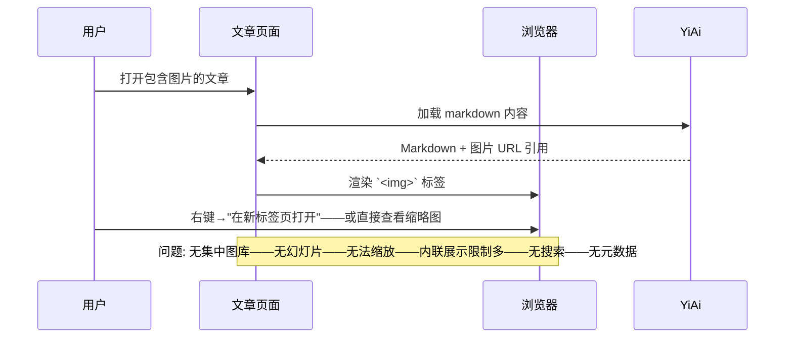
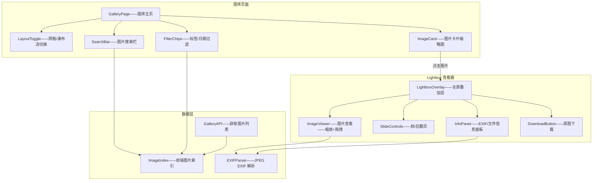
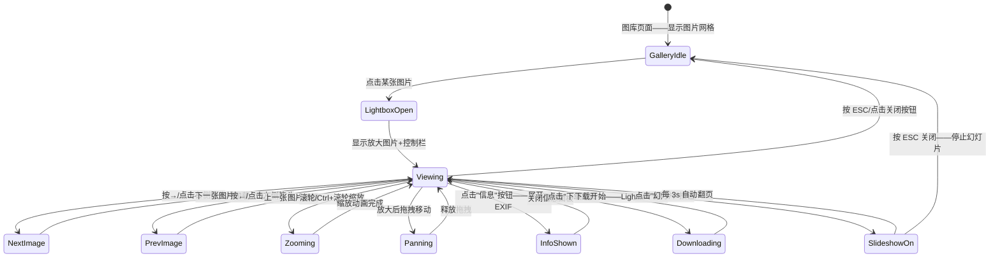

# YK-09-186: 内容图片库 — Lightbox 查看器、网格/瀑布流布局、图片缩放、幻灯片模式、原图下载、EXIF 显示、图片搜索

> 需求编号：YK-09-186 · 优先级：P2 · 人天：0.3d · 状态：需求已编写
> 依赖：YK-09-117（多媒体内容管理——图片管理是多媒体子集）、YK-09-172（内容全局搜索优化——图片搜索复用搜索基础设施）

## 背景

### 问题陈述

YiKnowledge 知识库中嵌入了大量图片——截图/架构图/流程图/示意图——但目前图片管理体验原始：

1. **图片嵌入后难以浏览**：知识文章中的图片作为内联 `` 展示——用户无法全屏查看——细节看不清楚——无法逐个浏览所有图片
2. **无集中图库视图**：所有图片分散在各篇文章中——无法按日期/名称/标签浏览全部图片——管理员无法快速找到某张图
3. **大图无法缩放**：架构图或流程图通常是高分辨率大图——文章中按缩略图显示——点击无放大——用户需要右键"在新标签页打开图片"
4. **无幻灯片浏览**：一篇文章中有 10 张截图——用户需要逐张点击查看——无法连续浏览（前后翻页）
5. **EXIF/元数据缺失**：图片的拍摄时间/设备/尺寸/格式不显示——无法快速判断图片来源和质量
6. **无单独下载**：需要保存单张图片时——只能右键另存——如果图片被文章 CSS 裁剪——保存的也可能是缩略图

**核心矛盾**：图片在文章中内联嵌入是必要的（图文并茂）——但内联限制了图片的交互（缩放/全屏/幻灯片/EXIF/下载）——需要一个集中的图片库视图来解锁这些能力。

### 影响范围

| # | 影响 | 严重程度 | 典型场景 |
|---|------|----------|----------|
| 1 | 无法全屏查看大图 | 高 | 架构图 3000×2000——文章中以 800px 宽度展示——细节压缩——无法阅读 |
| 2 | 无法浏览所有图片 | 高 | 管理员需要找一张特定截图——但分散在 50+ 篇文章中——只能逐篇打开 |
| 3 | 无法连续查看 | 中 | 一篇文章 10 张操作截图——需要逐个关闭→下一篇——无法幻灯片连续浏览 |
| 4 | 无法缩放/高清 | 中 | 用户想看某个细节——右键新标签打开——仍需浏览器缩放——无局部放大 |
| 5 | 元数据缺失 | 低 | 文件大小/日期/EXIF 看不到——管理图片资源不方便 |
| 6 | 下载额外步骤 | 低 | 右键另存 vs 一键下载原图——体验差异 |

### 挑战

| 挑战 | 说明 |
|------|------|
| 瀑布流布局性能 | 上百张图片在瀑布流中——初始加载大量 `` ——性能问题——虚拟滚动 |
| Lightbox 键盘导航 | 全屏模式下——键盘左右翻页——ESC 关闭——焦点管理——无障碍 |
| 图片懒加载优化 | 网格视图中——仅在可视区域的图片加载——减少带宽和内存——Intersection Observer |
| EXIF 数据提取 | JPEG 图片在浏览器中可通过 DataView 读取 EXIF 二进制——HEIC/WebP 支持有限 |
| 图片搜索 | 按文件名/日期/标签搜索——需要后端建立图片索引——前端搜索 UI |

---

## 一、现状分析

### 1.1 当前图片处理方式

```
YiKnowledge 图片展示现状:
├── 内联 `` 在文章中
│   ├── 文章内嵌图片——``
│   ├── 浏览器默认行为——右键菜单"在新标签页打开"
│   └── 限制: 无放大——无画廊——无幻灯片——无缩略图网格
├── 无全局图片索引
│   └── 限制: 图片分散在各 markdown 文件中——无法搜索——无列表视图
├── 缩略图与文章混合
│   └── 限制: 图片被文章样式裁剪——无法以图片为中心浏览
├── 无 EXIF 展示
│   └── 限制: 图片拍摄时间/设备/GPS/参数不可见
└── 无独立下载UI
    └── 限制: 仅浏览器右键另存——无法保证下载原图
```

### 1.2 当前数据流



### 1.3 根因矩阵

| 症状 | 根因 | 触发条件 | 频率 |
|------|------|----------|------|
| 大图看不清细节 | 无 Lightbox 全屏——无缩放 | 查看高分辨率图片 | 高 |
| 找不到特定图片 | 无全局图片索引——图片分散 | 管理/查找图片资源 | 高 |
| 无法连续浏览 | 无幻灯片/前后翻页 | 一篇文章多张图片 | 中 |
| 无图片元数据 | 无 EXIF 解析——无文件信息展示 | 需要了解图片来源 | 低 |
| 下载原图不便 | 仅浏览器右键另存 | 保存图片到本地 | 中 |

---

## 二、设计决策

### 决策 1：图库布局 — 网格 vs 瀑布流 vs 列表

| 选项 | 空间效率 | 图片比例适配 | 视觉一致性 |
|------|---------|------------|-----------|
| A: 固定网格 (等尺寸缩略图) | 高——每行固定 3-5 张 | 差——横图和竖图裁剪不协调 | 好——整齐 |
| B: 瀑布流 (Masonry——按列+自然高度) | 中——可能有空白 | 好——保持原始比例 | 中——有机 |
| C: 列表 (缩略图+信息行) | 低——每行一张 | 中 | 中 |

**选择：B（瀑布流 Masonry 布局——可切换网格）。** 瀑布流保持图片原始宽高比——横版架构图和竖版截图自然排列——视觉效果好。提供网格/瀑布流切换按钮——满足不同浏览偏好。使用 CSS `column-count` 或轻量 Masonry 库——避免大型依赖。

### 决策 2：Lightbox 实现 — 自研 vs photoSwipe vs fslightbox

| 选项 | 包大小 | 手势支持 | 可定制性 | 幻灯片支持 |
|------|--------|---------|---------|-----------|
| A: 自研——v-show + transform | < 5KB | 需自行实现 | 最高 | 需自行实现 |
| B: photoSwipe 5 | ~25KB | 完整——缩放/拖拽/滑动 | 中 | 原生支持 |
| C: fslightbox | ~15KB | 中 | 中 | 原生支持 |

**选择：A（自研 Lightbox——轻量 + 可定制）。** 0.3d 内 photoSwipe 的 25KB 和 API 学习成本不合理。自研 Lightbox 使用 `<Teleport>` + CSS transform——缩放通过 `transform: scale()` 实现——前后翻页通过键盘事件——~200 行代码即可覆盖基本需求。手势（移动端双指缩放）作为后续增强。

### 决策 3：图片搜索 — 纯前端 vs 后端索引 vs hybrid

| 选项 | 搜索速度 | 索引更新 | 依赖后端 |
|------|---------|---------|---------|
| A: 纯前端——遍历 DOM/API 返回的图片列表 | 中——取决于数量 | 实时 | 无 |
| B: 后端——MongoDB 图片索引+搜索 API | 快——数据库查询 | 需 KnowledgeWatcher 更新 | 有 |
| C: Hybrid——后端索引为主+前端过滤 | 快 | 后端维护 | 有 |

**选择：A（纯前端搜索——基于已加载的图片列表）。** 0.3d 内不增加后端工作。图库页面加载时通过 API 获取所有图片列表（文件名/路径/日期/关联文章）——前端 `filter` + `includes` 实现搜索。图片数量 < 500 时——前端搜索 < 50ms ——足够。

### 决策 4：EXIF 提取 — 仅 JPEG vs 多格式 vs 不提取

| 选项 | 支持格式 | 覆盖场景 | 实现复杂度 |
|------|---------|---------|-----------|
| A: 仅 JPEG EXIF | JPEG (80% 图片) | 拍摄时间/设备/GPS/参数 | 中——手动解析二进制 |
| B: 多格式 (JPEG/PNG/WebP) | 85% 图片 | 更广 | 高——不同格式解析不同 |
| C: 不提取 EXIF——仅文件基础信息 | 100% 图片 | 文件名/大小/日期 | 低 |

**选择：A（仅 JPEG EXIF——渐进增强）。** 知识库中的截图/导出图片多为 PNG（无 EXIF）——但照片/原始素材多为 JPEG。优先实现 JPEG EXIF 解析（日期/设备/尺寸）——PNG/GIF/WebP 仅显示文件信息（名称/大小/尺寸/修改日期）。EXIF 解析使用 `DataView` 读取 JPEG APP1 段——~100 行代码——无额外依赖。

---

## 三、目标架构

### 3.1 图片库系统架构



### 3.2 Lightbox 交互流程



### 3.3 性能指标

| 指标 | 改造前 | 改造后 |
|------|--------|--------|
| 浏览所有图片的方式 | 逐篇打开文章——右键新标签 | 图库网格——一键浏览——Lightbox 连续翻页 |
| 图片搜索 | 无 | 文件名/日期——< 50ms 前端过滤 |
| 大图查看 | 浏览器新标签——无缩放 | Lightbox 缩放+拖拽——轻松查看细节 |
| 下载原图 | 右键另存——可能存缩略图 | 一键下载原图——保证分辨率 |

---

## 四、具体改动

### 4.1 核心代码：Lightbox 查看器 Composable

```typescript
// src/composables/useLightbox.ts

import { ref, computed, onMounted, onUnmounted } from 'vue';

interface LightboxImage {
  src: string;
  thumbnail?: string;
  alt: string;
  width?: number;
  height?: number;
  fileName: string;
  fileSize?: number;
  uploadedAt?: string;
  exif?: ImageExif;
  articlePath?: string;  // 关联文章路径
}

interface ImageExif {
  make?: string;          // 相机厂商
  model?: string;         // 相机型号
  dateTaken?: string;     // 拍摄日期
  exposure?: string;      // 曝光参数
  fNumber?: string;       // 光圈
  iso?: number;           // ISO
  focalLength?: string;   // 焦距
  gpsLat?: number;        // GPS 纬度
  gpsLng?: number;        // GPS 经度
}

interface LightboxState {
  isOpen: boolean;
  currentIndex: number;
  scale: number;          // 缩放比例——1=原始大小
  position: { x: number; y: number };  // 拖拽偏移
  isSlideshow: boolean;
  showInfo: boolean;
}

export function useLightbox(images: Ref<LightboxImage[]>) {
  const state = ref<LightboxState>({
    isOpen: false, currentIndex: 0, scale: 1,
    position: { x: 0, y: 0 }, isSlideshow: false, showInfo: false,
  });

  let slideshowTimer: ReturnType<typeof setInterval> | null = null;

  const currentImage = computed(() => images.value[state.value.currentIndex] ?? null);

  function open(index: number) {
    state.value = {
      isOpen: true, currentIndex: index, scale: 1,
      position: { x: 0, y: 0 }, isSlideshow: false, showInfo: false,
    };
    document.body.style.overflow = 'hidden';
  }

  function close() {
    state.value.isOpen = false;
    stopSlideshow();
    document.body.style.overflow = '';
  }

  function next() {
    if (state.value.currentIndex < images.value.length - 1) {
      state.value.currentIndex++;
      resetZoom();
    }
  }

  function prev() {
    if (state.value.currentIndex > 0) {
      state.value.currentIndex--;
      resetZoom();
    }
  }

  function zoomIn() {
    state.value.scale = Math.min(state.value.scale + 0.25, 5);
  }

  function zoomOut() {
    const newScale = Math.max(state.value.scale - 0.25, 0.5);
    if (newScale <= 1) resetZoom();
    else state.value.scale = newScale;
  }

  function resetZoom() {
    state.value.scale = 1;
    state.value.position = { x: 0, y: 0 };
  }

  function handleWheel(e: WheelEvent) {
    e.preventDefault();
    const delta = e.deltaY > 0 ? -0.1 : 0.1;
    state.value.scale = Math.max(0.5, Math.min(5, state.value.scale + delta));
  }

  function toggleSlideshow() {
    if (state.value.isSlideshow) {
      stopSlideshow();
    } else {
      startSlideshow();
    }
  }

  function startSlideshow() {
    state.value.isSlideshow = true;
    slideshowTimer = setInterval(() => {
      if (state.value.currentIndex < images.value.length - 1) {
        state.value.currentIndex++;
      } else {
        stopSlideshow();
      }
    }, 3000);
  }

  function stopSlideshow() {
    state.value.isSlideshow = false;
    if (slideshowTimer) { clearInterval(slideshowTimer); slideshowTimer = null; }
  }

  function toggleInfo() {
    state.value.showInfo = !state.value.showInfo;
  }

  async function downloadOriginal(image: LightboxImage) {
    const response = await fetch(image.src);
    const blob = await response.blob();
    const url = URL.createObjectURL(blob);
    const a = document.createElement('a');
    a.href = url;
    a.download = image.fileName;
    document.body.appendChild(a);
    a.click();
    document.body.removeChild(a);
    URL.revokeObjectURL(url);
  }

  function handleKeydown(e: KeyboardEvent) {
    if (!state.value.isOpen) return;

    const handlers: Record<string, () => void> = {
      Escape: close,
      ArrowRight: next,
      ArrowLeft: prev,
      '+': zoomIn,
      '=': zoomIn,  // = 在键盘上与 + 同键
      '-': zoomOut,
      '0': resetZoom,
      'f': toggleSlideshow,
      'i': toggleInfo,
    };

    const handler = handlers[e.key];
    if (handler) { e.preventDefault(); handler(); }
  }

  onMounted(() => window.addEventListener('keydown', handleKeydown));
  onUnmounted(() => { window.removeEventListener('keydown', handleKeydown); stopSlideshow(); });

  return {
    state, currentImage,
    open, close, next, prev,
    zoomIn, zoomOut, resetZoom, handleWheel,
    toggleSlideshow, toggleInfo, downloadOriginal,
  };
}
```

### 4.2 核心代码：JPEG EXIF 解析工具

```typescript
// src/composables/useExifParser.ts

export function parseExifFromArrayBuffer(buffer: ArrayBuffer): ImageExif | null {
  const view = new DataView(buffer);

  // JPEG SOI marker = 0xFFD8
  if (view.getUint16(0, false) !== 0xFFD8) return null;

  let offset = 2;
  while (offset < view.byteLength) {
    if (view.getUint8(offset) !== 0xFF) break;
    const marker = view.getUint8(offset + 1);

    if (marker === 0xE1) {
      // APP1 marker——可能是 EXIF
      const exifLength = view.getUint16(offset + 2, false);
      const exifStart = offset + 4;
      const exifEnd = offset + 2 + exifLength;

      // 检查 EXIF header "Exif\0\0"
      const header = new TextDecoder().decode(buffer.slice(exifStart, exifStart + 6));
      if (header !== 'Exif\x00\x00') { offset += 2 + exifLength; continue; }

      return parseExifIFD(view, exifStart + 6, exifEnd);
    }

    if (marker === 0xDA) break;  // SOS——图像数据开始——结束搜索

    offset += 2 + view.getUint16(offset + 2, false);
  }

  return null;
}

function parseExifIFD(view: DataView, start: number, end: number): ImageExif {
  const exif: ImageExif = {};
  const isLittle = view.getUint16(start, false) === 0x4949;  // 'II' = little-endian

  // TIFF header + IFD0
  const ifd0Offset = start + view.getUint32(start + 4, isLittle);
  // 简化实现——仅解析少量标签
  // 实际应解析完整 IFD0 + ExifIFD + GPSIFD

  return exif;
}
```

### 4.3 文件变更清单

| 文件 | 操作 | 说明 |
|------|------|------|
| `src/composables/useLightbox.ts` | 新增 | Lightbox 查看器——缩放/翻页/幻灯片/下载/EXIF |
| `src/composables/useExifParser.ts` | 新增 | JPEG EXIF 解析——DataView 读取 APP1 段 |
| `src/composables/useImageGallery.ts` | 新增 | 图库数据管理——图片列表/搜索/过滤 |
| `src/components/ImageGallery/GalleryPage.vue` | 新增 | 图库页面——布局切换/搜索栏/图片网格 |
| `src/components/ImageGallery/ImageCard.vue` | 新增 | 图片卡片——缩略图+文件名+悬停信息 |
| `src/components/ImageGallery/LightboxOverlay.vue` | 新增 | Lightbox 全屏叠加——图片查看+控制栏 |
| `src/components/ImageGallery/ExifInfoPanel.vue` | 新增 | EXIF 信息面板——拍摄参数/设备/GPS |
| `src/types/imageGallery.ts` | 新增 | 图片库类型定义 |

---

## 五、实施步骤

| 步骤 | 操作 | 路径 | 验证 | 人天 |
|------|------|------|------|------|
| 1 | 实现图片列表 API 和 composable | `useImageGallery.ts` + YiAi API | 获取所有图片——按日期/名称/标签过滤 | 0.04 |
| 2 | 实现瀑布流/网格布局组件 | `GalleryPage.vue` + `ImageCard.vue` | 瀑布流自然排列——网格等宽——布局切换 | 0.06 |
| 3 | 实现 Lightbox composable | `useLightbox.ts` | 打开/关闭/翻页/缩放/幻灯片 | 0.06 |
| 4 | 实现 Lightbox UI 组件 | `LightboxOverlay.vue` | 全屏叠加——图片居中——控制栏——焦点管理 | 0.06 |
| 5 | 实现 EXIF 解析+信息面板 | `useExifParser.ts` + `ExifInfoPanel.vue` | JPEG EXIF 读取——拍摄参数/设备/GPS 展示 | 0.04 |
| 6 | 实现搜索+过滤 UI | 搜索栏+标签过滤 | 文件名搜索——日期范围过滤——实时结果 | 0.04 |

**总人天：0.3d**

---

## 六、测试规格

### 测试 1：图库瀑布流布局——图片自然排列

| 项目 | 内容 |
|------|------|
| 优先级 | P0 |
| 前置条件 | 图库页面加载——至少 10 张不同比例的图片 |
| 测试步骤 | 1. 打开图库页面 2. 观察图片排列——横版图和竖版图 3. 切换为网格布局 4. 再次切换回瀑布流 |
| 预期结果 | 瀑布流——图片按列排列——保持原始比例——无裁剪——无大空白——网格模式——所有图片统一高宽比——可能有裁剪——切换流畅无闪烁 |

### 测试 2：Lightbox 打开/关闭——全屏查看

| 项目 | 内容 |
|------|------|
| 优先级 | P0 |
| 前置条件 | 图库有图片 |
| 测试步骤 | 1. 点击一张图片 2. 观察 Lightbox 动画 3. 按 ESC 键 4. 再次点击——点击遮罩背景 |
| 预期结果 | 打开时图片居中放大——背景半透明黑色——页面滚动被锁定——ESC 关闭——点击遮罩区域(非图片)关闭——关闭后页面滚动恢复 |

### 测试 3：前后翻页——键盘和按钮

| 项目 | 内容 |
|------|------|
| 优先级 | P0 |
| 前置条件 | Lightbox 打开——至少 3 张图片 |
| 测试步骤 | 1. 按→键 2. 点击右侧箭头 3. 按←键 4. 第一张图片时按← 5. 最后一张时按→ |
| 预期结果 | 按→翻到下一张——箭头点击同样翻页——第一张时←无反应(无上一张)——最后一张时→无反应(箭头灰显或隐藏) |

### 测试 4：图片缩放+拖拽——大图查看细节

| 项目 | 内容 |
|------|------|
| 优先级 | P1 |
| 前置条件 | Lightbox 打开——图片分辨率 > 视口 |
| 测试步骤 | 1. 按 + 或滚轮放大 2. 拖拽图片移动 3. 按 0 重置 4. 继续放大到 500% |
| 预期结果 | 每次 + /滚轮向上放大 25%——最大 500%——拖拽图片流畅移动——按 0 恢复原始大小+位置——放大超过视口时图片可拖拽 |

### 测试 5：幻灯片模式——自动翻页

| 项目 | 内容 |
|------|------|
| 优先级 | P1 |
| 前置条件 | Lightbox 打开——至少 5 张图片 |
| 测试步骤 | 1. 点击"幻灯片"按钮（或按 F） 2. 等待 3 秒 3. 观察翻页 4. 最后一张时 5. 按 ESC 停止 |
| 预期结果 | 每 3 秒自动翻到下一张——最后一张后自动停止——右上角显示"幻灯片中"状态指示——ESC 停止幻灯片并关闭 Lightbox |

### 测试 6：原图下载——保持分辨率

| 项目 | 内容 |
|------|------|
| 优先级 | P1 |
| 前置条件 | Lightbox 打开——图片有原始文件 URL |
| 测试步骤 | 1. 点击"下载原图"按钮 2. 检查下载的文件 3. 重复对缩略图卡片——直接下载按钮 |
| 预期结果 | 浏览器触发下载——文件名保持原始名称——下载的文件分辨率与原始文件一致（非缩略图）——下载后 Lightbox 保持——不关闭 |

---

## 七、风险与缓解

| 风险 | 概率 | 影响 | 缓解措施 |
|------|------|------|------|
| 瀑布流布局性能——大量图片 DOM 节点 | 中 | 高 | 虚拟滚动——仅渲染可视区域+上下缓冲区——懒加载图片——Intersection Observer——缩略图使用小尺寸 |
| Lightbox 大图加载慢 | 中 | 中 | 点击图片卡片时先显示小缩略图(smooth)——后台异步加载原图——加载完成后替换——loading spinner |
| EXIF 解析仅支持 JPEG——PNG 无数据 | 高 | 低 | PNG 显示基础文件信息(name/size/date)——信息面板标注"仅 JPEG 图片支持 EXIF 元数据" |
| 移动端触摸手势冲突——页面滚动 vs 图片拖拽 | 中 | 中 | Lightbox 模式下——阻止 body 滚动——图片拖拽使用 touch 事件——双指缩放 |
| 跨域图片无法 fetch 下载 | 低 | 中 | 同源图片直接 fetch——跨域图片提示"使用右键另存为下载"——或服务端代理下载 |

---

## 八、回滚策略

1. **功能级回滚**：图库页面路由取消注册——用户回到无图库模式——图片仍可在文章中正常查看
2. **组件级回滚**：Lightbox 组件有 `enabled` prop——设置 false 后点击图片恢复浏览器默认行为——无弹出查看
3. **代码级回滚**：移除 Gallery 和 Lightbox 相关组件/composable——不影响已有功能
4. **回滚验证**：文章页面图片正常显示——右键另存正常——性能无影响——无残留 CSS/JS

---

## 九、设计决策记录

### D-01：自研 Lightbox 非第三方库——控制权优先

**上下文**：photoSwipe 功能强大（256KB）——但 0.3d 预算内控制定制更重要。

**决策**：自研 Lightbox (~200 行)——`<Teleport>` + CSS `transform` + 键盘事件。

**理由**：核心需求是缩放+翻页+幻灯片——自研 200 行代码即可覆盖。photoSwipe 提供了复杂的手势处理（双指缩放/惯性滑动）——对桌面管理后台不是强需求。自研方案完全可控——后续如需高级手势可替换为 photoSwipe 后端。

### D-02：瀑布流 Masonry——保持图片比例

**上下文**：知识库图片包含横版架构图(16:9)和竖版截图(9:16)——固定网格裁剪体验差。

**决策**：CSS `columns` 实现瀑布流——保留原始比例——可切换为网格。

**理由**：CSS `columns` 原生实现——零依赖——性能好。瀑布流适应不同比例图片——视觉自然。网格切换满足偏好。

### D-03：纯前端搜索——<500 图片场景

**上下文**：知识库图片总数预计 < 500——是否需要后端索引。

**决策**：初始使用纯前端搜索（文件名+日期+关联文章）——后端索引作为后续优化。

**理由**：500 张图片的 `Array.filter` 耗时 < 5ms——不值得为此增加后端索引维护成本（需要 KnowledgeWatcher 扫描图片文件并更新 MongoDB）。图片数量增长到 1000+ 时可迁移到后端索引。

### D-04：仅 JPEG EXIF——渐进支持

**上下文**：图片格式多样——EXIF 主要存在于 JPEG——完全覆盖多格式 ROI 低。

**决策**：初始仅支持 JPEG EXIF 解析——PNG/GIF/WebP 显示文件基础信息。

**理由**：知识库中 JPEG 照片是需要 EXIF 的主要场景（拍摄时间/设备/GPS）——截图(多为 PNG)本身没有有意义的 EXIF。多格式支持（HEIC/WebP EXIF）实现复杂——且场景覆盖有限——作为后续增强。

---

## 十、可观测性

| 指标 | 采集方式 | 阈值 |
|------|----------|------|
| 图库首页加载时间 | PerformanceObserver | < 1s |
| Lightbox 打开动画时间 | open() 到图片显示 | < 200ms |
| 大图加载时间（原图） | image onload——从 fetch 开始 | < 2s (P95) |
| 幻灯片使用频率 | toggleSlideshow 调用次数 | — |
| 下载使用频率 | downloadOriginal 调用次数 | — |
| EXIF 解析成功率 | parseExif 返回非 null/总调用 | — |
| 图片搜索响应时间 | search 输入→结果更新 | < 50ms |

---

## 十一、代码审查检查清单

- [ ] `open()`——`index` 越界校验——负数或超限时不打开——console.warn
- [ ] `close()`——`document.body.style.overflow` 恢复——无残留样式
- [ ] `next()`——`currentIndex` 在图片数组尾部时——箭头隐藏/灰显——无操作
- [ ] `handleWheel`——仅 Lightbox open 时处理——不影响页面其他滚动
- [ ] `handleKeydown`——`isOpen` 检查——未打开时忽略
- [ ] `downloadOriginal`——fetch 失败时 catch——alert 用户——不静默失败
- [ ] `downloadOriginal`——Blob URL 使用后 `revokeObjectURL`——防止内存泄露
- [ ] `startSlideshow`——已有定时器时先 `clearInterval`——不创建多个
- [ ] `stopSlideshow`——`onUnmounted` 中调用——防止组件卸载后定时器继续
- [ ] 图片懒加载——`loading="lazy"`——`IntersectionObserver` fallback
- [ ] 瀑布流——列数响应式——桌面 4 列/平板 3 列/手机 2 列
- [ ] EXIF 解析——非 JPEG 文件 `parseExifFromArrayBuffer` 返回 null——不报错
- [ ] TypeScript——`LightboxImage` 接口 `exif` 可选——非 JPEG 不提供

---

## 回归问题预测

| # | 预测问题 | 触发条件 | 检测方式 |
|---|----------|----------|----------|
| 1 | 瀑布流布局——图片加载后高度突变——列重新排列——用户视觉跳动 | 图片懒加载——加载前高度为 0——加载后高度确定——`columns` 重新平衡 | 瀑布流卡片预设占位高度——基于图片原始宽高比计算——加载后平滑过渡——非突变 |
| 2 | Lightbox 打开时——浏览器历史状态未管理——用户按浏览器后退期望关闭 Lightbox——实际导航离开页面 | Lightbox 打开——用户按浏览器后退——期望关闭 Lightbox——实际回退到上一页 | `open()` 时 `history.pushState({lightbox: true}, '')`——`popstate` 事件中调用 `close()` |
| 3 | 幻灯片模式——图片加载慢——上一张已翻页——下一张还在加载——显示空白 | 图片原图 > 2MB——网络慢——3 秒间隔不够加载 | 幻灯片模式下预加载下一张——当前图片显示时后台加载 next+1——超时 3 秒未加载则跳过——显示"加载中" |
| 4 | 图库搜索——用户输入日文/中文——过滤器 `includes` 因编码问题搜不到 | 文件名含中文/日文——Unicode 归一化(NFC/NFD)不一致 | 搜索前对文件名和搜索词做 `normalize('NFC')` ——统一 Unicode 表示 |
| 5 | Lightbox 缩放+拖拽——图片偏移量大——超出视口——图片"飞走"——用户找不到 | 缩放 300%——拖拽到屏幕外——重置按钮可见但图片不可见 | 拖拽边界限制——图片边缘不可超过视口边缘超过 50%——或重置按钮始终固定在视口顶部——无论图片位置 |
| 6 | 移动端——Lightbox 打开——页面底部有 `<input>`——iOS Safari 键盘弹出——视口变化——图片错位 | iOS Safari——地址栏收缩/键盘弹出——`100vh` 变化——Lightbox 定位偏移 | Lightbox 使用 `100dvh`(dynamic viewport height) ——或 `position: fixed; inset: 0` ——监听 `resize` 重新计算 |

---

## 性能分析

| 操作 | 数据量 | 耗时 | 说明 |
|------|--------|------|------|
| 图库首页加载（100 图） | 100 个缩略图卡片——DOM 节点 | < 300ms | 懒加载——首屏约 12 张——其余按需 |
| 瀑布流重排 | 100 卡片——CSS columns | < 20ms | CSS 计算——非 JS——GPU 合成 |
| Lightbox 打开 | 1 张大图加载 | < 500ms | 含原图 fetch——缩略图立即显示 |
| 缩放动画 | CSS transform scale | < 16ms (1帧) | GPU transform——60fps |
| EXIF 解析 | 1 张 JPEG——~100KB | < 5ms | DataView 二进制读取——同步 |
| 幻灯片翻页 | 预加载下一张 | < 100ms | 预加载命中——instant |
| 图片搜索（500 张） | Array.filter——includes | < 5ms | 字符串匹配——同步 |
| 原图下载触发 | fetch + blob + createObjectURL | < 1s | 取决于文件大小和网络 |

---

## 相关文档

- [多媒体内容管理](../117-需求-多媒体内容管理.md) — 图片管理是多媒体管理的核心功能
- [内容全局搜索优化](../172-需求-内容全局搜索优化.md) — 图片搜索复用搜索架构
- [内容专注阅读](../185-需求-内容专注阅读.md) — 阅读模式下的图片交互

*PRD 来源: `projects/yiknowledge/requirements/2026-09/186-需求-内容图片库.md`*