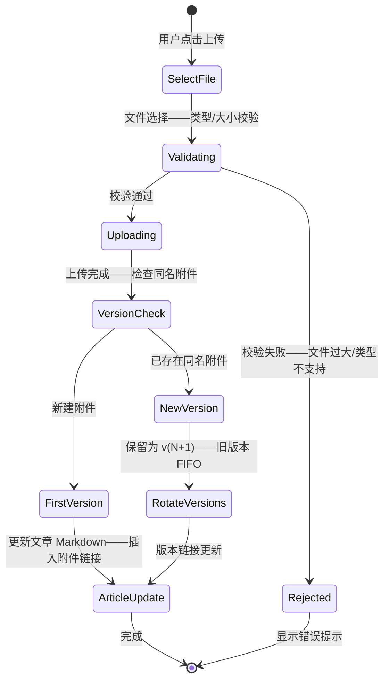

# YK-09-187: 内容附件管理 — 上传/下载、文件类型图标、文件大小显示、附件版本历史、附件搜索、批量下载

> 需求编号：YK-09-187 · 优先级：P2 · 人天：0.3d · 状态：需求已编写
> 依赖：YiAi 文件服务（read-file/write-file 端点）— 附件上传下载依赖文件服务；YK-09-117（多媒体内容管理）— 附件是多媒体管理的补充

## 背景

### 问题陈述

YiKnowledge 知识文章经常需要附加文件——PDF 规范文档、Excel 数据表、ZIP 示例代码包、PPT 演示文稿——目前附件管理能力薄弱：

1. **附件仅作为 Markdown 链接**：附件在文章中仅是 `[文件名](/files/xxx.pdf)` 链接——无预览——无文件图标——无大小信息——无法区分文件类型
2. **无集中附件视图**：需要找到某篇文档中附带的 Excel 表——必须记得是哪篇文章——逐篇查找——无法按文件类型/日期/名称浏览所有附件
3. **无版本管理**：上传新版本替换旧附件——旧版本丢失——无法回退到之前版本——无法对比版本差异
4. **无批量操作**：下载文章所有附件需逐个点击——50 个附件需要 50 次点击
5. **附件元数据缺失**：看不到上传时间/上传者/文件大小/下载次数——管理决策缺数据支撑
6. **无搜索附件**：无法按文件名/类型/日期搜索附件——知识库内找文件如大海捞针

**核心矛盾**：附件是知识文章的重要组成部分——但目前附件管理仍停留在基础文件链接级别——缺少管理、搜索、版本化和批量操作能力。

### 影响范围

| # | 影响 | 严重程度 | 典型场景 |
|---|------|----------|----------|
| 1 | 附件浏览体验差 | 高 | 文章中 5 个 PDF 附件——都是 `[file.pdf]` 链接——无法区分——无预览 |
| 2 | 文件查找困难 | 高 | 管理员需要找某规范文档 PDF——从此 50 篇文章中查找——逐一打开 |
| 3 | 版本混乱 | 高 | 上传了 v2、v3 ——删除旧版本——想对比 v1 和 v3 ——v1 已不可恢复 |
| 4 | 批量下载不便 | 中 | 下载所有附件需要逐个点击——反馈集锦的 50 张截图 |
| 5 | 无使用数据分析 | 低 | 不知道哪些附件被下载最多——哪些从未下载——清理决策无依据 |

### 挑战

| 挑战 | 说明 |
|------|------|
| 版本存储策略 | 每次更新保留旧版本——存储空间增长——需要版本数量上限或时间窗口清理 |
| 批量下载实现 | 浏览器无法同时下载多个文件——顺序下载 or JSZip 打包——打包需异步生成 |
| 文件类型检测 | 魔数检测（可靠） vs 扩展名（简单）——大文件流式检测性能 |
| 文件预览 | PDF 预览使用 `<iframe>` ——Office 文档需要 Office Online 或转换——复杂 |
| 搜索性能 | 附件数量多时——前端过滤 vs 后端索引——权衡 |

---

## 一、现状分析

### 1.1 当前附件处理方式

```
YiKnowledge 附件管理现状:
├── Markdown 内联链接
│   ├── `[附件名](/files/xxx.pdf)`——基础 Markdown 链接
│   ├── 无文件类型图标——所有链接看起来一样
│   ├── 无文件大小——不知道下载耗时
│   └── 限制: 纯链接——无管理界面——无搜索——无批量
├── 附着于文章
│   ├── 附件仅存在于文章内容中——无独立管理
│   └── 限制: 无法全局浏览——无法按类型/日期筛选
├── 无版本历史
│   └── 限制: 覆盖上传——旧版本丢失——无追索
├── 无下载统计
│   └── 限制: 附件使用情况不可见——管理决策缺数据
└── 无批量操作
    └── 限制: 逐个下载——大量附件时体验差
```

### 1.2 当前数据流

```mermaid
sequenceDiagram
    participant User as 用户
    participant Article as 文章页面
    participant Link as Markdown 链接
    participant Server as YiAi 文件服务

    User->>Article: 打开文章
    Article-->>User: 显示 `[file.pdf](/files/xxx.pdf)` 链接
    User->>Link: 点击链接
    Article->>Server: 浏览器直接请求 /files/xxx.pdf
    Server-->>User: 浏览器下载文件
    Note over Article,Server: 问题: 无图标——无大小——无版本——无搜索——无批量——附件即链接
```

### 1.3 根因矩阵

| 症状 | 根因 | 触发条件 | 频率 |
|------|------|----------|------|
| 附件无差异化显示 | 无文件类型图标——无大小——无元数据展示 | 任何带附件的文章 | 高 |
| 文件查找困难 | 无全局附件索引——无搜索——无筛选 | 管理/查找附件 | 高 |
| 版本不可回溯 | 覆盖上传——无版本保留机制 | 附件更新时 | 中 |
| 批量下载低效 | 无打包下载——无多选操作 | 需要下载多个附件 | 中 |
| 无使用分析 | 无下载计数——无统计 | 评估附件价值 | 低 |

---

## 二、设计决策

### 决策 1：附件列表展示 — 简单列表 vs 卡片 vs 表格

| 选项 | 信息密度 | 视觉识别 | 适合场景 |
|------|---------|---------|---------|
| A: 简单列表（图标+文件名+大小+下载） | 中——每行一个 | 好——图标区分类型 | 附件少(<10)的文章 |
| B: 卡片网格（图标+文件名+大小+预览） | 低——空间大 | 好——视觉突出 | 附件多——重视觉 |
| C: 表格（可排序列） | 高——可排序 | 中——图标小 | 管理面板——大量附件 |

**选择：A+C 混合（文章中列表——管理面板表格）。** 文章底部附件列表使用简单列表——图标+文件名+大小+日期+下载按钮——不超过 3 行附件信息。全局附件管理面板使用表格——可排序（文件名/类型/大小/日期/下载次数）——支持多选批量操作。

### 决策 2：版本历史策略 — N 版本保留 vs 时间窗口 vs 仅最后版本

| 选项 | 存储开销 | 版本可回溯 | 管理复杂度 |
|------|---------|-----------|-----------|
| A: 保留最近 5 个版本 | 中等——5 × 文件大小 | 好——可回溯到之前版本 | 中 |
| B: 30 天内所有版本 | 不可控——取决于更新频率 | 好——时间维度回溯 | 中 |
| C: 仅当前版本——覆盖式 | 最小 | 无 | 低 |

**选择：A（保留最近 5 个版本——FIFO）。** 5 个版本在回溯能力和存储开销间平衡。第 6 个版本上传时——最旧的版本自动删除。版本列表显示上传时间和文件大小——用户可选择恢复任意历史版本。

### 决策 3：批量下载 — JSZip 打包 vs 顺序下载 vs 浏览器扩展

| 选项 | 用户体验 | 内存占用 | 实现复杂度 |
|------|---------|---------|-----------|
| A: JSZip 打包为一个 ZIP——单个下载 | 最好——一次点击 | 高——所有文件加载到内存 | 中 |
| B: 顺序触发多个下载 | 差——N 次下载对话框 | 低 | 低 |
| C: 服务端打包——返回 ZIP URL | 好——一次点击 | 低——服务端处理 | 高（需后端改动） |

**选择：A（JSZip 前端打包 + 服务端备选）。** 附件总大小 < 50MB 时使用前端 JSZip 打包——用户一次下载 ZIP。超过 50MB 时切换为服务端打包——避免浏览器内存问题。JSZip 支持 Blob/ArrayBuffer 输入——可并行 fetch 多个附件。

### 决策 4：文件类型图标 — 自绘 SVG vs 图标库 vs Unicode

| 选项 | 视觉质量 | 文件类型覆盖 | 包大小 |
|------|---------|------------|--------|
| A: 自绘 SVG（PDF/DOC/XLS/ZIP/IMG/CODE/OTHER） | 好——可定制 | 7 种基础类型 | ~2KB |
| B: file-icon 图标库 | 优秀——数百种 | 极高 | ~50KB |
| C: Unicode emoji 📄📊📦 | 中——系统依赖 | 有限 | 0 |

**选择：A（自绘 SVG——7 种基础文件类型图标 + "OTHER" 兜底）。** 知识库附件主要类型：PDF、Word(.docx)、Excel(.xlsx)、PowerPoint(.pptx)、ZIP、图片(.png/.jpg)、代码(.py/.js/.ts)——共 7 种。每种设计一个 24×24 SVG 图标——内联到组件中。无法识别的类型显示默认"文件"图标——扩展名显示在图标下方或旁边。

---

## 三、目标架构

### 3.1 附件管理系统架构

```mermaid
graph TD
    subgraph ArticleAttachments[文章附件展示]
        A[AttachmentList——文章底部附件列表]
        B[AttachmentItem——单个附件——图标+信息+操作]
        C[UploadButton——上传新附件]
    end

    subgraph GlobalAttachmentManager[全局附件管理面板]
        D[AttachmentPanel——管理面板主页]
        E[AttachmentTable——可排序表格]
        F[SearchFilter——搜索+类型/日期过滤]
        G[BatchActions——批量操作工具栏]
        H[VersionDrawer——版本历史抽屉]
    end

    subgraph Services[附件服务层]
        I[AttachmentService——API 调用封装]
        J[VersionManager——版本管理——保留5版本]
        K[TypeDetector——文件类型检测——魔数+扩展名]
        L[ZipPacker——JSZip 批量打包]
    end

    subgraph Storage[存储层]
        M[YiAi 文件服务——read-file/write-file]
        N[VersionStorage——版本文件存储——v{1..5}]
    end

    A --> B
    A --> C
    B --> I

    D --> E
    D --> F
    D --> G
    E --> H

    I --> J
    I --> K
    I --> L
    J --> N
    L --> M
    L --> N
```

### 3.2 附件上传+版本管理流程



### 3.3 性能指标

| 指标 | 改造前 | 改造后 |
|------|--------|--------|
| 查找附件时间 | 逐篇打开文章——5-10 分钟 | 搜索+过滤——< 10 秒 |
| 附件版本回溯 | 无——覆盖上传 | 5 版本历史——一键恢复 |
| 批量下载 10 个附件 | 逐个点击——10 次操作 | JSZip 打包——1 次点击——等待打包 |
| 附件信息可见性 | 仅文件名 | 图标/类型/大小/日期/版本/下载次数 |

---

## 四、具体改动

### 4.1 核心代码：附件服务 Composable

```typescript
// src/composables/useAttachmentManager.ts

interface AttachmentMeta {
  id: string;
  fileName: string;
  fileType: AttachmentType;  // pdf|word|excel|ppt|zip|image|code|other
  fileSize: number;          // bytes
  uploadedAt: string;        // ISO date
  uploadedBy?: string;       // 上传者
  downloadCount: number;     // 下载次数
  version: number;           // 当前版本号
  articlePath: string;       // 关联文章路径
  tags?: string[];           // 标签
}

type AttachmentType = 'pdf' | 'word' | 'excel' | 'ppt' | 'zip' | 'image' | 'code' | 'other';

interface VersionRecord {
  version: number;
  uploadedAt: string;
  fileSize: number;
  storagePath: string;       // 文件存储路径
}

interface AttachmentFilter {
  keyword?: string;          // 文件名搜索
  types?: AttachmentType[];  // 类型过滤
  dateFrom?: string;
  dateTo?: string;
  sortBy?: 'name' | 'type' | 'size' | 'date' | 'downloads';
  sortOrder?: 'asc' | 'desc';
}

export function useAttachmentManager() {
  const attachments = ref<AttachmentMeta[]>([]);
  const isUploading = ref(false);
  const isPacking = ref(false);
  const uploadProgress = ref(0);

  /** 获取文章的所有附件 */
  async function fetchArticleAttachments(articlePath: string): Promise<AttachmentMeta[]> {
    const response = await fetch(`/api/attachments?article=${encodeURIComponent(articlePath)}`);
    const data = await response.json();
    attachments.value = data.attachments ?? [];
    return attachments.value;
  }

  /** 获取所有附件（全局管理面板） */
  async function fetchAllAttachments(filter?: AttachmentFilter): Promise<AttachmentMeta[]> {
    const params = new URLSearchParams();
    if (filter?.keyword) params.set('keyword', filter.keyword);
    if (filter?.types?.length) params.set('types', filter.types.join(','));
    if (filter?.dateFrom) params.set('dateFrom', filter.dateFrom);
    if (filter?.dateTo) params.set('dateTo', filter.dateTo);
    if (filter?.sortBy) params.set('sortBy', filter.sortBy);
    if (filter?.sortOrder) params.set('sortOrder', filter.sortOrder);

    const response = await fetch(`/api/attachments/all?${params}`);
    const data = await response.json();
    attachments.value = data.attachments ?? [];
    return attachments.value;
  }

  /** 上传附件——自动处理版本 */
  async function uploadAttachment(file: File, articlePath: string): Promise<AttachmentMeta> {
    isUploading.value = true;
    uploadProgress.value = 0;

    const formData = new FormData();
    formData.append('file', file);
    formData.append('article_path', articlePath);

    try {
      const response = await fetch('/api/attachments/upload', {
        method: 'POST',
        body: formData,
      });
      const result = await response.json();
      uploadProgress.value = 100;
      return result.attachment;
    } finally {
      isUploading.value = false;
      uploadProgress.value = 0;
    }
  }

  /** 获取附件的版本历史 */
  async function getVersionHistory(attachmentId: string): Promise<VersionRecord[]> {
    const response = await fetch(`/api/attachments/${attachmentId}/versions`);
    const data = await response.json();
    return data.versions ?? [];
  }

  /** 恢复历史版本 */
  async function restoreVersion(attachmentId: string, version: number): Promise<void> {
    await fetch(`/api/attachments/${attachmentId}/versions/${version}/restore`, {
      method: 'POST',
    });
  }

  /** 批量下载——JSZip 打包 */
  async function batchDownload(attachmentIds: string[]): Promise<void> {
    if (attachmentIds.length === 0) return;
    isPacking.value = true;

    try {
      // 单文件——直接下载
      if (attachmentIds.length === 1) {
        downloadSingle(attachmentIds[0]);
        return;
      }

      // 多文件——JSZip 打包
      const JSZip = (await import('jszip')).default;
      const zip = new JSZip();

      const totalSize = attachments.value
        .filter(a => attachmentIds.includes(a.id))
        .reduce((sum, a) => sum + a.fileSize, 0);

      // 总大小 > 50MB——切到服务端打包
      if (totalSize > 50 * 1024 * 1024) {
        await serverSidePackDownload(attachmentIds);
        return;
      }

      const results = await Promise.all(attachmentIds.map(id =>
        fetch(`/files/${id}`).then(r => r.blob())
      ));
      for (let i = 0; i < attachmentIds.length; i++) {
        const meta = attachments.value.find(a => a.id === attachmentIds[i]);
        zip.file(meta?.fileName ?? `file-${i}`, results[i]);
      }

      const zipBlob = await zip.generateAsync({ type: 'blob' });
      downloadBlob(zipBlob, 'attachments.zip');
    } finally {
      isPacking.value = false;
    }
  }

  /** 单文件下载 */
  function downloadSingle(attachmentId: string) {
    const meta = attachments.value.find(a => a.id === attachmentId);
    if (!meta) return;
    const a = document.createElement('a');
    a.href = `/files/${attachmentId}`;
    a.download = meta.fileName;
    a.click();
  }

  /** 服务端打包下载 */
  async function serverSidePackDownload(attachmentIds: string[]): Promise<void> {
    const response = await fetch('/api/attachments/batch-download', {
      method: 'POST',
      headers: { 'Content-Type': 'application/json' },
      body: JSON.stringify({ ids: attachmentIds }),
    });
    const { downloadUrl } = await response.json();
    window.open(downloadUrl, '_blank');
  }

  function downloadBlob(blob: Blob, filename: string) {
    const url = URL.createObjectURL(blob);
    const a = document.createElement('a');
    a.href = url;
    a.download = filename;
    a.click();
    URL.revokeObjectURL(url);
  }

  return {
    attachments, isUploading, isPacking, uploadProgress,
    fetchArticleAttachments, fetchAllAttachments,
    uploadAttachment, getVersionHistory, restoreVersion,
    batchDownload, downloadSingle,
  };
}
```

### 4.2 文件变更清单

| 文件 | 操作 | 说明 |
|------|------|------|
| `src/composables/useAttachmentManager.ts` | 新增 | 附件管理——上传/下载/版本/批量/搜索 |
| `src/components/AttachmentManager/AttachmentList.vue` | 新增 | 文章底部附件列表——图标+信息+下载 |
| `src/components/AttachmentManager/AttachmentItem.vue` | 新增 | 单个附件行——文件图标+名称+大小+日期+操作 |
| `src/components/AttachmentManager/AttachmentPanel.vue` | 新增 | 全局附件管理面板——表格+搜索+批量操作 |
| `src/components/AttachmentManager/VersionHistoryDrawer.vue` | 新增 | 版本历史抽屉——版本列表+恢复+下载 |
| `src/components/AttachmentManager/AttachmentSearch.vue` | 新增 | 附件搜索栏——关键词+类型过滤+日期范围 |
| `src/components/AttachmentManager/BatchActionBar.vue` | 新增 | 批量操作工具栏——全选/下载/删除 |
| `src/components/AttachmentManager/FileTypeIcon.vue` | 新增 | 文件类型图标组件——7 种类型 SVG |

---

## 五、实施步骤

| 步骤 | 操作 | 路径 | 验证 | 人天 |
|------|------|------|------|------|
| 1 | 实现附件 API 服务层 | `useAttachmentManager.ts` | 上传/下载/列表/版本——fetch 请求封装 | 0.06 |
| 2 | 实现文章底部附件列表 | `AttachmentList.vue` + `AttachmentItem.vue` | 图标+名称+大小+日期+下载按钮 | 0.05 |
| 3 | 实现全局附件管理面板 | `AttachmentPanel.vue` + `AttachmentTable.vue` | 可排序表格——搜索过滤——批量操作 | 0.06 |
| 4 | 实现文件类型图标 | `FileTypeIcon.vue`——7 种 SVG | PDF/Word/Excel/PPT/ZIP/Image/Code/Other | 0.03 |
| 5 | 实现版本管理 | `VersionHistoryDrawer.vue` + version API | 版本列表——恢复——文件大小对比 | 0.05 |
| 6 | 实现批量下载 | `batchDownload` —— JSZip 打包 | 多选→下载 ZIP——>50MB 服务端打包 | 0.05 |

**总人天：0.3d**

---

## 六、测试规格

### 测试 1：附件上传——自动版本化

| 项目 | 内容 |
|------|------|
| 优先级 | P0 |
| 前置条件 | 文章已存在 `spec.pdf` 附件——版本 v1 |
| 测试步骤 | 1. 点击上传按钮 2. 选择同名的 `spec_v2.pdf` 3. 等待上传完成 4. 检查附件版本号 |
| 预期结果 | 上传后附件版本变为 v2——文章中的链接仍指向最新版本——版本历史中有 v1 和 v2 两个版本 |

### 测试 2：附件列表——类型图标+信息展示

| 项目 | 内容 |
|------|------|
| 优先级 | P0 |
| 前置条件 | 文章有 5 个不同类型附件 |
| 测试步骤 | 1. 查看文章底部附件列表 2. 观察各附件的图标——PDF/Excel/ZIP/Image 3. 检查文件大小格式 |
| 预期结果 | PDF 显示红色 PDF 图标——Excel 显示绿色 Excel 图标——ZIP 显示包装图标——每个附件显示文件大小(自动格式化 KB/MB/GB)和上传日期——下载按钮 |

### 测试 3：全局附件管理——搜索+过滤

| 项目 | 内容 |
|------|------|
| 优先级 | P0 |
| 前置条件 | 全局附件管理面板——至少 20 个附件 |
| 测试步骤 | 1. 搜索框输入"规范" 2. 观察结果过滤 3. 清除搜索——添加类型过滤 PDF 4. 添加日期范围 |
| 预期结果 | 搜索"规范"——仅显示文件名含"规范"的附件——类型过滤 PDF——仅显示 PDF——日期范围过滤进一步缩小结果——清空过滤恢复全部 |

### 测试 4：版本历史——查看+恢复

| 项目 | 内容 |
|------|------|
| 优先级 | P1 |
| 前置条件 | 附件有 3 个版本——v1/v2/v3 |
| 测试步骤 | 1. 点击"版本历史"按钮 2. 查看 3 个版本列表 3. 选择 v1——点击恢复 4. 检查当前版本 |
| 预期结果 | 版本列表显示 3 个版本的时间戳和文件大小——恢复 v1 后当前版本变为 v4（从 v1 恢复生成新版本） |

### 测试 5：批量下载——JSZip 打包

| 项目 | 内容 |
|------|------|
| 优先级 | P1 |
| 前置条件 | 勾选 3 个附件——总大小 < 50MB |
| 测试步骤 | 1. 批量选择 3 个附件 2. 点击"批量下载" 3. 等待打包完成 4. 解压 ZIP 查看内容 |
| 预期结果 | 打包过程显示 loading——完成后触发浏览器下载 `attachments.zip`——解压后 3 个文件都在——文件名保持原样 |

### 测试 6：上传校验——文件类型+大小限制

| 项目 | 内容 |
|------|------|
| 优先级 | P1 |
| 前置条件 | 附件上传配置——允许类型 PDF/Word/Excel/PPT/ZIP/Image——最大 20MB |
| 测试步骤 | 1. 上传 `.exe` 文件 2. 上传 50MB ZIP 3. 上传 15MB PDF |
| 预期结果 | `.exe` 上传时提示"不支持的文件类型"——50MB ZIP 提示"文件过大——最大 20MB"——15MB PDF 上传成功 |

---

## 七、风险与缓解

| 风险 | 概率 | 影响 | 缓解措施 |
|------|------|------|------|
| JSZip 内存——大量/大文件打包——浏览器 OOM | 中 | 高 | 总大小 > 50MB 时自动切换为服务端打包——前端仅处理小批量 |
| 附件版本越多存储消耗线性增长 | 中 | 中 | 最多 5 个版本——清理策略：删除前 2 个版本仅保留最新 3 个——可配置 |
| 文件类型检测不准——重命名扩展名绕过 | 低 | 低 | 前端检测魔数（文件二进制头部）——后端双验证——不一致时拒绝上传 |
| 批量操作误删附件 | 低 | 高 | 删除操作需二次确认——显示将删除的附件列表——批量删除暂存入回收站——30 天内可恢复 |
| 上传大文件超时 | 中 | 中 | 20MB 限制——超过显示明确提示——分片上传备选方案——进度条显示 |

---

## 八、回滚策略

1. **功能级回滚**：附件管理面板路由取消——附件仍以 Markdown 链接在文章中正常展示和下载
2. **数据级回滚**：所有已上传附件保留在文件系统中——版本历史可导出——不影响附件链接
3. **代码级回滚**：移除 AttachmentManager 组件——恢复简单 Markdown 链接渲染
4. **回滚验证**：文章中附件链接正常——点击链接正常下载——无 404——文章内容完整

---

## 九、设计决策记录

### D-01：JSZip 前端打包——轻量附件场景

**上下文**：批量下载是高频操作——每次请求服务端打包增加负载。

**决策**：< 50MB 时前端 JSZip 打包——> 50MB 自动切服务端打包。

**理由**：多数批量下载场景是 3-10 个小文件（总共 < 20MB）——前端 JSZip 打包无需服务器额外计算和存储。50MB 阈值基于浏览器内存安全——超过时服务端流式打包——不占用浏览器内存。

### D-02：5 版本 FIFO——平衡历史与存储

**上下文**：每次更新附件是否需要保留旧版本——保留多少个。

**决策**：保留最近 5 个版本——新版本淘汰最旧版本——恢复历史版本生成新版本。

**理由**：5 个版本覆盖大多数回溯场景——存储开销可控（5 × 文件平均大小）。恢复 v1 不是覆盖当前版本而是生成 v(N+1)——确保版本线完整——不丢失中间版本。

### D-03：7 种文件类型 SVG 图标——覆盖 95% 附件

**上下文**：文件类型图标需要直观——又不能每个扩展名一个图标。

**决策**：7 种基础类型 SVG + "OTHER" 兜底——具体扩展名以文本显示在图标下方。

**理由**：知识库附件主要为文档格式（PDF/Word/Excel/PPT）和资源格式（ZIP/Image/Code）——7 种类型覆盖 95% 场景。自定义 SVG 保持视觉风格一致。

### D-04：魔数 + 扩展名双重文件类型检测

**上下文**：用户可能重命名 `.exe` 为 `.pdf` 绕过类型检查。

**决策**：前端读取文件二进制头部（魔数）——后端同样检测——不一致时拒绝。

**理由**：扩展名检查简单但不可靠——魔数检测更准确（PDF 头部 = `%PDF`——ZIP 头部 = `PK` ——JPEG 头部 = `FF D8 FF`）。双重检测减少误判——保障安全。

---

## 十、可观测性

| 指标 | 采集方式 | 阈值 |
|------|----------|------|
| 附件上传耗时 | uploadAttachment——从开始到完成 | < 5s (20MB——内网) |
| 上传失败率 | catch 次数/总上传 | < 2% |
| 批量下载打包耗时 | JSZip generateAsync 时间 | < 3s (< 50MB) |
| 版本恢复次数 | restoreVersion 调用计数 | — |
| 搜索响应时间 | fetchAllAttachments——从输入到结果 | < 100ms |
| 附件总数 | attachments.length——全局 | — |
| 总存储大小 | 所有附件 fileSize 之和 | — |

---

## 十一、代码审查检查清单

- [ ] `uploadAttachment`——`file` 参数为空/null 时——early return——不发起请求
- [ ] `uploadAttachment`——`articlePath` 校验——不存在时报错
- [ ] `batchDownload`——空数组 early return——不触发下载
- [ ] `batchDownload`——下载 Blob URL 使用后 `revokeObjectURL`——防止内存泄露
- [ ] `batchDownload`——JSZip 动态 import——非全量导入——使用时加载
- [ ] `downloadSingle`——`attachmentId` 不存在对应 meta——console.warn——不触发下载
- [ ] 文件类型检测——魔数检查失败——回退到扩展名——两者都不匹配标记为 `other`
- [ ] 版本恢复——create new version from old version——非原地替换——版本线完整
- [ ] 上传进度——使用 `XMLHttpRequest.upload.onprogress` 或 `fetch` ReadableStream
- [ ] 批量操作——删除前二次确认——显示受影响附件列表
- [ ] TypeScript——`AttachmentType` 联合类型——所有 switch/case 穷举
- [ ] 文件大小格式化——B/KB/MB/GB 自动选择单位——小数点后 1 位

---

## 回归问题预测

| # | 预测问题 | 触发条件 | 检测方式 |
|---|----------|----------|----------|
| 1 | 版本历史中复制的旧版本——恢复后文件名不带版本号——用户不知道恢复的是哪个版本 | 文件名 `spec.pdf`——恢复 v1 后新版本仍叫 `spec.pdf`——表面看无变化 | 恢复时文件名自动追加版本号 `spec_v1_restored.pdf` ——或显示"已从 v1 恢复（当前版本 v4）" |
| 2 | 全局附件管理和文章附件列表的数据不一致——上传新附件后文章列表更新——管理面板未刷新——两处显示不同 | 在文章页面上传附件——跳转到管理面板——附件列表未包含新上传的 | 全局刷新——管理面板打开时强制 fetch——或使用 event bus / provide/inject 传递刷新信号 |
| 3 | 批量下载中——用户关闭页面——JSZip 打包中断——ZIP 文件损坏——浏览器下载不完整文件 | 打包耗时 3s——用户等不及关闭标签页 | 打包使用 `navigator.sendBeacon` 不可行——至少在 `beforeunload` 时警告"正在打包——确定离开？" |
| 4 | 附件搜索——输入拼音搜索中文文件名——匹配不到 | 文件名"需求文档.pdf"——用户搜索"xuqiu"——无匹配 | 搜索支持拼音首字母——或后端支持拼音搜索——初始阶段前端仅支持包含匹配——明确说明搜索规则 |
| 5 | 上传同名但不同格式的文件——版本管理误判为同一文件的更新 | `spec.pdf` 已有——上传 `spec.docx`——系统认为更新 `spec` 附件——实际是两个独立附件 | 版本匹配使用 `fileName + extension` 组合键——或 `file path + name`——不同扩展名视为不同附件 |
| 6 | 服务端打包下载——生成临时 ZIP 存储在服务器——长时间不被清理——磁盘空间泄漏 | 服务端打包后临时 ZIP 未自动清理——多次批量下载累积 | 服务端 ZIP 添加 TTL（1 小时自动删除）——或下载后立即删除——或定时清理任务——前端下载后不依赖服务器保留 |

---

## 性能分析

| 操作 | 数据量 | 耗时 | 说明 |
|------|--------|------|------|
| 加载文章附件列表（10 个） | JSON + 10 个元数据 | < 50ms | fetch——渲染 10 个 AttachmentItem |
| 加载全局附件表格（200 个） | JSON 列表 + DOM 渲染 | < 300ms | 分页 50 条/页——虚拟滚动备选 |
| 单文件上传（15MB） | 15MB File | 2-5s | 取决于网络——内网 < 2s |
| 获取版本历史（5 个版本） | 5 条 VersionRecord | < 30ms | fetch + 渲染 |
| 批量下载打包（3 文件——15MB） | 15MB——JSZip | 3-8s | 取决于网络——打包本身 < 500ms |
| 服务端批量下载 | N 个文件——服务端打包 | 5-15s | 取决于文件总大小和数量 |
| 搜索过滤（200 个附件） | Array.filter | < 5ms | 纯前端——字符串匹配 |
| 文件类型图标渲染 | 7 个内联 SVG | < 1ms | 无网络请求——instant |

---

## 相关文档

- [文件上传与管理](../../yivad/requirements/2026-09/28-需求-文件上传与管理.md) — YiVad 文件服务——附件上传依赖
- [多媒体内容管理](../117-需求-多媒体内容管理.md) — 附件是多媒体管理的组成部分
- [内容全局搜索优化](../172-需求-内容全局搜索优化.md) — 附件搜索复用搜索基础设施

*PRD 来源: `projects/yiknowledge/requirements/2026-09/187-需求-内容附件管理.md`*