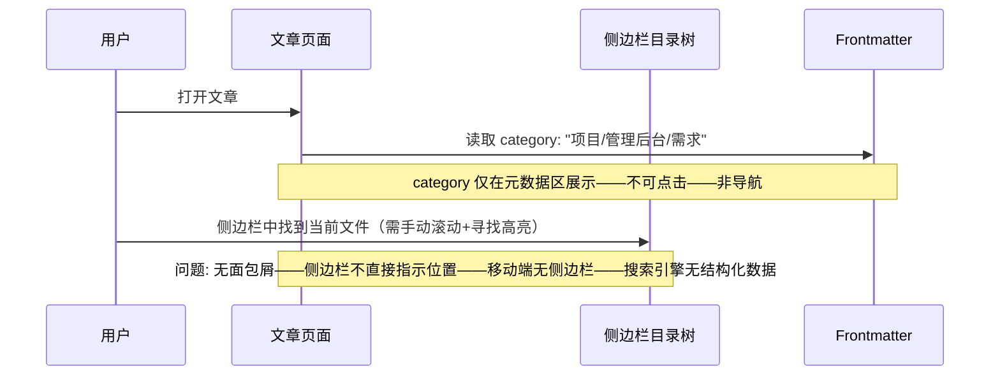
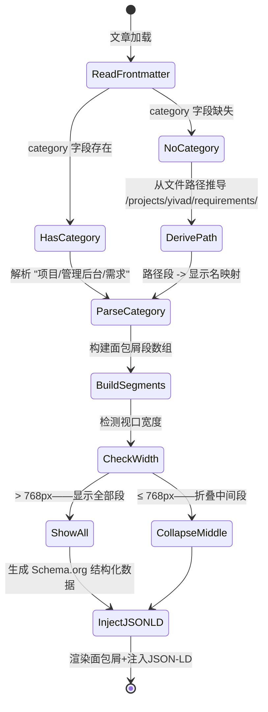

# YK-09-188: 内容导航面包屑 — 分类层级路径、可点击分段、内容路径动态生成、移动端响应式折叠、Schema.org 结构化标记

> 需求编号：YK-09-188 · 优先级：P2 · 人天：0.3d · 状态：需求已编写
> 依赖：YK-09-112（内容导航树优化——面包屑与导航树共享分类层级数据）、YK-09-31（面包屑与导航系统——YiVad 已有面包屑——可参考样式和组件结构）

## 背景

### 问题陈述

YiKnowledge 知识文章具有多级分类结构（如 `curator/governance/readiness-checklist.md`）——但当前页面缺乏面包屑导航来体现这种层级关系：

1. **位置感缺失**：用户阅读 `readiness-checklist.md` 时——不知道它在知识库中的位置——无法快速跳转到上级目录 `governance/` 或同级的其他文件
2. **层级不直观**：文章标题下面没有分类路径提示——用户只能通过 URL 或侧边栏猜测所在分类——深层嵌套时尤其困惑
3. **无法快速向上导航**：阅读了 10 分钟——想回退到上一级——需要点击侧边栏逐级收起——或使用浏览器后退（退出页面）——都打断阅读流
4. **移动端侧边栏隐藏——面包屑缺失**：移动端侧边栏默认隐藏——用户连侧边栏都无法参考——完全不知道自己在哪里
5. **搜索引擎无法理解层级**：缺少 Schema.org BreadcrumbList 标记——搜索引擎爬虫无法理解内容层级——影响结构化搜索结果展示

**核心矛盾**：面包屑看似简单——但需要在移动端折叠适配——动态生成多层路径——同时满足无障碍和 SEO 结构化数据——而非简单的 HTML `<ol>` 列表。

### 影响范围

| # | 影响 | 严重程度 | 典型场景 |
|---|------|----------|----------|
| 1 | 无位置感——深层内容难以定位 | 高 | 三级目录下的文章——名称可能重复——用户不确定在哪 |
| 2 | 无法快速向上导航 | 高 | 阅读完——想看同一分类的其他文章——无快捷方式 |
| 3 | 移动端迷失 | 中 | 移动端阅读——无侧边栏——不知道位置——无法跳转 |
| 4 | 搜索引擎结果不理想 | 中 | Google 搜索结果仅显示标题——无层级路径——点击率低 |
| 5 | 知识库结构不透明 | 中 | 新用户——面对大量文章——不理解分类体系——面包屑教学分类结构 |

### 挑战

| 挑战 | 说明 |
|------|------|
| 分类路径解析 | YiKnowledge 目录结构 → 面包屑层级——读取 frontmatter `category` 字段或从文件路径推导 |
| 中间层级页面 | 分类目录页（如 `curator/governance/`）没有独立页面——面包屑中段无法点击——或需要生成中间索引页 |
| 移动端折叠 | 深层路径 5-6 级——375px 宽度显示不下——折叠中间段——显示首尾 |
| Schema.org JSON-LD | 与 HTML 面包屑分离——通过 `<script type="application/ld+json">` 注入 |
| 动态 vs 静态 | YiKnowledge 是静态渲染还是动态加载——决定面包屑生成时机——SSG 需构建时生成——CSR 需运行时计算 |

---

## 一、现状分析

### 1.1 当前导航方式

```
YiKnowledge 面包屑导航现状:
├── 无面包屑组件
│   └── 限制: 文章页面仅显示标题——无分类路径——无向上导航
├── 侧边栏目录树（YK-09-112）
│   ├── 提供全局目录树——可展开/收起
│   └── 限制: 侧边栏不直接显示当前文章在树中的位置——需用户手动找到高亮项
├── 文章元数据
│   ├── frontmatter 中有 `category` 字段
│   │   └── 格式: "项目/管理后台/需求" 或 "角色/架构师/模式"
│   └── 限制: `category` 仅在元数据区显示——非导航元素——不可点击
├── URL 路径
│   ├── `/knowledge/projects/yivad/requirements/2026-09/170-xxx`
│   └── 限制: URL 包含路径信息——但无 UI 展示——用户通常不看地址栏
└── 无 Schema.org 结构化数据
    └── 限制: 搜索引擎无法展示面包屑搜索结果
```

### 1.2 当前数据流



### 1.3 根因矩阵

| 症状 | 根因 | 触发条件 | 频率 |
|------|------|----------|------|
| 无位置感 | 无面包屑导航——文章页面无分类层级展示 | 任何文章页面 | 高 |
| 无法向上跳转 | 无快捷导航——只能侧边栏或浏览器后退 | 看完想回上级 | 高 |
| 移动端迷失 | 移动端无侧边栏——无面包屑——无任何导航 | 移动端浏览 | 高 |
| SEO 结构化数据缺失 | 无 Schema.org BreadcrumbList | 搜索引擎爬取 | 中 |
| 分类结构不透明 | 新用户无面包屑引导——不理解层级 | 新用户访问 | 中 |

---

## 二、设计决策

### 决策 1：面包屑数据源 — frontmatter category vs 文件路径 vs 混合

| 选项 | 准确性 | 中间层级可点击 | 维护成本 |
|------|--------|-------------|---------|
| A: frontmatter `category` 字段 | 高——作者明确标注 | 需中间索引页 | 中——需维护 `category` |
| B: 文件系统路径推导 | 自动——无需手动维护 | 相同问题 | 低——自动 |
| C: 混合——category 优先 + 路径 fallback | 高——自动回退 | 需中间索引页 | 中 |

**选择：C（混合——`category` 优先——文件路径 fallback）。** frontmatter 中的 `category` 是作者意图的精确表达（可能不同于文件路径）——优先使用。`category` 缺失时从文件路径推导。分类层级中的每一级需要对应一个索引页面（或自动生成）——使面包屑中段可点击。

### 决策 2：中间层级页面 — 无 vs 自动生成 vs 手动创建

| 选项 | 点击体验 | 维护成本 | SEO 价值 |
|------|---------|---------|---------|
| A: 无中间页面——不可点击——纯展示 | 差——仅首尾可点 | 零 | 低 |
| B: 自动生成分类索引页——显示子目录和文件列表 | 好——每级可点击 | 零——自动 | 高——每级可索引 |
| C: 每个分类需手动创建 `README.md` 或 `INDEX.md` | 好——内容可定制 | 高——需维护 | 高 |

**选择：B（自动生成分类索引页——CLI 端路由 `/category/:path`）。** 0.3d 内手动创建每个分类页不现实。自动生成分类索引页——显示该分类下的子目录和文章列表——点击面包屑中段时跳转。内容自动从目录结构和 frontmatter 生成。

### 决策 3：移动端折叠策略 — 截断 vs 省略中间 vs 下拉展开

| 选项 | 空间效率 | 用户理解 | 实现复杂度 |
|------|---------|---------|-----------|
| A: 截断——只显示最后 2 段——用 `<` 返回 | 最高 | 中——前面的层级不可见 | 低 |
| B: 省略中间——显示首+`...`+尾 | 高 | 中——知道首尾 | 中 |
| C: 折叠为下拉——点击展开全部 | 高——1 行 | 好——可展开看全 | 中 |

**选择：B（省略中间段——显示 `首段 ... 末段`）。** 类似 Google Drive 面包屑——"YiKnowledge / ... / 需求 / 表单条件逻辑" ——省略号可点击展开显示完整路径。节省空间——保留首尾上下文——点击 `...` 可展开。

### 决策 4：Schema.org 标记 — JSON-LD vs Microdata vs RDFa

| 选项 | 实现方式 | 维护性 | SEO 引擎支持 |
|------|---------|--------|------------|
| A: JSON-LD——`<script type="application/ld+json">` | 独立于 HTML——注入 `<script>` 标签 | 好——不污染 HTML | 最优——Google 推荐 |
| B: Microdata——itemscope/itemprop 属性 | 嵌入 HTML 属性 | 中——与 HTML 耦合 | 好——所有引擎支持 |
| C: RDFa | 嵌入 HTML | 差——复杂 | 中 |

**选择：A（JSON-LD——Google 推荐格式）。** JSON-LD 独立于 HTML 结构——通过 `<script>` 标签注入——不污染面包屑组件模板。Google 明确推荐 JSON-LD 作为结构化数据首选格式。一个 `BreadcrumbList` 包含层级中所有 `ListItem`——每个带 `position`/`name`/`item`。

---

## 三、目标架构

### 3.1 面包屑系统架构

```mermaid
graph TD
    subgraph BreadcrumbComponent[面包屑组件]
        A[BreadcrumbNav——面包屑导航容器]
        B[BreadcrumbSegment——单个路径段]
        C[CollapsedEllipsis——移动端折叠"..."按钮]
        D[SegmentDropdown——折叠段展开下拉]
    end

    subgraph DataResolution[数据解析层]
        E[CategoryResolver——分类路径解析器]
        F[PathDeriver——文件路径→分类映射]
        G[CategoryIndex——分类索引页数据]
    end

    subgraph StructuredData[SEO 结构化数据]
        H[JSON-LD Generator——Schema.org BreadcrumbList]
        I[ScriptInjector——<script> 注入到 <head>]
    end

    subgraph Responsiveness[响应式适配]
        J[BreakpointDetector——断点检测 768/480]
        K[CollapseStrategy——折叠策略计算]
    end

    E -->|category 优先| A
    F -->|路径 fallback| E
    G -->|中间段链接| B

    A --> B
    A --> C
    C --> D

    K -->|根据宽度| C
    J --> K

    E --> H
    H --> I
```

### 3.2 面包屑生成流程



### 3.3 性能指标

| 指标 | 改造前 | 改造后 |
|------|--------|--------|
| 位置识别时间 | 需要看地址栏 or 侧边栏滚动 | < 1 秒——面包屑直接展示 |
| 返回上级耗时 | 侧边栏查找+点击 = 5-10s | 点击面包屑段 = < 1s |
| 移动端导航可用性 | 无 | 折叠面包屑——首尾可见——可展开 |
| SEO 结构化数据 | 无 | JSON-LD BreadcrumbList——Google 搜索结果带路径 |

---

## 四、具体改动

### 4.1 核心代码：面包屑 Composable

```typescript
// src/composables/useBreadcrumb.ts

interface BreadcrumbSegment {
  label: string;            // 显示名称——中文
  path: string;             // 路由路径——可点击跳转
  isLast: boolean;          // 是否最后一段——不可点击
  isClickable: boolean;     // 是否有对应索引页
}

interface BreadcrumbOptions {
  /** 移动端断点——小于此宽度触发折叠 */
  collapseBreakpoint?: number;  // 默认 768
  /** 折叠时保留的首尾段数 */
  collapsedHeadCount?: number;  // 默认 1
  collapsedTailCount?: number;  // 默认 1
  /** 路径段显示名称映射 */
  pathLabelMap?: Record<string, string>;
}

export function useBreadcrumb(
  articlePath: string,
  frontmatterCategory: string | undefined,
  options: BreadcrumbOptions = {},
) {
  const segments = ref<BreadcrumbSegment[]>([]);
  const isCollapsed = ref(false);
  const visibleSegments = computed(() => {
    if (!isCollapsed.value) return segments.value;
    return getCollapsedSegments(
      segments.value,
      options.collapsedHeadCount ?? 1,
      options.collapsedTailCount ?? 1,
    );
  });

  const jsonLD = computed(() => generateBreadcrumbJSONLD(segments.value));

  const defaultLabels: Record<string, string> = {
    curator: '知识管理', governance: '治理', projects: '项目知识',
    yivad: '管理后台', yiai: 'AI后端', yipet: '浏览器扩展',
    yiknowledge: '知识库', requirements: '需求', specs: '规范',
    workflows: '工作流', patterns: '模式', failures: '缺陷',
    '2026-07': '2026年7月', '2026-08': '2026年8月', '2026-09': '2026年9月',
    ...options.pathLabelMap,
  };

  function resolve() {
    const segments: BreadcrumbSegment[] = [];

    // 首页
    segments.push({ label: '首页', path: '/', isLast: false, isClickable: true });

    // 确定分类路径
    const category = frontmatterCategory ?? deriveCategoryFromPath(articlePath);
    const parts = category.split('/').filter(Boolean);

    let accumulatedPath = '';
    for (let i = 0; i < parts.length; i++) {
      accumulatedPath += `/${parts[i]}`;
      const label = defaultLabels[parts[i]] ?? parts[i];
      const isLast = i === parts.length - 1;

      segments.push({
        label,
        path: `/category${accumulatedPath}`,
        isLast,
        isClickable: !isLast,  // 最后一段不可点击
      });
    }

    segments.value = segments;
    checkCollapse();
  }

  function deriveCategoryFromPath(path: string): string {
    // 从文件路径推导分类——去除文件名和扩展名
    // /projects/yivad/requirements/2026-09/170-xxx.md → projects/yivad/requirements/2026-09
    const dir = path.split('/').slice(0, -1).join('/');
    return dir.replace(/^\//, '');
  }

  function checkCollapse() {
    const breakpoint = options.collapseBreakpoint ?? 768;
    isCollapsed.value = window.innerWidth < breakpoint;
  }

  function getCollapsedSegments(
    all: BreadcrumbSegment[],
    headCount: number,
    tailCount: number,
  ): BreadcrumbSegment[] {
    if (all.length <= headCount + tailCount + 1) return all;

    const head = all.slice(0, headCount);
    const tail = all.slice(-tailCount);
    return [
      ...head,
      { label: '...', path: '', isLast: false, isClickable: true },  // 点击展开
      ...tail,
    ];
  }

  function generateBreadcrumbJSONLD(segs: BreadcrumbSegment[]): object {
    return {
      '@context': 'https://schema.org',
      '@type': 'BreadcrumbList',
      itemListElement: segs
        .filter(s => !s.label.includes('...'))
        .map((seg, index) => ({
          '@type': 'ListItem',
          position: index + 1,
          name: seg.label,
          item: seg.isClickable ? `https://${window.location.host}${seg.path}` : undefined,
        })),
    };
  }

  /** 注入 JSON-LD 到 <head> —— 在组件 onMounted 中调用 */
  function injectJSONLD() {
    const existing = document.querySelector('script[data-breadcrumb-ld]');
    if (existing) existing.remove();

    const script = document.createElement('script');
    script.type = 'application/ld+json';
    script.setAttribute('data-breadcrumb-ld', '');
    script.textContent = JSON.stringify(jsonLD.value);
    document.head.appendChild(script);
  }

  function removeJSONLD() {
    document.querySelector('script[data-breadcrumb-ld]')?.remove();
  }

  function handleResize() { checkCollapse(); }

  onMounted(() => {
    resolve();
    injectJSONLD();
    window.addEventListener('resize', handleResize);
  });

  onUnmounted(() => {
    removeJSONLD();
    window.removeEventListener('resize', handleResize);
  });

  watch(() => frontmatterCategory, () => resolve());

  return {
    segments, isCollapsed, visibleSegments, jsonLD,
    resolve, injectJSONLD, removeJSONLD,
  };
}
```

### 4.2 文件变更清单

| 文件 | 操作 | 说明 |
|------|------|------|
| `src/composables/useBreadcrumb.ts` | 新增 | 面包屑数据解析——category/路径推导——折叠逻辑——JSON-LD |
| `src/components/Breadcrumb/BreadcrumbNav.vue` | 新增 | 面包屑导航组件——响应式渲染——折叠/展开 |
| `src/components/Breadcrumb/BreadcrumbSegment.vue` | 新增 | 单段——分隔符——可点击段(link)——当前页(span) |
| `src/pages/CategoryIndex.vue` | 新增 | 分类索引页——显示子目录+文章列表——供面包屑中段跳转 |
| `src/types/breadcrumb.ts` | 新增 | 面包屑相关类型 |
| `src/router/categoryRoutes.ts` | 新增 | 分类路由——`/category/:path*` 匹配所有分类 |

---

## 五、实施步骤

| 步骤 | 操作 | 路径 | 验证 | 人天 |
|------|------|------|------|------|
| 1 | 实现面包屑数据解析 | `useBreadcrumb.ts`——category 解析+路径推导 | 多种分类路径正确解析——fallback 正确 | 0.05 |
| 2 | 实现面包屑 UI 组件 | `BreadcrumbNav.vue` + `BreadcrumbSegment.vue` | 渲染层级——分隔符 `>` ——可点击段跳转 | 0.05 |
| 3 | 实现移动端折叠逻辑 | 折叠省略号——点击展开全部 | 768px 以下自动折叠——点 `...` 展开 | 0.04 |
| 4 | 实现分类索引页 | `CategoryIndex.vue`——自动生成 | 访问 `/category/projects/yivad/requirements` ——显示子目录和文章 | 0.06 |
| 5 | 实现 JSON-LD 结构化数据 | `generateBreadcrumbJSONLD` + `injectJSONLD` | `<script type="application/ld+json">` 注入到 `<head>`——Google Rich Results 测试通过 | 0.04 |
| 6 | 集成到所有文章页面 | 文章布局模板——`<BreadcrumbNav>` 置于标题上方 | 所有文章页面显示面包屑——移动端正确折叠 | 0.06 |

**总人天：0.3d**

---

## 六、测试规格

### 测试 1：基础面包屑渲染——三级分类

| 项目 | 内容 |
|------|------|
| 优先级 | P0 |
| 前置条件 | 文章 frontmatter `category: "项目/管理后台/需求"` |
| 测试步骤 | 1. 打开文章页面 2. 观察面包屑导航 |
| 预期结果 | 面包屑显示"首页 > 项目知识 > 管理后台 > 需求 > 表单条件逻辑" ——每段可点击（最后一段除外）——分隔符 `>` 正确——点击"需求"跳转到分类索引页 |

### 测试 2：category 缺失——路径 fallback

| 项目 | 内容 |
|------|------|
| 优先级 | P0 |
| 前置条件 | 文章缺失 `category` 字段——文件路径 `/projects/yivad/requirements/2026-09/170-xxx.md` |
| 测试步骤 | 1. 打开该文章 2. 观察面包屑 |
| 预期结果 | 面包屑显示"首页 > 项目知识 > 管理后台 > 需求 > 2026年9月 > 表单条件逻辑" ——从文件路径推导——显示名使用映射表 |

### 测试 3：可点击段——跳转到分类索引页

| 项目 | 内容 |
|------|------|
| 优先级 | P0 |
| 前置条件 | 面包屑显示多段——分类索引页路由已配置 |
| 测试步骤 | 1. 点击面包屑中的"需求"段 2. 观察页面跳转 |
| 预期结果 | 跳转到 `/category/projects/yivad/requirements` ——显示该分类下的所有文章列表——页面标题"需求" ——子分类有"2026-07/2026-08/2026-09" |

### 测试 4：移动端折叠——省略中间段

| 项目 | 内容 |
|------|------|
| 优先级 | P1 |
| 前置条件 | 面包屑 6 段——视口宽度 375px |
| 测试步骤 | 1. 在移动端打开文章 2. 观察面包屑 3. 点击 `...` |
| 预期结果 | 面包屑折叠显示"首页 > ... > 表单条件逻辑" ——点击 `...` 展开完整面包屑（下拉或内联展开）——展开后有 CSS 过渡动画 |

### 测试 5：JSON-LD 结构化数据注入

| 项目 | 内容 |
|------|------|
| 优先级 | P1 |
| 前置条件 | 文章页面——面包屑组件已挂载 |
| 测试步骤 | 1. 打开文章 2. 查看页面源代码/检查 `<head>` 3. 复制 JSON-LD 到 Google Rich Results Test |
| 预期结果 | `<head>` 中有 `<script type="application/ld+json" data-breadcrumb-ld>` ——内容符合 Schema.org BreadcrumbList 规范 ——Google Rich Results Test 无错误 |

### 测试 6：窗口 resize——折叠/展开切换

| 项目 | 内容 |
|------|------|
| 优先级 | P2 |
| 前置条件 | 桌面端——面包屑显示完整——窗口宽度 > 768px |
| 测试步骤 | 1. 缩小浏览器窗口到 < 768px 2. 观察面包屑变化 3. 放大窗口到 > 768px |
| 预期结果 | < 768px 时面包屑折叠——显示省略号——> 768px 时恢复完整显示——切换过程无闪烁——无面包屑段丢失 |

---

## 七、风险与缓解

| 风险 | 概率 | 影响 | 缓解措施 |
|------|------|------|------|
| `category` 格式不一致——前端解析失败 | 中 | 中 | 格式校验——前后空格 trim——空段过滤——解析失败时 fallback 到路径推导 + console.warn |
| 分类索引页自动生成——内容为空 | 低 | 低 | 分类为空时显示"该分类下暂无文章"——提供"返回首页"链接——不显示 404 |
| JSON-LD 内容过长——影响 `<head>` 大小 | 低 | 低 | 面包屑通常 < 10 段——JSON-LD < 2KB——可忽略 |
| 路径显示名映射不完整——新目录添加后漏翻译 | 中 | 低 | 映射表支持热更新——defaultLabels 作为 fallback——未映射的显示原始路径名 |

---

## 八、回滚策略

1. **组件级回滚**：文章页面移除 `<BreadcrumbNav>` ——不影响内容展示和阅读——侧边栏仍然可用
2. **代码级回滚**：移除 `useBreadcrumb` composable 和面包屑组件——恢复原有标题布局
3. **配置级回滚**：分类路由可禁用——已存在的分类索引页返回 404 也不影响其他页面
4. **回滚验证**：文章页面正常渲染——标题和内容位置正确——无空白——无布局错位——JSON-LD 移除（对 SEO 非破坏性）

---

## 九、设计决策记录

### D-01：category 优先 + 路径 fallback——双重保障

**上下文**：frontmatter 中的 `category` 可能缺失或格式错误——但面包屑不能空。

**决策**：frontmatter `category` 存在且格式正确时优先使用——否则从文件路径推导。

**理由**：`category` 代表作者意图（可能使用分类树而非文件目录结构）——应优先。路径推导作为兜底——保证 100% 的面包屑都有数据——不会出现空面包屑。

### D-02：自动生成分类索引页——无需手动维护

**上下文**：面包屑中段需要可点击——但手动为每个分类创建页面不现实。

**决策**：`/category/:path*` 动态路由——自动扫描目标目录——生成子目录和文章列表。

**理由**：YiKnowledge 目录结构本身就是最好的分类信息——无需手动重复。自动索引页始终与文件系统同步——无维护成本。路由使用 `:path*` 通配符匹配任意深度的分类路径。

### D-03：省略号折叠——非截断

**上下文**：移动端 375px 宽度——5 段面包屑约 300px——排版拥挤。

**决策**：中间段用 `...` 替代——点击展开全部——显示首段和末段。

**理由**：用户需要知道"从哪里来"（首段=首页）和"在哪里"（末段=当前页）——中间段在移动端优先级较低。类似 Google Drive/Notion 的折叠策略——用户熟悉。

### D-04：JSON-LD 独立于 HTML——Google 推荐

**上下文**：结构化数据需要同时服务人类读者（HTML 面包屑）和搜索引擎（JSON-LD）。

**决策**：HTML 面包屑用于 UI——JSON-LD `<script>` 独立注入到 `<head>`——不嵌入面包屑 HTML 属性。

**理由**：JSON-LD 是 Google 推荐的格式——独立维护——不与面包屑组件模板耦合。Microdata 虽然也支持——但 `itemscope/itemprop` 污染 HTML 模板——组件代码可读性差。

---

## 十、可观测性

| 指标 | 采集方式 | 阈值 |
|------|----------|------|
| JSON-LD 注入成功 | `document.querySelector('[data-breadcrumb-ld]')` 非 null | 100% |
| 面包屑段点击量 | 各段 link click 事件计数 | — |
| category 缺失率 | `frontmatterCategory` 为空/undefined | — |
| 移动端折叠触发率 | `isCollapsed=true` 状态占比 | — |
| `...` 展开点击量 | 折叠段点击计数 | — |
| 分类索引页访问量 | `/category/*` 路由 PV | — |

---

## 十一、代码审查检查清单

- [ ] `resolve`——`category` 为空字符串/null/undefined——全部 fallback 到路径推导
- [ ] `deriveCategoryFromPath`——路径仅含文件名——返回 `''`——面包屑仅首页→文件名
- [ ] `getCollapsedSegments`——段数 ≤ head+tail+1 ——直接返回全部——不插入 `...`
- [ ] `injectJSONLD`——已有 `[data-breadcrumb-ld]` 时先移除——再注入——防止重复
- [ ] `removeJSONLD`——组件 onUnmounted 中调用——防止 JSON-LD 残留
- [ ] 面包屑分隔符——使用 `>` 或 `>` HTML 实体——非 CSS `::after`（无障碍）
- [ ] `aria-label="breadcrumb"` 在面包屑 `<nav>` 上——`aria-current="page"` 在最后段
- [ ] 可点击段 `<router-link>` 或 `<a>` ——非 `<span>` + click handler（SEO 友好）
- [ ] 移动端折叠——`...` 点击展开——下拉菜单定位正确——z-index 不遮挡内容
- [ ] 分类索引页——空分类显示"暂无文章"——非空白页——非 404
- [ ] TypeScript——`BreadcrumbSegment` 路径段不可变——`pathLabelMap` 类型安全
- [ ] window resize——debounce 100ms——减少 `checkCollapse` 调用频率

---

## 回归问题预测

| # | 预测问题 | 触发条件 | 检测方式 |
|---|----------|----------|----------|
| 1 | 面包屑显示名——同一路径名在不同上下文中含义不同 "governance" 在 `curator/governance/` 是"质量治理" ——在 `curator/workflows/governance/` 的含义应相同 | 不同上下文同路径名——映射到不同显示名 | 映射表不做上下文区分——同一路径名全局统一显示名——后续需要上下文感知时加 `contextPath` 参数 |
| 2 | JSON-LD `item` URL——本地开发用 `localhost`——生产用实际域名——硬编码导致 Google 无法爬取 | `window.location.host` 在 SSR/SSG 时不可用 | JSON-LD 生成在 `onMounted` 中——此时已有 `window`——URL 基础部分从运行时获取——非构建时 |
| 3 | 面包屑缓存——从文章 A 跳转到文章 B——面包屑未更新——显示旧路径 | 同一组件实例——路径变化——`watch` 未触发 `resolve` | `watch(articlePath)` + `watch(frontmatterCategory)` ——任一变化触发 resolve——组件卸载时清除 watch |
| 4 | 深层嵌套路径(8 段)——桌面端也显示不全——溢出容器 | 超深分类——面包屑段数 > 10 ——容器宽度不足——溢出或换行 | 设置最大显示段数(桌面端 6 段)——超过时桌面端也折叠——显示 `首段 ... 末2段` |
| 5 | 分类索引页加载文章列表——需要遍历整个目录树——性能差 | 深层目录——递归扫描全部文件——每次请求都做一次全量扫描 | 后端/SSG 时预建索引——前端请求时返回缓存结果——非实时扫描文件系统 |
| 6 | Schema.org 验证——旧版 Google 结构化数据测试工具可能会报 URL 不完整的 warning | `item` 中 URL 缺少 `https://` ——或相对路径 | JSON-LD 中 `item` 始终使用完整 URL (`window.location.origin + path`)——非相对路径 |

---

## 性能分析

| 操作 | 数据量 | 耗时 | 说明 |
|------|--------|------|------|
| 面包屑解析 (5 段) | 字符串 split + 映射查找 | < 1ms | 纯计算——无 I/O |
| 面包屑组件渲染 | 5 个 `<li>` 或 `<span>` | < 2ms | DOM 操作——CSS 渲染 |
| 移动端折叠计算 | 6 段→2 段+省略号 | < 1ms | Array slice——纯计算 |
| JSON-LD 生成+注入 | 1 次 DOM append | < 2ms | JSON.stringify + script 创建 |
| 分类索引页加载 | 扫描目录+读取 frontmatter | < 200ms | 预建索引——或 API 请求——取决于实现 |
| 窗口 resize——折叠切换 | 1 次 CSS + 1 次状态更新 | < 16ms | Debounce 100ms——Vue 响应式 |

---

## 相关文档

- [面包屑与导航系统](../../yivad/requirements/2026-09/31-需求-面包屑与导航系统.md) — YiVad 已有面包屑——可参考样式和组件结构
- [内容导航树优化](../112-需求-内容导航树优化.md) — 侧边栏目录树与面包屑共享分类数据

*PRD 来源: `projects/yiknowledge/requirements/2026-09/188-需求-内容导航面包屑.md`*