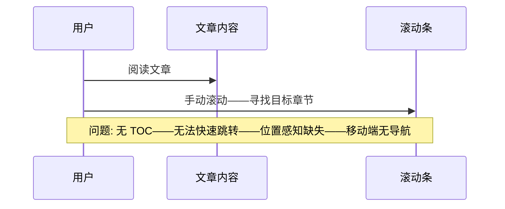
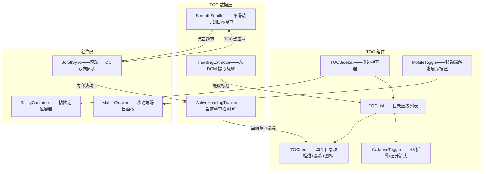
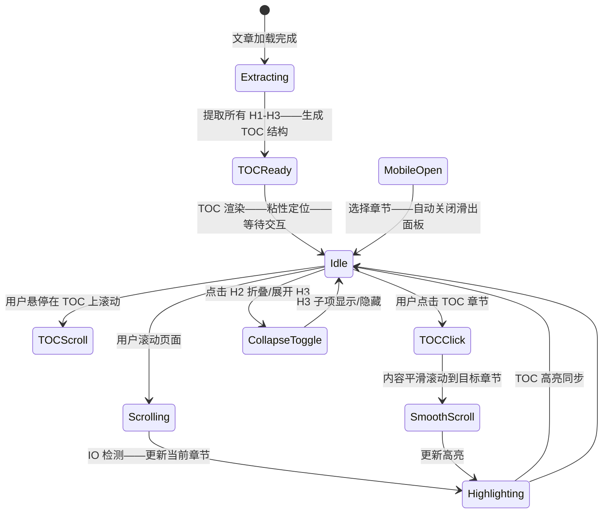

# YK-09-189: 内容侧边栏导航 — 自动生成 TOC、当前章节高亮、平滑滚动、折叠/展开、粘性定位、移动端滑出

> 需求编号：YK-09-189 · 优先级：P2 · 人天：0.3d · 状态：需求已编写
> 依赖：YK-09-112（内容导航树优化——侧边栏 TOC 是导航树的文章内版本）、YK-09-185（内容专注阅读——TOC 在专注模式下可选择隐藏）、YK-09-188（内容导航面包屑——面包屑和侧边栏 TOC 互补）

## 背景

### 问题陈述

YiKnowledge 长文档（如架构设计文档——5000-10000 字——包含 15-30 个章节）阅读时——用户面临严重的导航和方向感问题：

1. **无法快速跳转章节**：阅读到一半想跳到"测试策略"章节——必须手动滚屏寻找——或使用浏览器 Ctrl+F 搜索标题——操作繁琐且不精确
2. **不知道当前位置**：长文档滚动后——不知道在第几章——不知道还剩多少内容——缺乏阅读进度感知
3. **章节层级不清晰**：H1/H2/H3 的层级关系在正文中不够明显——侧边栏的缩进目录可以在一瞥中展示文档结构
4. **滚动后目录不可见**：页面顶部的目录（如果有的话）随滚动消失——用户滚动到中间时——目录不可见——需要滚回顶部查看——打断阅读
5. **移动端目录不可访问**：移动端屏幕小——没有固定侧边栏——目录完全不可见——只能靠感觉滚动——体验极差

**核心矛盾**：侧边栏 TOC 在桌面端是强大的导航工具——但在移动端占用宝贵空间——需要粘性定位保持始终可见——同时移动端要能滑出访问——不占据常驻空间。

### 影响范围

| # | 影响 | 严重程度 | 典型场景 |
|---|------|----------|----------|
| 1 | 章节跳转困难 | 高 | 长文档 30 个章节——需要跳到第 20 章——手动滚动找 1 分钟 |
| 2 | 位置感缺失 | 高 | 阅读到中间——不知道该章节在文档整体中的位置 |
| 3 | 文档结构不可见 | 高 | 打开新文档——无法快速评估内容结构——只能从头浏览 |
| 4 | 目录不可见——需滚回顶部 | 中 | 想查看其他章节——需要滚回顶部找目录——再跳转 |
| 5 | 移动端无目录 | 高 | 移动端阅读长文——完全无法跳转章节——需要疯狂滚动 |

### 挑战

| 挑战 | 说明 |
|------|------|
| TOC 生成 | 从 Markdown 渲染后的 HTML 中提取所有标题——层级映射——ID 生成——缩进展示 |
| 当前章节检测 | 基于滚动位置——判断当前可视区域属于哪个章节——Intersection Observer vs scroll 事件 |
| 高亮同步 | 用户滚动内容——TOC 中的章节高亮跟随变化——反之点击 TOC 滚动内容——双向同步 |
| 粘性定位性能 | `position: sticky` + scroll 事件的性能平衡——避免频繁重绘 |
| 移动端滑出交互 | 手势滑出——遮罩层——Transform 动画——与页面其他手势不冲突 |

---

## 一、现状分析

### 1.1 当前 TOC 状态

```
YiKnowledge 侧边栏 TOC 现状:
├── 固定侧边栏目录树（YK-09-112）
│   ├── 全局目录树——展开文件列表
│   └── 限制: 是文件级别的目录——非文章内章节级 TOC
├── 无文章内 TOC
│   └── 限制: 长文档无章节导航——滚动纯手动
├── 部分文章手写目录
│   ├── Markdown 中手动编写的 `- [章节1](#section-1)` 列表
│   ├── 只在文章顶部——滚动后不可见
│   └── 限制: 手动维护——与章节不同步——无高亮——不可粘性定位
├── 无移动端目录
│   └── 限制: 移动端仅正文——无任何导航辅助
└── 无滚动监听联动
    └── 限制: 即使有手写目录——也无滚动位置高亮——无双向联动
```

### 1.2 当前数据流



### 1.3 根因矩阵

| 症状 | 根因 | 触发条件 | 频率 |
|------|------|----------|------|
| 无法跳转章节 | 无文章内 TOC——无章节锚点 | 长文档——多章节 | 高 |
| 不知当前位置 | 无滚动位置→章节映射 | 滚动到中间 | 高 |
| 文档结构不可见 | 无结构化 TOC——正文中标题层级不够明显 | 评估文档时 | 中 |
| 目录不可见 | 手动目录在顶部——滚动消失——无粘性定位 | 阅读到中间时 | 高 |
| 移动端无导航 | 侧边栏在移动端隐藏——无替代 TOC | 移动端阅读 | 高 |

---

## 二、设计决策

### 决策 1：TOC 生成方式 — 静态构建时 vs 动态运行时 vs 混合

| 选项 | 精确性 | 性能 | 时效性 |
|------|--------|------|--------|
| A: 构建时——从 Markdown AST 提取标题——注入到 frontmatter | 高——AST 精确 | 最佳——无运行时 | 需重新构建 |
| B: 运行时——从渲染后 DOM 提取 `h1-h3` | 中——依赖 DOM | 中——DOM 查询 | 实时——始终精确 |
| C: 混合——构建时存 TOC JSON——运行时渲染激活 | 高 | 最佳+实时高亮 | 好 |

**选择：B（运行时 DOM 提取——简化实现）。** 0.3d 内——构建时集成需要修改 YiAi KnowledgeWatcher 或 SSG 流程——超出范围。运行时从渲染后的 DOM 中 `querySelectorAll('h1,h2,h3')` 提取——简单可靠。TOC 生成 < 5ms——对用户体验无影响。

### 决策 2：当前章节检测 — Intersection Observer vs Scroll 事件 vs 混合

| 选项 | 性能 | 精确度 | 复杂度 |
|------|------|--------|--------|
| A: Intersection Observer——监听所有标题的可见性 | 高——浏览器原生优化 | 高——精确知道哪个标题在视口 | 中 |
| B: Scroll 事件——手动计算每个标题的位置 | 中——节流后可控 | 中——取决于节流频率 | 低 |
| C: 混合——IO 为主——Scroll + throttle 为补充 | 高 | 最高 | 高 |

**选择：A（Intersection Observer——浏览器原生）。** IO 是浏览器原生 API——不在主线程上运行——性能最佳。配置 `rootMargin: '-20% 0px -70% 0px'` ——当前章节从视口顶部 20% 处开始判定——更自然的阅读位置。"当前章节"定义为第一个顶部越过视口 20% 位置的标题。

### 决策 3：移动端 TOC 交互 — 底部抽屉 vs 侧边滑出 vs 浮动按钮

| 选项 | 空间占用 | 操作步数 | 视觉冲突 |
|------|---------|---------|---------|
| A: 底部抽屉——从底部弹出半屏面板 | 不占用常驻空间 | 点击按钮→弹出→选择→收起 | 中 |
| B: 侧边滑出——从右侧滑入面板 | 不占用常驻空间 | 同上 | 低——类似移动端汉堡菜单 |
| C: 浮动 FAB 按钮——点击弹出 Popover | 不占用常驻空间 | 同上 | 高——浮动按钮遮挡内容 |

**选择：B（侧边滑出——Transform 动画——右侧遮罩）。** 移动端常见模式——类似移动端导航菜单——用户熟悉。`transform: translateX(100%)` → `translateX(0)` ——硬件加速动画顺滑。滑出面板覆盖在内容上——选择章节后自动关闭——或点击遮罩关闭。

### 决策 4：TOC 层级展示 — 展开全部 vs 仅当前章节 vs 折叠 H3

| 选项 | 信息量 | 视觉简洁 | 交互复杂度 |
|------|--------|---------|-----------|
| A: 展开全部——H1/H2/H3 全部可见 | 最大 | 差——长文档 TOC 垂直过长 | 低 |
| B: 仅显示当前章节+直接子章节 | 中——上下文相关 | 好——始终简洁 | 高——需要实时折叠逻辑 |
| C: 默认折叠 H3——H1/H2 可见——H3 可展开 | 中 | 中 | 中 |

**选择：C（默认折叠 H3——H1/H2 可见——H3 按 H2 分组可展开）。** H1 和 H2 始终可见——提供文档顶层结构。H3 折叠在所属 H2 下——点击 H2 旁的展开箭头才显示——节省垂直空间。不希望 TOC 竖直过长——用户需要看清楚文档结构的全貌。

---

## 三、目标架构

### 3.1 侧边栏 TOC 系统架构



### 3.2 TOC 交互流程



### 3.3 性能指标

| 指标 | 改造前 | 改造后 |
|------|--------|--------|
| 章节跳转时间 | 手动滚动——10-30s | 点击TOC——平滑滚动 < 1s |
| 位置识别时间 | 靠记忆或滚动回看 | TOC 高亮——即时 |
| 移动端章节导航 | 无 | 滑出 TOC 面板——2 步操作 |
| 文档结构评估 | 需阅读全文 | TOC 一览——< 5s |

---

## 四、具体改动

### 4.1 核心代码：TOC Composable

```typescript
// src/composables/useTOC.ts

interface TocHeading {
  id: string;              // 锚点 ID
  text: string;            // 标题文本
  level: 1 | 2 | 3;       // 标题层级
  children?: TocHeading[]; // H3 子项
  isActive: boolean;       // 当前激活章节
  isExpanded: boolean;     // H2 是否展开子 H3
}

interface TOCSize {
  width: number;
  height: number;
}

interface TOCOptions {
  /** 标题选择器——提取哪些级别的标题 */
  headingSelector?: string;       // 默认 'h1, h2, h3'
  /** 当前章节检测——视口顶部偏移百分比 */
  activeHeadingOffset?: number;   // 默认 0.2 (视口 20%)
  /** 移动端断点——小于此宽度启用滑出模式 */
  mobileBreakpoint?: number;      // 默认 768
  /** 平滑滚动——滚动行为 */
  scrollBehavior?: ScrollBehavior; // 默认 'smooth'
}

export function useTOC(articleContainerRef: Ref<HTMLElement | null>, options: TOCOptions = {}) {
  const headings = ref<TocHeading[]>([]);
  const activeId = ref<string | null>(null);
  const isMobile = ref(false);
  const isMobileDrawerOpen = ref(false);

  const opts = {
    headingSelector: 'h1, h2, h3',
    activeHeadingOffset: 0.2,
    mobileBreakpoint: 768,
    scrollBehavior: 'smooth' as ScrollBehavior,
    ...options,
  };

  let intersectionObserver: IntersectionObserver | null = null;

  function extractHeadings(): TocHeading[] {
    const container = articleContainerRef.value;
    if (!container) return [];

    const elements = container.querySelectorAll(opts.headingSelector);
    const toc: TocHeading[] = [];
    const stack: { level: number; children: TocHeading[] | undefined }[] = [];

    for (const el of Array.from(elements)) {
      // 跳过没有 id 的标题——确保可锚点定位
      if (!el.id) {
        el.id = generateId(el.textContent ?? '');
      }

      const level = parseInt(el.tagName[1]) as 1 | 2 | 3;
      const item: TocHeading = {
        id: el.id,
        text: el.textContent ?? '',
        level,
        isActive: false,
        isExpanded: level < 3,  // H1/H2 默认展开
      };

      if (level === 1) {
        // H1 ——顶级项
        toc.push(item);
        stack.length = 0;
        stack.push({ level, children: undefined });
      } else if (level === 2) {
        // H2 ——上一级 H1 的子项
        if (toc.length > 0) {
          const parent = toc[toc.length - 1];
          if (!parent.children) parent.children = [];
          parent.children.push(item);
        } else {
          toc.push(item);
        }
        stack.length = 1;
        stack.push({ level, children: toc[toc.length - 1].children });
      } else if (level === 3) {
        // H3 ——上一级 H2 的子项
        for (let i = toc.length - 1; i >= 0; i--) {
          const h1 = toc[i];
          if (!h1.children) continue;
          const lastH2 = h1.children[h1.children.length - 1];
          if (lastH2 && lastH2.level === 2) {
            if (!lastH2.children) lastH2.children = [];
            lastH2.children.push(item);
            break;
          }
        }
      }
    }

    return toc;
  }

  function setupIntersectionObserver() {
    const container = articleContainerRef.value;
    if (!container) return;

    const headingElements = container.querySelectorAll('[id]');
    const marginTop = `${opts.activeHeadingOffset * 100}%`;
    const marginBottom = `${(1 - opts.activeHeadingOffset - 0.05) * 100}%`;

    intersectionObserver = new IntersectionObserver(
      (entries) => {
        const visibleEntries = entries.filter(e => e.isIntersecting);
        if (visibleEntries.length > 0) {
          // 取最接近视口顶部的那个标题
          activeId.value = visibleEntries[0].target.id;
          updateActiveState();
        }
      },
      {
        rootMargin: `-${marginTop} 0px -${marginBottom} 0px`,
        threshold: 0,
      },
    );

    headingElements.forEach(el => intersectionObserver?.observe(el));
  }

  function updateActiveState() {
    function setActive(items: TocHeading[]) {
      for (const item of items) {
        item.isActive = item.id === activeId.value;
        if (item.children) setActive(item.children);
      }
    }
    setActive(headings.value);
  }

  function scrollToHeading(id: string) {
    const container = articleContainerRef.value;
    if (!container) return;
    const el = container.querySelector(`#${CSS.escape(id)}`);
    if (!el) return;

    el.scrollIntoView({ behavior: opts.scrollBehavior, block: 'start' });
    activeId.value = id;
    updateActiveState();
  }

  function toggleExpand(headingId: string) {
    function toggle(items: TocHeading[]): boolean {
      for (const item of items) {
        if (item.id === headingId) {
          item.isExpanded = !item.isExpanded;
          return true;
        }
        if (item.children && toggle(item.children)) return true;
      }
      return false;
    }
    toggle(headings.value);
  }

  function toggleMobileDrawer() {
    isMobileDrawerOpen.value = !isMobileDrawerOpen.value;
  }

  function closeMobileDrawer() {
    isMobileDrawerOpen.value = false;
  }

  function checkMobile() {
    isMobile.value = window.innerWidth < opts.mobileBreakpoint;
  }

  function generateId(text: string): string {
    return text
      .toLowerCase()
      .replace(/[^\w\u4e00-\u9fff\s-]/g, '')
      .replace(/\s+/g, '-')
      .replace(/-+/g, '-')
      .trim();
  }

  function init() {
    headings.value = extractHeadings();
    setupIntersectionObserver();
    checkMobile();
  }

  function cleanup() {
    intersectionObserver?.disconnect();
    intersectionObserver = null;
  }

  onMounted(() => { init(); window.addEventListener('resize', checkMobile); });
  onUnmounted(() => { cleanup(); window.removeEventListener('resize', checkMobile); });

  return {
    headings, activeId, isMobile, isMobileDrawerOpen,
    scrollToHeading, toggleExpand, toggleMobileDrawer, closeMobileDrawer,
    init, cleanup,
  };
}
```

### 4.2 文件变更清单

| 文件 | 操作 | 说明 |
|------|------|------|
| `src/composables/useTOC.ts` | 新增 | TOC 数据管理——标题提取/当前章节检测/跳转/折叠 |
| `src/components/TOC/TOCSidebar.vue` | 新增 | 侧边栏 TOC 组件——粘性定位——完整 TOC 渲染 |
| `src/components/TOC/TOCItem.vue` | 新增 | 单个 TOC 项——缩进+高亮+图标+折叠箭头+点击 |
| `src/components/TOC/TOCMobileDrawer.vue` | 新增 | 移动端滑出面板——Transform 动画——遮罩层 |
| `src/components/TOC/TOCMobileButton.vue` | 新增 | 移动端触发按钮——浮动在页面右下角——Badge 当前章节 |
| `src/types/toc.ts` | 新增 | TOC 相关类型 |

---

## 五、实施步骤

| 步骤 | 操作 | 路径 | 验证 | 人天 |
|------|------|------|------|------|
| 1 | 实现标题提取和 TOC 数据构建 | `useTOC.ts`——`extractHeadings` | 提取 H1-H3——层级嵌套——ID 生成——无重复锚点 | 0.06 |
| 2 | 实现 Intersection Observer 当前章节检测 | `useTOC.ts`——`setupIntersectionObserver` | 滚动时高亮同步——精确匹配当前可视章节 | 0.05 |
| 3 | 实现粘性侧边栏 UI | `TOCSidebar.vue` + `TOCItem.vue` | 目录渲染——缩进对齐——高亮样式——折叠箭头——点击跳转 | 0.06 |
| 4 | 实现平滑滚动跳转 | `scrollToHeading` + scroll-behavior | 点击 TOC 项——内容平滑滚动——URL hash 更新——高亮同步 | 0.03 |
| 5 | 实现 H3 折叠/展开 | `toggleExpand`——手风琴效果 | H2 折叠箭头——点击展开/收起 H3——保留展开状态 | 0.03 |
| 6 | 实现移动端滑出面板 | `TOCMobileDrawer.vue` + `TOCMobileButton.vue` | 按钮触发——滑出动画——遮罩关闭——选择后关闭 | 0.07 |

**总人天：0.3d**

---

## 六、测试规格

### 测试 1：TOC 自动生成——标题提取+层级缩进

| 项目 | 内容 |
|------|------|
| 优先级 | P0 |
| 前置条件 | 文章包含 H1/H2/H3 标题——Markdown 渲染后 DOM 中有对应元素 |
| 测试步骤 | 1. 打开长文档文章 2. 观察右侧 TOC 侧边栏 |
| 预期结果 | TOC 显示所有标题——H1 无缩进——H2 缩进 16px——H3 缩进 32px——标题文本与正文一致——每个标题有锚点链接 |

### 测试 2：当前章节高亮——滚动联动

| 项目 | 内容 |
|------|------|
| 优先级 | P0 |
| 前置条件 | 文章有多个章节——TOC 侧边栏显示 |
| 测试步骤 | 1. 滚动到第 3 章 2. 观察 TOC 中第 3 章的高亮 3. 继续滚动到第 5 章 |
| 预期结果 | 第 3 章可见时——TOC 中第 3 项高亮（加粗/左侧蓝色竖线/背景色）——前两章不高亮——滚动到第 5 章时——高亮跟随切换——过高亮过渡流畅 |

### 测试 3：点击 TOC 跳转——平滑滚动

| 项目 | 内容 |
|------|------|
| 优先级 | P0 |
| 前置条件 | TOC 侧边栏——文章有多个章节 |
| 测试步骤 | 1. 点击 TOC 中"测试策略"章节 2. 观察页面滚动 3. 观察 URL hash |
| 预期结果 | 页面平滑滚动到"测试策略"章节——滚动动画 < 500ms——URL hash 变为 `#测试策略` ——TOC 中该章节高亮——浏览器后退恢复滚动位置 |

### 测试 4：H3 折叠/展开

| 项目 | 内容 |
|------|------|
| 优先级 | P1 |
| 前置条件 | H2 章节有 3 个 H3 子章节——默认折叠 |
| 测试步骤 | 1. 观察 TOC——H2"实施步骤" 2. 点击 H2 旁的展开箭头 3. 再次点击折叠 |
| 预期结果 | 默认 H3 不可见——点击展开——3 个 H3 子项平滑滑出——再次点击折叠——H3 缩回——只留 H2 ——箭头图标旋转 90° |

### 测试 5：粘性定位——滚动时 TOC 保持可见

| 项目 | 内容 |
|------|------|
| 优先级 | P1 |
| 前置条件 | 文章可滚动——页面高度 > 视口——TOC 侧边栏 |
| 测试步骤 | 1. 滚动页面到中间 2. 观察 TOC 位置 3. 滚动到底部 4. 滚动回顶部 |
| 预期结果 | TOC 使用 `position: sticky——top: 80px`——始终在视口内——不随内容滚动消失——滚动到底部时不超出容器边界 |

### 测试 6：移动端滑出面板

| 项目 | 内容 |
|------|------|
| 优先级 | P1 |
| 前置条件 | 视口宽度 < 768px——TOC 侧边栏隐藏——浮动按钮显示 |
| 测试步骤 | 1. 观察页面右下角 TOC 浮动按钮 2. 点击按钮 3. 观察滑出面板 4. 点击一个章节 5. 点击遮罩层关闭 |
| 预期结果 | 按钮显示当前章节名或图标——点击后右侧滑出面板——覆盖半屏——显示完整 TOC ——选择章节后面板自动关闭+页面滚动——点击遮罩也关闭——Transform 动画 < 300ms |

---

## 七、风险与缓解

| 风险 | 概率 | 影响 | 缓解措施 |
|------|------|------|------|
| 动态内容加载——标题 DOM 未就绪时提取——TOC 为空 | 中 | 中 | `init()` 在 `onMounted` + `nextTick` 中调用——或 watch 内容变化——延迟提取直到 `articleContainerRef` 子元素就绪 |
| Intersection Observer 在 Safari < 12.1 不支持 | 低 | 中 | Polyfill 检测——不支持时回退到 scroll 事件 + throttle——或降级为手动高亮 |
| H1-H3 无 ID——`generateId` 生成中文拼音 ID——复杂——可能重复 | 低 | 低 | 中文字符保留——仅去除非字母数字——检测重复后追加序号 `-2` `-3` |
| 粘性定位在某些场景下失效——父容器 `overflow: hidden` 破坏 sticky | 低 | 中 | 确保 TOC 的祖先容器没有 `overflow: hidden`（除了 body）——添加检查——降级为 `position: fixed` |
| 移动端滑出手势与 iOS Safari 侧滑返回冲突 | 中 | 低 | 滑出方向为右侧——iOS Safari 是左侧滑返回——不冲突——滑出面板添加 `touch-action: pan-y` ——仅允许垂直滑动内部滚动 |

---

## 八、回滚策略

1. **组件级回滚**：TOC 侧边栏通过 CSS `display: none` 隐藏——文章内容宽度恢复全宽——不影响阅读
2. **移动端回滚**：浮动按钮隐藏——滑出面板移除——移动端恢复到无 TOC 状态
3. **代码级回滚**：移除 `useTOC` composable 和 TOC 组件——文章页面恢复原有布局
4. **回滚验证**：文章内容正常渲染——标题无异常——布局不错位——滚动正常——无残留 JS 错误

---

## 九、设计决策记录

### D-01：Intersection Observer——原生性能

**上下文**：当前章节检测需要在每次滚动时更新——`scroll` 事件如果在主线程处理——会导致卡顿。

**决策**：使用 Intersection Observer API——浏览器在合成线程处理——不阻塞主线程。

**理由**：IO 的回调在微任务中排队——不影响动画帧。配置 `rootMargin` 的顶部偏移——使得当前章节的判定区域在视口顶部 20%——更符合用户的"当前位置"感知（正在看的内容在视口偏上方）。

### D-02：默认折叠 H3——平衡信息与简洁

**上下文**：30 个章节的长文档——如果展开所有 H3——TOC 可能垂直超过视口高度——失去"全局一览"的能力。

**决策**：H1/H2 始终可见——H3 默认折叠在所属 H2 下——可展开。

**理由**：H2 提供足够的文档结构粒度（10-15 个 H2 是可以一览的）。H3 细节按需展开——保持 TOC 紧凑。折叠状态在组件内管理——不持久化——刷新后恢复默认折叠。

### D-03：移动端滑出面板——右侧——非底部抽屉

**上下文**：移动端阅读时——TOC 是辅助功能——不应占据常驻空间。

**决策**：右侧滑出面板+浮动按钮触发——选择章节后自动关闭。

**理由**：右侧滑出是移动端常见的辅助面板模式（类似 GitHub 移动端目录）。浮动按钮小巧——在右下角不遮挡正文。底部抽屉会遮挡正在阅读的内容——打断阅读——侧边滑出视觉上更轻量。

### D-04：TOC 仅在文章页面显示——不全局

**上下文**：TOC 是文章内导航——不是站点级导航——不需要在首页/列表页显示。

**决策**：TOC 组件仅在文章详情页——非全局布局的一部分。

**理由**：站点级导航由侧边栏目录树（YK-09-112）和面包屑（YK-09-188）提供。TOC 专注于文章内章节导航——场景明确——不需要在所有页面显示——减少不必要的 DOM 和 JS 开销。

---

## 十、可观测性

| 指标 | 采集方式 | 阈值 |
|------|----------|------|
| TOC 提取耗时 | `extractHeadings` 执行时间 | < 5ms |
| IO 回调频率 | IntersectionObserver 回调触发次数/秒 | < 5 |
| TOC 点击跳转次数 | `scrollToHeading` 调用 | — |
| 移动端 TOC 打开次数 | `toggleMobileDrawer` true 计数 | — |
| H3 展开率 | H3 展开次数/总展示次数 | — |
| 当前章节检测准确率 | 用户反馈——UI 一致性观察 | — |
| 文章无标题占比 | headings.length === 0 的文章/总 | < 5% |

---

## 十一、代码审查检查清单

- [ ] `extractHeadings`——空容器（文章未渲染）——返回 []——不报错
- [ ] `extractHeadings`——标题无 ID——`generateId` 自动生成——确保锚点可用
- [ ] `generateId`——中文/日文/特殊字符——去除非字母数字——保留 Unicode 字母
- [ ] `generateId`——生成的 ID 在页面内唯一——重复时追加 `-n` 序号
- [ ] `setupIntersectionObserver`——容器内无 `[id]` 元素时——不创建 IO——避免空观察
- [ ] `scrollToHeading`——`querySelector` 未找到元素——`console.warn`——不抛异常
- [ ] `toggleExpand`——headingId 不存在——不操作——不报错
- [ ] TOC 粘性定位——祖先容器无 `overflow: hidden` ——或有此限制时降级 fixed
- [ ] 移动端——滑出面板 `z-index` 高于内容——低于顶部导航——遮罩层不透明
- [ ] 移动端——选择章节后自动关闭面板——`closeMobileDrawer` 被调用
- [ ] 移动端——`resize` 事件 debounce 100ms——减少 `checkMobile` 调用
- [ ] TOC 侧边栏——宽度固定 200-250px——内容区域相应缩小——响应式
- [ ] TOCItem——`aria-current="true"` 在当前激活项——无障碍
- [ ] cleanup——`onUnmounted` 中 IO disconnect——removeEventListener resize——防止内存泄露

---

## 回归问题预测

| # | 预测问题 | 触发条件 | 检测方式 |
|---|----------|----------|----------|
| 1 | TOC 和正文中的标题文本不一致——因为 Markdown 中的链接/格式被提取到 TOC | 标题文字含链接——如 `## [1. 概述](#overview)` ——提取后为 "[1. 概述](#overview)"——TOC 展示 Markdown 语法 | `textContent` 提取时——去除链接的 Markdown 残留——或使用 `innerText` 代替 `textContent`——过滤 `[` `](` 等 |
| 2 | 粘性 TOC 和粘性顶部导航栏高度冲突——TOC `top` 值不足——被顶部导航栏遮挡 | 顶部导航栏 `position: sticky——top: 0——height: 64px` ——TOC `top: 0` ——被导航栏遮挡 | TOC `top: 80px` = 导航栏高度 + 间距——或在 CSS 中使用 `--header-height` CSS 变量——统一管理 |
| 3 | Intersection Observer 回调——多个标题同时进入视口——高亮来回闪烁 | 两个短章节——都快进入 IO 判定区域——IO 回调快速交替触发——高亮在两项间闪烁 | IO 回调 debounce 100ms——取最后一次判定结果——或添加防抖——确保高亮变化有最小间隔 |
| 4 | 文章中有代码块包含 `#` 开头的注释——被 `querySelectorAll` 匹配为标题——TOC 中出现代码注释 | Markdown 代码块中的 `# 这是注释`——渲染后 `<code>` 中的文本——但如果在 `<pre>` 外被误解析 | `querySelectorAll` 限定在文章内容区——排除 `<pre>` `<code>` 内的元素——`h1,h2,h3:not(pre *)` |
| 5 | 移动端浮动 TOC 按钮和"返回顶部"按钮位置重叠——两者打架 | 页面同时有 TOC 浮动按钮和返回顶部按钮——都在右下角——重叠 | 浮动按钮垂直排列——TOC 在上——返回顶部在下——间距 16px——或 TOC 按钮内置"回顶部"功能 |
| 6 | 平滑动滚动——`scrollIntoView({ behavior: 'smooth' })` 在部分浏览器中无效——导致瞬移到目标——无过渡 | Safari < 15.4——`scroll-behavior: smooth` 不支持——`scrollIntoView` 降级为 instant | 检测 `scroll-behavior` CSS 支持——不支持时使用 polyfill 或 `element.scrollIntoView()` 不带 options(也是 instant)——作为降级 |

---

## 性能分析

| 操作 | 数据量 | 耗时 | 说明 |
|------|--------|------|------|
| TOC 提取（30 个标题） | DOM querySelectorAll + 数组构建 | < 3ms | DOM 查询——字符串处理——纯 CPU |
| Intersection Observer 初始化 | 30 个标题——30 个 observe | < 2ms | 浏览器原生——注册监听——非同步 |
| IO 回调（单次） | 1 个条目变化——更新 activeIdx | < 1ms | 更新响应式状态——Vue 重渲染——在 microtask |
| 点击跳转——平滑滚动 | 滚动 2000px | 300-500ms | `scrollIntoView` ——浏览器原生——duration 不可控 |
| DOM 大小检查（移动端） | 1 次 `matchMedia` | < 1ms | 同步 |
| 移动端滑出动画 | CSS transform——300ms | < 16ms/帧 | GPU 合成——60fps |
| TOC 组件渲染（30 项） | Vue v-for——30 个 `<li>` | < 5ms | 虚拟 DOM——memo 优化 |

---

## 相关文档

- [内容导航树优化](../112-需求-内容导航树优化.md) — 全局目录树——TOC 是文章内的微型导航树
- [内容专注阅读](../185-需求-内容专注阅读.md) — 专注模式下 TOC 可隐藏——阅读进度条互补
- [内容导航面包屑](../188-需求-内容导航面包屑.md) — 面包屑+侧边栏 TOC——完整的站点+文章导航体系

*PRD 来源: `projects/yiknowledge/requirements/2026-09/189-需求-内容侧边栏导航.md`*