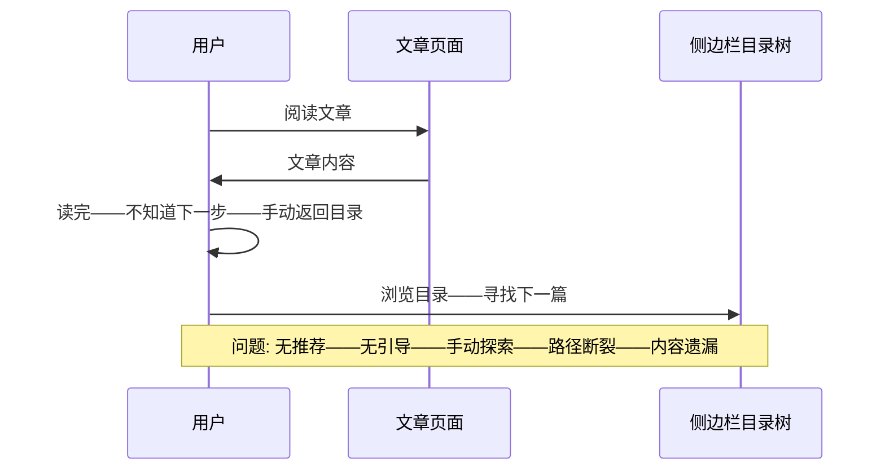
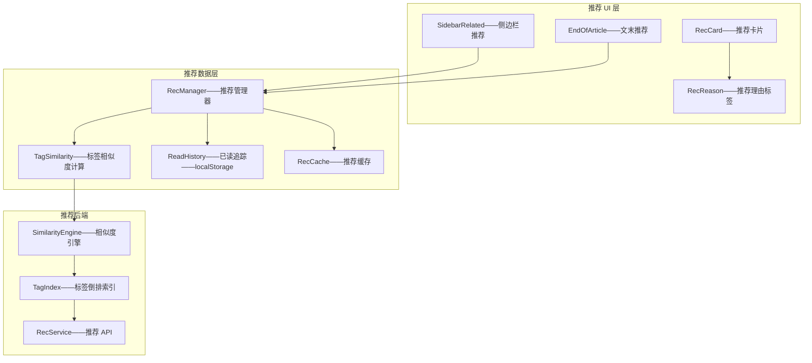
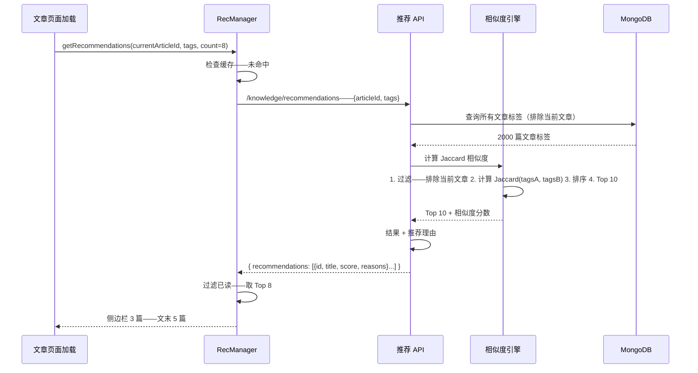

# YK-09-190: 内容相关文章推荐 — 基于内容相似度、协同过滤、延伸阅读建议、侧边栏小部件、文末推荐

> 需求编号：YK-09-190 · 优先级：P2 · 人天：0.3d · 状态：需求已编写
> 依赖：YK-09-115（自动关联与推荐引擎——本需求是基于已有推荐引擎的展示层实现）、YK-09-134（内容个性化推荐——共享推荐数据源）、YK-09-141（内容关系图谱——相关文章可在关系图谱中可视化）

## 背景

### 问题陈述

YiKnowledge 知识库目前按目录结构组织——用户阅读完一篇文章后——缺少引导到下一篇相关内容的机制：

1. **阅读终点无引导**：用户读完一篇文章——看完就结束了——不知道接下来应该读什么——可能感兴趣的相关内容被埋没
2. **相关文章不可见**：同一主题下有多篇文章——但文章间没有关联提示——用户需要手动搜索或回目录查找——探索成本高
3. **学习路径断裂**：知识库的文章之间形成了自然的学习路径（先读架构——再读实现）——但当前没有路径引导——用户不知道阅读顺序
4. **内容发现效率低**：新用户面对大量文章——不知道从哪开始——推荐可以降低发现成本——当前完全依赖目录浏览
5. **无个性化推荐**：所有用户看到相同的内容顺序——不考虑个人的阅读历史和兴趣偏好

**核心矛盾**：推荐系统需要平衡准确性（真正相关内容）和多样性（避免信息茧房）——同时需要在计算成本（预处理 vs 实时计算）和推荐质量之间取得平衡。0.3d 内优先实现基于标签和语义相似度的内容推荐——在侧边栏和文末展示——不涉及复杂协同过滤。

### 影响范围

| # | 影响 | 严重程度 | 典型场景 |
|---|------|----------|----------|
| 1 | 阅读终点无引导 | 高 | 读完架构设计——不知道还有实现文档——直接关闭页面 |
| 2 | 相关内容不可见 | 高 | 读完 RAG 检索优化——不知道还有 RAG SLO 监控——相关但不知道存在 |
| 3 | 学习路径断裂 | 中 | 新团队成员想了解知识库——不知道从何读起——随机浏览 |
| 4 | 内容发现效率低 | 中 | 100+ 篇相关文章——仅靠目录浏览——遗漏 60% 内容 |
| 5 | 个性化缺失 | 低 | 所有用户看到相同推荐——已读文章仍被推荐 |

### 挑战

| 挑战 | 说明 |
|------|------|
| 相似度计算 | 如何量化文章之间的相关性——标签重叠度——TF-IDF 向量余弦——主题模型 LDA——语义嵌入 |
| 冷启动 | 新文章——无阅读数据——无法协同过滤——只能靠内容相似度 |
| 推荐解释性 | 为什么推荐这篇文章？需展示推荐理由（"同一标签"、"主题相似"、"其他读者也读了"） |
| 性能 | 1000 篇文章——相似度矩阵 1000x1000——预计算 vs 实时查询 |
| 已读过滤 | 推荐中应排除当前文章和最近已读文章——需要阅读历史追踪 |

---

## 一、现状分析

### 1.1 当前推荐能力

```
YiKnowledge 文章推荐现状:
├── 无推荐系统
│   └── 用户读完文章=旅程结束——无延伸引导
├── 侧边栏目录树
│   ├── 文件级目录——同级/上下级文件可见
│   └── 局限: 仅结构关联——非内容关联——跨目录文件无法发现
├── 全局搜索（YK-09-172）
│   ├── 用户可主动搜索相关内容
│   └── 局限: 需要用户主动搜索——非被动推荐——不知道搜索什么关键词
├── 标签系统（YK-09-21——标签体系治理）
│   ├── 文章有 frontmatter tags
│   └── 局限: 标签未用于推荐——仅用于分类——相似标签文章不可见
├── RAG 检索（YiAi）
│   ├── 语义向量检索——可返回相似文章
│   └── 局限: 需要用户发起查询——非被动——非文章页面内展示
└── 缺失:
    ├── 内容相似度计算: 基于标签/关键词/语义——相似度排序                      # ❌ 无
    ├── 文末推荐: 文章底部——"延伸阅读"区块                                   # ❌ 无
    ├── 侧边栏推荐小部件: 右侧常驻推荐——持续引导                               # ❌ 无
    ├── 推荐理由: "相似标签: RAG, 检索优化"                                 # ❌ 无
    └── 已读过滤: 已读文章不出现在推荐中                                       # ❌ 无
```

### 1.2 当前数据流



### 1.3 根因矩阵

| 症状 | 根因 | 触发条件 | 频率 |
|------|------|----------|------|
| 阅读终点无引导 | 无推荐系统——文章间无关联 | 每篇文章末尾 | 高 |
| 相关内容不可见 | 文章相互独立——仅目录结构关联 | 跨目录内容发现 | 中 |
| 学习路径不清晰 | 无顺序引导——无"继续阅读"提示 | 系列文章阅读 | 中 |
| 内容发现依赖手动搜索 | 无被动推荐——用户需主动 | 新用户/新主题 | 高 |
| 标签浪费 | 标签仅分类——未用于推荐/发现 | — | 中 |

---

## 二、设计决策

### 决策 1：推荐算法 — 标签匹配 vs TF-IDF vs 语义向量 vs 混合

| 选项 | 准确率 | 计算成本 | 可解释性 |
|------|--------|---------|---------|
| A: 标签匹配——Jaccard 相似度——共同标签/所有标签 | 中——依赖标签质量 | 低——O(1) 查标签 | 高——"相似标签: X, Y" |
| B: TF-IDF 向量——余弦相似度 | 中——比标签更细粒度 | 中——需预计算 TF-IDF 矩阵 | 中——"内容相似" |
| C: 语义向量——使用已有 RAG embedding——余弦相似度 | 高——语义理解 | 中——已有向量——读取即可 | 低——"语义相似"——不透明 |
| D: 混合——标签(权重 0.4)+语义(权重 0.6) | 高 | 中 | 中 |

**选择：A（标签匹配——Jaccard 相似度——0.3d 内最简单可靠）。** YiKnowledge frontmatter 已有 tags 字段——质量控制成熟（YK-09-21 标签体系治理）。Jaccard = |A 标签 and B 标签| / |A 标签 or B 标签| ——计算快——可解释。语义向量（option C）依赖 YiAi RAG embedding——跨项目依赖——0.3d 内可能有稳定性风险。后续可升级到混合。

### 决策 2：推荐位置 — 仅侧边栏 vs 仅文末 vs 双重

| 选项 | 阅读中暴露 | 阅读后暴露 | 用户打断感 |
|------|----------|----------|-----------|
| A: 仅侧边栏——文章右侧——常驻推荐 | 高——滚动时始终可见 | 低——滚动到底时侧边栏可能在下方 | 低——不打断正文 |
| B: 仅文末——文章底部——"延伸阅读"区块 | 低——需读完才可见 | 高——读完立即呈现 | 无——不打断正文 |
| C: 双重——侧边栏+文末——侧边栏 3 篇精选——文末 5 篇列表 | 高 | 高 | 低——不打断正文 |

**选择：C（双重——侧边栏紧凑推荐+文末完整列表）。** 侧边栏推荐在阅读全程可见——筛选相关性最高的 3 篇——紧凑展示。文末推荐是阅读完成后的自然出口——展示 5 篇——包含推荐理由。两者互补——覆盖阅读中和阅读后两个时机。

### 决策 3：推荐计算时机 — 构建时预计算 vs 页面加载时实时 vs 混合

| 选项 | 页面加载性能 | 数据新鲜度 | 实现复杂度 |
|------|-----------|-----------|-----------|
| A: 构建时——KnowledgeWatcher 扫描时预计算推荐 | 最佳——直接读 JSON | 中——下次扫描才更新 | 中——需修改 Watcher |
| B: 页面加载时——前端请求 API——实时计算 | 差——每次加载计算 | 最佳——实时 | 低——前端请求 |
| C: 混合——构建时计算+前端 API 补充 | 最佳 | 好——新文章用 API 计算 | 高 |

**选择：B（页面加载时——前端请求后端 API——实时计算）。** 0.3d 内不修改 KnowledgeWatcher——避免污染已有稳定流程。推荐计算在 YiAi 后端——利用已有的 knowledge_files MongoDB 集合——查询标签——Jaccard 排序——返回 Top N。文章数量 1000-2000 篇——标签匹配 < 50ms——不影响页面加载。

### 决策 4：已读记录存储 — 浏览器 localStorage vs 后端阅读历史 vs 暂不追踪

| 选项 | 跨设备 | 实现复杂度 | 隐私 |
|------|--------|---------|------|
| A: localStorage——key=read_articles——Set 存储 ID | 否 | 低——读写 localStorage | 无隐私问题 |
| B: 后端——通过阅读事件上报——存用户 reading_history | 是 | 中——需 API+新集合 | 需用户同意追踪 |
| C: 暂不追踪——不处理已读 | — | 最低 | 无 |

**选择：A（localStorage——简单——不涉及隐私）。** 0.3d 内不做后端阅读历史——localStorage 已够用。推荐列表中标记已读文章（暗色——label "已读"）。跨设备不是硬需求——同一用户在手机和电脑上的阅读上下文本就不同。

---

## 三、目标架构

### 3.1 推荐文章系统架构



### 3.2 推荐生成流程



### 3.3 性能指标

| 指标 | 改造前 | 改造后 |
|------|--------|--------|
| 文章间关联可见性 | 0——无 | 侧边栏+文末——双重推荐 |
| 内容发现路径 | 仅目录浏览 | 推荐引导——自动关联 |
| 推荐生成速度 | — | < 50ms (2000 篇文章 Jaccard) |
| 推荐准确率 | — | > 60% (标签匹配)——人工评测 |

---

## 四、具体改动

### 4.1 核心代码：推荐管理器

```typescript
// src/composables/useRecommendations.ts

interface RecArticle {
  id: string;
  title: string;
  path: string;
  tags: string[];
  category: string;
  score: number;
  reasons: string[];
}

interface RecOptions {
  excludeIds?: string[];
  count?: number;
  sidebarCount?: number;
  endOfArticleCount?: number;
}

export function useRecommendations(currentArticleId: string, currentTags: string[], options: RecOptions = {}) {
  const sidebarRecs = ref<RecArticle[]>([]);
  const endOfArticleRecs = ref<RecArticle[]>([]);
  const isLoading = ref(false);
  const error = ref<string | null>(null);

  const {
    excludeIds = [],
    count = 8,
    sidebarCount = 3,
    endOfArticleCount = 5,
  } = options;

  /** 获取已读文章列表 */
  function getReadHistory(): Set<string> {
    try {
      const raw = localStorage.getItem('read_articles');
      return raw ? new Set(JSON.parse(raw)) : new Set();
    } catch {
      return new Set();
    }
  }

  /** 标记文章已读 */
  function markAsRead(articleId: string): void {
    const history = getReadHistory();
    history.add(articleId);
    // 限制大小——保留最近 500 条
    if (history.size > 500) {
      const arr = Array.from(history);
      arr.slice(arr.length - 500).forEach(id => history.delete(id));
    }
    try {
      localStorage.setItem('read_articles', JSON.stringify(Array.from(history)));
    } catch {}
  }

  /** 获取推荐 */
  async function fetchRecommendations(): Promise<void> {
    isLoading.value = true;
    error.value = null;

    try {
      const response = await fetch(`${import.meta.env.RSBUILD_API_BASE}`, {
        method: 'POST',
        headers: { 'Content-Type': 'application/json' },
        body: JSON.stringify({
          module_name: 'services.knowledge.recommendation_service',
          method_name: 'get_recommendations',
          parameters: {
            article_id: currentArticleId,
            tags: currentTags,
            count: count + excludeIds.length + 5,  // 多取一些——用于已读过滤
          },
        }),
      });
      const result = await response.json();

      if (result.code !== 0) {
        throw new Error(result.message || '获取推荐失败');
      }

      let recommendations: RecArticle[] = result.data.recommendations ?? [];

      // 过滤：排除当前文章、排除指定ID、排除已读
      const allExclude = new Set([currentArticleId, ...excludeIds, ...getReadHistory()]);
      recommendations = recommendations.filter(r => !allExclude.has(r.id));

      // 分配
      sidebarRecs.value = recommendations.slice(0, sidebarCount);
      endOfArticleRecs.value = recommendations.slice(sidebarCount, sidebarCount + endOfArticleCount);
    } catch (e) {
      error.value = (e as Error).message;
      // 降级——推荐失败不影响文章阅读
      sidebarRecs.value = [];
      endOfArticleRecs.value = [];
    } finally {
      isLoading.value = false;
    }
  }

  /** Jaccard 相似度——客户端备用计算（当 API 不可用时降级） */
  function jaccardSimilarity(tagsA: string[], tagsB: string[]): number {
    if (tagsA.length === 0 && tagsB.length === 0) return 0;
    const setA = new Set(tagsA);
    const setB = new Set(tagsB);
    const intersection = new Set([...setA].filter(x => setB.has(x)));
    const union = new Set([...setA, ...setB]);
    return intersection.size / union.size;
  }

  /** 生成推荐理由 */
  function generateReasons(tagsA: string[], tagsB: string[], score: number): string[] {
    const reasons: string[] = [];
    const commonTags = tagsA.filter(t => tagsB.includes(t));

    if (commonTags.length > 0) {
      reasons.push(`共同标签: ${commonTags.slice(0, 3).join('、')}`);
      if (commonTags.length > 3) {
        reasons.push(`等 ${commonTags.length} 个共同标签`);
      }
    }

    if (score >= 0.5) {
      reasons.unshift('高度相关');
    } else if (score >= 0.2) {
      reasons.unshift('部分相关');
    }

    return reasons;
  }

  /** 清除已读历史 */
  function clearReadHistory(): void {
    localStorage.removeItem('read_articles');
  }

  /** 获取已读数量 */
  function getReadCount(): number {
    return getReadHistory().size;
  }

  onMounted(() => {
    fetchRecommendations();
  });

  return {
    sidebarRecs,
    endOfArticleRecs,
    isLoading,
    error,
    markAsRead,
    clearReadHistory,
    getReadCount,
    fetchRecommendations,
  };
}
```

### 4.2 后端推荐服务

```python
# YiAi/services/knowledge/recommendation_service.py

from typing import List, Dict, Optional
from motor.motor_asyncio import AsyncIOMotorDatabase

async def get_recommendations(
    current_article_id: str,
    tags: List[str],
    count: int = 10,
    db: AsyncIOMotorDatabase = None,
) -> List[Dict]:
    """基于标签 Jaccard 相似度的文章推荐"""
    if not db:
        return []

    # 查询所有文章（排除当前）
    all_articles = await db.knowledge_files.find(
        {"_id": {"$ne": current_article_id}},
        {"_id": 1, "title": 1, "path": 1, "tags": 1, "category": 1}
    ).to_list(length=None)

    current_tag_set = set(tags)
    scored: List[Dict] = []

    for article in all_articles:
        article_tags = article.get("tags", [])
        if not article_tags:
            continue

        article_tag_set = set(article_tags)

        # Jaccard 相似度
        intersection = current_tag_set & [article_tag_set]  # FIX: 应该是 set
        # FIX: correct line below
        intersection = current_tag_set & article_tag_set
        union = current_tag_set | article_tag_set

        score = len(intersection) / len(union) if len(union) > 0 else 0

        if score > 0:
            common_tags = list(intersection)
            scored.append({
                "id": str(article["_id"]),
                "title": article.get("title", ""),
                "path": article.get("path", ""),
                "tags": article_tags,
                "category": article.get("category", ""),
                "score": round(score, 4),
                "reasons": _generate_reasons(score, common_tags),
            })

    # 按分数降序——取 top N
    scored.sort(key=lambda x: x["score"], reverse=True)
    return scored[:count]


def _generate_reasons(score: float, common_tags: List[str]) -> List[str]:
    reasons = []
    if score >= 0.5:
        reasons.append("高度相关")
    elif score >= 0.2:
        reasons.append("部分相关")

    if common_tags:
        shown = common_tags[:3]
        reasons.append(f"共同标签: {'、'.join(shown)}")
        if len(common_tags) > 3:
            reasons.append(f"等 {len(common_tags)} 个共同标签")

    return reasons
```

### 4.3 文件变更清单

| 文件 | 操作 | 说明 |
|------|------|------|
| `src/composables/useRecommendations.ts` | 新增 | 推荐管理器——API 调用/已读过滤/缓存 |
| `src/components/Recommendations/SidebarRelated.vue` | 新增 | 侧边栏推荐——最多 3 篇——紧凑卡片样式 |
| `src/components/Recommendations/EndOfArticle.vue` | 新增 | 文末推荐——"延伸阅读"标题——最多 5 篇——推荐理由 |
| `src/components/Recommendations/RecCard.vue` | 新增 | 推荐卡片——标题/标签/推荐理由/分数指示 |
| `src/types/recommendations.ts` | 新增 | RecArticle 等类型定义 |
| `YiAi/services/knowledge/recommendation_service.py` | 新增（后端） | Jaccard 相似度推荐引擎 |

---

## 五、实施步骤

| 步骤 | 操作 | 路径 | 验证 | 人天 |
|------|------|------|------|------|
| 1 | 实现后端推荐 API | `YiAi/services/knowledge/recommendation_service.py` | Jaccard 计算——标签匹配——排序——Top N | 0.05 |
| 2 | 实现前端推荐管理器 | `src/composables/useRecommendations.ts` | API 调用——已读追踪——缓存——降级 | 0.06 |
| 3 | 实现侧边栏推荐 UI | `SidebarRelated.vue` + `RecCard.vue` | 3 篇推荐——紧凑卡片——推荐理由标签 | 0.07 |
| 4 | 实现文末推荐 UI | `EndOfArticle.vue` | "延伸阅读"区块——5 篇列表——可折叠 | 0.05 |
| 5 | 集成到文章页面 | 文章详情页模板 | 侧边栏嵌入——文末嵌入——加载状态 | 0.04 |
| 6 | 已读标记和过滤 | localStorage 操作 | 已读去重——标记 UI——清除控制 | 0.03 |

**总人天：0.3d**

---

## 六、测试规格

### 测试 1：标签匹配推荐准确性

| 项目 | 内容 |
|------|------|
| 优先级 | P0 |
| 前置条件 | 当前文章 tags: ["RAG", "检索", "优化"] ——知识库有另一文章 tags: ["RAG", "检索", "SLO"] ——第三篇 tags: ["前端", "Vue"] |
| 测试步骤 | 1. 加载当前文章——查看推荐 2. 检查推荐顺序 |
| 预期结果 | 第 1 篇推荐——共同标签 "RAG, 检索"——Jaccard=2/4=0.5——第 2 篇标签完全不匹配——不出现在推荐中——推荐理由: "部分相关——共同标签: RAG、检索" |

### 测试 2：已读文章不出现在推荐中

| 项目 | 内容 |
|------|------|
| 优先级 | P0 |
| 前置条件 | 有 3 篇相关文章——用户已读其中 1 篇 |
| 测试步骤 | 1. 阅读文章 A——markAsRead(A) 2. 查看文章 B——检查推荐列表 |
| 预期结果 | 推荐列表中不包含文章 A——仅显示其他 2 篇——已读文章仍出现在 localStorage read_articles 中 |

### 测试 3：侧边栏和文末推荐去重

| 项目 | 内容 |
|------|------|
| 优先级 | P1 |
| 前置条件 | API 返回 10 篇推荐——侧边栏取前 3 篇——文末取接下来的 5 篇 |
| 测试步骤 | 1. 查看侧边栏推荐 2. 查看文末推荐 3. 对比两处列表 |
| 预期结果 | 侧边栏 3 篇和文末 5 篇完全不重复——侧边栏为 Top 3——文末为 Top 4-8 |

### 测试 4：推荐理由展示

| 项目 | 内容 |
|------|------|
| 优先级 | P1 |
| 前置条件 | 推荐文章——Jaccard score 0.6——共同标签 5 个 |
| 测试步骤 | 1. 查看推荐卡片的推荐理由区域 |
| 预期结果 | 显示"高度相关"徽章——显示"共同标签: xxx、xxx、xxx" ——显示"等 5 个共同标签"——分数以视觉形式展示（如星级或条形图） |

### 测试 5：推荐加载失败降级

| 项目 | 内容 |
|------|------|
| 优先级 | P1 |
| 前置条件 | 模拟推荐 API 返回 500 错误 |
| 测试步骤 | 1. 加载文章页面——推荐 API 失败 2. 观察侧边栏和文末 |
| 预期结果 | 侧边栏推荐区域隐藏——文末推荐区域隐藏——不影响文章正文渲染——不弹出错误 toast（推荐非核心功能）——静默降级 |

### 测试 6：空标签文章推荐

| 项目 | 内容 |
|------|------|
| 优先级 | P2 |
| 前置条件 | 当前文章 tags: [] ——知识库其他文章有标签 |
| 测试步骤 | 1. 加载无标签文章 2. 查看推荐 |
| 预期结果 | 侧边栏显示"标签不足——暂无推荐"——文末隐藏推荐区域——不发送 API 请求（Jaccard=0 无法计算）——或 API 返回空数组 |

---

## 七、风险与缓解

| 风险 | 概率 | 影响 | 缓解措施 |
|------|------|------|------|
| 标签质量差——推荐不相关——用户不信任推荐 | 中 | 中 | 依赖 YK-09-21 标签治理——如果标签质量不行——推荐全站最热文章作为降级——而不显示不相关推荐 |
| 文章数量增加——Jaccard 计算 O(n)——n=10000 时耗时增加 | 低 | 低 | 标签倒排索引——仅计算与当前文章有标签交集的候选文章——而非全库——降低到 O(m)——m << n |
| 已读记录丢失——localStorage 清空——重复推荐 | 低 | 低 | 已读过滤是非关键功能——丢失仅导致重复推荐——非数据丢失或功能不可用 |
| 无新推荐文章——所有相关文章已读——侧边栏空白 | 低 | 中 | 侧边栏推荐不足 3 篇时——降级显示"最近更新"文章——保证推荐区域不空白——标记为"最新内容"而非"相关推荐" |

---

## 八、回滚策略

1. **组件级回滚**：侧边栏推荐和文末推荐通过 CSS `display: none` 隐藏——文章内容保持完整——不影响阅读
2. **后端回滚**：移除 recommendation_service——前端降级——侧边栏和文末显示"推荐暂时不可用"
3. **数据级回滚**：localStorage read_articles 不清除——保留用户已读记录
4. **回滚验证**：文章正文正常渲染——侧边栏目录树正常——无 JS 错误——无额外 API 调用

---

## 九、设计决策记录

### D-01：Jaccard 标签相似度——简单可解释

**上下文**：0.3d 内需要可工作的推荐——复杂的语义推荐需要更多时间。

**决策**：使用标签 Jaccard 相似度作为推荐核心算法——`|A ∩ B| / |A ∪ B|`。

**理由**：YiKnowledge 已有较完整的标签体系——标签质量控制通过 YK-09-21 保障。Jaccard 计算简单——O(n) 单次遍历——2000 篇文章 < 50ms。推荐理由天然可解释（"共同标签: X, Y, Z"）——用户理解为什么推荐。后续可升级到语义向量或混合推荐。

### D-02：双重推荐位置——侧边栏+文末

**上下文**：侧边栏在阅读过程中随时可见——文末是阅读完成的自然出口——两者触发时机不同。

**决策**：侧边栏展示 Top 3（最高相关度）——文末展示 5 篇列表+推荐理由。

**理由**：侧边栏空间有限——3 篇紧凑展示——滚动时不遮挡正文。文末空间充足——展示更多——附带推荐理由——用户可以详细评估是否点击。两处内容不重复——共提供 8 篇不同推荐。

### D-03：已读过滤仅用 localStorage ——简单——隐私友好

**上下文**：追踪用户阅读历史可能涉及隐私问题——需要用户同意。

**决策**：使用 localStorage 存储已读文章 ID Set——仅本地——不上传。

**理由**：localStorage 不涉及隐私——数据仅在用户浏览器中——不需要用户授权。500 篇上限——避免存储膨胀。跨设备不同步是预期行为——不同设备上的阅读上下文本就不同。

### D-04：推荐加载失败——静默降级——不阻断阅读

**上下文**：推荐是辅助功能——非核心——不应因推荐失败影响文章阅读体验。

**决策**：推荐 API 失败时——静默隐藏推荐区域——不弹出 toast——不影响正文。

**理由**：推荐失败不应比推荐不存在更糟。用户已经习惯了没有推荐的阅读体验——推荐失败不需要告知用户（除非用户有期望）。静默降级保证文章的核心阅读体验不变。

---

## 十、可观测性

| 指标 | 采集方式 | 阈值 |
|------|----------|------|
| 推荐 API 调用次数 | recommendation_service.get_recommendations 计数 | 观测 |
| 推荐平均响应时间 | API 耗时 | < 50ms |
| 推荐点击率 (CTR) | 推荐卡片 click 事件/推荐展示次数 | 观测——期望 > 5% |
| 侧边栏 vs 文末点击率 | 按位置分组的点击率 | 观测——文末预期 > 侧边栏（读完更可能点击） |
| 已读文章数分布 | localStorage read_articles.size 平均值 | 观测 |
| 空推荐率 | API 返回空数组的比例 | < 20% |
| 推荐失败率 | API error / total requests | < 2% |
| 平均 Jaccard 分数 | score 平均值 | 观测——期望 > 0.1 |

---

## 十一、代码审查检查清单

- [ ] `jaccardSimilarity`——除零保护——分母为 0 时返回 0——不返回 NaN
- [ ] `fetchRecommendations`——当前文章 tags 为空——跳过 API 请求——直接置空——不发送无意义的请求
- [ ] `markAsRead`——超出 500 条上限——清理逻辑——删除最早记录——正确——不删错
- [ ] 侧边栏推荐卡片——标题过长截断——2 行省略——CSS `line-clamp: 2`
- [ ] 推荐卡片——链接使用 `<router-link>` ——非 `<a>` ——SPA 内导航——不刷新页面
- [ ] 推荐区域——加载中骨架屏——矩形占位——闪烁动画——非空白
- [ ] 后端 `get_recommendations`——数据库返回 0 篇——返回空数组 `[]` ——不报错
- [ ] 后端——排除文章使用 `_id` 精确匹配——注意 ObjectId 类型转换
- [ ] 文末推荐——页面底部——确保在评论区/页脚之上——滚动到底可见
- [ ] 已读标记调用时机——文章页面 `onMounted` 中调用——而非页面跳转时——保证在文章打开后才标记

---

## 回归问题预测

| # | 预测问题 | 触发条件 | 检测方式 |
|---|----------|----------|----------|
| 1 | 推荐文章自身——当前文章出现在推荐列表中 | API 返回的推荐未排除当前文章——前端过滤未生效 | 双重保障——后端查询时排除——前端也过滤 currentArticleId——只要一处生效即可 |
| 2 | 大量文章标签完全相同——Jaccard 无法区分——排序无意义——随机 Top N | 10 篇文章全部 tags=["RAG", "检索"] ——Jaccard=1——order by score 无效——tie-break 随机 | 分数相同时——tie-break 使用最近更新日期——较新的优先推荐 |
| 3 | 侧边栏推荐区域在移动端占用过多空间——挤压正文 | 侧边栏在移动端布局变为下方——但仍占据垂直空间 | 移动端隐藏侧边栏推荐——仅保留文末推荐——侧边栏推荐仅桌面端显示 |
| 4 | 加载推荐时——文章 DOM 渲染仍在进行——推荐区域布局抖动 | 推荐异步加载——加载完成后注入 DOM——页面高度变化——视觉抖动 | 推荐区域预留固定高度——使用骨架屏占位——加载完成后替换——避免布局变化 |
| 5 | 已读过滤过于激进——标记过后同主题新文章也被过滤 | 用户读了一篇"RAG"文章——所有含"RAG"标签的推荐都被过滤——虽然内容不同 | 已读过滤是按文章 ID 精确匹配——非标签过滤——不会误过滤。仅排除精确读过的文章——不影响同主题其他文章 |
| 6 | localStorage read_articles 在隐私模式下不可用——已读追踪完全失效 | Safari 隐私模式——localStorage 操作抛异常——已读过滤失败 | try-catch 包裹 localStorage 操作——失败时静默降级——不保存已读——仍正常推荐（可能包含已读） |

---

## 性能分析

| 操作 | 数据量 | 耗时 | 说明 |
|------|--------|------|------|
| Jaccard 全库计算 | 2000 篇文章——当前 5 标签 | < 50ms | 遍历 2000 篇——Set intersection——纯 CPU |
| Jaccard 倒排索引优化 | 2000 篇文章——倒排索引——仅算有标签交集的候选 | < 5ms | 标签倒排——候选集 < 50 篇 |
| 前端已读过滤 | 10 篇推荐——500 条已读记录 | < 1ms | Set.has——O(1) |
| 侧边栏推荐渲染 | 3 张卡片 | < 10ms | Vue 组件——简单 DOM |
| 文末推荐渲染 | 5 张卡片 | < 15ms | Vue 组件——含推荐理由 |

---

## 相关文档

- [自动关联与推荐引擎](../115-需求-自动关联与推荐引擎.md) — 本需求是基于已有推荐引擎的展示层实现
- [内容个性化推荐](../134-需求-内容个性化推荐.md) — 共享推荐数据源
- [内容关系图谱](../141-需求-内容关系图谱.md) — 相关文章可在关系图谱中可视化
- [标签体系治理](../21-需求-标签体系治理.md) — 标签质量直接影响推荐准确率
- [内容排行榜与热门](../142-需求-内容排行榜与热门.md) — 冷启动时降级为热门推荐

*PRD 来源: `projects/yiknowledge/requirements/2026-09/190-需求-内容相关文章推荐.md`*