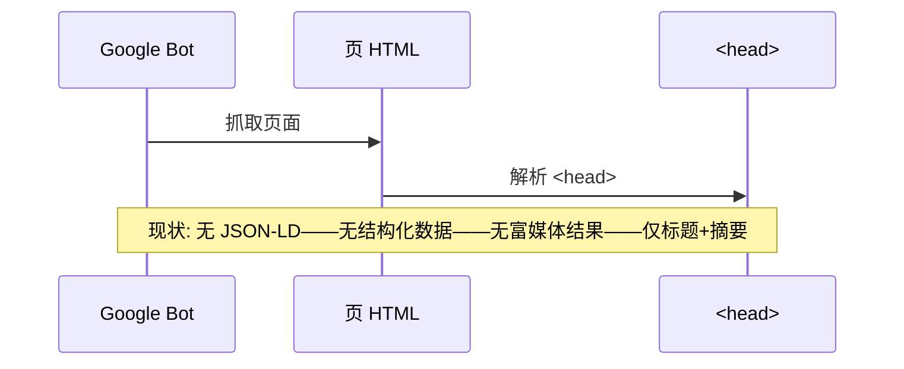
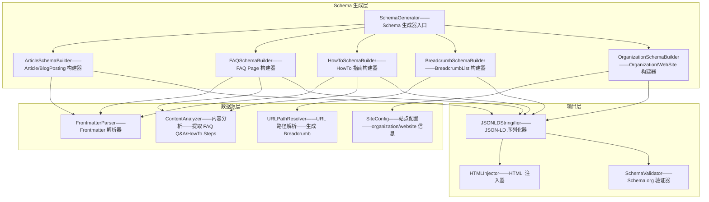
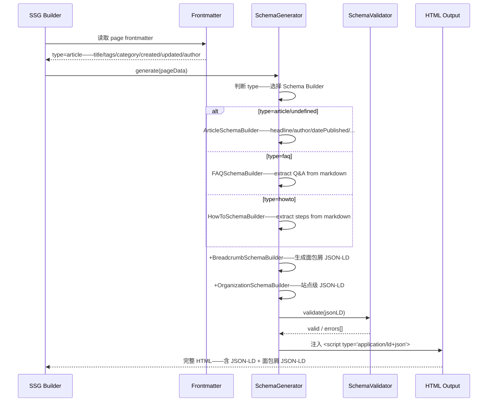

# YK-09-190: 内容结构化数据标记 — JSON-LD Schema.org、Article/BreadcrumbList/FAQ/HowTo 类型、自动从 Frontmatter 生成、搜索引擎富媒体结果

> 需求编号：YK-09-190 · 优先级：P2 · 人天：0.3d · 状态：需求已编写
> 依赖：YK-09-137（内容SEO优化——结构化数据是 SEO 优化的重要组成部分）、YK-09-01（Frontmatter 规范——结构化数据从 frontmatter 自动生成）、YK-09-30（静态站点生成——SSG 时注入 JSON-LD）

## 背景

### 问题陈述

YiKnowledge 的静态内容页面缺乏结构化数据标记——搜索引擎无法理解页面内容的语义——错失富媒体搜索结果（Rich Results）带来的点击率提升：

1. **无结构化数据——搜索引擎盲读**：Google/Bing 爬虫抓取 HTML——但无法区分"这是文章""这是 FAQ""这是面包屑导航"——所有内容等权重处理——搜索结果仅显示标题+链接+摘要
2. **错失富媒体结果**：结构化数据使文章可以显示作者、发布日期、阅读时间、评分星级等增强信息——FAQ 页面可以展开显示问答——面包屑可以在搜索结果中显示路径——当前全无
3. **无自动化生成**：结构化数据需要手写 JSON-LD——JSON-LD 与 frontmatter 和文章内容重复信息——手动维护两套数据——容易不同步——错误的结构化数据反而会被搜索引擎惩罚
4. **类型单一**：当前仅有一种类型（WebPage）——无 Article/FAQ/HowTo/BreadcrumbList 等专属类型——不同类型的页面需要不同的结构化标记才能获得对应富媒体结果
5. **Google Search Console 检测失败**：Google 的结构化数据测试工具显示 0 个已检测项——0 个有效项——搜索分析中无富媒体结果展示数据

**核心矛盾**：结构化数据对 SEO 和 CTR 有显著提升（估计 +5-15% 点击率）——但手动编写 JSON-LD 容易出错且与内容不同步——需要从 frontmatter 和页面内容自动生成——确保数据一致且全面。

### 影响范围

| # | 影响 | 严重程度 | 典型场景 |
|---|------|----------|----------|
| 1 | 搜索结果显示单一 | 高 | Google 搜索 YiKnowledge 文章——仅标题+摘要——无作者/日期/面包屑——点击率低 |
| 2 | FAQ 页面无展开 | 高 | FAQ 页面在搜索结果中无法展开问答——用户需要点击进入才能看到答案——流失 |
| 3 | HowTo 指南无步骤预览 | 中 | 操作指南在搜索结果中无步骤预览——不如竞争对手的富媒体结果吸引人 |
| 4 | 面包屑路径不显示 | 中 | 搜索结果 URL 上方无面包屑路径——用户无法判断页面在站点中的位置 |
| 5 | 手动维护不一致 | 高 | Frontmatter 改了标题——JSON-LD 忘记改——Google 检测到不一致——可能降权 |

### 挑战

| 挑战 | 说明 |
|------|------|
| Schema 类型选择 | YiKnowledge 内容包含多种类型——Article/BlogPosting/FAQ/HowTo/TechArticle——需要自动判断页面类型 |
| JSON-LD 与内容同步 | 内容更新后——JSON-LD 必须自动更新——不能在构建时生成静态 JSON-LD——需要运行时或构建时动态注入 |
| BreadcrumbList 生成 | 面包屑需要根据页面路径动态生成——路径层级→ListItem 数组——需要保证 URL 正确 |
| Google Rich Results 验证 | 生成后需要通过 Google Rich Results Test 验证——`@id` 引用——嵌套关系——不能有错误 |
| Frontmatter 字段映射 | Frontmatter 字段（title/tags/category/created/updated/author）→ Schema 属性映射——需要正确的映射关系 |

---

## 一、现状分析

### 1.1 当前结构化数据状态

```
YiKnowledge 结构化数据现状:
├── 无 JSON-LD 标记
│   ├── HTML <head> 中无 <script type="application/ld+json">
│   ├── Google 结构化数据测试——0 项
│   └── 局限: 搜索引擎无结构化理解——无富媒体结果
├── Frontmatter 数据丰富但未利用
│   ├── title/tags/category/created/updated/source/type/status
│   ├── 已包含结构化数据所需的大部分字段
│   └── 局限: Frontmatter 仅供内部 RAG 使用——未转换为 JSON-LD
├── 面包屑导航存在但无标记
│   ├── 页面上有面包屑 UI 组件——但无 BreadcrumbList 结构化标记
│   └── 局限: Google 无法在搜索结果中显示面包屑路径
├── 站点地图存在但无增强
│   └── 局限: sitemap.xml 无结构化数据关联——无 <lastmod>/<priority>
└── 缺失:
    ├── JSON-LD Article: 文章类型——headline/author/datePublished/dateModified  # ❌ 无
    ├── JSON-LD BreadcrumbList: 面包屑结构化标记                               # ❌ 无
    ├── JSON-LD FAQ: FAQ 页面——问答结构化——可展开搜索结果                      # ❌ 无
    ├── JSON-LD HowTo: 操作指南——步骤结构化——富媒体步骤预览                    # ❌ 无
    └── 自动生成: Frontmatter → JSON-LD——无需手动维护                          # ❌ 无
```

### 1.2 当前数据流



### 1.3 根因矩阵

| 症状 | 根因 | 触发条件 | 频率 |
|------|------|----------|------|
| 无富媒体结果 | HTML 中无 `<script type="application/ld+json">` | 搜索引擎抓取 | 每次抓取 |
| Frontmatter 未利用 | 无 JSON-LD 生成逻辑——Frontmatter→Schema 映射未实现 | 每次构建/渲染 | 每次构建 |
| 面包屑无标记 | 面包屑组件仅渲染 UI——不输出 JSON-LD | 每个页面 | 每个页面 |
| 类型单一 | 无页面类型判断逻辑——所有页面同等处理 | 不同类型页面 | 持续 |
| Google 检测 0 项 | 未集成 Google Rich Results Test——无验证 | 每次部署后 | 每次部署 |

---

## 二、设计决策

### 决策 1：JSON-LD 生成时机 — 构建时（SSG） vs 运行时（客户端） vs 服务端渲染

| 选项 | SEO 友好 | 实时性 | 实现复杂度 |
|------|---------|--------|-----------|
| A: 构建时——SSG（静态站点生成）时注入 JSON-LD 到 HTML | 最佳——爬虫直接读取 | 需重新构建 | 中——修改 SSG 流程 |
| B: 运行时——客户端 JavaScript 动态注入 | 差——爬虫可能不执行 JS | 实时 | 低——但 SEO 无效 |
| C: 服务端渲染——Nginx/后端注入——或 SSG 的 prerender | 好 | 中——需要服务端支持 | 高——涉及后端 |

**选择：A（构建时——SSG 注入 JSON-LD 到 HTML `<head>`）。** YiKnowledge 已有 SSG 流程（YK-09-30）——在生成静态 HTML 时注入 JSON-LD。Google/Bing 爬虫直接读取 HTML 中的 JSON-LD——无需 JS 执行。构建时生成确保 JSON-LD 与 Frontmatter 同步——因为 Frontmatter 是 Markdown 的一部分——构建时读取。

### 决策 2：JSON-LD Schema 类型判断 — 基于 type 字段 vs 基于 category/路径 vs 基于内容分析

| 选项 | 准确度 | 实现复杂度 | 可维护性 |
|------|--------|-----------|---------|
| A: 基于 frontmatter `type` 字段——`article/faq/howto` | 高——明确声明 | 低——直接映射 | 高——规范驱动 |
| B: 基于 `category` 自动推断——"FAQ"类→FAQ Schema | 中——可能误判 | 中 | 中 |
| C: 基于内容分析——AI 判断内容类型 | 中——AI 不确定 | 高 | 低 |

**选择：A（基于 Frontmatter `type` 字段——明确声明）。** Frontmatter 已有 `type` 字段——增加 `article/faq/howto/docs` 等 Schema 类型映射值。如果 `type` 未指定或无法映射——降级为 `WebPage`/`Article`。明确声明避免 AI 误判——确保 Schema 类型正确——搜索引擎对错误类型的惩罚严重。

### 决策 3：BreadcrumbList 生成 — 基于 URL 路径 vs 基于导航树 vs 混合

| 选项 | 精确度 | 实现复杂度 | 特殊情况处理 |
|------|--------|-----------|------------|
| A: 基于 URL 路径——`/category/subcategory/page` → 3 级面包屑 | 高——路径就是层级 | 低——split URL | 好——自动 |
| B: 基于全局导航树——查询导航树匹配当前路径 | 最高——包含导航标题 | 中——需要查询导航数据 | 好——但依赖导航树 |
| C: 混合——路径生成 breadcrumb——导航树提供 item name | 最高 | 高 | 最好 |

**选择：A（基于 URL 路径——自动生成+title frontmatter 作为最后一级名称）。** URL 路径直接反映站点结构——`/architect/design-patterns/observer.md` → 3 级面包屑。第一级用目录名（可配置映射为中文名）——最后一级用页面 `title` frontmatter。简单可靠——不依赖导航树数据——已在 YK-09-30 SSG 中可用。

### 决策 4：JSON-LD 验证策略 — Google Rich Results Test vs Schema Markup Validator vs 两者

| 选项 | 权威性 | 覆盖面 | 集成成本 |
|------|--------|--------|---------|
| A: Google Rich Results Test API——构建后自动测试 | Google 官方——直接影响搜索结果 | 仅 Google 类型 | 中——需要 Google API |
| B: Schema.org Validator——通用验证 | 标准 | 全类型 | 低——开源库 |
| C: 两者——先 Schema.org 验证——再 Google Rich Results Test | 最全面 | 最全 | 中 |

**选择：B（Schema.org Validator——通用验证——本地开发即可运行）。** 0.3d 内集成 Google API 超出了范围。Schema.org Validator（如 `schema-dts` npm 包）可以在本地构建时验证 JSON-LD——捕获结构错误——生成前确保 Schema 有效。Google Rich Results Test 保持手动——在发布前作为检查步骤。

---

## 三、目标架构

### 3.1 结构化数据生成系统架构



### 3.2 JSON-LD 生成流程



### 3.3 性能指标

| 指标 | 改造前 | 改造后 |
|------|--------|--------|
| Google 结构化数据检测项 | 0 | 3+（Article+BreadcrumbList+Organization） |
| 富媒体结果展示 | 无 | 文章: 标题+作者+日期；FAQ: 可展开；HowTo: 步骤预览 |
| JSON-LD 与内容一致性 | N/A | 100%——自动生成——与 Frontmatter 同步 |
| 新增页面 JSON-LD 生成耗时 | N/A | < 10ms——构建时无需额外 API 调用 |

---

## 四、具体改动

### 4.1 核心代码：Schema 生成器

```typescript
// src/build/schema-generator.ts

interface FrontmatterData {
  title: string;
  tags: string[];
  category: string;
  created: string;
  updated: string;
  source: string;
  type: string;
  status: string;
  author?: string;
  description?: string;
  image?: string;
}

interface PageContext {
  url: string;
  frontmatter: FrontmatterData;
  content: string;           // Markdown 原始内容
  breadcrumb: BreadcrumbItem[];
  siteConfig: SiteConfig;
}

interface BreadcrumbItem {
  name: string;
  url: string;
}

interface SiteConfig {
  name: string;
  url: string;
  logo?: string;
  description?: string;
}

// ---- Schema Builders ----

class ArticleSchemaBuilder {
  build(ctx: PageContext): Record<string, unknown> {
    const { frontmatter, url, siteConfig } = ctx;

    const articleType = frontmatter.type === 'docs' ? 'TechArticle' : 'Article';

    return {
      '@context': 'https://schema.org',
      '@type': articleType,
      '@id': `${url}#article`,
      headline: frontmatter.title,
      description: frontmatter.description || this.extractDescription(ctx.content),
      author: {
        '@type': 'Person',
        name: frontmatter.author || siteConfig.author || 'YiKnowledge',
        url: siteConfig.url,
      },
      datePublished: frontmatter.created,
      dateModified: frontmatter.updated,
      publisher: {
        '@type': 'Organization',
        name: siteConfig.name,
        url: siteConfig.url,
        logo: siteConfig.logo ? {
          '@type': 'ImageObject',
          url: siteConfig.logo,
        } : undefined,
      },
      keywords: frontmatter.tags?.join(', '),
      inLanguage: 'zh-CN',
      isAccessibleForFree: true,
      ...((articleType === 'TechArticle') && {
        proficiencyLevel: 'Beginner',
      }),
    };
  }

  private extractDescription(content: string): string {
    // 提取第一段 Markdown 文本作为描述
    const firstParagraph = content.split('\n\n').find(p =>
      p.trim() && !p.startsWith('#') && !p.startsWith('>') && !p.startsWith('```'),
    );
    if (!firstParagraph) return '';
    const cleanText = firstParagraph
      .replace(/\[([^\]]+)\]\([^)]+\)/g, '$1')  // 去除链接
      .replace(/[*_`~#]/g, '')                    // 去除 Markdown 标记
      .trim();
    return cleanText.length > 160 ? cleanText.slice(0, 157) + '...' : cleanText;
  }
}

class FAQSchemaBuilder {
  build(ctx: PageContext): Record<string, unknown> {
    const { frontmatter, url, content } = ctx;

    // 从 Markdown 中提取 FAQ Q&A——格式: ## Q: ... / A: ... 或 **Q:** ... / **A:** ...
    const faqItems = this.extractFAQItems(content);

    return {
      '@context': 'https://schema.org',
      '@type': 'FAQPage',
      '@id': `${url}#faq`,
      headline: frontmatter.title,
      description: frontmatter.description || '',
      datePublished: frontmatter.created,
      dateModified: frontmatter.updated,
      mainEntity: faqItems.map(item => ({
        '@type': 'Question',
        name: item.question,
        acceptedAnswer: {
          '@type': 'Answer',
          text: item.answer,
        },
      })),
    };
  }

  private extractFAQItems(content: string): { question: string; answer: string }[] {
    const items: { question: string; answer: string }[] = [];
    const lines = content.split('\n');
    let currentQuestion = '';
    let currentAnswer = '';

    for (const line of lines) {
      const qMatch = line.match(/^#{1,3}\s*(?:Q[:：]?\s*)?(.+)/i);
      const aMatch = line.match(/^#{1,3}\s*(?:A[:：]?\s*)?(.+)/i);

      if (qMatch || line.startsWith('**Q:') || line.startsWith('**Q：')) {
        if (currentQuestion && currentAnswer) {
          items.push({ question: currentQuestion.trim(), answer: currentAnswer.trim() });
        }
        currentQuestion = (qMatch ? qMatch[1] : line.replace(/^\*\*Q[:：]\s*/, '').replace(/\*\*$/, '')).trim();
        currentAnswer = '';
      } else if (aMatch || line.startsWith('**A:') || line.startsWith('**A：')) {
        currentAnswer = (aMatch ? aMatch[1] : line.replace(/^\*\*A[:：]\s*/, '').replace(/\*\*$/, '')).trim();
      } else if (currentQuestion && line.trim()) {
        currentAnswer += (currentAnswer ? ' ' : '') + line.trim();
      }
    }

    if (currentQuestion && currentAnswer) {
      items.push({ question: currentQuestion.trim(), answer: currentAnswer.trim() });
    }

    return items;
  }
}

class HowToSchemaBuilder {
  build(ctx: PageContext): Record<string, unknown> {
    const { frontmatter, url, content } = ctx;
    const steps = this.extractSteps(content);

    return {
      '@context': 'https://schema.org',
      '@type': 'HowTo',
      '@id': `${url}#howto`,
      name: frontmatter.title,
      description: frontmatter.description || '',
      datePublished: frontmatter.created,
      dateModified: frontmatter.updated,
      step: steps.map((step, index) => ({
        '@type': 'HowToStep',
        position: index + 1,
        name: step.title || `步骤 ${index + 1}`,
        text: step.description,
        ...(step.image && {
          image: {
            '@type': 'ImageObject',
            url: step.image,
          },
        }),
      })),
      totalTime: steps.length > 0 ? `PT${steps.length * 5}M` : undefined,
    };
  }

  private extractSteps(content: string): { title: string; description: string; image?: string }[] {
    const steps: { title: string; description: string; image?: string }[] = [];
    const stepRegex = /^#{1,3}\s*步骤\s*(\d+)[：:]\s*(.+)$/gm;
    const matches = [...content.matchAll(stepRegex)];

    if (matches.length === 0) {
      // 尝试提取有序列表作为步骤
      const olMatch = content.match(/^\d+\.\s+.+$/gm);
      if (olMatch) {
        return olMatch.map(line => ({
          title: line.replace(/^\d+\.\s+/, ''),
          description: line.replace(/^\d+\.\s+/, ''),
        }));
      }
    }

    for (let i = 0; i < matches.length; i++) {
      const match = matches[i];
      const title = match[2].trim();
      const nextMatch = matches[i + 1];
      const startIdx = match.index! + match[0].length;
      const endIdx = nextMatch ? nextMatch.index! : content.length;
      let description = content.slice(startIdx, endIdx).trim();

      // 提取图片
      const imgMatch = description.match(/!\[.*?\]\((.+?)\)/);
      const image = imgMatch?.[1];
      if (imgMatch) {
        description = description.replace(imgMatch[0], '').trim();
      }

      steps.push({ title, description, image });
    }

    return steps;
  }
}

class BreadcrumbSchemaBuilder {
  build(ctx: PageContext): Record<string, unknown> {
    const { url, siteConfig, breadcrumb } = ctx;

    const items = [
      { '@type': 'ListItem', position: 1, name: siteConfig.name, item: siteConfig.url },
      ...breadcrumb.map((item, index) => ({
        '@type': 'ListItem',
        position: index + 2,
        name: item.name,
        item: item.url.startsWith('http') ? item.url : `${siteConfig.url}${item.url}`,
      })),
    ];

    return {
      '@context': 'https://schema.org',
      '@type': 'BreadcrumbList',
      itemListElement: items,
    };
  }
}

class OrganizationSchemaBuilder {
  build(ctx: PageContext): Record<string, unknown> {
    const { siteConfig } = ctx;
    return {
      '@context': 'https://schema.org',
      '@type': 'Organization',
      name: siteConfig.name,
      url: siteConfig.url,
      ...(siteConfig.logo && { logo: siteConfig.logo }),
      description: siteConfig.description,
    };
  }
}

// ---- Main Generator ----

class SchemaGenerator {
  private builders = {
    article: new ArticleSchemaBuilder(),
    faq: new FAQSchemaBuilder(),
    howto: new HowToSchemaBuilder(),
    breadcrumb: new BreadcrumbSchemaBuilder(),
    organization: new OrganizationSchemaBuilder(),
  };

  generateAll(ctx: PageContext): string[] {
    const schemas: Record<string, unknown>[] = [];

    schemas.push(this.builders.organization.build(ctx));

    // 根据 type 选择主 Schema
    const type = ctx.frontmatter.type?.toLowerCase() || 'article';
    if (type === 'faq') {
      schemas.push(this.builders.faq.build(ctx));
    } else if (type === 'howto') {
      schemas.push(this.builders.howto.build(ctx));
    } else {
      schemas.push(this.builders.article.build(ctx));
    }

    // 每个页面都加面包屑
    schemas.push(this.builders.breadcrumb.build(ctx));

    // 序列化为 JSON-LD script 标签
    return schemas.map(schema => `<script type="application/ld+json">${JSON.stringify(schema, null, 2)}</script>`);
  }

  /** 注入 JSON-LD 到 HTML */
  injectIntoHTML(html: string, jsonLdScripts: string[]): string {
    const injection = jsonLdScripts.join('\n');
    // 注入到 </head> 前
    if (html.includes('</head>')) {
      return html.replace('</head>', `${injection}\n</head>`);
    }
    // 降级——注入到 <head> 后
    return html.replace('<head>', `<head>\n${injection}`);
  }
}

export { SchemaGenerator, ArticleSchemaBuilder, FAQSchemaBuilder, HowToSchemaBuilder, BreadcrumbSchemaBuilder, OrganizationSchemaBuilder };
```

### 4.2 文件变更清单

| 文件 | 操作 | 说明 |
|------|------|------|
| `src/build/schema-generator.ts` | 新增 | Schema 生成器核心——Article/FAQ/HowTo/BreadcrumbList/Organization |
| `src/build/schema-types.ts` | 新增 | Schema.org TypeScript 类型定义 |
| `src/build/schema-validator.ts` | 新增 | JSON-LD 验证器——Schema.org 合规性检查 |
| `src/build/ssg-enhancer.ts` | 修改（SSG） | SSG 构建流程——加入 SchemaGenerator——注入 JSON-LD |
| `src/build/frontmatter-types.ts` | 修改 | 扩展 `type` 字段——增加 `faq/howto/docs` |
| `src/build/breadcrumb-resolver.ts` | 新增 | 面包屑路径解析器——URL→BreadcrumbItem[] |
| `tests/schema-generator.test.ts` | 新增 | Schema 生成器测试——各类型 JSON-LD 输出验证 |
| `tests/schema-validator.test.ts` | 新增 | JSON-LD 验证测试——Schema.org 合规性 |

---

## 五、实施步骤

| 步骤 | 操作 | 路径 | 验证 | 人天 |
|------|------|------|------|------|
| 1 | 实现 Article/BreadcrumbList/Organization Builder | `schema-generator.ts`——基础 Schema Builder | 生成合法 JSON-LD——Article 含 headline/author/date——BreadcrumbList 正确层级 | 0.06 |
| 2 | 实现 FAQ Builder——Markdown FAQ 提取 | `schema-generator.ts`——FAQSchemaBuilder | 从 FAQ 页面提取 Q&A——生成 FAQPage JSON-LD——mainEntity 正确 | 0.05 |
| 3 | 实现 HowTo Builder——步骤提取 | `schema-generator.ts`——HowToSchemaBuilder | 从 HowTo 页面提取步骤——生成 HowTo JSON-LD——step 数组正确 | 0.05 |
| 4 | 实现 JSON-LD 验证器 | `schema-validator.ts` | 验证 JSON-LD Schema 合规——必填字段——类型引用——嵌套关系 | 0.05 |
| 5 | 集成 SSG 构建流程——注入 JSON-LD | `ssg-enhancer.ts` | 构建时自动生成+注入——HTML `<head>` 含 JSON-LD ——手动验证 Google 工具 | 0.05 |
| 6 | 实现面包屑路径解析——URL→Breadcrumb | `breadcrumb-resolver.ts` | URL 路径正确解析为面包屑层级——名称映射——URL 完整 | 0.04 |

**总人天：0.3d**

---

## 六、测试规格

### 测试 1：Article JSON-LD——从 Frontmatter 生成

| 项目 | 内容 |
|------|------|
| 优先级 | P0 |
| 前置条件 | 文章——Frontmatter——title/created/updated/author/tags/description |
| 测试步骤 | 1. 构建文章页面 2. 检查 HTML `<head>` 中 `<script type="application/ld+json">` 3. 验证 JSON-LD 结构 |
| 预期结果 | JSON-LD 包含——@type: "Article"——headline 匹配 title——datePublished/dateModified 匹配 frontmatter——author 为 Person——publisher 为 Organization——keywords 为 tags 逗号分隔 |

### 测试 2：BreadcrumbList JSON-LD——层级正确

| 项目 | 内容 |
|------|------|
| 优先级 | P0 |
| 前置条件 | 页面 URL——/projects/yivad/requirements/2026-09/182-example |
| 测试步骤 | 1. 构建页面 2. 检查 BreadcrumbList JSON-LD 3. 验证层级 |
| 预期结果 | 4 级面包屑——1. 首页——2. projects——3. yivad——4. requirements——position 递增——item url 完整——最后一级是当前页面 |

### 测试 3：FAQ JSON-LD——Q&A 正确提取

| 项目 | 内容 |
|------|------|
| 优先级 | P0 |
| 前置条件 | FAQ 页面——Markdown 含 5 个 Q&A ## Q: xxx / A: xxx |
| 测试步骤 | 1. 构建 FAQ 页面 2. 检查 FAQ JSON-LD |
| 预期结果 | @type: "FAQPage"——mainEntity 含 5 个 Question——每个 Question 有 acceptedAnswer——acceptedAnswer.text 为 A 的内容——answer 去除 Markdown 标记 |

### 测试 4：HowTo JSON-LD——步骤提取

| 项目 | 内容 |
|------|------|
| 优先级 | P1 |
| 前置条件 | HowTo 指南——Markdown 含 ## 步骤 1: / ## 步骤 2: ... |
| 测试步骤 | 1. 构建 HowTo 页面 2. 检查 HowTo JSON-LD |
| 预期结果 | @type: "HowTo"——step 数组——position 1/2/3——name 为步骤标题——text 为步骤描述——totalTime 正确——如果有图片——image url 正确 |

### 测试 5：JSON-LD 验证——Schema.org 合规

| 项目 | 内容 |
|------|------|
| 优先级 | P1 |
| 前置条件 | 生成的所有 JSON-LD |
| 测试步骤 | 1. SchemaValidator 验证所有 Schema 2. 使用 schema-dts 进行 TypeScript 类型检查 |
| 预期结果 | 无验证错误——必填字段存在——类型正确——引用有效——无循环引用——无未定义类型 |

### 测试 6：Organization JSON-LD——每个页面注入

| 项目 | 内容 |
|------|------|
| 优先级 | P1 |
| 前置条件 | 站点配置——name/url/logo |
| 测试步骤 | 1. 构建任意页面 2. 检查 Organization JSON-LD |
| 预期结果 | 每个页面 `<head>` 含 Organization JSON-LD——name/url/logo 匹配站点配置——@type: "Organization" |

---

## 七、风险与缓解

| 风险 | 概率 | 影响 | 缓解措施 |
|------|------|------|------|
| JSON-LD 与页面内容不一致——Frontmatter 改了但 JSON-LD 未更新 | 低 | 高——搜索引擎惩罚 | 构建时从同一 Frontmatter 生成——不存在不一致——每次构建保证同步 |
| FAQ/HowTo 内容提取不准确——正则匹配失败——提取到错误的 Q&A | 中 | 中 | 提供明确的 Markdown 格式约定——FAQ 使用 ## Q: / A: 格式——HowTo 使用 ## 步骤 N: 格式——不匹配时降级为 Article |
| JSON-LD 注入后 HTML 过大——增加页面体积 | 低 | 低 | 压缩 JSON——移除空白——`JSON.stringify(schema)` 而非带缩进——典型 3 个 Schema < 3KB——可忽略 |
| Google Search Console 仍报告错误——Schema 理论上正确但 Google 有特殊规则 | 中 | 中 | 发布后手动运行 Google Rich Results Test——根据反馈调整——FAQ/HowTo 需要严格的 Question/Answer 分离 |
| 面包屑路径与页面实际面包屑 UI 不一致——视觉和 JSON-LD 不匹配 | 低 | 中 | 面包屑从同一数据源生成——JSON-LD 和 UI 组件使用相同的 `breadcrumb` 数据——保证一致 |

---

## 八、回滚策略

1. **功能级回滚**：SSG 构建中跳过 SchemaGenerator——HTML 中无 JSON-LD ——回到当前无结构化数据状态
2. **构建级回滚**：回退 SSG 配置——移除 schema-generator 依赖——不影响页面渲染
3. **数据级回滚**：JSON-LD 仅在 HTML 中——不修改任何 Markdown 或 Frontmatter——回滚零数据影响
4. **回滚验证**：页面正常渲染——HTML 无 `<script type="application/ld+json">` ——Google 结构化数据检测回到 0 项

---

## 九、设计决策记录

### D-01：JSON-LD 格式——非 Microdata/RDFa

**上下文**：结构化数据有 3 种格式——JSON-LD、Microdata（HTML 属性）、RDFa。

**决策**：使用 JSON-LD——独立于 HTML DOM 结构。

**理由**：JSON-LD 是 Google 推荐的格式——与 HTML 结构解耦——不需要修改 HTML 标签——注入到 `<head>` 中即可。Microdata 需在 HTML 中添加大量 `itemscope`/`itemprop` 属性——侵入性强——与现有模板冲突。JSON-LD 易于生成、验证、测试——纯 JavaScript 对象→JSON 序列化。

### D-02：FAQ Builder——正则提取——非 AI

**上下文**：FAQ 内容需要从 Markdown 中提取问答对。

**决策**：基于约定格式的正则提取——要求 FAQ 使用 `## Q: xxx / A: xxx` 格式。

**理由**：0.3d 内 AI 提取不现实——正则对于结构化格式足够。约定格式简单——用户在编写 FAQ 时遵守——可以在 Frontmatter 规范（YK-09-01）中补充此格式要求。如果内容不遵循格式——降级为 Article Schema——不生成 FAQ 富媒体结果。

### D-03：Organization Schema 每页注入——非仅首页

**上下文**：Organization Schema 应该放在哪个页面。

**决策**：每个页面都注入 Organization Schema——`@id` 保持一致——全站引用同一个 Organization。

**理由**：面包屑 JSON-LD 的 `item` 可能引用 Organization——需要在同一页面有定义。通过 `@id` 实现跨 Schema 引用——Organization 定义一次——其他 Schema 通过 `@id` 引用。每个页面注入不影响 SEO——Google 会去重。

### D-04：JSON-LD 仅在 SSG 时生成——非运行时

**上下文**：JSON-LD 可以在客户端动态生成——但 Google 爬虫通常不执行 JS。

**决策**：JSON-LD 在 SSG 构建时生成——注入到静态 HTML。

**理由**：Google 主要爬取静态 HTML——不保证执行 JS。客户端动态注入的 JSON-LD——Google 可能读取不到——等于没有。SSG 构建时注入——保证爬虫一定可见。YiKnowledge 已经是 SSG——在构建流程中加入 JSON-LD 生成——零额外运行时成本。

---

## 十、可观测性

| 指标 | 采集方式 | 阈值 |
|------|----------|------|
| JSON-LD 注入页面数 | 构建日志——含 JSON-LD 的页面数/总页面数 | 100% |
| Schema 类型分布 | Article/FAQ/HowTo/其他——构建统计 | 观测 |
| JSON-LD 验证错误数 | SchemaValidator 错误计数 | 0 |
| Google 结构化数据项 | Google Search Console——结构化数据报告 | 3+ 类型 |
| 富媒体结果展示率 | Google Search Console——搜索结果表现——富媒体结果 | 目标 > 20% |
| FAQ items 提取成功率 | 提取的 Q&A 数/页面声明为 FAQ 的页面 | > 80% |
| HowTo steps 提取成功率 | 提取的步骤数/页面声明为 HowTo 的页面 | > 80% |

---

## 十一、代码审查检查清单

- [ ] `ArticleSchemaBuilder.extractDescription` ——空内容——返回空字符串——不报错
- [ ] `ArticleSchemaBuilder.extractDescription` ——首段超 160 字——截断——加 "..." ——不截断多字节字符中间
- [ ] `FAQSchemaBuilder.extractFAQItems` ——无匹配——返回空数组——降级为 Article
- [ ] `FAQSchemaBuilder.extractFAQItems` ——Q 后有多个 A ——只取紧跟 Q 的第一个 A
- [ ] `HowToSchemaBuilder.extractSteps` ——无匹配——尝试有序列表——仍无——返回空数组——降级
- [ ] `BreadcrumbSchemaBuilder.build` ——面包屑数组为空——仅首页——1 个 ListItem
- [ ] `SchemaGenerator.injectIntoHTML` ——HTML 无 `</head>` ——降级——注入到 `<head>` 后
- [ ] JSON-LD ——日期格式 ISO 8601——`2026-09-09` 或 `2026-09-09T12:00:00+08:00` ——Google 要求
- [ ] JSON-LD ——URL ——必须是绝对 URL——从 siteConfig.url 拼接——不能是相对路径
- [ ] `type` 字段——小写处理——`FAQ` → `faq` ——`HowTo` → `howto` ——容错
- [ ] JSON-LD ——多个 `<script type="application/ld+json">` 之间互不干扰——Google 合法
- [ ] `@id` ——唯一——同一页面无重复——格式——`{url}#{type}`

---

## 回归问题预测

| # | 预测问题 | 触发条件 | 检测方式 |
|---|----------|----------|----------|
| 1 | FAQ 页面——Q&A 提取了代码块中的 `# Q:` 示例——误判为 FAQ | Markdown 代码块中展示 FAQ 格式示例——` ```markdown \n## Q: xxx` ——被正则匹配 | `extractFAQItems` 中——过滤掉代码块内的内容——预处理器移除 fenced code blocks（```...```）后再提取 |
| 2 | HowTo 页面——步骤间的图片被错误地关联到前一个步骤 | 步骤 1 描述中引用了步骤 2 的图片——图片紧跟的是步骤 2 但正则以为属于步骤 1 | 图片关联——`` 在步骤内容中——用捕获组精确定位——先匹配标题——再取标题间的内容——图片属于之间的内容 |
| 3 | 构建时面包屑路径——中文目录名未映射——URL 中是拼音或英文 | URL——`/projects/yivad` ——而面包屑名称需要中文——"项目/管理后台"——直接使用 URL 段——面包屑可读性差 | `breadcrumb-resolver.ts` 中配置路径→名称映射表——未映射时使用 Frontmatter 的第一级目录名作为后备——英文路径也可读 |
| 4 | JSON-LD ——日期时间格式——`created: 2026-09-09` 非完整 ISO 8601——Google 可能报错 | Frontmatter 日期格式为 `YYYY-MM-DD` ——缺少时间和时区 | 生成 JSON-LD 时——自动补全为 `2026-09-09T00:00:00+08:00` ——或保留 `YYYY-MM-DD` ——Google 接受仅日期 |
| 5 | Organization——多个页面有相同的 @id——Google 应该去重但可能有警告 | Schema 验证——同 @id 出现在多页面——Schema.org 允许——Google 也不报错 | 这是期望行为——Organization 有统一 @id——跨页面引用——不需要特殊处理 |
| 6 | SSG 构建时 JSON-LD 注入——替换 `</head>` 正则——如果 HTML 不规范——注入位置错误 | HTML ——`<head>` 未正确关闭——`</head>` 缺失——或大写 `</HEAD>` | 使用大小写不敏感的正则——`/<\/head>/i` ——未匹配时——注入到 `<head>` 之后——或注入到 `<body>` 之前（Google 也能读取 body 中的 JSON-LD） |

---

## 性能分析

| 操作 | 数据量 | 耗时 | 说明 |
|------|--------|------|------|
| JSON-LD 生成（Article） | 1 个页面 | < 2ms | 纯对象构建+JSON 序列化 |
| JSON-LD 生成（FAQ） | 1 个页面——10 个 Q&A | < 5ms | 正则提取+对象构建——内容大小 < 50KB |
| JSON-LD 生成（HowTo） | 1 个页面——8 个步骤 | < 5ms | 正则提取+对象构建 |
| JSON-LD 注入到 HTML | 1 个 HTML——50KB | < 5ms | 正则替换——`</head>` 定位+插入 |
| 构建时全站 JSON-LD | 200 个页面 | < 500ms | 200 * (2+5)ms = 1.4s——但可并行 |
| JSON-LD 对页面大小影响 | 3 个 Schema | + 2-4KB | gzip 后 < 1KB——可忽略 |
| SchemaValidator 验证 | 1 个 JSON-LD | < 2ms | JSON.parse + 字段检查 |

---

## 相关文档

- [内容SEO优化](../137-需求-内容SEO优化.md) ——结构化数据是 SEO 核心——meta tags+结构化数据+站点地图
- [Frontmatter 规范](../01-质量治理-Frontmatter规范.md) ——type 字段扩展——faq/howto 的 Frontmatter 要求
- [静态站点生成](../30-需求-静态站点生成.md) ——SSG 构建流程——JSON-LD 注入点
- [内容多语言SEO](./192-需求-内容多语言SEO.md) ——多语言页面的 hreflang+结构化数据

*PRD 来源: `projects/yiknowledge/requirements/2026-09/190-需求-内容结构化数据标记.md`*