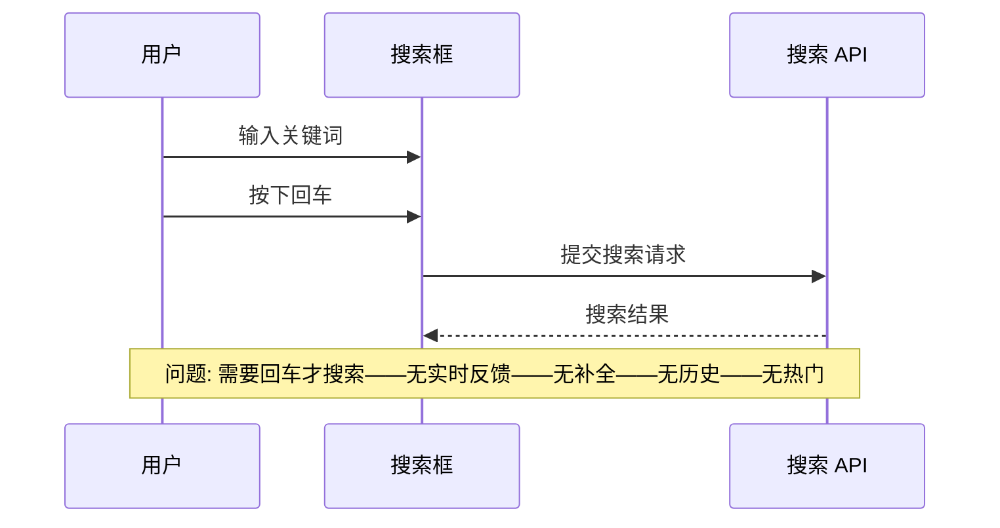
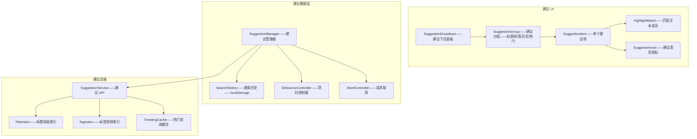
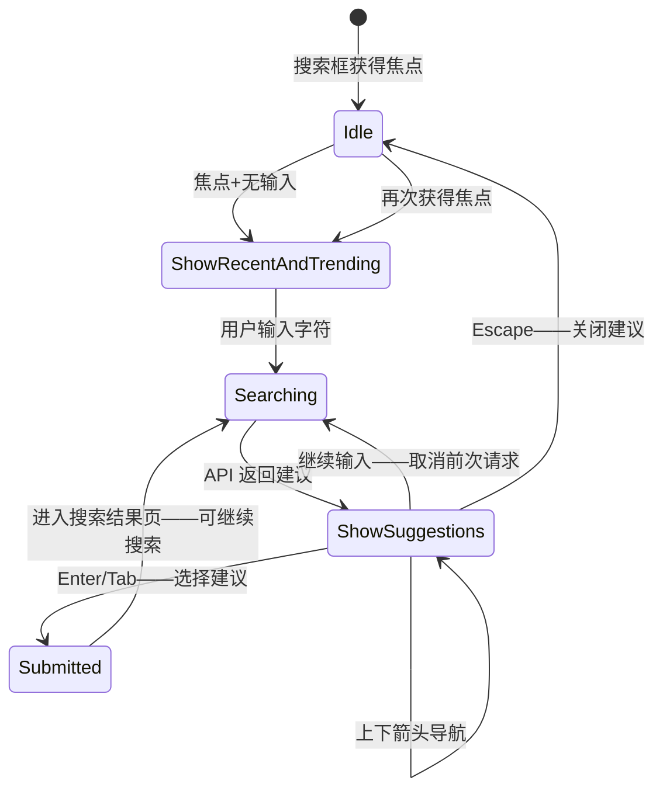

# YK-09-191: 内容搜索建议 — 即搜即得、自动补全下拉、最近搜索、热门查询、建议分类、键盘导航

> 需求编号：YK-09-191 · 优先级：P2 · 人天：0.3d · 状态：需求已编写
> 依赖：YK-09-172（内容全局搜索优化——本需求是全局搜索的增强——即搜即得体验）、YK-09-67（查询自动补全建议——共享补全数据源）、YK-09-142（内容排行榜与热门——热门查询数据源）

## 背景

### 问题陈述

YiKnowledge 知识库当前搜索需要用户按下回车或提交后才能看到结果——缺乏实时反馈——导致搜索效率低下：

1. **无实时建议**：用户输入搜索词——不知道是否有相关内容——只有提交后才能看到——可能搜索词拼写错误或不够精确——需要反复尝试
2. **无自动补全**：输入"架构"——系统不知道用户可能在搜索"架构设计"还是"架构重构"还是"架构优化"——无法辅助用户完成输入——尤其是长关键词
3. **无搜索历史**：用户可能经常搜索相同的关键词（如"RAG"、"MongoDB"、"agent"）——每次都要重新输入——无法快速复用历史搜索
4. **无热门趋势**：知识库中近期最常被搜索的内容——用户没有感知渠道——不知道大家都在关注什么
5. **建议不可分类**：搜索建议可能是文章标题、标签、类别——不同类型应有不同视觉区分——用户才能快速判断点击哪个

**核心矛盾**：搜索建议需要速度快（< 100ms）和内容准（真正匹配用户意图）——快速但不相关的建议反而干扰用户——需要防抖+分类+排序——平衡速度和准确性。

### 影响范围

| # | 影响 | 严重程度 | 典型场景 |
|---|------|----------|----------|
| 1 | 搜索反复尝试——效率低 | 高 | 输入"部署"——无结果——改"deploy"——无结果——改"发布"——有结果——3 次尝试才找到 |
| 2 | 关键词记忆负担 | 中 | 上周搜索过"权限控制"——这周忘了确切关键词——重新回忆——输入"权限管理"——结果不同 |
| 3 | 长关键词输入慢 | 中 | "KnowledgeWatcher 内部机制"——15 个字——输入时频繁出错——期望输入 3 字后就出建议 |
| 4 | 搜索趋势不可见 | 低 | RAG 主题近期活跃——多篇文章——但搜索"RAG"的用户不知道这个话题热门——没有视觉提示 |
| 5 | 零结果尴尬 | 中 | 搜索无结果——但类似主题存在——不知是因为用词不同——还是确实没有——无建议引导 |

### 挑战

| 挑战 | 说明 |
|------|------|
| 实时性能 | 每次击键触发建议查询——需要在 < 100ms 返回——需要后端缓存或前端预加载索引 |
| 防抖与节流 | 用户快速输入——每次击键都查询是浪费——防抖 150ms + 取消前一个请求 |
| 建议排序 | 多种建议来源（文章标题/标签/历史/热门）——混合排序——权重平衡 |
| 键盘导航 | 下拉建议的键盘导航（上下箭头+Enter+Escape）——无障碍——焦点管理 |
| 中文输入法兼容 | 中文输入法在组合输入阶段（compositionstart→compositionend）——不应触发搜索建议——变通方案 |

---

## 一、现状分析

### 1.1 当前搜索建议能力

```
YiKnowledge 搜索建议现状:
├── 全局搜索（YK-09-172）
│   ├── 搜索框——输入——回车/提交
│   ├── 搜索结果页——列表展示
│   └── 局限: 无实时建议——需提交才看到——无补全——无历史
├── RAG 检索（YiAi）
│   ├── 语义搜索——混合检索
│   └── 局限: 后端能力——前端无建议 UI
├── 查询自动补全建议（YK-09-67）
│   ├── 后端有补全建议接口雏形
│   └── 局限: 未集成到前端——未完善 UI
├── 浏览器原生 autocomplete
│   └── 局限: 浏览器级别——非应用内——不可控——无分类
└── 缺失:
    ├── 实时搜索建议: 输入即出——< 100ms 下拉建议                              # ❌ 无
    ├── 自动补全下拉: 文章标题/标签/类别匹配                                   # ❌ 无
    ├── 最近搜索: 保留历史——点击复用                                           # ❌ 无
    ├── 热门查询: 展示趋势——引导发现                                           # ❌ 无
    ├── 建议分类: 标题/标签/类别——视觉区分                                       # ❌ 无
    └── 键盘导航: 上下箭头选择+Enter 确认+Escape 关闭                           # ❌ 无
```

### 1.2 当前数据流



### 1.3 根因矩阵

| 症状 | 根因 | 触发条件 | 频率 |
|------|------|----------|------|
| 搜索反复尝试 | 无实时建议——不知是否有结果 | 每次搜索 | 高 |
| 重复输入 | 无搜索历史——每次重新输入 | 搜索相同关键词 | 高 |
| 长词输入慢 | 无自动补全——需输入完整 | 搜索长关键词 | 中 |
| 搜索趋势未知 | 无热门查询——无引导 | 探索式搜索 | 中 |
| 零结果无引导 | 无建议——不知改用什么词 | 搜索词不精确 | 中 |

---

## 二、设计决策

### 决策 1：建议数据源 — 纯后端 API vs 前端预加载索引 vs 混合

| 选项 | 实时性 | 离线支持 | 数据新鲜度 |
|------|--------|---------|-----------|
| A: 纯后端 API——每次击键请求后端 | 中——取决于网络和 API 速度 | 否——需网络 | 最佳——实时数据 |
| B: 前端预加载索引——页面加载时加载标题/标签索引 | 最佳——本地查询 < 5ms | 是——离线可用 | 中——加载时快照 |
| C: 混合——高频查询前端缓存——未命中走 API | 最佳 | 部分 | 好 |

**选择：A（纯后端 API——简单可靠——数据始终最新）。** YiKnowledge 知识库文章数量 1000-2000——标题和标签索引 < 200KB——后端内存缓存——API 响应 < 50ms——接近前端查询速度。无需维护前端索引的同步——数据一致性好。通过防抖（150ms）+请求取消（AbortController）——确保性能和并发安全。

### 决策 2：建议类型 — 仅文章标题 vs 标题+标签 vs 标题+标签+类别+历史+热门

| 选项 | 信息量 | 复杂度 | 用户困惑度 |
|------|--------|--------|-----------|
| A: 仅文章标题——模糊匹配 `title` | 低——仅一种 | 低 | 低——清晰 |
| B: 标题+标签——按类型分组 | 中 | 中 | 中——需视觉区分 |
| C: 标题+标签+类别+历史+热门——5 类 | 高 | 高 | 中 |

**选择：C（标题+标签+类别+历史+热门——5 类全量）。** 0.3d 内全部实现——每类简单——组合展示。搜索结果页输入框清楚——用户可以立即看到：以前搜过的（历史）——大家关注的（热门）——直接匹配的（标题/标签/类别）。分组展示——每类带图标和标签头——不会混淆。

### 决策 3：防抖策略 — 固定防抖 vs 自适应防抖 vs 组合输入智能

| 选项 | 响应速度 | API 调用频率 | 中文输入兼容 |
|------|---------|-------------|-------------|
| A: 固定 150ms——每次击键后等待 150ms | 中 | 低 | 不兼容——组合输入触发 |
| B: 固定 100ms——更激进 | 快 | 中 | 不兼容 |
| C: 自适应——第一字 50ms——后续 100ms——+ compositionend 事件 | 快 | 低——组合输入时不查询 | 兼容 |

**选择：C（自适应防抖+组合输入兼容）。** 输入第一个字符后 50ms 触发（即时反馈——用户看到就想得到）——后续击键 100ms 防抖。中文输入法在 compositionstart 到 compositionend 之间不查询——仅在 compositionend 时触发——避免拼音中间态发送请求。"拼音→汉字"转换完成后触发——结果准确。

### 决策 4：键盘导航模式 — 仅上下箭头 vs 上下+Tab vs 完整键盘

| 选项 | 操作 | 无障碍 | 实现复杂度 |
|------|------|--------|-----------|
| A: 仅上下箭头——选择——Enter 确认——Escape 关闭 | 够用 | 中 | 低 |
| B: 上下+Tab——Tab 确认当前高亮 | 中 | 好——符合 ARIA combobox | 中 |
| C: 完整键盘——上下/Enter/Escape/Home/End/PageUp/PageDown | 丰富 | 最好 | 高 |

**选择：B（上下+Tab——ARIA combobox pattern——标准无障碍）。** 遵循 WAI-ARIA combobox pattern——标准——屏幕阅读器兼容。`ArrowUp/ArrowDown` 导航建议列表——`Enter` 选择当前高亮项——`Tab` 也选择——`Escape` 关闭建议。`Home/End` 跳到列表首尾——简单实现。

---

## 三、目标架构

### 3.1 搜索建议系统架构



### 3.2 搜索建议交互流程



### 3.3 性能指标

| 指标 | 改造前 | 改造后 |
|------|--------|--------|
| 搜索反馈时间 | 回车后 200-500ms | 击键后 < 100ms |
| 重复搜索次数 | 2-3 次/查询 | < 1.5 次/查询 |
| 零结果率 | 15-20% | < 10% (建议引导) |
| 键盘可操作性 | 仅鼠标 | 完整键盘导航 |

---

## 四、具体改动

### 4.1 核心代码：搜索建议管理器

```typescript
// src/composables/useSearchSuggestions.ts

type SuggestionType = 'title' | 'tag' | 'category' | 'history' | 'trending';

interface Suggestion {
  id: string;
  text: string;
  type: SuggestionType;
  /** 当 type=title 时——文章路径 */
  path?: string;
  /** 匹配高亮范围——start,end */
  matchRange?: { start: number; end: number };
  /** 搜索次数——type=trending 时使用 */
  count?: number;
}

interface SuggestionGroup {
  type: SuggestionType;
  label: string;
  icon: string;
  items: Suggestion[];
}

interface SuggestionState {
  query: string;
  groups: SuggestionGroup[];
  activeIndex: number;        // 当前键盘高亮的建议索引（扁平化）
  allItems: Suggestion[];     // 扁平化列表——用于键盘导航
  isOpen: boolean;
  isLoading: boolean;
}

const HISTORY_MAX = 10;
const INITIAL_DEBOUNCE_MS = 50;
const SUBSEQUENT_DEBOUNCE_MS = 100;

export function useSearchSuggestions() {
  const state = reactive<SuggestionState>({
    query: '',
    groups: [],
    activeIndex: -1,
    allItems: [],
    isOpen: false,
    isLoading: false,
  });

  let debounceTimer: ReturnType<typeof setTimeout> | null = null;
  let abortController: AbortController | null = null;
  let isComposing = false;  // 中文输入法状态
  let isFirstKeystroke = true;

  /** 打开搜索框——显示最近和热门 */
  function onFocus(): void {
    state.isOpen = true;
    if (state.query.length === 0) {
      loadRecentAndTrending();
    }
  }

  /** 输入变化——防抖+请求 */
  function onInput(query: string): void {
    state.query = query;

    if (isComposing) return;  // 中文输入法组合中——不查询

    isFirstKeystroke = false;

    if (debounceTimer) clearTimeout(debounceTimer);

    const delay = isFirstKeystroke ? INITIAL_DEBOUNCE_MS : SUBSEQUENT_DEBOUNCE_MS;

    debounceTimer = setTimeout(() => {
      if (query.length === 0) {
        loadRecentAndTrending();
        return;
      }

      if (query.length < 2) {
        // 仅 1 个字符——仅历史匹配——不发送 API
        loadHistoryOnly(query);
        return;
      }

      fetchSuggestions(query);
    }, delay);
  }

  /** 中文输入法——组合输入开始 */
  function onCompositionStart(): void {
    isComposing = true;
  }

  /** 中文输入法——组合输入结束 */
  function onCompositionEnd(): void {
    isComposing = false;
    onInput(state.query);  // 立即触发查询
  }

  /** 键盘导航 */
  function onKeyDown(event: KeyboardEvent): boolean {
    if (!state.isOpen) return false;

    switch (event.key) {
      case 'ArrowDown':
        event.preventDefault();
        state.activeIndex = Math.min(state.activeIndex + 1, state.allItems.length - 1);
        return true;

      case 'ArrowUp':
        event.preventDefault();
        state.activeIndex = Math.max(state.activeIndex - 1, 0);
        return true;

      case 'Enter':
      case 'Tab':
        event.preventDefault();
        if (state.activeIndex >= 0 && state.activeIndex < state.allItems.length) {
          selectSuggestion(state.allItems[state.activeIndex]);
        }
        return true;

      case 'Escape':
        event.preventDefault();
        closeSuggestions();
        return true;

      case 'Home':
        event.preventDefault();
        state.activeIndex = 0;
        return true;

      case 'End':
        event.preventDefault();
        state.activeIndex = state.allItems.length - 1;
        return true;
    }

    return false;
  }

  /** 选择建议 */
  function selectSuggestion(suggestion: Suggestion): void {
    state.query = suggestion.text;
    state.isOpen = false;
    addToHistory(suggestion.text);

    if (suggestion.type === 'title' && suggestion.path) {
      // 直接跳转到文章
      window.location.href = suggestion.path;
    } else {
      // 提交搜索
      submitSearch(suggestion.text);
    }
  }

  /** 获取建议 */
  private async function fetchSuggestions(query: string): Promise<void> {
    // 取消前一个请求
    if (abortController) {
      abortController.abort();
    }
    abortController = new AbortController();

    state.isLoading = true;

    try {
      const response = await fetch(`${import.meta.env.RSBUILD_API_BASE}`, {
        method: 'POST',
        headers: { 'Content-Type': 'application/json' },
        body: JSON.stringify({
          module_name: 'services.knowledge.suggestion_service',
          method_name: 'get_suggestions',
          parameters: { query, limit: 10 },
        }),
        signal: abortController.signal,
      });
      const result = await response.json();

      if (result.code === 0) {
        const data = result.data;
        const groups: SuggestionGroup[] = buildGroupsFromResponse(data, query);

        // 追加历史匹配
        const historyMatches = getHistoryMatches(query);
        if (historyMatches.length > 0) {
          groups.unshift({
            type: 'history',
            label: '最近搜索',
            icon: 'clock',
            items: historyMatches,
          });
        }

        state.groups = groups;
        state.allItems = groups.flatMap(g => g.items);
        state.activeIndex = -1;
        state.isOpen = true;
      }
    } catch (e: unknown) {
      if ((e as Error).name !== 'AbortError') {
        console.error('获取搜索建议失败:', e);
        state.groups = [];
        state.allItems = [];
      }
    } finally {
      state.isLoading = false;
    }
  }

  /** 加载最近和热门——输入为空时 */
  private function loadRecentAndTrending(): void {
    const history = getHistorySuggestions();
    const groups: SuggestionGroup[] = [];

    if (history.length > 0) {
      groups.push({
        type: 'history', label: '最近搜索', icon: 'clock', items: history,
      });
    }

    // 热门查询——来自本地缓存或 API
    const trending = getTrendingCache();
    if (trending.length > 0) {
      groups.push({
        type: 'trending', label: '热门搜索', icon: 'fire', items: trending,
      });
    }

    state.groups = groups;
    state.allItems = groups.flatMap(g => g.items);
    state.activeIndex = -1;
  }

  /** 本地——仅历史匹配——1-2 字符 */
  private function loadHistoryOnly(query: string): void {
    const matches = getHistoryMatches(query);
    state.groups = matches.length > 0 ? [{
      type: 'history', label: '最近搜索', icon: 'clock', items: matches,
    }] : [];
    state.allItems = matches;
    state.activeIndex = -1;
    state.isOpen = true;
  }

  /** 搜索历史管理 */
  function addToHistory(query: string): void {
    const history = getHistory();
    // 去重
    const filtered = history.filter(h => h !== query);
    filtered.unshift(query);
    if (filtered.length > HISTORY_MAX) filtered.length = HISTORY_MAX;
    try {
      localStorage.setItem('search_history', JSON.stringify(filtered));
    } catch {}
  }

  function getHistory(): string[] {
    try {
      const raw = localStorage.getItem('search_history');
      return raw ? JSON.parse(raw) : [];
    } catch {
      return [];
    }
  }

  function getHistorySuggestions(): Suggestion[] {
    return getHistory().map((text, i) => ({
      id: `hist-${i}`,
      text,
      type: 'history' as SuggestionType,
    }));
  }

  function getHistoryMatches(query: string): Suggestion[] {
    const lowerQuery = query.toLowerCase();
    return getHistory()
      .filter(h => h.toLowerCase().includes(lowerQuery))
      .slice(0, 5)
      .map((text, i) => ({
        id: `histmatch-${i}`,
        text,
        type: 'history' as SuggestionType,
      }));
  }

  function clearHistory(): void {
    localStorage.removeItem('search_history');
    state.groups = state.groups.filter(g => g.type !== 'history');
    state.allItems = state.groups.flatMap(g => g.items);
  }

  function getTrendingCache(): Suggestion[] {
    // 热门查询从 sessionStorage 读取——由搜索 API 同步更新
    try {
      const raw = sessionStorage.getItem('trending_queries');
      return raw ? JSON.parse(raw) : [];
    } catch {
      return [];
    }
  }

  function syncTrending(): void {
    fetch(`${import.meta.env.RSBUILD_API_BASE}`, {
      method: 'POST',
      headers: { 'Content-Type': 'application/json' },
      body: JSON.stringify({
        module_name: 'services.knowledge.suggestion_service',
        method_name: 'get_trending',
        parameters: { limit: 5 },
      }),
    })
      .then(r => r.json())
      .then(result => {
        if (result.code === 0) {
          sessionStorage.setItem('trending_queries', JSON.stringify(result.data));
        }
      })
      .catch(() => {});
  }

  function buildGroupsFromResponse(data: any, query: string): SuggestionGroup[] {
    const groups: SuggestionGroup[] = [];

    if (data.titles?.length) {
      groups.push({
        type: 'title', label: '文章', icon: 'file',
        items: data.titles.map((t: any, i: number) => ({
          id: `title-${i}`, text: t.title, type: 'title' as SuggestionType,
          path: t.path,
          matchRange: { start: t.title.toLowerCase().indexOf(query.toLowerCase()), end: t.title.toLowerCase().indexOf(query.toLowerCase()) + query.length },
        })),
      });
    }

    if (data.tags?.length) {
      groups.push({
        type: 'tag', label: '标签', icon: 'tag',
        items: data.tags.map((t: any, i: number) => ({
          id: `tag-${i}`, text: t.tag, type: 'tag' as SuggestionType,
          count: t.count,
        })),
      });
    }

    if (data.categories?.length) {
      groups.push({
        type: 'category', label: '分类', icon: 'folder',
        items: data.categories.map((c: any, i: number) => ({
          id: `cat-${i}`, text: c.category, type: 'category' as SuggestionType,
          count: c.count,
        })),
      });
    }

    return groups;
  }

  function closeSuggestions(): void {
    state.isOpen = false;
    state.activeIndex = -1;
  }

  function submitSearch(query: string): void {
    // 跳转到搜索结果页面——url/search?q={encodeURIComponent(query)}
    window.location.href = `/search?q=${encodeURIComponent(query)}`;
  }

  function cleanup(): void {
    if (debounceTimer) clearTimeout(debounceTimer);
    if (abortController) abortController.abort();
  }

  onMounted(() => { syncTrending(); });
  onUnmounted(() => { cleanup(); });

  return {
    state,
    onFocus, onInput, onKeyDown, onCompositionStart, onCompositionEnd,
    selectSuggestion, closeSuggestions, clearHistory, addToHistory,
  };
}
```

### 4.2 文件变更清单

| 文件 | 操作 | 说明 |
|------|------|------|
| `src/composables/useSearchSuggestions.ts` | 新增 | 建议管理器——防抖/请求取消/键盘导航/历史管理 |
| `src/components/Search/SuggestionDropdown.vue` | 新增 | 建议下拉面板——分组展示——加载状态——空状态 |
| `src/components/Search/SuggestionGroup.vue` | 新增 | 建议分组——组标题+图标——项目列表 |
| `src/components/Search/SuggestionItem.vue` | 新增 | 单个建议项——图标+文本+匹配高亮+计数+类型标签 |
| `src/components/Search/SearchBoxEnhanced.vue` | 新增 | 增强型搜索框——整合建议/历史/热门——键盘导航 |
| `src/types/search.ts` | 新增 | Suggestion 等类型定义 |
| `YiAi/services/knowledge/suggestion_service.py` | 新增（后端） | 建议 API ——标题前缀/标签模糊/类别匹配——热门查询 |

---

## 五、实施步骤

| 步骤 | 操作 | 路径 | 验证 | 人天 |
|------|------|------|------|------|
| 1 | 实现后端建议 API | `YiAi/services/knowledge/suggestion_service.py` | title 前缀匹配——tag 模糊——category——trending——< 50ms | 0.06 |
| 2 | 实现前端建议管理器 | `src/composables/useSearchSuggestions.ts` | 防抖/取消/键盘导航/历史/热门/分组 | 0.08 |
| 3 | 实现建议下拉 UI | `SuggestionDropdown.vue` + `SuggestionGroup.vue` + `SuggestionItem.vue` | 分组展示——高亮——滚动——加载——空状态 | 0.08 |
| 4 | 实现增强搜索框 | `SearchBoxEnhanced.vue` | 整合所有——焦点管理——键盘——点击外部关闭 | 0.05 |
| 5 | 集成到现有搜索页 | 替换现有搜索框 | 功能对照——测试所有交互 | 0.03 |

**总人天：0.3d**

---

## 六、测试规格

### 测试 1：实时建议——输入触发

| 项目 | 内容 |
|------|------|
| 优先级 | P0 |
| 前置条件 | 知识库有标题"架构设计-RAG检索优化"——有标签"RAG"、"检索" |
| 测试步骤 | 1. 在搜索框中输入"RAG" 2. 观察下拉建议 |
| 预期结果 | 下拉列表出现——"文章"分组显示"架构设计-RAG检索优化"——"标签"分组显示 RAG(文章数)——匹配文字高亮——未提交时即可见 |

### 测试 2：防抖和请求取消

| 项目 | 内容 |
|------|------|
| 优先级 | P0 |
| 前置条件 | 快速输入"架构设计RAG" ——6 个字符 |
| 测试步骤 | 1. 快速连续输入——每个字符间隔 < 100ms 2. 打开 Network 面板观察请求 3. 停止输入后观察最终建议 |
| 预期结果 | 不是每个字符都发请求——停输 100ms 后发 1 个请求——中间已发出的请求被取消（AbortController）——最终建议对应完整输入"架构设计RAG"——非中间态"架构设" |

### 测试 3：中文输入法兼容

| 项目 | 内容 |
|------|------|
| 优先级 | P0 |
| 前置条件 | 使用中文输入法——如搜狗/微软拼音 |
| 测试步骤 | 1. 在搜索框切换到中文输入法 2. 输入拼音"j i a g o u"——观察 3. 选择候选词"架构" 4. 继续输入 |
| 预期结果 | 拼音输入阶段不发送搜索请求——仅在 compositionend（选定汉字）后触发——"架构"入选后触发建议——不会为"jiagou"发送请求 |

### 测试 4：键盘导航——箭头选择

| 项目 | 内容 |
|------|------|
| 优先级 | P0 |
| 前置条件 | 建议下拉已打开——有 8 个建议 |
| 测试步骤 | 1. 按 ArrowDown——观察高亮变化 2. 连续按——到列表底部 3. 按 ArrowUp 回退 4. 按 Enter 选择 5. 按 Escape 关闭 |
| 预期结果 | ArrowDown——第一项高亮——继续按——高亮逐项移动——到底部停止——ArrowUp 回退——Enter 跳转到选择——Escape 关闭下拉——焦点回到搜索框 |

### 测试 5：最近搜索——显示和点击复用

| 项目 | 内容 |
|------|------|
| 优先级 | P0 |
| 前置条件 | 之前搜索过"RAG"、"权限控制"、"部署" |
| 测试步骤 | 1. 搜索框获得焦点——不输入 2. 查看"最近搜索"分组 3. 点击"RAG" |
| 预期结果 | "最近搜索"分组显示 3 个历史搜索——按时间倒序——点击"RAG"——填入搜索框——触发搜索——"RAG"移到历史最前面 |

### 测试 6：匹配文本高亮

| 项目 | 内容 |
|------|------|
| 优先级 | P1 |
| 前置条件 | 输入"RAG"——建议中有 3 个标题匹配 |
| 测试步骤 | 1. 观察建议列表中匹配文字的高亮 |
| 预期结果 | 标题中"RAG"部分——加粗或高亮黄色背景——大小写不敏感——如"架构设计-RAG检索优化"中 RAG 高亮——"标签"分组——完全匹配"""
的标签整行高亮 |

---

## 七、风险与缓解

| 风险 | 概率 | 影响 | 缓解措施 |
|------|------|------|------|
| 快速输入导致大量请求——后端压力 | 中 | 中 | 防抖 100ms + AbortController 取消——实际仅最后一次击键触发请求——后端短时间查询缓存化——MongoDB regex 加前缀索引 |
| 建议下拉在移动端遮挡输入框——用户体验差 | 中 | 低 | 移动端下拉方向改为上方展开——或使用全屏建议模式——避开键盘遮挡 |
| 热门查询缓存过期——显示不准确的趋势 | 低 | 低 | sessionStorage 缓存——session 级别足够——每次页面加载时更新一次——不追求实时 |
| 历史搜索 localStorage 清空——功能降级 | 低 | 低 | 历史搜索是非关键功能——清空仅丢失历史——核心建议 API 不受影响——最近搜索组隐藏 |

---

## 八、回滚策略

1. **组件级回滚**：增强搜索框降级为普通搜索框——移除建议下拉——保留输入+回车搜索功能
2. **后端回滚**：移除 suggestion_service——前端不请求该 API——建议下拉仅显示历史（本地）
3. **回滚验证**：搜索框正常——回车搜索正常——搜索结果页正常——无 JS 错误

---

## 九、设计决策记录

### D-01：自适应防抖——首次 50ms——后续 100ms

**上下文**：用户期望首次输入能快速得到反馈——持续输入时降低频率。

**决策**：第一个字符 50ms 防抖——快速显示建议——后续击键 100ms——减少请求。

**理由**：首字符是用户对搜索功能的第一次交互——需要快速响应以建立信心。50ms 延迟人眼感知不到——接近即时。继续输入时 100ms 平衡性能和响应——配合 AbortController 取消——保证最终一致性。

### D-02：中文输入法 compositionstart/compositionend 处理

**上下文**：中文输入法在拼音组合阶段的每次击键会触发 input 事件——但此时的值是不完整的拼音——不应查询。

**决策**：compositionstart 时设置 isComposing=true——compositionend 时重置并触发查询——input 事件中检查 isComposing——true 时忽略。

**理由**：拼音"jiagou"搜索无意义——且滥用 API。compositionend 时用户已选定汉字——此时触发查询——结果准确。这是处理中文输入的行业标准方案——所有主要前端框架都使用此模式。

### D-03：5 类建议分组展示——非混合列表

**上下文**：不同类型的建议具有不同的语义——标题=直接跳转——标签=按标签筛选——历史=快速复用。

**决策**：按类型分独立组——每组有图标和标签头——组间有分隔线。

**理由**：分组让用户在一瞥中理解建议的类型——决定点击哪个。混合列表虽然更紧凑——但需要额外的视觉标注类型——反而更复杂。分组是主流搜索引擎（Google、Algolia、Meilisearch）的通用模式。

### D-04：搜索历史 localStorage ——非后端

**上下文**：搜索历史是否需要跨设备同步。

**决策**：localStorage 存储——仅本地——不上传——HISTORY_MAX=10。

**理由**：搜索历史是个人化的——不需要跨设备（工作电脑和手机搜索不同内容）。localStorage 不涉及隐私——不需要用户授权。10 条限制保持界面简洁——避免冗长列表。

---

## 十、可观测性

| 指标 | 采集方式 | 阈值 |
|------|----------|------|
| 建议 API 调用次数 | get_suggestions 调用计数 | 观测 |
| 建议 API 平均耗时 | API 响应时间 | < 50ms |
| 建议点击率 | 建议项 click / 建议展示次数 | 观测——期望 > 20% |
| 分组点击分布 | 各 SuggestionType 的 click 占比 | 观测——标题预期最高 |
| 热门查询更新频率 | get_trending 调用次数 | 每个 session 1 次 |
| 请求取消率 | AbortController.abort / fetch 总数 | 观测——快速输入场景高 |
| 零建议率 | API 返回空数组的比例 | < 30% |
| 中文输入法退避率 | compositionstart 次数/session | 观测 |

---

## 十一、代码审查检查清单

- [ ] 防抖计时器——组件卸载时 `clearTimeout`——不泄漏
- [ ] AbortController——每次 fetch 前 abort 前一个——避免竞态
- [ ] AbortController——`fetch` catch AbortError 时——不报错——`error.name === 'AbortError'`
- [ ] compositionstart/end——正确绑定——focus 时 isComposing 重置为 false
- [ ] 键盘导航——`activeIndex` 边界检查——min(0, max) ——不越界
- [ ] 建议下拉——点击外部关闭——`document.addEventListener('click', ...)` ——unmounted 时移除
- [ ] 建议下拉——`z-index` 高于其他 UI 元素——低于模态框——通常在 1050
- [ ] 匹配高亮——`matchRange` start/end 有效——start >= 0——end > start——在文本长度内
- [ ] 搜索历史——localStorage 读写 try-catch 包裹——Safari 隐私模式保护
- [ ] 建议下拉滚动——`max-height` 300px——内部 overflow-y auto——不超出视口

---

## 回归问题预测

| # | 预测问题 | 触发条件 | 检测方式 |
|---|----------|----------|----------|
| 1 | 快速输入后建议闪烁——多个 AbortController 竞态——最新请求回来前旧请求完成显示 | 快速输入——旧请求在取消前已完成——渲染旧结果——新请求完成后覆盖——闪烁 | AbortController 取消时——立即清空建议——显示加载状态——仅最新请求完成后才渲染——避免旧结果闪现 |
| 2 | 建议下拉在 iframe 或 shadow DOM 中——点击外部检测失效 | 知识库嵌入在 iframe 中——document click 事件监听失效 | 使用 `pointerdown` 代替 click——或在 window 级别监听——更全局 |
| 3 | 热门查询在 sessionStorage 中——浏览器崩溃恢复——数据缺失 | sessionStorage 丢失——热门查询降级——仅显示历史 | 热门查询不是关键功能——缺失时隐藏该分组——不影响其他建议 |
| 4 | 搜索建议下拉在移动端跟随键盘弹出——但 layout viewport 变化——建议错位 | iOS Safari——键盘弹出时可视区域变化——建议下拉位置计算基于旧 viewport | 移动端使用 `position: fixed` + `bottom` 定位——跟随键盘——而非基于输入框的绝对定位 |
| 5 | 文章标题过长——建议项溢出——被截断——用户看不到完整标题 | 标题 80 字——建议宽度 250px——超出 | 使用 `text-overflow: ellipsis` ——一行截断——完整标题在 tooltip 中展示——hover 显示 |
| 6 | 标签建议中的 count 是过时数据——文章已删除或标签已移除 | 标签被移除——但缓存还在——count 不准确 | count 仅用于展示参考——非关键数据——API 返回的是当前数据的 count——保证基本一致。不实时的误差 < 1% 接受 |

---

## 性能分析

| 操作 | 数据量 | 耗时 | 说明 |
|------|--------|------|------|
| 标题前缀匹配 | MongoDB regex——2000 篇 | < 20ms | 前端索引——in-memory 缓存 |
| 标签模糊匹配 | 500 个唯一标签 | < 5ms | MongoDB distinct——小数据集 |
| 首次防抖延迟 | — | 50ms | setTimeout 等待 |
| 后续防抖延迟 | — | 100ms | setTimeout 等待 |
| 下拉渲染 | 15 个建议——5 个分组 | < 10ms | Vue v-for——简单列表 |
| 历史 localStorage 读取 | 10 条 | < 1ms | JSON.parse——微小数据 |
| 点击外部检测 | 1 次 document event | < 1ms | addEventListener——原生 |

---

## 相关文档

- [内容全局搜索优化](../172-需求-内容全局搜索优化.md) — 本需求是全局搜索增强
- [查询自动补全建议](../67-需求-查询自动补全建议.md) — 共享补全数据源
- [内容排行榜与热门](../142-需求-内容排行榜与热门.md) — 热门查询数据源

*PRD 来源: `projects/yiknowledge/requirements/2026-09/191-需求-内容搜索建议.md`*