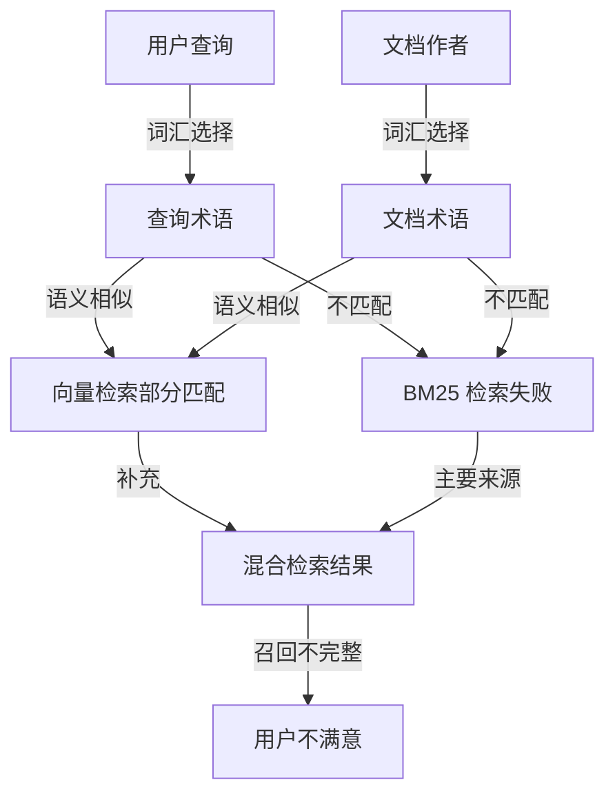
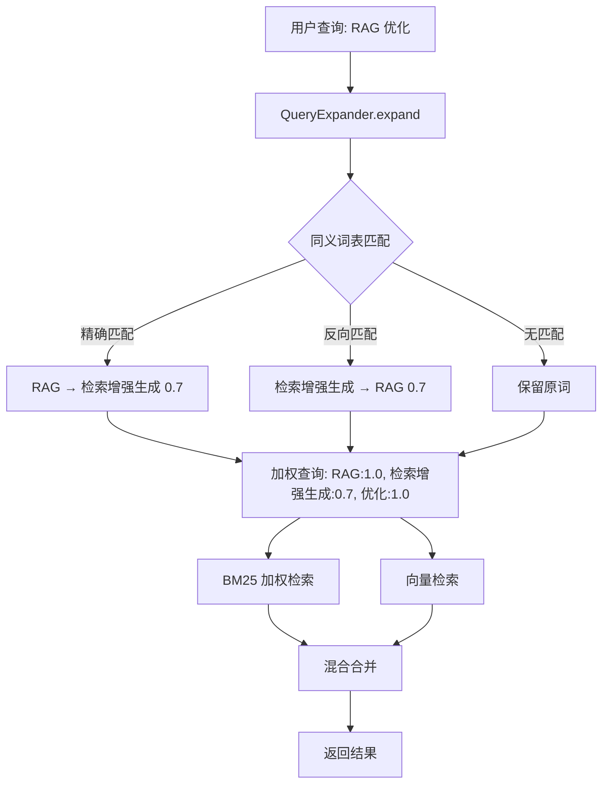

# YK-09-13: 知识库检索增强 -- 同义词扩展与查询重写策略

> 需求编号：YK-09-13 . 优先级：P2 . 人天：1.0d . 状态：需求已编写
> 依赖：YK-09-04（RAG 检索质量监控）、YK-09-07（知识检索反馈闭环）

## 背景

RAG 检索的核心挑战之一是**词汇不匹配**--用户查询使用的术语与知识库文档中的术语不同，但含义相同。BM25 基于精确关键词匹配，语义向量可捕获部分同义关系但不完整。

### 1.1 问题识别

| 场景 | 用户查询 | 文档术语 | BM25 结果 | 向量结果 | 期望 |
|------|----------|----------|-----------|----------|------|
| 英文缩写 | "RAG" | "检索增强生成" | 不匹配 | 部分匹配 | 完全匹配 |
| 同义词 | "限流" | "速率限制"、"Rate Limiting" | 不匹配 | 部分匹配 | 完全匹配 |
| 上下位词 | "数据库" | "MongoDB"、"MySQL" | 过于宽泛 | 过于宽泛 | 精确匹配 |
| 中文/英文混用 | "API 接口" | "API endpoint"、"应用程序接口" | 部分匹配 | 部分匹配 | 完全匹配 |
| 行业术语 | "微服务" | "microservices"、"服务拆分" | 不匹配 | 部分匹配 | 完全匹配 |
| 缩写展开 | "K8s" | "Kubernetes" | 不匹配 | 不匹配 | 完全匹配 |

### 1.2 业务影响

| 影响维度 | 严重程度 | 描述 |
|----------|----------|------|
| 检索召回率 | 高 | 同义词不匹配导致相关文档被遗漏 |
| 用户体验 | 中 | 用户用"限流"搜不到"速率限制"文档，感知为"搜索不灵" |
| 知识库利用率 | 中 | 已存在的优质文档因术语差异无法被检索到 |
| 中英文混合场景 | 中 | 80%+ 中文文档，英文查询无法匹配 |

### 1.3 当前状态

```
用户查询 "RAG 优化"
  │
  ├── BM25 检索 → 匹配 "RAG" 关键词 → 找到 3 篇含 "RAG" 的文档
  │                                          ❌ 漏掉 "检索增强生成优化" 文档
  ├── 向量检索 → 语义匹配 → 找到 "检索增强生成" 文档
  │                          ✅ 部分补救
  └── 合并 (alpha=0.7) → BM25 结果排名靠前
                          ❌ 同义词文档被降权
```

---

## 二、现状分析

### 2.1 词汇不匹配根因



### 2.2 根因分析矩阵

| 根因 | 表现 | 影响范围 | 修复难度 |
|------|------|----------|----------|
| 中英文术语混用 | 同一概念有中英文两种表达 | 约 30% 的查询 | 中 |
| 缩写/全称不统一 | "RAG" vs "检索增强生成" | 约 15% 的查询 | 低 |
| 同义词概念 | 同一概念有多个中文表达 | 约 20% 的查询 | 中 |
| 上下位词混淆 | 用户用宽泛词搜具体内容 | 约 10% 的查询 | 高 |
| 无查询重写机制 | 查询直接检索，无预处理 | 所有查询 | 中 |

---

## 三、设计决策

### 决策 1：同义词来源 -- 手动维护 vs 自动发现 vs 混合

| 选项 | 准确率 | 覆盖率 | 维护成本 | 新鲜度 | 适用场景 |
|------|--------|--------|----------|--------|----------|
| 手动维护 `synonyms.yml` | 高 (95%+) | 中 (50%) | 中 | 低 | 核心术语 |
| 自动发现（Embedding 相似度聚类） | 中 (70%) | 高 (90%) | 低 | 高 | 长尾术语 |
| **混合--手动核心词 + 自动发现候补** | 高 (90%+) | 高 (90%) | 中 | 高 | 全场景 |
| 外部同义词库 (WordNet) | 中 (60%) | 低 (30%) | 低 | 低 | 通用英语 |

**选择：手动维护核心同义词 + Embedding 相似度自动建议。** 手动确保高频术语准确，自动扩展长尾同义词。

### 决策 2：查询扩展时机 -- 索引时 vs 查询时

| 选项 | 索引大小 | 检索精确率 | 灵活性 | 维护成本 |
|------|----------|-----------|--------|----------|
| 索引时扩展 | 膨胀 2-3x | 下降 | 低 | 修改需重建索引 |
| **查询时扩展** | 不变 | 可控 | 高 | 修改即时生效 |
| 两者结合 | 膨胀 1.5x | 中等 | 中 | 高 |

**选择：查询时扩展。** 索引时扩展会膨胀索引大小并降低精确率。查询时扩展仅在检索阶段应用，不影响索引。

### 决策 3：扩展策略 -- 全部 AND vs 全部 OR vs 加权

| 选项 | 召回率 | 精确率 | 语义漂移风险 | 实现复杂度 |
|------|--------|--------|-------------|-----------|
| 全部 AND | 低 | 高 | 低 | 低 |
| 全部 OR | 高 | 低 | 高 | 低 |
| **加权 OR（原词 1.0 + 同义词 0.7）** | 高 | 中高 | 中 | 中 |
| 动态权重（反馈驱动） | 高 | 高 | 低 | 高 |

**选择：加权 OR--原词权重 1.0 + 同义词权重 0.7。** 避免同义词扩展导致语义漂移。

### 决策 4：同义词表存储位置 -- 代码内 vs 配置文件 vs MongoDB

| 选项 | 加载速度 | 可编辑性 | 版本控制 | 热更新 |
|------|----------|----------|----------|--------|
| 代码内 (Python dict) | 最快 | 低 | 需发版 | 否 |
| **配置文件 (synonyms.yml)** | 快 | 高 | Git 天然支持 | 是 |
| MongoDB 集合 | 慢 | 中 | 需额外机制 | 是 |

**选择：YiKnowledge/synonyms.yml 配置文件。** Git 版本控制，Knowledge Watcher 感知变更，无需额外存储。

---

## 四、目标架构

### 4.1 查询扩展流程



### 4.2 核心指标

| 指标 | 当前 | 目标 | 测量方式 |
|------|------|------|----------|
| 同义词召回率 | ~60% (仅向量) | > 85% | 同义词测试集检索命中率 |
| 查询扩展延迟 | 0ms (无扩展) | < 5ms | 计时 `expand()` 调用 |
| 同义词组数 | 0 | 50-200 组 | `synonyms.yml` 条目数 |
| 语义漂移率 | 0 (无扩展) | < 5% | 扩展后 top-5 不相关结果比例 |

---

## 五、具体改动

### 5.1 文件变更清单

| 文件 | 操作 | 说明 |
|------|------|------|
| `YiKnowledge/synonyms.yml` | 新增 | 同义词配置文件 |
| `YiAi/src/domain/rag/query_expander.py` | 新增 | 查询扩展 + 同义词管理 |
| `YiAi/src/domain/rag/synonym_discovery.py` | 新增 | Embedding 自动同义词发现 |
| `YiAi/src/services/rag/rag_service.py` | 修改 | 检索前调用 `QueryExpander.expand()` |
| `YiAi/tests/domain/rag/test_query_expander.py` | 新增 | 查询扩展测试 |
| `YiAi/tests/domain/rag/test_synonym_discovery.py` | 新增 | 同义词发现测试 |

### 5.2 核心代码

```yaml
# YiKnowledge/synonyms.yml
synonyms:
  RAG:
    - 检索增强生成
    - Retrieval-Augmented Generation
    - 混合检索
  API:
    - 接口
    - 应用程序接口
    - endpoint
    - Application Programming Interface
  限流:
    - 速率限制
    - rate limiting
    - 流量控制
    - 流控
  微服务:
    - 微服务架构
    - microservices
    - 服务拆分
  MongoDB:
    - mongo
    - 文档数据库
    - Document Database
  LLM:
    - 大语言模型
    - 大模型
    - Large Language Model
    - GPT
  embedding:
    - 向量嵌入
    - 词嵌入
    - 文本向量化
  Kubernetes:
    - K8s
    - k8s
    - 容器编排
  CI/CD:
    - 持续集成
    - 持续部署
    - 流水线
    - pipeline
  Frontend:
    - 前端
    - 客户端
    - UI
  Backend:
    - 后端
    - 服务端
    - Server

# 最大同义词组数
max_groups: 200

# 自动发现配置
auto_discovery:
  enabled: true
  min_similarity: 0.85
  max_suggestions_per_run: 10
```

```python
# YiAi/src/domain/rag/query_expander.py

import yaml
from typing import Optional
from pathlib import Path

class QueryExpander:
    """同义词扩展 + 查询重写。"""

    def __init__(self, synonyms_file: str = "YiKnowledge/synonyms.yml"):
        self._synonyms_file = synonyms_file
        self._synonyms: dict[str, list[str]] = {}
        self._reverse: dict[str, str] = {}
        self._load_synonyms()

    def _load_synonyms(self):
        """加载同义词表--支持热更新。"""
        path = Path(self._synonyms_file)
        if not path.exists():
            logger.warning(f"[QueryExpander] 同义词文件不存在: {self._synonyms_file}")
            return

        with open(path) as f:
            config = yaml.safe_load(f)

        self._synonyms = config.get("synonyms", {})
        self._reverse = {}
        for main, aliases in self._synonyms.items():
            for alias in aliases:
                self._reverse[alias.lower()] = main.lower()

        logger.info(f"[QueryExpander] 加载 {len(self._synonyms)} 组同义词")

    def reload(self):
        """热更新同义词表--Knowledge Watcher 在 synonyms.yml 变更时调用。"""
        self._load_synonyms()

    def expand(self, query: str) -> list[tuple[str, float]]:
        """扩展查询--返回 [(term, weight), ...]。

        权重: 原词 1.0, 直接同义词 0.7, 间接同义词 0.5
        """
        terms = query.lower().split()
        expanded: dict[str, float] = {}

        for term in terms:
            # 原词权重 1.0
            expanded[term] = max(expanded.get(term, 0), 1.0)

            # 直接匹配同义词表
            if term in self._synonyms:
                for synonym in self._synonyms[term]:
                    expanded[synonym] = max(expanded.get(synonym, 0), 0.7)

            # 反向匹配 (同义词 → 主词)
            if term in self._reverse:
                main = self._reverse[term]
                expanded[main] = max(expanded.get(main, 0), 0.7)
                # 也加入主词的其他同义词（间接匹配）
                for synonym in self._synonyms.get(main, []):
                    if synonym.lower() != term:
                        expanded[synonym] = max(expanded.get(synonym, 0), 0.5)

        return [(t, w) for t, w in expanded.items()]

    def rewrite_query(self, query: str) -> str:
        """重写查询字符串--用于 BM25 检索。

        将扩展后的所有词用 OR 连接，带权重标记。
        """
        expanded = self.expand(query)
        # 原词直接保留，同义词用 OR 连接
        terms = [t for t, w in expanded]
        return ' '.join(terms)

    def suggest_synonyms(self, term: str, embedding_model) -> list[dict]:
        """基于 Embedding 相似度自动建议同义词候补。

        从知识库文档的 tags 中寻找语义相似但不在同义词表中的术语。
        """
        term_vec = embedding_model.get_text_embedding(term)
        candidates = []

        for main_word, synonyms in self._synonyms.items():
            if term.lower() == main_word.lower():
                continue
            if term.lower() in [s.lower() for s in synonyms]:
                continue
            main_vec = embedding_model.get_text_embedding(main_word)
            similarity = self._cosine_similarity(term_vec, main_vec)
            if similarity > 0.85:
                candidates.append({
                    'term': main_word,
                    'similarity': round(similarity, 3),
                    'existing_synonyms': synonyms,
                })

        candidates.sort(key=lambda x: x['similarity'], reverse=True)
        return candidates[:5]

    def _cosine_similarity(self, a: list[float], b: list[float]) -> float:
        dot = sum(x * y for x, y in zip(a, b))
        norm_a = sum(x * x for x in a) ** 0.5
        norm_b = sum(x * x for x in b) ** 0.5
        return dot / (norm_a * norm_b) if norm_a and norm_b else 0.0

    def get_stats(self) -> dict:
        return {
            'total_groups': len(self._synonyms),
            'total_aliases': sum(len(v) for v in self._synonyms.values()),
            'reverse_entries': len(self._reverse),
        }
```

```python
# YiAi/src/domain/rag/synonym_discovery.py

import asyncio
from collections import defaultdict

class SynonymDiscovery:
    """基于 Embedding 自动发现同义词候补。"""

    def __init__(self, query_expander: QueryExpander, embedding_model,
                 db, min_similarity: float = 0.85):
        self._expander = query_expander
        self._embedding = embedding_model
        self._db = db
        self._min_similarity = min_similarity

    async def discover_from_tags(self) -> list[dict]:
        """从所有知识文件的 tags 中发现同义词候补。

        流程:
        1. 提取所有文档的 tags → 唯一术语集合
        2. 对集合中每对术语计算 embedding 余弦相似度
        3. 相似度 > min_similarity 且不在同义词表中的 → 建议添加
        """
        # 1. 收集所有唯一 tags
        all_tags = set()
        async for doc in self._db.knowledge_files.find(
            {'tags': {'$exists': True, '$ne': []}}
        ):
            for tag in doc.get('tags', []):
                tag_lower = tag.lower().strip()
                if tag_lower:
                    all_tags.add(tag_lower)

        logger.info(f"[SynonymDiscovery] 收集到 {len(all_tags)} 个唯一标签")

        # 2. 批量计算 embedding
        tags_list = list(all_tags)
        embeddings = {}
        for tag in tags_list:
            try:
                embeddings[tag] = self._embedding.get_text_embedding(tag)
            except Exception as e:
                logger.warning(f"[SynonymDiscovery] 嵌入失败: {tag} - {e}")

        # 3. 成对比较
        suggestions = []
        for i, tag1 in enumerate(tags_list):
            if tag1 not in embeddings:
                continue
            for tag2 in tags_list[i+1:]:
                if tag2 not in embeddings:
                    continue
                if self._are_already_synonyms(tag1, tag2):
                    continue

                sim = self._cosine_similarity(embeddings[tag1], embeddings[tag2])
                if sim > self._min_similarity:
                    suggestions.append({
                        'tag1': tag1,
                        'tag2': tag2,
                        'similarity': round(sim, 3),
                    })

        suggestions.sort(key=lambda x: x['similarity'], reverse=True)
        logger.info(f"[SynonymDiscovery] 发现 {len(suggestions)} 个候补同义词对")

        return suggestions[:20]  # 限制 Top-20

    def _are_already_synonyms(self, tag1: str, tag2: str) -> bool:
        """检查两个标签是否已在同义词表中。"""
        synonyms = self._expander._synonyms
        reverse = self._expander._reverse

        # 检查 tag1 的同义词是否包含 tag2
        if tag1 in synonyms:
            if tag2.lower() in [s.lower() for s in synonyms[tag1]]:
                return True
        if tag2 in synonyms:
            if tag1.lower() in [s.lower() for s in synonyms[tag2]]:
                return True

        # 检查反向索引
        if tag1 in reverse and tag2 in reverse:
            if reverse[tag1] == reverse[tag2]:
                return True

        return False

    def _cosine_similarity(self, a: list[float], b: list[float]) -> float:
        dot = sum(x * y for x, y in zip(a, b))
        norm_a = sum(x * x for x in a) ** 0.5
        norm_b = sum(x * x for x in b) ** 0.5
        return dot / (norm_a * norm_b) if norm_a and norm_b else 0.0
```

### 5.3 RAG 检索集成

在 `rag_service.py` 的检索方法中集成查询扩展：

```python
# 检索前
expanded_terms = self._query_expander.expand(query)

# BM25 检索时使用扩展后的查询
bm25_results = self._bm25_retriever.search(expanded_terms)

# 向量检索使用原始查询（语义空间已包含同义关系）
vector_results = self._vector_retriever.search(query)

# 合并时对 BM25 结果应用同义词匹配加权
```

---

## 六、实施步骤

| 步骤 | 内容 | 验证方式 | 人天 |
|------|------|----------|------|
| 1 | 创建 `synonyms.yml` 初始同义词表（20-30 组核心术语） | YAML 格式校验通过 | 0.15 |
| 2 | 实现 `QueryExpander` 类 | 单元测试：精确/反向/间接匹配 | 0.2 |
| 3 | 集成到 RAG 检索流程 | 集成测试：同义词查询召回率提升 | 0.15 |
| 4 | 实现 `SynonymDiscovery` 自动发现 | 对比测试：手动同义词 vs 自动发现 | 0.2 |
| 5 | Knowledge Watcher 感知 `synonyms.yml` 变更 | 热更新验证：修改文件后 expand() 生效 | 0.1 |
| 6 | 添加同义词管理 API 端点 | API 测试：suggest/update 端点 | 0.1 |
| 7 | 编写同义词维护指南 | Curator 审查 | 0.1 |

---

## 七、性能分析

| 操作 | 耗时 | 说明 |
|------|------|------|
| 同义词表加载 | ~5ms (启动时) | `synonyms.yml` YAML 解析--一次性 |
| 热更新 `reload()` | ~5ms | 与加载相同，按需触发 |
| `expand()` (5 词查询) | < 1ms | 纯字典查找，O(1) per term |
| `expand()` (20 词长查询) | < 2ms | 每个词查 2 个字典 |
| Embedding 相似度建议 | ~100ms/tag | 仅在手动触发时调用 |
| 查询扩展后检索延迟增加 | ~10-20% | 取决于同义词匹配数--通常 2-5 个扩展词 |
| `discover_from_tags()` (800 tags) | ~30s | 批量 Embedding + 成对比较 |

**容量规划**：
- 内存：200 组同义词，每组 ~5 词 ≈ 1KB 内存
- 存储：`synonyms.yml` 文件 < 10KB
- 检索延迟影响：BM25 扩展词增加 2-5 个，检索延迟增加 < 10ms

---

## 八、测试规格

#### Scenario: 精确匹配同义词扩展

- **Given** `synonyms.yml` 有 `RAG: [检索增强生成, Retrieval-Augmented Generation]`
- **When** `expand("RAG 优化")`
- **Then** 返回 `[("rag", 1.0), ("检索增强生成", 0.7), ("retrieval-augmented generation", 0.7), ("优化", 1.0)]`

#### Scenario: 反向匹配--同义词到主词

- **Given** `synonyms.yml` 有 `限流: [速率限制, rate limiting]`
- **When** `expand("速率限制 配置")`
- **Then** 返回包含 `("限流", 0.7)` 和 `("rate limiting", 0.5)`

#### Scenario: 无匹配词原样返回

- **Given** 查询 = "量子计算"
- **When** `expand("量子计算")`
- **Then** 返回 `[("量子计算", 1.0)]`（无同义词）

#### Scenario: suggest_synonyms 返回候补

- **Given** `synonyms.yml` 已有 `API: [接口]`, 向量相似度 ("端点", "接口") = 0.88
- **When** `suggest_synonyms("端点", embedding_model)`
- **Then** 返回包含 `{"term": "API", "similarity": 0.88}` 的候补列表

#### Scenario: 间接同义词权重低于直接同义词

- **Given** `限流: [速率限制, rate limiting]`
- **When** `expand("rate limiting")`（反向匹配）
- **Then** `("限流", 0.7)` 来自反向匹配，`("速率限制", 0.5)` 来自间接匹配

#### Scenario: 热更新生效

- **Given** 同义词表已加载，修改 `synonyms.yml` 添加 `Docker: [容器]`
- **When** `reload()` 后调用 `expand("Docker 部署")`
- **Then** 返回包含 `("容器", 0.7)` 的扩展结果

#### Scenario: 同义词循环引用不无限递归

- **Given** `synonyms.yml` 有 `A: [B]` 和 `B: [A]`
- **When** `expand("A")`
- **Then** 返回 `[("a", 1.0), ("b", 0.7)]`，不无限递归

#### Scenario: 自动发现排除已有同义词

- **Given** `synonyms.yml` 已有 `RAG: [检索增强生成]`
- **When** `discover_from_tags()` 计算 "RAG" 和 "检索增强生成" 的相似度
- **Then** 这对不被建议（已在同义词表中）

---

## 九、风险与缓解

| 风险 | 概率 | 影响 | 缓解措施 |
|------|------|------|----------|
| 同义词扩展导致语义漂移 | 中 | 中 | 扩展词权重 0.5-0.7，原始词 1.0；误扩展时降低权重 |
| `synonyms.yml` 膨胀 | 低 | 低 | 限制同义词组数 ≤ 200，定期审查 + 自动清理 |
| 反向索引内存占用 | 低 | 低 | 每组同义词 ~5 词，200 组 ≈ 1KB |
| 同义词冲突（A→B, B→C, A→C 矛盾） | 低 | 中 | 加载时检测循环引用，告警 |
| 自动发现误建议 | 中 | 低 | 相似度阈值 0.85，仅建议不自动添加 |
| 热更新期间检索短暂不一致 | 低 | 低 | 热更新是原子操作（一次性替换字典） |

---

## 十、回滚策略

| 场景 | 回滚方式 | 回滚时间 |
|------|----------|----------|
| 同义词扩展导致检索质量下降 | 禁用查询扩展（配置开关） | < 1min |
| `synonyms.yml` 格式错误 | Git revert 到上一个版本 | < 1min |
| 自动发现误建议过多 | 提高 `min_similarity` 阈值至 0.90 | < 1min |
| 检索延迟增加过多 | 限制扩展词数上限（默认 10 个） | < 1min |

---

## 十一、设计决策记录

### D-01: 查询时扩展而非索引时扩展

**决策**：在查询阶段扩展同义词，不在索引阶段预扩展。
**理由**：索引时扩展会导致索引膨胀 2-3x，且修改同义词表需要重建索引。查询时扩展灵活高效。
**权衡**：查询时扩展增加检索延迟 ~10-20%，但可接受。
**替代方案**：索引时扩展被拒绝，因为 YiKnowledge 800+ 文件重建索引成本高。

### D-02: 加权 OR 策略

**决策**：原词权重 1.0，直接同义词 0.7，间接同义词 0.5。
**理由**：避免同义词扩展导致的语义漂移。原词始终是用户意图的最准确表达。
**权衡**：同义词权重较低可能导致召回率提升有限，但保证了精确率。
**替代方案**：等权 OR 策略被拒绝，因为会导致检索结果中包含大量弱相关文档。

### D-03: 手动维护 + 自动发现混合

**决策**：核心术语手动维护在 `synonyms.yml`，长尾术语通过 Embedding 自动发现。
**理由**：手动确保高频术语 100% 准确，自动覆盖长尾术语。
**权衡**：手动维护需要 Curator 投入，但 20-30 组核心术语维护成本低。
**替代方案**：纯自动发现被拒绝，因为自动发现的准确率仅 70%，核心术语不能有误。

---

## 十二、可观测性

| 指标 | 采集方式 | 告警阈值 | 说明 |
|------|----------|----------|------|
| 同义词组数 | `get_stats()` | > 200 或 < 10 | 膨胀或配置丢失 |
| 每次查询扩展词数 | expand() 返回列表长度 | > 10 | 过度扩展 |
| 扩展后检索延迟增量 | 检索计时对比 | > 50% | 性能退化 |
| 自动发现建议数 | `discover_from_tags()` 结果 | > 20 | 标签体系需治理 |
| 同义词文件加载失败 | 启动日志 | 任何失败 | 配置文件格式错误 |

**日志**：
- `[QueryExpander]` 前缀：查询扩展操作日志
- `[SynonymDiscovery]` 前缀：自动发现日志
- 每次扩展记录 `query` 和 `expanded_terms` (DEBUG 级别)

**告警规则**：
1. 同义词文件加载失败 → Slack 通知 AIer
2. 自动发现建议 > 20 → 提示标签治理 (YK-09-21)
3. 扩展后检索延迟增量 > 50% → 检查同义词表是否膨胀

---

## 十三、安全合规

| 要求 | 实现 |
|------|------|
| 同义词表不可注入 | YAML 解析仅加载字符串，不执行代码 |
| 同义词修改可审计 | Git 版本控制 `synonyms.yml` 的所有变更 |
| 自动发现不自动修改 | 建议仅存储，需 Curator 手动确认后才写入 `synonyms.yml` |

---

## 十四、代码审查检查清单

- [ ] `synonyms.yml` YAML 格式正确（CI 校验 yamllint）
- [ ] 反向索引在 `__init__` 时构建（O(1) 查找）
- [ ] 同义词扩展权重不超过原词 (最高 0.7)
- [ ] 反向匹配的同义词权重 (0.5) 低于直接匹配 (0.7)
- [ ] `suggest_synonyms()` 不修改同义词表（仅建议）
- [ ] Embedding 相似度阈值 0.85（避免低质量建议）
- [ ] 同义词循环引用检测 (A→B, B→A 不无限递归)
- [ ] 热更新 `reload()` 是原子操作
- [ ] 扩展结果去重（同一词可能被多次匹配）
- [ ] 查询扩展在 RAG 检索前调用，不修改原始查询
- [ ] 同义词文件不存在时有降级处理（不影响检索）
- [ ] `discover_from_tags()` 有超时保护（30s）

---

*PRD 来源: `projects/yiknowledge/requirements/2026-09/13-需求-检索同义词扩展.md`*