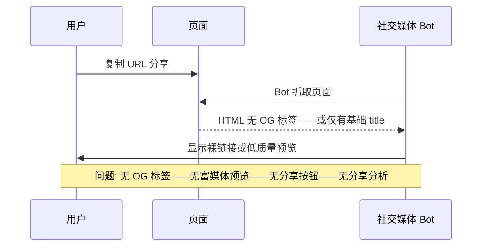
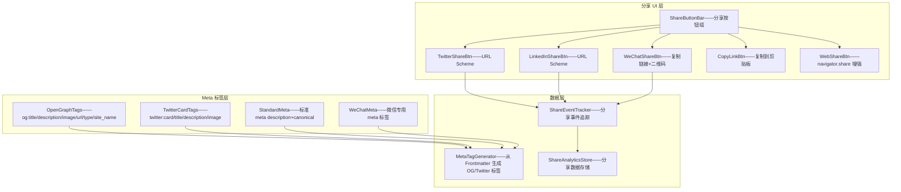
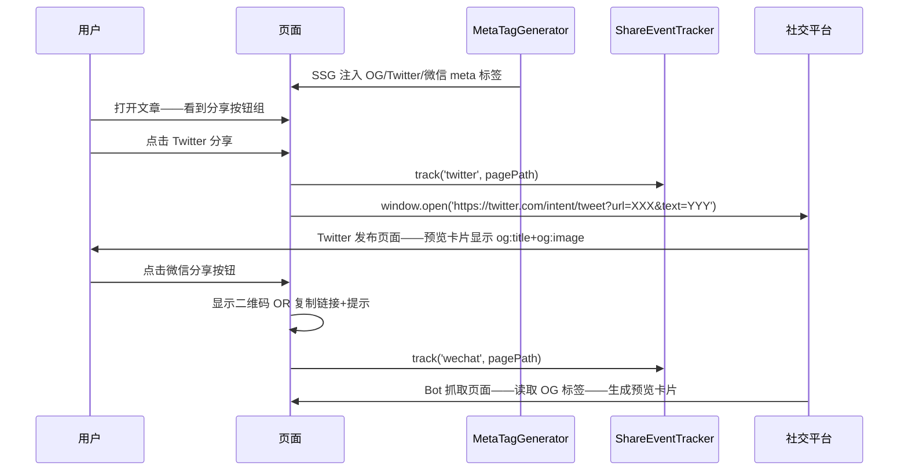

# YK-09-191: 内容社交分享优化 — 分享按钮（Twitter/LinkedIn/微信）、Open Graph 元标签、分享预览定制、分享分析

> 需求编号：YK-09-191 · 优先级：P2 · 人天：0.3d · 状态：需求已编写
> 依赖：YK-09-137（内容SEO优化——Open Graph 标签与 SEO meta 标签共享数据和生成逻辑）、YK-09-190（内容结构化数据标记——结构化数据与 Open Graph 共享部分数据源）、YK-09-30（静态站点生成——OG 标签在 SSG 时注入）

## 背景

### 问题陈述

YiKnowledge 的内容页面在社交媒体上分享时——预览效果差——链接只是一段普通 URL——无标题、无描述、无缩略图——影响内容传播和点击率：

1. **无 Open Graph 标签**：分享到 Twitter/LinkedIn/Facebook/Discord 时——仅显示裸链接——无富媒体预览卡片——用户看到的是一段 URL 文本——毫无点击欲望
2. **无 Twitter Card 标签**：Twitter/X 平台有自己的卡片格式——需要 `twitter:card`/`twitter:title`/`twitter:description`/`twitter:image` 等标签——当前全无——Twitter 分享体验极差
3. **微信分享无定制**：分享到微信时——无法控制标题、描述和缩略图——微信抓取页面后显示不准确——有时显示的是导航栏文字而非文章标题
4. **无分享按钮**：页面没有分享按钮——用户想分享需要手动复制 URL——然后打开社交媒体粘贴——操作流程长——流失率高
5. **无分享分析**：不知道哪些内容被分享了——通过什么平台——无法优化内容策略——无法衡量社交传播效果

**核心矛盾**：YiKnowledge 的内容质量高——但社交分享的"包装"差——高质量内容搭配差的社交预览——等于好的产品放在破旧的包装盒里——转化率严重受影响。

### 影响范围

| # | 影响 | 严重程度 | 典型场景 |
|---|------|----------|----------|
| 1 | 社交媒体预览为裸链接 | 高 | 在 Twitter 分享文章——仅显示 https://.../page——无标题无图——无人点击 |
| 2 | 微信分享不可控 | 高 | 微信分享文章——预览标题是站点名——描述是导航文字——毫无吸引力 |
| 3 | 分享操作繁琐 | 中 | 用户想分享——手动复制 URL——打开 Twitter——粘贴——写描述——发布——5 步操作 |
| 4 | 无法衡量传播效果 | 中 | 不知道哪些文章被广泛分享——无法优化内容策略 |
| 5 | 品牌形象受损 | 中 | 专业内容+不专业的分享预览——品牌不统一——影响信任度 |

### 挑战

| 挑战 | 说明 |
|------|------|
| Open Graph 图片生成 | 需要为每个文章生成/指定 og:image——推荐 1200x630px——可以是自动生成的社交卡片或手动指定的缩略图 |
| 微信分享限制 | 微信使用 WeixinJSBridge 或特定的 meta 标签——不同版本和平台行为不一致——需要兼容性处理 |
| 分享按钮不引入第三方 SDK | 避免加载 Twitter/LinkedIn 的第三方 JS SDK——使用 URL Scheme 拼接——保持页面性能 |
| 分享分析隐私合规 | 分享点击追踪需要记录——但要符合隐私规定——不收集用户个人信息——仅统计计数 |
| 多平台兼容 | og:title/description/image 在 Facebook/LinkedIn/Discord/Twitter 上的解析规则微有不同——需要全面覆盖 |

---

## 一、现状分析

### 1.1 当前社交分享状态

```
YiKnowledge 社交分享现状:
├── Open Graph 标签
│   ├── 可能无——或仅有基础的 og:title（来自 HTML <title>）
│   ├── 无 og:description/og:image/og:url/og:type/og:site_name
│   └── 局限: 社交媒体抓取——无任何有效 OG 数据——显示裸链接
├── Twitter Card
│   ├── 无 twitter:card/twitter:title/twitter:description/twitter:image
│   └── 局限: Twitter 分享无预览卡片
├── 微信分享
│   ├── 无 WeixinJSBridge 配置
│   └── 局限: 微信内分享——抓取页面后标题/描述不准确——不可控
├── 分享按钮
│   └── 局限: 无——用户需要手动复制链接
├── 分享分析
│   └── 局限: 无——不知道分享数据
└── 缺失:
    ├── og:title/description/image/url/type/site_name                # ❌ 无/不完整
    ├── twitter:card (summary_large_image)                           # ❌ 无
    ├── 分享按钮: Twitter/LinkedIn/微信/复制链接                      # ❌ 无
    ├── 分享预览定制: 自定义 og:image 缩略图——自动生成社交卡片         # ❌ 无
    └── 分享事件追踪: 平台/页面/时间——用于分析                        # ❌ 无
```

### 1.2 当前数据流



### 1.3 根因矩阵

| 症状 | 根因 | 触发条件 | 频率 |
|------|------|----------|------|
| 社交媒体显示裸链接 | HTML 中缺少 `<meta property="og:...">` 标签 | 社交媒体 Bot 抓取 | 每次分享 |
| Twitter 无预览卡片 | 缺少 `twitter:card` 标签 | Twitter 分享 | 每次分享 |
| 微信分享不受控 | 无 WeixinJSBridge 或微信 meta 标签 | 微信内分享 | 每次分享 |
| 分享操作复杂 | 无分享按钮——用户手动复制 | 用户想分享时 | 高 |
| 无分享数据 | 无分享事件追踪 | — | 持续 |

---

## 二、设计决策

### 决策 1：Open Graph 图片策略 — 自动生成社交卡片 vs 手动指定 vs 全局默认

| 选项 | 视觉质量 | 维护成本 | 实现复杂度 |
|------|---------|---------|-----------|
| A: 自动生成社交卡片——根据标题/标签/日期——Canvas/SVG 生成 1200x630 图片 | 中——模板化 | 低——自动 | 中——需要图片生成服务 |
| B: 手动指定——Frontmatter 增加 `og_image` 字段——手动上传 | 最高——完全定制 | 高——每篇文章手动 | 低——仅字段映射 |
| C: 全局默认——一张站点通用社交图片——所有文章共用 | 低——无内容区分 | 最低 | 最低 |

**选择：B（手动指定优先——降级到 C（全局默认））。** 0.3d 内实现自动社交卡片生成不现实——需要服务端渲染（Puppeteer/Sharp）或外部服务。手动指定 `og_image` 在重要文章中使用——其他文章使用全局默认站点图片。后续可升级为自动生成。

### 决策 2：分享按钮实现 — URL Scheme vs Web Share API vs 第三方 SDK

| 选项 | 兼容性 | 功能完整度 | 性能 |
|------|--------|-----------|------|
| A: URL Scheme——`https://twitter.com/intent/tweet?url=...` | 全平台 | 高——支持所有平台 | 最佳——纯 HTML link |
| B: Web Share API——`navigator.share()` | 现代浏览器 | 中——仅系统级分享 | 最佳 |
| C: 第三方 SDK——加载平台的 JS SDK | 好 | 最高——完整交互 | 差——额外 JS 加载 |

**选择：A（URL Scheme）+ B（Web Share API 作为增强）。** URL Scheme 是最轻量的分享方式——一个 `<a>` 标签——零 JS——支持 Twitter/LinkedIn/Facebook。Web Share API 在支持的浏览器上提供原生分享面板——用户可以选择任意应用。微信分享使用复制链接+提示——因为微信需要 JSSDK 配置——0.3d 内集成完整微信 JSSDK 不现实。

### 决策 3：OG 标签生成时机 — SSG 构建时 vs 客户端动态 vs 服务端

| 选项 | SEO 友好 | 实时性 | 实现复杂度 |
|------|---------|--------|-----------|
| A: SSG 构建时——同 YK-09-190 JSON-LD 一样——在构建时注入 meta 标签 | 最佳——静态 HTML | 需重新构建 | 低——与 JSON-LD 类似 |
| B: 客户端动态——JavaScript 插入 meta 标签 | 差——Bot 可能不执行 JS | 实时 | 低——但无效 |
| C: 服务端——Nginx 模块或后端注入 | 好 | 中 | 高 |

**选择：A（SSG 构建时——静态注入 `<meta property="og:...">` 到 `<head>`）。** 社交媒体 Bot（Twitterbot/Facebook Crawler/LinkedIn Bot）抓取的是静态 HTML——不执行 JS。必须在构建时注入——确保 Bot 一定能读取。与 JSON-LD 构建流程一致——同一次构建中处理 OG 标签——数据来源相同——保证一致性。

### 决策 4：分享分析 — 自定义埋点 vs Google Analytics vs 混合

| 选项 | 数据粒度 | 实现复杂度 | 隐私合规 |
|------|---------|-----------|---------|
| A: 自定义埋点——分享按钮点击→发送事件到后端 | 精确——知道哪个页面哪个平台 | 中 | 好——匿名计数 |
| B: Google Analytics——`gtag('event', 'share', ...)` | 丰富——关联用户行为 | 低 | 需处理隐私 |
| C: 混合——自定义+GA | 最丰富 | 高 | 需处理隐私 |

**选择：A（自定义埋点——分享按钮点击→POST 到后端）。** 简单计数——记录 pagePath + platform + timestamp——不涉及用户标识——隐私友好。后端存储到 `share_analytics` 集合——构建分享仪表盘。不依赖 GA——YiKnowledge 可能没有 GA 集成——自建更可控。

---

## 三、目标架构

### 3.1 社交分享优化系统架构



### 3.2 社交分享流程



### 3.3 性能指标

| 指标 | 改造前 | 改造后 |
|------|--------|--------|
| 社交媒体预览质量 | 裸链接 | 富媒体卡片——标题+描述+图片 |
| Twitter Card 验证 | 无 | twitter:card=summary_large_image——通过 Twitter Card Validator |
| 分享操作步数 | 5 步（手动复制→打开→粘贴→写→发布） | 1 步（点击分享按钮） |
| OG 标签覆盖率 | 0% | 100% 页面 |
| 分享分析数据 | 无 | 按平台/页面/时间的分享统计 |

---

## 四、具体改动

### 4.1 核心代码：Meta 标签生成器 + 分享组件

```typescript
// src/build/og-tags-generator.ts

interface OGTagsConfig {
  title: string;
  description: string;
  url: string;
  image?: string;
  type?: 'website' | 'article';
  siteName: string;
  locale?: string;
  twitterHandle?: string;
}

class OGTagsGenerator {
  /** 生成所有社交分享 meta 标签 */
  generate(config: OGTagsConfig): string[] {
    const tags: string[] = [];

    // ---- Open Graph ----
    tags.push(`<meta property="og:title" content="${this.escape(config.title)}">`);
    tags.push(`<meta property="og:description" content="${this.escape(config.description)}">`);
    tags.push(`<meta property="og:url" content="${this.escape(config.url)}">`);
    tags.push(`<meta property="og:type" content="${config.type || 'article'}">`);
    tags.push(`<meta property="og:site_name" content="${this.escape(config.siteName)}">`);
    tags.push(`<meta property="og:locale" content="${config.locale || 'zh_CN'}">`);

    if (config.image) {
      tags.push(`<meta property="og:image" content="${this.escape(config.image)}">`);
      tags.push(`<meta property="og:image:width" content="1200">`);
      tags.push(`<meta property="og:image:height" content="630">`);
      tags.push(`<meta property="og:image:alt" content="${this.escape(config.title)}">`);
    } else {
      // 使用全局默认图片
      tags.push(`<meta property="og:image" content="${config.url}/default-og-image.png">`);
      tags.push(`<meta property="og:image:width" content="1200">`);
      tags.push(`<meta property="og:image:height" content="630">`);
    }

    // ---- Twitter Card ----
    tags.push(`<meta name="twitter:card" content="summary_large_image">`);
    tags.push(`<meta name="twitter:title" content="${this.escape(config.title)}">`);
    tags.push(`<meta name="twitter:description" content="${this.escape(config.description)}">`);
    if (config.image) {
      tags.push(`<meta name="twitter:image" content="${this.escape(config.image)}">`);
    }
    if (config.twitterHandle) {
      tags.push(`<meta name="twitter:site" content="@${config.twitterHandle}">`);
      tags.push(`<meta name="twitter:creator" content="@${config.twitterHandle}">`);
    }

    // ---- 标准 Meta ----
    tags.push(`<meta name="description" content="${this.escape(config.description)}">`);

    return tags;
  }

  /** 生成微信分享所需的 meta 标签 */
  generateWeChatTags(config: OGTagsConfig): string[] {
    return [
      `<meta itemprop="name" content="${this.escape(config.title)}">`,
      `<meta itemprop="description" content="${this.escape(config.description)}">`,
      ...(config.image ? [`<meta itemprop="image" content="${this.escape(config.image)}">`] : []),
    ];
  }

  /** 注入所有社交 meta 标签到 HTML */
  injectIntoHTML(html: string, config: OGTagsConfig): string {
    const ogTags = this.generate(config);
    const wechatTags = this.generateWeChatTags(config);
    const allTags = [...ogTags, ...wechatTags].join('\n');

    if (html.includes('<head>')) {
      // 注入到 <head> 开始后——在 <title> 之后
      const titleCloseIndex = html.indexOf('</title>');
      if (titleCloseIndex > 0) {
        return html.slice(0, titleCloseIndex + 8) + '\n' + allTags + html.slice(titleCloseIndex + 8);
      }
      return html.replace('<head>', `<head>\n${allTags}`);
    }
    return html;
  }

  private escape(text: string): string {
    return text
      .replace(/&/g, '&amp;')
      .replace(/"/g, '&quot;')
      .replace(/</g, '&lt;')
      .replace(/>/g, '&gt;');
  }
}

export { OGTagsGenerator, OGTagsConfig };
```

```typescript
// src/composables/useShare.ts

interface SharePlatform {
  id: 'twitter' | 'linkedin' | 'wechat' | 'copylink' | 'native';
  label: string;
  icon: string;
}

interface ShareConfig {
  url: string;
  title: string;
  description?: string;
  hashtags?: string[];
  via?: string;
}

export function useShare(defaultConfig?: Partial<ShareConfig>) {
  const platforms: SharePlatform[] = [
    { id: 'twitter', label: 'Twitter / X', icon: 'twitter' },
    { id: 'linkedin', label: 'LinkedIn', icon: 'linkedin' },
    { id: 'wechat', label: '微信', icon: 'wechat' },
    { id: 'copylink', label: '复制链接', icon: 'link' },
  ];

  const isCopied = ref(false);
  const isWechatQRVisible = ref(false);
  const wechatQRUrl = ref('');

  /** Twitter 分享 */
  function shareToTwitter(config: ShareConfig) {
    const text = encodeURIComponent(config.title);
    const url = encodeURIComponent(config.url);
    const hashtags = config.hashtags?.join(',') || '';
    const via = config.via || '';

    const shareUrl = `https://twitter.com/intent/tweet?text=${text}&url=${url}${hashtags ? `&hashtags=${hashtags}` : ''}${via ? `&via=${via}` : ''}`;

    window.open(shareUrl, '_blank', 'width=600,height=400');
    trackShare('twitter', config.url);
  }

  /** LinkedIn 分享 */
  function shareToLinkedIn(config: ShareConfig) {
    const url = encodeURIComponent(config.url);
    const shareUrl = `https://www.linkedin.com/sharing/share-offsite/?url=${url}`;

    window.open(shareUrl, '_blank', 'width=600,height=600');
    trackShare('linkedin', config.url);
  }

  /** 微信分享——显示二维码或复制链接 */
  function shareToWeChat(config: ShareConfig) {
    // 0.3d 内——使用复制链接方式
    // 微信内——尝试 WeixinJSBridge
    if (isWeChatBrowser()) {
      // 微信内——使用 WeixinJSBridge（需要 JSSDK——暂用复制+提示）
      copyToClipboard(config.url);
      // 发送微信分享配置
      setupWeChatShare(config);
      return;
    }

    // 微信外——显示二维码或复制链接
    wechatQRUrl.value = config.url;
    isWechatQRVisible.value = true;
    trackShare('wechat', config.url);
  }

  /** 复制链接到剪贴板 */
  async function copyToClipboard(url: string) {
    try {
      await navigator.clipboard.writeText(url);
      isCopied.value = true;
      setTimeout(() => { isCopied.value = false; }, 2000);
    } catch {
      // 降级——使用 textarea fallback
      const textarea = document.createElement('textarea');
      textarea.value = url;
      textarea.style.position = 'fixed';
      textarea.style.opacity = '0';
      document.body.appendChild(textarea);
      textarea.select();
      document.execCommand('copy');
      document.body.removeChild(textarea);
      isCopied.value = true;
      setTimeout(() => { isCopied.value = false; }, 2000);
    }
    trackShare('copylink', url);
  }

  /** 原生分享——Web Share API */
  async function nativeShare(config: ShareConfig) {
    if (navigator.share) {
      try {
        await navigator.share({
          title: config.title,
          text: config.description,
          url: config.url,
        });
        trackShare('native', config.url);
      } catch {
        // 用户取消分享——不追踪
      }
    }
  }

  /** 检查是否支持原生分享 */
  function supportsNativeShare(): boolean {
    return !!navigator.share;
  }

  /** 分享事件追踪 */
  async function trackShare(platform: string, pagePath: string) {
    try {
      await fetch(`${import.meta.env.RSBUILD_API_BASE}`, {
        method: 'POST',
        headers: { 'Content-Type': 'application/json' },
        body: JSON.stringify({
          module_name: 'services.analytics.share_service',
          method_name: 'track_share',
          parameters: { platform, page_path: pagePath, timestamp: Date.now() },
        }),
      });
    } catch {
      // 追踪失败不影响分享功能
    }
  }

  /** 微信浏览器环境检测 */
  function isWeChatBrowser(): boolean {
    return /micromessenger/i.test(navigator.userAgent);
  }

  /** 微信分享配置——在微信内调用 */
  function setupWeChatShare(config: ShareConfig) {
    // 微信 JSSDK 初始化——需要后端签名
    // 0.3d 方案——使用 meta 标签让微信 Bot 抓取正确信息
    // 通过 OGTagsGenerator 的微信 meta 标签实现
    const imgUrl = document.querySelector('meta[property="og:image"]')?.getAttribute('content') || '';

    // 动态设置微信分享信息
    const setShareInfo = () => {
      const desc = config.description || document.querySelector('meta[name="description"]')?.getAttribute('content') || '';
      // 微信 JSSDK 方式（需要 wx.config——暂不实现——依赖 meta 标签）
      console.log('[WeChatShare] 微信内分享——依赖 og:title/description/image meta 标签');
    };

    if (document.readyState === 'complete') {
      setShareInfo();
    } else {
      window.addEventListener('load', setShareInfo);
    }
  }

  return {
    platforms,
    isCopied,
    isWechatQRVisible,
    wechatQRUrl,
    shareToTwitter,
    shareToLinkedIn,
    shareToWeChat,
    copyToClipboard,
    nativeShare,
    supportsNativeShare,
  };
}
```

### 4.2 文件变更清单

| 文件 | 操作 | 说明 |
|------|------|------|
| `src/build/og-tags-generator.ts` | 新增 | OG/Twitter/微信 meta 标签生成器 |
| `src/build/ssg-enhancer.ts` | 修改 | SSG 构建——注入社交 meta 标签——与 JSON-LD 一起处理 |
| `src/composables/useShare.ts` | 新增 | 分享交互 composable——URL Scheme+Web Share API+追踪 |
| `src/components/ShareButtonBar.vue` | 新增 | 分享按钮组——Twitter/LinkedIn/微信/复制链接——图标+tooltip |
| `src/components/ShareButton.vue` | 新增 | 单个分享按钮——icon+hover 效果——点击打开分享 |
| `src/components/WeChatQRModal.vue` | 新增 | 微信分享二维码弹窗——QR 码+复制链接+提示文字 |
| `src/components/CopySuccessToast.vue` | 新增 | 复制成功提示——"链接已复制"——2s 自动消失 |
| `src/assets/default-og-image.png` | 新增 | 全局默认 OG 图片——1200x630——站点品牌卡片 |
| `YiAi/services/analytics/share_service.py` | 新增（后端） | 分享分析服务——track_share 端点——数据存储 |

---

## 五、实施步骤

| 步骤 | 操作 | 路径 | 验证 | 人天 |
|------|------|------|------|------|
| 1 | 实现 OG/Twitter 标签生成器 | `og-tags-generator.ts`——OG+Twitter+微信标签 | 生成的 meta 标签通过 Facebook Sharing Debugger+Twitter Card Validator 验证 | 0.06 |
| 2 | 集成 SSG 构建——注入 meta 标签 | `ssg-enhancer.ts`——构建时注入 | 构建后 HTML `<head>` 含完整 OG/Twitter/微信标签 | 0.04 |
| 3 | 创建默认 OG 图片 | `assets/default-og-image.png` | 1200x630——站点名称+logo——PNG < 100KB | 0.03 |
| 4 | 实现分享按钮组+URL Scheme | `ShareButtonBar.vue` + `useShare.ts` | 点击打开对应平台分享窗口——正确的 URL+标题参数 | 0.06 |
| 5 | 实现微信分享——复制链接+二维码 | `useShare.ts`——微信处理+`WeChatQRModal.vue` | 微信内提示——微信外二维码弹窗——复制链接 | 0.06 |
| 6 | 实现分享事件追踪 | `share_service.py`——track_share+`useShare.ts` 埋点 | 追踪 POST 成功——数据存储——dashboard 可查询 | 0.05 |

**总人天：0.3d**

---

## 六、测试规格

### 测试 1：OG 标签生成——完整 meta 标签

| 项目 | 内容 |
|------|------|
| 优先级 | P0 |
| 前置条件 | Frontmatter——title/description——站点 URL |
| 测试步骤 | 1. 构建文章页面 2. 检查 `<head>` 中 OG 标签 3. 使用 Facebook Sharing Debugger 验证 |
| 预期结果 | og:title/description/url/type/site_name/image 均存在——值正确——og:image 含 width/height——og:type 为 article——og:locale 为 zh_CN |

### 测试 2：Twitter Card 标签——summary_large_image

| 项目 | 内容 |
|------|------|
| 优先级 | P0 |
| 前置条件 | og:image 存在——1200x630 |
| 测试步骤 | 1. 构建页面 2. 检查 twitter:card 等标签 3. 使用 Twitter Card Validator 验证 |
| 预期结果 | twitter:card="summary_large_image"——twitter:title/description/image 匹配 OG 标签——验证通过——预览卡片显示大图 |

### 测试 3：分享按钮——Twitter URL Scheme 正确拼接

| 项目 | 内容 |
|------|------|
| 优先级 | P0 |
| 前置条件 | 文章页面——标题="测试架构设计"——URL=site.com/test-page |
| 测试步骤 | 1. 点击 Twitter 分享按钮 2. 检查打开的 URL |
| 预期结果 | 新窗口打开 `https://twitter.com/intent/tweet?text=测试架构设计&url=site.com%2Ftest-page`——页面正常——Twitter 发布框预填文本和链接 |

### 测试 4：复制链接——剪贴板+提示

| 项目 | 内容 |
|------|------|
| 优先级 | P1 |
| 前置条件 | 文章页面——支持 Clipboard API |
| 测试步骤 | 1. 点击"复制链接"按钮 2. 粘贴到地址栏/编辑器 3. 观察提示 |
| 预期结果 | 剪贴板内容=页面完整 URL——"链接已复制" toast 显示——2s 后消失——按钮图标短暂变为勾号——Clipboard API 不支持时降级 textarea fallback |

### 测试 5：微信分享——微信外显示二维码

| 项目 | 内容 |
|------|------|
| 优先级 | P1 |
| 前置条件 | 非微信浏览器——页面 URL |
| 测试步骤 | 1. 点击微信分享按钮 2. 观察弹窗 |
| 预期结果 | 弹窗显示页面 URL 的二维码——下方"请使用微信扫码分享"提示——"复制链接"按钮——关闭按钮——二维码可扫描——微信扫描后正常打开页面 |

### 测试 6：分享事件追踪——数据正确记录

| 项目 | 内容 |
|------|------|
| 优先级 | P1 |
| 前置条件 | 后端 share_service 部署——页面正常 |
| 测试步骤 | 1. 点击 Twitter 分享 2. 点击 LinkedIn 分享 3. 复制链接 4. 查询 share_analytics |
| 预期结果 | 3 条记录——platform 分别为 twitter/linkedin/copylink——page_path 正确——timestamp 正确——追踪失败不影响分享功能——无 JS 错误 |

---

## 七、风险与缓解

| 风险 | 概率 | 影响 | 缓解措施 |
|------|------|------|------|
| 社交媒体 Bot 缓存旧版 OG 标签——修改后不立即生效 | 高 | 中 | 引导用户使用平台 Debugger 工具手动刷新——Facebook Sharing Debugger——Twitter Card Validator——LinkedIn Post Inspector——提供链接 |
| 微信 JSSDK 签名需要后端支持——0.3d 内无法完整实现 | 中 | 中 | 依赖 meta 标签和 WeixinJSBridge 降级——微信内分享依赖 og:title/description/image——微信会抓取这些 meta 标签——不使用 JSSDK 也能控制预览 |
| OG 图片尺寸不符合平台要求——被裁剪或拒绝 | 低 | 中 | Facebook 推荐 1200x630——Twitter 推荐 1200x675（summary_large_image）——生成 1200x630 图片——兼容两者——使用 Debugger 验证各平台 |
| 分享按钮的 popup 被浏览器拦截——window.open 被屏蔽 | 中 | 低 | `window.open` 在用户点击事件中调用——非异步——不会被拦截——使用 `target="_blank"` 的 `<a>` 标签作为降级——href 为 URL Scheme |
| 分享追踪——后端不可用时——前端多个 fetch 失败——影响性能 | 低 | 低 | `trackShare` 使用 fire-and-forget——Promise catch 吞掉错误——不阻塞分享——不重试 |

---

## 八、回滚策略

1. **功能级回滚**：移除分享按钮组件——页面恢复无分享按钮状态——不影响内容展示
2. **标签级回滚**：SSG 中跳过 OGTagsGenerator——HTML 中无 OG/Twitter 标签——回到当前无标签状态
3. **追踪回滚**：移除 share_service——前端分享追踪失败静默忽略——不影响分享功能
4. **回滚验证**：页面正常渲染——分享按钮消失——meta 标签回退到基础状态——内容无影响

---

## 九、设计决策记录

### D-01：URL Scheme——非第三方 SDK

**上下文**：Twitter/LinkedIn 提供官方的 JS SDK 用于分享——但需要加载外部脚本。

**决策**：使用 URL Scheme——`https://twitter.com/intent/tweet?url=...` ——不加载任何第三方 JS。

**理由**：URL Scheme 是官方支持的分享方式——Twitter 和 LinkedIn 都支持。不引入第三方 SDK 保持页面性能——无外部脚本阻塞。分享功能本身就是离开当前页面的操作——新窗口打开分享页面是自然行为。参数通过 URL query string 传递——预填文本和链接。

### D-02：og:description 与 meta description 一致

**上下文**：HTML 已经有 `<meta name="description">` ——OG 需要 `og:description` ——两者内容应一致。

**决策**：从同一数据源（Frontmatter description 或内容首段）生成——保证 `og:description` === `meta[name="description"]`。

**理由**：Google 使用 `meta description` 作为搜索结果摘要——社交媒体使用 `og:description` 作为分享预览描述——两者面向不同的场景但应保持一致。从同一数据源生成——确保没有矛盾——维护只需改一个地方（Frontmatter description）。

### D-03：微信分享——阶段性实现

**上下文**：微信内分享需要 JSSDK 配置（后端签名+前端 wx.config）——0.3d 内完整实现不现实。

**决策**：阶段性实现——Phase 1（本需求）——依赖 meta 标签+复制链接——Phase 2（后续）——完整 JSSDK 集成。

**理由**：微信 Bot 会抓取 og:title/og:description/og:image——即使没有 JSSDK——分享预览也可以受控。复制链接方式在微信内和微信外都可用——是兜底方案。二维码方式适用于桌面端用户分享给微信——覆盖核心场景。

### D-04：分享追踪匿名——不关联用户

**上下文**：分享分析需要数据——但不能侵犯用户隐私。

**决策**：仅记录 `platform + page_path + timestamp`——无用户标识——无 IP——无 User-Agent。

**理由**：分享是点击按钮的行为——不需要知道"谁"分享了——只需要知道"什么内容"在"什么平台"被分享了多少次。匿名计数满足分析需求——无需隐私合规顾虑。数据存储在 `share_analytics` 集合——定期聚合——无需实时。

---

## 十、可观测性

| 指标 | 采集方式 | 阈值 |
|------|----------|------|
| OG 标签覆盖率 | 构建后 HTML 检查——含 og:title 的页面/总页面 | 100% |
| Twitter Card Validator 通过率 | 手动抽查——Validator 工具结果 | 100% |
| 分享按钮点击率 | 分享点击/页面浏览——分平台 | 观测 |
| 复制链接使用率 | copylink 点击/总分享 | 观测 |
| 分享追踪成功率 | track_share 返回 200/总请求 | > 99% |
| 各平台分享占比 | 各平台分享次数——饼图 | 观测——了解用户偏好 |

---

## 十一、代码审查检查清单

- [ ] `OGTagsGenerator.escape` ——防止 XSS——转义 `& " < >` ——`title/description` 来自 Frontmatter——需要转义
- [ ] `og:image` ——必须是绝对 URL——`https://...` ——不能是相对路径——社交媒体 Bot 无法解析相对路径
- [ ] `og:image:width/height` ——硬编码 1200/630——与实际图片尺寸一致——不一致可能被平台拒绝
- [ ] `twitter:card` ——`summary_large_image` 需要 280x150 以上的图片——1200x630 满足
- [ ] `shareToTwitter` ——`window.open` 在用户点击事件中同步调用——避免被 popup blocker 拦截
- [ ] `copyToClipboard` ——Clipboard API 需要 HTTPS 或 localhost——降级 textarea fallback
- [ ] `copyToClipboard` ——`execCommand('copy')` 已废弃但作为 fallback 可用——优先 Clipboard API
- [ ] `isWeChatBrowser` ——检查 `/micromessenger/i` ——微信内置浏览器识别准确
- [ ] 分享按钮——`aria-label` 描述操作——"在 Twitter 上分享""复制链接到剪贴板"
- [ ] 微信二维码弹窗——关闭按钮——ESC 键关闭——点击遮罩关闭
- [ ] 分享追踪——fire-and-forget——不 await——不阻塞分享流程
- [ ] `WeChatQRModal` ——二维码可使用 QRCode.js 或 Google Charts API 生成

---

## 回归问题预测

| # | 预测问题 | 触发条件 | 检测方式 |
|---|----------|----------|----------|
| 1 | `og:title` 包含 HTML 实体——如 `架构设计 - YiVad` 中的 `-` ——社交媒体可能显示乱码 | Frontmatter title 含特殊字符——`&amp;` `&lt;` 等已转义——但正常字符也应正确显示 | escape 函数只转义 HTML 特殊字符——普通字符通过——测试含中文/日文/emoji 的标题——各平台 Debugger 验证 |
| 2 | Facebook 爬虫读取 og:image 时——图片服务器过载——返回 429——预览卡片无图 | 高流量时——大量 Facebook 爬虫同时请求 og:image——图片服务器限流 | 默认 og:image 使用 CDN 或 OSS——带缓存——不经过应用服务器——尺寸优化 < 100KB |
| 3 | 微信内分享——用户退出微信后重新进入——`wx.config` 未初始化——分享配置不生效 | 微信 JSSDK 的 config 有时效性——过期后分享信息回退为默认 | 依赖 meta 标签兜底——即使 JSSDK 不生效——微信 Bot 仍会抓取 og:title/description/image——预览仍受控 |
| 4 | 分享按钮太多——5 个按钮排成一行——小屏幕溢出 | 移动端——页面宽度 < 360px——5 个按钮+间距 > 360px | 移动端——按钮折叠为"分享"主按钮+下拉菜单——或仅显示 3 个核心平台——其余在"更多"中 |
| 5 | `navigator.share()` 在某些 Android 浏览器上抛出 NotAllowedError——分享失败 | 非 HTTPS——或用户手势过期——或浏览器不支持——分享 API 调用失败 | catch NotAllowedError——降级为复制链接+提示——不影响分享流程——用户仍可手动分享 |
| 6 | OG/Twitter 标签注入到 HTML ——但 SSG 构建时 Frontmatter 的 description 为空——og:description 也为空 | 文章没有写 description——Frontmatter 中 description 字段为空 | `OGTagsGenerator` 检测空 description——自动从内容首段提取（截取前 160 字）——保证 og:description 非空 |

---

## 性能分析

| 操作 | 数据量 | 耗时 | 说明 |
|------|--------|------|------|
| OG 标签生成——单页面 | 8-12 个 meta 标签 | < 1ms | 字符串拼接——纯 CPU |
| OG 标签注入到 HTML | 1 个 HTML——50KB | < 2ms | 字符串替换——正则匹配 `</title>` |
| 默认 OG 图片大小 | 1200x630 PNG | < 50KB | 压缩优化——WebP 可 < 30KB |
| 分享按钮渲染 | 4-5 个按钮 | < 3ms | Vue 组件——纯 CSS 图标 |
| 分享追踪 POST | 1 次 fetch | 50-100ms（fire-and-forget） | 不阻塞分享 |
| 微信二维码生成 | 1 个 QR Code | < 10ms | QRCode.js 或 Google Charts API |

---

## 相关文档

- [内容SEO优化](../137-需求-内容SEO优化.md) ——meta description/link canonical
- [内容结构化数据标记](./190-需求-内容结构化数据标记.md) ——JSON-LD 与 OG 共享数据源
- [静态站点生成](../30-需求-静态站点生成.md) ——SSG 构建——OG 标签注入点
- [内容多语言SEO](./192-需求-内容多语言SEO.md) ——多语言页面的 og:locale:alternate

*PRD 来源: `projects/yiknowledge/requirements/2026-09/191-需求-内容社交分享优化.md`*