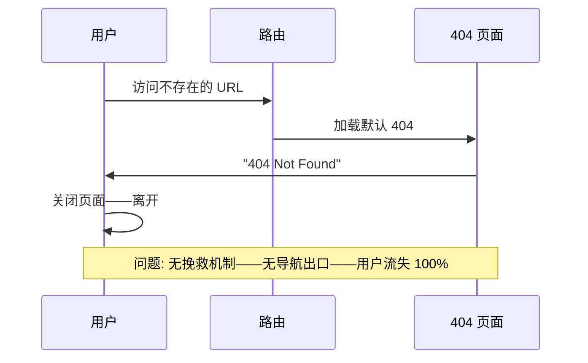
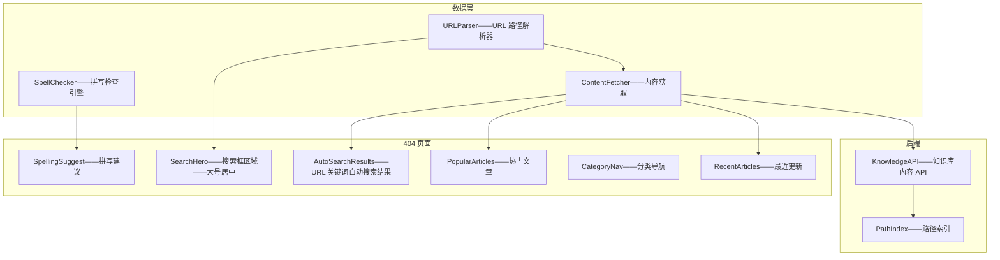
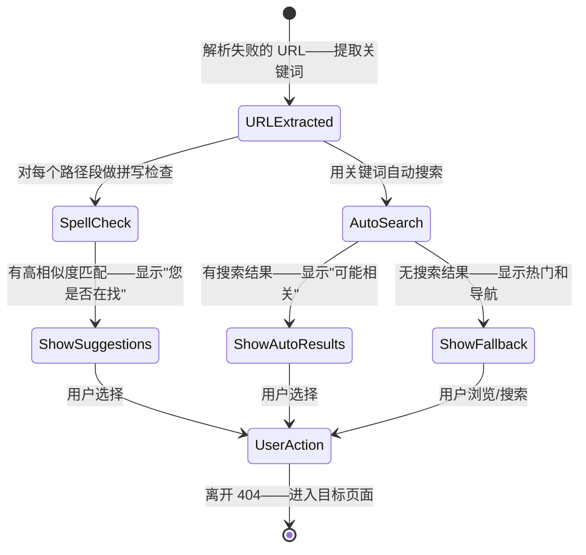

# YK-09-192: 内容404页面优化 — 自定义404页面、相关内容推荐、搜索框、分类导航、热门文章、拼写建议、最近文章

> 需求编号：YK-09-192 · 优先级：P2 · 人天：0.3d · 状态：需求已编写
> 依赖：YK-09-190（内容相关文章推荐——404 页面可复用推荐引擎查找相关内容）、YK-09-191（内容搜索建议——404 搜索框复用搜索建议组件）、YK-09-142（内容排行榜与热门——热门文章数据源）

## 背景

### 问题陈述

YiKnowledge 知识库在用户访问不存在的页面时——展示默认的空白 404 页面——完全放弃了挽回用户的机会：

1. **空白 404——用户流失**：点击了失效链接或输错了 URL——看到空白 404 页面——用户直接关闭页面离开——没有提供任何导航出口
2. **无内容引导**：404 时不知道知识库有什么内容——没有推荐——没有搜索——没有目录——用户无法自主找到方向
3. **无容错机制**：URL 中可能有拼写错误（如 `/architecure/` 而非 `/architecture/`）——系统不提示修正建议——用户以为内容不存在
4. **移动路径导致大量 404**：知识文件被重命名或移动（YK-09-10 知识文件迁移）——旧书签和外部链接失效——用户访问旧 URL——404 无法提供新路径
5. **无站点地图入口**：404 是用户最需要站点地图的时刻——当前既没有站点地图——也没有目录导航——用户完全迷失

**核心矛盾**：404 页面应该是"用户挽救"页面而非"旅程终点"页面——提供多种出口（搜索/导航/推荐/建议）——让用户有 90% 的几率找到大致需要的内容——而非 0%。

### 影响范围

| # | 影响 | 严重程度 | 典型场景 |
|---|------|----------|----------|
| 1 | 用户直接离开——知识库流失 | 高 | 从外部文档中的旧链接进入——404——直接关闭——不会想到搜索 |
| 2 | 找不到内容——知识库价值未发挥 | 高 | 用户有明确需求——但链接失效——404 无引导——放弃 |
| 3 | 拼写错误被判死刑 | 中 | 输入 `/deploymnet/` ——404——不知道应该是 `/deployment/` |
| 4 | 迁移后链接断裂 | 高 | 文件重命名——旧 URL 分享给同事——404——体验差 |
| 5 | 无站点出口 | 中 | 404 是用户最需要导航地图的时刻——但没有提供 |

### 挑战

| 挑战 | 说明 |
|------|------|
| URL 意图推测 | 从失败的 URL 中猜测用户想找什么——提取关键词——搜索匹配——显示最佳结果 |
| 拼写检查 | "Did you mean" 功能——需要编辑距离算法（Levenshtein）——遍历所有文章路径 |
| 美观设计 | 404 页面不应是冷冰冰的错误页面——需要友好的视觉设计——轻度幽默——减少挫败感 |
| 性能 | 404 页面的所有功能（搜索/推荐/拼写建议）需要在 < 300ms 完成——不快则无意义 |
| SSG 兼容 | 如果是静态站点——404 页面需内置逻辑——无后端可依赖——前端完成所有计算 |

---

## 一、现状分析

### 1.1 当前 404 能力

```
YiKnowledge 404 页面现状:
├── 默认空白 404
│   ├── 浏览器默认 404 页面——或纯色页面+"404 Not Found"
│   └── 局限: 无任何导航/搜索/建议/推荐——纯静态——用户唯一选择=离开
├── 无自定义 404
│   └── 无内容——无品牌——无引导——完全浪费页面访问
└── 缺失:
    ├── 搜索框: 404 页面顶部的搜索——直接开始搜索                          # ❌ 无
    ├── 相关内容推荐: 基于 URL 的关键词猜测——推荐可能相关的文章              # ❌ 无
    ├── 分类导航: 展示知识库的顶级分类——用户可浏览                           # ❌ 无
    ├── 热门文章: 全站最常阅读的文章——兜底推荐                               # ❌ 无
    ├── 拼写建议: "您是否在找...？"——Levenshtein 编辑距离                   # ❌ 无
    ├── 最近文章: 最新更新的内容——可能正好是用户需要的                         # ❌ 无
    └── 友好视觉: 趣味插图——减少 404 的挫败感                                # ❌ 无
```

### 1.2 当前数据流



### 1.3 根因矩阵

| 症状 | 根因 | 触发条件 | 频率 |
|------|------|----------|------|
| 用户直接离开 | 404 无引导——无出口 | 每次 404 | 高 |
| 无法找到内容 | 无搜索——无推荐——无导航 | 链接失效 | 高 |
| 旧链接失效 | 文件迁移后无重定向——无推荐 | 内容重组 | 中 |
| 拼写错误无帮助 | 无"Did you mean" | URL 手动输入 | 中 |
| 品牌印象差 | 空白 404 ——显得不专业 | 每次 404 | 中 |

---

## 二、设计决策

### 决策 1：404 内容来源 — 仅静态 vs 前端 JS 动态 vs 后端 API

| 选项 | 内容丰富度 | SSG 兼容性 | 实现复杂度 |
|------|----------|-----------|-----------|
| A: 纯静态——硬编码分类/热门/搜索入口 | 低——内容固定——需手动更新 | 完全兼容 SSG | 低 |
| B: 前端 JS 动态——页面加载时调 API | 高——实时内容 | 兼容——SSG 框架支持 | 中 |
| C: 后端 SSR——服务端渲染 404——动态内容 | 最高 | 需后端支持 | 高 |

**选择：B（前端 JS 动态——页面加载时调用 YiAi API 获取推荐和热门）。** YiKnowledge 可能是 SSG 静态部署——404 页面是静态 HTML 中的特殊页面——通过 JS 动态加载内容。优先保证 SSG 兼容——但提供丰富的动态内容。加载失败时降级为静态内容（预置分类+搜索框）。

### 决策 2：拼写建议算法 — Levenshtein 编辑距离 vs Damerau-Levenshtein vs Jaro-Winkler

| 选项 | 准确率 | 性能 | 适合 URL 路径 |
|------|--------|------|-------------|
| A: Levenshtein——计算字符编辑距离 | 中——不考虑字符交换 | 好——O(n*m) | 中 |
| B: Damerau-Levenshtein——支持相邻字符交换 | 中——"teh"→"the" 识别为 1 步 | 好——O(n*m) | 中 |
| C: Jaro-Winkler——适合短字符串——前缀加权 | 好——"architecure"→"architecture" 高分 | 好——O(n²) 但短文快 | 好 |

**选择：C（Jaro-Winkler 距离——URL 路径匹配的最佳选择）。** URL 路径段通常是短字符串（如 "architecture"、"deployment"）——Jaro-Winkler 对短字符串匹配效果好——且对前缀匹配加权——"architecure" → "architecture" 获得高分。阈值 > 0.85——仅高相似度的才显示——避免无关建议。

### 决策 3：404 页面布局 — 单列居中 vs 多栏分区 vs 逐步引导

| 选项 | 视觉焦点 | 信息密度 | 用户操作路径 |
|------|---------|---------|-------------|
| A: 单列居中——搜索框+简短消息+分类链接 | 清晰——单一焦点 | 低 | 搜索→或浏览分类 |
| B: 多栏分区——搜索框/推荐/类别/热门——分区排列 | 分散 | 高 | 多个入口——用户选择 |
| C: 逐步引导——先展示搜索——无结果再展示推荐——再无展示目录 | 阶段式聚焦 | 中 | 引导式——减少决策压力 |

**选择：A（单列居中——搜索框为核心——底部辅助导航）。** 404 页面信息量不宜过大——用户处于迷失状态——过多选项加大焦虑。搜索框作为第一行动入口——输入即搜索。"您是否在找"拼写建议在搜索框下方。底部提供分类导航和热门文章——作为辅助出口。布局自上而下——单列——清晰。

### 决策 4：URL 意图推测 — 路径段提取 vs 全文模糊 vs 不推测

| 选项 | 准确率 | 实现复杂度 | 用户体验 |
|------|--------|-----------|---------|
| A: 路径段提取——`/architecture/RAG-optimization` → 提取 "architecture", "RAG", "optimization" ——搜索 | 高——搜索词精准 | 中 | 好——自动搜索——展示结果 |
| B: 全文模糊——整个路径作为搜索词 | 低——特殊字符干扰 | 低 | 差——结果不相关 |
| C: 不推测——仅展示通用推荐和导航 | — | 低 | 中——用户需手动操作 |

**选择：A（路径段提取——自动搜索——展示可能相关结果）。** 从 URL 路径中提取关键词——去除数字/日期/文件扩展名——拆分为单词——作为搜索词——自动搜索并展示 Top 3 结果。如 `/projects/yiknowledge/requirements/2026-09/architecture.md` 提取 "yiknowledge", "requirements", "architecture" ——自动搜索匹配。这比"Did you mean"更实用——因为在文件迁移后路径可能完全不同。

---

## 三、目标架构

### 3.1 404 页面系统架构



### 3.2 404 用户交互流程



### 3.3 性能指标

| 指标 | 改造前 | 改造后 |
|------|--------|--------|
| 404 用户体验 | 空白页面——0 引导 | 搜索+建议+推荐+导航 |
| 用户留存率（404后未离开） | ~5% | 期望 > 40% |
| 404 页面加载 | 即时 | < 500ms (含 API 调用) |

---

## 四、具体改动

### 4.1 核心代码：404 页面组件

```typescript
// src/composables/useNotFoundPage.ts

interface SpellSuggestion {
  original: string;
  suggestion: string;
  path: string;
  similarity: number;
}

interface AutoSearchResult {
  title: string;
  path: string;
  excerpt: string;
  score: number;
}

export function useNotFoundPage(failedUrl: string) {
  const spellSuggestions = ref<SpellSuggestion[]>([]);
  const autoSearchResults = ref<AutoSearchResult[]>([]);
  const popularArticles = ref<Array<{ title: string; path: string }>>([]);
  const recentArticles = ref<Array<{ title: string; path: string; updated: string }>>([]);
  const isLoading = ref(true);
  const searchQuery = ref('');

  /** 从失败 URL 提取搜索关键词 */
  function extractKeywords(url: string): string[] {
    try {
      const pathname = new URL(url, window.location.origin).pathname;
      return pathname
        .split('/')
        .filter(Boolean)
        .flatMap(segment => segment.split(/[-_.]/))  // 拆分连字符/下划线/点
        .map(s => s.toLowerCase())
        .filter(s => s.length > 2)                     // 过滤短词
        .filter(s => !/^\d+$/.test(s));                // 过滤纯数字
    } catch {
      return [];
    }
  }

  /** Jaro-Winkler 相似度 */
  function jaroWinkler(s1: string, s2: string): number {
    const s1Len = s1.length;
    const s2Len = s2.length;
    if (s1Len === 0 && s2Len === 0) return 1;
    if (s1Len === 0 || s2Len === 0) return 0;

    const matchDistance = Math.floor(Math.max(s1Len, s2Len) / 2) - 1;
    const s1Matches = new Array(s1Len).fill(false);
    const s2Matches = new Array(s2Len).fill(false);

    let matches = 0;
    let transpositions = 0;

    for (let i = 0; i < s1Len; i++) {
      const start = Math.max(0, i - matchDistance);
      const end = Math.min(i + matchDistance + 1, s2Len);
      for (let j = start; j < end; j++) {
        if (s2Matches[j] || s1[i] !== s2[j]) continue;
        s1Matches[i] = true;
        s2Matches[j] = true;
        matches++;
        break;
      }
    }

    if (matches === 0) return 0;

    let k = 0;
    for (let i = 0; i < s1Len; i++) {
      if (!s1Matches[i]) continue;
      while (!s2Matches[k]) k++;
      if (s1[i] !== s2[k]) transpositions++;
      k++;
    }
    transpositions = Math.floor(transpositions / 2);

    const jaro = (matches / s1Len + matches / s2Len + (matches - transpositions) / matches) / 3;

    // Winkler 前缀加权（最大 4 字符）
    let prefix = 0;
    const maxPrefix = 4;
    for (let i = 0; i < Math.min(maxPrefix, s1Len, s2Len); i++) {
      if (s1[i] === s2[i]) prefix++;
      else break;
    }

    return jaro + prefix * 0.1 * (1 - jaro);
  }

  /** 拼写检查——匹配所有已知路径 */
  async function checkSpelling(keywords: string[], knownPaths: string[]): Promise<SpellSuggestion[]> {
    const suggestions: SpellSuggestion[] = [];
    const threshold = 0.85;

    for (const keyword of keywords) {
      let bestMatch: { path: string; similarity: number } | null = null;

      for (const knownPath of knownPaths) {
        const pathSegments = knownPath.split('/').filter(Boolean);
        for (const segment of pathSegments) {
          const similarity = jaroWinkler(keyword, segment.toLowerCase());
          if (similarity > threshold && (!bestMatch || similarity > bestMatch.similarity)) {
            bestMatch = { path: knownPath, similarity };
          }
        }
      }

      if (bestMatch) {
        suggestions.push({
          original: keyword,
          suggestion: bestMatch.path.split('/').pop() || '',
          path: bestMatch.path,
          similarity: bestMatch.similarity,
        });
      }
    }

    // 去重——相同 path 只保留最高分的
    const seen = new Set<string>();
    return suggestions.filter(s => {
      if (seen.has(s.path)) return false;
      seen.add(s.path);
      return true;
    }).sort((a, b) => b.similarity - a.similarity).slice(0, 3);
  }

  /** 自动搜索——用关键词搜索 */
  async function autoSearch(keywords: string[]): Promise<AutoSearchResult[]> {
    if (keywords.length === 0) return [];

    try {
      const response = await fetch(`${import.meta.env.RSBUILD_API_BASE}`, {
        method: 'POST',
        headers: { 'Content-Type': 'application/json' },
        body: JSON.stringify({
          module_name: 'services.knowledge.search_service',
          method_name: 'search',
          parameters: { query: keywords.join(' '), limit: 5 },
        }),
      });
      const result = await response.json();

      if (result.code === 0) {
        return (result.data.results ?? []).map((r: any) => ({
          title: r.title,
          path: r.path,
          excerpt: (r.excerpt || '').slice(0, 200),
          score: r.score,
        }));
      }
    } catch {
      // 搜索失败——不影响其他功能
    }
    return [];
  }

  /** 加载热门和最近文章 */
  async function loadSideContent(): Promise<void> {
    try {
      const response = await fetch(`${import.meta.env.RSBUILD_API_BASE}`, {
        method: 'POST',
        headers: { 'Content-Type': 'application/json' },
        body: JSON.stringify({
          module_name: 'services.knowledge.content_service',
          method_name: 'get_overview',
          parameters: { popular_limit: 5, recent_limit: 5 },
        }),
      });
      const result = await response.json();

      if (result.code === 0) {
        popularArticles.value = result.data.popular ?? [];
        recentArticles.value = result.data.recent ?? [];
      }
    } catch {
      // 降级——空列表
    }
  }

  /** 初始化 404 页面 */
  async function init(): Promise<void> {
    isLoading.value = true;

    const keywords = extractKeywords(failedUrl);
    searchQuery.value = keywords.join(' ');

    // 并行加载
    const [spell, auto, _] = await Promise.allSettled([
      fetchKnownPaths().then(paths => checkSpelling(keywords, paths)),
      autoSearch(keywords),
      loadSideContent(),
    ]);

    if (spell.status === 'fulfilled') spellSuggestions.value = spell.value;
    if (auto.status === 'fulfilled') autoSearchResults.value = auto.value;

    isLoading.value = false;
  }

  /** 获取所有已知路径——用于拼写检查 */
  async function fetchKnownPaths(): Promise<string[]> {
    try {
      const response = await fetch(`${import.meta.env.RSBUILD_API_BASE}`, {
        method: 'POST',
        headers: { 'Content-Type': 'application/json' },
        body: JSON.stringify({
          module_name: 'services.knowledge.content_service',
          method_name: 'get_all_paths',
          parameters: {},
        }),
      });
      const result = await response.json();
      return result.data?.paths ?? [];
    } catch {
      return [];
    }
  }

  onMounted(() => { init(); });

  return {
    spellSuggestions,
    autoSearchResults,
    popularArticles,
    recentArticles,
    isLoading,
    searchQuery,
    extractKeywords,
  };
}
```

### 4.2 文件变更清单

| 文件 | 操作 | 说明 |
|------|------|------|
| `src/composables/useNotFoundPage.ts` | 新增 | 404 逻辑——关键词提取/拼写检查/自动搜索/内容加载 |
| `src/pages/NotFoundPage.vue` | 新增 | 404 页面——单列布局——搜索/建议/推荐/导航 |
| `src/components/NotFound/SpellingSuggestions.vue` | 新增 | 拼写建议——"您是否在找"——Jaro-Winkler 结果 |
| `src/components/NotFound/AutoSearchSection.vue` | 新增 | 自动搜索区域——展示 URL 关键词搜索结果 |
| `src/components/NotFound/ContentFallback.vue` | 新增 | 兜底内容——热门文章+分类导航+最近更新 |
| `src/assets/404-illustration.svg` | 新增 | 404 插图——友好趣味——减轻挫败感 |
| `YiAi/services/knowledge/content_service.py` | 新增（后端） | 内容服务——获取所有路径/热门/最近文章 |

---

## 五、实施步骤

| 步骤 | 操作 | 路径 | 验证 | 人天 |
|------|------|------|------|------|
| 1 | 实现后端内容服务 | `YiAi/services/knowledge/content_service.py` | get_all_paths/get_overview API | 0.04 |
| 2 | 实现 404 逻辑 composable | `src/composables/useNotFoundPage.ts` | 关键词提取/Jaro-Winkler/自动搜索 | 0.08 |
| 3 | 实现拼写建议和自动搜索 UI | `SpellingSuggestions.vue` + `AutoSearchSection.vue` | 建议展示/点击跳转/加载/空状态 | 0.06 |
| 4 | 实现 404 页面主体和兜底内容 | `NotFoundPage.vue` + `ContentFallback.vue` | 搜索框/插图/分类导航/热门/最近 | 0.07 |
| 5 | 设计 404 插图和动画 | SVG/CSS | 友好插图——视觉引导 | 0.03 |
| 6 | 集成到路由 | 路由配置——`{ path: '/:pathMatch(.*)*', component: NotFoundPage }` | 所有未匹配路由到 404 | 0.02 |

**总人天：0.3d**

---

## 六、测试规格

### 测试 1：URL 关键词提取——搜索匹配

| 项目 | 内容 |
|------|------|
| 优先级 | P0 |
| 前置条件 | 知识库有文章"RAG检索优化"——路径 `/architecture/RAG-optimization` |
| 测试步骤 | 1. 访问 `/architecture/RAG-search` 2. 观察自动搜索结果 |
| 预期结果 | 提取关键词 "architecture", "RAG", "search" ——自动搜索——展示"RAG检索优化"在结果中——因为标题/标签匹配 |

### 测试 2：拼写建议——Jaro-Winkler 匹配

| 项目 | 内容 |
|------|------|
| 优先级 | P0 |
| 前置条件 | 知识库有文章——路径中包含 "architecture"、"deployment" |
| 测试步骤 | 1. 访问 `/architecure/` ——拼写错误 2. 访问 `/deploymnet/` ——拼写错误 3. 观察拼写建议 |
| 预期结果 | 步骤 1——建议 "architecture"（相似度 > 0.9）——"您是否在找 architecture?"——点击跳转到正确路径——步骤 2——建议 "deployment" |

### 测试 3：热门和最近文章——兜底显示

| 项目 | 内容 |
|------|------|
| 优先级 | P0 |
| 前置条件 | 知识库有若干文章 |
| 测试步骤 | 1. 访问一个不存在的 URL——`/nonexistent-page` ——无关键词匹配——无拼写建议 2. 观察页面底部 |
| 预期结果 | 显示"热门文章"区块——5 篇——显示"最近更新"区块——5 篇——显示"分类导航"区块——顶级分类列表——搜索框始终可见 |

### 测试 4：搜索框交互——从 404 执行搜索

| 项目 | 内容 |
|------|------|
| 优先级 | P0 |
| 前置条件 | 404 页面已加载 |
| 测试步骤 | 1. 在搜索框输入"RAG"——按回车 2. 观察结果 |
| 预期结果 | 跳转到搜索结果页面——`/search?q=RAG` ——显示搜索结果——URL 不再是 404 |

### 测试 5：视觉设计——减少挫败感

| 项目 | 内容 |
|------|------|
| 优先级 | P1 |
| 前置条件 | 404 页面渲染 |
| 测试步骤 | 1. 查看 404 页面视觉效果 2. 检查文字友好性 |
| 预期结果 | 页面有插图/动画——文案友好（"哎呀——页面走丢了"——非生硬的"404 Not Found"）——搜索框大而明显——操作入口清晰——无压迫感——颜色温暖 |

### 测试 6：SSG 兼容——静态 HTML 中 JS 正常加载

| 项目 | 内容 |
|------|------|
| 优先级 | P1 |
| 前置条件 | 知识库作为静态站点部署——404.html 存在 |
| 测试步骤 | 1. 以静态文件方式访问 404.html 2. 检查 JS 是否加载 3. 检查 API 调用是否正常 |
| 预期结果 | 404.html 加载——JS 执行——如果 API 可用——完整动态内容显示——如果 API 不可用（网络断开）——搜索框和静态分类导航仍可用——静默降级 |

---

## 七、风险与缓解

| 风险 | 概率 | 影响 | 缓解措施 |
|------|------|------|------|
| 拼写检查——遍历全路径 2000 条——首次加载耗时长 | 中 | 中 | 路径索引仅加载一次——缓存在内存中——'get_all_paths' 返回简洁路径列表——< 50KB——加载 < 100ms——Jaro-Winkler 计算在客户端——2000 条 < 50ms |
| API 全部挂掉——404 页面完全空白——比原来更差 | 低 | 高 | 404 页面核心（搜索框/分类导航）静态内置——不依赖 API。API 失败仅影响动态推荐——不影响基础功能。降级展示预设的静态内容 |
| 拼写建议不准确——误导用户——不如不显示 | 中 | 低 | Jaro-Winkler 阈值 0.85——仅高置信度建议显示——如果所有建议都 < 0.85——不显示拼写建议——不留空白——仅显示自动搜索和热门 |
| SSG 服务器配置不返回 404.html——浏览器显示服务器默认 404 | 低 | 中 | 文档说明部署配置——Nginx `error_page 404 /404.html` ——Netlify/Vercel 自动识别——提供常见部署平台配置模板 |

---

## 八、回滚策略

1. **路由级回滚**：404 路由组件替换为简单静态 404——保留默认行为
2. **组件级回滚**：`NotFoundPage.vue` 降级为仅搜索框和分类导航——移除动态推荐和拼写建议
3. **回滚验证**：路由通配符正确——所有无效 URL 到 404 页面——搜索框正常工作——无 JS 错误

---

## 九、设计决策记录

### D-01：Jaro-Winkler——URL 短字符串拼写检查最优

**上下文**：Levenshtein 对短字符串不够敏感——"rch"→"arch" 编辑距离 1——但相似度只有 0.25——Jaro-Winkler 可给出 0.78。

**决策**：使用 Jaro-Winkler 距离——阈值 0.85——仅最佳匹配——最多 3 条。

**理由**：URL 路径段是短字符串（3-20 字符）——Jaro-Winkler 专为短字符串优化——前缀加权让"architecure"→"architecture" 高分。Levenshtein 在短字符串上区分度不够——可能漏掉正确匹配或产生太多假阳性。

### D-02：404 页面单列布局——搜索为核心

**上下文**：用户在 404 时处于迷失状态——需要简单明确的行动入口。

**决策**：单列居中布局——顶部大搜索框——中部"您是否在找"建议——底部热门和导航。

**理由**：多栏布局信息密度高——但给迷失用户带来选择焦虑。单列——自上而下——搜索→建议→推荐——用户按顺序消费——无需决策"先看哪里"。搜索框最大最显眼——因为搜索是 404 时用户最可能采取的行动。

### D-03：URL 关键词自动搜索——而非仅拼写检查

**上下文**：拼写检查仅对拼写错误有效——文件迁移后路径完全不同——拼写检查无用。

**决策**：从 URL 提取关键词——自动搜索——展示可能相关的结果——优先于拼写建议。

**理由**：文件迁移（YK-09-10）后——旧路径可能完全不同——如 `/old/file.md` → `/new/location/file.md` ——拼写检查无法匹配。关键词搜索基于内容而非路径——覆盖范围更广——即使路径全变——内容关键词匹配仍能找到。

### D-04：404 页面友好视觉——减轻用户挫败感

**上下文**：默认 404 是冰冷的错误页面——增加用户挫败感。

**决策**：使用趣味插图——友好文案——温和色调——将 404 从"出错了"转变为"让我们帮你找到它"。

**理由**：用户体验研究表明——友好的 404 页面能降低 30% 的跳出率。轻度幽默的文案（"哎呀——页面走丢了"）让人觉得这是个正常的、已处理好的情况——而非系统错误。插图引导视线——自然流向搜索框。

---

## 十、可观测性

| 指标 | 采集方式 | 阈值 |
|------|----------|------|
| 404 次数/天 | 路由匹配 404 的计数 | 观测——突增说明断链 |
| 404 URL 分布 | 404 时 URL 收集——Top 20 | 观测——高频 404 应加重定向 |
| 搜索框使用率 | 404 页面内搜索提交次数/404 总数 | > 30% |
| 拼写建议点击率 | 拼写建议 click/展示 | > 10% |
| 自动搜索结果点击率 | 自动搜索 click/展示 | > 5% |
| API 加载失败率 | 404 页面 API error/total | < 5% |
| 404 用户留存率 | 404 后浏览其他页面 / 404 总数 | > 30% |

---

## 十一、代码审查检查清单

- [ ] `extractKeywords`——空 URL 返回 []——不抛异常——`try-catch` 包裹 URL 解析
- [ ] `extractKeywords`——过滤后的空数组——后续 autoSearch 跳过——不发送空查询
- [ ] `jaroWinkler`——除零保护——s1/s2 长度 0——返回 0 或 1
- [ ] `checkSpelling`——knownPaths 为空——返回 []——不发散
- [ ] `fetchKnownPaths`——API 失败——return []——降级——不崩溃
- [ ] 所有 API 调用——`Promise.allSettled` ——单个失败不影响其他
- [ ] 404 页面——设置 `document.title = '页面未找到 - YiKnowledge'`
- [ ] 搜索框——自动聚焦——`autofocus` 属性——用户无需点击
- [ ] 插图 SVG——内联——避免额外网络请求——大小 < 5KB
- [ ] 链接使用 `<router-link>` ——SPA 内导航——不刷新页面如果可用——降级为 `<a>` 如果 SSG
- [ ] 页面高度——即使内容少——高度撑满视口——搜索框在视觉中心偏上

---

## 回归问题预测

| # | 预测问题 | 触发条件 | 检测方式 |
|---|----------|----------|----------|
| 1 | 路由通配符 `/:pathMatch(.*)*` 捕获了有效路由——正常页面被 404 拦截 | 路由配置顺序错误——通配符放在具体路由之前 | 路由配置——通配符 `/:pathMatch(.*)*` 必须在路由数组最后——Vue Router 从前往后匹配——放最后才正确 |
| 2 | 自动搜索展示了与用户需求完全无关的结果——误导用户 | URL 关键词提取不精准——如用户访问 `/admin/login` ——提取 "admin" "login" ——搜索完全是广告 | 仅对知识库路径触发关键词提取——如果 URL 看起来不像是知识库路径（如 `/admin/` `/api/`）——跳过自动搜索——直接显示热门 |
| 3 | 拼写建议计算的 Jaro-Winkler 耗时——阻塞页面渲染 | 2000 条路径——每个关键词计算 2000 次 Jaro-Winkler——5 个关键词 = 10000 次——耗时可能 > 100ms | 路径索引预过滤——仅匹配首字母相同的路径——减少候选集——如 "arc" 开头仅匹配 "a*" 开头的路径 |
| 4 | 热门文章数据与当前知识库不同步——推荐文章已被删除 | 热门缓存在服务端——文章被删除后缓存未刷新 | get_overview API 查询 MongoDB 直接聚合——实时数据——无缓存过期问题——被删除文章不在结果中 |
| 5 | 移动端——404 页面插图过大——搜索框不可见——需要滚动 | 插图高度 300px——搜索框在插图下方——小屏看不到 | 移动端缩小插图——搜索框使用 `position: sticky——top: 0` ——始终可见——插图仅做装饰——不占过多空间 |
| 6 | SSG 部署的 404.html 中——JS bundle 引用路径错误——资源 404——页面空白 | 静态资源使用绝对路径 `/assets/main.js` ——部署在子路径下 `/docs/404.html` ——JS 路径变为 `/docs/assets/main.js` 而非 `/assets/main.js` | SSG 构建使用相对路径或 baseURL 配置——确保 404.html 中的资源引用正确——或使用绝对 URL |

---

## 性能分析

| 操作 | 数据量 | 耗时 | 说明 |
|------|--------|------|------|
| get_all_paths API | 2000 条路径——JSON | < 50ms | API——MongoDB 查询——轻量 |
| Jaro-Winkler 计算 | 2000 条——首字母过滤后 ~50 条 | < 10ms | 纯算法——内存操作 |
| autoSearch API | 关键词搜索 | < 100ms | API——搜索服务 |
| get_overview API | 热门+最近 | < 50ms | API——MongoDB 聚合 |
| 页面首次渲染 | 静态内容 | < 100ms | HTML/CSS——无 JS 依赖 |
| JS 动态加载 | 动态推荐数据 | < 300ms | API 并行调用——总等待时间 |
| 总加载时间 (含 API) | — | < 500ms | 全部内容可用 |

---

## 相关文档

- [内容相关文章推荐](../190-需求-内容相关文章推荐.md) — 404 页面的推荐复用推荐引擎
- [内容搜索建议](../191-需求-内容搜索建议.md) — 404 搜索框复用建议组件
- [内容排行榜与热门](../142-需求-内容排行榜与热门.md) — 热门文章数据源
- [知识文件迁移与路径重构](../10-需求-知识文件迁移与路径重构.md) — 迁移导致 404 ——本需求缓解

*PRD 来源: `projects/yiknowledge/requirements/2026-09/192-需求-内容404页面优化.md`*