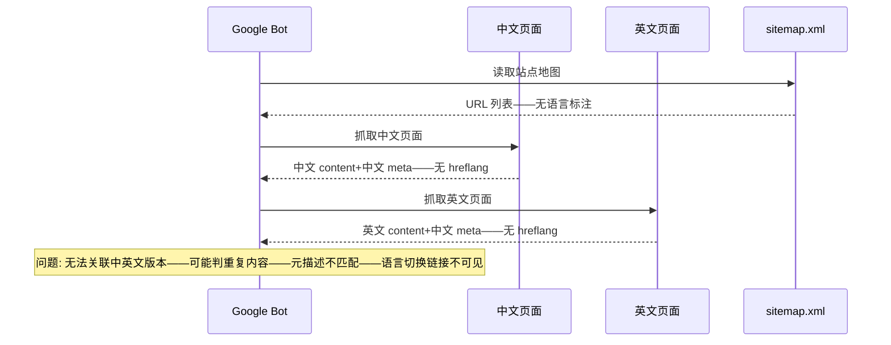
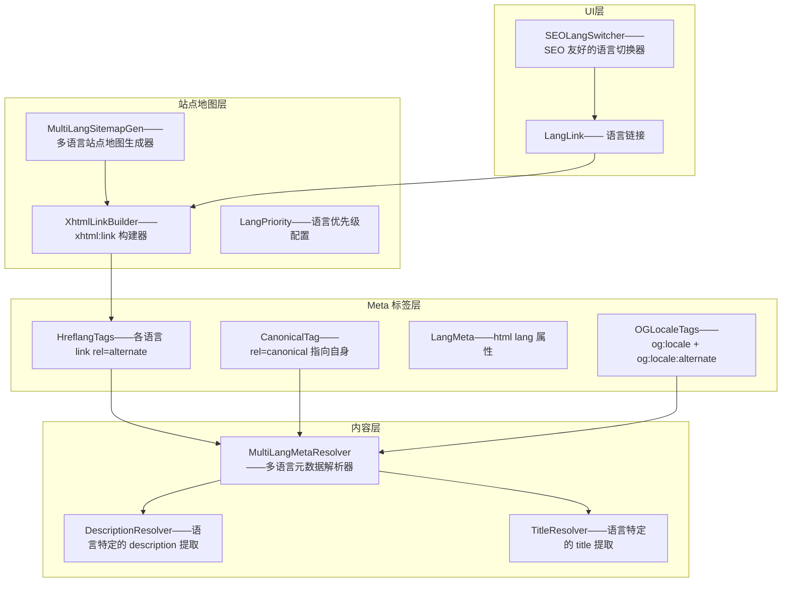
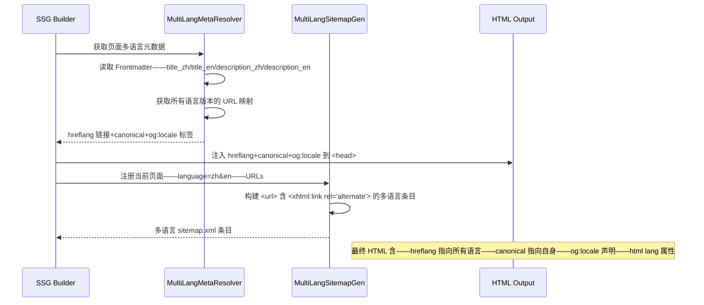

# YK-09-192: 内容多语言SEO — hreflang 标签、语言特定站点地图、翻译后的元描述、规范 URL、语言切换器 SEO

> 需求编号：YK-09-192 · 优先级：P2 · 人天：0.3d · 状态：需求已编写
> 依赖：YK-09-124（内容国际化工作流——多语言内容管理基础）、YK-09-119（内容翻译管理——翻译内容映射和管理）、YK-09-137（内容SEO优化——多语言 SEO 是全局 SEO 的扩展）、YK-09-190（内容结构化数据标记——多语言页面共享 JSON-LD 生成逻辑）

## 背景

### 问题陈述

YiKnowledge 支持多语言内容（中文/英文）后——搜索引擎对多语言站点的索引和排名存在严重问题：

1. **无 hreflang 标签——搜索引擎混淆**：Google 无法知道中文页面和英文页面的关系——可能将中文页面索引到英文搜索结果中——或反之——导致用户体验差和跳出率高
2. **重复内容惩罚**：中英文页面虽然内容语言不同——但如果 hreflang 标签缺失——Google 可能将其视为重复内容——降低两个版本的排名
3. **站点地图无语言标注**：sitemap.xml 中所有 URL 平等对待——无语言优先级——无 `xhtml:link` 关联——Google 无法高效发现和理解多语言关系
4. **元描述未翻译**：中英文页面使用相同的 meta description（通常是中文）——英文搜索结果中显示中文描述——英文用户完全看不懂——点击率为 0
5. **语言切换器对 SEO 不友好**：语言切换使用 JavaScript 渲染——搜索引擎无法爬取语言切换链接——无法发现其他语言版本

**核心矛盾**：内容已被翻译为多语言——但搜索引擎无法正确理解和索引这些多语言关系——等于翻译的 SEO 价值全部浪费——好的多语言内容没有被正确的用户搜索到。

### 影响范围

| # | 影响 | 严重程度 | 典型场景 |
|---|------|----------|----------|
| 1 | 语言版本索引混淆 | 高 | Google 英文搜索返回中文页面——英文用户打开——立即跳出 |
| 2 | 重复内容惩罚 | 高 | 中英文页面被 Google 视为 duplicate——两个版本排名都下降 |
| 3 | 英文搜索结果中文描述 | 高 | 英文用户搜索——看到中文 meta description——完全跳过 |
| 4 | 语言版本发现困难 | 中 | Google 只索引了中文版——英文版完全未被发现——SEO 白做 |
| 5 | 语言切换器 SEO 盲区 | 中 | 搜索引擎爬虫无法发现语言切换链接——无法爬取其他语言版本 |

### 挑战

| 挑战 | 说明 |
|------|------|
| hreflang 双向引用 | 中文页面需要指向英文版本——英文页面需要指向中文版本——任意语言新增时需要更新所有已有语言的 hreflang |
| 语言特定的元数据 | 每种语言需要独立的 title/description/og:title/og:description——不能共用——需要从翻译内容中提取 |
| 站点地图多语言扩展 | sitemap.xml 需要为每个 URL 添加 `<xhtml:link rel="alternate">` ——XML 结构复杂——需要验证 |
| 语言切换器的 SEO | 语言切换链接必须是 `<a href>` ——不能是 `<button onclick>` ——搜索引擎只跟踪 `<a>` 链接 |
| 规范 URL 选择 | 多语言页面需要 canonical URL——指向自身还是指向默认语言——需要正确决策——错了反而有害 |

---

## 一、现状分析

### 1.1 当前多语言 SEO 状态

```
YiKnowledge 多语言 SEO 现状:
├── hreflang 标签
│   └── 局限: 无——Google 无法理解语言关系——索引混乱
├── 站点地图
│   ├── 有基础 sitemap.xml
│   └── 局限: 无语言标注——无 xhtml:link——Google 不知道多语言关系
├── Meta 描述
│   ├── 使用 Frontmatter description——通常是中文
│   └── 局限: 英文页面使用中文 description——英文搜索结果显示中文
├── 规范 URL
│   ├── 可能有 `<link rel="canonical">`
│   └── 局限: 多语言页面的 canonical 指向不正确——可能全指向中文版
├── 语言切换器
│   ├── Vue 组件——JavaScript 渲染
│   └── 局限: 搜索引擎无法爬取——无法发现其他语言版本
└── 缺失:
    ├── hreflang: <link rel="alternate" hreflang="zh" href="...">
    │          <link rel="alternate" hreflang="en" href="...">
    │          <link rel="alternate" hreflang="x-default" href="...">      # ❌ 无
    ├── 多语言站点地图: <url><xhtml:link rel="alternate" ...>             # ❌ 无
    ├── 翻译后的元描述: 英文页面使用英文 description                       # ❌ 无
    ├── SEO 友好的语言切换器: <a href> 链接                                # ❌ 无
    └── 规范 URL: 每个语言版本 canonical 指向自身                          # ❌ 无
```

### 1.2 当前数据流



### 1.3 根因矩阵

| 症状 | 根因 | 触发条件 | 频率 |
|------|------|----------|------|
| 语言版本索引混淆 | HTML 无 `<link rel="alternate" hreflang="...">` | Google 索引时 | 每次爬取 |
| 重复内容惩罚 | hreflang 缺失——中英文被当作两个独立无关联页面 | 中英文页面同时存在 | 持续 |
| 英文搜索结果中文描述 | 英文页面使用 Frontmatter 的 description（中文） | 英文用户搜索 | 每次展示 |
| 英文版本未被索引 | sitemap 无语言标注——Google 只爬了中文版 | 站点地图提供后 | 持续 |
| 语言切换链接不可爬取 | JS 渲染的切换按钮——非 `<a>` 链接 | 搜索引擎爬取 | 每次爬取 |

---

## 二、设计决策

### 决策 1：hreflang 实现方式 — HTML `<link>` 标签 vs HTTP Header vs Sitemap 三者选一

| 选项 | 实现复杂度 | 维护成本 | Google 推荐度 |
|------|-----------|---------|-------------|
| A: HTML `<link>` 标签——`<link rel="alternate" hreflang="zh" href="...">` | 中——每个页面注入多个 link 标签 | 中——新增语言需更新所有页面 | 高——最常用 |
| B: HTTP Header——`Link: <url>; rel="alternate"; hreflang="zh"` | 高——需要服务端配置 | 中 | 中——适合非 HTML 资源 |
| C: Sitemap——在 sitemap.xml 中标注 `<xhtml:link>` | 中——需要扩展 sitemap 生成逻辑 | 低——集中管理 | 高——Google 推荐 |

**选择：A + C 结合——HTML `<link>` 标签 + Sitemap `<xhtml:link>`。** 两者都用是最佳实践（Google 推荐）。HTML `<link>` 在每个页面提供即时语言关系——Sitemap 提供全局语言关系视图——双保险。Sitemap 集中管理——新增语言时改一处——HTML `<link>` 在 SSG 时自动生成——不需要手动维护。

### 决策 2：规范 URL 策略 — 指向自身 vs 指向默认语言 vs 不设置

| 选项 | SEO 效果 | 实现复杂度 | 风险 |
|------|---------|-----------|------|
| A: 指向自身——中文页 canonical = 中文 URL——英文页 canonical = 英文 URL | 正确——配合 hreflang——每个版本独立索引 | 低 | 无 |
| B: 指向默认语言——所有语言 canonical = 中文 URL | 错误——英文版不会被独立索引——SEO 价值丢失 | 低 | 高——英文版不索引 |
| C: 不设置 canonical | 不确定——交给 Google 判断 | 最低 | 中——Google 可能选错 |

**选择：A（每个语言版本 canonical 指向自身——hreflang 提供关联）。** 这是 Google 官方推荐的多语言 canonical 策略。hreflang 告诉 Google"这些是同一内容的不同语言版本"——canonical self 告诉 Google"这个语言版本是权威的"——两者协作——每个语言版本独立索引——同时知道彼此关系。

### 决策 3：翻译后元数据来源 — Frontmatter 独立字段 vs 翻译文件 vs 混合

| 选项 | 维护便利性 | 一致性 | 实现复杂度 |
|------|---------|--------|-----------|
| A: Frontmatter 独立字段——`description_zh`/`description_en` | 中——每篇文章 2 个字段 | 高——与文章同文件 | 低 |
| B: 翻译文件——独立的 `translations.json` | 分散——多文件维护 | 低——容易不同步 | 中 |
| C: 混合——Frontmatter 默认——翻译文件补充 | 中 | 中 | 高 |

**选择：A（Frontmatter 独立字段——`description_zh`/`description_en`/`title_en`）。** 元数据与文章内容密切相关——放在同一文件的 Frontmatter 中最自然。后续如果支持更多语言——可扩展为 `description_ja`/`description_ko`。不提供翻译时——降级使用默认的 `title`/`description`（中文）——通过 og:locale 告知搜索引擎。

### 决策 4：语言切换器 SEO — SSR `<a>` 链接 vs 动态注入 vs Sitemap 替代

| 选项 | 爬虫可见 | 用户体验 | 实现复杂度 |
|------|---------|---------|-----------|
| A: SSR `<a>` 链接——SSG 时渲染语言切换链接——`<a href="/en/page">` | 完全可见 | 好——点击跳转 | 中 |
| B: 动态注入——客户端 JS 渲染 | 不可见——爬虫不执行 JS | 好——交互丰富 | 低——但 SEO 无效 |
| C: 仅依赖 Sitemap——无页面内语言切换链接 | 爬虫通过 Sitemap 发现 | 差——用户无切换入口 | 最低 |

**选择：A（SSR `<a>` 链接——SSG 时渲染——基础链接爬虫可见——JavaScript 增强交互）。** SSG 构建时渲染语言切换的 `<a>` 链接——搜索引擎爬虫可以跟踪这些链接发现其他语言版本。客户端 JavaScript 可以在此基础上增强交互（如下拉菜单、当前语言高亮）——但不影响基本 SEO。

---

## 三、目标架构

### 3.1 多语言 SEO 系统架构



### 3.2 多语言 SEO 流程



### 3.3 性能指标

| 指标 | 改造前 | 改造后 |
|------|--------|--------|
| Google 多语言索引准确度 | 混乱——中文出现在英文搜索结果 | 准确——hreflang 确保语言正确匹配 |
| 重复内容警告（Google Search Console） | 可能有 | 消除——hreflang 明确语言关系 |
| 英文搜索结果描述匹配度 | 0%——中文描述 | 100%——英文描述 |
| 语言版本发现率 | 低——仅靠内部链接 | 高——hreflang+Sitemap+SEO 切换器 |
| hreflang 标签覆盖率 | 0% | 100%——所有多语言页面 |

---

## 四、具体改动

### 4.1 核心代码：多语言 SEO 元数据解析器

```typescript
// src/build/multilang-seo.ts

interface LangMeta {
  /** 语言代码——BCP 47 */
  lang: string;
  /** 语言特定的标题 */
  title: string;
  /** 语言特定的描述 */
  description: string;
  /** 语言特定的 URL（相对路径） */
  url: string;
  /** 是否为默认语言 */
  isDefault: boolean;
}

interface PageLangInfo {
  /** 当前页面语言 */
  currentLang: string;
  /** 当前页面 URL——相对于站点根 */
  currentUrl: string;
  /** 所有可用语言版本 */
  allLanguages: LangMeta[];
}

class MultiLangMetaResolver {
  private supportedLanguages = ['zh', 'en'];
  private defaultLanguage = 'zh';

  /** 解析页面的多语言信息 */
  resolve(frontmatter: Record<string, unknown>, pageRelativePath: string): PageLangInfo {
    const currentLang = this.detectLanguage(pageRelativePath);
    const currentUrl = this.buildUrl(pageRelativePath, currentLang);

    const allLanguages: LangMeta[] = this.supportedLanguages.map(lang => {
      const isDefault = lang === this.defaultLanguage;
      return {
        lang,
        title: this.getTitle(frontmatter, lang),
        description: this.getDescription(frontmatter, lang),
        url: this.buildUrl(pageRelativePath, lang),
        isDefault,
      };
    });

    return { currentLang, currentUrl, allLanguages };
  }

  /** 生成 hreflang <link> 标签 */
  generateHreflangTags(info: PageLangInfo, siteUrl: string): string[] {
    const tags: string[] = [];

    for (const langMeta of info.allLanguages) {
      const fullUrl = `${siteUrl}${langMeta.url}`;
      tags.push(`<link rel="alternate" hreflang="${langMeta.lang}" href="${this.escape(fullUrl)}">`);
    }

    // x-default——指向默认语言（或语言选择页面）
    const defaultLang = info.allLanguages.find(l => l.isDefault) || info.allLanguages[0];
    const defaultUrl = `${siteUrl}${defaultLang.url}`;
    tags.push(`<link rel="alternate" hreflang="x-default" href="${this.escape(defaultUrl)}">`);

    return tags;
  }

  /** 生成规范 URL——指向自身 */
  generateCanonicalTag(info: PageLangInfo, siteUrl: string): string {
    const fullUrl = `${siteUrl}${info.currentUrl}`;
    return `<link rel="canonical" href="${this.escape(fullUrl)}">`;
  }

  /** 生成 OG locale 标签 */
  generateOGLocaleTags(info: PageLangInfo): string[] {
    const tags: string[] = [];
    const localeMap: Record<string, string> = {
      zh: 'zh_CN',
      en: 'en_US',
    };

    const currentLocale = localeMap[info.currentLang] || 'zh_CN';
    tags.push(`<meta property="og:locale" content="${currentLocale}">`);

    // 其他可用语言作为 alternate
    for (const langMeta of info.allLanguages) {
      if (langMeta.lang !== info.currentLang) {
        const altLocale = localeMap[langMeta.lang] || langMeta.lang;
        tags.push(`<meta property="og:locale:alternate" content="${altLocale}">`);
      }
    }

    return tags;
  }

  /** 生成 html lang 属性值 */
  generateHtmlLang(info: PageLangInfo): string {
    return info.currentLang;
  }

  /** 检测当前页面的语言——基于路径前缀 */
  private detectLanguage(path: string): string {
    // /en/page → en, /page → zh (default)
    const match = path.match(/^\/(en|zh)\//);
    if (match) return match[1];
    return this.defaultLanguage;
  }

  /** 构建语言特定的 URL */
  private buildUrl(basePath: string, lang: string): string {
    // 移除已有的语言前缀——然后加上新语言前缀
    let cleanPath = basePath;
    for (const sl of this.supportedLanguages) {
      if (cleanPath.startsWith(`/${sl}/`)) {
        cleanPath = cleanPath.slice(sl.length + 1); // 移除 /en/
        break;
      }
    }

    if (lang === this.defaultLanguage) {
      // 默认语言不加前缀——/projects/xxx
      return cleanPath.startsWith('/') ? cleanPath : `/${cleanPath}`;
    }
    // 非默认语言加前缀——/en/projects/xxx
    return `/${lang}${cleanPath.startsWith('/') ? cleanPath : `/${cleanPath}`}`;
  }

  /** 获取语言特定的标题 */
  private getTitle(frontmatter: Record<string, unknown>, lang: string): string {
    const langTitleKey = `title_${lang}`;
    if (frontmatter[langTitleKey] && typeof frontmatter[langTitleKey] === 'string') {
      return frontmatter[langTitleKey] as string;
    }
    // 降级——使用默认 title
    return (frontmatter.title as string) || '';
  }

  /** 获取语言特定的描述 */
  private getDescription(frontmatter: Record<string, unknown>, lang: string): string {
    const langDescKey = `description_${lang}`;
    if (frontmatter[langDescKey] && typeof frontmatter[langDescKey] === 'string') {
      return frontmatter[langDescKey] as string;
    }
    // 降级——使用默认 description 或空
    return (frontmatter.description as string) || '';
  }

  private escape(text: string): string {
    return text.replace(/&/g, '&amp;').replace(/"/g, '&quot;');
  }
}

// ---- 多语言站点地图生成器 ----

class MultiLangSitemapGenerator {
  constructor(private siteUrl: string) {}

  /** 生成多语言站点地图条目 */
  generateURLEntry(pageInfo: PageLangInfo): string {
    const entries: string[] = [];

    for (const langMeta of pageInfo.allLanguages) {
      const fullUrl = `${this.siteUrl}${langMeta.url}`;
      const alternates = pageInfo.allLanguages
        .filter(l => l.lang !== langMeta.lang)
        .map(l => `    <xhtml:link rel="alternate" hreflang="${l.lang}" href="${this.siteUrl}${l.url}"/>`)
        .join('\n');

      entries.push(`  <url>
    <loc>${this.escape(fullUrl)}</loc>${alternates ? '\n' + alternates : ''}
    <xhtml:link rel="alternate" hreflang="x-default" href="${this.siteUrl}${pageInfo.allLanguages.find(l => l.isDefault)?.url || pageInfo.allLanguages[0].url}"/>
  </url>`);
    }

    return entries.join('\n');
  }

  /** 生成完整的多语言站点地图 XML */
  generateFullSitemap(pages: PageLangInfo[]): string {
    const urlEntries = pages.map(p => this.generateURLEntry(p)).join('\n');

    return `<?xml version="1.0" encoding="UTF-8"?>
<urlset xmlns="http://www.sitemaps.org/schemas/sitemap/0.9"
        xmlns:xhtml="http://www.w3.org/1999/xhtml">
${urlEntries}
</urlset>`;
  }

  private escape(text: string): string {
    return text.replace(/&/g, '&amp;').replace(/</g, '&lt;').replace(/>/g, '&gt;');
  }
}

export { MultiLangMetaResolver, MultiLangSitemapGenerator, PageLangInfo, LangMeta };
```

### 4.2 文件变更清单

| 文件 | 操作 | 说明 |
|------|------|------|
| `src/build/multilang-seo.ts` | 新增 | 多语言 SEO 核心——hreflang/规范 URL/OG locale 生成+多语言站点地图生成 |
| `src/build/ssg-enhancer.ts` | 修改 | SSG 注入 hreflang+canonical+html lang+og:locale 标签 |
| `src/build/sitemap-generator.ts` | 修改 | sitemap 生成器——集成 MultiLangSitemapGenerator |
| `src/components/LangSwitcher.vue` | 修改 | 语言切换器——SSR `<a>` 链接——SEO 友好——JavaScript 增强 |
| `src/composables/useMultiLangSEO.ts` | 新增 | 多语言 SEO composable——运行时语言切换+元数据更新 |
| `src/types/multilang.ts` | 新增 | 多语言相关类型定义 |
| `tests/multilang-seo.test.ts` | 新增 | 多语言 SEO 测试——hreflang 双向引用+站点地图验证 |
| Frontmatter 规范 | 更新 | 增加 `title_zh`/`title_en`/`description_zh`/`description_en` 字段说明 |

---

## 五、实施步骤

| 步骤 | 操作 | 路径 | 验证 | 人天 |
|------|------|------|------|------|
| 1 | 实现多语言元数据解析器 | `multilang-seo.ts`——MultiLangMetaResolver | 检测当前语言——获取所有语言版本——标题/描述回退 | 0.06 |
| 2 | 实现 hreflang+canonical+og:locale 生成 | `multilang-seo.ts`——生成方法 | 中文页含英文 hreflang——英文页含中文 hreflang——canonical=自身 | 0.05 |
| 3 | 集成 SSG——注入多语言标签 | `ssg-enhancer.ts` | 构建后 HTML `<head>` 含 hreflang+canonical+html lang | 0.04 |
| 4 | 实现多语言站点地图生成器 | `multilang-seo.ts`——MultiLangSitemapGenerator+sitemap-generator 集成 | sitemap.xml 每个 URL 含 xhtml:link——语言关系正确 | 0.06 |
| 5 | 实现 SEO 友好的语言切换器 | `LangSwitcher.vue`——SSR `<a>` 链接 | 切换器使用 `<a>` 标签——爬虫可跟踪——JS 增强交互 | 0.05 |
| 6 | 更新 Frontmatter 规范——多语言字段 | YiKnowledge MEMORY.md+Frontmatter 示例 | 增加 title_zh/title_en/description_zh/description_en | 0.04 |

**总人天：0.3d**

---

## 六、测试规格

### 测试 1：hreflang 标签——双向引用正确

| 项目 | 内容 |
|------|------|
| 优先级 | P0 |
| 前置条件 | 中文页面 /page——英文翻译 /en/page——Frontmatter 含 title_zh/title_en |
| 测试步骤 | 1. 构建中文页面 2. 检查 `<head>` hreflang 标签 3. 构建英文页面——检查 hreflang |
| 预期结果 | 中文页面含——`<link rel="alternate" hreflang="zh" href="...">`（自身）+ `<link rel="alternate" hreflang="en" href=".../en/...">` + `x-default`——英文页面含——`<link rel="alternate" hreflang="en" href="...">`（自身）+ `zh` + `x-default`——双向引用完整 |

### 测试 2：规范 URL——每个语言版本指向自身

| 项目 | 内容 |
|------|------|
| 优先级 | P0 |
| 前置条件 | 中文页面 `/page`——英文页面 `/en/page` |
| 测试步骤 | 1. 构建两个页面 2. 检查 canonical |
| 预期结果 | 中文页——`<link rel="canonical" href="...site/page">`——英文页——`<link rel="canonical" href="...site/en/page">`——各自指向自身——互不指向对方 |

### 测试 3：语言特定的元描述——英文页面用英文描述

| 项目 | 内容 |
|------|------|
| 优先级 | P0 |
| 前置条件 | Frontmatter——description_zh="中文描述"——description_en="English description" |
| 测试步骤 | 1. 构建英文页面 2. 检查 `<meta name="description">` 3. 检查 `og:description` |
| 预期结果 | description="English description"——og:description="English description"——title 为 title_en 的值——无中文 |

### 测试 4：html lang 属性——根据页面语言正确设置

| 项目 | 内容 |
|------|------|
| 优先级 | P1 |
| 前置条件 | 中文页面 /page——英文页面 /en/page |
| 测试步骤 | 1. 检查中文页面 `<html lang="...">` 2. 检查英文页面 `<html lang="...">` |
| 预期结果 | 中文页——`<html lang="zh">`——英文页——`<html lang="en">`——无语言页——`<html lang="zh">`（默认） |

### 测试 5：多语言站点地图——xhtml:link 正确

| 项目 | 内容 |
|------|------|
| 优先级 | P1 |
| 前置条件 | 中英文页面——sitemap.xml |
| 测试步骤 | 1. 构建 sitemap.xml 2. 检查 XML 3. 使用 Google Search Console 或 XML validator 验证 |
| 预期结果 | 中文 URL 条目含 `xhtml:link rel="alternate" hreflang="en"`——英文 URL 条目含 `xhtml:link rel="alternate" hreflang="zh"`——x-default 正确——XML 格式有效——无语法错误 |

### 测试 6：语言切换器——SEO 友好——<a> 链接可爬取

| 项目 | 内容 |
|------|------|
| 优先级 | P1 |
| 前置条件 | 中文页面——SSG 渲染——语言切换器 |
| 测试步骤 | 1. 查看源代码 2. 检查切换器 HTML——禁用 JS 3. 点击语言链接 |
| 预期结果 | 源代码中语言切换器是 `<a href="/en/page">English</a>`——非 `<button>` 或 JS onClick——禁用 JS 后链接仍可点击——跳转到英文页面——搜索引擎可爬取 |

---

## 七、风险与缓解

| 风险 | 概率 | 影响 | 缓解措施 |
|------|------|------|------|
| hreflang 循环引用——A→B→C→A——Google 报错 | 低 | 中 | hreflang 生成器确保双向引用——不形成循环——所有语言平等引用——x-default 指向默认语言 |
| canonical 指向错误——英文页 canonical 指向中文页——英文页不索引 | 低 | 高——英文页 SEO 全丢 | 代码生成——`generateCanonicalTag` 始终使用 `currentUrl` ——不会指向其他语言——测试覆盖 |
| 新增语言后——已有页面未更新 hreflang——新语言版本对 Google 不可见 | 中 | 中 | `allLanguages` 从 `supportedLanguages` 配置生成——新增语言只需添加配置——重建后所有页面自动包含新 hreflang |
| 多语言站点地图过大——200+ 页×2 语言×xhtml:link——超过 Google 50MB/50000URL 限制 | 低 | 低 | YiKnowledge 页面数 < 500——×2 语言 = < 1000 URL——远低于限制——无风险 |
| 语言切换器——SSR `<a>` 链接 + JS 增强——hydrate 后事件绑定可能丢失 | 低 | 低 | Vue 的 `@click.prevent` + `<a>` ——hydration 后保持 `<a>` 标签——事件正确绑定——降级时 `<a>` 仍工作 |

---

## 八、回滚策略

1. **功能级回滚**：SSG 中跳过 MultiLangMetaResolver——不注入 hreflang 标签——回到无多语言 SEO 状态
2. **组件级回滚**：语言切换器回退到 JS-only 版本——移除 SSR `<a>` 链接——不影响用户功能
3. **站点地图回滚**：sitemap-generator 跳过 MultiLangSitemapGenerator——生成基础单语言 sitemap
4. **回滚验证**：页面正常渲染——无 hreflang 标签——无 JS 错误——Google Search Console 无多语言标注

---

## 九、设计决策记录

### D-01：hreflang x-default ——指向默认语言

**上下文**：`x-default` 告诉搜索引擎——用户的语言不匹配任何版本时——应该展示哪个版本。

**决策**：`x-default` 指向中文版（默认语言）——或未来的语言选择页面。

**理由**：中文是 YiKnowledge 的主要受众语言——也是默认内容语言。当用户的浏览器语言既不是中文也不是英文（如日语）时——Google 展示 x-default 版本——中文是最合理的后备。如果未来有语言选择页面——可以改为指向选择页面。

### D-02：URL 结构——默认语言无前缀——非默认加前缀

**上下文**：多语言 URL 结构——`/zh/page` vs `/page`（默认语言）vs `/page?lang=zh`。

**决策**：默认语言（中文）无前缀——`/page` ——非默认语言（英文）加前缀——`/en/page`。

**理由**：大多数用户使用默认语言——不添加前缀保持 URL 简洁。非默认语言通过路径前缀区分——语义清晰——Google 的 hreflang 处理最简单。不使用 query 参数——搜索引擎处理 query 参数的 hreflang 支持较差。

### D-03：降级元数据——非当前语言缺失时使用默认

**上下文**：英文页面需要英文 title/description——但 Frontmatter 可能未提供 `title_en`/`description_en`。

**决策**：降级——使用默认 title/description——同时 `html lang="en"` 告知搜索引擎这是英文页面。

**理由**：不完全的翻译比没有翻译好——至少页面语言正确（lang="en"）——搜索引擎不会因为中文描述而判定为中文页面。降级在 og:locale 中声明当前语言是英文——搜索引擎会根据 lang+locale 而非纯文本来判断语言。后续逐步补齐英文元数据。

### D-04：语言切换器的 SEO 最低要求——<a> 链接

**上下文**：语言切换器需要既好看又好爬。

**决策**：基础 HTML 使用 `<a href>` 链接——JavaScript 在此之上增强交互。

**理由**：搜索引擎爬虫跟踪 `<a>` 链接——不执行 JavaScript。SSG 时渲染基础 `<a>` 链接作为 fallback——保证爬虫可发现所有语言版本。客户端 hydration 后——JavaScript 可以添加下拉菜单、高亮当前语言等增强——但不影响基础 `<a>` 的功能。"Progressive Enhancement"是 SEO 最佳实践。

---

## 十、可观测性

| 指标 | 采集方式 | 阈值 |
|------|----------|------|
| hreflang 标签覆盖率 | 构建后 HTML 检查——含 hreflang 页面/总多语言页面 | 100% |
| Google Search Console hreflang 错误 | GSC——国际定位报告 | 0 错误 |
| 各语言版本索引数 | GSC——索引覆盖——按语言 | 中英索引数比例合理 |
| 英文搜索结果——描述语言匹配 | 手动搜索+检查 | 100% 英文描述 |
| 站点地图多语言条目数 | sitemap.xml——含 xhtml:link 的 URL 数 | 与多语言页面数一致 |
| 语言切换器链接有效性 | 爬虫模拟检查——所有 `<a>` 链接返回 200 | 100% |

---

## 十一、代码审查检查清单

- [ ] `detectLanguage` ——路径无语言前缀——返回默认语言——非 `/en/` 非 `/zh/` ——也返回默认
- [ ] `buildUrl` ——重复移除语言前缀——`/en/en/page` 不会出现——清理逻辑正确
- [ ] `getTitle`/`getDescription` ——`title_xx` 不存在——降级默认 title——title 也不存在——返回空字符串——不报错
- [ ] `generateHreflangTags` ——至少有一个语言版本——hreflang 自身引用——所有语言+自身
- [ ] `generateCanonicalTag` ——始终使用绝对 URL——`${siteUrl}${currentUrl}` ——不出现 `//` 双斜杠
- [ ] `MultiLangSitemapGenerator` ——每个 URL 条目 `<url>` ——有 loc 必填——hreflang 可选
- [ ] `xhtml:link` ——`rel="alternate"` ——不要写成 `rel="alternative"` ——常见笔误
- [ ] 语言代码——BCP 47 格式——`zh`/`en` ——不要使用 `zh-CN` 作为 hreflang（虽然合法但不推荐）——保持一致性
- [ ] `html lang` 属性——与 hreflang 自身引用一致——不同步会导致搜索引擎困惑
- [ ] 语言切换器 `<a>` ——`href` 正确——不是 `javascript:void(0)` ——不是 `#`
- [ ] 语言切换器——`hreflang` 属性可选——在 `<a>` 上——`hreflang="en"` ——提示搜索引擎目标页面语言
- [ ] `og:locale:alternate` ——仅列出有翻译页面的语言——不要列出所有支持但不存在的语言

---

## 回归问题预测

| # | 预测问题 | 触发条件 | 检测方式 |
|---|----------|----------|----------|
| 1 | hreflang 双向引用不完整——中文页指向英文——但英文页未更新——缺少中文引用——Google 忽略 hreflang | 新增英文页面后——未同时更新中文页面的 hreflang——旧的构建缓存 | SSG 构建时——对每个页面——检查所有语言版本的 hreflang 双向引用完整性——警告缺失的引用 |
| 2 | 站点地图 xhtml:link——URL 是相对路径而非绝对——Google 报告错误 | `buildUrl` 返回相对路径——sitemap 中直接使用 | `MultiLangSitemapGenerator` 强制拼接 `siteUrl` + url——确保所有 URL 是绝对路径——加验证 |
| 3 | canonical —页面 URL 包含 query 参数（如 ?utm_source=...）——canonical 也包含参数——Google 困惑 | 社交媒体分享添加了 UTM 参数——canonical 自动使用当前 URL | canonical 使用无参数的标准 URL——`${siteUrl}${currentUrl}` 中 currentUrl 不含 query 参数——SSG 时确定 |
| 4 | Frontmatter title_zh/title_en 和 hreflang 不一致——英文页面 title 和 hreflang title 不同 | 手动改 Frontmatter 只改了 title_en——忘记改 title_zh——hreflang 生成器读的是 title_zh——不一致 | 在 Frontmatter 规范中明确——title_zh 是中文标题（用于 SEO）——title_en 是英文标题（用于 SEO）——构建日志警告不一致 |
| 5 | 语言切换器——SSR `<a>` 链接在 JS hydrate 后被 Vue Router 拦截——`@click.prevent` + `router.push` ——但 `<a>` 的默认行为被 prevent——爬虫无 JS 时反而正常 | Vue hydration ——`@click.prevent` 阻止了 `<a>` 默认跳转——JS 禁用时 fallback 失效 | `@click.prevent` 只在 JS enable 时生效——JS disable 时 `<a>` 正常工作——hydrate 后——`<a>` 保持——`@click` 用 `router.push` ——不影响 SEO fallback |
| 6 | 英文页面的中文 keyword meta——Google 可能仍使用中文关键词匹配英文搜索 | og:locale 和 html lang 都标明 en——但 `<meta name="keywords">` 仍使用中文 Frontmatter 的 tags | 英文页面使用 `tags_en` 或翻译后的 tags——降级时用英文翻译而不是中文 tags——或英文页面不输出 keywords meta（Google 已不重视 keywords） |

---

## 性能分析

| 操作 | 数据量 | 耗时 | 说明 |
|------|--------|------|------|
| hreflang 生成——1 页面 2 语言 | 4-5 个 link 标签 | < 1ms | 字符串拼接——纯 CPU |
| canonical 生成 | 1 个 tag | < 0.5ms | 字符串拼接 |
| og:locale 标签 | 2-3 个 meta 标签 | < 1ms | 字符串拼接 |
| 站点地图——多语言条目 | 1 页面 2 语言 | < 0.5ms | XML 字符串拼接 |
| 全站多语言 SEO 注入 | 200 页——400ms | 构建时——一次性 | 非运行时成本 |
| 语言切换器 SSR 渲染 | 2-3 个 `<a>` 链接 | < 2ms | Vue SSR 渲染 |

---

## 相关文档

- [内容国际化工作流](../124-需求-内容国际化工作流.md) ——多语言内容管理
- [内容翻译管理](../119-需求-内容翻译管理.md) ——翻译内容和元数据映射
- [内容SEO优化](../137-需求-内容SEO优化.md) ——全局 SEO——meta tags/sitemap
- [内容结构化数据标记](./190-需求-内容结构化数据标记.md) ——多语言 JSON-LD 的 inLanguage 属性
- [内容社交分享优化](./191-需求-内容社交分享优化.md) ——多语言 og:locale——社交分享多语言预览

*PRD 来源: `projects/yiknowledge/requirements/2026-09/192-需求-内容多语言SEO.md`*