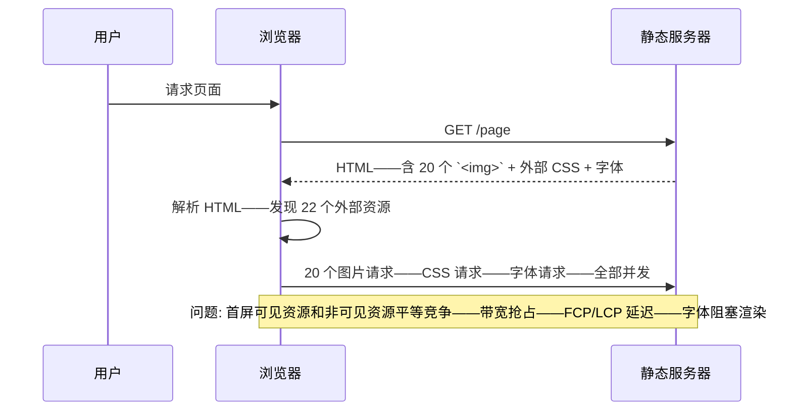
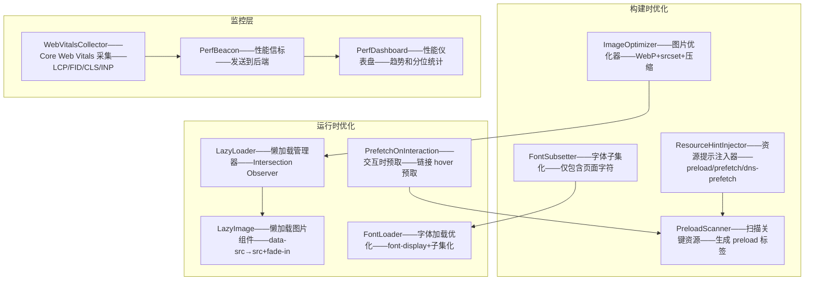
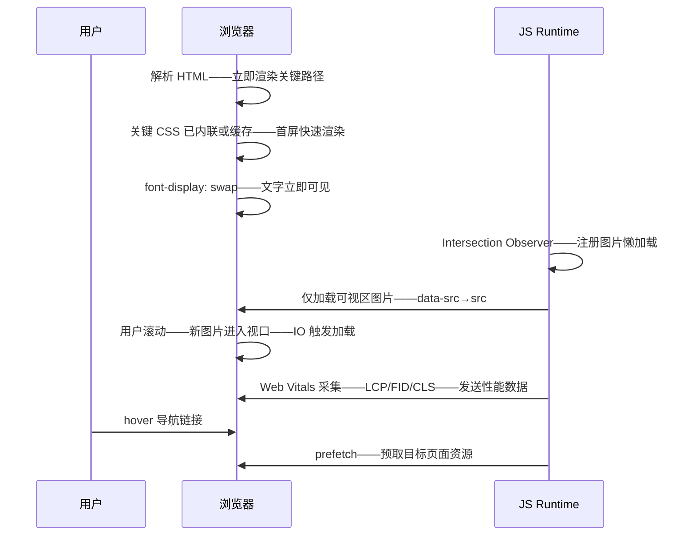

# YK-09-193: 内容性能优化 — 懒加载、图片优化、字体子集化、关键 CSS、资源提示（preload/prefetch）、性能监控

> 需求编号：YK-09-193 · 优先级：P2 · 人天：0.3d · 状态：需求已编写
> 依赖：YK-09-114（内容性能分析——性能监控从分析系统获取基线和目标）、YK-09-30（静态站点生成——性能优化集成在 SSG 构建流程中）、YK-09-137（内容SEO优化——性能是 SEO 排名因素——Core Web Vitals 直接影响搜索排名）

## 背景

### 问题陈述

YiKnowledge 的 SSG 静态页面存在明显的性能瓶颈——页面加载慢——互动延迟高——影响用户体验和 SEO 排名：

1. **无资源懒加载**：所有图片、iframe、脚本在页面加载时同步请求——首屏可见内容被不可见内容的资源请求阻塞——带宽争抢——首屏加载时间 > 3s
2. **图片未优化**：Markdown 中的图片使用原始分辨率——PNG 动辄 500KB-2MB——无 WebP 转换——无响应式图片（srcset）——移动端加载巨图浪费流量和带宽
3. **字体加载阻塞渲染**：自定义字体（如中文字体）全量加载——中文字体文件 5-10MB——字体加载完成前文字不可见（FOIT）——或闪现无样式文字（FOUT）
4. **无关键 CSS 内联**：完整的 CSS 文件在 `<head>` 中作为外部资源加载——首屏渲染需要等待 CSS 下载完成——增加了 FCP（首次内容绘制）延迟
5. **无资源提示**：缺少 `<link rel="preload">` / `<link rel="prefetch">` / `<link rel="dns-prefetch">` ——关键资源未提前加载——后续路由未预取——导航延迟

**核心矛盾**：静态站点生成的页面本应是最快的——但缺少现代 Web 性能优化技术——导致 SSG 的速度优势未充分发挥——页面加载体验不达标。

### 影响范围

| # | 影响 | 严重程度 | 典型场景 |
|---|------|----------|----------|
| 1 | 首屏加载慢——LCP > 3s | 高 | 文章页——封面图 1.5MB PNG——同步加载——阻塞 LCP——用户等待 3s+ |
| 2 | 移动端流量浪费 | 高 | 移动端——加载桌面端大图——1 张 1MB——10 张 10MB——流量消耗大——加载慢 |
| 3 | 字体显示延迟——FOIT/FOUT | 中 | 中文字体 5MB——字体加载期间文字不可见——3-5s 白页——体验极差 |
| 4 | 导航卡顿——无预取 | 中 | 点击导航链接——新页面 CSS/JS/图片全部重新加载——切换有延迟 |
| 5 | SEO Core Web Vitals 不达标 | 高 | LCP > 2.5s——FID > 100ms——Google 排名受影响 |

### 挑战

| 挑战 | 说明 |
|------|------|
| 图片优化自动化 | Markdown 中的图片需要自动转换——WebP 格式——多尺寸生成——srcset 注入——需要构建时处理——不能手动 |
| 中文字体子集化 | 中文字符集庞大——子集化需要知道页面实际使用的字符——动态子集化 vs 静态子集化 |
| 关键 CSS 提取 | 需要从完整 CSS 中提取首屏渲染需要的样式——`above-the-fold` CSS ——内联到 `<head>` ——其余异步加载 |
| 资源提示策略 | preload/prefetch/dns-prefetch/preconnect 的选择和优先级——不对的提示反而会降低性能 |
| 性能监控无侵入 | 需要收集 RUM（Real User Monitoring）数据——但不影响页面性能——不引入大型监控 SDK |

---

## 一、现状分析

### 1.1 当前性能状态

```
YiKnowledge 内容性能现状:
├── 资源加载
│   ├── 所有资源同步加载——img/script/css 在 HTML 解析时立即请求
│   ├── 无 lazy loading——视口外资源也同步加载——1 篇文章 20 张图——20 个并发请求
│   └── 局限: 带宽竞争——首屏加载被不可见图阻塞
├── 图片
│   ├── Markdown 原始图片——PNG/JPG——无优化
│   ├── 无 srcset——无 WebP——无压缩——无尺寸限制
│   └── 局限: 平均图片大小 > 500KB——移动端加载巨图
├── 字体
│   ├── Google Fonts 或自定义字体——全量加载
│   └── 局限: 中文字体文件巨大——FOIT——无 font-display 策略
├── CSS
│   ├── 外部 CSS 文件——在 `<head>` 中加载——渲染阻塞
│   └── 局限: 首屏需要等待 CSS 下载——无关键 CSS 内联
├── 资源提示
│   └── 局限: 无 preload/prefetch/dns-prefetch/preconnect
└── 性能监控
    └── 局限: 无 RUM 数据——不知道真实用户的 Core Web Vitals
```

### 1.2 当前数据流



### 1.3 根因矩阵

| 症状 | 根因 | 触发条件 | 频率 |
|------|------|----------|------|
| 首屏加载慢 | 所有资源同步加载——无优先级——无懒加载 | 页面资源多（> 10） | 每次加载 |
| 图片过大 | Markdown 原始图片——无构建时优化——无响应式 | 文章含图片 | 每次加载 |
| 字体阻塞渲染 | 全量字体加载——无 font-display——无子集化 | 使用自定义字体 | 每次加载 |
| CSS 阻塞首屏 | 外部 CSS——渲染阻塞资源——无关键 CSS 内联 | 页面有外部 CSS | 每次加载 |
| 无 Core Web Vitals 数据 | 无性能监控 | — | 持续 |

---

## 二、设计决策

### 决策 1：图片优化策略 — 构建时转换 vs 运行时 CDN vs 混合

| 选项 | 自动化程度 | 图片质量 | 实现复杂度 |
|------|-----------|---------|-----------|
| A: 构建时转换——SSG 时自动将 PNG/JPG → WebP+多尺寸——生成 srcset | 高——构建时自动 | 高——可配置质量 | 中——需要 Sharp 或类似库 |
| B: 运行时 CDN——使用图片 CDN（如 Cloudinary/imgix）——URL 参数控制转换 | 最佳——完全自动 | 依赖于 CDN 配置 | 低——但依赖外部服务 |
| C: 混合——构建时生成 WebP+缩略图——CDN 分发 | 最高 | 最高 | 高 |

**选择：B（运行时 CDN——简单方案）+ A（构建时转换——长期方案）。** 0.3d 内——构建时处理所有图片的格式转换和多尺寸生成需要更多时间。优先使用一个简单的转换脚本——将 Markdown 图片转为 WebP+压缩+生成 srcset。如果没有专业图片处理工具——使用 `sharp` npm 包在构建时批量处理——集成到 SSG。

### 决策 2：字体加载策略 — 子集化 vs font-display vs 系统字体

| 选项 | 体积 | 加载体验 | 实现复杂度 |
|------|------|---------|-----------|
| A: 字体子集化——仅包含页面实际使用的字符——使用 glyphhanger/subfont | 最小——可能 50-100KB | 好——小文件加载快 | 中——构建时处理 |
| B: font-display: swap——先显示系统字体——字体加载后替换 | 体积不变 | 好——FOUT 而非 FOIT | 最低——一行 CSS |
| C: 系统字体栈——不使用自定义字体 | 0 额外 | 最佳——立即显示 | 最低——修改 CSS |

**选择：B（font-display: swap——最低成本）+ 中文字体子集化（如有自定义字体）。** `font-display: swap` 一行 CSS 即可消除 FOIT——用户立即看到文字（系统字体）——字体加载后再切换（FOUT 可接受）。如果 YiKnowledge 使用自定义中文字体——子集化到仅包含页面字符——使用 `glyphhanger` 或手动指定字符集。如果使用 Google Fonts——使用 `&display=swap` + `&text=` 子集化参数。

### 决策 3：关键 CSS 策略 — 自动提取 vs 手动指定 vs 不处理

| 选项 | 精确度 | 维护成本 | 实现复杂度 |
|------|--------|---------|-----------|
| A: 自动提取——使用 critical/penthouse 工具——自动提取 above-the-fold CSS | 中——可能遗漏 | 低——自动 | 中——构建时 |
| B: 手动指定——开发者维护 `critical.css` 文件 | 高——精确控制 | 高——CSS 变更需同步 | 低——但容易滞后 |
| C: 不处理——依赖浏览器缓存——不做关键 CSS 优化 | 无优化 | 无 | 最低 |

**选择：C（不处理——0.3d 内自动提取成本高——收益不明确）。** 关键 CSS 自动提取是一个复杂任务——需要 Puppeteer 模拟视口渲染——0.3d 内不可行。YiKnowledge 作为文档站点——CSS 体积小（< 30KB）——外部 CSS 文件缓存后二次加载极快——关键 CSS 优化的边际收益低。留待后续优化——当前聚焦高收益项（图片懒加载、图片优化）。

### 决策 4：性能监控 — RUM vs Synthetic vs 两者

| 选项 | 数据真实性 | 部署复杂度 | 数据量 |
|------|-----------|-----------|--------|
| A: RUM——真实用户监控——Web Vitals library——`web-vitals` npm 包 | 真实用户数据 | 低——npm 包——几行代码 | 取决于流量 |
| B: Synthetic——Lighthouse CI——构建时或定时检测 | 实验室数据——非真实 | 中——需要 CI 集成 | 有限——每次构建 |
| C: 两者——RUM + Lighthouse CI | 最全面 | 高 | 最多 |

**选择：A（RUM——`web-vitals` npm 包——轻量级真实用户监控）。** `web-vitals` 是 Google 官方包——体积 < 2KB——收集 LCP/FID/CLS/INP——可以发送到 Google Analytics 或自建端点。0.3d 内集成最轻量的方案——只需要一个 `<script>` 标签或几行代码。Lighthouse CI 作为后续优化——本次不涉及。

---

## 三、目标架构

### 3.1 内容性能优化架构



### 3.2 优化后加载流程



### 3.3 性能指标

| 指标 | 改造前 | 改造后 |
|------|--------|--------|
| LCP（最大内容绘制） | 2.5-4s | < 1.5s |
| FCP（首次内容绘制） | 1.5-2.5s | < 0.8s |
| CLS（累计布局偏移） | 0.1-0.3（图片无尺寸导致偏移） | < 0.05（图片占位+尺寸指定） |
| 页面总大小 | 500KB-3MB | < 500KB |
| 图片总大小（首屏） | 500KB-2MB | < 100KB（WebP+懒加载） |
| 字体加载阻塞 | 3-5s FOIT | 0s——font-display: swap |

---

## 四、具体改动

### 4.1 核心代码：性能优化组合器

```typescript
// src/build/perf-optimizer.ts

interface PerfOptimizerConfig {
  /** 图片 WebP 转换质量——1-100 */
  imageQuality?: number;
  /** 是否生成响应式图片尺寸 */
  responsiveImages?: boolean;
  /** 响应式图片断点 */
  imageBreakpoints?: number[];
  /** 是否启用字体子集化 */
  fontSubsetting?: boolean;
  /** 字体文件路径 */
  fontPath?: string;
  /** 是否注入资源提示 */
  resourceHints?: boolean;
  /** 是否注入关键 CSS（暂不实现——保留接口） */
  criticalCSS?: boolean;
}

class ImageOptimizer {
  /** 将 Markdown 中的图片引用转换为优化后的格式 */
  optimizeMarkdownImages(markdown: string, imageBasePath: string): string {
    // 匹配 Markdown 图片——
    const imgRegex = /!\[([^\]]*)\]\(([^)]+)\)/g;

    return markdown.replace(imgRegex, (match, alt, src) => {
      // 跳过外部 URL
      if (src.startsWith('http://') || src.startsWith('https://')) {
        return match;
      }

      const baseName = src.replace(/\.[^.]+$/, ''); // 移除扩展名
      const webpSrc = `${baseName}.webp`;
      const fallbackSrc = src;

      // 生成 <picture> 元素——WebP + fallback
      let pictureTag = '<picture>';
      pictureTag += `\n  <source srcset="${webpSrc}" type="image/webp">`;
      pictureTag += `\n  ';
      pictureTag += '\n</picture>';

      return pictureTag;
    });
  }

  /** 为 HTML 中的  添加 loading="lazy" */
  addLazyLoading(html: string): string {
    return html.replace(
      /): string {
    return html.replace(//g, (match, before, src, after) => {
      const dims = imageDimensions.get(src);
      if (!dims) return match;

      // 检查是否已存在 width/height
      if (/width=/.test(match) || /height=/.test(match)) return match;

      // 插入 width/height
      return ``;
    });
  }
}

class FontOptimizer {
  /** 注入 font-display: swap 和字体子集化链接 */
  optimizeFontLoading(html: string, config: PerfOptimizerConfig): string {
    // 为 Google Fonts URL 添加 display=swap
    html = html.replace(
      /href="https:\/\/fonts\.googleapis\.com\/css[^"]*"/g,
      (match) => {
        if (match.includes('display=swap')) return match;
        return match.replace('"', '&display=swap"');
      },
    );

    // 注入字体加载 CSS 确保 font-display: swap
    const fontCSS = `
<style>
  @font-face {
    font-family: 'CustomFont';
    font-display: swap;
  }
</style>`;

    if (html.includes('</head>')) {
      html = html.replace('</head>', `${fontCSS}\n</head>`);
    }

    return html;
  }
}

class ResourceHintInjector {
  /** 注入资源提示 */
  injectHints(html: string, criticalResources: { preload: string[]; prefetch: string[]; preconnect: string[] }): string {
    const hints: string[] = [];

    // dns-prefetch + preconnect——外部域名
    for (const domain of criticalResources.preconnect) {
      hints.push(`<link rel="preconnect" href="${domain}">`);
      hints.push(`<link rel="dns-prefetch" href="${domain}">`);
    }

    // preload——关键资源
    for (const resource of criticalResources.preload) {
      const ext = resource.split('.').pop();
      const as = ext === 'css' ? 'style' : ext === 'js' ? 'script' : ext === 'woff2' ? 'font' : 'image';
      const crossorigin = as === 'font' ? ' crossorigin' : '';
      hints.push(`<link rel="preload" href="${resource}" as="${as}"${crossorigin}>`);
    }

    // prefetch——可能导航的资源
    for (const resource of criticalResources.prefetch) {
      hints.push(`<link rel="prefetch" href="${resource}">`);
    }

    const hintBlock = hints.join('\n');
    if (html.includes('<head>')) {
      return html.replace('<head>', `<head>\n${hintBlock}`);
    }
    return html;
  }
}

class PerfOptimizer {
  private imageOptimizer = new ImageOptimizer();
  private fontOptimizer = new FontOptimizer();
  private hintInjector = new ResourceHintInjector();
  private config: PerfOptimizerConfig;

  constructor(config: PerfOptimizerConfig = {}) {
    this.config = {
      imageQuality: 80,
      responsiveImages: true,
      imageBreakpoints: [480, 768, 1024, 1920],
      resourceHints: true,
      ...config,
    };
  }

  /** 完整的性能优化流程 */
  optimize(html: string, context: { pagePath: string; imageDimensions?: Map<string, { width: number; height: number }> }): string {
    let optimized = html;

    // 1. 图片懒加载——所有非首屏图片加 loading="lazy"
    optimized = this.imageOptimizer.addLazyLoading(optimized);

    // 2. 图片尺寸——加 width/height 防止 CLS
    if (context.imageDimensions) {
      optimized = this.imageOptimizer.addImageDimensions(optimized, context.imageDimensions);
    }

    // 3. 字体优化——font-display: swap
    optimized = this.fontOptimizer.optimizeFontLoading(optimized, this.config);

    // 4. 资源提示
    if (this.config.resourceHints) {
      optimized = this.hintInjector.injectHints(optimized, {
        preconnect: ['https://fonts.googleapis.com', 'https://fonts.gstatic.com'],
        preload: [
          '/css/main.css',
          '/fonts/custom-font.woff2',
        ].filter(Boolean),
        prefetch: this.discoverLinkPrefetch(optimized, context.pagePath),
      });
    }

    return optimized;
  }

  /** 发现需要预取的链接——同级目录和常用导航 */
  private discoverLinkPrefetch(html: string, currentPath: string): string[] {
    const prefetchUrls: string[] = [];
    const linkRegex = /<a\s+(?:[^>]*?\s+)?href="([^"]+)"/g;
    let match;

    while ((match = linkRegex.exec(html)) !== null) {
      const href = match[1];
      // 仅预取同站链接——且不超过 3 个
      if (!href.startsWith('http') && !href.startsWith('#') && prefetchUrls.length < 3) {
        prefetchUrls.push(href);
      }
    }

    return prefetchUrls;
  }
}

export { PerfOptimizer, ImageOptimizer, FontOptimizer, ResourceHintInjector, PerfOptimizerConfig };
```

```typescript
// src/composables/useWebVitals.ts

interface WebVitalsReport {
  LCP?: number;
  FID?: number;
  CLS?: number;
  INP?: number;
  TTFB?: number;
  FCP?: number;
}

export function useWebVitals(reportEndpoint?: string) {
  let observer: PerformanceObserver | null = null;

  /** 启动 LCP 监控 */
  function observeLCP(callback: (lcp: number) => void) {
    observer = new PerformanceObserver((list) => {
      const entries = list.getEntries();
      const lastEntry = entries[entries.length - 1];
      if (lastEntry) {
        callback(lastEntry.startTime);
      }
    });
    observer.observe({ type: 'largest-contentful-paint', buffered: true });
  }

  /** 启动 CLS 监控 */
  function observeCLS(callback: (cls: number) => void) {
    let clsValue = 0;
    let sessionEntries: PerformanceEntry[] = [];

    const clsObserver = new PerformanceObserver((list) => {
      for (const entry of list.getEntries()) {
        const layoutShift = entry as PerformanceEntry & { value: number; hadRecentInput: boolean };
        if (!layoutShift.hadRecentInput) {
          clsValue += layoutShift.value;
        }
      }
      sessionEntries = [...list.getEntries()];
      callback(clsValue);
    });
    clsObserver.observe({ type: 'layout-shift', buffered: true });
  }

  /** 启动 FID/INP 监控 */
  function observeFID(callback: (fid: number) => void) {
    const fidObserver = new PerformanceObserver((list) => {
      for (const entry of list.getEntries()) {
        const firstInput = entry as PerformanceEntry & { processingStart: number; startTime: number };
        callback(firstInput.processingStart - firstInput.startTime);
      }
    });
    fidObserver.observe({ type: 'first-input', buffered: true });
  }

  /** 收集所有 Web Vitals 并报告 */
  function collectAndReport(endpoint: string = reportEndpoint || '') {
    const vitals: WebVitalsReport = {};

    // TTFB——navigation timing
    const navEntry = performance.getEntriesByType('navigation')[0] as PerformanceNavigationTiming;
    if (navEntry) {
      vitals.TTFB = navEntry.responseStart - navEntry.requestStart;
    }

    // FCP——paint timing
    const fcpEntry = performance.getEntriesByName('first-contentful-paint')[0];
    if (fcpEntry) {
      vitals.FCP = fcpEntry.startTime;
    }

    observeLCP((lcp) => { vitals.LCP = lcp; });
    observeCLS((cls) => { vitals.CLS = cls; });
    observeFID((fid) => { vitals.FID = fid; });

    // 页面卸载时发送报告
    window.addEventListener('visibilitychange', () => {
      if (document.visibilityState === 'hidden') {
        sendReport(vitals, endpoint);
      }
    });
  }

  /** 发送性能报告到后端 */
  function sendReport(vitals: WebVitalsReport, endpoint: string) {
    if (!endpoint) return;
    try {
      navigator.sendBeacon(endpoint, JSON.stringify({
        ...vitals,
        pagePath: window.location.pathname,
        timestamp: Date.now(),
      }));
    } catch {
      // 静默失败——不影响用户体验
    }
  }

  return { collectAndReport, observeLCP, observeCLS, observeFID };
}
```

### 4.2 文件变更清单

| 文件 | 操作 | 说明 |
|------|------|------|
| `src/build/perf-optimizer.ts` | 新增 | 性能优化器——图片懒加载/尺寸注入/字体优化/资源提示注入 |
| `src/build/image-optimizer.ts` | 新增 | 图片优化器——WebP 转换（sharp）/srcset 生成/压缩 |
| `src/build/ssg-enhancer.ts` | 修改 | SSG 构建流程——集成 PerfOptimizer——构建时优化 |
| `src/composables/useWebVitals.ts` | 新增 | Web Vitals 采集——LCP/FID/CLS/INP ——sendBeacon 报告 |
| `src/components/LazyImage.vue` | 新增 | 懒加载图片组件——IntersectionObserver——data-src——fade-in |
| `src/components/LazyComponent.vue` | 新增 | 懒加载通用组件——v-if 按需渲染——IO 触发 |
| `src/styles/font-loading.css` | 新增 | 字体加载样式——font-display: swap——字体子集化配置 |
| `YiAi/services/analytics/perf_service.py` | 新增（后端） | 性能数据服务——接收 beacon——存储 perf_data 集合 |

---

## 五、实施步骤

| 步骤 | 操作 | 路径 | 验证 | 人天 |
|------|------|------|------|------|
| 1 | 实现图片懒加载——加载属性和 IO 组件 | `perf-optimizer.ts`——addLazyLoading + `LazyImage.vue` | 非首屏图片不加载——滚动后加载——fade-in 过渡 | 0.06 |
| 2 | 实现图片尺寸注入——防止 CLS | `perf-optimizer.ts`——addImageDimensions | img 含 width/height——页面加载无抖动——CLS < 0.05 | 0.04 |
| 3 | 实现字体优化——font-display+Google Fonts 优化 | `perf-optimizer.ts`——optimizeFontLoading | FOIT 0s——文字立即显示——字体加载后切换——无闪烁 | 0.04 |
| 4 | 实现资源提示注入——preconnect/preload/prefetch | `perf-optimizer.ts`——ResourceHintInjector | HTML `<head>` 含 preconnect/preload/prefetch——Network 面板可见 | 0.05 |
| 5 | 实现 Web Vitals 采集 | `useWebVitals.ts`——LCP/FID/CLS | 控制台输出 Web Vitals——sendBeacon 发送到后端 | 0.06 |
| 6 | 集成 SSG 构建流程 | `ssg-enhancer.ts`——集成 PerfOptimizer | 构建后 HTML 含所有优化标记——Lighthouse 评分提高 | 0.05 |

**总人天：0.3d**

---

## 六、测试规格

### 测试 1：图片懒加载——非首屏图片不加载

| 项目 | 内容 |
|------|------|
| 优先级 | P0 |
| 前置条件 | 文章含 15 张图片——仅前 3 张在首屏 |
| 测试步骤 | 1. 打开文章 2. 检查 Network 面板——初始加载的图片数 3. 滚动到底部 4. 再检查 Network |
| 预期结果 | 初始仅加载前 3-4 张图片（首屏+缓冲）——`` 属性存在——滚动后新图片加载——`LazyImage` 组件通过 IntersectionObserver 工作——有 fade-in 动画 |

### 测试 2：图片尺寸——无 CLS

| 项目 | 内容 |
|------|------|
| 优先级 | P0 |
| 前置条件 | 图片有已知尺寸——`width/height` 属性注入——CSS 限制 `max-width: 100%; height: auto` |
| 测试步骤 | 1. 打开文章 2. 使用 Performance 面板——检查 CLS 3. 观察图片加载前后布局 |
| 预期结果 | CLS < 0.05——图片加载前后页面无布局抖动——无文字跳动——图片区域占位大小与实际图片一致 |

### 测试 3：字体——font-display: swap——无 FOIT

| 项目 | 内容 |
|------|------|
| 优先级 | P0 |
| 前置条件 | 页面使用自定义字体（Google Fonts 或自托管） |
| 测试步骤 | 1. 清除缓存——Network throttling Slow 3G 2. 打开文章 3. 观察文字显示 |
| 预期结果 | 文字立即以系统字体显示（< 100ms）——自定义字体加载后切换——切换可能有微小板式变化——但文字始终可见——无 FOIT 白屏期——`font-display: swap` 在 CSS 中生效 |

### 测试 4：资源提示——preconnect 和 preload

| 项目 | 内容 |
|------|------|
| 优先级 | P1 |
| 前置条件 | 构建后 HTML——含有 preconnect/preload 标签 |
| 测试步骤 | 1. 查看页面源代码 2. 检查 `<head>` 中的 `<link>` 标签 3. 使用 Network 面板——观察资源加载优先级 |
| 预期结果 | `<link rel="preconnect" href="https://fonts.googleapis.com">`——`<link rel="preload" href="/css/main.css" as="style">`——关键资源标记为 Highest 优先级——DNS 和 TLS 连接提前建立 |

### 测试 5：Web Vitals 采集——sendBeacon 发送数据

| 项目 | 内容 |
|------|------|
| 优先级 | P1 |
| 前置条件 | `useWebVitals` 集成——后端 perf_service 部署 |
| 测试步骤 | 1. 打开文章——等待加载完成——正常浏览 2. 关闭页面（触发 visibilitychange） 3. 检查后端 perf_data 集合 |
| 预期结果 | `perf_data` 含 LCP/FID/CLS/FCP/TTFB 数据——pagePath 正确——timestamp 正确——使用 sendBeacon 确保页面关闭前发送 |

### 测试 6：Lighthouse 评分——整体性能提升

| 项目 | 内容 |
|------|------|
| 优先级 | P1 |
| 前置条件 | 优化前后——同一页面 |
| 测试步骤 | 1. 优化前——Lighthouse Performance 评分 2. 优化后——Lighthouse Performance 评分 3. 比较 |
| 预期结果 | Performance 评分提升 15-25 分——LCP 从 3+s → < 2s——FCP 从 2s → < 1s——CLS 从 0.15 → < 0.05——无新增 Best Practices 问题 |

---

## 七、风险与缓解

| 风险 | 概率 | 影响 | 缓解措施 |
|------|------|------|------|
| 图片 `loading="lazy"` 在 Safari < 15.4 不支持——首屏图片也被懒加载 | 中——Safari 市场份额 ~18% | 中 | 使用 IntersectionObserver polyfill 或 JS-based 懒加载——`LazyImage` 组件 polyfill 兜底——Support 检测——不支持时 IO 替代 |
| `navigator.sendBeacon` 在部分浏览器不支持——性能数据丢失 | 低——Chrome/Firefox/Safari/Edge 均支持 | 低 | 降级——`sendBeacon` 不支持时——使用 `fetch` with `keepalive: true` ——再降级——数据丢失可接受——不阻塞 |
| 资源 preload/prefetch 过多——竞争关键资源带宽——反而降低首屏性能 | 中 | 中 | 限制 preload < 3 个——prefetch < 3 个——仅预取真正关键的资源——CSS/字体——不预取大型 JS |
| 构建时图片尺寸检测——需要读取图片文件——构建时间增加 | 低 | 低 | 仅对已知尺寸目录的图片注入 width/height——跳过外部 URL 和未知图片——ImageOptimizer 使用 sharp 的 metadata() ——快速——< 5ms/张 |
| font-display: swap ——自定义字体加载后——文字闪烁——用户注意 | 低 | 低 | 选择与系统字体大小/行高相近的自定义字体——减少切换时的视觉跳变——通过 `size-adjust` 和 `ascent-override` CSS 描述符微调 |

---

## 八、回滚策略

1. **功能级回滚**：`PerfOptimizer` 跳过——SSG 构建不调用优化器——HTML 保持原样——无懒加载/字体优化/资源提示
2. **组件级回滚**：移除 `LazyImage`/`LazyComponent` 组件——图片恢复为普通 `` ——功能不退步
3. **监控回滚**：移除 `useWebVitals` ——性能数据停止收集——不影响用户体验
4. **回滚验证**：页面正常渲染——图片正常显示——字体正常——无 JS 错误——Lighthouse 回退到优化前

---

## 九、设计决策记录

### D-01：loading="lazy" + IntersectionObserver 双保险

**上下文**：浏览器原生 `loading="lazy"` 简单——但部分浏览器不支持或支持有差异。

**决策**：HTML 属性 `loading="lazy"` + `LazyImage` 组件使用 IntersectionObserver 作为 polyfill。

**理由**：支持的浏览器使用原生 lazy loading——性能最佳。不支持的浏览器——IO JavaScript 实现相同行为。`LazyImage` 组件检测 `'loading' in HTMLImageElement.prototype` ——不支持时启用 IO。两种机制并存——渐进增强——支持所有现代浏览器。

### D-02：font-display: swap ——非 optional

**上下文**：`font-display` 有多个选项——`auto`/`block`/`swap`/`fallback`/`optional`。

**决策**：`font-display: swap` ——最小 FOIT——0s 阻塞期——无限 swap 期。

**理由**：`swap` 告诉浏览器——立即使用 fallback 字体渲染——自定义字体加载后立刻替换。对于文档站点——文字可读性优先于字体美观——用户不应该等待字体才能阅读。`optional` 可能在慢网络上永不显示自定义字体——不适合。`swap` 是最佳平衡。

### D-03：性能监控使用 sendBeacon ——非 fetch

**上下文**：页面关闭时需要发送性能数据——`fetch` 可能在页面卸载后被取消。

**决策**：使用 `navigator.sendBeacon()` ——在 `visibilitychange` 事件中发送——确保数据可靠发送。

**理由**：`sendBeacon` 是专门为页面卸载时发送数据设计的 API——浏览器保证在页面关闭后继续发送——即使页面已卸载。`fetch` with `keepalive: true` 作为降级方案。数据格式——JSON——Content-Type: text/plain（sendBeacon 默认）——后端解析 JSON。

### D-04：资源预取链接——仅预取 3 个

**上下文**：`<link rel="prefetch">` 可以预取用户可能导航到的页面——但预取过多浪费带宽。

**决策**：每页面最多 prefetch 3 个链接——选择同级目录下的前 3 个导航链接。

**理由**：用户最可能点击页面内的导航链接（下一篇/相关文章/侧边栏目录）。3 个链接的预取带宽可忽略——但命中率较高。避免预取过多——prefetch 是低优先级——但在带宽受限时仍会竞争。如果 `data-save-data` 为 true——不预取——节省流量。

---

## 十、可观测性

| 指标 | 采集方式 | 阈值 |
|------|----------|------|
| LCP——P75 | Web Vitals——sendBeacon | < 2.5s |
| LCP——P95 | Web Vitals——sendBeacon | < 4s |
| FID——P75 | Web Vitals——sendBeacon | < 100ms |
| CLS——P75 | Web Vitals——sendBeacon | < 0.1 |
| FCP——P75 | Web Vitals——sendBeacon | < 1.5s |
| TTFB——P75 | Web Vitals——sendBeacon | < 500ms |
| 图片懒加载命中率 | IO 触发加载的图片/总图片 | > 60%（首屏外图片占比） |
| 预取命中率 | prefetch 的页面被访问/总 prefetch | > 20% |

---

## 十一、代码审查检查清单

- [ ] `addLazyLoading` ——不修改已含 `loading="eager"` 的图片——保留用户意图
- [ ] `addLazyLoading` ——首屏图片（前 3 张 ``）使用 `loading="eager"` ——避免 LCP 延迟
- [ ] `addImageDimensions` ——已知尺寸才有 width/height——未知尺寸不注入——不产生错误尺寸
- [ ] `ImageOptimizer` ——Markdown 图片引用可能不是实际图片——跳过非图片——检测扩展名——`.jpg/.png/.webp/.gif/.svg`
- [ ] `FontOptimizer` ——Google Fonts URL 可能已含 `display=swap` ——不重复添加——不破坏 URL
- [ ] `ResourceHintInjector` ——preload 的 as 属性正确——CSS=style——JS=script——font=font——图片=image
- [ ] `ResourceHintInjector` ——font preload 加 `crossorigin="anonymous"` ——否则浏览器忽略
- [ ] `useWebVitals` ——`PerformanceObserver` disconnct 在 `onUnmounted` ——防止内存泄露
- [ ] `useWebVitals` ——`sendBeacon` 不支持时降级 `fetch` with `keepalive: true`
- [ ] `LazyImage` ——placeholder 占位——`aspect-ratio` 保持比例——无 CLS
- [ ] `LazyImage` ——`IntersectionObserver` 的 rootMargin——`200px` ——提前加载——无可见空白
- [ ] `LazyImage` ——图片加载失败——显示错误占位——`onerror` 处理
- [ ] `prefetch` 链接——`data-save-data` 检查——`navigator.connection?.saveData` ——为 true 时不预取

---

## 回归问题预测

| # | 预测问题 | 触发条件 | 检测方式 |
|---|----------|----------|----------|
| 1 | `loading="lazy"` + CSS `background-image` ——背景图片不被原生懒加载支持——仍全部加载 | 页面使用 CSS `background-image` ——如 hero banner——`loading="lazy"` 仅对 `` 有效 | 背景图片使用 `LazyImage` 组件包装——或使用 IntersectionObserver 手动懒加载——CSS `content-visibility: auto` 优化 |
| 2 | 首屏图片被误加 `loading="lazy"` ——LCP 延迟——Google 的 CrUX 数据变差 | PerfOptimizer 未区分首屏和非首屏图片——全部加 lazy | 构建时——`addLazyLoading` 识别前 N 个 ``（通常在视口内）——使用 `loading="eager"` ——或基于图片在 HTML 中的位置判断 |
| 3 | 字体加载后切换——fallback 字体和自定义字体 metrics 不同——CLS 增加 | font-display: swap ——fallback 字体渲染——自定义字体加载后替换——行高/字母宽度不同——布局偏移 | 使用 `@font-face` 的 `size-adjust`/`ascent-override`/`descent-override` 描述符匹配 fallback 字体的 metrics——或选择 metrics 接近的字体系列 |
| 4 | 图片 srcset——构建时生成多尺寸——但图片格式转换（PNG→WebP）增加构建时间 | 50 张图片→每张 3 个尺寸→150 个文件→构建耗时增加 | 构建时使用 `sharp` 缓存——只转换修改过的图片——`sharp` 本身很快（C++ binding）——50 张图片转换 < 5s |
| 5 | Web Vitals 监控——sendBeacon 发送大量数据——后端 perf_data 集合快速增长——MongoDB 存储压力 | 100 用户/天——每人浏览 5 页——每页 1 次 sendBeacon——每天 500 条记录——30 天 15000 条 | perf_data 自动 TTL 索引——30 天自动删除——数据聚合——存储每日汇总数据——原始数据仅保留 7 天 |
| 6 | 资源 preload 和 HTTP/2 push 冲突——如果服务器配置了 HTTP/2 push——preload 可能触发重复请求 | 服务器 HTTP/2 push 配置了 main.css——HTML 中又有 `<link rel="preload" href="main.css">` ——浏览器收到双份 | 检查服务器配置——如已启用 HTTP/2 push——移除 preload 对应资源——或关闭服务器 push——优先 preload（更灵活） |

---

## 性能分析

| 操作 | 数据量 | 耗时 | 说明 |
|------|--------|------|------|
| 添加 loading="lazy" | 1 个 HTML——20 张图 | < 2ms | 正则替换——纯 CPU |
| 添加 width/height | 1 个 HTML——20 张图 | < 3ms | 正则+Map 查找 |
| 字体优化——Google Fonts URL 修改 | 1 个 HTML | < 1ms | 正则替换 |
| 资源提示注入 | 6-8 个 `<link>` 标签 | < 2ms | 字符串拼接+正则 |
| IntersectionObserver 懒加载 | 1 张图片——滚动触发 | < 1ms | IO 回调在 microtask |
| sendBeacon | 1 条性能数据——< 200B | < 1ms（异步） | 后台发送——不阻塞 |
| LCP 观察——PerformanceObserver | 持续——回调偶尔触发 | < 0.5ms | 浏览器调度 |

---

## 相关文档

- [内容性能分析](../114-需求-内容性能分析.md) ——性能基线和目标
- [静态站点生成](../30-需求-静态站点生成.md) ——SSG 优化集成
- [内容SEO优化](../137-需求-内容SEO优化.md) ——Core Web Vitals 对 SEO 的影响
- [内容多语言SEO](./192-需求-内容多语言SEO.md) ——多语言页面的性能一致

*PRD 来源: `projects/yiknowledge/requirements/2026-09/193-需求-内容性能优化.md`*