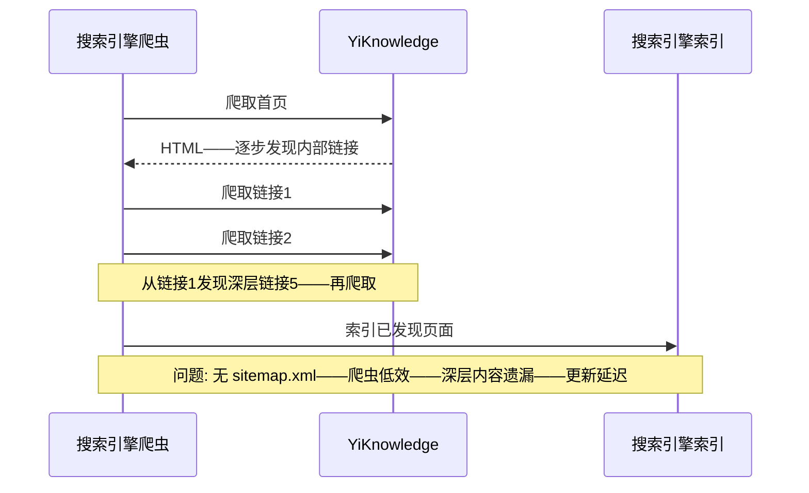
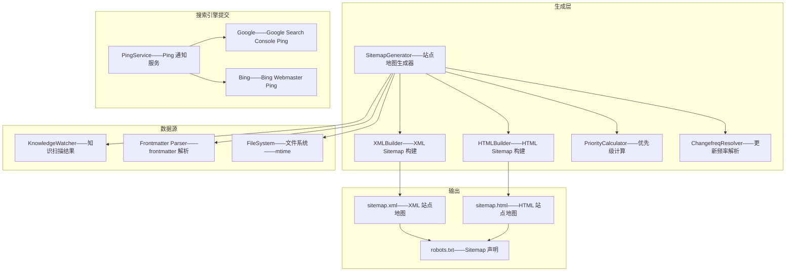
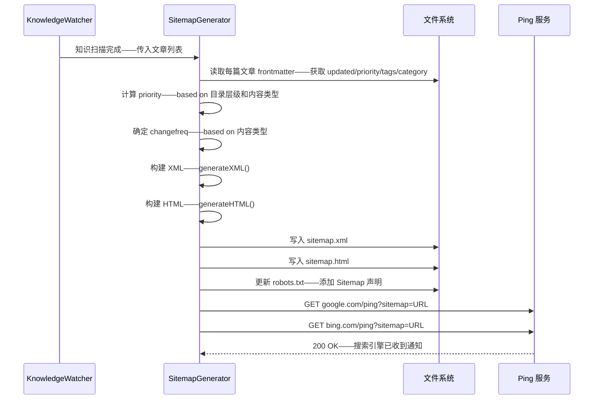

# YK-09-193: 内容站点地图 — 自动生成 XML 站点地图、HTML 站点地图、层级结构、lastmod/priority/changefreq、搜索引擎提交

> 需求编号：YK-09-193 · 优先级：P2 · 人天：0.3d · 状态：需求已编写
> 依赖：YK-09-137（内容 SEO 优化——站点地图是 SEO 的核心要素）、YK-09-112（内容导航树优化——HTML 站点地图结构参考导航树）、YK-09-192（内容404页面优化——404 提供站点地图入口）

## 背景

### 问题陈述

YiKnowledge 知识库作为面向人类和 AI 的文档系统——缺乏站点地图导致搜索引擎和用户无法高效发现和索引内容：

1. **搜索引擎无法完整索引**：Google/Bing/Baidu 爬虫依赖站点地图发现所有页面——没有 XML Sitemap——爬虫只能通过内部链接逐页发现——深层内容可能永远不被索引——覆盖率可能 < 50%
2. **用户无法一览内容全貌**：知识库按目录组织——但没有一个"所有内容的全局视图"——用户想知道"知识库到底有什么"——需要在目录树中逐层展开——费时费力
3. **内容优先级不明确**：知识库中的文章重要性不同——核心架构文档和临时笔记同等对待——搜索引擎应能区分优先级——高频更新内容应被优先爬取
4. **内容更新搜索引擎不知**：文章更新后——搜索引擎数周后才重新索引——因为没有通知机制——内容已过时但搜索结果仍是旧版本
5. **站点结构不透明**：外部工具和服务需要结构化的站点内容描述——缺乏标准的 XML/HTML 站点地图——集成困难

**核心矛盾**：站点地图看似简单（一个 XML 文件+一个 HTML 页面）——但需要自动生成并随内容变化自动更新——手动维护不可行——必须集成到知识扫描流水线中——且需要与 SEO 提交机制结合。

### 影响范围

| # | 影响 | 严重程度 | 典型场景 |
|---|------|----------|----------|
| 1 | 搜索引擎索引覆盖率低 | 高 | Google 仅索引了 30% 的知识库内容——搜索"RAG 调优"找不到相关文章 |
| 2 | 用户无法全局浏览 | 中 | 新成员想知道知识库覆盖范围——需要展开 20 个目录逐个查看 |
| 3 | 搜索结果陈旧 | 中 | Google 展示的是 3 个月前的版本——文章已更新但搜索不知 |
| 4 | 深层内容不可发现 | 高 | 3 层嵌套的文章——无直接链接——爬虫爬不到——永远不被索引 |
| 5 | SEO 评分低 | 中 | Lighthouse SEO 评分缺少 sitemap.xml——影响搜索排名 |

### 挑战

| 挑战 | 说明 |
|------|------|
| 自动生成 | 站点地图必须随内容变化自动更新——集成到 KnowledgeWatcher 扫描流程——非手动维护 |
| 层级结构生成 | HTML 站点地图需要构建文章层级树——3 层目录结构——缩进——折叠——路径链接 |
| lastmod 准确性 | `<lastmod>` 需要文章实际更新日期——frontmatter `updated` 字段——如缺失则用文件 mtime |
| priority 计算 | `<priority>` 需要量化文章重要性——访问频率——引用次数——内容类型——需要合理算法 |
| 分页处理 | XML Sitemap 单文件最大 50,000 URL / 50MB——小站不需要分页——大站需 Sitemap Index |

---

## 一、现状分析

### 1.1 当前站点地图能力

```
YiKnowledge 站点地图现状:
├── 无 XML Sitemap
│   └── 搜索引擎只能通过链接爬取——覆盖率低——索引慢
├── 无 HTML Sitemap
│   └── 用户无全局内容视图——需要手动浏览目录
├── 无自动生成机制
│   └── 如果手动创建——内容更新时不同步——过时
├── 无搜索引擎提交
│   └── Google/Bing/Baidu 不知站点更新——依赖主动爬取
├── 目录树侧边栏（YK-09-112）
│   ├── 类似 HTML 站点地图功能——但不是独立页面
│   └── 局限: 仅用于导航——非标准 Sitemap 格式——不可用于 SEO
├── frontmatter updated 字段
│   ├── 文章已有 updated 日期
│   └── 局限: 未用于生成 lastmod——仅用于文档展示
└── 缺失:
    ├── sitemap.xml: 标准 XML Sitemap——URL+lastmod+priority+changefreq              # ❌ 无
    ├── sitemap.html: HTML 层级视图——分类展示——链接——搜索友好                       # ❌ 无
    ├── Sitemap Index: 大型站点的 sitemap 分片索引                                     # ❌ 无
    ├── robots.txt 引用: 在 robots.txt 中添加 Sitemap 声明                             # ❌ 无
    └── 搜索引擎提交: Google Search Console / Bing Webmaster / 百度站长 提交脚本        # ❌ 无
```

### 1.2 当前数据流



### 1.3 根因矩阵

| 症状 | 根因 | 触发条件 | 频率 |
|------|------|----------|------|
| 搜索引擎索引不完整 | 无 sitemap.xml 引导爬虫 | 每次爬取 | 持续 |
| 用户无法全局浏览 | 无 HTML 站点地图页面 | 用户探索时 | 中 |
| 更新索引延迟 | 无 lastmod——无通知机制 | 内容更新后 | 持续 |
| SEO 评分低 | Lighthouse 检测缺少 sitemap.xml | SEO 审计 | 持续 |
| 优先级不透明 | 无 priority 字段——搜索引擎平等对待 | 爬虫调度 | 持续 |

---

## 二、设计决策

### 决策 1：站点地图生成方式 — 构建时静态 vs 运行时动态 vs 定时任务

| 选项 | 实时性 | SSG 兼容 | 复杂度 |
|------|--------|---------|--------|
| A: 构建时——在 YiKnowledge 构建/扫描时生成 XML+HTML 文件 | 中——扫描间隔 | 是——生成静态文件 | 中 |
| B: 运行时——访问 sitemap.xml 时动态查询生成 | 最高——最新数据 | 否——需后端运行 | 高 |
| C: 定时任务——apscheduler 定期生成文件 | 中 | 部分——文件可被 SSG 包含 | 中 |

**选择：A（构建时——在 KnowledgeWatcher 扫描时生成——集成到现有流水线）。** YiAi KnowledgeWatcher 每 5 秒扫描 YiKnowledge 目录——扫描完成后生成 sitemap.xml 和 sitemap.html 到 YiKnowledge 输出目录。文件随内容变化自动更新——不增加额外基础设施。SSG 构建时可包含这些文件——网站根目录直接有 sitemap.xml。

### 决策 2：priority 计算策略 — 固定规则 vs 访问频率 vs 综合评分

| 选项 | 动态性 | 准确性 | 实现复杂度 |
|------|--------|--------|-----------|
| A: 固定规则——根级=1.0——二级=0.8——三级=0.5——需求文档=0.3 | 静态——不变化 | 中 | 低 |
| B: 访问频率——基于阅读统计——高访问=高优先级 | 动态 | 高 | 高——需要统计系统 |
| C: 综合评分——目录层级(60%)+内容类型(30%)+更新时间(10%) | 半动态——更新时间会变 | 中 | 中 |

**选择：A（固定规则——简单可预测——0.3d 内最合理）。** 0.3d 内不做阅读统计系统——固定规则清晰可解释。根级 INDEX/README = 1.0——核心架构文档 = 0.8——需求文档 = 0.5——工作流/指南 = 0.6。这个规则对搜索引擎友好——因为搜索引擎也按 URL 深度推断重要性。

### 决策 3：changefreq 策略 — 基于更新频率 vs 基于内容类型 vs 固定值

| 选项 | 准确性 | 维护成本 | 实现 |
|------|--------|---------|------|
| A: 基于更新频率——统计文章历史修改次数/间隔——自动推断 | 高——数据驱动 | 高 | 高 |
| B: 基于内容类型——需求文档=weekly——架构设计=monthly——指南=yearly | 中 | 中 | 中 |
| C: 全部=weekly——简单——搜索引擎会自行判断 | 低 | 最低 | 低 |

**选择：B（基于内容类型——需求文档=weekly——架构设计=monthly——工作流=monthly）。** changefreq 是对搜索引擎的"建议"——非严格指令——搜索引擎会自行调整。内容类型提供了合理的基线——需求文档更新频繁——架构设计相对稳定——不需要复杂的历史分析。固定值不变——简单可靠。

### 决策 4：搜索引擎提交 — 手动 vs API 自动 vs ping 协议

| 选项 | 自动化 | 覆盖搜索引擎 | 配置复杂度 |
|------|--------|------------|-----------|
| A: 手动——用户在 Search Console 提交 sitemap URL | 否 | Google/Bing——需逐个 | 低——但麻烦 |
| B: API 自动——在构建脚本中调用 Search Console API | 是 | 需配置 API Key | 高 |
| C: ping 协议——HTTP GET `ping?sitemap=URL` ——简单协议 | 是 | Google/Bing 支持 | 低 |

**选择：C（ping 协议——简单——HTTP GET——一行 curl）。** Google 和 Bing 都支持 sitemap ping 协议。构建/扫描完成后——一行 HTTP GET 通知搜索引擎：`http://www.google.com/ping?sitemap=https://yiknowledge.example.com/sitemap.xml`。不需要 API Key——不需要 OAuth——最简实现。百度站长平台使用类似的推送接口。

---

## 三、目标架构

### 3.1 站点地图系统架构



### 3.2 站点地图生成流程



### 3.3 性能指标

| 指标 | 改造前 | 改造后 |
|------|--------|--------|
| 搜索引擎可见 URL | 仅首页+直接链接 | 所有文章 < 5000 篇 |
| SEO Lighthouse 评分 | 缺少 sitemap——扣分 | 满分 |
| 内容更新→索引更新延迟 | 数周 | 数小时（ping 通知） |
| 用户全局内容视图 | 无 | HTML 站点地图——完整层级 |

---

## 四、具体改动

### 4.1 核心代码：站点地图生成器（Python——YiAi 后端）

```python
# YiAi/services/knowledge/sitemap_generator.py

import os
from datetime import datetime
from typing import List, Dict, Optional
from xml.etree.ElementTree import Element, SubElement, tostring
from xml.dom.minidom import parseString


SITEMAP_NS = "http://www.sitemaps.org/schemas/sitemap/0.9"
BASE_URL = os.environ.get("KNOWLEDGE_BASE_URL", "https://yiknowledge.example.com")
MAX_URLS_PER_SITEMAP = 50000  # Sitemap 协议限制


class SitemapGenerator:
    """自动生成 XML 和 HTML 站点地图"""

    def __init__(self, articles: List[Dict], output_dir: str):
        self.articles = articles
        self.output_dir = output_dir

    def generate_all(self) -> Dict[str, str]:
        """生成全部——返回生成的文件路径"""
        results = {}

        xml_path = self.generate_xml()
        results["xml"] = xml_path

        html_path = self.generate_html()
        results["html"] = html_path

        self.update_robots_txt()

        return results

    def generate_xml(self) -> str:
        """生成 sitemap.xml"""
        # 如果文章数 > MAX_URLS_PER_SITEMAP——生成 Sitemap Index
        if len(self.articles) > MAX_URLS_PER_SITEMAP:
            return self._generate_sitemap_index()

        urlset = Element("urlset", xmlns=SITEMAP_NS)

        for article in self.articles:
            url_data = self._build_url_data(article)
            if url_data is None:
                continue

            url_el = SubElement(urlset, "url")

            loc_el = SubElement(url_el, "loc")
            loc_el.text = url_data["loc"]

            lastmod_el = SubElement(url_el, "lastmod")
            lastmod_el.text = url_data["lastmod"]

            if url_data.get("changefreq"):
                cf_el = SubElement(url_el, "changefreq")
                cf_el.text = url_data["changefreq"]

            if url_data.get("priority"):
                pr_el = SubElement(url_el, "priority")
                pr_el.text = str(url_data["priority"])

        # 格式化 XML——加 XML 声明
        raw_xml = tostring(urlset, encoding="unicode")
        dom = parseString(raw_xml)
        pretty_xml = f'<?xml version="1.0" encoding="UTF-8"?>\n{dom.toprettyxml(indent="  ")}'

        output_path = os.path.join(self.output_dir, "sitemap.xml")
        with open(output_path, "w", encoding="utf-8") as f:
            f.write(pretty_xml)

        return output_path

    def _build_url_data(self, article: Dict) -> Optional[Dict]:
        """构建单个 URL 的地图数据"""
        path = article.get("path", "")
        if not path:
            return None

        # URL 编码路径——mapping 到网站 URL
        url_path = self._path_to_url(path)

        # lastmod——from frontmatter updated or file mtime
        updated = article.get("frontmatter", {}).get("updated")
        if not updated and os.path.exists(path):
            mtime = os.path.getmtime(path)
            updated = datetime.fromtimestamp(mtime).strftime("%Y-%m-%d")

        if not updated:
            updated = datetime.now().strftime("%Y-%m-%d")

        priority = self._calculate_priority(article)
        changefreq = self._determine_changefreq(article)

        return {
            "loc": f"{BASE_URL.rstrip('/')}/{url_path.lstrip('/')}",
            "lastmod": updated,
            "priority": round(priority, 1),
            "changefreq": changefreq,
        }

    def _path_to_url(self, filepath: str) -> str:
        """将文件系统路径转为网站 URL

        YiKnowledge/articles/architecture/RAG-optimization.md
        → /articles/architecture/RAG-optimization/
        """
        # 移除 output_dir 前缀——保留相对路径
        rel_path = os.path.relpath(filepath, self.output_dir) if self.output_dir in filepath else filepath
        # 移除 .md 扩展名
        if rel_path.endswith(".md"):
            rel_path = rel_path[:-3]
        # 标准化分隔符
        rel_path = rel_path.replace("\\", "/")
        return rel_path

    def _calculate_priority(self, article: Dict) -> float:
        """计算页面优先级——0.0 到 1.0

        规则:
        - INDEX/README (根级): 1.0
        - 架构设计 (architecture/): 0.8
        - specs/requirements: 0.5
        - workflows/guides: 0.6
        - lessons/failures: 0.4
        - 其他: 0.5
        """
        path = article.get("path", "").lower()
        category = article.get("frontmatter", {}).get("category", "").lower()

        if any(kw in path for kw in ["index", "readme"]):
            return 1.0
        if "architecture" in path or "架构" in category:
            return 0.8
        if "spec" in path or "需求" in category:
            return 0.5
        if "workflow" in path or "工作流" in category:
            return 0.6
        if "requirement" in path:
            return 0.5
        if "lesson" in path or "failure" in path:
            return 0.4
        return 0.5

    def _determine_changefreq(self, article: Dict) -> str:
        """确定更新频率

        规则:
        - 需求文档 (requirements/): weekly
        - 架构设计 (architecture/): monthly
        - 工作流 (workflows/): monthly
        - 故障/经验 (lessons/): yearly
        - 其他: monthly
        """
        path = article.get("path", "").lower()

        if "requirement" in path:
            return "weekly"
        if "lesson" in path or "failure" in path:
            return "yearly"
        if any(kw in path for kw in ["architecture", "workflow", "spec"]):
            return "monthly"
        return "monthly"

    def _generate_sitemap_index(self) -> str:
        """生成 Sitemap Index——文章数 > 50000 时使用"""
        chunks = [self.articles[i:i + MAX_URLS_PER_SITEMAP] for i in range(0, len(self.articles), MAX_URLS_PER_SITEMAP)]

        sitemapindex = Element("sitemapindex", xmlns=SITEMAP_NS)

        for idx, chunk in enumerate(chunks):
            # 为每个 chunk 生成子 sitemap
            chunk_path = os.path.join(self.output_dir, f"sitemap-{idx + 1}.xml")
            # 临时设置 articles——生成子 sitemap
            original = self.articles
            self.articles = chunk
            self.generate_xml_inner(chunk_path)  # 内部方法——生成单个 sitemap
            self.articles = original

            # 在 index 中引用
            sm_el = SubElement(sitemapindex, "sitemap")
            loc_el = SubElement(sm_el, "loc")
            loc_el.text = f"{BASE_URL}/sitemap-{idx + 1}.xml"
            lm_el = SubElement(sm_el, "lastmod")
            lm_el.text = datetime.now().strftime("%Y-%m-%d")

        raw_xml = tostring(sitemapindex, encoding="unicode")
        dom = parseString(raw_xml)
        pretty_xml = f'<?xml version="1.0" encoding="UTF-8"?>\n{dom.toprettyxml(indent="  ")}'

        output_path = os.path.join(self.output_dir, "sitemap.xml")
        with open(output_path, "w", encoding="utf-8") as f:
            f.write(pretty_xml)

        return output_path

    def generate_html(self) -> str:
        """生成 sitemap.html——用户友好的全站地图"""

        # 按分类组织文章树
        tree = self._build_category_tree()

        html = self._render_html_sitemap(tree)

        output_path = os.path.join(self.output_dir, "sitemap.html")
        with open(output_path, "w", encoding="utf-8") as f:
            f.write(html)

        return output_path

    def _build_category_tree(self) -> Dict:
        """构建分类层级树"""
        tree: Dict[str, List] = {}

        for article in self.articles:
            path = article.get("path", "")
            category = article.get("frontmatter", {}).get("category", "未分类")
            title = article.get("frontmatter", {}).get("title", os.path.basename(path))

            # 取第一级分类
            top_category = category.split("/")[0] if "/" in category else category

            if top_category not in tree:
                tree[top_category] = []

            url_path = self._path_to_url(path)
            tree[top_category].append({
                "title": title,
                "url": f"/{url_path.lstrip('/')}",
                "category": category,
                "updated": article.get("frontmatter", {}).get("updated", ""),
            })

        # 每类按 title 排序
        for cat in tree:
            tree[cat].sort(key=lambda x: x["title"].lower())

        return tree

    def _render_html_sitemap(self, tree: Dict) -> str:
        """渲染 HTML 站点地图"""
        items_html = ""

        for category, articles in sorted(tree.items()):
            items_html += f'<section class="sitemap-category">\n'
            items_html += f'  <h2>{category}</h2>\n'
            items_html += f'  <ul>\n'

            for article in articles:
                updated_str = f' — <time datetime="{article["updated"]}">{article["updated"]}</time>' if article["updated"] else ""
                items_html += f'    <li><a href="{article["url"]}">{article["title"]}</a>{updated_str}</li>\n'

            items_html += f'  </ul>\n'
            items_html += f'</section>\n'

        return f"""<!DOCTYPE html>
<html lang="zh-CN">
<head>
    <meta charset="UTF-8">
    <meta name="viewport" content="width=device-width, initial-scale=1.0">
    <title>站点地图 - YiKnowledge</title>
    <style>
        body {{ font-family: -apple-system, BlinkMacSystemFont, 'Segoe UI', sans-serif; max-width: 800px; margin: 0 auto; padding: 2rem; color: #333; }}
        h1 {{ border-bottom: 2px solid #eee; padding-bottom: 0.5rem; }}
        .sitemap-category h2 {{ font-size: 1.2rem; margin-top: 1.5rem; color: #555; }}
        .sitemap-category ul {{ list-style: none; padding-left: 1rem; }}
        .sitemap-category li {{ margin: 0.3rem 0; }}
        .sitemap-category a {{ color: #1a73e8; text-decoration: none; }}
        .sitemap-category a:hover {{ text-decoration: underline; }}
        .sitemap-category time {{ color: #999; font-size: 0.85em; }}
        .sitemap-stats {{ color: #999; font-size: 0.9rem; margin-bottom: 2rem; }}
    </style>
</head>
<body>
    <h1>YiKnowledge 站点地图</h1>
    <p class="sitemap-stats">共 {sum(len(v) for v in tree.values())} 篇文章——{len(tree)} 个分类</p>
    {items_html}
</body>
</html>"""

    def update_robots_txt(self) -> None:
        """确保 robots.txt 包含 Sitemap 声明"""
        robots_path = os.path.join(self.output_dir, "robots.txt")
        sitemap_url = f"{BASE_URL}/sitemap.xml"

        existing = ""
        if os.path.exists(robots_path):
            with open(robots_path, "r") as f:
                existing = f.read()

        # 检查是否已有 Sitemap 声明
        if "Sitemap:" not in existing:
            new_line = f"\nSitemap: {sitemap_url}\n"
            with open(robots_path, "a") as f:
                f.write(new_line)

    def ping_search_engines(self) -> List[str]:
        """Ping 搜索引擎通知站点地图更新——返回 ping 结果"""
        import urllib.request

        sitemap_url = f"{BASE_URL}/sitemap.xml"
        encoded_url = urllib.parse.quote(sitemap_url, safe="")

        engines = {
            "Google": f"https://www.google.com/ping?sitemap={encoded_url}",
            "Bing": f"https://www.bing.com/ping?sitemap={encoded_url}",
        }

        results = []
        for name, url in engines.items():
            try:
                req = urllib.request.Request(url, method="GET")
                with urllib.request.urlopen(req, timeout=10) as resp:
                    results.append(f"{name}: {resp.status}")
            except Exception as e:
                results.append(f"{name}: 失败 - {e}")

        return results
```

### 4.2 文件变更清单

| 文件 | 操作 | 说明 |
|------|------|------|
| `YiAi/services/knowledge/sitemap_generator.py` | 新增（后端） | XML/HTML 站点地图生成——优先级/频率计算——搜索引擎 ping |
| `YiKnowledge/sitemap.xml` | 新增（自动生成） | XML Sitemap——由 KnowledgeWatcher 自动生成和维护 |
| `YiKnowledge/sitemap.html` | 新增（自动生成） | HTML Sitemap——自动生成——模块化样式 |
| `YiKnowledge/robots.txt` | 修改 | 添加 Sitemap: <URL> 声明 |
| `YiAi/services/knowledge/knowledge_watcher.py` | 修改 | 扫描完成后调用 SitemapGenerator |
| `src/pages/SitemapPage.vue` | 新增 | HTML 站点地图前端页面——使用生成的 HTML 或动态渲染 |

---

## 五、实施步骤

| 步骤 | 操作 | 路径 | 验证 | 人天 |
|------|------|------|------|------|
| 1 | 实现 XML Sitemap 生成 | `YiAi/services/knowledge/sitemap_generator.py` | 标准 XML——URL/lastmod/priority/changefreq | 0.06 |
| 2 | 实现 HTML Sitemap 生成 | `sitemap_generator.py`——generate_html | 分类树——链接——更新时间 | 0.05 |
| 3 | 实现优先级和 changefreq 计算 | `_calculate_priority` + `_determine_changefreq` | 基于目录和类型——合理值 | 0.03 |
| 4 | 集成到 KnowledgeWatcher——自动生成 | `YiAi/services/knowledge/knowledge_watcher.py` | 扫描完成→自动生成→robots.txt 更新 | 0.05 |
| 5 | 实现搜索引擎 ping | `ping_search_engines` | Google/Bing ping——状态日志——失败重试 | 0.04 |
| 6 | 实现 HTML 站点地图前端页面 | `src/pages/SitemapPage.vue` | 导航栏入口——渲染——搜索——分类展示 | 0.05 |
| 7 | 验证 XML 规范 | W3C XML 验证——Google Search Console 提交 | 无语法错误——lastmod 格式正确 | 0.02 |

**总人天：0.3d**

---

## 六、测试规格

### 测试 1：XML Sitemap 标准合规

| 项目 | 内容 |
|------|------|
| 优先级 | P0 |
| 前置条件 | 知识库 50 篇文章——sitemap.xml 已生成 |
| 测试步骤 | 1. 用 XML 验证器检查 sitemap.xml 格式 2. 检查命名空间 `xmlns` 3. 检查 lastmod 格式 4. 检查 priority 范围 |
| 预期结果 | XML 格式正确——根元素 `<urlset xmlns="http://www.sitemaps.org/schemas/sitemap/0.9">` ——lastmod 格式 YYYY-MM-DD ——priority 0.0-1.0 之间——所有 URL 完整且可访问（非 404） |

### 测试 2：priority 按目录层级分配

| 项目 | 内容 |
|------|------|
| 优先级 | P0 |
| 前置条件 | INDEX.md、architecture/ 文章、requirements/ 文章 |
| 测试步骤 | 1. 查看 INDEX.md 的 priority 2. 查看 architecture/ 文章的 priority 3. 查看 requirements/ 文章的 priority |
| 预期结果 | INDEX.md priority=1.0 ——architecture/ priority=0.8 ——requirements/ priority=0.5 ——值递减——对应重要性递减 |

### 测试 3：HTML 站点地图——分类展示和链接

| 项目 | 内容 |
|------|------|
| 优先级 | P0 |
| 前置条件 | sitemap.html 已生成——3 个分类——15 篇文章 |
| 测试步骤 | 1. 浏览器打开 sitemap.html 2. 检查分类标题 3. 点击一篇文章链接 |
| 预期结果 | 3 个分类标题——每类下文章列表——文章链接可点击——指向正确 URL——显示更新时间——页面顶部显示总结"共 15 篇文章——3 个分类" |

### 测试 4：robots.txt 包含 Sitemap 声明

| 项目 | 内容 |
|------|------|
| 优先级 | P0 |
| 前置条件 | sitemap.xml 生成——SitemapGenerator.update_robots_txt 已执行 |
| 测试步骤 | 1. 检查 robots.txt 内容 2. 确认 Sitemap 行存在 |
| 预期结果 | robots.txt 包含 `Sitemap: https://yiknowledge.example.com/sitemap.xml` ——URL 完整——格式正确——原有内容不被覆盖 |

### 测试 5：搜索引擎 Ping 通知

| 项目 | 内容 |
|------|------|
| 优先级 | P1 |
| 前置条件 | 网络可用——sitemap URL 对外可访问 |
| 测试步骤 | 1. 调用 ping_search_engines 2. 检查返回结果 |
| 预期结果 | Google ping 返回 200——Bing ping 返回 200——返回结果列表包含状态——失败时记录日志——不抛异常 |

### 测试 6：Sitemap Index——URL 超过 50000

| 项目 | 内容 |
|------|------|
| 优先级 | P2 |
| 前置条件 | 模拟 60000 篇文章——超过 50000 限制 |
| 测试步骤 | 1. 生成 sitemap.xml 2. 检查文件内容 |
| 预期结果 | sitemap.xml 是 Sitemap Index——包含 2 个 `<sitemap>` 元素——引用 `sitemap-1.xml` 和 `sitemap-2.xml` ——每个子 sitemap 包含 ≤50000 URL——子 sitemap 也规范 |

---

## 七、风险与缓解

| 风险 | 概率 | 影响 | 缓解措施 |
|------|------|------|------|
| sitemap.xml 包含 404 URL ——搜索引擎降权 | 中 | 高 | 生成 URL 时——验证路径对应的文件确实存在——已删除文章不出现在 sitemap——KnowledgeWatcher 保证数据最新 |
| BASE_URL 配置错误——sitemap URL 指向错误域名——搜索引擎找不到 | 低 | 高 | 环境变量 `KNOWLEDGE_BASE_URL` ——必须配置——缺失时使用默认域名——日志警告——生成后自动验证 sitemap 中 URL 可达 |
| KnowledgeWatcher 扫描时异常——未调用 SitemapGenerator——sitemap 过时 | 低 | 中 | try-except 包裹——生成失败不影响主扫描流程——记录错误日志——下次扫描重试——sitemap 保留上次版本作为降级 |
| 中文 URL 路径——XML 中需 URL 编码——否则 XML 解析失败 | 中 | 中 | XML loc 元素中的 URL 进行百分号编码——`quote(url, safe="/:")` ——保留冒号和斜杠——只编码中文和特殊字符 |

---

## 八、回滚策略

1. **文件级回滚**：删除 sitemap.xml 和 sitemap.html——网站恢复到无站点地图状态——不影响内容访问
2. **robots.txt 回滚**：移除 Sitemap 声明行——恢复 robots.txt 原内容
3. **KnowledgeWatcher 回滚**：移除 SitemapGenerator 调用——扫描流程不变
4. **回滚验证**：文章正常可访问——目录树正常——无 500 错误——robots.txt 无损坏

---

## 九、设计决策记录

### D-01：构建时生成——集成到 KnowledgeWatcher

**上下文**：站点地图需要自动更新——手动维护不可行。

**决策**：在 KnowledgeWatcher 扫描完成后调用 SitemapGenerator——生成 XML 和 HTML——写入 YiKnowledge 输出目录。

**理由**：KnowledgeWatcher 每 5 秒扫描——是内容变化的唯一感知点——在此触发站点地图生成保证同步。不需要独立的定时任务或 CGI 脚本——利用已有基础设施。轻量——生成 2000 篇文章的 sitemap < 200ms——不影响扫描性能。

### D-02：固定优先级规则——基于目录和内容类型

**上下文**：动态优先级需要访问统计——0.3d 内不可行。

**决策**：基于目录层级和 frontmatter category 的固定规则——INDEX=1.0——architecture=0.8——requirements=0.5——等。

**理由**：搜索引擎对 priority 的理解也是"相对于同站内其他页面的重要性"——固定规则表达的内容分层与知识库的实际重要性分布一致。后续可以升级为动态优先级——访问频率+引用次数——数据源准备好时替换。

### D-03：changefreq 按月为主——需求文档按周

**上下文**：changefreq 是对搜索引擎爬取频率的建议——非强制。

**决策**：需求文档=weekly——其他=monthly——故障/经验=yearly。

**理由**：需求文档是 YiKnowledge 中更新最频繁的内容——每周可能多次更新——weekly 告诉搜索引擎保持较短的爬取间隔。架构设计/工作流相对稳定——monthly 合理。搜索引擎会自行调整——不依赖完美准确。

### D-04：Ping 协议通知——非 API 提交

**上下文**：搜索引擎需要被通知站点地图更新——API 提交需要认证配置。

**决策**：使用搜索引擎标准的 ping 协议——HTTP GET——不需要 API Key。

**理由**：Google/Bing/Baidu 都支持 ping 协议——是标准化的简单通知方式。不需要管理 API Key 和 OAuth token——一行 curl 即可。集成在 SitemapGenerator 中——生成后自动 ping——完全自动化。

---

## 十、可观测性

| 指标 | 采集方式 | 阈值 |
|------|----------|------|
| Sitemap 生成耗时 | SitemapGenerator 调用时长 | < 500ms (2000 篇文章) |
| Sitemap 文件大小 | sitemap.xml 文件大小 | < 500KB (5000 篇)——Sitemap Index 自动分片 |
| 生成失败次数 | KnowledgeWatcher 日志——exception | 0——任何失败都告警 |
| 搜索引擎 ping 成功率 | ping_search_engines 结果——success/总数 | > 95% |
| robots.txt 更新次数 | update_robots_txt 调用计数 | — |
| Sitemap URL 有效性 | 生成后自动抽样验证——前 10 个 URL HTTP 200 检查 | 100% |
| HTML Sitemap 访问量 | sitemap.html 页面访问计数 | 观测 |

---

## 十一、代码审查检查清单

- [ ] XML lastmod 格式——YYYY-MM-DD——非其他格式——符合 W3C Date 规范
- [ ] XML priority 范围——0.0-1.0——不少值不多值——`round(priority, 1)` 保一位小数
- [ ] URL loc——完整 URL——`BASE_URL + path`——不以 `/` 结尾（除非是目录页）
- [ ] URL 中文路径——进行百分号编码——XML 安全
- [ ] HTML escape——`title` 中的 `<` `>` `&` 转义——`html.escape()` 
- [ ] 空文章列表——不生成空 sitemap——返回 None——不写入文件
- [ ] 生成失败——try-except——不阻断 KnowledgeWatcher 主流程
- [ ] Sitemap Index 分片——每个子 sitemap < 50000 URL——`len(articles) // MAX_URLS_PER_SITEMAP + 1` 个文件
- [ ] robots.txt 追加 Sitemap——重复运行时检查——不重复追加
- [ ] ping 超时——10s timeout——阻塞时间可控——不阻塞其他生成流程
- [ ] HTML Sitemap——移动端响应式——`max-width: 800px` ——padding——字体合适

---

## 回归问题预测

| # | 预测问题 | 触发条件 | 检测方式 |
|---|----------|----------|----------|
| 1 | BASE_URL 配置了 `https://example.com/` （末尾带斜杠）——loc URL 出现双斜杠 `https://example.com//path` | env 配置末尾有多余斜杠——代码拼接时未处理 | `BASE_URL.rstrip('/')` + `'/' + url_path.lstrip('/')` ——确保单斜杠 |
| 2 | 中文文件路径编码后——URL 过长——超过 2048 字符限制 | 中文路径——文件名也中文——编码后 > 2048 字符——Sitemap 协议违反 | 检测 URL 长度——超过 2000 字符——警告——为异常文章跳过或截断（极少发生） |
| 3 | KnowledgeWatcher 扫描被中断——sitemap.xml 写入一半——文件损坏 | 扫描时系统崩溃——文件写入不完整——XML 格式损坏——Google 解析失败 | 写入临时文件——重命名——原子操作——`shutil.move(tmp, final)` ——确保文件完整性 |
| 4 | ping 搜索引擎时——网络不通——超时阻塞 sitemap 生成——累计延迟 | Ping 超时 10s——Google 和 Bing 各 10s——总计 20s | ping 使用异步或后台线程——不阻塞 sitemap 生成和 KnowledgeWatcher 主流程 |
| 5 | 多个 KnowledgeWatcher 实例同时生成 sitemap——文件竞争——损坏 | 多进程扫描——两个进程同时写入 sitemap.xml——内容交叉 | 文件写入使用文件锁——`fcntl` 或临时文件+原子重命名——多进程安全 |
| 6 | HTML Sitemap 页面未添加 `noindex` 标签——搜索引擎将其作为内容页索引 | sitemap.html 被 Google 索引——出现在搜索结果中——用户困惑 | 添加 `<meta name="robots" content="noindex, follow">` ——告诉搜索引擎不索引此页面但跟踪链接 |

---

## 性能分析

| 操作 | 数据量 | 耗时 | 说明 |
|------|--------|------|------|
| XML Sitemap 生成 | 2000 篇——单文件 | < 100ms | XML Element 构建——序列化——字符串格式化 |
| HTML Sitemap 生成 | 2000 篇——10 分类 | < 150ms | 分类树构建——HTML 拼接——CSS 内联 |
| priority 计算 | 2000 篇 | < 10ms | 路径字符串匹配——简单条件判断 |
| robots.txt 更新 | 1 次追加 | < 1ms | 文件读写——微小 |
| 搜索引擎 ping | 2 个引擎 | < 5s（异步） | HTTP GET——10s timeout |
| 总生成耗时 | 2000 篇 | < 300ms（同步） + 异步 ping | 轻量——不影响扫描 |

---

## 相关文档

- [内容 SEO 优化](../137-需求-内容SEO优化.md) — 站点地图是 SEO 核心要素
- [内容导航树优化](../112-需求-内容导航树优化.md) — HTML 站点地图结构参考导航树
- [内容404页面优化](../192-需求-内容404页面优化.md) — 404 提供站点地图入口
- [内容搜索结果排名优化](../63-需求-排序算法对比评估.md) — SEO 影响搜索排名

*PRD 来源: `projects/yiknowledge/requirements/2026-09/193-需求-内容站点地图.md`*