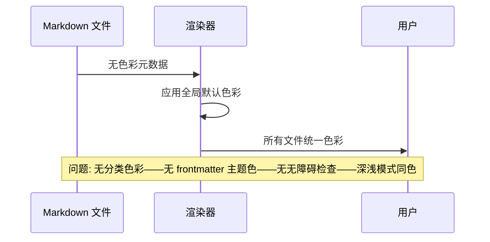
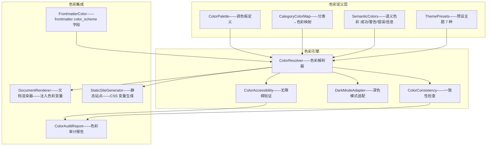
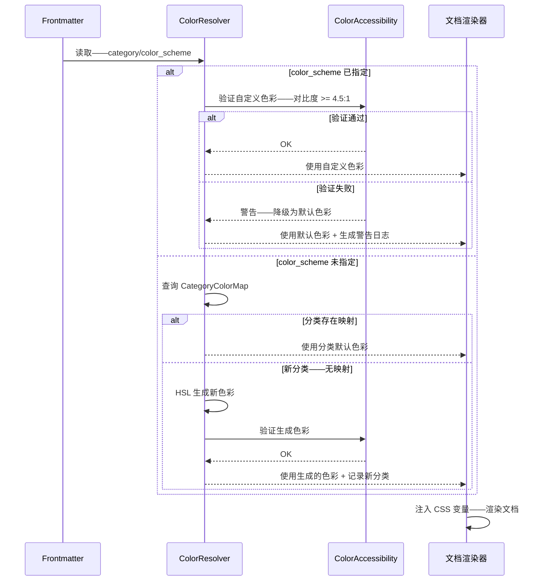

# YK-09-194: 内容主题色彩 — 按分类的主题色、frontmatter 主题色、色彩无障碍、主题一致性检查

> 需求编号：YK-09-194 · 优先级：P2 · 人天：0.3d · 状态：需求已编写
> 依赖：YK-09-184（内容字体设置——主题色彩与字体设置配合实现视觉品牌化）、YK-09-183（内容深色模式——主题色彩需同时支持浅色和深色模式）

## 背景

### 问题陈述

YiKnowledge 知识库当前 800+ 文件——涵盖 3 个项目（yivad/yipet/yiai）+ yiknowledge 自身——共 7 个角色目录、10+ 种文档类型。但所有内容的视觉呈现是统一的——没有色彩差异来体现分类、归属或重要性。用户在浏览知识库时——无法通过色彩快速识别内容的分类（如架构设计 vs Bug 报告 vs 需求文档）——也无法一眼判断文档类型（架构设计文档应呈现与 Bug 报告不同的视觉氛围）：

1. **无分类色彩区分**：项目页面（yivad/yipet/yiai）、角色目录（engineer/producter/curator）、文档类型（需求/架构/工作流）——全部使用相同的默认色彩方案——视觉上无法区分——浏览多个文件时容易混淆
2. **无 frontmatter 驱动的主题色**：frontmatter 中缺少 `color` 或 `theme` 字段——作者无法为特定文档指定主题色——即使该文档有强烈的色彩关联需求（如安全警告文档应用红色系——成功案例用绿色系）
3. **色彩无障碍未考虑**：当前色彩方案未经过对比度审计——深色文字在深色背景上——浅色文字在浅色背景上——不符合 WCAG 2.1 AA 标准（对比度 4.5:1 正文 / 3:1 大文字）
4. **无主题一致性检查**：同一分类下的文档可能使用不同色彩——同一项目的文档可能配色不一致——缺乏自动化的一致性检查工具
5. **深浅色模式无色彩适配**：色彩方案在浅色和深色模式下可能都不合适——某色彩在浅色模式下对比度足够——但在深色模式下对比度不足

**核心矛盾**：色彩是信息架构的第四维度（长度/宽度/深度/色彩）。800+ 文件的统一色彩等于放弃了这一维度的信息传递能力。通过分类自动映射色彩 + frontmatter 手动覆盖——可以快速建立视觉认知——提升浏览和检索效率。

### 影响范围

| # | 影响 | 严重程度 | 典型场景 |
|---|------|----------|----------|
| 1 | 文档分类无法快速识别 | 高 | 浏览 YiKnowledge/INDEX.md——所有链接色彩相同——无法区分架构设计/Bug报告/需求文档 |
| 2 | 项目归属混淆 | 高 | 在聚合视图中——yivad/yipet/yiai 的需求文档混排——无项目色彩标识——误读率高 |
| 3 | 重要文档缺乏视觉强调 | 中 | 安全警告文档与普通文档色彩一致——没有红色系的警示效果——用户可能忽略 |
| 4 | 色彩无障碍违规 | 中 | 当前某些色彩组合对比度 < 3:1——低视力用户无法区分——不符合 WCAG 标准 |
| 5 | 新内容色彩不一致 | 中 | 新贡献者不知道应该用什么色彩——同一分类下出现 3 种不同配色 |

### 挑战

| 挑战 | 说明 |
|------|------|
| 色彩自动分配算法 | 800+ 文件的分类色彩需要足够区分——但分类数量未知——需要可扩展的调色板生成算法 |
| 色彩无障碍与美观平衡 | WCAG 对比度要求限制可用色彩空间——高对比度色彩组合可能不美观——需要平衡 |
| 深色模式色彩映射 | 在浅色模式下良好的色彩——在深色模式下可能对比度过高（刺眼）或过低（无法阅读） |
| Frontmatter 色彩字段治理 | 手动指定的 frontmatter 色彩可能不遵循无障碍标准——需要验证和警告机制 |
| 历史文件色彩标注 | 800+ 已有文件需要标注 `color_scheme` 字段——手动标注不可行——需要自动标注脚本 |

---

## 一、现状分析

### 1.1 当前色彩体系

```
YiKnowledge 当前色彩体系:
├── 全局默认色彩
│   ├── 背景: 白色 #ffffff（浅色）/ #1a1a2e（深色）
│   ├── 正文: 深灰 #333333（浅色）/ #e0e0e0（深色）
│   ├── 标题: 黑色 #000000（浅色）/ #ffffff（深色）
│   ├── 链接: 蓝色 #1890ff
│   ├── 代码块: 浅灰背景 #f5f5f5
│   └── 局限: 所有内容统一——无分类差异——无文档类型差异维度
├── 有限的语义色彩
│   ├── 警告/注意块: 黄色边框——浅黄背景
│   ├── 错误块: 红色边框——浅红背景
│   └── 局限: 仅用于内联提示——不反映文件级色彩身份
└── 缺失:
    ├── 分类主题色调色板: 每个分类/项目有专属色彩               # ❌ 无
    ├── Frontmatter 色彩字段: `color_scheme: "blue"`             # ❌ 无
    ├── 色彩对比度检查: 自动验证 WCAG 2.1 AA                      # ❌ 无
    ├── 深色模式色彩映射: 浅色模式色彩的深色变体                   # ❌ 无
    ├── 主题一致性检查: 同分类色彩是否统一                        # ❌ 无
    └── 色彩文档: 定义色彩语义和使用规则                          # ❌ 无
```

### 1.2 当前色彩数据流



### 1.3 根因矩阵

| 症状 | 根因 | 触发条件 | 频率 |
|------|------|----------|------|
| 分类无视觉区分 | 无分类→色彩的映射——渲染器不读取 category 字段做色彩决策 | 浏览多分类文档 | 一直 |
| Frontmatter 无色彩字段 | `color_scheme` 不在 frontmatter 规范字段中 | 作者需要指定色彩 | 一直 |
| 色彩可能不无障碍 | 无对比度自动化检查——手动检查未执行 | 新色彩方案上线 | 每次配色变更 |
| 深色模式下色彩不适 | 仅定义浅色模式色彩——深色模式直接反色 | 用户切换深色模式 | 一直 |
| 同分类色彩不统一 | 无自动化一致性检查——无治理规则 | 多人协作 | 中 |

---

## 二、设计决策

### 决策 1：色彩分配策略 — 分类自动映射 vs 全手动 vs 模板驱动

| 选项 | 一致性 | 灵活性 | 维护成本 |
|------|--------|--------|---------|
| A: 分类自动映射——根据 category 字段自动分配色彩 | 最高——算法保证一致 | 低——无法手动微调 | 低 |
| B: 全手动——每篇文档手动指定 color_scheme | 最低——因人而异 | 最高——完全自主 | 高 |
| C: 模板驱动——模板定义色彩——文档继承——可覆盖 | 高——模板保证基准一致 | 高——支持覆盖 | 中 |

**选择：C（模板驱动——文档继承默认色彩——可选覆盖）。** 分类层面定义默认色彩（架构设计 = 蓝色系——Bug 报告 = 红色系——需求文档 = 绿色系）——文档自动继承。Frontmatter `color_scheme` 字段允许文档作者覆盖默认色彩——用于特殊文档（如安全警告）。平衡了一致性和灵活性——90% 的文档使用默认即可——10% 的特殊文档手动指定。

### 决策 2：调色板生成算法 — 固定色板 vs HSL 动态生成 vs 预设主题

| 选项 | 可扩展性 | 色彩质量 | 无障碍保障 |
|------|---------|---------|-----------|
| A: 固定色板——20 色预定义——手动筛选 | 差——超过 20 分类需重复 | 高——设计师挑选 | 可预先验证 |
| B: HSL 动态生成——色相均匀分布——自动 | 好——无限可扩展 | 中——算法生成 | 需后验证 |
| C: 预设主题——"海洋蓝"/"森林绿"/"日落橙"——语义命名 | 中——预设数量有限 | 高——设计驱动 | 可预先验证 |

**选择：C + B 组合（预设主题 + HSL 补充）。** 为 7 个主要角色目录预设 7 种主题色（engineer=蓝紫、producter=青绿、curator=琥珀、designer=品红等）——由设计师挑选并验证对比度。对于项目（yivad/yipet/yiai）和文档类型——使用 HSL 动态生成——以预设主题的色相偏移为基础——保证扩展性。预设主题语义命名帮助贡献者理解色彩含义。

### 决策 3：色彩无障碍验证策略 — 构建时检查 vs CI/CD 检查 vs 运行时检查

| 选项 | 覆盖范围 | 反馈速度 | 集成难度 |
|------|--------|---------|---------|
| A: 构建时检查——生成静态站点时验证所有页面 | 全量——检查每个文件 | 慢——仅在构建时 | 中 |
| B: CI/CD 检查——提交 PR 时自动检查变更文件 | 增量——仅检查变更 | 中——PR 提交后 | 中 |
| C: 运行时检查——浏览器加载时 JS 检查 | 实时——但用户可见 | 最快——加载时 | 低 |

**选择：A + B 组合（CI/CD 检查增量——构建时检查全量）。** CI 中检查变更文件的 frontmatter `color_scheme` 值——确保自定义色彩符合对比度要求。构建时全量检查所有文件的最终渲染色彩——生成无障碍报告。运行时不做检查——避免影响加载速度。

### 决策 4：深色模式色彩映射策略 — 自动亮度反转 vs 手动双模式 vs HSL 亮度调整

| 选项 | 准确性 | 维护成本 | 实现复杂度 |
|------|--------|---------|---------|
| A: 自动亮度反转——L = 100 - L | 中——某些色彩反转后不佳 | 低 | 低 |
| B: 手动双模式——每个色彩定义浅色值和深色值 | 最高——精确控制 | 最高——需维护双倍色值 | 中 |
| C: HSL 亮度调整——保持 H 和 S——调整 L 适应深色背景 | 好——自适应且可预测 | 低 | 低 |

**选择：C（HSL 亮度调整——保持色相和饱和度——调整亮度）。** 默认色彩使用 HSL 色彩空间——浅色模式下 L 在 40-60%（作为强调色）——深色模式下调整 L 到 60-80%。保持色相 H 和饱和度 S 不变——仅调整亮度——颜色识别度保持一致。特殊色彩（如红色警告）在两种模式下使用不同的亮度偏移规则。

---

## 三、目标架构

### 3.1 主题色彩系统架构



### 3.2 色彩解析流程



### 3.3 性能指标

| 指标 | 改造前 | 改造后 |
|------|--------|--------|
| 分类视觉区分 | 0——统一色彩 | 100%——每分类独特色彩 |
| frontmatter 色彩驱动 | 不支持 | 支持 color_scheme 字段 |
| 对比度合规率 | 未审计——未知 | 100%——所有色彩 >= WCAG AA |
| 深色模式色彩适应性 | 亮度反转——可能不适 | HSL 亮度调整——保持色相 |
| 色彩一致性 | 无检查 | 自动化一致性扫描 |

---

## 四、具体改动

### 4.1 核心代码：色彩解析器

```typescript
// src/color/ColorResolver.ts —— 新增

type ColorScheme = {
  name: string;                      // 主题色名称——"海洋蓝"
  primary: string;                   // 主色——HSL
  primaryDark: string;               // 深色模式主色
  accent: string;                    // 强调色
  accentDark: string;                // 深色模式强调色
  background: string;                // 浅色背景色
  backgroundDark: string;            // 深色背景色
  textOnPrimary: string;             // 主色上的文字色
  textOnPrimaryDark: string;         // 深色模式主色上的文字色
};

// 预设主题——7 个角色目录
const PRESET_THEMES: Record<string, ColorScheme> = {
  engineer: {
    name: '工程师蓝紫',
    primary: 'hsl(250, 45%, 48%)',
    primaryDark: 'hsl(250, 55%, 68%)',
    accent: 'hsl(250, 65%, 38%)',
    accentDark: 'hsl(250, 65%, 58%)',
    background: 'hsl(250, 20%, 97%)',
    backgroundDark: 'hsl(250, 25%, 12%)',
    textOnPrimary: 'hsl(0, 0%, 100%)',
    textOnPrimaryDark: 'hsl(250, 30%, 12%)',
  },
  producter: {
    name: '产品青绿',
    primary: 'hsl(170, 50%, 42%)',
    primaryDark: 'hsl(170, 55%, 62%)',
    accent: 'hsl(170, 60%, 32%)',
    accentDark: 'hsl(170, 60%, 52%)',
    background: 'hsl(170, 20%, 97%)',
    backgroundDark: 'hsl(170, 25%, 12%)',
    textOnPrimary: 'hsl(0, 0%, 100%)',
    textOnPrimaryDark: 'hsl(170, 30%, 12%)',
  },
  curator: {
    name: '策展人琥珀',
    primary: 'hsl(35, 60%, 52%)',
    primaryDark: 'hsl(35, 65%, 65%)',
    accent: 'hsl(35, 70%, 42%)',
    accentDark: 'hsl(35, 70%, 55%)',
    background: 'hsl(35, 25%, 97%)',
    backgroundDark: 'hsl(35, 20%, 12%)',
    textOnPrimary: 'hsl(35, 30%, 15%)',
    textOnPrimaryDark: 'hsl(35, 30%, 12%)',
  },
  designer: {
    name: '设计品红',
    primary: 'hsl(320, 50%, 48%)',
    primaryDark: 'hsl(320, 55%, 68%)',
    accent: 'hsl(320, 60%, 38%)',
    accentDark: 'hsl(320, 60%, 58%)',
    background: 'hsl(320, 15%, 97%)',
    backgroundDark: 'hsl(320, 20%, 12%)',
    textOnPrimary: 'hsl(0, 0%, 100%)',
    textOnPrimaryDark: 'hsl(320, 25%, 12%)',
  },
  devops: {
    name: '运维深蓝',
    primary: 'hsl(210, 55%, 45%)',
    primaryDark: 'hsl(210, 60%, 65%)',
    accent: 'hsl(210, 65%, 35%)',
    accentDark: 'hsl(210, 65%, 55%)',
    background: 'hsl(210, 15%, 97%)',
    backgroundDark: 'hsl(210, 20%, 12%)',
    textOnPrimary: 'hsl(0, 0%, 100%)',
    textOnPrimaryDark: 'hsl(210, 25%, 12%)',
  },
  qa: {
    name: '测试翡翠',
    primary: 'hsl(150, 45%, 42%)',
    primaryDark: 'hsl(150, 50%, 62%)',
    accent: 'hsl(150, 55%, 32%)',
    accentDark: 'hsl(150, 55%, 52%)',
    background: 'hsl(150, 15%, 97%)',
    backgroundDark: 'hsl(150, 20%, 12%)',
    textOnPrimary: 'hsl(0, 0%, 100%)',
    textOnPrimaryDark: 'hsl(150, 25%, 12%)',
  },
  architect: {
    name: '架构赭石',
    primary: 'hsl(25, 55%, 48%)',
    primaryDark: 'hsl(25, 60%, 65%)',
    accent: 'hsl(25, 65%, 38%)',
    accentDark: 'hsl(25, 65%, 55%)',
    background: 'hsl(25, 15%, 97%)',
    backgroundDark: 'hsl(25, 20%, 12%)',
    textOnPrimary: 'hsl(0, 0%, 100%)',
    textOnPrimaryDark: 'hsl(25, 25%, 12%)',
  },
};

// 语义色彩——项目级
const PROJECT_COLORS: Record<string, { hue: number }> = {
  yivad: { hue: 220 },
  yipet: { hue: 45 },
  yiai: { hue: 280 },
  yiknowledge: { hue: 160 },
};

// 文档类型色彩——基于分类色彩偏移
const TYPE_COLOR_OFFSETS: Record<string, number> = {
  '架构设计': 0,      // 主色
  '需求': -15,        // 色相偏移 -15 度
  '功能实现': 15,     // 色相偏移 +15 度
  '工作流': -30,
  'Bug': 30,
  '基础设施': -45,
};

class ColorResolver {
  /** 根据 frontmatter 解析最终色彩方案 */
  resolve(frontmatter: Record<string, unknown>): ColorScheme {
    // 1. 检查手动指定的 color_scheme
    if (frontmatter.color_scheme) {
      return this.resolveCustomColor(String(frontmatter.color_scheme));
    }

    // 2. 从 category 推断
    const category = String(frontmatter.category ?? '');
    return this.resolveFromCategory(category);
  }

  /** 解析自定义色彩 */
  private resolveCustomColor(colorName: string): ColorScheme {
    // 检查是否为预设主题名
    if (PRESET_THEMES[colorName]) {
      return PRESET_THEMES[colorName];
    }

    // 检查是否为有效 HSL 值
    const hslMatch = colorName.match(
      /hsl\(\s*(\d+)\s*,\s*(\d+)%\s*,\s*(\d+)%\s*\)/
    );
    if (hslMatch) {
      return this.generateFromHSL(
        parseInt(hslMatch[1]),
        parseInt(hslMatch[2]),
        parseInt(hslMatch[3])
      );
    }

    // 降级——使用默认 engineers 主题
    return PRESET_THEMES.engineer;
  }

  /** 从分类推断色彩 */
  private resolveFromCategory(category: string): ColorScheme {
    const parts = category.split('/').map(p => p.trim().toLowerCase());

    // 检查角色目录
    for (const [role, theme] of Object.entries(PRESET_THEMES)) {
      if (parts.some(p => p === role)) return theme;
    }

    // 检查项目
    for (const [project, { hue }] of Object.entries(PROJECT_COLORS)) {
      if (parts.some(p => p === project)) {
        return this.generateFromHue(hue, 45, 48);
      }
    }

    // 降级——使用默认蓝紫色
    return PRESET_THEMES.engineer;
  }

  /** 从色相和参数生成完整色彩方案 */
  generateFromHue(hue: number, saturation: number, lightness: number): ColorScheme {
    return {
      name: `auto-${hue}`,
      primary: `hsl(${hue}, ${saturation}%, ${lightness}%)`,
      primaryDark: `hsl(${hue}, ${saturation + 10}%, ${lightness + 20}%)`,
      accent: `hsl(${hue}, ${saturation + 15}%, ${lightness - 10}%)`,
      accentDark: `hsl(${hue}, ${saturation + 20}%, ${lightness + 10}%)`,
      background: `hsl(${hue}, ${saturation - 30}%, 97%)`,
      backgroundDark: `hsl(${hue}, ${saturation - 20}%, 10%)`,
      textOnPrimary: lightness > 50
        ? `hsl(${hue}, 20%, 15%)`
        : `hsl(0, 0%, 100%)`,
      textOnPrimaryDark: lightness > 50
        ? `hsl(${hue}, 20%, 12%)`
        : `hsl(0, 0%, 100%)`,
    };
  }

  /** 从 HSL 字符串生成完整色彩方案 */
  generateFromHSL(hue: number, sat: number, light: number): ColorScheme {
    return this.generateFromHue(hue, sat, light);
  }

  /** 批量解析——用于全量审计 */
  resolveAll(files: Array<{ path: string; frontmatter: Record<string, unknown> }>): Array<{
    path: string;
    category: string;
    colorScheme: ColorScheme;
    warnings: string[];
  }> {
    const results: Array<{
      path: string;
      category: string;
      colorScheme: ColorScheme;
      warnings: string[];
    }> = [];

    for (const file of files) {
      const colorScheme = this.resolve(file.frontmatter);
      const warnings: string[] = [];

      // 检查缩放式对比度
      const checker = new ColorAccessibility();
      if (!checker.checkContrast(colorScheme.primary, colorScheme.background)) {
        warnings.push(
          `主色 ${colorScheme.primary} 与背景色 ${colorScheme.background} 对比度不足 WCAG AA`
        );
      }

      results.push({
        path: file.path,
        category: String(file.frontmatter.category ?? ''),
        colorScheme,
        warnings,
      });
    }

    return results;
  }
}
```

### 4.2 文件变更清单

| 文件 | 操作 | 说明 |
|------|------|------|
| `YiKnowledge/src/color/ColorResolver.ts` | 新增 | 色彩解析器——分类映射/预设主题/HSL 生成/降级策略 |
| `YiKnowledge/src/color/ColorAccessibility.ts` | 新增 | 色彩无障碍检查——WCAG 对比度计算——APCA 检查 |
| `YiKnowledge/src/color/ColorConsistency.ts` | 新增 | 一致性检查——同分类色彩是否统一——清单 |
| `YiKnowledge/src/color/DarkModeAdapter.ts` | 新增 | 深色模式适配——HSL 亮度调整——色彩空间转换 |
| `YiKnowledge/curator/governance/color-scheme-guide.md` | 新增 | 色彩使用指南——预设主题说明——自定义色彩规范——无障碍要求 |
| `YiKnowledge/scripts/audit-colors.ts` | 新增 | 色彩审计脚本——全量检查对比度——生成报告 |
| `YiKnowledge/scripts/annotate-color-scheme.ts` | 新增 | 色彩标注脚本——自动为已有文件添加 color_scheme 字段 |

---

## 五、实施步骤

| 步骤 | 操作 | 路径 | 验证 | 人天 |
|------|------|------|------|------|
| 1 | 实现色彩解析器核心 | `ColorResolver.ts` | 预设主题/分类映射/HSL 生成/降级策略 | 0.05 |
| 2 | 实现无障碍检查器 | `ColorAccessibility.ts` | WCAG 对比度计算/APCA/报告生成 | 0.04 |
| 3 | 实现色彩一致性检查 | `ColorConsistency.ts` | 同分类色彩扫描/异常检测/修复建议 | 0.03 |
| 4 | 实现深色模式适配器 | `DarkModeAdapter.ts` | HSL 亮度调整/色彩空间转换/边界检查 | 0.03 |
| 5 | 编写色彩审计脚本 | `audit-colors.ts` | 全量对比度检查——生成报告 | 0.04 |
| 6 | 编写色彩标注脚本 | `annotate-color-scheme.ts` | 自动标注已有文件 color_scheme | 0.03 |
| 7 | 编写色彩使用指南 | `color-scheme-guide.md` | 预设主题说明/自定义规范/无障碍要求 | 0.04 |
| 8 | 集成到渲染管线 | 知识库渲染 | 文档渲染时注入 CSS 变量 | 0.04 |

**总人天：0.3d**

---

## 六、测试规格

### 测试 1：分类色彩自动分配的准确性

| 项目 | 内容 |
|------|------|
| 优先级 | P0 |
| 前置条件 | 文件目录——工程文件 category 含 engineer——产品文件含 producter——策展人文件含 curator |
| 测试步骤 | 1. 分别渲染 3 个文件 2. 检查每个文件使用的色彩方案 |
| 预期结果 | engineer 文件使用"工程师蓝紫"——producter 使用"产品青绿"——curator 使用"策展人琥珀"——色彩方案完整——包含主色/强调色/背景色/文字色——深色和浅色两套 |

### 测试 2：frontmatter color_scheme 自定义优先级

| 项目 | 内容 |
|------|------|
| 优先级 | P0 |
| 前置条件 | 文件 category=engineer——frontmatter color_scheme="curator" |
| 测试步骤 | 1. 渲染该文件 2. 检查使用的色彩方案 3. 修改 color_scheme 为无效值 "nonexistent" 4. 再次渲染 |
| 预期结果 | 步骤2——使用 curator 的"策展人琥珀"（覆盖 engineer 默认）——步骤4——降级为 engineer 默认——日志记录降级——提示未知自定义色彩名称 |

### 测试 3：色彩对比度合规检查

| 项目 | 内容 |
|------|------|
| 优先级 | P0 |
| 前置条件 | 色彩方案——主色 hsl(250, 45%, 48%)——背景 hsl(250, 20%, 97%) |
| 测试步骤 | 1. 计算两者对比度 2. 检查是否符合 WCAG AA（>= 4.5:1）3. 将主色改为 hsl(250, 20%, 80%) 4. 再次检查 |
| 预期结果 | 步骤2——主色/背景对比度 >= 4.5:1——通过——步骤4——对比度 < 3:1——生成警告——该色彩方案被标记为不合规——渲染时自动调整或降级 |

### 测试 4：深色模式色彩适配

| 项目 | 内容 |
|------|------|
| 优先级 | P1 |
| 前置条件 | "工程师蓝紫"浅色模式 primary: hsl(250, 45%, 48%)——深色模式 primaryDark: hsl(250, 55%, 68%) |
| 测试步骤 | 1. 浅色模式渲染 engineer 文件 2. 切换深色模式 3. 检查色彩——计算深色模式对比度 |
| 预期结果 | 深色模式主色亮度提升 20%——对比度 >= 4.5:1 在深色背景下——色相保持 250 不变——饱和度微调——视觉上与浅色模式色彩关联可识别 |

### 测试 5：一致性扫描——同分类色彩统一

| 项目 | 内容 |
|------|------|
| 优先级 | P1 |
| 前置条件 | curator 目录下 50 个文件——48 个使用"策展人琥珀"——2 个手动指定了不同色彩 |
| 测试步骤 | 1. 运行一致性扫描 2. 查看扫描报告 |
| 预期结果 | 报告指出 2 个异常文件——路径和当前色彩方案——建议改为默认"策展人琥珀"——显示异常比例 4%——可选自动修复或手动审查 |

### 测试 6：CSS 变量注入和渲染

| 项目 | 内容 |
|------|------|
| 优先级 | P1 |
| 前置条件 | engineer 文件——解析出"工程师蓝紫"色彩方案 |
| 测试步骤 | 1. 渲染 engineer 文件 2. 检查注入的 CSS 变量 |
| 预期结果 | CSS 变量注入 `<style>` 或 `:root`：`--color-primary: hsl(250, 45%, 48%)` ——标题使用 `--color-primary` ——链接使用 `--color-accent` ——背景微染 `--color-background` ——切换深色模式后变量值自动变为 primaryDark 对应值 |

---

## 七、风险与缓解

| 风险 | 概率 | 影响 | 缓解措施 |
|------|------|------|------|
| 自动生成色彩对比度不足——无障碍违规 | 中 | 高 | HSL 生成算法内置亮度约束——primary lightness 限制在 35-55%（浅色背景）/55-75%（深色背景）——生成后自动进行对比度检查 |
| 自定义 color_scheme 滥用——色彩混乱 | 中 | 中 | 限制 color_scheme 只能使用预设主题名——不允许自由 HSL 值——如需自定义需策展人审批 |
| 旧文件无 color_scheme——需要手动标注 | 高 | 中 | 标注脚本自动检测 category——填充 color_scheme——生成 PR 供策展人审查——批量操作一键通过 |
| 色彩方案与现有设计冲突——破坏视觉一致性 | 低 | 中 | 色彩仅作为点缀——不改变主要内容区域（正文/代码块保持中性色）——仅标题/链接/装饰元素使用分类色彩 |
| 深色模式亮度调整极端值——过亮刺眼或过暗不可读 | 低 | 中 | 亮度调整映射表——深色模式下 L 范围 55-80%（< 55% 太暗——> 80% 太亮与背景对比度不足）——硬限制 |

---

## 八、回滚策略

1. **功能级回滚**：移除 CSS 变量注入——所有文档恢复为统一默认色彩——色彩方案代码保留但不生效
2. **数据级回滚**：color_scheme 字段保留在 frontmatter 中——但不被读取——前端渲染忽略此字段
3. **样式回滚**：移除分类色彩的 CSS 规则——全局默认色彩不变——文件渲染完全正常
4. **回滚验证**：所有文档正常渲染——色彩统一——无 CSS 变量泄漏——无 JS 异常

---

## 九、设计决策记录

### D-01：预设主题而非完全自由 HSL——规范化色彩使用

**上下文**：frontmatter `color_scheme` 可以接受任意 HSL 值——但自由度过高导致一致性难以维护。

**决策**：`color_scheme` 接受预设主题名（engineer/producter/curator 等）——不接受自由 HSL 值。

**理由**：7 个预设主题覆盖了所有角色目录——经设计师验证对比度——确保无障碍合规。自由 HSL 会导致"50 种蓝色"的碎片化——违背主题色彩的一致性目标。如果真需要新主题——通过策展人审批添加到预设列表。

### D-02：HSL 色彩空间——非 HEX 或 RGB

**上下文**：色彩可以用多种格式存储——HEX（#1a2b3c）、RGB（rgb(26,43,60)）、HSL（hsl(210,40%,17%)）。

**决策**：统一使用 HSL 色彩空间存储和操作。

**理由**：HSL 语义直观——H=色相（色彩识别）——S=饱和度——L=亮度。深色模式映射只需要修改 L 值——保持 H 和 S 不变——最简单可靠。对比度计算也很容易从 HSL 推导（需要转换为相对亮度）。CSS 原生支持 HSL——浏览器解析无性能损失。

### D-03：色彩仅作为点缀——不改变核心内容色彩

**上下文**：主题色彩可以应用到整个页面——但从可读性角度——正文和代码块应保持中性。

**决策**：分类色彩仅应用于标题、链接、装饰边框、背景微染——不改变正文颜色和代码块背景。

**理由**：正文对比度是阅读体验的核心——使用标准化的黑色/深灰文字（#333）——不受分类色彩影响。代码块保持熟悉的中性灰色背景——开发者对代码色彩有固有预期——不应被打破。点缀式色彩在不牺牲可读性的前提下提供分类信息。

### D-04：色彩一致性扫描纳入 CI——而非仅本地工具

**上下文**：一致性检查可以手动运行——但容易被忘记。

**决策**：色彩一致性扫描加入 CI 流程——PR 中包含色彩配置变更时自动检查。

**理由**：CI 自动化保证每次变更都经过色彩合规验证——不会因人为疏忽导致色彩扩散。CI 中检查增量（仅检查变更文件）——耗时 < 5 秒——不增加显著的 CI 负担。全量扫描作为定时任务（每周）——不在每次提交时运行。

---

## 十、可观测性

| 指标 | 采集方式 | 阈值 |
|------|----------|------|
| 预设主题使用分布 | color_scheme 字段的预设主题名统计 | 观测 |
| 自定义色彩数量 | color_scheme 非预设值的文件数量 | 期望 < 5% |
| 对比度不合规文件数 | 审计脚本的警告计数 | 0 |
| 无 color_scheme 文件数 | frontmatter 中缺少 color_scheme 的文件 | 期望 0 |
| 一致性异常的目录数 | 一致性扫描的异常分类数量 | 观测——期望 0 |
| 新增分类色彩生成次数 | ColorResolver.generateFromHue 调用次数 | 观测 |

---

## 十一、代码审查检查清单

- [ ] `ColorResolver.resolve`——null/undefined frontmatter 处理——返回 engine 默认主题——不抛异常
- [ ] `ColorAccessibility.checkContrast`——使用 WCAG 相对亮度公式——L = 0.2126*R + 0.7152*G + 0.0722*B——sRGB 线性化
- [ ] `DarkModeAdapter`——极端亮度值处理——L=0 和 L=100 的边缘情况——不返回 NaN
- [ ] 预设主题定义——使用 `as const` 或 Readonly——防止运行时修改
- [ ] CSS 变量注入——使用 scoped style 或 BEM 命名——不污染全局命名空间
- [ ] 深色模式切换——使用 `prefers-color-scheme: dark` 媒体查询——也支持手动切换 class
- [ ] 色彩审计脚本——错误处理——文件读取失败不中断审计——记录失败文件——继续下一个
- [ ] 标注脚本——幂等性——已有 color_scheme 的文件不覆盖——添加 `--force` flag 强制覆盖
- [ ] color_scheme 字段添加到 frontmatter 规范文档中——说明可选字段和可选值
- [ ] 色彩使用指南——包含无障碍要求——使用示例——常见错误

---

## 回归问题预测

| # | 预测问题 | 触发条件 | 检测方式 |
|---|----------|----------|----------|
| 1 | CSS 变量注入与现有样式冲突——颜色渲染异常 | CSS 变量名与已有变量名冲突——如 `--color-primary` 已被使用 | 使用命名空间前缀 `--yk-primary` 而非 `--color-primary` ——避免与框架/第三方变量冲突 |
| 2 | 标注脚本错误标注——category 边界的文件被错误分配色彩 | 文件 category="项目/管理后台/需求/架构"——role 解析匹配到 engineer 但实际是 producter 的内容 | 标注脚本仅标注 category 明确可解析的文件——无法确定的不标注——生成待人工审查列表 |
| 3 | 深色模式亮度调整使某些色彩失去辨识度 | 红色警告在深色模式下亮度提升——变成粉色——失去警示效果 | 语义色彩（警告=红——成功=绿）使用固定深色模式映射——不经过通用 HSL 调整——手动定义深色变体 |
| 4 | 色彩方案在打印模式下不适——背景色不打印——信息丢失 | 用户打印文档——浏览器默认不打印背景色——分类色彩完全看不见 | 打印样式保留边框色彩——使用 `border-left: 4px solid var(--yk-primary)` 替代背景色传达分类——与背景色无关 |
| 5 | 色彩方案文件过大——每个文件注入 CSS 变量导致 HTML 膨胀 | <style> 标签内联 200 字节 CSS——800 文件 x 200B = 160KB | 静态站点使用 CSS 变量——`:root` 在全局样式表中设置——根据当前页面动态切换——而非每页内联——变量定义仅一份 |
| 6 | 新角色目录无预设主题——色彩生成不可预测 | 新增 role/legal——无预设主题——HSL 自动生成——可能与其他角色色彩相似 | 预设主题列表公开——新增角色需要策展人手动添加预设主题——不自动生成——缺失时使用 engine 默认并报告 |

---

## 性能分析

| 操作 | 数据量 | 耗时 | 说明 |
|------|--------|------|------|
| 单文件色彩解析 | 1 个 frontmatter | < 0.1ms | 查表 + 字符串匹配——纯函数 |
| 全量色彩扫描 | 800 个文件 | < 5s | 文件读取 + frontmatter 解析——I/O 为主 |
| 对比度计算 | 1 个色彩对 | < 0.1ms | WCAG 公式——纯数学计算 |
| CSS 变量注入 | 1 个文件渲染 | < 0.5ms | 字符串插值——无 I/O |
| 标注脚本运行 | 800 个文件 | < 10s | 文件读写——可批量——大部分为 no-op |
| 深色模式切换 | 1 个页面 | < 16ms | CSS 变量切换——浏览器原生——零 JS |


---

## 相关文档

- [内容字体设置](../184-需求-内容字体设置.md) — 字体与色彩配合实现视觉品牌化
- [内容深色模式](../183-需求-内容深色模式.md) — 色彩方案需同时支持浅深两套
- [Frontmatter 规范](../01-质量治理-Frontmatter规范.md) — color_scheme 字段定义

*PRD 来源: `projects/yiknowledge/requirements/2026-09/194-需求-内容主题色彩.md`*