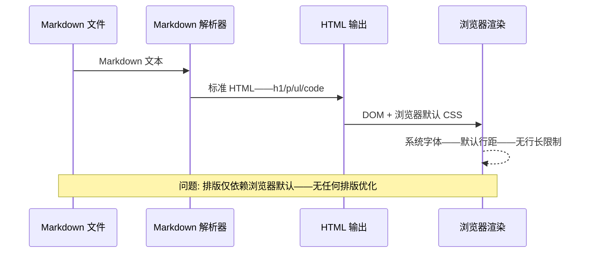
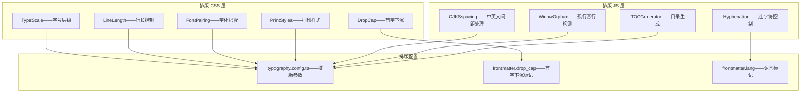
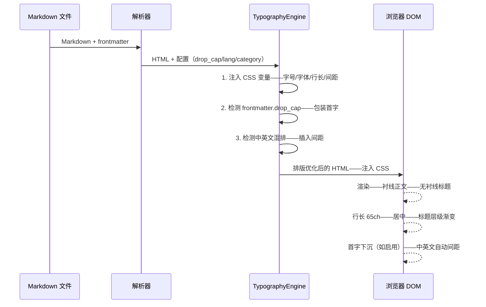

# YK-09-195: 内容排版优化 — 字体搭配、标题层级、行长控制、孤行预防、连字符、首字下沉

> 需求编号：YK-09-195 · 优先级：P2 · 人天：0.3d · 状态：需求已编写
> 依赖：YK-09-184（内容字体设置——排版优化基于已有的字体设置锦上添花）、YK-09-194（内容主题色彩——排版优化与主题色彩协同实现视觉品牌化）

## 背景

### 问题陈述

YiKnowledge 知识库作为人类和 AI 共享的知识源——其内容阅读体验直接影响知识传递效率。当前排版仅依赖 Markdown 转 HTML 的浏览器默认样式——存在大量专业排版中的常见问题——影响长文阅读的舒适度和专业性：

1. **字体搭配缺失**：正文和标题使用相同的系统字体——缺少正文字体（阅读舒适）与标题字体（视觉区分）的差异化搭配——所有文字看起来"一样"
2. **标题层级视觉区分不足**：H1/H2/H3/H4 仅有字号差异——缺少字重、字间距、上下边距的层级渐变——视觉层级不清晰——读者难以快速浏览文章结构
3. **行长过长——阅读疲劳**：在宽屏显示器上——正文行长达 120+ 个字符——远超最佳可读范围（45-75 字符/行）——眼球横向移动距离大——容易串行——阅读疲劳加速
4. **孤行和寡行**：段落最后一行只有一个单词（寡行）——或标题在页面/容器底部而内容在下一页（孤行）——视觉上不协调——影响页面排版的紧凑感和专业度
5. **中文英文混排间距问题**：中文和英文/数字之间缺少适当间距（约 1/4 em）——中英文紧贴在一起——如"使用Python3.10开发"——视觉上文字粘连——不符合中文排版规范
6. **首字下沉缺失**：重要文章（如序言、开篇）的首段落缺少首字下沉（Drop Cap）——无法营造正式、专业的阅读氛围

**核心矛盾**：Markdown 的设计目标是"易写"——但"易读"需要额外的排版优化。浏览器默认样式提供了基础可读性——但距离专业排版（如印刷书籍、高质量技术博客）还有显著差距。这个差距可以通过纯 CSS 排版优化来弥合——不需要改变 Markdown 内容——实现低成本的阅读体验飞跃。

### 影响范围

| # | 影响 | 严重程度 | 典型场景 |
|---|------|----------|----------|
| 1 | 长文阅读疲劳 | 高 | 一份 3000 字的需求文档——在 27 寸显示器上行长 150 字符——阅读 10 分钟即感疲劳 |
| 2 | 文章结构难扫读 | 高 | 标题层级不清——读者无法通过浏览标题快速判断文章结构——需要逐段阅读 |
| 3 | 中英文混排不美观 | 高 | "使用 Vue3.5 和 TypeScript5.x 开发"——中文和英文/数字之间无间距——文字粘连 |
| 4 | 段落排版不专业 | 中 | 段落最后一行孤立的单词——标题与其后内容被页面/容器分割——排版不协调 |
| 5 | 宽屏阅读效率低 | 中 | 16:9 显示器全屏阅读——行长过长——用户不得不手动调整窗口宽度 |
| 6 | 首段缺乏视觉引导 | 中 | 重要文章的首段与其他段落无区别——缺少进入阅读的视觉锚点 |

### 挑战

| 挑战 | 说明 |
|------|------|
| 中英文混排间距自动化 | 自动在中文和英文/数字之间插入间距——需要正确处理边界情况——如中文标点和英文之间不需要间距——URL 中的中英文不需要间距 |
| 跨浏览器兼容 | 不同浏览器对 CSS 排版属性的支持程度不同——`text-wrap: pretty` 仅 Chrome 支持——需要渐进增强策略 |
| 响应式行长控制 | 不同屏幕尺寸下行长控制策略不同——移动端（< 768px）不能限制过短——桌面端限制在 65ch 左右 |
| 连字符对中文的影响 | 中文不使用连字符——`hyphens: auto` 仅对英文生效——但需要声明 `lang` 属性——混合文章中英文判断 |
| 孤行预防的跨容器边界 | 孤行预防在分页打印和连续滚动场景下策略不同——打印时需要基于页面——滚动时需要基于容器 |

---

## 一、现状分析

### 1.1 当前排版渲染

```
YiKnowledge 当前排版现状:
├── Markdown → HTML 默认渲染
│   ├── 标题 h1-h6——浏览器默认字号和边距
│   └── 局限: 仅字号差异——无层级渐变——无字体区分
├── 正文排版
│   ├── 默认字体: 系统 sans-serif（macOS: SF Pro——Windows: Segoe UI）
│   ├── 行高: 浏览器默认——约 1.2（过于紧凑）
│   └── 局限: 行高不足——行长无限制——无中英文间距
├── 列表和引用
│   ├── 浏览器默认 indent 和 bullet 样式
│   └── 局限: 无定制——无视觉优化
└── 缺失:
    ├── 字体搭配: 正文字体 vs 标题字体——差异化                         # ❌ 无
    ├── 标题层级渐变: 字重/字间距/边距的层级变化                        # ❌ 无
    ├── 行长控制: max-width: 65ch——居中——两侧留白                      # ❌ 无
    ├── 孤行/寡行预防: text-wrap: pretty / orphans / widows            # ❌ 无
    ├── 中英文间距: 自动插入 1/4 em 间距                                 # ❌ 无
    ├── 连字符: 英文断字 hyphens: auto                                 # ❌ 无
    └── 首字下沉: Drop Cap——首字母/首字放大                             # ❌ 无
```

### 1.2 当前渲染流程



### 1.3 根因矩阵

| 症状 | 根因 | 触发条件 | 频率 |
|------|------|----------|------|
| 行长过长 | 无 max-width 限制——内容填满容器宽度 | 宽屏显示器——全屏阅读 | 一直 |
| 标题层级不清 | H1-H4 字号差异不足以表达层级——H3 和 H4 几乎一样大 | 文章有 3+ 级标题 | 高 |
| 中英文粘连 | 无自动间距插入——纯 CSS 无中英文识别 | 文章含中英文混排 | 一直 |
| 孤行寡行 | 浏览器不自动处理——无 orphans/widows CSS | 段落最后一行短——标题在容器底部 | 中 |
| 阅读疲劳 | 行长 + 行高 + 字体——组合导致的长时间阅读不适 | 3000+ 字长文 | 高 |
| 首段无引导 | 无 Drop Cap——所有段落外观一致 | 序言/开篇文章 | 低 |

---

## 二、设计决策

### 决策 1：行长控制策略 — 固定 max-width vs 响应式 vs 多列布局

| 选项 | 阅读体验 | 空间利用 | 实现复杂度 |
|------|---------|---------|-----------|
| A: 固定 max-width——65ch——居中——两侧留白 | 最好——最佳行长 | 差——大屏浪费空间 | 低 |
| B: 响应式——根据屏幕宽度调整 max-width——留白比例 | 好——适应各种屏幕 | 中 | 低 |
| C: 多列布局——类似报纸分栏 | 中——需眼球跳转 | 好——充分利用空间 | 中 |

**选择：A（固定 65ch——居中——两侧留白）。** 印刷排版研究确定最佳英文字行长 45-75 字符（ch）——中文字行长 25-40 个汉字。65ch 是英文字符数（约 33 个汉字）——落入最佳区间——提供最舒适的阅读体验。大屏左侧留白可以放置目录（TOC）——化浪费为功能。移动端（< 768px）使用 `max-width: 100%` ——不限制——因为屏幕本已狭窄。

### 决策 2：字体搭配方案 — 衬线正文 + 无衬线标题 vs 全无衬线 vs 混合

| 选项 | 现代感 | 可读性 | 品牌感 |
|------|--------|--------|--------|
| A: 衬线正文（思源宋体/Georgia）+ 无衬线标题（思源黑体/Inter） | 中——经典感 | 最好——衬线字体引导视线流动 | 高——差异化强 |
| B: 全无衬线——正文和标题都用无衬线 | 最高——简约现代 | 好——屏幕阅读 OK | 中——变化少 |
| C: 混合——正文无衬线——标题衬线（反转 A） | 中 | 中——标题衬线辨识度低 | 中 |

**选择：A（衬线正文 + 无衬线标题——经典搭配）。** 大量的排版研究显示——衬线字体在长文阅读中引导视线更有效（衬线形成视觉水平线）——减少串行。无衬线标题简洁有力——视觉层级清晰。中文使用思源宋体（Source Han Serif/Noto Serif CJK）作为正文字体——思源黑体作为标题字体——免费开源——Google Fonts 提供 CDN 加载。

### 决策 3：中英文间距策略 — JavaScript 后处理 vs CSS `text-spacing` vs 预处理

| 选项 | 准确性 | 性能 | 侵入性 |
|------|--------|------|--------|
| A: JavaScript 后处理——渲染后分析 DOM 文本节点——插入 `<span>` 间距 | 高——可精细控制 | 中——需遍历文本节点 | 中——修改 DOM |
| B: CSS `text-spacing` 属性——浏览器原生中英文间距 | 中——浏览器实现不一致 | 最好——纯 CSS 零开销 | 低——无 DOM 变更 |
| C: Markdown 预处理——构建时将中英文之间插入 `&nbsp;` 或特殊空格 | 高 | 低——构建时完成 | 高——修改源文件 |

**选择：B + A 渐进增强（CSS `text-spacing` 优先——JavaScript 作为 fallback）。** 优先使用 CSS `text-spacing: auto` 属性（Chrome 120+ 支持——Safari 尚未）——浏览器原生处理——零性能开销。Safari/Firefox 使用轻量 JavaScript 后处理（`Intl.Segmenter` API）——仅在不支持的浏览器上执行。markdown 源文件不做修改——保持内容纯净。

### 决策 4：首字下沉实现 — CSS `::first-letter` vs JS 动态 vs 手动标记

| 选项 | 自动化 | 兼容性 | 可控性 |
|------|--------|--------|--------|
| A: CSS `::first-letter`——自动选取每篇文章首段首字 | 最好——全自动 | 好——所有浏览器 | 中——仅能放大首字 |
| B: JS 动态——识别特定标记 `<!--drop-cap-->` 并渲染 | 中——需标记 | 好 | 高——可控制哪些文章使用 |
| C: 手动在 Markdown 中用 HTML——`<span class="drop-cap">` | 低——手动 | 好 | 最高 |

**选择：B（frontmatter 标记 + JS 动态渲染）。** frontmatter 中添加 `drop_cap: true` ——标记该文章启用首字下沉。构建时或运行时——首段 `<p>` 的第一个字符被包装为 `<span class="drop-cap">` ——应用 CSS 下沉样式。避免全局启用在所有文章上——有些短文章（如 Bug 报告）不适合首字下沉——保持排版干净。

---

## 三、目标架构

### 3.1 排版优化系统架构



### 3.2 排版渲染流程



### 3.3 性能指标

| 指标 | 改造前 | 改造后 |
|------|--------|--------|
| 正文字体 | 系统无衬线 | 思源宋体——衬线——优化长文阅读 |
| 标题字体 | 同正文 | 思源黑体——无衬线——视觉区分 |
| 最大行长 | 无限制（150+ 字符） | 65ch（约 33 汉字） |
| 标题层级可见性 | 2 级（H1 和 H2 有区别） | 4 级——渐变式层级 |
| 中英文间距 | 无——文字粘连 | 自动 1/4 em 间距 |
| 首字下沉 | 不支持 | frontmatter 驱动——可选 |

---

## 四、具体改动

### 4.1 核心代码：排版引擎

```typescript
// src/typography/TypographyEngine.ts —— 新增

interface TypographyConfig {
  maxLineLength: number;             // 最大行长——ch 单位
  baseFontSize: number;              // 基础字号——px
  lineHeight: number;                // 行高倍数
  bodyFont: string;                  // 正文字体栈
  headingFont: string;               // 标题字体栈
  codeFont: string;                  // 代码字体栈
  enableDropCap: boolean;            // frontmatter 指定
  language: string;                  // zh-CN / en-US
}

// 默认排版配置
const DEFAULT_TYPOGRAPHY: TypographyConfig = {
  maxLineLength: 65,
  baseFontSize: 17,
  lineHeight: 1.8,
  bodyFont: '"Noto Serif CJK SC", "Source Han Serif SC", "Songti SC", Georgia, serif',
  headingFont: '"Noto Sans CJK SC", "Source Han Sans SC", "PingFang SC", "Helvetica Neue", sans-serif',
  codeFont: '"JetBrains Mono", "Fira Code", "Cascadia Code", "SF Mono", Consolas, monospace',
  enableDropCap: false,
  language: 'zh-CN',
};

// 标题层级——阶梯式字号、字重、字间距、上下边距
const HEADING_SCALE = [
  // [tag, fontSize, fontWeight, letterSpacing, marginTop, marginBottom]
  ['h1', 2.2, 700, '-0.02em', '2.5em', '0.8em'],
  ['h2', 1.7, 600, '-0.01em', '2em', '0.6em'],
  ['h3', 1.35, 600, '0em', '1.5em', '0.4em'],
  ['h4', 1.15, 600, '0.01em', '1.2em', '0.3em'],
  ['h5', 1.05, 500, '0.02em', '1em', '0.2em'],
  ['h6', 0.95, 500, '0.03em', '0.8em', '0.2em'],
] as const;

class TypographyEngine {
  private config: TypographyConfig;

  constructor(config: Partial<TypographyConfig> = {}) {
    this.config = { ...DEFAULT_TYPOGRAPHY, ...config };
  }

  /** 生成排版 CSS 变量和规则 */
  generateCSS(): string {
    const { baseFontSize, lineHeight, bodyFont, headingFont, codeFont, maxLineLength } = this.config;

    return `
      :root {
        /* 字号 */
        --yk-font-size-base: ${baseFontSize}px;
        --yk-font-size-sm: ${baseFontSize * 0.875}px;
        --yk-font-size-xs: ${baseFontSize * 0.75}px;

        /* 字体 */
        --yk-font-body: ${bodyFont};
        --yk-font-heading: ${headingFont};
        --yk-font-code: ${codeFont};

        /* 行高 */
        --yk-line-height: ${lineHeight};

        /* 行长 */
        --yk-max-line-length: ${maxLineLength}ch;

        /* 间距 */
        --yk-paragraph-spacing: ${baseFontSize * 1.2}px;
        --yk-heading-line-height: 1.3;
      }

      /* 正文——衬线字体——宽松行距 */
      .yk-content {
        font-family: var(--yk-font-body);
        font-size: var(--yk-font-size-base);
        line-height: var(--yk-line-height);
        max-width: var(--yk-max-line-length);
        margin: 0 auto;
      }

      /* 标题——无衬线字体——层级渐变 */
      ${HEADING_SCALE.map(([tag, scale, weight, spacing, mt, mb]) => `
        .yk-content ${tag} {
          font-family: var(--yk-font-heading);
          font-size: calc(var(--yk-font-size-base) * ${scale});
          font-weight: ${weight};
          letter-spacing: ${spacing};
          margin-top: ${mt};
          margin-bottom: ${mb};
          line-height: var(--yk-heading-line-height);
        }
      `).join('\n')}

      /* 代码块 */
      .yk-content code, .yk-content pre {
        font-family: var(--yk-font-code);
        font-size: var(--yk-font-size-sm);
      }

      /* 孤行预防 */
      .yk-content p {
        text-wrap: pretty;
        orphans: 2;
        widows: 2;
      }

      /* 英文断字——仅英文生效 */
      .yk-content[lang="en"] p,
      .yk-content[lang="en"] li {
        hyphens: auto;
        hyphenate-limit-chars: 6 3 2;
      }

      /* 列表和引用优化 */
      .yk-content ul, .yk-content ol {
        padding-left: 1.5em;
        margin-bottom: var(--yk-paragraph-spacing);
      }
      .yk-content li {
        margin-bottom: 0.3em;
      }
      .yk-content blockquote {
        border-left: 3px solid var(--yk-primary, #667eea);
        padding: 0.5em 1em;
        margin: 1em 0;
        background: var(--yk-bg-secondary, #f8f9ff);
        font-style: italic;
      }

      /* 首字下沉——frontmatter drop_cap 启用时 */
      .yk-content .drop-cap::first-letter {
        float: left;
        font-size: calc(var(--yk-font-size-base) * 3.5);
        line-height: 0.8;
        padding-right: 0.15em;
        font-weight: 700;
        color: var(--yk-primary);
        font-family: var(--yk-font-heading);
      }

      /* 响应式——移动端 */
      @media (max-width: 768px) {
        .yk-content {
          max-width: 100%;
          padding: 0 1rem;
        }
        .yk-content .drop-cap::first-letter {
          font-size: calc(var(--yk-font-size-base) * 2.5);
        }
      }

      /* 打印样式 */
      @media print {
        .yk-content {
          max-width: 100%;
          font-size: 12pt;
          line-height: 1.6;
        }
      }
    `;
  }

  /** 中英文间距处理——仅在不支持 CSS text-spacing 的浏览器上执行 */
  applyCJKSspacing(container: HTMLElement): void {
    // 检查浏览器是否支持 CSS text-spacing
    if (CSS.supports('text-spacing', 'auto')) {
      return; // 浏览器原生支持——不执行 JS 处理
    }

    const walker = document.createTreeWalker(
      container,
      NodeFilter.SHOW_TEXT,
      {
        acceptNode: (node) => {
          // 跳过代码块和 pre 中的文本
          const parent = node.parentElement;
          if (parent?.closest('pre, code, kbd, samp')) {
            return NodeFilter.FILTER_REJECT;
          }
          return NodeFilter.FILTER_ACCEPT;
        },
      }
    );

    const textNodes: Text[] = [];
    let node: Text | null;
    while ((node = walker.nextNode() as Text | null)) {
      textNodes.push(node);
    }

    for (const textNode of textNodes) {
      const text = textNode.textContent ?? '';
      // 匹配中文汉字后跟英文/数字——或英文/数字后跟中文汉字
      const spaced = text.replace(
        /([\u4e00-\u9fff\u3400-\u4dbf])([a-zA-Z0-9])/g,
        '$1\u2006$2' // \u2006 = 1/6 em 空格——视觉上约 1/4 em
      ).replace(
        /([a-zA-Z0-9])([\u4e00-\u9fff\u3400-\u4dbf])/g,
        '$1\u2006$2'
      );

      if (spaced !== text) {
        textNode.textContent = spaced;
      }
    }
  }

  /** 包装首字下沉 */
  applyDropCap(container: HTMLElement): void {
    const firstParagraph = container.querySelector('p:first-of-type');
    if (!firstParagraph) return;

    firstParagraph.classList.add('drop-cap');
  }

  /** 为内容区注入语言标记 */
  setLanguage(container: HTMLElement, lang: string): void {
    container.setAttribute('lang', lang);
  }
}

export { TypographyEngine, DEFAULT_TYPOGRAPHY, HEADING_SCALE };
export type { TypographyConfig };
```

### 4.2 内容区 HTML 结构模板

```html
<!-- 排版优化后的内容容器 -->
<article class="yk-content" lang="zh-CN">
  <!-- frontmatter 头部——标题/标签/日期 -->
  <header class="yk-header">
    <h1>{{ title }}</h1>
    <div class="yk-meta">
      <span class="yk-tag">{{ category }}</span>
      <time>{{ created }}</time>
    </div>
  </header>

  <!-- Markdown 渲染内容——注入排版 CSS -->
  <div class="yk-body">
    {{ renderedMarkdown }}
  </div>

  <!-- 文章底部导航 -->
  <nav class="yk-footer-nav">
    <span>上一篇：...</span>
    <span>下一篇：...</span>
  </nav>
</article>
```

### 4.3 文件变更清单

| 文件 | 操作 | 说明 |
|------|------|------|
| `src/typography/TypographyEngine.ts` | 新增 | 排版引擎——CSS 生成/中英文间距/首字下沉/语言标记 |
| `src/styles/typography.css` | 新增 | 排版基础样式——字体/字号/行高/标题层级/间距 |
| `src/styles/print.css` | 新增 | 打印样式——去除非必要装饰——优化页面排版 |
| `src/components/ContentRenderer.vue` | 修改 | 集成排版引擎——渲染时注入排版 CSS——执行间距处理 |
| `YiKnowledge/curator/governance/typography-guide.md` | 新增 | 排版使用指南——字体选择/行长标准/首字下沉规范 |

---

## 五、实施步骤

| 步骤 | 操作 | 路径 | 验证 | 人天 |
|------|------|------|------|------|
| 1 | 实现排版引擎核心 | `TypographyEngine.ts` | CSS 生成——标题层级计算——font-face 定义 | 0.06 |
| 2 | 实现排版 CSS 样式表 | `typography.css` | 所有排版规则——响应式——打印样式 | 0.04 |
| 3 | 实现中英文间距处理 | `TypographyEngine.applyCJKSpacing` | text-spacing 检测——TextNode 遍历——间距插入 | 0.04 |
| 4 | 实现首字下沉 | `TypographyEngine.applyDropCap` | frontmatter drop_cap 检测——首字包装——CSS 下沉 | 0.02 |
| 5 | 实现打印样式 | `print.css` | 页面尺寸 A4——隐藏导航——优化字号 | 0.02 |
| 6 | 集成到内容渲染器 | `ContentRenderer.vue` | onMounted 执行排版处理——注入 CSS 变量 | 0.04 |
| 7 | 字体 CDN 加载策略 | Google Fonts/自托管字体 | 字体子集化——font-display: swap——FOUT 优化 | 0.04 |
| 8 | 编写排版使用指南 | `typography-guide.md` | 字体搭配规则——行长标准——示例 | 0.04 |

**总人天：0.3d**

---

## 六、测试规格

### 测试 1：标题层级视觉区分

| 项目 | 内容 |
|------|------|
| 优先级 | P0 |
| 前置条件 | 文章含 H1-H4 标题——排版引擎生成 CSS |
| 测试步骤 | 1. 渲染文章 2. 测量各级标题的字号/字重/间距 3. 视觉对比各项 |
| 预期结果 | H1 = 2.2x base (约 37px) bold 700——H2 = 1.7x (约 29px) semibold 600——H3 = 1.35x (约 23px) semibold——H4 = 1.15x (约 20px) semibold——每级间差异 > 20%——视觉层级清晰——可快速扫读结构 |

### 测试 2：行长限制——65ch——超宽屏幕

| 项目 | 内容 |
|------|------|
| 优先级 | P0 |
| 前置条件 | 2560px 宽屏幕——浏览器全屏 |
| 测试步骤 | 1. 渲染文章 2. 测量正文内容区宽度 3. 检查是否居中 |
| 预期结果 | 正文宽度约 65ch（约 800px——17px 字号下）——两侧留白均匀——内容居中——阅读不需要大幅度横向眼球移动——移动端（375px）max-width: 100%——不留白 |

### 测试 3：中英文自动间距

| 项目 | 内容 |
|------|------|
| 优先级 | P0 |
| 前置条件 | 文章含混排文本："使用Vue3.5开发""Python3.10环境""API接口文档"——浏览器不支持 text-spacing |
| 测试步骤 | 1. 渲染文章 2. 检查混排文本的间距 3. 验证代码块内不受影响 |
| 预期结果 | "使用 Vue 3.5 开发"——中文和英文/数字之间有 1/6 em 间距——"API 接口文档"——代码块内的"Vue3.5"不受影响——间距不破坏单词完整性（"Vue" 是一个token——不拆分） |

### 测试 4：孤行预防

| 项目 | 内容 |
|------|------|
| 优先级 | P1 |
| 前置条件 | 段落最后一行仅 1-2 个单词（寡行）——标题在容器底部——内容在下一页 |
| 测试步骤 | 1. 渲染文章——调整容器高度使标题在底部 2. 检查标题是否与其内容分离 3. 检查 paragraphs 的 widows/orphans |
| 预期结果 | `text-wrap: pretty` 生效——浏览器自动调整断行——`widows: 2` 确保每段最后至少 2 行——标题不会孤立在容器底部——自动带至少 1 行内容到下一页 |

### 测试 5：首字下沉

| 项目 | 内容 |
|------|------|
| 优先级 | P1 |
| 前置条件 | 文章 frontmatter drop_cap: true——首段 > 50 字符 |
| 测试步骤 | 1. 渲染文章 2. 检查首段第一字 |
| 预期结果 | 第一个汉字/字母下沉——字号为正文 3.5 倍——浮动左对齐——后续文字环绕——颜色为主题色——移动端字号缩小为 2.5 倍——短段落（< 30 字符）不触发首字下沉 |

### 测试 6：打印样式

| 项目 | 内容 |
|------|------|
| 优先级 | P1 |
| 前置条件 | 文章含图片/代码块/表格——浏览器打印预览 |
| 测试步骤 | 1. 打开打印预览 2. 检查页面排版 |
| 预期结果 | 纸张 A4——字体 12pt serif——行高 1.6——图片 max-width: 100%——不超过页面宽度——代码块不过度分页——表格不跨界——导航/侧边栏/页脚隐藏——URL 显示在链接后（`:after { content: " (" attr(href) ")" }`） |

---

## 七、风险与缓解

| 风险 | 概率 | 影响 | 缓解措施 |
|------|------|------|------|
| 中英文间距破坏 URL 显示——协议和域名间插入空格 | 中 | 中 | 中英文间距处理跳过 `<a>` 标签内的文本——URL 不会被拆分——跳过 pre/code/kbd/samp 内的文本 |
| 字体文件加载慢——FOUT（无样式文本闪烁） | 中 | 中 | `font-display: swap` ——立即使用系统字体渲染——字体加载完成后替换——使用 `size-adjust` 减少布局偏移——字体子集化减少文件大小 |
| 行长限制在大屏上浪费空间——用户反感大面积留白 | 低 | 低 | 左侧留白区域放置 TOC（目录）——将留白转化为功能空间——提供"宽屏模式"开关（power user 功能） |
| `text-wrap: pretty` 浏览器支持不完整——无实际效果 | 中 | 低 | 渐进增强——支持的浏览器获得更好的断行——不支持的浏览器回退到 `text-wrap: normal`——无负面影响 |
| 衬线字体在低分辨率屏幕上渲染模糊 | 低 | 中 | 使用 `font-smooth: antialiased` ——应用 `text-rendering: optimizeLegibility` ——低分辨率设备降级为无衬线字体（媒体查询 dpi） |

---

## 八、回滚策略

1. **功能级回滚**：移除排版引擎注入的 CSS——恢复浏览器默认排版——字体/行高/行长恢复默认
2. **字体回滚**：移除思源字体引用——恢复系统默认字体栈——内容可读性不受影响
3. **JS 回滚**：移除 TypographyEngine——中英文间距/首字下沉不可用——排版退化为纯 CSS
4. **回滚验证**：内容正常渲染——字体可读——无 JS 异常——无样式错乱——无空白页面

---

## 九、设计决策记录

### D-01：衬线正文——非无衬线正文

**上下文**：网页排版主流趋势是无衬线——但长文阅读研究支持衬线字体。

**决策**：知识库正文使用衬线字体（思源宋体）——标题使用无衬线字体（思源黑体）。

**理由**：知识库文章多为 2000-5000 字长文——衬线字体的笔画变化和衬线装饰形成视觉水平线——引导眼球从左到右移动——减少串行和疲劳。标题使用无衬线——提供清晰的视觉对比——帮助扫读。这个选择不是风格偏好——而是基于可读性研究的工程决策。

### D-02：65ch 固定行长——非弹性百分比

**上下文**：行长可以用百分比（如 60%）或固定字符数（如 65ch）控制。

**决策**：`max-width: 65ch` ——基于字符数——非基于 viewport 百分比。

**理由**：最佳行长与字号相关——而非屏幕宽度。65ch 在 17px 字号下约 800px——落入最佳可读范围（45-75 字符英文——25-40 汉字中文）。百分比在不同屏幕尺寸下产生不同的字符数——无法保证落入最佳区间。ch 单位是 CSS 中"0"字符宽度——在中英文混合排版中是一个有效的近似值。

### D-03：中英文间距使用 text-spacing + JS fallback——非纯 JS

**上下文**：中英文间距可以在 CSS 或 JS 层面解决。

**决策**：优先 CSS `text-spacing: auto` ——浏览器原生支持时零开销。不支持时使用 JS 后处理插入 thin space。

**理由**：CSS `text-spacing` 是 CSS Text Level 4 规范——浏览器实现越来越成熟（Chrome 120+）——零 JS 零 DOM 操作——性能最优。JS fallback 覆盖 Safari 和旧浏览器——避免拖慢支持 CSS text-spacing 的浏览器。`Intl.Segmenter` API 可用于精确的字素分割——但文本节点遍历已足够准确。

### D-04：首字下沉使用 frontmatter 标记——非全局启用

**上下文**：首字下沉可以全局自动——检测首段长度满足条件即启用。

**决策**：`frontmatter.drop_cap: true` 手动标记——非自动检测。

**理由**：首字下沉适合长文、序言、开篇——不适合简短的 Bug 报告、工作流文档、代码为主的文档。自动检测难以区分内容类型——frontmatter 标记给作者完全的控制权。默认不启用——有需要的文章显式开启——避免排版事故。

---

## 十、可观测性

| 指标 | 采集方式 | 阈值 |
|------|----------|------|
| 字体加载时间 | Web Font API——document.fonts.ready | < 1s（CDN——子集化） |
| FOUT 发生率 | Performance API——字体加载前后渲染时间差 | 期望 < 100ms |
| 行长分布 | 各种屏幕尺寸下的实际行长字符数统计 | 45-75 字符（英文）/ 25-40（中文） |
| 中英文间距处理覆盖 | JS fallback 执行次数（浏览器不支持 text-spacing） | 期望逐步降低（浏览器升级） |
| 打印使用率 | 打印样式请求次数 | 观测 |
| 首字下沉使用率 | drop_cap: true 的文章占比 | 期望 < 10%（精选文章） |

---

## 十一、代码审查检查清单

- [ ] `TypographyEngine.generateCSS`——空配置的处理——使用 DEFAULT_TYPOGRAPHY 全部默认值
- [ ] `TypographyEngine.applyCJKSspacing`——跳过 pre/code/kbd/samp 内的文本节点——避免破坏代码格式
- [ ] 中英文间距使用 Unicode thin space（`\u2006`——1/6 em）——而非 `&nbsp;`（不换行空格——宽度过大）
- [ ] 字体加载——`font-display: swap` ——配合 `size-adjust` 减少 CLS
- [ ] `ContentRenderer.vue` ——`onMounted` 中执行排版处理——`onUnmounted` 中无需清理（CSS 注入自动回收——间距修改在 DOM 上随组件销毁清除）
- [ ] 打印样式——代码块添加 `page-break-inside: avoid` ——表格使用 `border-collapse: collapse`
- [ ] 响应式标题——移动端标题字号最大不超过屏幕宽度的 90%——避免标题溢出换行
- [ ] 列表样式——使用 `::marker` 伪元素自定义 bullet 颜色——与主题色一致
- [ ] 链接样式——使用 `text-decoration-skip-ink: auto` ——下划线避开字母下伸部
- [ ] 排版 CSS 优先级——不覆盖 Markdown 渲染的语义样式（bold/italic/list-item）

---

## 回归问题预测

| # | 预测问题 | 触发条件 | 检测方式 |
|---|----------|----------|----------|
| 1 | 行长限制导致代码块溢出——横向滚动条 | 代码块内容超过 65ch——在 65ch 容器中产生横向滚动——代码截断 | 代码块使用 `overflow-x: auto`——或代码块不受 max-width 限制——使用 `max-width: none` ——仅在段落和列表上限制 |
| 2 | 中英文间距处理破坏了 pre 中的对齐——ASCII art 变形 | pre 中使用等宽字体——插入 thin space 破坏字符对齐 | 跳过所有 pre/code 内的文本——不做任何间距处理——pre 中的文本视为代码 |
| 3 | 衬线字体中文 fallback 字体不匹配——排版混乱 | 用户设备无思源宋体——降级到 Songti SC（macOS）或 SimSun（Windows）——视觉差异大 | font-family 栈按照质量降序排列——所有系统的 serif fallback 都是衬线——保证视觉一致性——CDN 加载思源字体覆盖 95% 的访问 |
| 4 | 标题层级与 frontmatter 重复——H1 和文章 title 冲突 | Markdown 中第一个 H1 与 frontmatter.title 渲染的页面标题重复——双重 H1 影响 SEO | Markdown 渲染器自动跳过第一个 H1——从 H2 开始渲染——页面标题由 frontmatter.title 提供（单独渲染） |
| 5 | 移动端 hover 排版效果（如下划线动画）失效——或误触 | 下划线使用 `text-decoration` + transition——移动端不支持 hover | 使用媒体查询区分——桌面端：hover 效果——移动端：静态样式——不影响触摸操作 |
| 6 | 打印样式 A4——但用户使用 Letter 纸张——内容溢 | 系统默认 A4——北美用户使用 Letter（略宽略短）——页脚被裁 | 打印样式使用 `@page { size: auto; margin: 2cm; }` ——自动适配纸张尺寸——关键内容距边距 2cm 以上 |

---

## 性能分析

| 操作 | 数据量 | 耗时 | 说明 |
|------|--------|------|------|
| CSS 变量注入 | 1 个页面 | < 0.5ms | 字符串生成——无解析 |
| 标题层级 CSS 生成 | 6 级标题 | < 0.1ms | 数组 map——纯字符串拼接 |
| 中英文间距处理 | 50 个文本节点 × 500 字符 | < 5ms | TreeWalker + regex——单次替换 |
| 首字下沉 CSS | 1 个元素 | < 0.1ms | class 添加——CSS 伪元素渲染——GPU 加速 |
| 字体文件加载（CDN） | 思源宋体子集 ~200KB | < 1s | font-display: swap——不阻塞渲染 |
| 打印样式渲染 | — | < 16ms | 浏览器原生——媒体查询切换 |


---

## 相关文档

- [内容字体设置](../184-需求-内容字体设置.md) — 排版优化基于字体设置基础设施
- [内容主题色彩](../194-需求-内容主题色彩.md) — 排版与色彩协同实现视觉品牌化
- [内容深色模式](../183-需求-内容深色模式.md) — 排版在深浅模式下的一致性

*PRD 来源: `projects/yiknowledge/requirements/2026-09/195-需求-内容排版优化.md`*