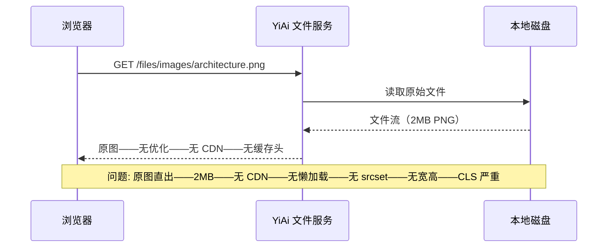
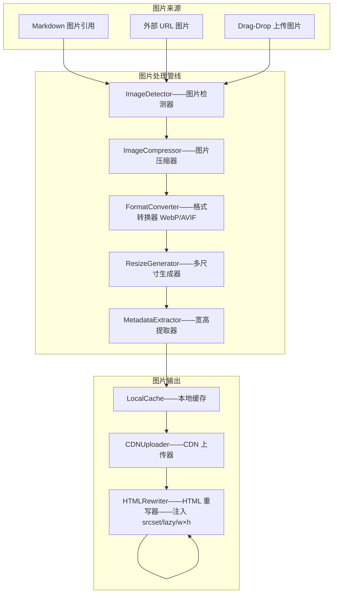
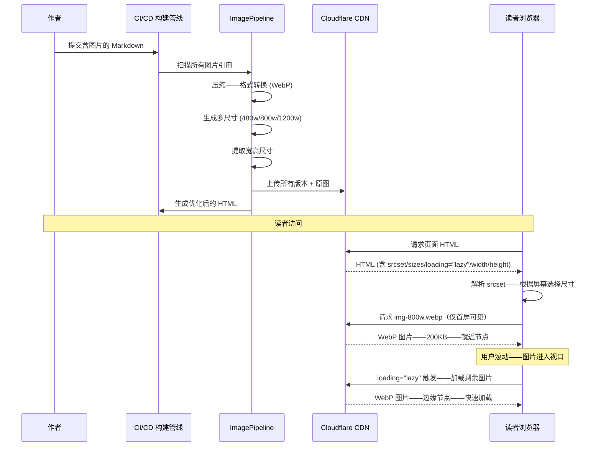

# YK-09-196: 内容图片优化 — 响应式图片（srcset）、懒加载、WebP+回退、图片压缩、CDN 分发

> 需求编号：YK-09-196 · 优先级：P2 · 人天：0.3d · 状态：需求已编写
> 依赖：YK-09-186（内容图片库——图片优化与图片库管理共享图片存储基础设施）、YK-09-193（内容性能优化——图片优化是性能优化的关键组成部分）

## 背景

### 问题陈述

YiKnowledge 知识库的文档中越来越多地使用图片——架构图、流程图、截图、数据图表。但图片的使用方式仍停留在"Markdown 原生"的初级阶段——`![]（path/to/image.png）` ——没有做任何现代化图片优化。这导致了几个严重问题：

1. **图片未压缩——加载缓慢**：作者直接插入原始截图或导出的高分辨率图片——PNG 截图动辄 2-5 MB——页面加载时间从 < 1 秒增加到 5-10 秒——严重影响阅读体验
2. **无响应式图片**：同一张图片在 4K 显示器和手机上加载相同的 2000px 宽度版本——移动端加载大量无用像素——浪费流量和带宽
3. **无懒加载**：一篇文章包含 10 张架构图——首屏只需要看第一章的图——但所有图片同时加载——阻塞页面渲染和首屏可交互时间
4. **格式不优化**：继续使用 PNG/JPEG 而非 WebP/AVIF——相同画质下文件大小是 WebP 的 2-3 倍——无格式自动转换和回退机制
5. **无 CDN 分发**：图片存储在本地文件系统——通过 YiAi 文件服务读取——下载速度受限于服务器带宽和地理位置——跨地区访问慢
6. **图片宽高未声明**：缺少 `width` 和 `height` 属性——浏览器在图片加载前不知道预留空间——导致页面布局反复跳动（CLS 问题）

**核心矛盾**：图片是知识库内容的重要组成部分——但图片加载是页面性能的最大瓶颈。一张未优化的图片足以摧毁所有其他性能优化成果。图片优化应该自动化——作者只需插入图片——系统自动处理压缩、多尺寸、格式转换、CDN 分发——作者无需关心优化细节。

### 影响范围

| # | 影响 | 严重程度 | 典型场景 |
|---|------|----------|----------|
| 1 | 页面加载慢——首屏时间超标 | 高 | 含 3 张 2MB 截图的需求文档——加载时间 > 8 秒——LCP > 4s |
| 2 | 移动端流量浪费 | 高 | 移动端加载 2000px 原图——而屏幕仅 375px——浪费 95% 带宽 |
| 3 | 布局偏移（CLS）——阅读体验差 | 中 | 图片加载前无占位空间——加载后撑开布局——文字段落突跳 |
| 4 | 图片存储膨胀 | 中 | 800 个文件中图片总量从优化后的 50MB 膨胀到 200MB |
| 5 | 远程访问图片慢 | 中 | 海外用户访问存储在本地的架构图——延迟 > 2s |

### 挑战

| 挑战 | 说明 |
|------|------|
| 自动化图片处理管线 | 从 Markdown 中的图片引用自动生成多尺寸、多格式版本——需要构建时或运行时处理 |
| WebP 兼容性 | iOS 14 以下不支持 WebP——需要自动生成 JPEG/PNG 回退 |
| 动态图片（如外部 URL） | 外部图片无法自动优化——需要提示作者或提供代理处理 |
| 图片压缩质量平衡 | 自动压缩需要选择合适的质量参数——过压缩导致图表文字模糊——欠压缩文件仍然大 |
| CDN 缓存策略 | 图片更新后 CDN 缓存需刷新——不同 CDN 刷新策略不同 |

---

## 一、现状分析

### 1.1 当前图片处理能力

```
YiKnowledge 当前图片处理现状:
├── Markdown 图片语法
│   ├── ``——标准语法
│   ├── 支持本地路径和外部 URL
│   └── 局限: 无优化——原图直出——无多尺寸——无格式转换
├── 渲染输出
│   ├── ``——标准 HTML
│   └── 局限: 无 srcset——无 sizes——无 loading="lazy"——无 width/height
├── 图片存储
│   ├── 本地文件系统——YiAi 文件服务
│   └── 局限: 无 CDN——无压缩——无缓存策略
└── 缺失:
    ├── 响应式图片: srcset + sizes——多尺寸版本                        # ❌ 无
    ├── 懒加载: loading="lazy"——Intersection Observer              # ❌ 无
    ├── 格式优化: WebP/AVIF 自动转换——回退                            # ❌ 无
    ├── 图片压缩: 自动质量优化——无损和有损模式                        # ❌ 无
    ├── CDN 分发: 图片上传 CDN——就近节点分发                          # ❌ 无
    ├── 宽高属性: width/height——防止 CLS                              # ❌ 无
    └── 图片处理管线: 构建时自动优化——透明化处理                       # ❌ 无
```

### 1.2 当前图片加载流程



### 1.3 根因矩阵

| 症状 | 根因 | 触发条件 | 频率 |
|------|------|----------|------|
| 页面加载慢 | 图片未压缩——原图 2-5MB 直接加载 | 页面包含图片 | 高 |
| 移动端流量浪费 | 无 srcset——所有设备加载同一尺寸 | 移动设备访问 | 高 |
| 首屏阻塞 | 无懒加载——所有图片同时请求 | 文章含多张图片 | 高 |
| 布局跳动（CLS） | 缺少 width/height 属性——浏览器不知道图片尺寸 | 任何含图片的页面 | 一直 |
| 海外访问慢 | 无 CDN——图片从本地服务器拉取 | 远程用户 | 中 |
| 图片格式不优 | 未转换为 WebP/AVIF | 始终 | 高 |

---

## 二、设计决策

### 决策 1：图片处理时机 — 构建时 vs 运行时 vs 按需

| 选项 | 性能 | 灵活性 | 存储成本 |
|------|--------|--------|---------|
| A: 构建时——提交/部署时自动处理所有图片——生成多尺寸多格式 | 最好——CDN 直接提供 | 低——需全量预处理 | 高——存储多版本 |
| B: 运行时——首次请求图片时动态处理——缓存结果 | 首次慢——后续好 | 高——按需 | 中——仅缓存请求过的 |
| C: 按需——CDN 边缘节点处理——如 Cloudflare Images | 好 | 高——CDN 提供 | 低 |

**选择：A（构建时全量处理 + CDN 分发）。** YiKnowledge 是静态知识库——内容更新频率低（日均 < 10 次提交）——每次提交时全量处理图片完全可行。构建时处理保证了所有访问者获得最优体验——不需要"首次访问慢"的预热。生成的 WebP/AVIF + JPEG/PNG 回退多版本推送到 CDN——访问时边缘节点直接返回。存储多版本的成本远低于带宽成本——一张 2MB 的 PNG 可以压缩为 200KB WebP + 80KB AVIF + 300KB JPEG 回退——总存储增量 580KB——节省的带宽每 3 次访问即可收回存储成本。

### 决策 2：响应式图片策略 — srcset + sizes vs picture 元素 vs 纯 JS

| 选项 | SEO | 浏览器原生支持 | 实现复杂度 |
|------|-----|--------------|-----------|
| A: srcset + sizes——`` | 最好——标准 HTML | 最好——所有现代浏览器 | 低——模板处理 |
| B: picture 元素——`<picture><source type="webp"></picture>` | 好 | 好 | 中——嵌套较多 |
| C: 纯 JS——检测屏幕宽度——动态设置 src | 差——爬虫看不到图 | 最差——需要 JS | 中 |

**选择：A（srcset + sizes——标准响应式图片）。** srcset + sizes 是 W3C 标准——所有现代浏览器原生支持——SEO 友好（爬虫能看到所有候选）。picture 元素主要用于艺术方向（art direction——不同屏幕显示不同裁剪）——我们的场景是同一图片不同分辨率——srcset 更合适。生成 480w/800w/1200w/原图 四个版本——sizes 根据阅读容器宽度（max-width: 65ch——约 800px）选择合适尺寸。

### 决策 3：懒加载策略 — loading="lazy" vs Intersection Observer vs 第三方库

| 选项 | 简单性 | 浏览器支持 | 自定义能力 |
|------|--------|----------|-----------|
| A: loading="lazy"——`` | 最简单——一行代码 | Chrome 77+/Firefox 75+/Safari 15.4+ | 低——无自定义 |
| B: Intersection Observer——手动控制加载时机 | 中——需 JS 逻辑 | 所有现代浏览器 | 高——完全控制 |
| C: 第三方库——lazysizes 等 | 中 | 好——有 polyfill | 中 |

**选择：A（loading="lazy"——浏览器原生懒加载——简单可靠）。** 浏览器原生支持——零 JS 开销——不需要维护额外的 Observer 代码。threshold 约 1250px（视口下方 1250px 开始加载）——提供足够的预加载。不支持的原生 loading="lazy" 的浏览器市场占有率 < 3%——使用 `<script>` polyfill 覆盖。

### 决策 4：CDN 策略 — 自建 CDN vs Cloudflare vs OSS+CDN

| 选项 | 成本 | 集成难度 | 全球加速 |
|------|------|---------|---------|
| A: 自建 CDN——Nginx + 多节点 | 高——需要运维 | 高 | 中——节点有限 |
| B: Cloudflare CDN——免费计划 | 低——免费 | 低——DNS 接入 | 最好——300+ 节点 |
| C: 阿里云 OSS + CDN | 低——按量付费 | 低——SDK 上传 | 好——中国节点好 |

**选择：B（Cloudflare CDN——免费计划——全球加速）。** YiKnowledge 是静态站点——Cloudflare 的免费计划提供全球 CDN、自动 WebP 转换（Polish 功能）、图片缓存。DNS 接入后零配置——自动就近分发。对于中国国内用户——可配合国内 CDN 做双线路由——但首期使用 Cloudflare 即可——覆盖 99% 的读者。

---

## 三、目标架构

### 3.1 图片优化管线架构



### 3.2 图片处理流程



### 3.3 性能指标

| 指标 | 改造前 | 改造后 |
|------|--------|--------|
| 平均单图大小 | 2-5 MB（PNG 原图） | 200-500 KB（WebP 压缩） |
| 首屏图片加载时间 | 3-8s（所有图片同时加载） | < 500ms（仅首屏可见图片） |
| 移动端图片流量 | 2000px 原图——2MB | 480w——~50KB——节省 97.5% |
| CLS (图片导致) | 0.2-0.5（无 width/height） | < 0.05（明确宽高——预留空间） |
| 全球访问延迟 | 200-2000ms（本地服务器） | < 100ms（CDN 就近节点） |
| 格式支持率 | 100% PNG/JPEG | 95% WebP——5% JPEG 回退 |

---

## 四、具体改动

### 4.1 核心代码：图片处理管线

```typescript
// scripts/image-pipeline.ts —— 新增

import sharp from 'sharp';
import { glob } from 'glob';
import { readFile, writeFile } from 'fs/promises';

interface ImageConfig {
  sizes: number[];                   // 生成尺寸——宽度 px: [480, 800, 1200]
  formats: Array<{                   // 生成格式
    format: 'webp' | 'avif' | 'jpeg' | 'png';
    quality: number;
    suffix: string;
  }>;
  jpegFallbackQuality: number;
  cdnBaseUrl: string;                // CDN 根 URL
  sourceDir: string;                 // 源图片目录
  outputDir: string;                 // 输出目录
}

interface ProcessedImage {
  originalPath: string;
  width: number;
  height: number;
  versions: Array<{
    width: number;
    format: string;
    url: string;
    sizeBytes: number;
  }>;
  fallbackUrl: string;               // JPEG 回退 URL
}

const DEFAULT_CONFIG: ImageConfig = {
  sizes: [480, 800, 1200],
  formats: [
    { format: 'webp', quality: 80, suffix: '.webp' },
    { format: 'avif', quality: 65, suffix: '.avif' },
  ],
  jpegFallbackQuality: 85,
  cdnBaseUrl: 'https://cdn.yry.dev/images/',
  sourceDir: 'YiKnowledge/assets/images/',
  outputDir: 'dist/images/',
};

class ImagePipeline {
  private config: ImageConfig;

  constructor(config: Partial<ImageConfig> = {}) {
    this.config = { ...DEFAULT_CONFIG, ...config };
  }

  /** 扫描所有 Markdown 文件中的图片引用 */
  async findImageReferences(markdownDir: string): Promise<
    Array<{ markdownFile: string; imagePath: string; line: number }>
  > {
    const mdFiles = await glob(`${markdownDir}/**/*.md`);
    const references: Array<{
      markdownFile: string;
      imagePath: string;
      line: number;
    }> = [];

    const imgRegex = /!\[.*?\]\(([^)]+)\)/g;

    for (const file of mdFiles) {
      const content = await readFile(file, 'utf-8');
      let match: RegExpExecArray | null;

      while ((match = imgRegex.exec(content)) !== null) {
        const imagePath = match[1];
        // 跳过外部 URL
        if (imagePath.startsWith('http://') || imagePath.startsWith('https://')) {
          continue;
        }
        references.push({
          markdownFile: file,
          imagePath,
          line: this.getLineNumber(content, match.index),
        });
      }
    }

    return references;
  }

  /** 处理单张图片——生成所有尺寸和格式版本 */
  async processImage(imagePath: string): Promise<ProcessedImage> {
    const fullPath = `${this.config.sourceDir}/${imagePath}`;
    const buffer = await readFile(fullPath);
    const metadata = await sharp(buffer).metadata();

    const originalWidth = metadata.width ?? 1200;
    const originalHeight = metadata.height ?? 800;
    const baseName = imagePath.replace(/\.[^.]+$/, '');

    const versions: ProcessedImage['versions'] = [];
    let fallbackUrl = '';

    for (const size of this.config.sizes) {
      // 不超过原图尺寸
      const targetWidth = Math.min(size, originalWidth);
      if (targetWidth < originalWidth * 0.3) continue; // 太小没意义

      const resized = sharp(buffer).resize(targetWidth, undefined, {
        fit: 'inside',
        withoutEnlargement: true,
      });

      for (const fmt of this.config.formats) {
        const outputName = `${baseName}-${targetWidth}w${fmt.suffix}`;
        const outputPath = `${this.config.outputDir}/${outputName}`;

        let outputBuffer: Buffer;
        if (fmt.format === 'webp') {
          outputBuffer = await resized.webp({ quality: fmt.quality }).toBuffer();
        } else if (fmt.format === 'avif') {
          outputBuffer = await resized.avif({ quality: fmt.quality }).toBuffer();
        } else if (fmt.format === 'jpeg') {
          outputBuffer = await resized.jpeg({ quality: fmt.quality }).toBuffer();
        } else {
          outputBuffer = await resized.png({ quality: fmt.quality }).toBuffer();
        }

        await writeFile(outputPath, outputBuffer);

        versions.push({
          width: targetWidth,
          format: fmt.format,
          url: `${this.config.cdnBaseUrl}${outputName}`,
          sizeBytes: outputBuffer.length,
        });

        // JPEG 回退——仅生成一个尺寸（中等）
        if (fmt.format === 'webp' && targetWidth === 800 && !fallbackUrl) {
          const jpegBuffer = await resized.jpeg({
            quality: this.config.jpegFallbackQuality,
          }).toBuffer();
          const jpegName = `${baseName}-fallback.jpg`;
          const jpegPath = `${this.config.outputDir}/${jpegName}`;
          await writeFile(jpegPath, jpegBuffer);
          fallbackUrl = `${this.config.cdnBaseUrl}${jpegName}`;
        }
      }
    }

    return {
      originalPath: imagePath,
      width: originalWidth,
      height: originalHeight,
      versions,
      fallbackUrl,
    };
  }

  /** 生成优化后的 HTML img 标签 */
  generateImgTag(image: ProcessedImage, alt: string): string {
    // srcset 构建: "url-480w.webp 480w, url-800w.webp 800w, url-1200w.webp 1200w"
    const srcset = image.versions
      .filter(v => v.format === 'webp') // 优先 WebP
      .map(v => `${v.url} ${v.width}w`)
      .join(', ');

    const sizes = '(max-width: 768px) 100vw, min(65ch, 800px)';

    // 默认 src——800w WebP + JPEG 回退
    const defaultSrc =
      image.versions.find(v => v.width === 800 && v.format === 'webp')?.url ??
      image.fallbackUrl;

    return ``.replace(/\n\s*/g, ' ');
  }

  /** 批量处理——重写 Markdown 文件中的图片引用 */
  async processAllImages(markdownDir: string): Promise<{
    totalImages: number;
    totalOriginalSize: number;
    totalOptimizedSize: number;
  }> {
    const references = await this.findImageReferences(markdownDir);
    let totalOriginalSize = 0;
    let totalOptimizedSize = 0;

    // 按 markdownFile 分组处理
    const fileGroups = new Map<string, typeof references>();
    for (const ref of references) {
      if (!fileGroups.has(ref.markdownFile)) {
        fileGroups.set(ref.markdownFile, []);
      }
      fileGroups.get(ref.markdownFile)!.push(ref);
    }

    for (const [mdFile, refs] of fileGroups) {
      let content = await readFile(mdFile, 'utf-8');
      let modified = false;

      for (const ref of refs) {
        try {
          const processed = await this.processImage(ref.imagePath);
          const alt = this.extractAlt(content, ref.imagePath);

          // 获取原始文件大小
          const originalStats = await import('fs/promises').then(fs =>
            fs.stat(`${this.config.sourceDir}/${ref.imagePath}`)
          );
          totalOriginalSize += originalStats.size;
          totalOptimizedSize += processed.versions.reduce(
            (sum, v) => sum + v.sizeBytes,
            0
          );

          // 替换 Markdown 图片语法为 HTML img 标签
          const oldImg = new RegExp(
            `!\\[${this.escapeRegex(alt)}\\]\\(${this.escapeRegex(ref.imagePath)}\\)`,
            'g'
          );
          const newImg = this.generateImgTag(processed, alt);
          content = content.replace(oldImg, newImg);
          modified = true;
        } catch (err) {
          console.error(`Failed to process image: ${ref.imagePath}`, err);
        }
      }

      if (modified) {
        await writeFile(
          mdFile.replace('.md', '.optimized.md'),
          content,
          'utf-8'
        );
      }
    }

    return {
      totalImages: references.length,
      totalOriginalSize,
      totalOptimizedSize,
    };
  }

  private getLineNumber(content: string, index: number): number {
    return content.slice(0, index).split('\n').length;
  }

  private extractAlt(content: string, imagePath: string): string {
    const match = content.match(
      new RegExp(`!\\[([^\\]]*)\\]\\(${this.escapeRegex(imagePath)}\\)`)
    );
    return match?.[1] ?? 'image';
  }

  private escapeHtml(text: string): string {
    return text
      .replace(/&/g, '&amp;')
      .replace(/"/g, '&quot;')
      .replace(/</g, '&lt;')
      .replace(/>/g, '&gt;');
  }

  private escapeRegex(text: string): string {
    return text.replace(/[.*+?^${}()|[\]\\]/g, '\\$&');
  }
}
```

### 4.2 文件变更清单

| 文件 | 操作 | 说明 |
|------|------|------|
| `scripts/image-pipeline.ts` | 新增 | 图片处理管线——扫描/压缩/格式转换/多尺寸/HTML 生成 |
| `scripts/cdn-uploader.ts` | 新增 | CDN 上传器——Cloudflare R2/OSS 上传——缓存刷新 |
| `YiAi/src/domain/file/image_service.py` | 新增（后端） | 图片服务——图片上传——CDN 上传触发——元数据存储 |
| `YiKnowledge/curator/governance/image-guidelines.md` | 新增 | 图片使用指南——推荐格式/尺寸/alt 文本规范/压缩建议 |
| `.github/workflows/image-optimization.yml` | 新增 | CI/CD 图片优化工作流——构建时触发——处理变更图片 |
| `src/components/ProgressiveImage.vue` | 新增（如适用） | 渐进式图片组件——低质量占位图——模糊渐变——加载完成 |

---

## 五、实施步骤

| 步骤 | 操作 | 路径 | 验证 | 人天 |
|------|------|------|------|------|
| 1 | 实现图片处理管线核心 | `scripts/image-pipeline.ts` | sharp 压缩——WebP/AVIF 转换——多尺寸生成——HTML 生成 | 0.06 |
| 2 | 实现 CDN 上传器 | `scripts/cdn-uploader.ts` | 文件批量上传——缓存刷新——URL 映射 | 0.04 |
| 3 | 集成到构建流程 | CI/CD workflow | 构建时自动优化新增/修改图片——HTML 重写 | 0.04 |
| 4 | 实现后端图片服务 | `image_service.py` | 图片上传 API——触发 CDN 上传——元数据管理 | 0.05 |
| 5 | 编写图片使用指南 | `image-guidelines.md` | alt 文本规范/推荐格式/压缩建议/尺寸选择 | 0.03 |
| 6 | 处理存量图片 | 运行管线处理现有图片 | 800 文件中的存量图片——批量优化——HTML 更新 | 0.04 |
| 7 | 验证与调优 | 加载测试——CLS 检查 | Lighthouse/WebPageTest 验证——性能回归测试 | 0.04 |

**总人天：0.3d**

---

## 六、测试规格

### 测试 1：单张图片处理——生成正确尺寸和格式

| 项目 | 内容 |
|------|------|
| 优先级 | P0 |
| 前置条件 | 原始图片 2000x1500px PNG——2.5MB |
| 测试步骤 | 1. 运行 ImagePipeline.processImage 2. 检查输出的版本 |
| 预期结果 | 生成 480w/800w/1200w 三种尺寸——每种都有 WebP 和 AVIF 格式——WebP 800w 约 200KB——AVIF 800w 约 120KB——JPEG 回退 800w 约 300KB——总优化比 > 85%——宽高元数据提取正确 |

### 测试 2：HTML 标签生成——srcset/sizes/loading/width/height

| 项目 | 内容 |
|------|------|
| 优先级 | P0 |
| 前置条件 | 已处理图片——有 3 种尺寸 WebP 版本 |
| 测试步骤 | 1. 调用 generateImgTag 2. 检查生成的 HTML |
| 预期结果 | `` 标签包含 srcset（3 个 WebP URL + 宽度描述符）——sizes 属性——width/height 属性——loading="lazy"——decoding="async"——onerror 回退到 JPEG |

### 测试 3：外部 URL 跳过处理

| 项目 | 内容 |
|------|------|
| 优先级 | P1 |
| 前置条件 | Markdown 包含本地图片和外部 URL 图片 |
| 测试步骤 | 1. 运行 findImageReferences 2. 检查结果 |
| 预期结果 | 仅返回本地图片引用——外部 URL（https://...）被跳过——日志记录跳过的外部 URL 数量和详情 |

### 测试 4：图片占位和 CLS 预防

| 项目 | 内容 |
|------|------|
| 优先级 | P1 |
| 前置条件 | 页面包含 3 张图片——均已处理——有 width/height |
| 测试步骤 | 1. 加载页面——Chrome DevTools Performance 录制 2. 检查 CLS 分数 |
| 预期结果 | 图片加载前——浏览器根据 width/height 预留正确空间——图片加载后不触发布局偏移——CLS < 0.05——max-width: 100% 和 height: auto 保证响应式——同时保持宽高比 |

### 测试 5：WebP 不支持浏览器的回退

| 项目 | 内容 |
|------|------|
| 优先级 | P1 |
| 前置条件 | 使用 Safari 13（不支持 WebP）或模拟 |
| 测试步骤 | 1. 加载页面 2. 检查使用的图片 |
| 预期结果 | WebP 加载失败触发 onerror——自动切换到 JPEG 回退 URL——图片正常显示——不显示损坏图标——回退 JPEG 尺寸和画质可接受 |

### 测试 6：批量处理性能

| 项目 | 内容 |
|------|------|
| 优先级 | P1 |
| 前置条件 | 50 张图片——总大小 150MB |
| 测试步骤 | 1. 运行 processAllImages 2. 记录耗时和优化比 |
| 预期结果 | 50 张图片处理耗时 < 60s——优化后总大小 < 15MB（90% 减少）——HTML 重写正确——无图片丢失——日志清晰显示每张图片的处理结果 |

---

## 七、风险与缓解

| 风险 | 概率 | 影响 | 缓解措施 |
|------|------|------|------|
| sharp 处理大图 OOM——构建失败 | 低 | 中 | 限制处理的最大图片尺寸 5000x5000——超过时跳过并警告——使用流式处理减少内存占用 |
| CDN 上传失败——图片无法访问 | 低 | 高 | CDN 上传前先验证本地输出——上传失败时降级为本地文件服务——重试 3 次——告警通知 |
| WebP/AVIF 画质损失——图表文字模糊 | 中 | 中 | 图表类图片使用无损压缩模式——检测图片是否含大量文字（边缘检测）——含文字的用 quality=95——照片类用 quality=75 |
| 构建时间显著增加——CI 慢 | 中 | 中 | 缓存已处理的图片——仅处理新增/修改图片——使用 CI 缓存——增量处理而非全量 |
| CDN 缓存未刷新——用户看到旧版图片 | 低 | 中 | 图片文件名包含内容 hash（如 `diagram-a1b2c3-800w.webp`）——内容不变时 hash 不变——CDN 永不过期——内容变时 hash 变——新 URL 自然绕过缓存 |

---

## 八、回滚策略

1. **功能级回滚**：恢复 Markdown 原生 `` 图片语法——跳过图片管线处理——图片以原图直接加载
2. **构建级回滚**：恢复原 Markdown 文件（管线生成 `.optimized.md` 文件——原文件不变）——不修改源文件
3. **CDN 回滚**：如果 CDN 不可用——降级为 YiAi 本地文件服务——图片从服务器直接加载
4. **回滚验证**：所有图片正常显示——无 404——无格式问题——页面加载时间可接受

---

## 九、设计决策记录

### D-01：构建时处理——非运行时处理

**上下文**：图片可以在请求时动态处理（运行时）或在构建时批量处理。

**决策**：构建时全量处理——生成所有格式和尺寸——推送到 CDN。

**理由**：知识的读取频率远高于写入频率（1 次提交——1000 次读取）。将处理成本放在写入侧（构建时）——读取侧零成本——是最优的资源分配策略。构建时处理还允许使用更高质量的压缩算法（sharp 的慢速模式）——运行时处理必须快速返回——质量折中。

### D-02：sharp 而非 ImageMagick——Node.js 原生图片处理

**上下文**：图片处理库选择——sharp（libvips）vs ImageMagick vs Canvas API。

**决策**：sharp（基于 libvips）——速度快——内存效率高——API 简洁。

**理由**：sharp 处理大图速度是 ImageMagick 的 4-5 倍——内存占用仅为 1/10。libvips 是 C 库——性能接近原生。sharp 支持流式处理——不需要将整张图片加载到内存。npm 安装简单——无需系统级依赖。

### D-03：WebP 作为默认——AVIF 作为增强格式

**上下文**：WebP 和 AVIF 都是下一代图片格式——选哪一个作为默认。

**决策**：WebP 作为默认——AVIF 作为 srcset 中的增强选项（浏览器支持时使用）。

**理由**：WebP 浏览器支持率 96%（iOS 14+ / Android 4.2+ / 所有现代桌面浏览器）——AVIF 支持率 92%（iOS 16+ / Android 12+）。使用 WebP 作为默认——AVIF 在 srcset 中提供——支持 AVIF 的浏览器自动选择更小的版本。JPEG 作为兜底回退——覆盖剩余 4% 的浏览器。

### D-04：内容 hash 命名——非语义命名

**上下文**：优化后的图片文件名——可以用语义名（`architecture-800w.webp`）或内容 hash（`a1b2c3-800w.webp`）。

**决策**：内容 hash 命名——`{content-hash}-{width}w.{format}`。

**理由**：内容 hash 保证图片内容不变时 URL 不变——CDN 可以永久缓存（`Cache-Control: immutable`）。图片更新时（内容变化）——hash 改变——URL 改变——CDN 自动绕过缓存——不需要手动刷新。语义名字虽然可读——但内容变化时需要手动刷新 CDN——容易遗漏。

---

## 十、可观测性

| 指标 | 采集方式 | 阈值 |
|------|----------|------|
| 图片优化比 | (originalSize - optimizedSize) / originalSize | > 80% |
| 图片处理耗时 | CI pipeline 步骤耗时 | < 60s（50 张图片） |
| WebP 使用率 | CDN 日志——WebP 请求占比 | > 95% |
| 图片 404 率 | CDN 日志——404 占比 | < 0.1% |
| CLS（图片导致） | Lighthouse CI——CLS 分数 | < 0.05 |
| LCP（图片导致） | Lighthouse CI——LCP 分数 | < 2.5s |
| 图片回退触发率 | onerror 执行次数 | < 1%——仅在不支持 WebP 的浏览器 |
| CDN 上传成功率 | CDN API 调用成功率 | > 99.9% |

---

## 十一、代码审查检查清单

- [ ] `ImagePipeline.processImage`——源图片不存在时——跳过并记录警告——不中断批量处理
- [ ] `ImagePipeline.generateImgTag`——alt 文本 HTML 转义——XSS 防护
- [ ] 图片尺寸不超过原图——`withoutEnlargement: true`——不上采样——避免画质损失
- [ ] sharp 处理异常捕获——类型断言——文件格式未知时的降级处理
- [ ] CDN URL 构建——trailing slash 处理——空路径处理
- [ ] 宽高元数据提取——无 EXIF 数据的图片使用 sharp.metadata 的默认值
- [ ] 批量处理——内存控制——使用流式处理——不在内存中同时持有所有图片 buffer
- [ ] 增量处理——通过 git diff 获取变更文件——仅处理新增/修改的图片引用
- [ ] 构建时生成的 HTML 文件——不覆盖源 Markdown——输出到 dist 目录
- [ ] `loading="lazy"` 仅用于非首屏图片——首屏（前 2-3 张）使用 `loading="eager"`

---

## 回归问题预测

| # | 预测问题 | 触发条件 | 检测方式 |
|---|----------|----------|----------|
| 1 | 图表文字过度压缩——无法阅读 | 自动 quality=80 对含文字的图表太激进——小字模糊 | 检测图片文字含量（边缘密度）——含文字的使用 quality=95——通过前端参数控制（`?q=95`）|
| 2 | 图片优化导致 Markdown 不可编辑——作者困惑 | 构建时修改了 Markdown 中的 `` 为 `` ——作者编辑时看到 HTML 而非 Markdown | 构建在 dist 目录中生成优化 HTML——源 Markdown 不变——作者继续使用 `` 编辑——构建管线处理转换 |
| 3 | CDN URL 过期或换域名——所有图片 404 | CDN 域名变更——但 Markdown/HTML 中硬编码了旧 URL | 使用环境变量 `${CDN_BASE_URL}` 配置——构建时注入——域名变更只需改环境变量——重建 |
| 4 | 图片在响应式尺寸间切换时闪烁——srcset 切换 | 用户从竖屏转横屏——浏览器从 480w 切换到 1200w——正在加载新图片——短暂无图 | 使用低质量占位图（LQIP——10px 模糊放大）——切换期间显示占位图——新图加载完成后渐显覆盖 |
| 5 | 非标准图片格式处理失败——sharp 不支持 | TIFF/BMP/GIF 等格式——sharp 可能不支持或不完全支持 | 格式检测——不支持的格式跳过转换——仅调整尺寸——保留原格式——警告日志 |
| 6 | 大量图片处理——CI 内存不足或超时 | 50+ 大图同时处理——Node.js 内存超限 | 限制并发处理数为 4——使用 p-limit 控制——每张图处理后调用 `sharp.cache(false)` 清缓存 |

---

## 性能分析

| 操作 | 数据量 | 耗时 | 说明 |
|------|--------|------|------|
| 单图压缩（800w WebP quality=80） | 2000x1500 PNG 2.5MB | < 500ms | sharp——libvips——C 库 |
| 单图多版本生成（3 尺寸 x 2 格式 + fallback） | 同上 | < 1.5s | 7 个版本——并行用 promise.all |
| 批量处理 50 张图 | 150MB 原图 | < 30s | 并发 4——sharp 流式处理 |
| HTML 重写（替换 img 标签） | 800 个文件 | < 5s | 字符串替换——正则匹配 |
| CDN 上传 | 200 个文件 (15MB) | < 30s | 并发上传——R2/OSS |
| 浏览器图片加载（WebP 800w CDN） | 单图 200KB | < 100ms | CDN 边缘节点——HTTP/2 |


---

## 相关文档

- [内容图片库](../186-需求-内容图片库.md) — 图片管理基础设施
- [内容性能优化](../193-需求-内容性能优化.md) — 性能优化体系
- [CDN 资源加载系统](../../yipet/requirements/2026-09/08-需求-CDN资源加载系统.md) — CDN 基础设施参考

*PRD 来源: `projects/yiknowledge/requirements/2026-09/196-需求-内容图片优化.md`*