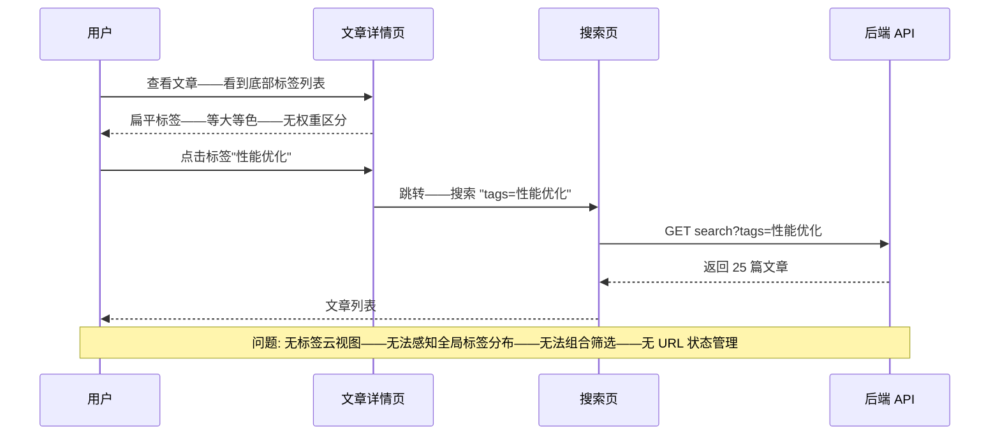
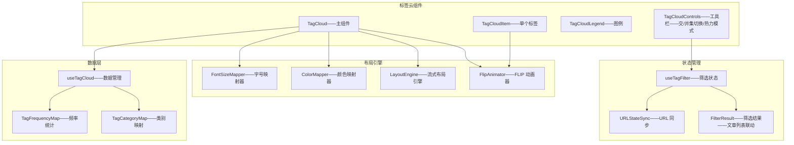
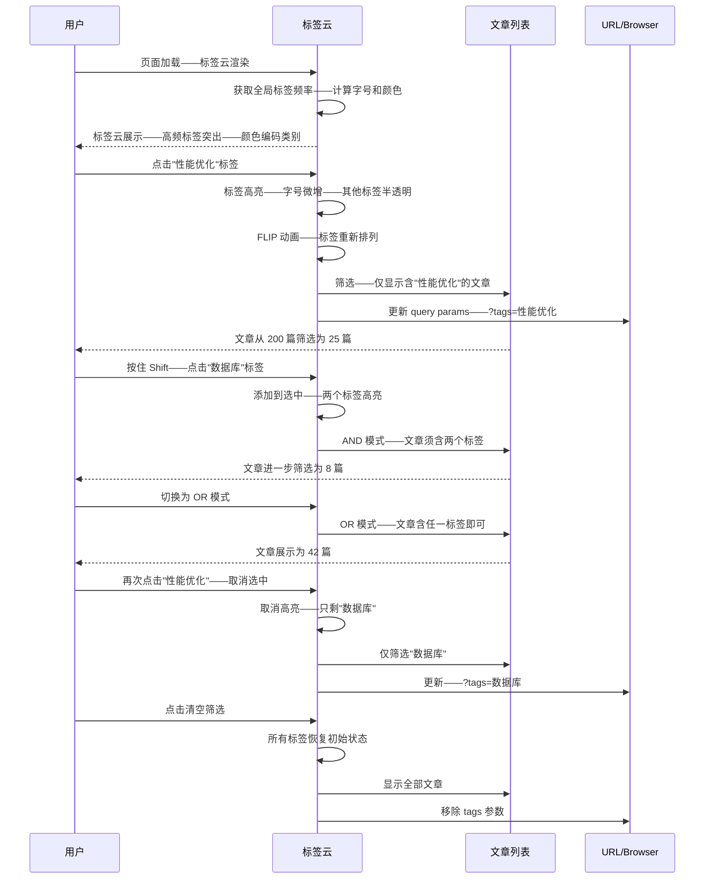

# YK-09-197: 内容标签云组件 — 加权字号、颜色编码、点击筛选、动画过渡、响应式布局

> 需求编号: YK-09-197 · 优先级: P2 · 人天: 0.3d · 状态: 需求已编写
> 依赖: YK-09-150（内容标签自动化——标签云的数据来源依赖自动化标签体系）、YK-09-21（标签体系治理——标签规范化是标签云有意义的前提）

## 背景

### 问题陈述

YiKnowledge 知识库目前有数百个标签——分布在数百篇文章中——但标签的展示方式仅限于文章详情页底部的一排扁平标签列表。用户无法从全局视角理解整个知识库的标签分布——无法快速发现热门主题——也无法通过标签进行内容探索：

1. **标签不可视化——无法感知知识结构**: 当前标签以扁平列表展示——无权重区分——无法看出哪些标签是核心主题（如"性能优化"出现了 80 次）——哪些是边缘标签（如"Go"仅 2 次）——知识库的主题重心完全不可见
2. **无标签筛选入口**: 点击标签可以跳转到该标签的文章列表（后端搜索）——但无法组合筛选——选择"性能优化"+"数据库"两个标签的交集——需要手动构建搜索查询
3. **标签导航无层次感**: 超高频标签和低频标签视觉上完全一样——用户在海量标签中难以区分重点——容易忽略重要主题——或浪费时间在边缘标签上
4. **无动态视觉反馈**: 标签之间无过渡动画——添加/移除标签筛选时无平滑效果——体验生硬——不符合现代 Web 应用的交互标准
5. **响应式布局缺失**: 标签列表在移动端要么横向溢出——要么堆叠为无意义的列——无法自适应屏幕宽度——移动端阅读体验差

**核心矛盾**: 标签是知识库最重要的元数据之一——连接了文章、主题和用户兴趣——但当前的展示方式停留在"文本列表"层面——既不能传达标签的重要性差异——也不能作为交互式的内容发现入口。标签云是一种成熟的可视化模式——将统计信息（频率）映射到视觉属性（字号/颜色）——让用户直观理解标签分布——并作为交互式导航工具。

### 影响范围

| # | 影响 | 严重程度 | 典型场景 |
|---|------|----------|----------|
| 1 | 用户无法感知知识库主题重心 | 高 | 新用户进入知识库——面对 200 个标签——不知道该关注什么——放弃探索 |
| 2 | 标签筛选操作繁琐 | 高 | 用户想看"性能优化"+"后端"相关文章——需要输入搜索——手动加标签筛选条件——3 步操作 |
| 3 | 低频标签占用同等视觉权重——干扰判断 | 中 | 核心标签"架构设计"用了一次被淹没在"代码规范"等标签中——用户无法快速区分 |
| 4 | 移动端标签展示混乱 | 中 | 文章详情页底部 15 个标签——移动端横向溢出——需左右滑动——体验差 |
| 5 | 交互生硬无反馈 | 低 | 点击标签筛选——页面直接跳转——无过渡无动画——用户感觉突兀 |

### 挑战

| 挑战 | 说明 |
|------|------|
| 字号映射算法 | 标签频率分布通常呈长尾——需要非线性映射——避免少数标签过大——多数标签过小不可见 |
| 颜色编码策略 | 按类别着色 vs 按频率着色 vs 按热度着色——不同场景需要不同配色 |
| 动画性能 | 标签云中标签数量可能 > 100——筛选时大量元素重新布局——需 GPU 加速的 FLIP 动画 |
| 响应式字号 | 字号需要随容器宽度缩放——CSS clamp() vs JS 动态计算——需要兼顾性能和视觉效果 |
| 组合筛选状态管理 | 多标签组合筛选的交集/并集切换——URL 同步——浏览器前进后退 |

---

## 一、现状分析

### 1.1 当前标签展示能力

```
YiKnowledge 标签展示现状:
├── 文章详情页
│   ├── 底部标签列表——扁平排列——等大小——等颜色
│   └── 局限: 无权重——无筛选——无动画——不可交互组合
├── 标签搜索
│   ├── 点击标签→跳转到搜索结果页——显示该标签的所有文章
│   └── 局限: 仅单标签——无组合筛选——URL 参数不保留
├── 标签元数据
│   ├── frontmatter tags 字段——数组——无权重信息
│   └── 局限: 无使用频次统计——无分类颜色映射
└── 缺失:
    ├── 标签云可视化: 字号与频率成正比——高频标签突出                  # ❌ 无
    ├── 颜色编码: 按类别/频率着色——视觉区分                             # ❌ 无
    ├── 点击筛选: 点击标签——筛选含该标签的文章——支持组合筛选             # ❌ 无
    ├── 动画过渡: 添加/移除筛选时——标签云平滑重排                      # ❌ 无
    ├── 响应式布局: 自适应容器宽度——移动端友好                          # ❌ 无
    ├── URL 同步: 筛选状态 → URL query params                        # ❌ 无
    └── 标签统计: 全局标签频率——热门标签排行                            # ❌ 无
```

### 1.2 当前标签交互流程



### 1.3 根因矩阵

| 症状 | 根因 | 触发条件 | 频率 |
|------|------|----------|------|
| 无法感知标签重要性 | 标签展示无权重映射——等大小等颜色 | 面对 > 20 个标签时 | 高 |
| 组合筛选困难 | 无交/并集切换——无标签多选 UI | 想看两个标签共有的文章 | 中 |
| 页面跳转——上下文丢失 | 标签筛选触发页面跳转——非就地筛选 | 用户仍在阅读当前页面 | 高 |
| 移动端标签不可用 | 无响应式布局——固定排列溢出 | 屏幕宽度 < 768px | 中 |
| 标签趋势不可见 | 无热力/时间维度——无法看到趋势 | 想知道"最近什么标签增长快" | 中 |

---

## 二、设计决策

### 决策 1: 字号映射算法 — 线性 vs 对数 vs 分位数

| 选项 | 视觉对比度 | 长尾处理 | 适用场景 |
|------|-----------|---------|---------|
| A: 线性映射——fontSize = min + (freq/maxFreq) × (max - min) | 差——少数高频主导 | 差——长尾标签太小不可见 | 均匀分布 |
| B: 对数映射——fontSize = min + log(freq)/log(maxFreq) × (max - min) | 中——对比度降低 | 好——长尾可读 | 长尾分布 |
| C: 分位数映射——按百分位分 5-7 级——每级固定字号 | 好——每级视觉统一 | 最好——强制分组 | 任意分布 |

**选择: B + C 混合（对数映射为基础——分 6 个字号级别——每个级别内微调）。** 对数映射压缩了高频端的差异——避免"性能优化"(80 次) 显示为 48px——"架构设计"(75 次) 显示为 46px（差异过大）。分 6 个字号级别（12/14/16/18/22/28px）——每级内标签字号相同——视觉整洁。对数计算后——取最近的级别字号——简单且视觉效果好。

### 决策 2: 颜色编码策略 — 按类别 vs 按热度 vs 单色渐变

| 选项 | 信息量 | 视觉美观 | 用户理解成本 |
|------|--------|---------|------------|
| A: 按标签类别着色（技术=蓝——业务=绿——流程=橙） | 高——传达类别 | 好——色彩丰富 | 中——需图例 |
| B: 按热度着色（冷→暖渐变——表示频率） | 中——传达频率 | 好——渐变 | 低——直觉 |
| C: 单色主题色——仅字号区分 | 低 | 简洁 | 最低 |

**选择: A + B 组合（默认按类别着色——hover 显示频率热度指示）。** 标签类别（从 frontmatter tags 中提取或通过标签的 category 元数据）决定色相——技术类蓝色系——业务类绿色系——流程/方法论类橙色系。标签字号传达频率——颜色传达类别——两个视觉通道互补——信息密度高但不混乱。无类别信息的标签降级为灰色——频率热度通过可选的"热力模式"切换（单色渐变）。

### 决策 3: 点击交互行为 — 筛选 vs 导航 vs 组合

| 选项 | 上下文保留 | 组合能力 | 实现复杂度 |
|------|-----------|---------|---------|
| A: 点击跳转——导航到该标签的文章列表页 | 差——页面跳转 | 无——单标签 | 低 |
| B: 点击筛选——就地筛选——标签云高亮选中标签 | 好——不离开当前页 | 中——可多选 | 中 |
| C: 组合筛选——标签云 + 筛选栏——交集/并集切换 | 最好——看到筛选结果 | 高——多选+逻辑 | 高 |

**选择: C（组合筛选——标签云作为交互式过滤器——配合文章列表联动）。** 点击标签——标签高亮为选中状态——下方文章列表即时过滤——仅显示包含所有选中标签（交集）的文章。提供交/并集切换按钮——交集（AND）模式——文章必须包含所有选中标签——并集（OR）模式——包含任一即可。URL query params 同步筛选状态——支持分享和浏览器前进后退。标签云本身也随筛选动态变化——未匹配的标签半透明显示。

### 决策 4: 动画策略 — CSS transition vs FLIP vs 布局动画

| 选项 | 性能 | 流畅度 | 实现复杂度 |
|------|------|--------|---------|
| A: CSS transition——字号/颜色 transition | 好——GPU 加速 | 中——仅属性渐变 | 低 |
| B: FLIP 动画——First Last Invert Play | 最好——仅 transform | 最好——位置无缝过渡 | 高 |
| C: 布局动画库——Framer Motion / GSAP | 最好 | 最好 | 中——引入依赖 |

**选择: A + B 混合（颜色/透明度用 CSS transition——位置变化用 FLIP 动画）。** 颜色和透明度的过渡使用 CSS transition——简单高效。标签因字号变化导致的位置重排——使用 FLIP 技术——记录旧位置→应用新布局→计算差异→用 transform 反向补偿→播放过渡到目标位置。FLIP 仅使用 transform 和 opacity——GPU 加速——60fps。不引入额外动画库——自研轻量 FLIP 工具函数（< 100 行）。

---

## 三、目标架构

### 3.1 标签云组件架构



### 3.2 标签云交互流程



### 3.3 性能指标

| 指标 | 改造前 | 改造后 |
|------|--------|--------|
| 标签权重可视化 | 无——等大小 | 6 级字号 + 颜色编码——一目了然 |
| 标签筛选交互 | 3 步——点击→跳转→搜索页 | 1 步——点击即时筛选——不离开页面 |
| 组合筛选 | 不支持 | AND/OR 组合——Shift 多选 |
| 动画流畅度 | 0——无动画 | 60fps FLIP 动画——颜色渐变 200ms |
| 移动端适配 | 溢出/堆叠 | 流式布局——自适应换行——字号响应式缩小 |

---

## 四、具体改动

### 4.1 核心代码: 标签云 Composable

```typescript
// src/composables/content/useTagCloud.ts —— 新增

type TagInfo = {
  name: string;
  count: number;
  category: string | null;
  fontSize: number;       // px——12/14/16/18/22/28
  color: string;          // hex——按类别
  heatIndex: number;      // 0-100——热度值
};

type TagFilterState = {
  selectedTags: Set<string>;
  mode: 'and' | 'or';
  isActive: boolean;
};

const FONT_SIZE_LEVELS = [12, 14, 16, 18, 22, 28]; // 6 级字号
const FONT_SIZE_MIN = 12;
const FONT_SIZE_MAX = 28;

const CATEGORY_COLORS: Record<string, string> = {
  '技术': '#3b82f6',      // 蓝
  '业务': '#10b981',      // 绿
  '流程': '#f59e0b',      // 橙
  '设计': '#8b5cf6',      // 紫
  '运维': '#ef4444',      // 红
  'default': '#6b7280',   // 灰
};

function useTagCloud() {
  const tags = ref<TagInfo[]>([]);
  const loading = ref(false);
  const filterState = reactive<TagFilterState>({
    selectedTags: new Set(),
    mode: 'and',
    isActive: false,
  });

  /** 加载全局标签频率和元数据 */
  async function loadTags(): Promise<void> { /* ... */ }

  /** 根据频率计算字号级别（对数映射） */
  function computeFontSize(count: number, minCount: number, maxCount: number): number {
    if (maxCount === minCount) return FONT_SIZE_LEVELS[2]; // 默认中等

    const logMin = Math.log(minCount + 1);
    const logMax = Math.log(maxCount + 1);
    const logCount = Math.log(count + 1);

    const ratio = (logCount - logMin) / (logMax - logMin);
    const levelIndex = Math.round(ratio * (FONT_SIZE_LEVELS.length - 1));

    return FONT_SIZE_LEVELS[Math.min(levelIndex, FONT_SIZE_LEVELS.length - 1)];
  }

  /** 根据标签类别和热度计算颜色 */
  function computeColor(tag: TagInfo): string {
    const baseColor = CATEGORY_COLORS[tag.category || 'default'];
    // 高频标签略亮——低频标签略暗
    const lightnessAdjust = Math.round(tag.heatIndex * 30);
    return adjustLightness(baseColor, lightnessAdjust);
  }

  /** 切换标签选中——支持 Shift 追加 */
  function toggleTag(tagName: string, shiftKey: boolean): void { /* ... */ }

  /** 切换筛选模式 AND/OR */
  function toggleMode(): void { /* ... */ }

  /** 清除所有筛选 */
  function clearFilter(): void { /* ... */ }

  /** 同步筛选状态到 URL */
  function syncToURL(): void { /* ... */ }

  /** 从 URL 恢复筛选状态 */
  function restoreFromURL(): void { /* ... */ }

  return {
    tags, loading, filterState,
    loadTags, computeFontSize, computeColor,
    toggleTag, toggleMode, clearFilter,
    syncToURL, restoreFromURL,
  };
}
```

### 4.2 FLIP 动画工具

```typescript
// src/composables/content/useFlipAnimator.ts —— 新增

type RectCache = Map<string, DOMRect>;

function useFlipAnimator() {
  const rectCache: RectCache = new Map();

  /** 记录元素当前位置（First） */
  function snapshot(elements: Map<string, HTMLElement>): void {
    rectCache.clear();
    for (const [id, el] of elements) {
      rectCache.set(id, el.getBoundingClientRect());
    }
  }

  /** 应用新布局——计算差异——播放动画（Last + Invert + Play） */
  function animate(elements: Map<string, HTMLElement>, duration = 300): void {
    for (const [id, el] of elements) {
      const oldRect = rectCache.get(id);
      if (!oldRect) continue;

      const newRect = el.getBoundingClientRect();
      const deltaX = oldRect.left - newRect.left;
      const deltaY = oldRect.top - newRect.top;

      if (deltaX === 0 && deltaY === 0) continue;

      // Invert: 用 transform 将元素放回旧位置
      el.style.transition = 'none';
      el.style.transform = `translate(${deltaX}px, ${deltaY}px)`;

      // Play: 下一帧移除 transform——transition 驱动动画到目标位置
      requestAnimationFrame(() => {
        el.style.transition = `transform ${duration}ms ease-in-out`;
        el.style.transform = '';
      });
    }

    // 动画结束后清理
    setTimeout(() => {
      for (const [, el] of elements) {
        el.style.transition = '';
        el.style.transform = '';
      }
    }, duration + 50);
  }

  return { snapshot, animate };
}
```

### 4.3 文件变更清单

| 文件 | 操作 | 说明 |
|------|------|------|
| `src/composables/content/useTagCloud.ts` | 新增 | 标签云数据——频率/类别/字号/颜色——筛选状态 |
| `src/composables/content/useFlipAnimator.ts` | 新增 | FLIP 动画工具——位置快照/动画播放 |
| `src/composables/content/useTagFilter.ts` | 新增 | 标签筛选状态——选中/模式/URL 同步 |
| `src/components/content/TagCloud.vue` | 新增 | 标签云主组件——流式布局/响应式/动画 |
| `src/components/content/TagCloudItem.vue` | 新增 | 单个标签——字号/颜色/高亮/选中态 |
| `src/components/content/TagCloudControls.vue` | 新增 | 工具栏——交/并集切换/热力模式/清空 |
| `src/components/content/TagCloudLegend.vue` | 新增 | 颜色图例——类别→颜色映射 |
| `src/views/ContentExplore.vue` | 修改 | 内容探索页集成标签云——配合文章列表联动 |
| `yiAi/services/knowledge/tag_service.py` | 新增 | 标签统计服务——频率/类别聚合——趋势数据 |

---

## 五、实施步骤

| 步骤 | 操作 | 路径 | 验证 | 人天 |
|------|------|------|------|------|
| 1 | 后端标签统计服务 | `tag_service.py` | 频率聚合/类别统计/趋势数据 | 0.04 |
| 2 | 实现标签云数据 Composable | `useTagCloud.ts` | 加载/字号计算/颜色计算/筛选 | 0.05 |
| 3 | 实现 FLIP 动画工具 | `useFlipAnimator.ts` | 位置快照/动画播放/清理 | 0.03 |
| 4 | 实现标签云主组件 | `TagCloud.vue + TagCloudItem.vue` | 流式布局/字号/颜色/响应式 | 0.06 |
| 5 | 实现工具栏和图例 | `TagCloudControls.vue + TagCloudLegend.vue` | 模式切换/热力/清空/图例 | 0.03 |
| 6 | 实现筛选状态和 URL 同步 | `useTagFilter.ts` | 选中/模式/URL query params | 0.04 |
| 7 | 集成到内容探索页 | `ContentExplore.vue` | 标签云+文章列表联动筛选 | 0.05 |

**总人天: 0.3d**

---

## 六、测试规格

### 测试 1: 标签云基本渲染——字号与颜色

| 项目 | 内容 |
|------|------|
| 优先级 | P0 |
| 前置条件 | 知识库含 50 个标签——频率 1~80 次——分属 4 个类别 |
| 测试步骤 | 1. 打开内容探索页 2. 查看标签云渲染 3. 对比高频标签和低频标签 |
| 预期结果 | 高频标签（80 次）字号 28px——低频标签（1 次）字号 12px——中间频率按对数分布——颜色按类别区分（蓝/绿/橙/紫）——无类别标签为灰色——渲染不重叠不溢出——流式布局自动换行 |

### 测试 2: 点击筛选——标签高亮与文章联动

| 项目 | 内容 |
|------|------|
| 优先级 | P0 |
| 前置条件 | 标签云展示——下方文章列表 200 篇——标签"性能优化"覆盖 25 篇 |
| 测试步骤 | 1. 点击"性能优化"标签 2. 观察标签云变化 3. 观察文章列表 |
| 预期结果 | 标签云——"性能优化"高亮——添加选中边框——其他标签半透明（opacity 0.4）——文章列表即时筛选——仅显示 25 篇——列表计数更新——URL 变为 ?tags=性能优化——标签云平滑过渡动画——无闪烁 |

### 测试 3: 组合筛选——AND 与 OR 模式

| 项目 | 内容 |
|------|------|
| 优先级 | P0 |
| 前置条件 | 标签"性能优化"(25 篇)——"数据库"(18 篇)——交集 5 篇 |
| 测试步骤 | 1. 点击"性能优化" 2. Shift+点击"数据库"——AND 模式 3. 切换为 OR 模式 4. 观察文章列表 |
| 预期结果 | AND 模式——显示 5 篇（同时含两个标签）——OR 模式——显示 38 篇（含任一标签）——标签云选中状态保持——工具栏显示当前模式——切换模式动画过渡——URL 更新 ?tags=性能优化,数据库&mode=and/or |

### 测试 4: URL 同步——刷新和前进后退

| 项目 | 内容 |
|------|------|
| 优先级 | P1 |
| 前置条件 | 已筛选标签"性能优化"+"数据库"——AND 模式 |
| 测试步骤 | 1. 复制 URL——新标签页打开 2. 点击浏览器后退按钮 3. 点击前进按钮 |
| 预期结果 | 新标签页打开——标签云恢复筛选状态——两个标签选中——AND 模式激活——文章列表正确筛选——后退——回到无筛选状态——前进——恢复筛选状态——URL 和 UI 完全同步 |

### 测试 5: 热力模式切换

| 项目 | 内容 |
|------|------|
| 优先级 | P1 |
| 前置条件 | 默认类别颜色模式 |
| 测试步骤 | 1. 点击"热力模式"切换 2. 观察标签颜色变化 3. 切换回类别模式 |
| 预期结果 | 热力模式——标签颜色变为暖色渐变（高频=红色——中频=橙色——低频=蓝色）——字号不变——有平滑的颜色过渡动画——切换回类别模式——恢复类别颜色——图例同步切换 |

### 测试 6: 响应式布局——移动端

| 项目 | 内容 |
|------|------|
| 优先级 | P1 |
| 前置条件 | 标签云含 50 个标签 |
| 测试步骤 | 1. 缩小浏览器宽度到 375px（手机） 2. 观察标签云布局 3. 点击标签筛选 4. 恢复宽度到 1200px |
| 预期结果 | 375px——标签流式换行——字号自动缩小（max 22px）——标签间距缩小——点击区域足够大（> 44px）——筛选功能正常——1200px——恢复全尺寸——字号/间距恢复——无布局错乱 |

---

## 七、风险与缓解

| 风险 | 概率 | 影响 | 缓解措施 |
|------|------|------|------|
| 标签过多(> 200)——渲染性能下降 | 中 | 中 | 默认仅显示 top 100 标签——提供"显示全部"切换——虚拟化非必要——流式布局性能足够 |
| FLIP 动画在低端设备卡顿 | 低 | 中 | 检测 `prefers-reduced-motion` ——用户开启减少动效时——FLIP 动画禁用——直接过渡 |
| 频率数据不实时——新标签未反映 | 中 | 低 | 标签频率在页面加载时获取——提供刷新按钮——或每 5 分钟自动刷新——非实时数据可接受 |
| URL 参数过长——多标签时 URL 可读性差 | 低 | 低 | 限制同时选中的标签数量（最多 5 个）——超出提示——URL 使用逗号分隔 tag 名称 |
| 类别颜色与知识库主题色冲突 | 低 | 低 | 颜色使用 CSS 变量——支持主题定制——默认类别颜色经过可访问性对比度检查 |

---

## 八、回滚策略

1. **功能级回滚**: 内容探索页移除标签云——恢复为原有标签列表展示——标签筛选跳转回搜索页
2. **代码级回滚**: 移除 TagCloud 相关组件——useTagCloud/useFlipAnimator/useTagFilter composables——ContentExplore 恢复原有布局
3. **样式回滚**: 移除标签云 CSS——不影响其他组件样式
4. **回滚验证**: 标签列表正常——点击标签跳转搜索结果页正常——文章列表不受影响——无控制台报错

---

## 九、设计决策记录

### D-01: 对数映射字号——适合长尾分布

**上下文**: 标签频率通常呈幂律分布——少数标签高频——大量标签低频。

**决策**: 使用对数映射——字号 = log(频率+1) 线性缩放到 6 级字号（12-28px）。

**理由**: 线性映射会导致长尾标签的字号差异极小——视觉上无法区分。对数映射压缩了高频端的差异——扩大了低频端的区分度——恰好与标签频率的自然分布匹配。6 级字号提供足够的视觉层级——同时避免过度精细导致视觉噪音。

### D-02: 就地筛选优于页面跳转——保留上下文

**上下文**: 点击标签可以跳转到独立搜索结果页——或在当前页面就地筛选。

**决策**: 就地筛选——标签云与文章列表在同一页面——筛选即时生效——不离开页面。

**理由**: 标签云作为内容探索工具——用户通常在浏览标签的同时查看文章——反复跳转会打断探索流程。就地筛选让用户可以快速试验不同的标签组合——发现感兴趣的内容——上下文（其他标签的分布、已浏览的文章）始终保持。URL 同步保证了分享和书签能力。

### D-03: FLIP 动画——GPU 加速的位置过渡

**上下文**: 标签因字号变化需要重新布局——直接更新布局可能有闪烁。

**决策**: 使用 FLIP 技术——先记录旧位置——应用新布局——用 transform 反向补偿——再播放过渡。

**理由**: FLIP 仅使用 transform——可被 GPU 加速——60fps 流畅。避免使用 CSS transition 的 width/height——它们会触发 layout/reflow——性能差。自研 FLIP 实现 < 100 行——不引入额外依赖。与 `prefers-reduced-motion` 配合——尊重用户无障碍偏好。

### D-04: 最多 5 个标签同时筛选——防止 URL 过长和认知过载

**上下文**: 用户理论上可以选中任意数量的标签进行组合筛选。

**决策**: 限制同时选中的标签数量为 5 个——超出时提示"最多选择 5 个标签"。

**理由**: 5 个标签的交集在大多数知识库中已极度精确（通常 < 5 篇文章）——更多标签没有实际筛选价值。限制防止了 URL 过长（5 个标签名 < 100 字符）用户认知过载（>5 个条件难以记忆当前筛选条件）。如果需要更复杂的筛选——引导用户使用高级搜索功能。

---

## 十、可观测性

| 指标 | 采集方式 | 阈值 |
|------|----------|------|
| 标签云加载标签数 | tags.length | 观测——> 200 建议优化显示策略 |
| 标签云渲染耗时 | mount 到渲染完成 | < 200ms（100 个标签） |
| 筛选操作频率 | toggleTag 调用次数 | 观测——高频说明标签云互动性好 |
| 组合筛选模式分布 | AND vs OR 使用比例 | 观测——OR 使用高说明用户在广泛探索 |
| 点击标签的平均筛选量 | 筛选后的文章数量 | 观测——< 3 篇说明标签过于细粒度 |
| FLIP 动画帧率 | Performance API | > 50fps |
| 移动端访问占比 | 屏幕宽度分布 | 观测——> 30% 需重点关注响应式体验 |

---

## 十一、代码审查检查清单

- [ ] `computeFontSize`——minCount == maxCount 时——默认返回中等字号——避免除零
- [ ] `computeColor`——category 不存在时——降级 default 颜色——不报错
- [ ] `TagCloudItem`——字号使用 CSS `clamp(12px, var(--tag-size), 28px)` ——允许响应式缩小
- [ ] `useFlipAnimator.animate`——动画完成清理 transition/transform ——防止残留样式
- [ ] `useFlipAnimator`——`prefers-reduced-motion` 检测——匹配时跳过动画——直接更新
- [ ] `useTagFilter`——URL 同步使用 `router.replace`——不产生历史记录——浏览器后退行为正确
- [ ] `TagCloud`——`v-for` 使用 tag.name 作为 key——非 index——保证动画正确
- [ ] 标签点击事件——`@click` 和 `@click.shift` 区分——Shift 追加选中——非 Shift 单选+取消
- [ ] 筛选后文章列表为空——显示"无匹配文章——尝试 OR 模式或减少标签"——非空白页
- [ ] 标签频率数据缓存——标签云切换页面再返回——不重新请求——使用 sessionStorage

---

## 回归问题预测

| # | 预测问题 | 触发条件 | 检测方式 |
|---|----------|----------|----------|
| 1 | 标签云筛选后——其他页面元素错位 | FLIP 动画计算 oldRect 时——页面其他元素变动导致坐标偏移 | FLIP 动画仅应用于标签云容器内部——`getBoundingClientRect` 相对于视口——delta 计算不受外部影响 |
| 2 | 标签中显示为空——前端未获取到标签频率数据 | 后端 tag_service 第一次部署——数据未聚合——返回空 | 前端 loading 状态+空状态提示"暂无标签数据——请等待后台统计完成"——自动重试 |
| 3 | URL 参数污染其他页面——tags 参数被其他页面误读 | 用户从内容探索页跳转到文章页——URL 仍带 tags 参数 | 标签筛选使用路由 query——其他页面不消费 tags 参数——不影响——跳转时通过 `router.push` 指定清除无关 query |
| 4 | 标签中文名称在 URL 中编码过长 | 长中文标签 URL 编码后 %E6%80... ——URL > 2000 字符限制 | 限制 5 个标签——每个标签名 < 20 字符——编码后 < 500 字符——安全 |
| 5 | 标签点击与文章列表联动——列表闪烁 | 文章列表重新请求数据——加载状态切换——列表短暂消失 | 使用 `keepPreviousData` 或本地数据过渡——请求期间显示旧数据——新数据到达后平滑替换 |
| 6 | 热力模式颜色与类别颜色记忆混淆——用户切换后忘记当前模式 | 用户切换热力模式——离开页面——回来时期望看到类别颜色——但仍是热力模式 | 模式状态存入 localStorage——页面恢复时读取——工具栏明确显示当前模式图标+文字标签 |

---

## 性能分析

| 操作 | 数据量 | 耗时 | 说明 |
|------|--------|------|------|
| 标签数据加载 | 200 个标签——含频率和类别 | < 100ms | API 聚合查询——一次返回 |
| 字号计算 | 200 个标签 | < 5ms | 对数运算——纯 CPU——极快 |
| 标签云初始渲染 | 100 个可见标签 | < 100ms | Vue 模板——流式布局 CSS |
| FLIP 动画 | 100 个标签重排 | ~300ms | GPU transform——60fps |
| 筛选响应 | 标签云 + 文章列表刷新 | < 200ms | 前端过滤——无网络请求 |
| URL 同步 | 单次 | < 5ms | router.replace——无页面跳转 |
| 响应式字号重算 | resize 事件 | < 50ms | CSS clamp——自动适应——无 JS |

---

## 相关文档

- [内容标签自动化](../150-需求-内容标签自动化.md) — 标签云数据来源
- [标签体系治理](../21-需求-标签体系治理.md) — 标签规范化基础
- [内容探索发现](../166-需求-内容探索发现.md) — 内容探索页集成
- [内容相关文章推荐](../190-需求-内容相关文章推荐.md) — 标签关联推荐

*PRD 来源: `projects/yiknowledge/requirements/2026-09/197-需求-内容标签云组件.md`*