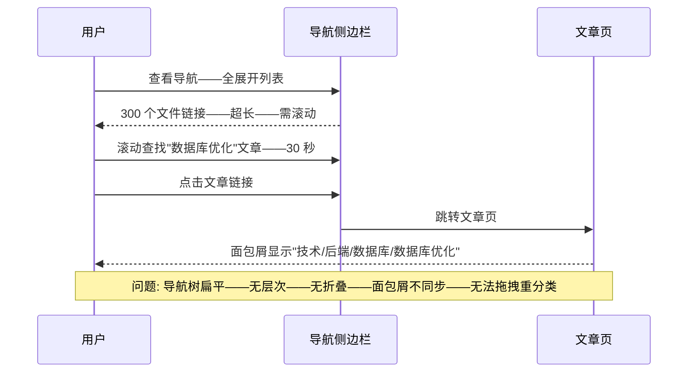
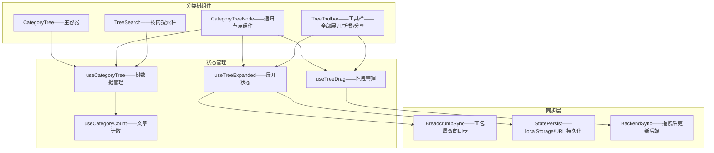
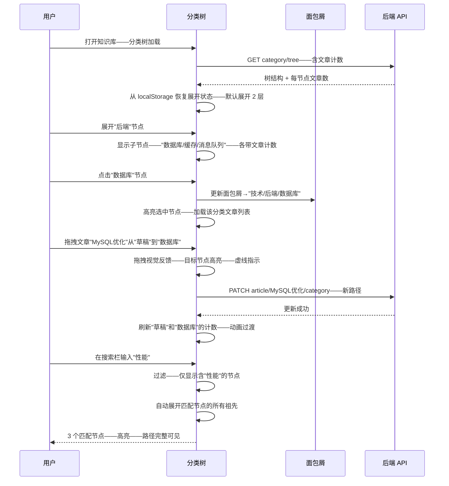

# YK-09-198: 内容分类树组件 — 可展开/折叠、节点文章计数、拖拽重分类、树内搜索、面包屑同步

> 需求编号: YK-09-198 · 优先级: P2 · 人天: 0.3d · 状态: 需求已编写
> 依赖: YK-09-112（内容导航树优化——分类树是导航树的核心升级——提供更丰富的交互能力）、YK-09-188（内容导航面包屑——分类树与面包屑双向同步）

## 背景

### 问题陈述

YiKnowledge 知识库的内容按层次化目录组织——知识领域/问题域/具体文件。但当前的目录导航仅是一个静态的扁平链接列表——缺少目录应有可视化和交互能力。用户在大型知识库中迷失方向——无法快速掌握目录结构——也无法高效定位到目标内容：

1. **目录无法展开折叠——深层内容不可见**: 当前目录展示为完整展开的链接列表——一个领域下 80 个文件全部列出——页面超长——用户滚动查找特定文件——效率极低——且视觉压力大
2. **无文章计数——节点"重量"不可感知**: 展开一个目录前——用户不知道其下有多少篇文章——可能是 2 篇也可能是 200 篇——无法决定是否值得展开——信息密度未知
3. **无法拖拽重分类——知识整理低效**: 知识库管理员需要将文章从"草稿"目录移动到"已发布"目录——当前需要手动编辑每篇文章的 frontmatter——修改 category 字段——逐篇操作——不支持可视化的拖拽操作
4. **无树内搜索——大海捞针**: 在 500 个节点的导航树中——用户想找到"性能优化"相关的目录——当前只能逐层展开肉眼搜索——或使用全局搜索（脱离导航上下文）
5. **面包屑与树不同步**: 当前文章页的面包屑是静态生成的——点击某个节点不会同步展开导航树到对应位置——导航树和面包屑是两个独立系统——用户感受断裂

**核心矛盾**: 层次化导航是知识库最基本的信息架构——但当前实现停留在"链接目录"的初级阶段——缺少交互式树形导航应该具备的展开/折叠、计数、拖拽、搜索和上下文同步能力。一个好的分类树让用户即时理解知识库结构——快速定位——轻松管理分类。

### 影响范围

| # | 影响 | 严重程度 | 典型场景 |
|---|------|----------|----------|
| 1 | 大型目录导航低效——滚动疲劳 | 高 | 一个领域下 80 篇文章——全展开——页面超长——滚动 15 秒找到目标 |
| 2 | 无节点容量感知——决策困难 | 中 | 展开"架构设计"——里面 200 篇文章——打开后后悔——但已花时间加载 |
| 3 | 重分类操作繁琐——管理员负担重 | 高 | 整理 30 篇文章的分类——需编辑 30 个 frontmatter——每篇 30 秒——总计 15 分钟 |
| 4 | 导航树中搜索效率低 | 中 | 500 个节点——找"性能"相关分类——7 层目录——每层手动展开搜索——2 分钟 |
| 5 | 面包屑与导航树断裂——用户迷路 | 中 | 面包屑显示"技术/后端/数据库"——但导航树折叠——用户找不到"数据库"节点在哪 |

### 挑战

| 挑战 | 说明 |
|------|------|
| 深层嵌套渲染性能 | 7 层目录——每层展开 10+ 节点——总可见节点可能 > 500——递归组件渲染性能 |
| 拖拽重分类的一致性 | 拖拽改变分类后——需同步更新 frontmatter 和 MongoDB 索引——前后端协作 |
| 文章计数的实时性 | 文章增删后计数需更新——轮询性能 vs 事件驱动 vs 缓存 TTL |
| 树内搜索的用户体验 | 搜索过滤后——匹配节点的祖先需自动展开——匹配结果需高亮——路径需完整显示 |
| 面包屑与树的同步方向 | 双向同步复杂度——面包屑变化→树展开 vs 树点击→面包屑更新——需要清晰的同步规则 |

---

## 一、现状分析

### 1.1 当前目录导航能力

```
YiKnowledge 目录导航现状:
├── 静态链接列表
│   ├── 全展开扁平列表——所有级别可见
│   └── 局限: 无折叠——超长——无层次缩进——视觉混乱
├── 面包屑导航
│   ├── 文章页顶部面包屑——显示当前路径
│   └── 局限: 仅展示——不可交互——不与导航树联动
├── 分类元数据
│   ├── frontmatter category——存储分类路径
│   └── 局限: 静态——无变化事件——无计数缓存
└── 缺失:
    ├── 树形展开/折叠: 点击节点展开子节点——折叠隐藏                         # ❌ 无
    ├── 文章计数: 节点旁显示文章数——目录容量可视化                           # ❌ 无
    ├── 拖拽重分类: 拖拽文章或子目录到新父节点——前端+后端同步                 # ❌ 无
    ├── 树内搜索: 输入关键词——过滤匹配节点——高亮——自动展开祖先               # ❌ 无
    ├── 面包屑同步: 点击面包屑节点——导航树自动展开到对应位置                   # ❌ 无
    ├── 键盘导航: 方向键展开/折叠/移动焦点                                   # ❌ 无
    └── 状态持久化: 记住展开/折叠状态——刷新页面恢复                          # ❌ 无
```

### 1.2 当前导航流程



### 1.3 根因矩阵

| 症状 | 根因 | 触发条件 | 频率 |
|------|------|----------|------|
| 导航超长——滚动疲劳 | 无展开/折叠——所有节点全量渲染 | 文件 > 50 个时 | 高 |
| 深层内容难以定位 | 无树内搜索——无目录结构可视化 | 层级 > 3 时 | 高 |
| 重分类操作繁琐 | 无拖拽——需手动编辑 frontmatter | 内容整理迁移时 | 中 |
| 节点内容量未知 | 无计数——展开前不知道有多少子内容 | 探索不熟悉的目录时 | 中 |
| 面包屑与导航断裂 | 两个独立组件——无双向同步机制 | 通过面包屑导航到深层内容后 | 中 |

---

## 二、设计决策

### 决策 1: 树组件实现方式 — 递归组件 vs 扁平列表+计算缩进 vs 第三方树库

| 选项 | 灵活性 | 性能 | 可维护性 |
|------|--------|------|---------|
| A: 递归 Vue 组件——CategoryTreeNode 递归渲染自身 | 最高——完全控制 | 中——递归开销 | 高——代码清晰 |
| B: 扁平列表+计算缩进——将树扁平化——paddingLeft=level×20 | 高 | 好——无递归 | 中——缩进计算繁琐 |
| C: 第三方树库（el-tree） | 低——API 受限 | 好——优化完善 | 低——依赖外部 |

**选择: A（递归 Vue 组件——CategoryTreeNode）。** 树形结构天然适合递归渲染——Vue 的递归组件支持 `<component :is>` 自动调用自身。每个节点管理自己的展开/折叠状态——逻辑内聚。递归组件配合 `<Transition>` 实现展开/折叠动画。扁平化方案在处理拖拽、缩进标注时复杂度反超递归方案。不引入第三方库——保持独立性和可定制性。

### 决策 2: 文章计数更新策略 — 实时查询 vs 定时刷新 vs 事件驱动

| 选项 | 实时性 | 性能 | 复杂度 |
|------|--------|------|--------|
| A: 每次展开节点时实时查询文章数 | 最高 | 差——频繁 API 调用 | 低 |
| B: 定时刷新——每 30 秒重新获取全部计数 | 中——30 秒延迟 | 中——1 次批量查询 | 低 |
| C: 事件驱动——文章增删时推送计数变更事件 | 最高 | 最好——仅更新变化的 | 高——需要事件系统 |

**选择: B + A 混合（初始批量加载 + 展开时实时校准）。** 页面加载时一次性获取全部节点的文章计数（批量聚合查询——MongoDB aggregation pipeline——1 次查询 500 节点 < 500ms）。用户展开节点时——触发该节点及其子节点的计数刷新——保证展开时看到的是最新数据。30 秒全量刷新作为后台兜底——用户长时间停留在页面时数据不陈旧。不需要复杂的事件系统——简单可维护。

### 决策 3: 拖拽重分类范围 — 仅文章 vs 文章+目录 vs 全部可拖拽

| 选项 | 灵活性 | 数据一致性风险 | 实现复杂度 |
|------|--------|--------------|---------|
| A: 仅文章可拖拽——目录固定 | 低 | 低 | 低 |
| B: 文章+目录可拖拽——目录可移动 | 高——支持目录重组 | 中——需防止循环 | 中 |
| C: 全部可拖拽——无限制 | 最高 | 高——循环/权限/状态 | 高 |

**选择: B + 防循环（文章+目录可拖拽——后端校验循环引用）。** 文章可拖拽到任意目录节点——更新 frontmatter category。目录也可拖拽——将其整个子树移动到新父目录——同时更新该目录下所有文件的 category 前缀。前端做基础循环检测（目标不能是源节点的后代）——后端做最终校验——拒绝不合法操作并返回错误说明。目录拖拽是高级功能——在 UI 中通过不同的拖拽手柄（目录节点左侧的拖拽图标）区分"拖拽排序（兄弟节点间）"和"拖拽移动（跨父节点）"。

### 决策 4: 树状态持久化 — localStorage vs sessionStorage vs URL vs 后端

| 选项 | 跨设备 | 容量 | 过期策略 |
|------|--------|------|---------|
| A: localStorage——持久存储展开节点 ID 集合 | 否——本地 | 5-10MB | 手动清除 |
| B: URL query——?expanded=node1,node2 | 是——可分享 | URL 长度限制 | 会话级 |
| C: 后端——用户偏好存储 | 是——跨设备 | 无限制 | 永久 |

**选择: A + B 组合（localStorage 持久——URL 用于分享）。** 默认从 localStorage 恢复展开状态——刷新页面不丢失——为用户提供"记住我的状态"体验。提供"分享当前树状态"按钮——将展开节点编码到 URL——适合将导航状态分享给他人。后端存储过于重量级——分类树状态不是关键的跨设备数据。首次加载无 local 存储时——默认展开至第 2 层（根节点+一级子节点）——平衡可见性和简洁性。

---

## 三、目标架构

### 3.1 分类树组件架构



### 3.2 分类树交互流程



### 3.3 性能指标

| 指标 | 改造前 | 改造后 |
|------|--------|--------|
| 500 文件导航定位 | ~30 秒（滚动查找） | < 5 秒（展开/搜索） |
| 重分类操作 | 30 秒/篇 × 30 篇 = 15 分钟 | 拖拽 2 秒/篇——批量 5 秒 |
| 面包屑与导航一致性 | 独立——不同步 | 双向同步——点击面包屑→树自动展开 |
| 目录结构理解 | 差——扁平无层次 | 好——树形缩进——容量可视化 |
| 展开状态保持 | 不保持——刷新重置 | localStorage 持久——分享 URL 支持 |

---

## 四、具体改动

### 4.1 核心代码: 分类树 Composable

```typescript
// src/composables/content/useCategoryTree.ts —— 新增

type CategoryNode = {
  id: string;
  name: string;
  path: string;          // 完整路径——如 "技术/后端/数据库"
  articleCount: number;
  children: CategoryNode[];
  depth: number;
  isLeaf: boolean;
};

type DragState = {
  isDragging: boolean;
  dragNode: CategoryNode | null;
  targetNode: CategoryNode | null;
  dropPosition: 'before' | 'inside' | 'after';
};

type TreeSearchState = {
  query: string;
  matchedNodeIds: Set<string>;
  expandedForSearch: Set<string>;  // 搜索自动展开的节点
};

function useCategoryTree() {
  const tree = ref<CategoryNode[]>([]);
  const loading = ref(false);
  const expandedIds = ref<Set<string>>(new Set());
  const selectedId = ref<string | null>(null);
  const dragState = reactive<DragState>({
    isDragging: false,
    dragNode: null,
    targetNode: null,
    dropPosition: 'inside',
  });
  const searchState = reactive<TreeSearchState>({
    query: '',
    matchedNodeIds: new Set(),
    expandedForSearch: new Set(),
  });

  /** 加载完整分类树 */
  async function loadTree(): Promise<void> { /* ... */ }

  /** 展开/折叠节点 */
  function toggleNode(nodeId: string): void { /* ... */ }

  /** 展开全部到指定层级 */
  function expandToLevel(level: number): void { /* ... */ }

  /** 选中节点——同步面包屑 */
  function selectNode(nodeId: string): void { /* ... */ }

  /** 从面包屑路径同步展开树 */
  function expandToPath(path: string): void { /* ... */ }

  /** 树内搜索 */
  function searchTree(query: string): void { /* ... */ }

  /** 拖拽移动文章/目录 */
  async function moveNode(sourceId: string, targetId: string, position: DragPosition): Promise<void> { /* ... */ }

  /** 持久化展开状态 */
  function persistExpanded(): void { /* ... */ }

  /** 恢复展开状态 */
  function restoreExpanded(): void { /* ... */ }

  return {
    tree, loading, expandedIds, selectedId, dragState, searchState,
    loadTree, toggleNode, expandToLevel, selectNode, expandToPath,
    searchTree, moveNode, persistExpanded, restoreExpanded,
  };
}
```

### 4.2 递归树节点组件

```typescript
// src/components/content/CategoryTreeNode.vue —— 新增

// 递归组件——每个节点渲染自身 + 递归渲染子节点
//
// Props:
//   node: CategoryNode
//   depth: number
//   expandedIds: Set<string>
//   selectedId: string | null
//   dragState: DragState
//
// 模板结构:
// <div class="tree-node" :style="{ paddingLeft: depth * 20 + 'px' }">
//   <span class="toggle-icon" @click="toggle">▶ / ▼</span>
//   <span class="node-icon">📁 / 📄</span>
//   <span class="node-name">{{ node.name }}</span>
//   <span class="node-count">({{ node.articleCount }})</span>
//   <Transition name="slide">
//     <CategoryTreeNode v-if="expanded" v-for="child in node.children" ... />
//   </Transition>
// </div>
```

### 4.3 文件变更清单

| 文件 | 操作 | 说明 |
|------|------|------|
| `src/composables/content/useCategoryTree.ts` | 新增 | 树数据/展开/选中/搜索/拖拽/持久化 |
| `src/composables/content/useCategoryCount.ts` | 新增 | 文章计数——批量聚合——增量更新 |
| `src/composables/content/useTreeDrag.ts` | 新增 | 拖拽逻辑——视觉反馈——循环检测 |
| `src/composables/content/useBreadcrumbSync.ts` | 新增 | 面包屑与分类树双向同步 |
| `src/components/content/CategoryTree.vue` | 新增 | 分类树主容器——搜索栏/工具栏/递归渲染 |
| `src/components/content/CategoryTreeNode.vue` | 新增 | 递归节点——展开折叠/拖拽/选中/计数 |
| `src/components/content/TreeSearch.vue` | 新增 | 树内搜索栏——过滤/高亮/自动展开 |
| `src/views/ContentLayout.vue` | 修改 | 侧边栏替换为分类树——集成面包屑同步 |
| `yiAi/services/knowledge/category_service.py` | 新增 | 分类树构建/计数聚合/移动分类 |

---

## 五、实施步骤

| 步骤 | 操作 | 路径 | 验证 | 人天 |
|------|------|------|------|------|
| 1 | 后端分类服务 | `category_service.py` | 树构建/聚合计数/移动分类/循环检测 | 0.04 |
| 2 | 实现分类树数据 Composable | `useCategoryTree.ts` | 加载/展开/选中/持久化 | 0.05 |
| 3 | 实现文章计数 Composable | `useCategoryCount.ts` | 批量计数/增量更新/TTL 缓存 | 0.03 |
| 4 | 实现递归树节点组件 | `CategoryTreeNode.vue` | 渲染/展开折叠动画/选中高亮/拖拽 | 0.06 |
| 5 | 实现树内搜索 | `TreeSearch.vue` | 过滤/高亮/自动展开祖先 | 0.03 |
| 6 | 实现拖拽和面包屑同步 | `useTreeDrag.ts + useBreadcrumbSync.ts` | 拖拽/DOM 操作/同步校验/面包屑联动 | 0.05 |
| 7 | 集成到内容布局 | `ContentLayout.vue` | 侧边栏替换/面包屑联动/全流程验收 | 0.04 |

**总人天: 0.3d**

---

## 六、测试规格

### 测试 1: 树展开折叠与动画

| 项目 | 内容 |
|------|------|
| 优先级 | P0 |
| 前置条件 | 分类树——3 层——每层 5 个节点 |
| 测试步骤 | 1. 点击"后端"节点展开 2. 查看子节点渲染和动画 3. 再次点击折叠 4. 点击"全部展开"工具栏按钮 5. 点击"全部折叠" |
| 预期结果 | 展开——子节点平滑滑入（slide 动画——200ms）——箭头图标旋转 90°——折叠——子节点滑出——全部展开——所有节点展开——全部折叠——仅根节点可见——箭头指向右侧——动画不卡顿——无布局跳动 |

### 测试 2: 文章计数展示

| 项目 | 内容 |
|------|------|
| 优先级 | P0 |
| 前置条件 | "数据库"目录下 15 篇文章——"MySQL"子目录 8 篇——"Redis"子目录 7 篇 |
| 测试步骤 | 1. 查看折叠状态下的"数据库"节点 2. 展开"数据库" 3. 查看子节点计数 4. 总和验证 |
| 预期结果 | "数据库"节点旁显示"(15)"——展开后——"MySQL"显示"(8)"——"Redis"显示"(7)"——子节点计数之和 = 父节点计数（不含直接在父目录下的文章时——父节点计数 = 子节点计数之和）——计数使用灰色小字——不喧宾夺主 |

### 测试 3: 树内搜索——过滤与自动展开

| 项目 | 内容 |
|------|------|
| 优先级 | P0 |
| 前置条件 | 树含 50 个节点——其中"性能优化"节点在"技术/后端/性能优化"——"前端性能"在"技术/前端/前端性能" |
| 测试步骤 | 1. 在搜索栏输入"性能" 2. 观察树变化 3. 清除搜索 |
| 预期结果 | 仅显示含"性能"的节点及其祖先——"技术"→"后端"→"性能优化"路径可见——"技术"→"前端"→"前端性能"路径可见——不匹配的节点隐藏——匹配文本高亮（黄色背景）——清除搜索——树恢复完整——已展开节点保持展开 |

### 测试 4: 拖拽文章重分类

| 项目 | 内容 |
|------|------|
| 优先级 | P1 |
| 前置条件 | 文章"MySQL 调优"在"草稿"目录——目标"数据库"目录 |
| 测试步骤 | 1. 拖拽"MySQL 调优"到"数据库"节点上 2. 观察拖拽视觉反馈 3. 松开鼠标 4. 观察计数更新 |
| 预期结果 | 拖拽时——文章跟随鼠标——"数据库"节点高亮——出现虚线框指示 drop zone——松开后——文章从"草稿"消失——"数据库"节点展开——文章出现在子列表中——"草稿"计数 -1——"数据库"计数 +1——API 调用更新 frontmatter category——有成功/失败 toast |

### 测试 5: 面包屑与树双向同步

| 项目 | 内容 |
|------|------|
| 优先级 | P1 |
| 前置条件 | 用户在文章页——面包屑显示"技术/后端/数据库"——分类树为折叠状态 |
| 测试步骤 | 1. 点击面包屑中的"后端"节点 2. 观察分类树 3. 点击面包屑中的"数据库"节点 |
| 预期结果 | 点击"后端"——分类树自动展开"技术"→"后端"——选中"后端"节点——加载该分类文章列表——点击"数据库"——树进一步展开——选中"数据库"——面包屑和导航树完全同步——双向操作一致 |

### 测试 6: 状态持久化——刷新恢复

| 项目 | 内容 |
|------|------|
| 优先级 | P1 |
| 前置条件 | 展开"技术/后端/数据库"和"设计/UI"——选中"数据库"节点 |
| 测试步骤 | 1. 展开和选中操作 2. 刷新浏览器页面 3. 查看分类树状态 |
| 预期结果 | 刷新后——"技术/后端/数据库"和"设计/UI"保持展开——"数据库"节点保持选中——面包屑正确——滚动位置恢复——localStorage 中存储展开和选中 ID |

---

## 七、风险与缓解

| 风险 | 概率 | 影响 | 缓解措施 |
|------|------|------|------|
| 深层嵌套拖拽循环引用——父拖到子 | 中 | 高 | 前端拖拽时检测目标是否为源的后代——遍历 children 链——后端最终校验并拒绝——返回明确错误 |
| 递归组件渲染过多——性能问题——1000+ 节点 | 中 | 中 | 默认折叠——展开需用户操作——使用 `<Transition>` 的 `appear` 属性优化首次渲染——可见节点数通常 < 200 |
| 树内搜索在大树上性能差——每次击键重新过滤 1000 节点 | 低 | 中 | 搜索使用 computed filter——Vue 缓存——防抖 150ms——仅在停止输入后执行——过滤操作 < 10ms |
| 计数不准确——文章增删后缓存未更新 | 中 | 低 | 展开时实时刷新——30 秒全量刷新兜底——计数旁显示"约"文字提示近似值 |
| 面包屑与树状态冲突——两个来源竞争选中状态 | 低 | 低 | 明确数据流——面包屑点击 → 树状态 → 文章列表——树点击 → 面包屑 → 文章列表——单向循环——最后操作者胜出 |

---

## 八、回滚策略

1. **功能级回滚**: 侧边栏恢复为原有扁平链接列表——面包屑恢复为静态展示——拖拽功能禁用
2. **代码级回滚**: 移除 CategoryTree/CategoryTreeNode/TreeSearch 组件——移除相关 composables——ContentLayout 恢复原有导航
3. **状态回滚**: 清除 localStorage 中的分类树展开状态——不产生副作用
4. **回滚验证**: 导航链接列表正常——面包屑正常——文章浏览正常——无控制台报错

---

## 九、设计决策记录

### D-01: 递归组件优于扁平化列表

**上下文**: 树形 UI 可以用递归组件实现——也可以将树扁平化为带缩进级别的列表。

**决策**: 使用 Vue 递归组件——CategoryTreeNode 递归渲染自身。

**理由**: 树形数据天然是递归结构——递归组件与之完美映射。每个节点组件管理自己的展开/折叠/拖拽状态——逻辑内聚——无需中央状态管理。扁平化方案的缩进计算、父子关系推导、拖拽位置判断等——最终代码量反而超过递归方案。Vue 的 `key` + `<Transition>` 在递归组件上工作良好——展开/折叠动画自然流畅。

### D-02: 文章计数使用缓存 + 增量刷新

**上下文**: 文章计数需要实时准确——但每次查询所有节点计数成本高。

**决策**: 页面加载时批量聚合计算——展开节点时单节点增量刷新——30 秒全量兜底。

**理由**: 批量聚合（MongoDB $group pipeline）高效——1 次查询获取所有计数。展开时增量刷新保证了交互时数据的准确——但仅刷新可见节点——成本可控。30 秒兜底防止长时间停留时计数过时。计数显示为"近似值"（灰色小字 + "约"前缀）——降低准确性预期——用户不会因差 1-2 而困惑。

### D-03: 拖拽仅前端+后端双重校验——防循环

**上下文**: 拖拽可能产生循环引用（父节点拖入其子节点）。

**决策**: 前端先做快速后代检测——拖拽过程中实时禁用不合法的 drop target——后端最终 API 校验拒绝。

**理由**: 前端校验提供即时视觉反馈——不合法的目标节点红色高亮——用户不会尝试无效操作。后端校验是安全兜底——防止前端逻辑漏洞和并发场景下的状态不一致。双重校验虽然冗余——但数据完整性优先于代码简洁性。

### D-04: 默认展开 2 层——平衡可见和简洁

**上下文**: 首次打开分类树时——展开所有节点 vs 折叠所有 vs 部分展开。

**决策**: 默认展开根节点 + 一级子节点（前 2 层）——总计约 15-20 个可见节点。

**理由**: 展开 2 层提供了足够的知识库结构概览——用户可以理解顶层分类和主要子类——同时不会因节点过多而信息过载。视觉上——2 层约 15-20 个节点——一屏可见——无需滚动。如果用户之前有存储的展开状态——使用存储的状态覆盖默认值。

---

## 十、可观测性

| 指标 | 采集方式 | 阈值 |
|------|----------|------|
| 树节点总数 | tree.length——递归计数 | 观测——> 1000 需性能优化 |
| 最大展开深度 | expandedIds 对应的节点最大 depth | 观测 |
| 树内搜索使用率 | searchTree 调用次数 / 页面加载次数 | 观测——高说明节点多需搜索辅助 |
| 拖拽操作频率 | moveNode 调用次数 | 观测 |
| 拖拽成功率 | 成功次数 / 尝试次数 | < 90% 说明防循环规则过严或 UX 问题 |
| 面包屑点击联动率 | expandToPath 调用次数 | 观测——高说明面包屑联动有价值 |
| 递归组件渲染时间 | mount 到内容可见 | < 200ms（200 可见节点） |

---

## 十一、代码审查检查清单

- [ ] `CategoryTreeNode`——`depth > 10` 时——停止递归——防止无限递归（数据中可能存在环）
- [ ] `CategoryTreeNode`——拖拽事件——`@dragstart/@dragover/@drop` ——阻止默认行为——正确处理 `dataTransfer`
- [ ] `useTreeDrag`——循环检测——遍历 dragNode 的所有后代——如果 target 是后代——阻止 drop
- [ ] `CategoryTree`——搜索时——`matchedNodeIds` 的祖先自动加入 `expandedIds` ——搜索结果始终可见
- [ ] `useBreadcrumbSync`——`watch` 面包屑变化——防抖 100ms——避免快速切换时的抖动
- [ ] `useCategoryCount`——计数为 0 时——显示"0"而非不显示——明确"空"状态
- [ ] 递归渲染——使用 `:key="node.id"` ——非 index——保证 Vue 正确追踪节点
- [ ] 拖拽结束后——清理 `dragState` ——移除所有拖拽相关 class——防止样式残留
- [ ] localStorage 读写——`try/catch` 包装——防止存储满或隐私模式下报错
- [ ] 树节点点击——区分"点击名称"(选中)和"点击箭头"(展开/折叠)——事件分离

---

## 回归问题预测

| # | 预测问题 | 触发条件 | 检测方式 |
|---|----------|----------|----------|
| 1 | 递归组件内存泄漏——节点未销毁 | 大量展开/折叠——Vue keep-alive 或过渡组件导致 DOM 残留 | 使用 `v-if` 而非 `v-show` 控制子节点——确保销毁——Chrome DevTools Memory Profiler 验证 |
| 2 | 拖拽到自身——无操作但 API 被调用 | 用户将节点拖到自身——松开——触发 moveNode(source, source) | 拖拽 drop 时检查 sourceId !== targetId——相同则忽略——不发 API |
| 3 | 文章计数溢出——计数 > 999 时显示异常 | 某分类下 1200 篇文章——计数撑破节点布局 | 计数 > 999 显示"999+"——tooltip 显示精确计数 |
| 4 | 搜索后展开状态——清除搜索时不恢复 | 搜索"性能"——自动展开了很多祖先——清除搜索——这些节点仍展开 | 搜索自动展开的节点 ID 单独存储在 `expandedForSearch` ——清除搜索时仅折叠这些节点——用户手动展开的节点不受影响 |
| 5 | 面包屑路径包含已删除的分类——树无法展开 | 分类被删除但某些文章 frontmatter 仍引用——面包屑生成旧路径 | 面包屑渲染时检查路径节点是否存在——不存在的灰色显示+删除线——"工具"提示分类已删除 |
| 6 | 递归组件深度限制——超过 10 层截断——用户困惑 | 数据有 12 层——第 11-12 层不渲染——用户看不到那些文章 | 深度 > 10 时显示"展开更多"按钮——点击后加载更深层级——分次加载——引导用户合理规划目录深度 |

---

## 性能分析

| 操作 | 数据量 | 耗时 | 说明 |
|------|--------|------|------|
| 树数据加载 | 500 节点——含计数 | < 500ms | API——MongoDB aggregation |
| 递归组件初始渲染 | 20 可见节点（默认 2 层） | < 100ms | Vue 递归——key diff |
| 展开节点动画 | 10 个子节点滑入 | ~200ms | CSS transition——height auto→具体值 |
| 树内搜索过滤 | 500 节点——匹配 15 个 | < 10ms | computed——纯前端 |
| 拖拽 drop 处理 | 单次——API 调用 | < 200ms | PATCH category——轻量 |
| 面包屑同步 | 路径→展开 3 层 | < 50ms | 递归查找——ID 比对 |

---

## 相关文档

- [内容导航树优化](../112-需求-内容导航树优化.md) — 导航树基础
- [内容导航面包屑](../188-需求-内容导航面包屑.md) — 面包屑组件
- [知识库目录结构优化](../43-需求-目录结构优化.md) — 目录结构设计原则
- [内容侧边栏导航](../189-需求-内容侧边栏导航.md) — 侧边栏集成

*PRD 来源: `projects/yiknowledge/requirements/2026-09/198-需求-内容分类树组件.md`*