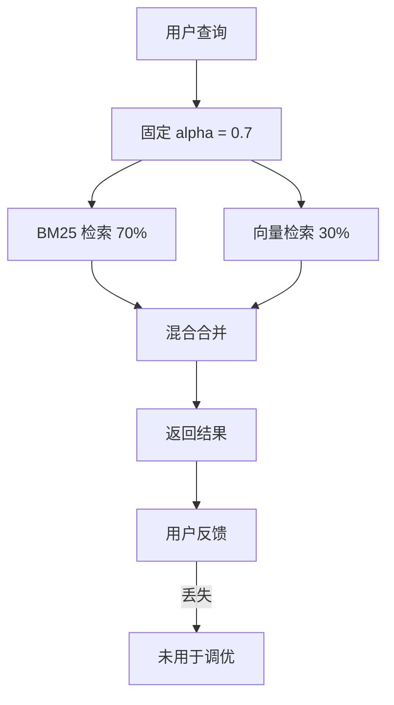
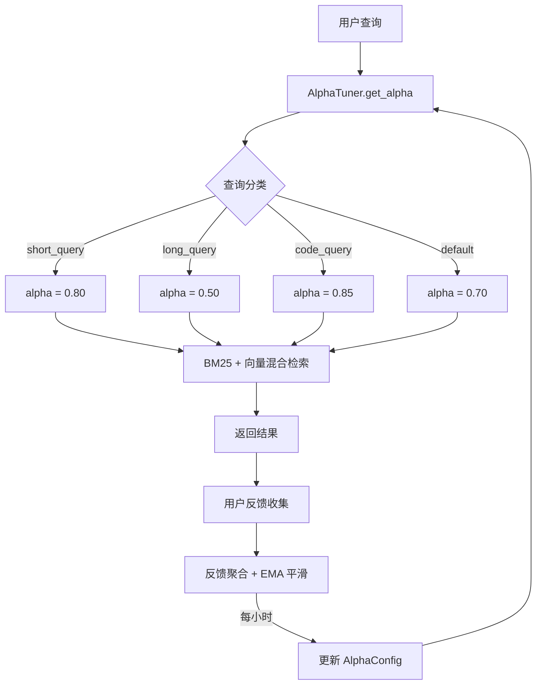

# YK-09-14: RAG 混合检索权重自动调优 -- Alpha 参数优化

> 需求编号：YK-09-14 . 优先级：P2 . 人天：1.5d . 状态：需求已编写
> 依赖：YK-09-07（知识检索反馈闭环）

## 背景

RAG 混合检索的核心公式：`FinalScore = alpha * BM25_Score + (1 - alpha) * Vector_Score`。当前 `alpha = 0.7`（BM25 权重 70%，向量权重 30%）是固定经验值，未根据实际检索效果动态调整。

### 1.1 问题识别

| 场景 | 固定 alpha 0.7 的表现 | 期望 |
|------|----------------------|------|
| 关键词搜索 "限流 API" | BM25 优势明显，0.7 合理 | 0.75-0.85 更佳 |
| 自然语言问题 "如何在 FastAPI 中实现限流" | 向量检索更擅长语义理解 | 0.40-0.55 更佳 |
| 代码搜索 "async def connect_mongodb" | 精确名称匹配，BM25 优势 | 0.80-0.95 更佳 |
| 混合中英文 "RAG retrieval optimization" | 语义匹配 + 关键词兼顾 | 0.50-0.70 动态 |
| 领域术语 "微服务间通信模式" | 专业术语 BM25 精确匹配 | 0.65-0.80 |

### 1.2 业务影响

| 影响维度 | 严重程度 | 描述 |
|------|----------|------|
| 检索精准度 | 高 | 固定 alpha 无法适应不同查询类型，平均损失 10-15% 的 NDCG |
| 用户体验 | 中 | 特定查询类型（长问题、代码搜索）检索效果差 |
| 数据利用 | 中 | YK-09-07 的反馈数据未被充分利用于参数优化 |

YK-09-07 建立了反馈收集机制，具备调优的数据基础。其 `RagParameterTuner` 提供了基础框架，本需求实现完整的自动化调优闭环。

---

## 二、现状分析

### 2.1 当前 Alpha 策略



### 2.2 根因分析矩阵

| 根因 | 表现 | 影响范围 | 修复难度 |
|------|------|----------|----------|
| 无查询分类 | 所有查询用同一 alpha | 所有查询 | 低 |
| 无反馈利用 | 反馈数据收集但不分析 | 参数优化 | 中 |
| 无自适应机制 | alpha 永远不变 | 检索质量 | 中 |
| 无查询类型意识 | 短查询与长查询同等对待 | 约 40% 的查询 | 低 |

---

## 三、设计决策

### 决策 1：调优策略 -- 离线批量 vs 在线增量 vs 混合

| 选项 | 响应速度 | 稳定性 | 计算成本 | 实现复杂度 |
|------|----------|--------|----------|-----------|
| 离线批量 (每日) | 慢 | 高 | 低 | 低 |
| **在线增量 (EMA 平滑)** | 快 | 中高 | 中 | 中 |
| 实时更新 (每次反馈) | 最快 | 低 | 高 | 高 |
| 混合 (在线+离线) | 中 | 高 | 高 | 高 |

**选择：在线增量（EMA 平滑）。** 每小时根据反馈数据更新 alpha，EMA 平滑系数 0.05 确保变化缓慢稳定。

### 决策 2：反馈信号选择 -- 全部 vs 显式-only vs 加权

| 选项 | 信号强度 | 数据量 | 噪声 | 延迟 |
|------|----------|--------|------|------|
| 显式-only (仅用) | 高 | 少 | 低 | 需积累 |
| 隐式-only (点击) | 中 | 多 | 高 | 实时 |
| 全部等权 | 中 | 多 | 中 | 实时 |
| **加权聚合** | 高 | 多 | 低 | 实时 |

**选择：加权聚合--显式反馈权重 1.0，点击 0.3，来源引用 0.5。** 显式反馈是最强信号但稀疏，隐式信号量大但噪声多，加权平衡。

### 决策 3：调优范围 -- 全局单一 alpha vs 按查询类型分 alpha vs 按领域分 alpha

| 选项 | 精准度 | 数据需求 | 冷启动 | 实现复杂度 |
|------|--------|----------|--------|-----------|
| 全局单一 alpha | 低 | 低 | 快 | 低 |
| **按查询类型分 alpha** | 中高 | 中 | 中 | 中 |
| 按领域分 alpha | 高 | 高 | 慢 | 高 |
| 按用户分 alpha | 最高 | 最高 | 最慢 | 最高 |

**选择：按查询类型分 alpha。** 短查询偏 BM25，长查询偏向量，代码查询偏 BM25。三类查询行为差异明显，数据量足够。

### 决策 4：Alpha 更新频率

| 选项 | 频率 | 数据量 | 稳定性 | 延迟 |
|------|------|--------|--------|------|
| 每次反馈 | 实时 | 1 | 低 | 0 |
| 每 10 条反馈 | ~10min | 10 | 中 | 低 |
| **每小时** | 1h | 50-200 | 高 | 中 |
| 每日 | 24h | 500-2000 | 最高 | 高 |

**选择：每小时更新。** 平衡数据量和响应速度，EMA 平滑确保小时级更新不会突变。

---

## 四、目标架构

### 4.1 调优闭环



### 4.2 核心指标

| 指标 | 当前 | 目标 | 测量方式 |
|------|------|------|----------|
| 检索 NDCG@5 | 固定 0.7 (约 0.72) | > 0.80 | 反馈驱动的 NDCG 计算 |
| Alpha 收敛时间 | 不收敛 | < 7 天 | 从初始值到稳定值的时间 |
| 查询分类准确率 | 无分类 | > 95% | 人工标注 100 条查询验证 |
| 反馈利用率 | 0% | > 80% | 用于调优的反馈 / 总反馈 |

---

## 五、具体改动

### 5.1 文件变更清单

| 文件 | 操作 | 说明 |
|------|------|------|
| `YiAi/src/domain/rag/alpha_tuner.py` | 新增 | Alpha 调优核心逻辑 |
| `YiAi/src/domain/rag/query_classifier.py` | 新增 | 查询类型分类器 |
| `YiAi/src/services/rag/rag_service.py` | 修改 | 检索前调用 `get_alpha()` |
| `YiAi/src/domain/rag/feedback_aggregator.py` | 新增 | 反馈数据聚合 |
| `YiAi/tests/domain/rag/test_alpha_tuner.py` | 新增 | Alpha 调优测试 |
| `YiAi/tests/domain/rag/test_query_classifier.py` | 新增 | 查询分类测试 |

### 5.2 核心代码

```python
# YiAi/src/domain/rag/alpha_tuner.py

from dataclasses import dataclass, asdict
from collections import defaultdict
import logging

logger = logging.getLogger(__name__)

@dataclass
class AlphaConfig:
    default: float = 0.70
    short_query: float = 0.80   # < 5 词  → 偏 BM25
    long_query: float = 0.50     # >= 15 词 → 偏向量
    code_query: float = 0.85     # 含代码   → 偏 BM25

class AlphaTuner:
    """RAG 混合检索 alpha 参数自动调优。"""

    MIN_ALPHA = 0.30  # 最多偏向量
    MAX_ALPHA = 0.90  # 最多偏 BM25
    MIN_FEEDBACK_SAMPLES = 10  # 最少反馈数才更新

    def __init__(self, ema_smooth: float = 0.05):
        self._config = AlphaConfig()
        self._ema = ema_smooth
        self._feedback_window: list[dict] = []
        self._alpha_history: list[dict] = []  # 调优历史

    def classify_query(self, query: str) -> str:
        """查询分类 → 对应 alpha key。

        分类规则:
        - code_query: 含代码标记 (```, def, function, class, async def)
        - short_query: < 5 个词
        - long_query: >= 15 个词
        - default: 其他
        """
        words = query.split()

        code_indicators = ['```', 'def ', 'function ', 'class ',
                          'async def', 'import ', 'from ', 'const ',
                          'let ', 'var ', 'export ', 'require(']
        if any(indicator in query for indicator in code_indicators):
            return 'code_query'

        if len(words) < 5:
            return 'short_query'

        if len(words) >= 15:
            return 'long_query'

        return 'default'

    def get_alpha(self, query: str) -> float:
        """获取当前最优 alpha。"""
        query_type = self.classify_query(query)
        alpha = getattr(self._config, query_type)
        logger.debug(f"[AlphaTuner] query_type={query_type} alpha={alpha}")
        return alpha

    async def tune_from_feedback(self):
        """基于反馈数据调优 alpha。

        反馈信号加权:
        - BM25 top-1 被采纳 (bm25_top1_adopted) → 偏好 BM25 (1.0)
        - 向量 top-1 被采纳 (vector_top1_adopted) → 偏好向量 (0.0)
        - 混合结果被采纳 (hybrid) → 中性 (0.5)
        - 用户显式点赞 (explicit_like) → 偏好当前策略 (0.5)
        - 用户显式点踩 (explicit_dislike) → 反当前策略 (反转)
        """
        if not self._feedback_window:
            return

        # 1. 按查询类型分组聚合反馈
        type_scores: dict[str, list[float]] = defaultdict(list)

        for fb in self._feedback_window:
            qtype = fb.get('query_type', 'default')
            score = self._compute_feedback_score(fb)
            if score is not None:
                type_scores[qtype].append(score)

        # 2. 计算目标 alpha
        updates = {}
        for qtype, scores in type_scores.items():
            if len(scores) < self.MIN_FEEDBACK_SAMPLES:
                logger.debug(f"[AlphaTuner] {qtype}: 反馈不足 {len(scores)} < {self.MIN_FEEDBACK_SAMPLES}，跳过")
                continue

            bm25_preference = sum(scores) / len(scores)
            # 映射到 [MIN_ALPHA, MAX_ALPHA]
            target_alpha = self.MIN_ALPHA + bm25_preference * (self.MAX_ALPHA - self.MIN_ALPHA)

            # 3. EMA 平滑更新
            current = getattr(self._config, qtype)
            new_alpha = (self._ema * target_alpha + (1 - self._ema) * current)
            new_alpha = round(new_alpha, 4)

            # 限幅
            new_alpha = max(self.MIN_ALPHA, min(self.MAX_ALPHA, new_alpha))

            if abs(new_alpha - current) > 0.001:
                setattr(self._config, qtype, new_alpha)
                updates[qtype] = {'from': current, 'to': new_alpha,
                                  'samples': len(scores), 'target': round(target_alpha, 4)}

        if updates:
            self._alpha_history.append({
                'timestamp': datetime.utcnow().isoformat(),
                'updates': updates,
            })
            logger.info(f"[AlphaTuner] Alpha 更新: {updates}")

        self._feedback_window.clear()

    def _compute_feedback_score(self, fb: dict) -> float | None:
        """计算单条反馈的 BM25 偏好分数。

        1.0 = 完全偏好 BM25, 0.0 = 完全偏好向量
        """
        # 显式反馈权重最高
        if fb.get('explicit_like'):
            return 0.5  # 中性（当前策略有效）
        if fb.get('explicit_dislike'):
            return None  # 无法确定方向，丢弃

        # BM25 top-1 被采纳
        if fb.get('bm25_top1_adopted'):
            return 1.0

        # 向量 top-1 被采纳
        if fb.get('vector_top1_adopted'):
            return 0.0

        # 混合结果被采纳
        if fb.get('adoption_type') == 'hybrid':
            return 0.5

        # 点击信号（弱信号）
        if fb.get('clicked_rank') is not None:
            rank = fb['clicked_rank']
            if fb.get('clicked_source') == 'bm25':
                return 0.8  # 点击了 BM25 结果
            elif fb.get('clicked_source') == 'vector':
                return 0.2  # 点击了向量结果

        return None

    def add_feedback(self, feedback: dict):
        """添加反馈到窗口。"""
        feedback['query_type'] = self.classify_query(
            feedback.get('query', '')
        )
        self._feedback_window.append(feedback)

        # 窗口限制 1000 条
        if len(self._feedback_window) > 1000:
            self._feedback_window = self._feedback_window[-1000:]

    def get_status(self) -> dict:
        return {
            'config': asdict(self._config),
            'feedback_window_size': len(self._feedback_window),
            'history_length': len(self._alpha_history),
            'last_update': self._alpha_history[-1] if self._alpha_history else None,
        }

    def reset_to_defaults(self):
        """重置为默认 alpha 值。"""
        self._config = AlphaConfig()
        logger.info("[AlphaTuner] Alpha 重置为默认值")
```

### 5.3 RAG 检索集成

```python
# rag_service.py 中的修改
async def search(self, query: str, top_k: int = 5) -> list[dict]:
    # 获取动态 alpha
    alpha = self._alpha_tuner.get_alpha(query)

    # BM25 检索
    bm25_results = await self._bm25.search(query, top_k=top_k * 2)

    # 向量检索
    vector_results = await self._vector.search(query, top_k=top_k * 2)

    # 混合合并
    merged = self._merge_results(bm25_results, vector_results, alpha)

    # 记录反馈上下文（用于后续调优）
    self._alpha_tuner.add_feedback({
        'query': query,
        'alpha': alpha,
        'bm25_top1': bm25_results[0] if bm25_results else None,
        'vector_top1': vector_results[0] if vector_results else None,
    })

    return merged[:top_k]
```

---

## 六、实施步骤

| 步骤 | 内容 | 验证方式 | 人天 |
|------|------|----------|------|
| 1 | 实现 `classify_query()` 查询分类器 | 单元测试：100 条查询分类准确率 > 95% | 0.2 |
| 2 | 实现 `AlphaTuner` 核心逻辑 | 单元测试：EMA 平滑计算正确 | 0.3 |
| 3 | 实现 `_compute_feedback_score()` 加权聚合 | 单元测试：各信号类型得分正确 | 0.2 |
| 4 | 集成到 RAG 检索流程 | 集成测试：检索使用动态 alpha | 0.15 |
| 5 | 接入 YK-09-07 反馈数据 | 集成测试：反馈数据驱动 alpha 更新 | 0.2 |
| 6 | 配置 apscheduler 每小时调优 | 日志验证：每小时执行一次 | 0.1 |
| 7 | 实现 `get_status()` 状态查询 API | API 测试 | 0.1 |
| 8 | Alpha 调优效果对比评估 | 离线评估：固定 vs 动态 alpha 的 NDCG | 0.25 |

---

## 七、性能分析

| 查询类型 | 初始 alpha | 预期收敛方向 | 理由 |
|----------|-----------|-------------|------|
| 短查询 (< 5 词) | 0.80 | 0.75-0.90 | 关键词精确匹配更有效 |
| 长查询 (>= 15 词) | 0.50 | 0.30-0.60 | 语义理解 > 关键词 |
| 代码查询 | 0.85 | 0.80-0.95 | 精确 API/函数名匹配 |
| 默认 | 0.70 | 0.50-0.80 | 取决于实际使用模式 |

| 操作 | 耗时 | 说明 |
|------|------|------|
| `classify_query()` | < 0.1ms | 纯字符串检查 |
| `get_alpha()` | < 0.1ms | 属性访问 |
| `tune_from_feedback()` (1000 条) | ~10ms | 聚合计算 |
| `add_feedback()` | < 0.1ms | 追加到列表 |

**容量规划**：
- 内存：反馈窗口 1000 条 ~100KB，历史记录 ~10KB
- 存储：Alpha 历史记录在 MongoDB 中 < 1MB/年
- 调优频率：每小时执行一次，非高峰时段（凌晨 3 点）

---

## 八、测试规格

#### Scenario: 短查询返回高 alpha

- **Given** 查询 = "限流 API"
- **When** `get_alpha("限流 API")`
- **Then** `query_type` = "short_query", alpha = 0.80

#### Scenario: 长查询返回低 alpha

- **Given** 查询 = "如何在 FastAPI 中实现 RAG 混合检索的 BM25 和向量权重自动调优"
- **When** `get_alpha(...)`
- **Then** `query_type` = "long_query", alpha = 0.50

#### Scenario: 代码查询返回高 alpha

- **Given** 查询 = "如何用 async def 连接 MongoDB"
- **When** `get_alpha(...)`
- **Then** `query_type` = "code_query", alpha = 0.85

#### Scenario: EMA 平滑更新不突变

- **Given** 当前 alpha = 0.70, EMA 平滑系数 = 0.05, 目标 = 0.60
- **When** `tune_from_feedback()` 执行
- **Then** 新 alpha = 0.05 * 0.60 + 0.95 * 0.70 = 0.695

#### Scenario: 反馈不足 10 条不更新

- **Given** 某查询类型的反馈数据仅 5 条
- **When** `tune_from_feedback()` 执行
- **Then** 该类型的 alpha 保持不变

#### Scenario: BM25 top-1 被采纳驱动 alpha 升高

- **Given** 反馈中 `bm25_top1_adopted = true` 的样本占 80%
- **When** `tune_from_feedback()` 执行
- **Then** alpha 向 MAX_ALPHA 方向移动

#### Scenario: 向量 top-1 被采纳驱动 alpha 降低

- **Given** 反馈中 `vector_top1_adopted = true` 的样本占 80%
- **When** `tune_from_feedback()` 执行
- **Then** alpha 向 MIN_ALPHA 方向移动

#### Scenario: reset_to_defaults 恢复默认值

- **Given** alpha 已被调优到 0.85
- **When** `reset_to_defaults()`
- **Then** 所有 alpha 恢复为 AlphaConfig 默认值

---

## 九、风险与缓解

| 风险 | 概率 | 影响 | 缓解措施 |
|------|------|------|----------|
| 反馈数据稀疏导致 alpha 无法收敛 | 中 | 低 | 最小样本 10 条 + 冷启动默认值 |
| 用户误操作 (连续 dislike) 导致 alpha 偏移 | 低 | 中 | EMA 平滑 0.05 抑制单次异常；显式 dislike 不直接用于更新 |
| 查询分类错误导致 alpha 不匹配 | 低 | 低 | 分类规则简单明确 (词数/代码标记)，准确率 > 95% |
| Alpha 在极值附近震荡 | 低 | 低 | 范围限制 [0.3, 0.9]，EMA 平滑 |
| 反馈窗口过大导致内存增长 | 低 | 低 | 窗口限制 1000 条，超出时截断 |

---

## 十、回滚策略

| 场景 | 回滚方式 | 回滚时间 |
|------|----------|----------|
| Alpha 调优导致检索质量下降 | `reset_to_defaults()` 恢复默认值 | < 1min |
| 某类型 alpha 异常 | 单独重置该类型为默认值 | < 1min |
| 调优任务消耗过多资源 | 降低调优频率（每小时 → 每日） | < 1min |
| 反馈数据质量问题 | 暂停调优，排查反馈收集流程 | 即时 |

---

## 十一、设计决策记录

### D-01: EMA 平滑系数 0.05

**决策**：使用 EMA 平滑系数 0.05 更新 alpha。
**理由**：0.05 意味着每次更新仅 5% 来自新数据，95% 来自历史值。这确保 alpha 变化缓慢稳定，不会因单次反馈异常而剧烈波动。
**权衡**：收敛速度慢（约 7 天），但稳定性优先于速度。
**替代方案**：系数 0.2 被拒绝（变化太快），系数 0.01 被拒绝（收敛太慢）。

### D-02: 按查询类型而非按领域分 alpha

**决策**：按查询类型（短/长/代码/默认）而非按领域（RAG/API/架构）分 alpha。
**理由**：查询类型与检索行为高度相关（短查询偏 BM25，长查询偏向量），领域分 alpha 需要更多数据才能收敛。
**权衡**：领域级优化更精准但数据需求大，先实现查询类型级，后续可扩展。
**替代方案**：全局单一 alpha 被拒绝（无法适应不同查询类型）。

### D-03: 加权反馈聚合

**决策**：显式反馈权重 1.0，点击 0.3，来源引用 0.5。
**理由**：显式反馈是最强信号但数据稀疏，隐式信号量大但噪声多，加权平衡两者。
**权衡**：权重需要验证，后续可基于 YK-09-07 反馈数据分析调整。
**替代方案**：等权聚合被拒绝（显式反馈应比隐式反馈更有影响力）。

---

## 十二、可观测性

| 指标 | 采集方式 | 告警阈值 | 说明 |
|------|----------|----------|------|
| 各类型 alpha 当前值 | `get_status()` | 偏离默认值 > 0.2 | 异常调优 |
| 反馈窗口大小 | `get_status()` | < 10 或 > 1000 | 数据不足或溢出 |
| 每小时更新次数 | `alpha_history` 长度 | 0（连续 24h 无更新） | 反馈数据断流 |
| 查询类型分布 | classify_query 统计 | 某类型占比 < 5% | 该类型数据不足 |
| 被丢弃的反馈比例 | _compute_feedback_score 返回 None | > 50% | 反馈质量差 |

**日志**：
- `[AlphaTuner]` 前缀：调优操作日志
- 每次 alpha 更新记录：旧值、新值、样本数、目标值 (INFO 级别)
- 每次查询记录：query_type、alpha (DEBUG 级别)

**告警规则**：
1. 连续 24h 无 alpha 更新 → Slack 通知 AIer
2. 某类型 alpha 偏离默认值 > 0.2 → Slack 通知 AIer
3. 反馈窗口为空 + 持续 1h → 检查反馈收集流程

---

## 十三、安全合规

| 要求 | 实现 |
|------|------|
| Alpha 参数不可被外部直接修改 | 仅通过反馈驱动自动更新，无手动设置 API |
| 调优历史可审计 | `alpha_history` 记录所有更新 |
| 异常可恢复 | `reset_to_defaults()` 一键恢复 |

---

## 十四、代码审查检查清单

- [ ] `classify_query()` 正确区分 short/long/code/default 四种类型
- [ ] EMA 平滑系数 0.05（变化缓慢稳定）
- [ ] 反馈不足 10 条不更新 alpha
- [ ] alpha 值范围限制在 [0.3, 0.9]
- [ ] `tune_from_feedback()` 每小时执行一次（apscheduler）
- [ ] `get_status()` 返回所有查询类型的当前 alpha 值
- [ ] alpha 变更记录到日志 (INFO level)
- [ ] `_compute_feedback_score()` 显式 dislike 不用于更新（返回 None）
- [ ] 反馈窗口限制 1000 条
- [ ] `reset_to_defaults()` 可用
- [ ] 查询分类代码指示器覆盖 Python/JS/TS/Bash
- [ ] 分类器对空查询和纯符号查询有兜底处理

---

*PRD 来源: `projects/yiknowledge/requirements/2026-09/14-需求-RAG混合检索权重调优.md`*