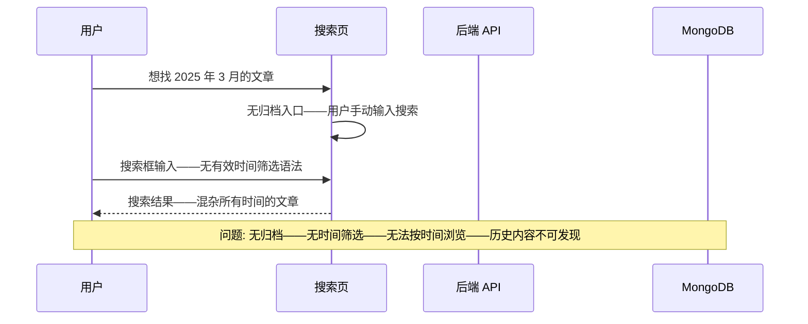
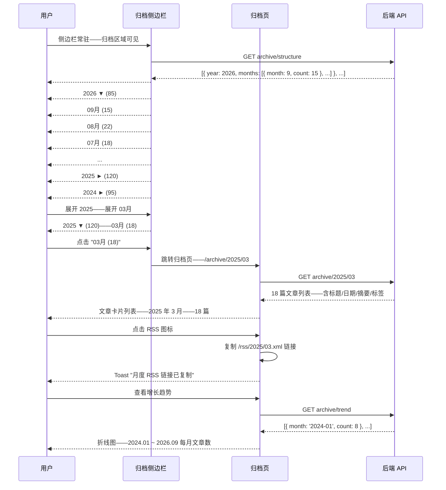

# YK-09-199: 内容时间归档 — 年/月分组、归档侧边栏、每期文章计数、可展开月份、每期 RSS

> 需求编号: YK-09-199 · 优先级: P2 · 人天: 0.3d · 状态: 需求已编写
> 依赖: YK-09-132（内容归档策略——时间归档是归档策略的可视化实现）、YK-09-173（内容 RSS 多格式输出——每期 RSS Feed 依赖 RSS 输出基础设施）

## 背景

### 问题陈述

YiKnowledge 知识库按时间推移持续增长——文章数量已达数百篇——且每月都在增加。但知识库的内容组织方式以主题分类和标签为主——缺失了时间维度的浏览入口。用户无法按时间线浏览知识库的成长历程——无法快速定位某个时间段的热门内容——也无法订阅特定时间段的更新：

1. **无时间维度内容浏览**: 用户想了解"2025 年第一季度写了哪些文章"——当前只能通过搜索筛选——需要记住具体关键词——无法按时间范围浏览——浏览体验差
2. **无法感知知识库成长节奏**: 管理者想知道知识库每月的增长趋势——哪个时期产出最高——当前只能通过手动统计——无直观的归档视图——无法回答"上个月新增了多少内容"
3. **历史内容难以发现**: 3 年前的高质量文章——因为没有出现在分类树的前几层——也没有出现在标签云的热门区域——慢慢沉入知识库深处——再也无人问津——但内容依然有价值
4. **无时间段 RSS 订阅**: 用户想订阅特定时间段的更新——如"仅关注 2026 年的新内容"——当前的全站 RSS 涵盖所有时间——无法按时间范围过滤——用户收到太多不感兴趣的历史内容
5. **归档页交互缺失**: 即使建立归档页面——当前的技术方案也只是静态列表——缺少展开/折叠、计数、高亮等高交互性功能——视觉单调——用户浏览意愿低

**核心矛盾**: 时间是内容组织的天然维度——博客、新闻站点都依赖归档作为核心导航——但 YiKnowledge 完全缺失时间线浏览能力。时间归档不仅让用户发现历史宝藏——也为管理者提供内容增长的可见性——是知识库成熟度的标志功能。

### 影响范围

| # | 影响 | 严重程度 | 典型场景 |
|---|------|----------|----------|
| 1 | 历史内容难以发现——沉入深处 | 高 | 2023 年的 5 篇架构设计文章——质量很高——但无人通过分类或标签找到——被遗忘 |
| 2 | 知识库增长不透明——管理盲区 | 中 | 管理者无法回答"上季度新增了多少内容"——汇报需要手动统计 |
| 3 | 时间范围内容订阅缺失 | 中 | 用户只想关注 2026 年新内容——全站 RSS 含 2023-2026 全部——噪音过大 |
| 4 | 内容时间线无视觉化——浏览动机低 | 中 | 如果归档只是一个年份链接列表——用户不愿意点开——缺少吸引人的视觉呈现 |
| 5 | 月度/年度趋势分析无法自助 | 中 | 需要定期报告内容产出趋势——当前需要导出数据到 Excel 手动分析 |

### 挑战

| 挑战 | 说明 |
|------|------|
| 归档数据聚合性能 | 数百篇文章——按年/月分组聚合——需要高效的 MongoDB aggregation pipeline |
| 时区处理 | 文章的 frontmatter created/updated 时间——需要明确时区——不同时区可能导致归档月份偏差 |
| 没有 created 日期的文章 | 部分旧文章 frontmatter 可能缺失 created 字段——需要降级策略（使用文件修改时间或 updated） |
| 归档视图与分类视图的协调 | 归档页如何与分类树和标签云共存——避免导航冗余——需要清晰的场景定位 |
| RSS 按时间段过滤 | 每期 RSS 的 URL 设计（/rss/2026/09.xml）——缓存策略——Feed 生成性能 |

---

## 一、现状分析

### 1.1 当前时间相关能力

```
YiKnowledge 时间相关功能现状:
├── 文章元数据
│   ├── frontmatter created/updated——每个文件都有（或应都有）
│   └── 局限: 仅元数据——无聚合——无归档展示
├── 文章列表排序
│   ├── 按创建时间倒序排列
│   └── 局限: 仅排序——无分组——无年/月层级
├── RSS Feed
│   ├── 全站 RSS——所有文章按时间倒序
│   └── 局限: 无时间段过滤——全量输出
├── 内容统计
│   ├── 静态统计页面——总数/分类分布
│   └── 局限: 无时间维度——无趋势——无月度统计
└── 缺失:
    ├── 时间归档视图: 年→月→文章——层级浏览                                # ❌ 无
    ├── 归档侧边栏: 侧边栏常驻——按年折叠——按月展开                           # ❌ 无
    ├── 每月文章计数: 每月括号显示文章数——一眼看出产出节奏                     # ❌ 无
    ├── 可展开月份: 展开月份——显示当月文章列表——点击跳转                       # ❌ 无
    ├── 每期 RSS: /rss/2026/09.xml——按月订阅更新                             # ❌ 无
    ├── 年度 RSS: /rss/2026.xml——按年订阅                                   # ❌ 无
    └── 内容增长趋势图: 折线图——每月新增文章数——同比环比                      # ❌ 无
```

### 1.2 当前时间维度数据流



### 1.3 根因矩阵

| 症状 | 根因 | 触发条件 | 频率 |
|------|------|----------|------|
| 无法按时间浏览 | 无归档视图——无年/月分组——无时间筛选 | 用户想浏览某时间段内容 | 高 |
| 历史内容不可发现 | 缺少时间维度的内容发现入口——分类和标签无时间信息 | 内容 > 6 个月——沉入深处 | 高 |
| 内容增长趋势不可见 | 无月度统计——无时间聚合——无趋势图 | 管理汇报/内容策略评估 | 中 |
| 时间段 RSS 缺失 | RSS 全量——无按时间过滤——用户噪音大 | 用户只想关注近期内容 | 中 |
| 归档入口不醒目 | 归档需要专门的导航入口——当前无 | 用户不知道可以按时间浏览 | 中 |

---

## 二、设计决策

### 决策 1: 归档组织结构 — 年/月层级 vs 季度/月 vs 时间线

| 选项 | 粒度 | 视觉简洁度 | 适用场景 |
|------|------|-----------|---------|
| A: 年→月 两层——展开年→显示月列表 | 中 | 高——简洁 | 通用——主流博客采用 |
| B: 季度→月 三层——年→季度→月 | 细——三层 | 低——层级多 | 大型知识库 > 500 篇/年 |
| C: 时间线——按日期排序的流式布局 | 最细 | 中 | 内容量不大——注重浏览体验 |

**选择: A（年→月 两层——展开年→月列表）。** 两层结构是归档 UI 的行业标准（WordPress、Medium、GitHub Blog 均采用）——用户已有认知。YiKnowledge 当前约 800 篇文章——分布在 3 个年份——每月的文章数从 5 到 50 不等——两层足够清晰。未来内容量增长后——可在年内增加到月→周或月→日的粒度——但近期不需要。

### 决策 2: 归档展示位置 — 独立页面 vs 侧边栏组件 vs 两者兼有

| 选项 | 可发现性 | 空间占用 | 上下文保留 |
|------|---------|---------|-----------|
| A: 独立归档页面——/archive——完整视图 | 中——需导航入口 | 充足——全页 | 低——离开当前浏览上下文 |
| B: 侧边栏组件——常驻侧边栏——紧凑视图 | 高——始终可见 | 有限——需紧凑设计 | 高——不影响主内容区 |
| C: 两者兼有——侧边栏紧凑版 + 独立页面完整版 | 最高 | — | 最高 |

**选择: C（两者兼有——侧边栏紧凑归档 + 独立归档页）。** 侧边栏版本常驻——紧凑——显示年列表——可展开到月——点击月跳转到月份文章列表或独立归档页。独立归档页包含完整视图——含文章标题、摘要、标签——含内容增长趋势图——作为核心导航页之一。侧边栏提供即时访问——独立页提供深度浏览——互不冲突——通过"查看完整归档"链接关联。

### 决策 3: 缺少 created 日期的文章处理 — 跳过 vs 单独分组 vs 降级

| 选项 | 数据完整性 | 用户体验 | 实现 |
|------|-----------|---------|------|
| A: 跳过不显示——仅归档有 created 的文章 | 低——缺失数据 | 差——部分文章不可发现 | 低 |
| B: 单独分组——"日期未知" 分组——在归档底部 | 高 | 中——提示数据质量问题 | 低 |
| C: 降级使用 updated 或文件修改时间——标记"估计日期" | 中——日期不精确 | 好——全部可归档 | 中 |

**选择: C + B 组合（降级使用 updated——标记估计——无法降级的归入"日期未知"）。** 优先使用 created——不存在则降级为 updated——再降级为文件系统 mtime——在归档中该文章的日期旁显示"~"标记——hover tooltip "估计日期（原始创建日期已丢失）"。created/updated/mtime 都没有的归入"日期未知"分组——归档底部显示——提示管理员补充元数据。降级策略确保了最大覆盖——同时透明地标注数据质量问题。

### 决策 4: 每期 RSS 的 URL 和缓存策略

| 选项 | URL 方案 | 缓存 | 生成策略 |
|------|---------|------|---------|
| A: /rss/{year}/{month}.xml——按路径 | 语义清晰 | CDN 缓存——15 分钟 | 按需生成 |
| B: /rss?year=2026&month=09——查询参数 | 灵活 | CDN 缓存——同左 | 按需 |
| C: /rss/archive-2026-09.xml——扁平命名 | 简单 | CDN 缓存——同左 | 预生成 |

**选择: A（/rss/{year}/{month}.xml——路径式 URL）。** 路径式 URL 语义清晰——CDN 天然支持路径级缓存——SEO 友好（RSS 阅读器解析 URL 更自然）。按需生成——首次请求时从 MongoDB 查询该时间段的文章——生成 RSS XML——结果缓存 15 分钟。月度文章数 < 100 篇——生成 < 100ms——性能足够。同时提供年度 RSS /rss/{year}.xml——聚合该年所有文章。

---

## 三、目标架构

### 3.1 时间归档系统架构

```mermaid
graph TD
    subgraph UI[归档 UI 层]
        A[ArchiveSidebar——归档侧边栏]
        B[ArchivePage——独立归档页]
        C[MonthArticleList——月文章列表]
        D[GrowthTrendChart——增长趋势图]
        E[RssLink——RSS 订阅链接]
    end

    subgraph Logic[归档逻辑层]
        F[useArchive——归档数据管理]
        G[TimeAggregator——时间聚合器]
        H[DateFallback——日期降级策略]
        I[useRssFeed——RSS 生成]
    end

    subgraph Backend[后端服务]
        J[GET archive/structure——年/月/计数结构]
        K[GET archive/{year}/{month}——月文章列表]
        L[GET archive/trend——增长趋势数据]
        M[GET rss/{year}/{month}.xml——月度 RSS]
    end

    A --> F
    B --> F
    C --> F
    D --> F
    E --> I
    F --> G
    F --> H
    F --> J
    F --> K
    G --> L
    I --> M
```

### 3.2 归档浏览交互流程



### 3.3 性能指标

| 指标 | 改造前 | 改造后 |
|------|--------|--------|
| 按时间浏览 | 不支持 | 年→月→文章——3 点击——< 3 秒到达目标 |
| 历史内容发现 | 通过搜索（需记住关键词） | 归档浏览——翻看历史年份——发现意外内容 |
| 月度增长可见性 | 0——无统计 | 折线图 + 每月计数——一眼看出趋势 |
| 时间段 RSS 订阅 | 仅全站 RSS | 12 个月的月度 RSS + 每年的年度 RSS |
| 归档数据加载 | — | 结构 < 100ms——月文章列表 < 200ms |

---

## 四、具体改动

### 4.1 核心代码: 归档 Composable

```typescript
// src/composables/content/useArchive.ts —— 新增

type ArchiveYear = {
  year: number;
  totalCount: number;
  months: ArchiveMonth[];
};

type ArchiveMonth = {
  year: number;
  month: number;         // 1-12
  count: number;
  isEstimated: boolean;  // 是否有使用降级日期的文章
};

type ArchiveArticle = {
  id: string;
  title: string;
  path: string;
  created: string;       // ISO date
  isDateEstimated: boolean;
  summary: string;
  tags: string[];
  category: string;
};

type GrowthTrend = {
  month: string;         // "2024-01"
  count: number;
}[];

function useArchive() {
  const years = ref<ArchiveYear[]>([]);
  const loading = ref(false);
  const selectedYear = ref<number | null>(null);
  const selectedMonth = ref<number | null>(null);
  const articles = ref<ArchiveArticle[]>([]);
  const trend = ref<GrowthTrend>([]);

  /** 加载归档结构——年/月/计数 */
  async function loadArchiveStructure(): Promise<ArchiveYear[]> { /* ... */ }

  /** 加载指定月份的文章列表 */
  async function loadMonthArticles(year: number, month: number): Promise<ArchiveArticle[]> { /* ... */ }

  /** 加载内容增长趋势 */
  async function loadGrowthTrend(months?: number): Promise<GrowthTrend> { /* ... */ }

  /** 生成月度 RSS URL */
  function getRssUrl(year: number, month?: number): string {
    if (month) return `/rss/${year}/${String(month).padStart(2, '0')}.xml`;
    return `/rss/${year}.xml`;
  }

  /** 格式化年份标签 */
  function formatYearLabel(yearData: ArchiveYear): string {
    return `${yearData.year} 年 (${yearData.totalCount})`;
  }

  /** 格式化月份标签 */
  function formatMonthLabel(month: ArchiveMonth): string {
    return `${String(month.month).padStart(2, '0')}月 (${month.count})${month.isEstimated ? ' ~' : ''}`;
  }

  return {
    years, loading, selectedYear, selectedMonth, articles, trend,
    loadArchiveStructure, loadMonthArticles, loadGrowthTrend,
    getRssUrl, formatYearLabel, formatMonthLabel,
  };
}
```

### 4.2 日期降级策略

```typescript
// src/composables/content/useDateFallback.ts —— 新增

type DateSource = 'created' | 'updated' | 'mtime' | 'unknown';

type DateResult = {
  date: Date;
  source: DateSource;
  isEstimated: boolean;
};

/**
 * 获取文章的最佳可用日期——按优先级降级
 * 优先级: frontmatter.created > frontmatter.updated > file.mtime > unknown
 */
function getBestDate(article: ArticleMetadata): DateResult {
  // 1. 尝试 created
  if (article.frontmatter?.created) {
    const date = parseDate(article.frontmatter.created);
    if (date) return { date, source: 'created', isEstimated: false };
  }

  // 2. 降级到 updated
  if (article.frontmatter?.updated) {
    const date = parseDate(article.frontmatter.updated);
    if (date) return { date, source: 'updated', isEstimated: true };
  }

  // 3. 降级到文件修改时间
  if (article.file_mtime) {
    const date = parseDate(article.file_mtime);
    if (date) return { date, source: 'mtime', isEstimated: true };
  }

  // 4. 无法确定日期
  return { date: new Date(0), source: 'unknown', isEstimated: true };
}

function parseDate(value: string | Date): Date | null {
  if (value instanceof Date) return isNaN(value.getTime()) ? null : value;
  const parsed = new Date(value);
  return isNaN(parsed.getTime()) ? null : parsed;
}
```

### 4.3 文件变更清单

| 文件 | 操作 | 说明 |
|------|------|------|
| `src/composables/content/useArchive.ts` | 新增 | 归档数据——结构/文章/趋势/RSS URL |
| `src/composables/content/useDateFallback.ts` | 新增 | 日期降级策略——created→updated→mtime |
| `src/components/content/ArchiveSidebar.vue` | 新增 | 归档侧边栏——年/月展开折叠——计数 |
| `src/views/ArchivePage.vue` | 新增 | 独立归档页——文章列表/趋势图/RSS |
| `src/components/content/ArchiveYearGroup.vue` | 新增 | 年份分组——展开月份列表 |
| `src/components/content/ArchiveMonthList.vue` | 新增 | 月文章列表——标题/日期/摘要/标签/RSS |
| `src/components/content/GrowthTrendChart.vue` | 新增 | 增长趋势折线图——每月文章数 |
| `src/views/ContentLayout.vue` | 修改 | 侧边栏增加归档区域 |
| `src/router/content.ts` | 修改 | 新增 /archive 和 /archive/:year/:month 路由 |
| `yiAi/services/knowledge/archive_service.py` | 新增 | 归档聚合/按时间段查询/趋势统计/RSS生成 |

---

## 五、实施步骤

| 步骤 | 操作 | 路径 | 验证 | 人天 |
|------|------|------|------|------|
| 1 | 后端归档服务 | `archive_service.py` | MongoDB 聚合/时间分组/趋势/RSS | 0.04 |
| 2 | 实现归档数据 Composable | `useArchive.ts` | 结构/文章/趋势/RSS URL | 0.04 |
| 3 | 实现日期降级策略 | `useDateFallback.ts` | created→updated→mtime 降级链 | 0.02 |
| 4 | 实现归档侧边栏 | `ArchiveSidebar.vue` | 年/月展开折叠/计数/跳转 | 0.05 |
| 5 | 实现独立归档页面 | `ArchivePage.vue + ArchiveYearGroup + ArchiveMonthList` | 完整归档视图/文章列表/RSS | 0.06 |
| 6 | 实现增长趋势图 | `GrowthTrendChart.vue` | 折线图——每月文章数——hover 详情 | 0.04 |
| 7 | 集成到内容布局和路由 | `ContentLayout.vue + content.ts` | 侧边栏归档区/路由/全流程 | 0.05 |

**总人天: 0.3d**

---

## 六、测试规格

### 测试 1: 归档结构加载——年/月/计数

| 项目 | 内容 |
|------|------|
| 优先级 | P0 |
| 前置条件 | 知识库含 2024-2026 三年的文章——分布不均——有的月 0 篇 |
| 测试步骤 | 1. 打开侧边栏归档区域 2. 查看年列表 3. 展开年份——查看月列表 |
| 预期结果 | 年份按倒序排列（2026→2025→2024）——每年显示总文章计数——展开 2026——显示 9 个月（1-9 月）——每月显示文章计数——文章数为 0 的月份不显示——日期含"~"标记的为估计日期——格式为"09月 (15)""08月 (22)" |

### 测试 2: 月文章列表加载

| 项目 | 内容 |
|------|------|
| 优先级 | P0 |
| 前置条件 | 2026 年 9 月有 15 篇文章 |
| 测试步骤 | 1. 点击归档侧边栏"09月 (15)" 2. 跳转归档页 /archive/2026/09 3. 查看文章列表 |
| 预期结果 | 页面标题"2026 年 9 月 · 15 篇文章"——文章列表按日期倒序——每篇文章显示标题/日期/摘要/标签——点击文章跳转文章页——面包屑显示"归档 / 2026 / 09"——顶部有 RSS 订阅链接图标 |

### 测试 3: 降级日期显示

| 项目 | 内容 |
|------|------|
| 优先级 | P1 |
| 前置条件 | 3 篇文章——A 有 created——B 仅有 updated——C 完全无日期信息 |
| 测试步骤 | 1. 查看归档——B 的日期显示——C 的位置 2. hover B 的日期 3. 查看文章详情页 B |
| 预期结果 | B 的日期旁有"~"标记——归档中 tooltip 显示"估计日期（基于最后更新时间）"——文章详情页 B 的日期也加"~"标记+说明——C 不出现在任何月度归档中——在归档底部"日期未知"分组中出现 |

### 测试 4: 增长趋势图

| 项目 | 内容 |
|------|------|
| 优先级 | P1 |
| 前置条件 | 独立归档页——2024.01-2026.09 共 33 个月的数据 |
| 测试步骤 | 1. 打开归档页——滚动到趋势图部分 2. hover 图表上的数据点 3. 观察图表交互 |
| 预期结果 | 折线图——X 轴月份——Y 轴文章数——数据点可 hover——显示当月文章数和具体月份——视觉上可看出增长趋势——移动端图表响应式缩小——X 轴标签自动间隔显示避免拥挤——有"近 12 月平均"参考线 |

### 测试 5: 月度 RSS 订阅

| 项目 | 内容 |
|------|------|
| 优先级 | P1 |
| 前置条件 | 归档页——2026 年 9 月——15 篇文章 |
| 测试步骤 | 1. 点击 RSS 图标 2. 复制链接 3. 在 RSS 阅读器中添加 4. 查看 Feed 内容 |
| 预期结果 | RSS URL 为 /rss/2026/09.xml——Feed 标题"YiKnowledge - 2026年9月"——描述"共 15 篇文章"——包含 15 个 item——每个 item 含标题/链接/日期/摘要——XML 格式正确——RSS 阅读器可正常解析——也提供年度 RSS /rss/2026.xml |

### 测试 6: 空归档状态

| 项目 | 内容 |
|------|------|
| 优先级 | P1 |
| 前置条件 | 新知识库——仅有 1 篇文章——本月——过去月份为空 |
| 测试步骤 | 1. 打开归档页 2. 查看无内容的月份 |
| 预期结果 | 仅显示当年的当前月份——不显示空月份——无反直觉的空列表——趋势图仅 1 个数据点——不崩溃——显示"数据积累中——随着时间推移这里会展现内容增长趋势" |

---

## 七、风险与缓解

| 风险 | 概率 | 影响 | 缓解措施 |
|------|------|------|------|
| MongoDB 时间聚合在大数据量下慢 | 低 | 中 | 使用聚合管道 $group + $project——created 字段建索引——结果缓存 5 分钟——归档页非高频访问 |
| 时区导致归档日期偏差——跨天文章归属错误月份 | 中 | 低 | 统一使用 UTC 日期——前端展示时转换为用户本地时区——MongoDB 存储 ISODate——内部为 UTC |
| 旧文章 frontmatter 缺失 created——大量"~"标记 | 中 | 中 | 降级策略保证最大覆盖——运行一次性脚本扫描所有文章——对缺失 created 的生成 created=updated 并写入 frontmatter |
| RSS Feed 被频繁抓取——服务器压力大 | 低 | 中 | RSS 结果 CDN 缓存 15 分钟——带 ETag/Last-Modified 头——304 Not Modified 响应减少传输 |
| 归档页在移动端侧边栏不适用——屏幕太窄 | 中 | 中 | 移动端——归档侧边栏收起为底部 Tab 或顶部下拉——独立归档页响应式——堆叠布局 |

---

## 八、回滚策略

1. **功能级回滚**: 侧边栏移除归档区域——归档页路由禁用——RSS 仅保留全站 RSS
2. **代码级回滚**: 移除 ArchiveSidebar/ArchivePage/ArchiveMonthList/GrowthTrendChart 组件——移除 useArchive/useDateFallback composables——ContentLayout 恢复原侧边栏
3. **数据级回滚**: 归档为只读功能——不修改数据——无数据回滚需要
4. **回滚验证**: 侧边栏正常——文章浏览正常——全站 RSS 正常——无控制台报错

---

## 九、设计决策记录

### D-01: 年→月 两层结构——简洁且行业标准

**上下文**: 时间归档可以组织为年→月、年→季度→月或时间线。

**决策**: 采用年→月两层——展开年显示月列表——点击月加载文章列表。

**理由**: 两层结构是归档 UI 的行业标准——WordPress、Medium 等主流平台均采用。两层提供了即时的年份概览（增长节奏）和月度细节的可获取性。未来内容量增长后可扩展为年→月→周——但近期不需要。季度层会增加不必要的层级——在 YiKnowledge 当前的内容量下——每年 12 个月直接可见更方便。

### D-02: 侧边栏 + 独立页——即时访问 + 深度浏览

**上下文**: 归档可以仅在侧边栏展示——或仅在独立页面——或两者兼有。

**决策**: 侧边栏紧凑归档 + 独立归档页——通过链接关联。

**理由**: 侧边栏提供"随时随地"的归档访问——用户在阅读任何页面时都能看到归档入口——上下文不丢失。独立页提供完整浏览体验——含文章摘要、趋势图、RSS——不适合在侧边栏展示的丰富内容。两种模式互补——分别为"快速跳转"和"深度浏览"两个场景优化。

### D-03: 日期降级优先于数据完整性强迫

**上下文**: 部分文章缺少 created 日期——严格模式会排除这些文章——造成归档不完整。

**决策**: 使用降级链（created > updated > mtime）——对降级日期透明标注"估计"。

**理由**: 归档的核心价值是内容可发现性——排除缺少 created 的文章违背了归档的目的。降级策略在准确性和完整性之间做了清晰的权衡——通过"~"标记透明地告知用户数据质量。降级使用户能发现所有内容——同时激励管理员补充元数据（看到"~"标记会去修复）。

### D-04: 每期 RSS + 年度 RSS——逐月粒度

**上下文**: 时间段 RSS 可以按年、按季度或按月划分。

**决策**: 提供月度 RSS (12 个/年) 和年度 RSS (1 个/年) ——共计 13 个 Feed。

**理由**: 月度粒度与归档的组织结构一致——用户可以选择关注特定月份（如项目启动月）——或特定年份。月度文章量通常在 5-30 篇——适合 RSS 阅读器的更新频率——不会过于频繁或稀疏。年度 RSS 适合希望更广泛关注的用户。——URL 设计简洁——CDN 友好。

---

## 十、可观测性

| 指标 | 采集方式 | 阈值 |
|------|----------|------|
| 归档页访问量 | /archive 路由 PV | 观测——对比分类/标签页 PV |
| 侧边栏归档展开率 | 从折叠到展开的操作次数 | 观测——低说明视觉设计不够吸引 |
| 最常浏览的月份 | /archive/:year/:month 的访问分布 | 观测——可能有特定事件驱动的内容高峰月 |
| 降级日期比例 | isEstimated=true 的文章占比 | > 20% 需运行批量修复脚本 |
| 月度 RSS 订阅量 | RSS URL 的请求次数（按 User-Agent 过滤） | 观测 |
| 趋势图加载时间 | /archive/trend API 响应 | < 200ms——33 个月数据 |
| "日期未知"文章数 | 无法确定日期的文章总数 | > 0 需修复——应为 0 |

---

## 十一、代码审查检查清单

- [ ] `ArchiveSidebar`——展开/折叠动画——年份间互斥（一次仅展开一个年份）——或允许多个同时展开
- [ ] `useDateFallback.getBestDate`——所有日期解析用 `try/catch` ——无效日期不崩溃
- [ ] `GrowthTrendChart`——数据为空时不崩溃——显示空状态——非空折线图
- [ ] 归档路由——`/archive/:year/:month` ——year/month 参数校验——无效参数 404
- [ ] MongoDB 聚合管道——`$group` 的 `_id` 正确处理 null created——确保不使用 null 作为分组键
- [ ] RSS XML 生成——Content-Type `application/rss+xml` ——UTF-8 编码——XML 声明
- [ ] 月度文章列表——按 `created` 倒序——`isDateEstimated` 的文章不特殊排序
- [ ] 侧边栏归档区——`v-if` 仅在文章数 > 0 时渲染——空知识库不显示空归档
- [ ] 归档侧边栏宽度——固定 250px——文本溢出省略——防止撑破布局
- [ ] 增长趋势——Y 轴从 0 开始——不截断——给人正确的增长感知

---

## 回归问题预测

| # | 预测问题 | 触发条件 | 检测方式 |
|---|----------|----------|----------|
| 1 | 月份计数与文章列表数量不一致 | MongoDB 聚合有缓存——文章列表实时查询——中间文章有增删 | 计数旁边显示"约"字——或计数与文章列表使用同一数据源——避免不一致 |
| 2 | 跨年边界——12 月文章归属到错误年份 | 聚合时使用 $year(created) ——但 created 是字符串而非 ISODate | 统一 created 字段格式——一次性迁移脚本——聚合前 $toDate 转换 |
| 3 | 归档页 SEO——搜索引擎把归档页当重复内容 | 多个月份的归档页结构相同——仅文章不同——可能被误判为重复 | 每页有独特的 meta description——"2026年9月——15篇文章——包含..."——canonical URL 正确 |
| 4 | 趋势图在数据量少时误导——给人错误印象 | 知识库只有 2 个月的数据——折线图看起来像"暴增"——实际是初期增长 | 数据 < 6 个月时——趋势图显示提示"数据积累中——至少 6 个月数据后才能反映趋势"——或隐藏趋势图 |
| 5 | RSS Feed 中文章日期格式不被某些阅读器识别 | RFC 822 格式 vs ISO 8601 vs Atom——不同阅读器支持不同 | 使用 RFC 822（RSS 2.0 标准）——同时包含 `<dc:date>` ISO 8601——兼容主流阅读器 |
| 6 | 侧边栏归档区域与其他侧边栏内容优先级冲突——视觉层次混乱 | 侧边栏同时有分类树、归档、标签云——信息过载 | 使用折叠面板——默认仅展开一个——提供拖拽排序——用户自定义侧边栏布局 |

---

## 性能分析

| 操作 | 数据量 | 耗时 | 说明 |
|------|--------|------|------|
| 归档结构聚合 | 800 篇文章——3 年 | < 100ms | MongoDB $group——created 索引 |
| 月文章列表 | 单月 30 篇 | < 50ms | created 索引范围查询 |
| 增长趋势 | 33 个月——800 篇 | < 150ms | $group pipeline——缓存 5 分钟 |
| RSS 生成 | 单月 30 篇 | < 100ms | 模板渲染——XML 字符串拼接 |
| 日期降级 | 单篇文章 | < 1ms | 条件判断——无 I/O |
| 侧边栏渲染 | 3 年——36 个月 | < 30ms | Vue 模板——简洁 |

---

## 相关文档

- [内容归档策略](../132-需求-内容归档策略.md) — 归档策略基础
- [内容 RSS 多格式输出](../173-需求-内容RSS多格式输出.md) — RSS 基础设施
- [内容统计仪表盘](../97-需求-内容统计仪表盘.md) — 统计和趋势
- [内容侧边栏导航](../189-需求-内容侧边栏导航.md) — 侧边栏布局

*PRD 来源: `projects/yiknowledge/requirements/2026-09/199-需求-内容时间归档.md`*