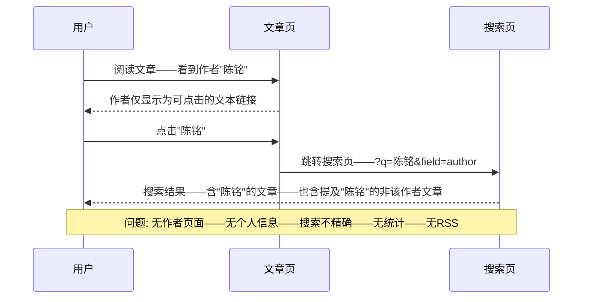
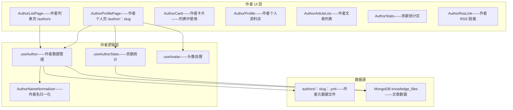
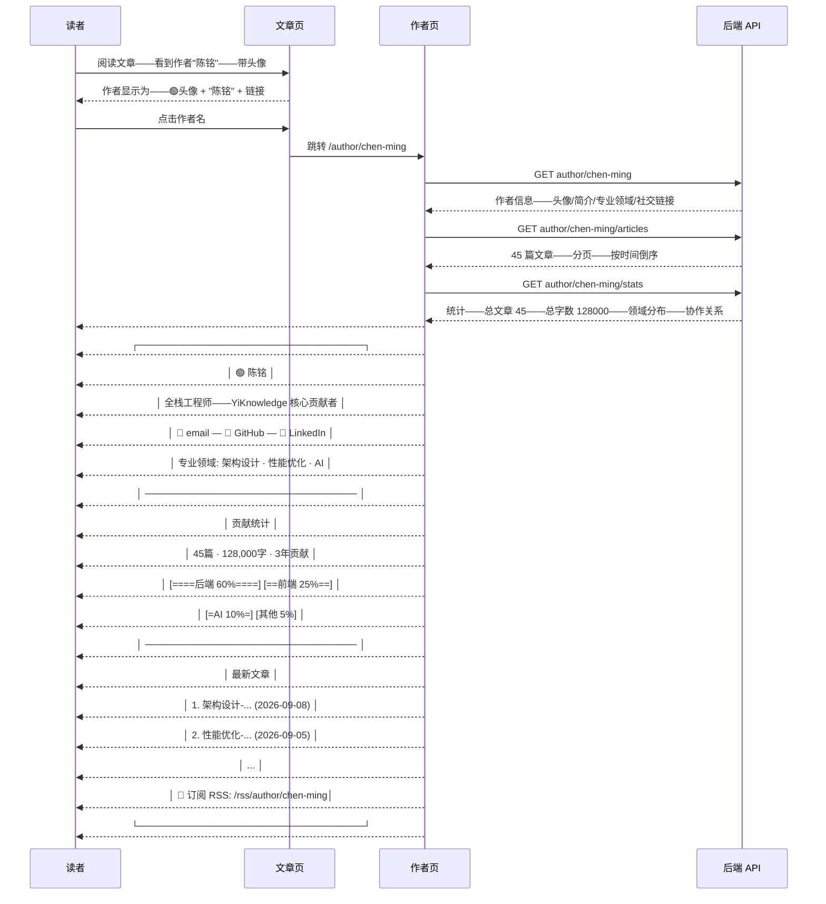

# YK-09-200: 内容作者页面 — 作者简介、头像、文章列表、贡献统计、专业领域、社交链接、作者 RSS

> 需求编号: YK-09-200 · 优先级: P2 · 人天: 0.3d · 状态: 需求已编写
> 依赖: YK-09-113（贡献者画像与统计——作者页面是贡献者画像的对外展示页面）、YK-09-173（内容 RSS 多格式输出——作者 RSS 依赖 RSS 基础设施）

## 背景

### 问题陈述

YiKnowledge 知识库由多位贡献者共同编写和维护——每个贡献者在文章 frontmatter 中标记为作者。但当前的作者信息仅限于 frontmatter 中一个名字字符串——用户点击作者名只能触发搜索（搜索该作者的文章）——没有专门的作者页面来展示贡献者的个人资料、贡献历程和专业领域：

1. **作者信息扁平——无法建立信任**: 读者看到一篇文章——作者栏仅显示一个名字"陈铭"——没有头像、没有简介、没有专业背景——读者无法判断作者在该领域的权威性——无法建立内容信任
2. **无法探索作者的完整贡献**: 用户认可某个作者的文章——想看他写的其他内容——当前只能通过全局搜索作者名——搜索结果混杂（含该作者被引用或提及的文章）——体验差——信息噪音大
3. **作者贡献不可量化**: 无法看到一个作者写了多少篇文章、覆盖了哪些领域、贡献的时间线——管理者无法评估贡献者的产出——贡献者自己也看不到成长轨迹
4. **无作者专属订阅**: 用户想订阅特定作者的更新——当前全站 RSS 推送所有作者的内容——用户无法按作者过滤——收到大量不感兴趣的来自其他作者的内容
5. **作者之间无连接**: 无法看到两个作者共同参与了哪些文章——无法发现作者间的协作关系——知识库的社交图谱不可见

**核心矛盾**: 作者是知识库内容质量的核心保障——但当前系统中作者仅是一个文本标签——没有任何人格化的展示。作者个人页面能将"名字"转化为"人物"——建立读者与作者之间的信任——激励贡献者——并作为内容发现的新维度（通过作者发现内容）。

### 影响范围

| # | 影响 | 严重程度 | 典型场景 |
|---|------|----------|----------|
| 1 | 内容权威性无法判断 | 高 | 读者看到架构设计文章——作者"匿名"或只有名字——无法知道作者是否是该领域专家——降低内容可信度 |
| 2 | 作者内容难以发现 | 高 | 读者喜欢"陈铭"的技术文章——想看他所有作品——当前需搜索——结果不准确——可能遗漏 |
| 3 | 贡献缺乏认可和激励 | 中 | 贡献者写了 50 篇文章——但无个人页面展示成果——成就感缺失——长期积极性受损 |
| 4 | 无作者专属订阅 | 中 | 关注特定作者的读者——只能订阅全站 RSS——每天收到 5 篇更新中仅 1 篇来自目标作者 |
| 5 | 知识库社群感缺失 | 中 | 多个作者无关联展示——知识库感觉像匿名系统而非社群——不利于社区建设 |

### 挑战

| 挑战 | 说明 |
|------|------|
| 作者身份的唯一标识 | frontmatter 中的 author 是自由文本——同一作者可能写"陈铭"、"Chengliang Yi"、"C.L. Yi"——需要作者身份归一化 |
| 作者元数据的存储和管理 | 作者简介、头像、社交链接等个人信息存储在哪里——作者自行管理 vs 管理员统一维护 |
| 作者贡献统计的准确性 | 删除的文章是否计入统计——草稿是否计入——多作者文章如何分配贡献 |
| 头像存储与展示 | 头像上传、CDN 分发、默认头像生成（基于姓名首字母） |
| 作者页面的 SEO | 多作者页面可能被视为"薄内容"页——需要确保每页有足够的独特内容 |

---

## 一、现状分析

### 1.1 当前作者相关能力

```
YiKnowledge 作者相关功能现状:
├── Frontmatter 作者字段
│   ├── author: "陈铭" —— 纯文本——自由输入
│   └── 局限: 无唯一标识——可能重复或不一致——无法关联到个人资料
├── 作者搜索
│   ├── 文章详情页——点击作者名→跳转搜索页——搜索 author 字段
│   └── 局限: 搜索结果含引用/提及——不精确——无作者信息展示
├── 文章列表作者显示
│   ├── 文章卡片底部——作者名小字
│   └── 局限: 纯文本——无头像——无链接或在链接无目标页
└── 缺失:
    ├── 作者个人页面: /author/{slug}——简介/头像/文章/统计                   # ❌ 无
    ├── 作者简介/头像: 个人信息——专业背景——专业领域                          # ❌ 无
    ├── 贡献统计: 文章数/字数/领域分布/时间线/协作关系                         # ❌ 无
    ├── 作者 RSS: /rss/author/{slug}.xml——仅该作者的文章                      # ❌ 无
    ├── 作者列表页: /authors——所有贡献者概览                                  # ❌ 无
    ├── 作者身份归一化: 同一作者的不同名称变体统一                             # ❌ 无
    └── 协作网络图: 作者间的协作关系可视化                                   # ❌ 无
```

### 1.2 当前作者交互流程



### 1.3 根因矩阵

| 症状 | 根因 | 触发条件 | 频率 |
|------|------|----------|------|
| 作者无个人信息 | 无作者元数据存储——无作者页面 | 用户想了解作者 | 高 |
| 作者内容难发现 | 仅支持作者名搜索——无专属文章列表 | 读者认可某作者——想看更多 | 高 |
| 作者名不一致——同一人多个身份 | 无作者身份归一化——自由文本输入 | 中英文名混用——笔名变更 | 中 |
| 无贡献统计 | 无聚合查询——无统计页面 | 管理者评估贡献者 | 中 |
| 无作者订阅 | RSS 无作者过滤参数 | 关注特定作者 | 中 |

---

## 二、设计决策

### 决策 1: 作者身份管理 — 独立作者集合 vs frontmatter 扩展 vs 混合

| 选项 | 数据一致性 | 管理复杂度 | 灵活性 |
|------|-----------|-----------|--------|
| A: 独立 authors 集合——作者信息独立存储——frontmatter 引用 authorId | 最高——唯一标识 | 中——需维护两处 | 中 |
| B: 仅扩展 frontmatter——添加 author_bio/avatar 等字段到每篇文章 | 最低——数据冗余 | 最低 | 最高 |
| C: 混合——authorId 引用 + 按需降级——有独立资料用资料——没有则显示纯文本 | 高 | 中 | 高 |

**选择: C + A（混合模式——建立独立 authors 集合——渐进迁移）。** 创建独立的 `authors` 集合——存储作者个人信息（slug/id/name/bio/avatar/expertise/social）。文章 frontmatter 增加可选的 `author_id` 字段——有 author_id 的链接到作者页面——没有的降级为纯文本显示。渐进式：存量文章不强制要求 author_id——新文章指引使用——管理员可通过后台工具将已有作者名归一化并创建 author 记录。Author_id 格式为 kebab-case slug（如 `chen-ming`）——URL 友好。

### 决策 2: 作者个人信息管理 — 作者自助 vs 管理员统一 vs Git-based

| 选项 | 更新效率 | 信息准确性 | 工作量 |
|------|---------|-----------|--------|
| A: 作者自助——作者通过界面编辑自己的资料 | 高——即时 | 中——依赖作者主动性 | 中——需开发编辑界面 |
| B: 管理员统一——管理员在后台上传和维护作者信息 | 中——需提交请求 | 高——管理员把关 | 低——使用现有后台 |
| C: Git-based——作者信息以 YAML/MD 文件存储——通过 PR 更新 | 中——Git 流程 | 高——PR 审核 | 低——复用现有流程 |

**选择: C + A 组合（Git-based 为主——管理后台辅助）。** 作者信息存储在 `YiKnowledge/curator/authors/{slug}.yml` ——与知识库内容同样的 Git 工作流——PR 审核——版本控制。YAML 格式存储作者信息——格式规范——易编辑。管理后台提供作者信息预览和快速编辑——一键提 PR。未来可增加作者自助编辑（需认证）——但近期 YAML + PR 是最简单可靠的方案——与 YiKnowledge 的 Git 驱动理念一致。

### 决策 3: 贡献统计范围 — 仅已发布 vs 含草稿 vs 含已删除

| 选项 | 准确性 | 激励效果 | 诚实性 |
|------|--------|---------|--------|
| A: 仅已发布文章——status: published | 最准确 | 中 | 最诚实 |
| B: 含草稿——反映总工作量 | 中——含未完成 | 高——显示全部贡献 | 中——读者看不到草稿 |
| C: 含已删除——完整工作历史 | 低——含废弃内容 | 最高 | 低——可能误导读者 |

**选择: A（仅已发布文章——status: published）。** 作者页面面向读者——展示的是公开发布的内容——草稿和已删除文章不应出现在贡献统计中。读者看到的统计应与他们能读到的文章一致——避免"统计 50 篇——实际可见 30 篇"的信任落差。管理后台可为管理员提供包含草稿的内部统计视图——但公开作者页面严格限定已发布内容。

### 决策 4: 作者头像策略 — 上传 vs Gravatar vs 自动生成

| 选项 | 作者参与度 | 实现复杂度 | 视觉质量 |
|------|-----------|-----------|---------|
| A: 上传自定义头像——作者提供图片 | 高——需作者操作 | 中——需图片处理管线 | 最高——个性化 |
| B: Gravatar——基于邮箱的全球头像服务 | 中 | 低——第三方 API | 中——依赖外部 |
| C: 自动生成——基于姓名首字母 + 背景色 | 最低——零操作 | 低——纯 CSS/Canvas | 中——统一风格 |

**选择: A + C 组合（优先上传——降级自动生成）。** 有上传头像的显示上传头像（在 authors YAML 中指定头像路径）——没有的自动生成首字母头像。自动生成头像使用 Canvas——取姓名首字母（如"陈铭"→"CM"或"陈"→"陈"）——背景色基于 slug hash（保证同一作者颜色一致）——简洁大方——与 GitHub/Gmail 的默认头像风格一致。不引入 Gravatar——减少外部依赖——且当前无邮箱系统。

---

## 三、目标架构

### 3.1 作者页面系统架构



### 3.2 作者页面交互流程



### 3.3 性能指标

| 指标 | 改造前 | 改造后 |
|------|--------|--------|
| 作者信息丰富度 | 仅名字 | 头像/简介/专业领域/社交链接/贡献统计 |
| 作者内容发现 | 搜索（不精确） | 专属文章列表——分页——多维度浏览 |
| 作者贡献可见性 | 0——无统计 | 数量/字数/领域/时间/协作——量化 |
| 作者 RSS 订阅 | 不支持 | 每作者独立的 RSS Feed |
| 作者页面加载 | — | < 300ms——含文章列表 |

---

## 四、具体改动

### 4.1 核心代码: 作者页面 Composable

```typescript
// src/composables/content/useAuthor.ts —— 新增

type AuthorProfile = {
  id: string;              // slug——如 "chen-ming"
  name: string;            // 显示名称——如 "陈铭"
  avatar?: string;         // 头像路径——如 "/authors/chen-ming/avatar.jpg"
  initialsAvatar: string;  // 自动生成的首字母头像 SVG/CSS
  bio: string;             // 简介——1-2 句话
  bioFull?: string;        // 完整简介——Markdown
  expertise: string[];     // 专业领域——["架构设计", "性能优化"]
  social?: {               // 社交链接
    email?: string;
    github?: string;
    website?: string;
    linkedin?: string;
  };
  joinedAt: string;        // 首次贡献日期
  isActive: boolean;       // 是否仍在活跃贡献
};

type AuthorStats = {
  totalArticles: number;
  totalWords: number;      // 总字数（估算）
  firstArticleAt: string;
  latestArticleAt: string;
  categoryDistribution: {  // 领域分布
    category: string;
    count: number;
    percentage: number;
  }[];
  monthlyActivity: {       // 月度活动
    month: string;
    count: number;
  }[];
  collaborators: {         // 协作关系
    authorId: string;
    authorName: string;
    count: number;         // 共同创作的文章数
  }[];
};

type AuthorArticle = {
  id: string;
  title: string;
  path: string;
  created: string;
  summary: string;
  tags: string[];
  category: string;
  coAuthors?: { id: string; name: string }[];
};

function useAuthor() {
  const profile = ref<AuthorProfile | null>(null);
  const stats = ref<AuthorStats | null>(null);
  const articles = ref<AuthorArticle[]>([]);
  const loading = ref(false);
  const currentPage = ref(1);

  /** 加载作者资料 */
  async function loadProfile(slug: string): Promise<AuthorProfile | null> { /* ... */ }

  /** 加载贡献统计 */
  async function loadStats(slug: string): Promise<AuthorStats> { /* ... */ }

  /** 加载作者文章——分页 */
  async function loadArticles(slug: string, page?: number): Promise<{ articles: AuthorArticle[]; total: number }> { /* ... */ }

  /** 生成首字母头像 */
  function generateInitialsAvatar(name: string, slug: string): string {
    // 取首字母或首字
    const initials = name.slice(0, 2).replace(/[a-zA-Z]/g, c => c.toUpperCase());
    // 基于 slug 的 hash 生成稳定的背景色
    const hue = stringHash(slug) % 360;
    return `<svg>...<text>${initials}</text></svg>`;
    // 或使用 CSS——div + border-radius 50% + background hsl(hue, 60%, 55%)
  }

  /** 获取作者 RSS URL */
  function getRssUrl(slug: string): string {
    return `/rss/author/${slug}.xml`;
  }

  return {
    profile, stats, articles, loading, currentPage,
    loadProfile, loadStats, loadArticles,
    generateInitialsAvatar, getRssUrl,
  };
}
```

### 4.2 作者 YAML 格式

```yaml
# YiKnowledge/curator/authors/chen-ming.yml —— 新增

id: chen-ming
name: 陈铭
display_name: 陈铭 (Chengliang Yi)
bio: 全栈工程师，YiKnowledge 知识库核心维护者。专注于架构设计和性能优化。
bio_full: |
  陈铭是 YrY 单体仓库的全栈开发者与架构师，负责 YiAi 后端、
  YiVad 管理后台和 YiPet 浏览器扩展的架构设计与核心开发。

  拥有 8 年全栈开发经验，在系统架构、性能优化和 AI 应用领域
  有深入研究。

expertise:
  - 架构设计
  - 性能优化
  - AI 应用开发
  - 前端工程化

social:
  github: chengliang-yi
  email: chengliang.yi@example.com

avatar: /authors/chen-ming/avatar.png   # 可选——无则自动生成
joined_at: 2023-06
status: active

# 用于作者名归一化——将 frontmatter 中可能的变体映射到此作者
aliases:
  - 陈铭
  - Chengliang Yi
  - C.L. Yi
  - clyi
```

### 4.3 文件变更清单

| 文件 | 操作 | 说明 |
|------|------|------|
| `src/composables/content/useAuthor.ts` | 新增 | 作者数据——资料/统计/文章/RSS |
| `src/composables/content/useAuthorStats.ts` | 新增 | 贡献统计——聚合计算——领域分布 |
| `src/composables/content/useAuthorNameNormalizer.ts` | 新增 | 作者名归一化——别名映射——slug 生成 |
| `src/components/content/AuthorProfile.vue` | 新增 | 作者个人资料区——头像/简介/领域/社交 |
| `src/components/content/AuthorStatsPanel.vue` | 新增 | 贡献统计面板——数字/分布图/时间线 |
| `src/components/content/AuthorArticleList.vue` | 新增 | 作者文章列表——分页/排序 |
| `src/components/content/AuthorCard.vue` | 新增 | 作者卡片——列表页使用——头像/信息/统计摘要 |
| `src/views/AuthorProfilePage.vue` | 新增 | 作者个人页——/author/:slug |
| `src/views/AuthorListPage.vue` | 新增 | 作者列表页——/authors |
| `src/router/content.ts` | 修改 | 新增作者相关路由 |
| `src/styles/avatar.css` | 新增 | 首字母头像样式——圆形/颜色/字号 |
| `YiKnowledge/curator/authors/.gitkeep` | 新增 | 作者 YAML 存储目录 |
| `YiKnowledge/curator/authors/chen-ming.yml` | 新增 | 第一位作者的资料（示例/种子数据） |
| `yiAi/services/knowledge/author_service.py` | 新增 | 作者服务——聚合/统计/RSS/归一化 |

---

## 五、实施步骤

| 步骤 | 操作 | 路径 | 验证 | 人天 |
|------|------|------|------|------|
| 1 | 建立作者 YAML 数据格式 | `curator/authors/chen-ming.yml` | YAML schema——示例数据——验证解析 | 0.03 |
| 2 | 后端作者服务 | `author_service.py` | 聚合查询/贡献统计/RSS 生成/别名匹配 | 0.04 |
| 3 | 实现作者名归一化 | `useAuthorNameNormalizer.ts` | 别名映射/slug 生成/重复检测 | 0.03 |
| 4 | 实现作者数据 Composable | `useAuthor.ts + useAuthorStats.ts` | 资料加载/统计计算/文章分页 | 0.04 |
| 5 | 实现作者个人资料组件 | `AuthorProfile.vue` | 头像/简介/领域/社交链接 | 0.04 |
| 6 | 实现贡献统计面板 | `AuthorStatsPanel.vue` | 统计数字/领域分布/活动时间线 | 0.04 |
| 7 | 实现作者页面和列表 | `AuthorProfilePage.vue + AuthorListPage.vue` | 路由/布局/全流程 | 0.05 |
| 8 | 改造文章页作者链接 | `文章详情组件` | 从文本→可点击的头像+名字+链接 | 0.03 |

**总人天: 0.3d**

---

## 六、测试规格

### 测试 1: 作者个人页面——基本信息展示

| 项目 | 内容 |
|------|------|
| 优先级 | P0 |
| 前置条件 | 作者"陈铭"已创建 YAML 资料——含头像/简介/专业领域/社交链接 |
| 测试步骤 | 1. 访问 /author/chen-ming 2. 观察页面布局 |
| 预期结果 | 页面顶部——头像（圆形——如无图片显示首字母"CM"——彩色背景）——显示名称"陈铭"——简介文本——专业领域以标签样式展示"架构设计""性能优化""AI..."——社交图标链接（GitHub/邮箱）可点击——页面布局整洁——桌面和移动端都适配 |

### 测试 2: 作者文章列表——分页

| 项目 | 内容 |
|------|------|
| 优先级 | P0 |
| 前置条件 | 作者"陈铭"有 45 篇已发布文章 |
| 测试步骤 | 1. 访问 /author/chen-ming 2. 滚动到文章列表区 3. 查看第一页（前 20 篇） 4. 翻到第 2 页 |
| 预期结果 | 文章列表按创建时间倒序——每篇显示标题/日期/摘要/标签/分类——分页控件——"第 1/3 页——共 45 篇"——每页 20 篇——翻页无闪烁——URL 参数同步 ?page=2——如果文章有协作者——显示"与 XX 合著" |

### 测试 3: 贡献统计

| 项目 | 内容 |
|------|------|
| 优先级 | P0 |
| 前置条件 | 作者含 45 篇——分属"后端"28 篇、"前端"10 篇、"AI"5 篇、"其他"2 篇 |
| 测试步骤 | 1. 查看贡献统计区 2. 观察统计数据 3. hover 领域分布图 |
| 预期结果 | 统计区显示——总文章数 45——总字数——首次贡献日期——最近贡献日期——领域分布使用水平条形图——"后端 28 (62%)"条最长——hover 显示精确数字——有月度活动折线图——协作关系显示"与 XX 共同创作 5 篇"(如有) |

### 测试 4: 作者名归一化——别名映射

| 项目 | 内容 |
|------|------|
| 优先级 | P1 |
| 前置条件 | frontmatter 中 author 有 3 种变体——"陈铭"(30 篇)——"Chengliang Yi"(10 篇)——"clyi"(5 篇)——aliases 配置包含这三种 |
| 测试步骤 | 1. 访问 /author/chen-ming 2. 查看文章列表 3. 检查文章数 |
| 预期结果 | 文章列表包含全部 45 篇文章——无论 frontmatter 中 author 使用哪种变体——统计信息聚合正确——在搜索和归档中——三种变体的文章都归属到 chen-ming——别名匹配不区分大小写 |

### 测试 5: 作者 RSS 订阅

| 项目 | 内容 |
|------|------|
| 优先级 | P1 |
| 前置条件 | 作者"陈铭"——45 篇文章 |
| 测试步骤 | 1. 访问 /author/chen-ming 2. 点击 RSS 图标 3. 在 RSS 阅读器中添加 |
| 预期结果 | RSS URL——/rss/author/chen-ming.xml——Feed 标题"YiKnowledge - 陈铭的文章"——描述含作者简介——包含最新 20 篇文章——RSS 格式正确——可以被阅读器解析——更新频率——有新文章发布时 Feed 自动更新 |

### 测试 6: 作者列表页——所有贡献者

| 项目 | 内容 |
|------|------|
| 优先级 | P1 |
| 前置条件 | 知识库有 8 位作者——均通过 YAML 文件创建了资料——文章数从 1 到 45 不等 |
| 测试步骤 | 1. 访问 /authors 2. 查看作者列表 3. 按文章数排序 4. 点击某个作者卡片 |
| 预期结果 | 作者卡片网格布局——每个卡片含——头像——名字——简介摘要(1 行)——文章数——最近活跃日期——默认按文章数降序——可切换按名字/最近活跃排序——点击卡片跳转作者个人页——移动端卡片堆叠——2 列→1 列 |

---

## 七、风险与缓解

| 风险 | 概率 | 影响 | 缓解措施 |
|------|------|------|------|
| 作者名变体无法完全归一化——漏掉某些变体 | 中 | 中 | 提供管理后台"作者名归一化"工具——扫描所有 author 值——列出未匹配到任何 author 的——管理员手动创建映射——逐步收敛 |
| 作者资料 YAML 文件与文章数据不同步——author_id 不匹配 | 低 | 中 | 构建时或加载时校验——文章引用的 author_id 不存在于 YAML 中→降级为纯文本显示——日志警告——管理后台显示"孤儿引用"报告 |
| 贡献统计计算不准确——多作者文章权重分配 | 低 | 低 | 多作者文章——每个作者都计 1 篇（共同拥有）——不分配分数——简单且符合直觉——读者知道这是合作产出 |
| 作者页面 SEO——搜索引擎视"薄内容" | 中 | 低 | 确保每个作者页面有唯一 meta description——含文章摘要和统计——文章列表构成页面主体内容——页面 > 500 词——非薄内容 |
| 头像文件管理——文件丢失或路径错误 | 低 | 低 | 头像加载失败——onerror 降级为首字母头像——日志记录——管理后台显示头像加载状态 |

---

## 八、回滚策略

1. **功能级回滚**: 移除 /author 和 /authors 路由——文章页作者名恢复为纯文本——无链接
2. **代码级回滚**: 移除 AuthorProfilePage/AuthorListPage/AuthorCard/AuthorProfile/AuthorStatsPanel 组件——移除 useAuthor 相关 composables
3. **数据级回滚**: 作者 YAML 文件保留在仓库中——不删除——移除了页面但不影响数据——重新启用时可恢复
4. **回滚验证**: 文章页作者文本正常——搜索正常——RSS 全站正常——无控制台报错——无 404

---

## 九、设计决策记录

### D-01: YAML 文件存储作者资料——Git 驱动

**上下文**: 作者资料可以存储在数据库、CMS 或文件中。

**决策**: 作者资料以 YAML 文件存储在 `YiKnowledge/curator/authors/` 中——与知识文章相同的 Git 工作流。

**理由**: YiKnowledge 是 Git 驱动的知识库——作者资料作为知识库元数据——自然应该存储在同一个仓库中。YAML 文件易于人类阅读和编辑——PR 审核流程确保信息准确性——版本控制记录变更历史。MongoDB 中仅存储 author_id 引用——YAML 是单一事实来源。如果未来需要更复杂的作者管理（如自助编辑）——可以迁移到数据库——但当前文件方案最简单可靠。

### D-02: 作者名归一化——使用 aliases 字段

**上下文**: 同一作者在 frontmatter 中可能有多种名称变体（中英文、缩写、笔名）。

**决策**: 每个作者 YAML 包含 `aliases` 字段——列出所有已知变体——后端查询时自动展开 aliases。

**理由**: 不强制所有文章修改 author 字段（破坏性操作）——通过 aliases 字段实现向后兼容的归一化。新增文章鼓励使用 author_id——但 author 纯文本仍然有效（有歧义时降级为显示纯文本）。管理后台提供归一化工具——帮助管理员逐步收敛名称变体。Aliases 匹配不区分大小写——trim 空格——降低匹配失败。

### D-03: 仅已发布文章计入统计——诚实可验证

**上下文**: 贡献统计应该展示作者的所有工作（含草稿）——还是仅公开内容。

**决策**: 公开作者页面仅统计已发布（published）文章——草稿和已删除文章不计入。

**理由**: 作者页面的读者能看到的就是统计中的文章——统计和可见内容一致——读者可以验证——建立信任。如果统计包含未发布的草稿——"写了 50 篇但只能看到 30 篇"——读者会产生疑问。管理员如果需要内部统计（含草稿）——通过管理后台查看——不放在公开页面。

### D-04: 首字母头像——简单且统一风格

**上下文**: 默认头像可以用 Gravatar、上传或自动生成。

**决策**: 优先上传头像——没有上传时自动生成首字母头像（姓名首字母 + 稳定的背景色）。

**理由**: 首字母头像（avatar placeholder）是行业标准——GitHub、Gmail、Notion 均采用——用户已有认知。通过 slug hash 生成稳定的背景色——确保同一作者在不同页面/设备上看到相同颜色。无需外部服务——无需作者操作——100% 覆盖。上传头像作为可选的个性化增强——仅少数作者会使用——不影响大多数作者的体验。

---

## 十、可观测性

| 指标 | 采集方式 | 阈值 |
|------|----------|------|
| 作者页面 PV | /author/:slug 路由访问 | 观测——对比文章页 PV——判断读者对作者信息的兴趣 |
| 作者列表页 PV | /authors 路由访问 | 观测 |
| 作者页点击来源 | referrer——文章页 vs 搜索 vs 直接 | 观测——文章页来源 > 80% 正常 |
| 作者 RSS 订阅量 | /rss/author/:slug.xml 请求次数 | 观测——有订阅说明读者对该作者有持续兴趣 |
| 别名匹配覆盖率 | 有 author_id 的文章数 / 总文章数 | 目标 > 90% |
| 首字母头像生成率 | 未上传头像 / 总作者数 | 观测——> 90% 正常——大部分作者不传头像 |
| 作者 YAML 文件数 | curator/authors/ 目录文件数 | 与活跃贡献者数量一致 |

---

## 十一、代码审查检查清单

- [ ] `AuthorProfilePage`——author 不存在时——404 页面——提供"返回作者列表"链接
- [ ] `useAuthorNameNormalizer`——别名匹配——不区分大小写——trim 空格——空作者名不崩溃
- [ ] `useAuthorStats`——文章数为 0 时——统计显示"暂无已发布文章"——不显示 0/0/0
- [ ] `AuthorProfile`——bio_full 使用 Markdown 渲染——XSS 过滤——仅允许安全标签
- [ ] `generateInitialsAvatar`——空名字——返回默认"?"字符——背景灰色
- [ ] `AuthorCard`——hover 效果——shadow 微升——过渡 200ms——点击跳转
- [ ] 作者页面 SEO——`<meta name="description">` 动态生成——含作者名和文章数
- [ ] `AuthorArticleList`——分页参数 `page` 从 route query 读取——默认 1——无效值降级为 1
- [ ] 社交链接——空值时图标不渲染——不显示 disabled 图标
- [ ] 作者页面——`<link rel="alternate" type="application/rss+xml" href="...">` ——让浏览器/阅读器自动发现 RSS

---

## 回归问题预测

| # | 预测问题 | 触发条件 | 检测方式 |
|---|----------|----------|----------|
| 1 | 文章页作者链接——部分 author 无 author_id——点击跳转搜索页——体验断裂 | 旧文章没有 author_id——作者名是纯文本 | 文章渲染时——有 author_id 的显示头像+链接——无的显示纯文本（灰——不可点击）——不强制跳转搜索——避免混用两种行为 |
| 2 | 作者 YAML 文件格式错误——页面白屏 | YAML 缩进错误或缺少必填字段 | 加载 YAML 时 try/catch——解析失败——降级为最小化显示（仅名字）——后台日志记录解析错误——管理工具进行格式校验 |
| 3 | 作者统计中的字数统计不准确——含代码块/Mermaid图表 | 按字符数计数——代码块和图表被计为"字"——统计虚高 | 使用 stripMarkdown 工具——移除代码块和图表——仅统计纯文本字数——标注"估计值" |
| 4 | 作者协作关系数据来源不一致——仅基于 co-authors frontmatter | 大量文章 frontmatter 无 co-authors 字段——仅 author 字段可能有多个名字 | 解析 author 字段——逗号/顿号分隔的视为多作者——协作关系基于所有多作者文章——不依赖 co-authors 专门字段 |
| 5 | 作者列表页——大量作者时性能差 | 100+ 作者——每个有头像/文章数——DOM 节点过多 | 作者列表分页或虚拟滚动——默认每页 50 个——头像懒加载——文章数为 0 的作者排在末尾或隐藏（可切换显示） |
| 6 | 作者 RSS 与全局 RSS 冲突——订阅者收到重复内容 | 读者同时订阅了全局 RSS 和作者 RSS——同一篇文章出现在两个 Feed | 这是预期行为——不是 bug——作者 RSS 描述中说明"仅包含 XX 的文章"——订阅者自行选择——在页面 UI 上清晰区分"全站 RSS"和"XX 的 RSS" |

---

## 性能分析

| 操作 | 数据量 | 耗时 | 说明 |
|------|--------|------|------|
| 作者资料加载 | 1 个 YAML 文件——< 1KB | < 10ms | 文件读取——或缓存 |
| 作者文章列表 | 45 篇——分页 20 | < 100ms | author_id 索引查询 |
| 贡献统计计算 | 45 篇文章聚合 | < 150ms | MongoDB $group pipeline |
| 别名匹配 | 3 个别名 × 500 篇文章 | < 50ms | $in 查询——author 索引 |
| 首字母头像生成 | CSS——纯客户端 | < 1ms | 无网络——无 Canvas |
| 作者列表页（所有作者） | 20 个作者 YAML + 计数 | < 100ms | 多文件读取 + 1 次聚合查询 |

---

## 相关文档

- [贡献者画像与统计](../113-需求-贡献者画像与统计.md) — 贡献统计基础设施
- [内容 RSS 多格式输出](../173-需求-内容RSS多格式输出.md) — 作者 RSS 基础
- [知识竞赛与激励机制](../109-需求-知识竞赛与激励机制.md) — 贡献者激励
- [目录结构优化](../43-需求-目录结构优化.md) — YAML 文件存储位置

*PRD 来源: `projects/yiknowledge/requirements/2026-09/200-需求-内容作者页面.md`*