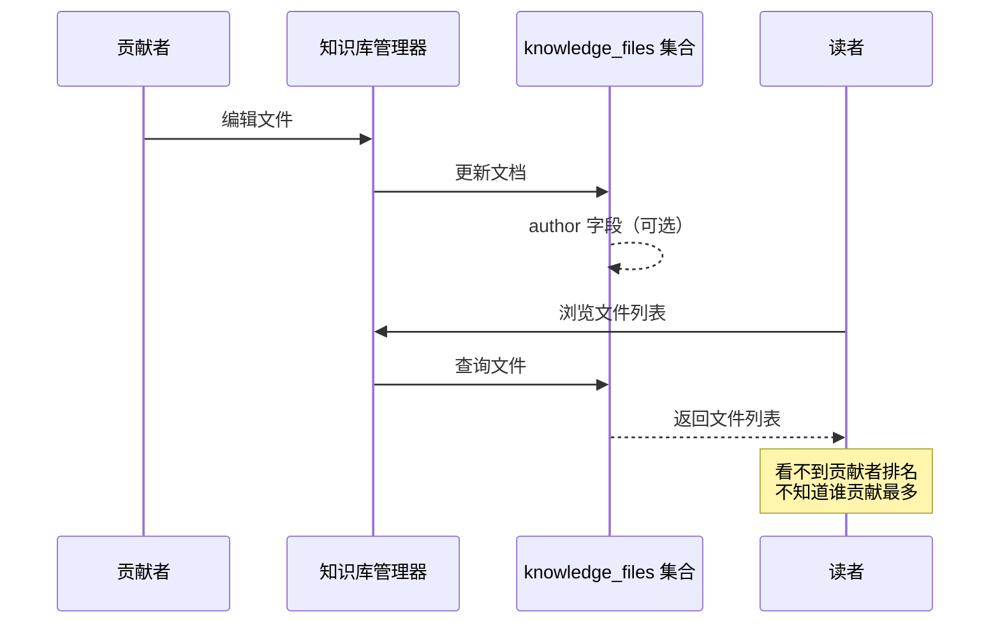
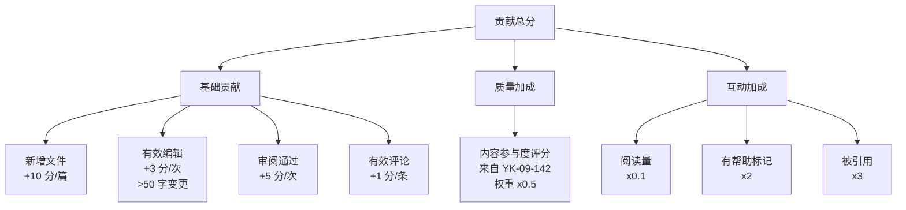

# YK-09-201: 内容贡献者榜单 — 月度/周度/全时段排行、贡献分拆解、徽章与成就展示、团队筛选

> 需求编号：YK-09-201 · 优先级：P2 · 人天：0.3d · 状态：需求已编写
> 依赖：YK-09-142（内容排行榜与热门，提供评分算法基础）、YK-09-113（贡献者画像与统计，提供贡献者数据）、YK-09-109（知识竞赛与激励机制，提供激励框架）

## 背景

### 问题陈述

YiKnowledge 目前缺乏贡献者的可见性展示。高产贡献者写了 50 篇高质量文章，但在知识库中和写了 1 篇草稿的新人在目录树中没有区别。团队管理者想知道本月谁贡献最多，但没有任何数据看板可以回答这个问题。

1. **贡献者不可见**：没有排行榜展示谁贡献了最多/最好的内容
2. **贡献质量无区分**：写 50 篇草稿和写 10 篇精华文章的人在数量排行上可能相同
3. **缺乏持续激励**：月度贡献清空后，历史贡献者得不到持续认可
4. **团队视角缺失**：多人协作的团队无法按团队查看贡献分布
5. **成就无展示**：贡献里程碑（如"连续 3 个月贡献"）没有可视化展示

**核心矛盾**：知识的价值创造者是贡献者——但当前没有机制让贡献者被看见、被认可、被激励。

### 影响范围

| # | 影响 | 严重程度 | 典型场景 |
|---|------|----------|----------|
| 1 | 贡献者缺乏认可感 | 高 | 高产作者持续贡献但看不到任何反馈 → 动力下降 |
| 2 | 管理者无法评估团队 | 高 | 管理者不知道团队成员各自的贡献情况 |
| 3 | 新贡献者没有目标 | 中 | 新人不知道需要贡献多少才能进入前列 |
| 4 | 贡献质量无区分 | 中 | 数量型贡献和质量型贡献在排名中无法区分 |
| 5 | 跨时期比较困难 | 低 | 无法知道本月的顶级贡献者与上月相比如何 |

### 挑战

| 挑战 | 说明 |
|------|------|
| 贡献分算法 | 如何将文件新增、编辑、审阅、评论等行为量化为一个公平的分数 |
| 时间窗口设计 | 周度/月度/全时段——如何避免短期操作刷分 |
| 徽章设计 | 什么成就值得授予徽章——避免徽章通货膨胀 |
| 团队归属 | 贡献者属于哪个团队——需要团队维度的数据 |

---

## 一、现状分析

### 1.1 当前贡献者数据现状

```
现有数据源：
├── knowledge_files 集合
│   ├── frontmatter.author（可选字段，非强制）
│   ├── frontmatter.updated
│   └── frontmatter.created
├── YK-09-113: 贡献者画像与统计
│   └── 按作者统计文件数量
└── YK-09-142: 内容排行榜
    └── 内容维度的参与度评分

缺失：
├── 贡献者维度的排行榜
├── 贡献分拆解（新增/编辑/审阅/评论）
├── 徽章与成就系统
└── 团队维度的贡献统计
```

### 1.2 改造前数据流



### 1.3 根因矩阵

| 症状 | 根因 | 触发条件 | 频率 |
|------|------|----------|------|
| 贡献者不可见 | 无贡献者排行榜 | 查看知识库首页 | 高 |
| 贡献质量无区分 | 无质量加权 | 按数量排名 | 中 |
| 历史贡献被遗忘 | 无全时段榜单 | 月度榜单刷新 | 中 |
| 团队视角缺失 | 无团队归属数据 | 查看团队贡献 | 低 |

---

## 二、设计决策

### 决策 1：贡献分模型 — 数量型 vs 质量型 vs 综合型

| 模型 | 公式 | 优点 | 缺点 |
|------|------|------|------|
| 数量型 | `score = fileCount * 10` | 简单 | 不区分质量 |
| 质量型 | `score = Σ(contentScore_i)` | 区分质量 | 依赖内容评分 |
| 综合型 | `score = Σ(10 + contentScore_i * weight_i)` | 平衡 | 参数复杂 |

**选择：综合型。** 基础分：每新增 1 篇 +10 分。质量加成：基于 YK-09-142 的参与度评分加权（阅读量 x0.1 + 有帮助 x2 + 被引用 x3）。编辑贡献：每次有效编辑 +3 分（字符变更 >50 字）。审阅贡献：每次审阅通过 +5 分。评论贡献：每条有效评论 +1 分。

### 决策 2：时间窗口 — 仅月度 vs 周/月/全时段

| 选项 | 新鲜度 | 历史认可 | 实现 |
|------|--------|----------|------|
| 仅月度 | 高 | 低 | 低 |
| 仅全时段 | 低 | 高 | 低 |
| 周/月/全时段三个榜单 | 高 | 高 | 中 |

**选择：周/月/全时段三个榜单。** 周度榜单激励短期活跃，月度榜单作为主要排位依据，全时段榜单表彰长期贡献。全时段采用时间衰减因子（指数衰减，半衰期 6 个月）避免远古内容霸榜。

### 决策 3：徽章与成就 — 无 vs 静态列表 vs 动态扩展

| 选项 | 趣味性 | 维护成本 | 实现 |
|------|--------|----------|------|
| 无 | 低 | 低 | 低 |
| 静态列表（10-15 个预定义徽章） | 中 | 低 | 低 |
| 动态扩展（管理员可新增徽章） | 高 | 高 | 高 |

**选择：静态列表（12 个预定义徽章）。** 徽章分为三类：数量成就（初出茅庐 1 篇/笔耕不辍 10 篇/著作等身 50 篇/百篇大师 100 篇）、质量成就（精华作者 5 篇/热门内容 1000 阅读）、时间成就（月度冠军/连续 3 月/年度贡献者/开山鼻祖）。徽章定义在配置文件中，后续可扩展。

### 决策 4：团队筛选 — 无团队 vs 基于 frontmatter vs 独立团队管理

| 选项 | 准确性 | 灵活性 | 实现 |
|------|--------|--------|------|
| 无团队 | — | — | — |
| 基于 frontmatter `team` 字段 | 中 | 低 | 低 |
| 独立团队管理（team 集合） | 高 | 高 | 高 |

**选择：基于 frontmatter `team` 字段。** 在 YAML frontmatter 中新增可选 `team` 字段。初始阶段手动维护团队归属，后续可引入独立团队管理。榜单支持按 `team` 字段筛选。

### 设计决策汇总

| 决策 | 选项 A | 选项 B | 选项 C | 选择 | 理由 |
|------|--------|--------|--------|------|------|
| 贡献分 | 数量型 | 质量型 | 综合型 | **综合型** | 公平平衡 |
| 时间窗口 | 仅月度 | 仅全时段 | 三个 | **三个** | 覆盖全部需求 |
| 徽章 | 无 | 静态 | 动态 | **静态 12 个** | 简单可控 |
| 团队 | 无 | frontmatter | 独立集合 | **frontmatter** | 最小改动 |

---

## 三、目标架构

### 3.1 贡献者榜单数据流

```mermaid
graph TD
    subgraph DataSources["数据源"]
        A[knowledge_files 集合<br>author/team/created/updated]
        B[内容参与度数据<br>views/helpful/comments<br>（来自 YK-09-142）]
    end

    subgraph Pipeline["计算流水线"]
        C[贡献分计算引擎]
        D[周度榜单<br>周一 00:00 ~ 周日 23:59]
        E[月度榜单<br>1 日 00:00 ~ 月末 23:59]
        F[全时段榜单<br>时间衰减: e^{-λt}<br>半衰期 6 个月]
        G[徽章检测引擎<br>检查 12 个徽章条件]
    end

    subgraph Storage["存储"]
        H[contributor_scores 集合<br>预计算缓存]
        I[badges 集合<br>徽章授予记录]
    end

    subgraph Display["展示层"]
        J[贡献者榜单页面]
        K[贡献分拆解面板]
        L[徽章墙]
        M[团队筛选下拉框]
        N[排行榜卡片<br>头像 + 排名 + 分数]
    end

    A --> C
    B --> C
    C --> D
    C --> E
    C --> F
    D --> H
    E --> H
    F --> H
    C --> G
    G --> I
    H --> J
    I --> J
    J --> K
    J --> L
    J --> M
    J --> N
```

### 3.2 贡献分计算公式



### 3.3 全时段时间衰减

```
衰减后分数 = 原始分数 × e^(-λt)
λ = ln(2) / 180（半衰期 180 天 = 6 个月）
t = 当前日期 - 内容创建日期（天数）

示例：
- 今天创建：分数 × 1.0
- 3 个月前：分数 × 0.71
- 6 个月前：分数 × 0.5
- 12 个月前：分数 × 0.25
- 24 个月前：分数 × 0.06
```

### 3.4 性能指标

| 指标 | 改造前 | 改造后 |
|------|--------|--------|
| 贡献者可见性 | 无 | 三榜单 + 徽章墙 |
| 贡献分计算时间 | — | < 5 分钟（预计算，全量重算） |
| 榜单查询延迟 | — | < 100ms（预计算缓存） |
| 徽章授予数 | 0 | 12 种徽章 × N 位贡献者 |

---

## 四、具体改动

### 4.1 数据模型

```python
# YiAi: domain/contributor/models.py

from pydantic import BaseModel
from datetime import datetime
from typing import Optional

class ContributionBreakdown(BaseModel):
    """贡献分拆解"""
    new_files: int = 0           # 新增文件数
    edit_count: int = 0          # 有效编辑次数
    review_count: int = 0        # 审阅通过次数
    comment_count: int = 0       # 有效评论数
    content_score_sum: float = 0 # 内容参与度评分总和
    total_score: float = 0       # 加权总分

class ContributorScore(BaseModel):
    """贡献者分数记录"""
    author: str                  # 贡献者标识（用户名或邮箱）
    team: Optional[str] = None   # 所属团队
    period: str                  # 时间周期：weekly/monthly/all_time
    period_start: datetime       # 周期起始
    period_end: datetime         # 周期结束
    breakdown: ContributionBreakdown
    rank: int = 0                # 排名
    previous_rank: Optional[int] = None  # 上期排名
    rank_change: int = 0         # 排名变化（正=上升，负=下降）
    calculated_at: datetime      # 计算时间

class Badge(BaseModel):
    """徽章"""
    id: str                      # 徽章 ID
    name: str                    # 徽章名称
    description: str             # 徽章描述
    category: str                # 分类：quantity/quality/time
    icon: str                    # 图标（emoji 或 SVG 名称）
    condition: str               # 获得条件（可执行表达式）
    rarity: str                  # 稀有度：common/rare/epic/legendary

class BadgeAward(BaseModel):
    """徽章授予记录"""
    author: str
    badge_id: str
    awarded_at: datetime
    context: dict = {}           # 授予上下文（如"第 50 篇文件: xxx.md"）
```

### 4.2 预定义徽章配置

```python
# YiAi: domain/contributor/badges.py

BADGES = [
    # 数量成就
    {
        "id": "first_file",
        "name": "初出茅庐",
        "description": "创建第一篇知识文件",
        "category": "quantity",
        "icon": "🌱",
        "condition": "new_files >= 1",
        "rarity": "common",
    },
    {
        "id": "prolific_10",
        "name": "笔耕不辍",
        "description": "累计创建 10 篇知识文件",
        "category": "quantity",
        "icon": "✍️",
        "condition": "new_files >= 10",
        "rarity": "common",
    },
    {
        "id": "prolific_50",
        "name": "著作等身",
        "description": "累计创建 50 篇知识文件",
        "category": "quantity",
        "icon": "📚",
        "condition": "new_files >= 50",
        "rarity": "rare",
    },
    {
        "id": "prolific_100",
        "name": "百篇大师",
        "description": "累计创建 100 篇知识文件",
        "category": "quantity",
        "icon": "👑",
        "condition": "new_files >= 100",
        "rarity": "legendary",
    },
    # 质量成就
    {
        "id": "quality_author_5",
        "name": "精华作者",
        "description": "5 篇内容被评为精华",
        "category": "quality",
        "icon": "⭐",
        "condition": "quality_files >= 5",
        "rarity": "rare",
    },
    {
        "id": "hot_content_1000",
        "name": "热门制造者",
        "description": "单篇内容阅读量突破 1000",
        "category": "quality",
        "icon": "🔥",
        "condition": "max_views >= 1000",
        "rarity": "epic",
    },
    # 时间成就
    {
        "id": "monthly_champion",
        "name": "月度冠军",
        "description": "获得一次月度排行第一",
        "category": "time",
        "icon": "🏆",
        "condition": "monthly_rank_1_count >= 1",
        "rarity": "epic",
    },
    {
        "id": "streak_3_months",
        "name": "连续作战",
        "description": "连续 3 个月有贡献",
        "category": "time",
        "icon": "🔄",
        "condition": "contribution_streak >= 3",
        "rarity": "rare",
    },
    {
        "id": "yearly_contributor",
        "name": "年度贡献者",
        "description": "连续 12 个月有贡献",
        "category": "time",
        "icon": "🎖️",
        "condition": "contribution_streak >= 12",
        "rarity": "legendary",
    },
    {
        "id": "early_adopter",
        "name": "开山鼻祖",
        "description": "知识库创建后首批 10 位贡献者",
        "category": "time",
        "icon": "🗿",
        "condition": "is_early_adopter",
        "rarity": "legendary",
    },
    # 综合成就
    {
        "id": "all_rounder",
        "name": "全能选手",
        "description": "同时拥有数量和质量类徽章各 1 枚",
        "category": "quality",
        "icon": "💎",
        "condition": "has_quantity_badge AND has_quality_badge",
        "rarity": "epic",
    },
    {
        "id": "team_player",
        "name": "团队之星",
        "description": "所在团队获得月度最佳团队",
        "category": "time",
        "icon": "🤝",
        "condition": "team_of_month",
        "rarity": "rare",
    },
]
```

### 4.3 文件变更清单

| 文件 | 操作 | 说明 |
|------|------|------|
| `YiAi/domain/contributor/models.py` | 新增 | 贡献者数据模型 |
| `YiAi/domain/contributor/badges.py` | 新增 | 徽章定义 |
| `YiAi/domain/contributor/scorer.py` | 新增 | 贡献分计算引擎 |
| `YiAi/domain/contributor/service.py` | 新增 | 贡献者服务（榜单查询、徽章检测） |
| `YiAi/services/data_service.py` | 修改 | 新增 contributor 查询接口 |
| `YiVad/src/views/contributor/leaderboard.vue` | 新增 | 贡献者榜单页面 |
| `YiVad/src/views/contributor/badge-wall.vue` | 新增 | 徽章墙组件 |
| `YiVad/src/views/contributor/breakdown-panel.vue` | 新增 | 贡献分拆解面板 |
| `YiKnowledge/projects/yiknowledge/specs/contributor-leaderboard.md` | 新增 | 知识库前端页面 |

---

## 五、实施步骤

| 步骤 | 操作 | 路径 | 验证 | 人天 |
|------|------|------|------|------|
| 1 | 定义数据模型 | `YiAi/domain/contributor/models.py` | 模型验证 | 0.02 |
| 2 | 实现贡献分计算引擎 | `YiAi/domain/contributor/scorer.py` | 单元测试 | 0.06 |
| 3 | 实现徽章检测逻辑 | `YiAi/domain/contributor/badges.py` | 徽章触发测试 | 0.04 |
| 4 | 实现榜单查询 API | `YiAi/domain/contributor/service.py` | API 测试 | 0.05 |
| 5 | 创建贡献者榜单页面 | `YiVad/.../leaderboard.vue` | 榜单渲染 | 0.05 |
| 6 | 创建徽章墙组件 | `YiVad/.../badge-wall.vue` | 徽章展示 | 0.03 |
| 7 | 创建贡献分拆解面板 | `YiVad/.../breakdown-panel.vue` | 分数拆解 | 0.03 |
| 8 | 集成测试 | 全量 | 端到端 | 0.02 |

**总人天：0.3d**

---

## 六、测试规格

### 场景 1：月度贡献者榜单查询

**GIVEN** 本月有 5 位贡献者，分别新增了 3/5/1/8/2 篇文件
**WHEN** 查询月度榜单
**THEN** 应按贡献总分降序排列
**AND** 排名第 1 的贡献者应有 8 篇新增文件（基础分 80）
**AND** 每项应显示得分拆解

### 场景 2：全时段榜单含时间衰减

**GIVEN** 贡献者 A 在 12 个月前创建了 10 篇文件（无衰减分数 = 100）
**GIVEN** 贡献者 B 在本月创建了 5 篇文件（无衰减分数 = 50）
**WHEN** 查询全时段榜单
**THEN** 贡献者 A 的衰减后分数应为 100 x 0.25 = 25
**AND** 贡献者 B 排名应在 A 之前（50 > 25）

### 场景 3：徽章自动授予

**GIVEN** 贡献者创建了第 10 篇文件
**WHEN** 徽章检测引擎执行
**THEN** 应自动授予 "笔耕不辍" 徽章
**AND** 授予记录应写入 badges 集合
**AND** 贡献者徽章墙应显示该徽章

### 场景 4：团队筛选

**GIVEN** 贡献者分别属于团队 "前端"、"后端"、"数据"
**WHEN** 在榜单页选择团队筛选 "前端"
**THEN** 仅显示属于 "前端" 团队的贡献者
**AND** 排名仅在前端团队内重新计算
**AND** 显示 "共 X 人" 的团队统计

### 场景 5：贡献分拆解

**GIVEN** 贡献者 A：新增 5 篇 + 有效编辑 10 次 + 审阅 3 次 + 评论 8 条
**WHEN** 查看贡献分拆解面板
**THEN** 应显示基础贡献 5x10 + 10x3 + 3x5 + 8x1 = 103 分
**AND** 应显示质量加成（来自内容参与度评分）

### 场景 6：排名变化显示

**GIVEN** 上月排名第 1 的贡献者本月排名第 3
**WHEN** 查看本月榜单
**THEN** 应显示排名变化 "-2"（红色下降箭头）
**AND** 上月排名第 5 的贡献者本月排名第 2
**AND** 应显示排名变化 "+3"（绿色上升箭头）

### 场景 7：周度榜单时间边界

**GIVEN** 今天是周三
**WHEN** 查询周度榜单
**THEN** 应显示本周一 00:00 至昨日 23:59 的贡献数据
**AND** 榜单标题显示 "本周排行（09/07 - 09/13）"

---

## 七、风险与缓解

| 风险 | 概率 | 影响 | 缓解措施 |
|------|------|------|----------|
| 贡献分计算不公平 | 中 | 高 | 公开计算公式；提供反馈渠道；定期调整参数 |
| author 字段缺失导致漏算 | 高 | 中 | 扫描 knowledge_files，未设置 author 的文件不参与计算 |
| 全量重算性能开销大 | 中 | 中 | 预计算 + 定期任务（每 6 小时）；增量更新 |
| 徽章授予延迟 | 低 | 低 | 文件变更事件触发实时检测；批量定时兜底 |
| 刷分行为（批量创建空文件） | 中 | 中 | 有效编辑检测（字符变更 >50 字）；文件大小下限 |

---

## 八、回滚策略

| 场景 | 回滚操作 | 影响 |
|------|----------|------|
| 贡献分计算错误 | 清空 contributor_scores 集合，禁用榜单 | 榜单不可用 |
| 徽章授予异常 | 禁用徽章检测，保留已授予徽章 | 新徽章不授予 |
| 榜单页面性能问题 | 降级为简单列表（无徽章/无拆解） | 功能简化 |

---

## 九、设计决策记录

### D-01：时间衰减半衰期

- **问题**：全时段榜单的时间衰减半衰期设置
- **选项**：3 个月、6 个月、12 个月
- **选择**：6 个月（半衰期 180 天）
- **理由**：3 个月太短（2 年前的内容几乎无权重），12 个月太长（远古内容仍有较大权重）。6 个月平衡了新鲜度和历史贡献

### D-02：排名变化计算

- **问题**：排名变化与谁对比
- **选项**：上期排名、上上期排名、季度平均
- **选择**：上期排名（月度榜对比上月、周度榜对比上周）
- **理由**：环比最能反映近期趋势；首次上榜显示 "新进"

### D-03：徽章唯一性

- **问题**：同一徽章是否可重复授予
- **选项**：可重复（如月度冠军 x3）、不可重复（仅首次）
- **选择**：不可重复，但记录里程碑次数
- **理由**：徽章本身代表"达到过"，重复授予会稀释价值。通过徽章详情页显示 "获得 3 次月度冠军"

### D-04：分数计算频率

- **问题**：贡献分何时重新计算
- **选项**：实时（每次文件变更）、定时（每 N 小时）、手动触发
- **选择**：定时（每 6 小时）+ 文件变更事件触发增量更新
- **理由**：实时计算开销大且榜单变化频繁（用户困惑），6 小时间隔足够及时且减少计算量

---

## 十、可观测性

### 指标

| 指标 | 类型 | 说明 |
|------|------|------|
| `yiknowledge.contributor.count` | Gauge | 当前活跃贡献者数量 |
| `yiknowledge.contributor.score_calc_duration_ms` | Histogram | 分数计算耗时 |
| `yiknowledge.contributor.leaderboard_query_duration_ms` | Histogram | 榜单查询耗时 |
| `yiknowledge.contributor.badge_awarded_total` | Counter | 徽章授予总数 |
| `yiknowledge.contributor.badge_error_total` | Counter | 徽章检测错误数 |
| `yiknowledge.contributor.team_filter_usage` | Counter | 团队筛选使用次数 |

---

## 十一、代码审查检查清单

- [ ] 贡献分计算公式正确（基础分 + 质量加成 + 互动加成）
- [ ] 周度/月度/全时段三个榜单均可独立查询
- [ ] 全时段榜单时间衰减（半衰期 6 个月）
- [ ] 12 个预定义徽章全部实现检测条件
- [ ] 徽章授予去重（同一徽章同一人不重复授予）
- [ ] 排名变化计算正确（环比较上期）
- [ ] 团队筛选基于 frontmatter `team` 字段
- [ ] 贡献分拆解面板显示各维度分数
- [ ] 预计算缓存（contributor_scores 集合）
- [ ] 定时任务 + 事件触发的双重更新机制
- [ ] 单元测试覆盖分数计算和徽章检测

---

## 回归问题预测

| # | 预测问题 | 原因 | 验证方法 |
|---|---------|------|---------|
| 1 | 全时段榜单计算时，时间衰减因子对 180 天前的内容应用 `e^{-λ*180}`，但 `λ = ln(2)/180 ≈ 0.00385`，`e^{-0.693}` 应为 0.5，实际浮点计算是否精确 | 浮点数运算 `Math.exp(-Math.log(2))` 理论上精确等于 0.5，但在 `e^{-λ*t}` 累加计算中，如果 `t` 不是整数天或浮点精度累积，可能产生微小偏差 | 计算 180 天前的单篇衰减 → 验证结果为 0.5（误差 < 0.001）→ 计算 365 天前 → 验证结果为 `e^{-ln(2)*365/180} ≈ 0.245` |
| 2 | 贡献者 author 字段可能为中文名、英文名、邮箱等不同格式，同一人可能以不同格式出现在不同文件中，导致同一个人被拆成多个贡献者 | knowledge_files 的 frontmatter.author 无统一规范——有的用中文名（陈铭），有的用邮箱（chengming@example.com），有的用英文名（Ming Chen） | 扫描 knowledge_files 的 author 分布 → 统计不同格式比例 → 实现 author 标准化（去空格、全小写、邮箱提取用户名）→ 合并同人记录 |
| 3 | 月度榜单在跨月边界时（如 1 月 31 日 23:50 → 2 月 1 日 00:10），定时任务在 00:00 触发但计算尚未完成，榜单页面短暂显示空白或上期数据 | 定时任务每月 1 日 00:00 触发重算，但扫描 knowledge_files 可能需要 1-2 分钟，在此期间 API 查询返回空结果或旧缓存 | 模拟月末 → 月初切换 → 验证榜单查询在过渡期返回上期数据 + 显示 "计算中..." 状态 → 计算完成后自动刷新 |
| 4 | "连续作战" 徽章（连续 3 个月贡献）在跨年边界（12 月 → 1 月）时，年份不同但月份连续，判定逻辑可能因年份增加而判断为非连续 | 连续月份计算时如果使用 `(year, month)` 元组并比较当前月-1，跨年时 `(2025, 12) → (2026, 1)` 的差值不是 `-1` 而是 `-11` | 创建跨年月份序列（2025-11/2025-12/2026-01）的贡献记录 → 运行徽章检测 → 验证 "连续作战" 徽章正确授予 |
| 5 | 团队筛选基于 frontmatter.team 字段，但大量历史文件未设置 team 字段，筛选时显示为空团队，用户无法区分"真的没有团队"和"未填写团队" | 历史文件中 team 字段缺失，筛选下拉框中 "未设置" 选项可能包含大量文件，干扰有效筛选 | 筛选 "未设置团队" → 显示文件列表 → 提供 "批量设置团队" 操作 → 在贡献者榜单中，未设置团队的贡献者标注 "未知团队" 并可独立筛选 |
| 6 | 质量加成中"被引用"计数依赖文件引用链接（`[xxx](../path/to/file.md)`），但 Editor 增强（YK-09-200）的拖拽图片等功能可能产生非标准引用格式 | 被引用检测通过 Markdown 链接正则 `\[.+\]\(\.\..+\.md\)` 匹配，但图片拖拽产生的 `` 不应计入引用（图片不是知识引用） | 创建含混合内容的文件（标准引用 + 图片引用 + 外部链接）→ 运行被引用计数 → 验证仅知识文件引用被计数 → 正则排除图片和外部 URL |

---

---

## 性能分析

### 贡献者榜单关键操作耗时

| 操作 | 耗时 | 说明 |
|------|------|------|
| 全量贡献分重算（100 文件，5 位贡献者） | ~1s | 扫描 knowledge_files + 聚合计算 |
| 全量贡献分重算（5000 文件，50 位贡献者） | ~30s | 大型知识库——需要增量更新 |
| 月度榜单查询（预计算缓存） | < 50ms | MongoDB 索引查询 contributor_scores |
| 徽章检测（全量，12 个徽章，50 位贡献者） | ~5s | 可缓存——仅文件变更时触发 |
| 团队筛选（20 位贡献者） | < 10ms | 内存过滤——数据已在缓存中 |
| 贡献分拆解查询（单贡献者） | < 20ms | contributor_scores 单记录查询 |
| 排名变化计算 | < 10ms | 与上期记录对比 |

### 存储与内存

| 数据 | 大小 | 说明 |
|------|------|------|
| contributor_scores 集合（月度，50 位贡献者） | ~50KB | 每条约 1KB——10 字段 |
| contributor_scores 集合（全历史，12 个月 x 50 人） | ~600KB | 12 条/人——可定期清理 3 年前 |
| badges 集合（12 徽章 x 50 人 = 600 条上限） | ~120KB | 每条约 200B |
| 榜单页面渲染（50 行列表） | < 2MB DOM | 每行 头像 + 排名徽章 + 分数 + 变化 |

---

## 相关文档

- [内容排行榜与热门](../142-需求-内容排行榜与热门.md) — 内容维度的排行和参与度评分
- [贡献者画像与统计](../113-需求-贡献者画像与统计.md) — 贡献者基础数据
- [知识竞赛与激励机制](../109-需求-知识竞赛与激励机制.md) — 激励框架设计

*PRD 来源: `projects/yiknowledge/requirements/2026-09/198-需求-内容贡献者榜单.md`*