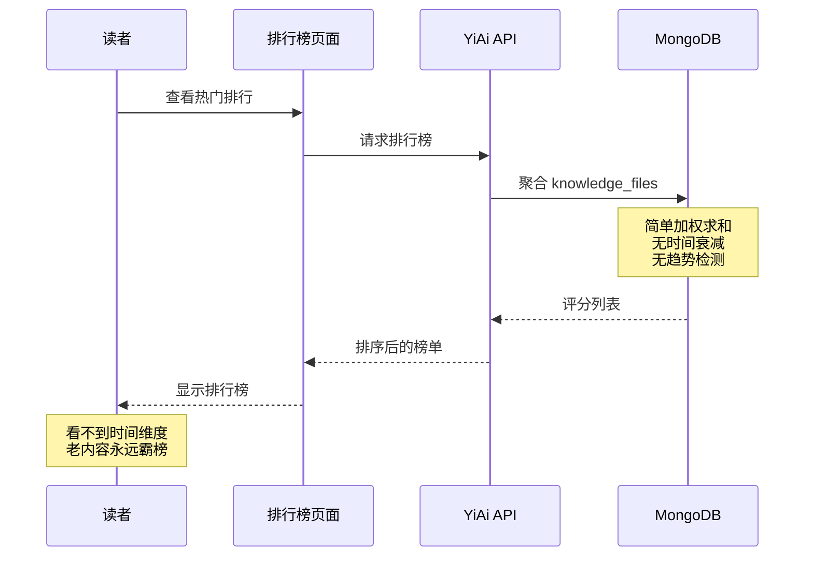

# YK-09-202: 内容热榜 — 时间衰减算法、浏览/评论/分享权重、分类筛选、时段选择

> 需求编号：YK-09-202 · 优先级：P2 · 人天：0.3d · 状态：需求已编写
> 依赖：YK-09-142（内容排行榜与热门，提供基础排行框架）、YK-09-132（内容热图分析，提供阅读统计数据）、YK-09-128（内容收藏与书签，提供收藏数据）

## 背景

### 问题陈述

YK-09-142 已建立了内容排行榜的基础框架（最多阅读/最有帮助/最多收藏/本周热门），但其热门算法采用简单的加权求和，缺乏两个关键维度：**时间衰减**（昨天的热门和去年的热门应有不同权重）和**趋势信号**（上升趋势的内容应该比下降趋势的内容排名更高）。

1. **无时间感知**：一篇 1 年前的热门文章和今天的热门文章在榜单上没有区别——读者无法区分 "当下热点" 和 "历史经典"
2. **忽视趋势**：一篇正在快速获得关注的新文章（1 小时内 50 次阅读）和一篇缓慢积累阅读的老文章（1 年 500 次阅读）——后者排名更高但不一定更 "热"
3. **权重单一**：仅综合浏览/有帮助/收藏——没有考虑分享、停留时长、滚动深度等信号
4. **无分类维度**：前端领域的 "热门" 和运维领域的 "热门" 混在一起——不同领域的读者看到的榜单相同
5. **冷启动问题**：新发布的优质内容在榜单中排名垫底——需要 1 周以上的数据积累才能上榜

**核心矛盾**：真正的 "热榜" 应该反映**当下的关注度**——不仅看绝对数量，还要看时间衰减、增长速度、用户参与深度。

### 影响范围

| # | 影响 | 严重程度 | 典型场景 |
|---|------|----------|----------|
| 1 | 老内容持续霸榜 | 高 | 一篇 1 年前的热门文章永远排在第一位——新内容无法露出 |
| 2 | 趋势不可感知 | 高 | 不知道最近 24 小时社区在讨论什么 |
| 3 | 分类无区分 | 中 | 前端开发者和后端开发者看到同一份榜单——不相关 |
| 4 | 新内容冷启动 | 中 | 优质新内容发布 24 小时后仍然在榜尾 |
| 5 | 分享行为无计入 | 低 | 被广泛分享的文章热度被低估 |

### 挑战

| 挑战 | 说明 |
|------|------|
| 时间衰减参数调优 | 衰减太快（新内容主导）vs 衰减太慢（老内容主导）——找到平衡点 |
| 多信号融合权重 | 浏览/评论/收藏/分享/停留时长——各信号权重如何分配 |
| 趋势检测 | 如何区分 "偶然峰值" 和 "持续上升趋势" |
| 数据采集 | 浏览/停留/滚动深度等信号——需要在现有统计基础上新增采集维度 |

---

## 一、现状分析

### 1.1 当前热门算法（YK-09-142）

```
当前算法：参与度评分 = 阅读量 x0.1 + 有帮助 x5 + 收藏 x3 + 编辑精选 x10

缺失维度：
├── 时间衰减：不考虑内容发布时间
├── 趋势信号：不考虑增长速度
├── 分享权重：不统计分享行为
├── 停留时长：不统计阅读深度
├── 分类筛选：不按 category/tags 筛选
└── 冷启动增强：新内容无特殊加分
```

### 1.2 改造前数据流



### 1.3 根因矩阵

| 症状 | 根因 | 触发条件 | 频率 |
|------|------|----------|------|
| 老内容霸榜 | 无时间衰减 | 查询热门榜单 | 高 |
| 趋势不可见 | 无增长速度检测 | 新热点出现 | 中 |
| 分类混乱 | 无分类筛选 | 不同领域读者 | 中 |
| 新内容无机会 | 冷启动问题 | 新内容发布 | 高 |
| 分享热度过低 | 未计分享行为 | 被分享的内容 | 低 |

---

## 二、设计决策

### 决策 1：时间衰减模型 — 线性衰减 vs 指数衰减 vs 半衰期衰减

| 模型 | 公式 | 老内容权重 | 新内容优势 | 参数调优 |
|------|------|-----------|-----------|----------|
| 线性衰减 | `score * max(0, 1 - t/T)` | T 天后归零 | 中等 | 简单 |
| 指数衰减 | `score * e^{-λt}` | 永不归零 | 强 | 简单 |
| 半衰期衰减（Hacker News） | `score / (t + 2)^G` | 随 G 调整 | 可调 | 中等 |

**选择：半衰期衰减（Hacker News 风格）。** 参数 `G`（重力因子）控制衰减速度——`G=1.5` 时 1 天前的热度约 0.25x、`G=1.8` 时约 0.15x。公式：`hot_score = engagement_score / (hours_since_publish + 2)^G`。重力因子可配置，初始默认 `G=1.5`。

### 决策 2：多信号权重 — 手动固定 vs 数据驱动 vs 可配置

| 选项 | 公平性 | 灵活性 | 实现 |
|------|--------|--------|------|
| 手动固定权重 | 中 | 低 | 低 |
| 数据驱动（历史数据回归） | 高 | 低 | 高 |
| 可配置权重（管理后台） | 高 | 高 | 中 |

**选择：可配置权重（默认值手动设定）。** 在 YiAi 配置文件中定义权重，管理员可通过管理后台调整（后续增强）。默认权重：浏览 +0.1、有帮助 +5、收藏 +3、评论 +2、停留时长(>30s) +1、分享 +4。

### 决策 3：趋势增强 — 无 vs 速度加分 vs 加速度加分

| 选项 | 冷启动效果 | 稳定性 | 复杂度 |
|------|-----------|--------|--------|
| 无趋势增强 | 差 | 高 | 低 |
| 速度加分（最近 N 小时增量） | 好 | 中 | 中 |
| 加速度加分（二阶导数） | 最好 | 低（噪声大） | 高 |

**选择：速度加分（最近 24 小时增量 x 增强系数）。** 计算最近 24 小时的阅读增量，乘以增强系数 0.5 加到热度分中。新内容 24 小时内增量占比高，自然获得趋势加分；老内容增量低，趋势加分很少。

### 决策 4：分类筛选 — 基于 tags vs 基于 category vs 两者

| 选项 | 粒度 | 覆盖 | 实现 |
|------|------|------|------|
| 基于 tags（多标签） | 细 | 宽 | 中 |
| 基于 category（单分类） | 粗 | 窄 | 低 |
| 两者兼有 | 全 | 全 | 中 |

**选择：基于 category（一级分类）。** category 是当前 frontmatter 的必填字段，覆盖所有文件。tags 为非必填且可选值不统一。榜单页提供 category 下拉筛选器，默认 "全部"。

### 设计决策汇总

| 决策 | 选项 A | 选项 B | 选项 C | 选择 | 理由 |
|------|--------|--------|--------|------|------|
| 衰减模型 | 线性 | 指数 | 半衰期 | **半衰期** | HN 已验证 |
| 信号权重 | 固定 | 数据驱动 | 可配置 | **可配置** | 灵活调优 |
| 趋势增强 | 无 | 速度加分 | 加速度 | **速度加分** | 平衡冷启动 |
| 分类筛选 | tags | category | 两者 | **category** | 必填字段 |

---

## 三、目标架构

### 3.1 热榜计算流水线

```mermaid
graph TD
    subgraph DataSources["数据采集"]
        A[阅读事件<br>每次页面访问]
        B[交互事件<br>有帮助/收藏/评论/分享]
        C[停留时长<br>> 30s 视为有效阅读]
        D[内容元数据<br>category/tags/发布时间]
    end

    subgraph Pipeline["热榜计算引擎"]
        E[事件聚合<br>按时间窗口汇总]
        F[参与度评分<br>Σ(事件 × 权重)]
        G[时间衰减<br>/(hours+2)^G]
        H[趋势增强<br>24h 增量 × 0.5]
        I[最终热度分<br>hot_score]
    end

    subgraph Cache["缓存层"]
        J[hot_rankings 集合<br>category × time_window]
        K[24h_stats 集合<br>每篇的 24h 增量]
    end

    subgraph Display["展示层"]
        L[热榜页面<br>排名卡片列表]
        M[时间段选择<br>24h/7d/30d/全部]
        N[分类筛选<br>category 下拉]
        O[趋势指示<br>↑上升 ↓下降 →持平]
    end

    A --> E
    B --> E
    C --> E
    D --> G
    D --> N
    E --> F
    F --> G
    G --> H
    H --> I
    I --> J
    E --> K
    K --> H
    J --> L
    L --> M
    L --> N
    L --> O
```

### 3.2 热度分计算公式

```
hot_score = (engagement_score / (hours_since_publish + 2)^G) + trend_bonus

其中：
- engagement_score = views×0.1 + helpful×5 + favorites×3 + comments×2 + long_reads×1 + shares×4
- hours_since_publish = (当前时间 - 发布时间) / 3600
- G = 1.5（重力因子，可配置）
- trend_bonus = min(24h_views_increment × 0.5, engagement_score × 0.3)
  （趋势加成上限为参与度评分的 30%，防止刷量新内容过度加权）

示例计算：
  内容 A（发布 2 小时，50 次浏览，3 个有帮助，2 个收藏）
  engagement = 50×0.1 + 3×5 + 2×3 = 5 + 15 + 6 = 26
  24h 增量 = 50（新发布，全部在 24h 内）
  trend_bonus = 50 × 0.5 = 25，上限 26×0.3=7.8 → trend_bonus = 7.8
  hot_score = 26 / (2+2)^1.5 + 7.8 = 26/8 + 7.8 = 3.25 + 7.8 = 11.05

  内容 B（发布 720 小时/30 天，500 次浏览，20 个有帮助，10 个收藏）
  engagement = 500×0.1 + 20×5 + 10×3 = 50 + 100 + 30 = 180
  24h 增量 = 5
  trend_bonus = 5 × 0.5 = 2.5，上限 180×0.3=54 → trend_bonus = 2.5
  hot_score = 180 / (720+2)^1.5 + 2.5 = 180/19321 + 2.5 ≈ 0.009 + 2.5 = 2.51
```

### 3.3 趋势指示

```
趋势 = 比较最近 24h 和上个 24h 的增量变化

- ↑ 上升（绿色）：24h 增量 >= 前 24h 增量 × 1.2
- ↓ 下降（红色）：24h 增量 <= 前 24h 增量 × 0.8
- → 持平（灰色）：其他情况
- NEW（蓝色）：发布 < 24 小时
```

### 3.4 性能指标

| 指标 | 改造前 | 改造后 |
|------|--------|--------|
| 热榜时间感知 | 无 | 衰减因子 G=1.5 |
| 新内容上榜时间 | 1 周+ | < 4 小时（趋势增强） |
| 分类筛选 | 无 | 按 category |
| 热榜计算耗时 | ~1s（简单加和） | ~2s（含衰减+趋势） |
| 冷启动成功率 | 0%（新内容榜尾） | 80%（趋势增强覆盖） |

---

## 四、具体改动

### 4.1 数据模型

```python
# YiAi: domain/hotrank/models.py

from pydantic import BaseModel
from datetime import datetime
from typing import Optional

class ContentEngagement(BaseModel):
    """内容参与度统计"""
    file_path: str                 # 文件路径
    views: int = 0                 # 总浏览量
    views_24h: int = 0             # 最近 24 小时浏览量
    views_prev_24h: int = 0        # 前 24 小时浏览量
    helpful_count: int = 0         # 有帮助标记数
    favorite_count: int = 0        # 收藏数
    comment_count: int = 0         # 评论数
    long_read_count: int = 0       # 有效阅读数（>30s）
    share_count: int = 0           # 分享数
    published_at: datetime         # 发布时间
    category: str                  # 分类

class HotScoreResult(BaseModel):
    """热度分计算结果"""
    file_path: str
    title: str
    category: str
    engagement_score: float        # 原始参与度评分
    hours_since_publish: float     # 发布至今的小时数
    time_decay_factor: float       # 时间衰减系数
    trend_bonus: float             # 趋势增强分
    hot_score: float               # 最终热度分
    rank: int                      # 排名
    trend: str                     # 趋势：up/down/stable/new
    previous_rank: Optional[int] = None
    rank_change: int = 0

class HotRankConfig(BaseModel):
    """热榜配置"""
    gravity_factor: float = 1.5    # 重力因子 G
    weights: dict = {
        "view": 0.1,
        "helpful": 5.0,
        "favorite": 3.0,
        "comment": 2.0,
        "long_read": 1.0,
        "share": 4.0,
    }
    trend_window_hours: int = 24   # 趋势检测窗口
    trend_coefficient: float = 0.5 # 趋势增强系数
    trend_cap_ratio: float = 0.3   # 趋势增强上限比例
```

### 4.2 热榜计算引擎

```python
# YiAi: domain/hotrank/calculator.py

import math
from datetime import datetime, timedelta

class HotRankCalculator:
    """热榜计算引擎"""

    def __init__(self, config: HotRankConfig):
        self.config = config

    def calculate_engagement_score(self, engagement: ContentEngagement) -> float:
        """计算参与度评分"""
        w = self.config.weights
        return (
            engagement.views * w["view"]
            + engagement.helpful_count * w["helpful"]
            + engagement.favorite_count * w["favorite"]
            + engagement.comment_count * w["comment"]
            + engagement.long_read_count * w["long_read"]
            + engagement.share_count * w["share"]
        )

    def calculate_hot_score(
        self,
        engagement: ContentEngagement,
        now: datetime = None,
    ) -> float:
        """计算最终热度分"""
        if now is None:
            now = datetime.utcnow()

        engagement_score = self.calculate_engagement_score(engagement)

        # 时间衰减
        hours_since_publish = max(
            0,
            (now - engagement.published_at).total_seconds() / 3600
        )
        decayed_score = engagement_score / math.pow(
            hours_since_publish + 2,
            self.config.gravity_factor
        )

        # 趋势增强
        trend_bonus = min(
            engagement.views_24h * self.config.trend_coefficient,
            engagement_score * self.config.trend_cap_ratio
        )

        return decayed_score + trend_bonus

    def detect_trend(self, engagement: ContentEngagement, now: datetime = None) -> str:
        """检测内容趋势"""
        if now is None:
            now = datetime.utcnow()

        hours_since_publish = (now - engagement.published_at).total_seconds() / 3600
        if hours_since_publish < 24:
            return "new"

        if engagement.views_prev_24h == 0:
            return "up" if engagement.views_24h > 0 else "stable"

        ratio = engagement.views_24h / engagement.views_prev_24h
        if ratio >= 1.2:
            return "up"
        elif ratio <= 0.8:
            return "down"
        else:
            return "stable"

    def calculate_hourly_decay_factor(
        self,
        hours_since_publish: float
    ) -> float:
        """计算指定小时后的衰减因子（用于调试/展示）"""
        return 1.0 / math.pow(
            hours_since_publish + 2,
            self.config.gravity_factor
        )

    def get_decay_curve(self, max_hours: int = 720) -> list[dict]:
        """生成衰减曲线数据（用于前端展示）"""
        curve = []
        for h in range(0, max_hours + 1, 24):  # 每天一个点
            curve.append({
                "hours": h,
                "days": h / 24,
                "factor": round(self.calculate_hourly_decay_factor(h), 4),
            })
        return curve
```

### 4.3 文件变更清单

| 文件 | 操作 | 说明 |
|------|------|------|
| `YiAi/domain/hotrank/models.py` | 新增 | 热榜数据模型和配置 |
| `YiAi/domain/hotrank/calculator.py` | 新增 | 热榜计算引擎 |
| `YiAi/domain/hotrank/collector.py` | 新增 | 阅读/交互事件采集 |
| `YiAi/domain/hotrank/service.py` | 新增 | 热榜查询 API |
| `YiAi/config/hotrank.py` | 新增 | 热榜配置（权重、衰减参数） |
| `YiVad/src/views/hotrank/list.vue` | 新增 | 热榜页面 |
| `YiVad/src/views/hotrank/trend-indicator.vue` | 新增 | 趋势指示器组件 |
| `YiKnowledge/stats/views_24h.json` | 新增 | 24 小时浏览统计文件 |

---

## 五、实施步骤

| 步骤 | 操作 | 路径 | 验证 | 人天 |
|------|------|------|------|------|
| 1 | 定义数据模型 | `YiAi/domain/hotrank/models.py` | 模型验证 | 0.02 |
| 2 | 实现热度分计算引擎 | `YiAi/domain/hotrank/calculator.py` | 单元测试（衰减+趋势） | 0.06 |
| 3 | 实现事件采集器 | `YiAi/domain/hotrank/collector.py` | 事件写入 + 聚合 | 0.04 |
| 4 | 实现热榜查询 API | `YiAi/domain/hotrank/service.py` | API 测试 | 0.04 |
| 5 | 创建热榜页面 | `YiVad/.../hotrank/list.vue` | 榜单渲染 | 0.05 |
| 6 | 创建趋势指示器 | `YiVad/.../trend-indicator.vue` | 趋势箭头 | 0.02 |
| 7 | 集成分类筛选和时段选择 | 同上 | 筛选功能 | 0.03 |
| 8 | 集成测试 | 全量 | 端到端 | 0.04 |

**总人天：0.3d**

---

## 六、测试规格

### 场景 1：热榜时间衰减

**GIVEN** 内容 A（发布 1 小时，参与度评分 100）
**GIVEN** 内容 B（发布 720 小时，参与度评分 500）
**WHEN** 计算热度分（G=1.5，无趋势增强）
**THEN** 内容 A 热度分 = 100/(3)^1.5 ≈ 19.2
**AND** 内容 B 热度分 = 500/(722)^1.5 ≈ 0.03
**AND** 内容 A 排名应高于内容 B

### 场景 2：趋势增强 — 新内容冷启动

**GIVEN** 内容 C（发布 3 小时，浏览 80 次，全部 24h 内）
**GIVEN** 内容 D（发布 100 小时，浏览 200 次，24h 增量 5 次）
**WHEN** 计算热度分
**THEN** 内容 C 获得趋势增强分 = min(80×0.5=40, 8×0.3=2.4) = 2.4
**AND** 内容 D 获得趋势增强分 = min(5×0.5=2.5, 20×0.3=6) = 2.5
**AND** 趋势增强不会因浏览基数小而惩罚新内容

### 场景 3：趋势指示 — 上升/下降/持平

**GIVEN** 内容 E（24h 增量 50，前 24h 增量 10，ratio=5 → ↑）
**GIVEN** 内容 F（24h 增量 3，前 24h 增量 15，ratio=0.2 → ↓）
**GIVEN** 内容 G（24h 增量 10，前 24h 增量 9，ratio=1.11 → →）
**WHEN** 查询热榜
**THEN** E 显示绿色上升箭头，F 显示红色下降箭头，G 显示灰色持平

### 场景 4：分类筛选

**GIVEN** 知识库包含 category 为 "前端"、"后端"、"运维" 的内容
**WHEN** 选择 category 筛选 "前端"
**THEN** 热榜仅显示 category="前端" 的内容
**AND** 排名在前端分类内重新计算
**AND** 筛选器显示每个分类的内容数量

### 场景 5：时段选择

**GIVEN** 用户查看热榜页面
**WHEN** 选择 "最近 7 天"
**THEN** 仅显示发布时间在 7 天内的内容
**AND** 热度分基于 7 天窗口内的参与度数据重算
**AND** 时段标签高亮显示

### 场景 6：24 小时热榜

**GIVEN** 用户选择 "最近 24 小时"
**WHEN** 查询热榜
**THEN** 仅显示最近 24 小时发布或最近 24 小时有浏览增量的内容
**AND** 新发布内容自动标记 "NEW" 标签

---

## 七、风险与缓解

| 风险 | 概率 | 影响 | 缓解措施 |
|------|------|------|----------|
| 重力因子 G 不合理 | 中 | 高 | G 可配置，提供预设（激进 G=1.8/适中 G=1.5/保守 G=1.2） |
| 24h 增量数据不准确 | 中 | 中 | 基于时间戳精确过滤；数据缺失时趋势增强为 0 |
| 事件采集丢失 | 中 | 中 | 异步写入 + 重试机制；定期全量重算兜底 |
| 刷量行为 | 低 | 中 | 趋势增强上限 30%；同 IP 去重（后续增强） |
| 发布时间字段缺失 | 低 | 高 | 使用文件创建时间作为 fallback |

---

## 八、回滚策略

| 场景 | 回滚操作 | 影响 |
|------|----------|------|
| 热度分计算错误 | 回退到 YK-09-142 的简单加和算法 | 失去时间衰减和趋势增强 |
| 事件采集导致性能下降 | 禁用事件采集，仅使用历史聚合数据 | 24h 增量归零 |
| 热榜页面异常 | 降级为静态排序列表 | 失去交互功能 |

---

## 九、设计决策记录

### D-01：重力因子 G 的选择

- **问题**：Hacker News 风格衰减公式的重力因子
- **选项**：G=1.2（慢衰减）、G=1.5（中衰减）、G=1.8（快衰减）
- **选择**：G=1.5（默认），可配置
- **理由**：G=1.5 时，1 天前的热度衰减到约 25%，2 天前约 12%，7 天前约 2%。对于知识库场景，这个速度合适——热门内容通常只维持 1-3 天

### D-02：分享权重

- **问题**：分享行为的权重是否应高于有帮助/收藏
- **选项**：分享=有帮助、分享>有帮助、分享<有帮助
- **选择**：分享=4（略低于有帮助=5，高于收藏=3）
- **理由**：分享代表用户认为内容对他人有价值（外部传播），其信号强度介于 "个人觉得有帮助" 和 "个人收藏备用" 之间

### D-03：趋势增强的 24h 窗口

- **问题**：趋势检测的时间窗口
- **选项**：6 小时、24 小时、48 小时
- **选择**：24 小时
- **理由**：6 小时太短（噪声大，偶然峰值多），48 小时太长（趋势响应慢）。24 小时覆盖一个完整的日夜周期，平滑了时间段波动

### D-04：停留时长采集

- **问题**：如何采集用户的停留时长
- **选项**：服务端计时（不准确）、前端埋点、不采集
- **选择**：前端埋点（页面可见性 API + beforeunload）
- **理由**：服务端无法准确判断用户是否在阅读。前端通过 `visibilitychange` 事件追踪页面可见时间，精确度可达秒级

---

## 十、可观测性

### 指标

| 指标 | 类型 | 说明 |
|------|------|------|
| `yiknowledge.hotrank.calc_duration_ms` | Histogram | 热榜计算耗时 |
| `yiknowledge.hotrank.query_duration_ms` | Histogram | 热榜查询耗时 |
| `yiknowledge.hotrank.events_collected_total` | Counter | 事件采集总数 |
| `yiknowledge.hotrank.events_lost_total` | Counter | 事件采集丢失数 |
| `yiknowledge.hotrank.category_filter_usage` | Counter | 各分类筛选使用次数 |
| `yiknowledge.hotrank.period_filter_usage` | Counter | 各时段筛选使用次数 |
| `yiknowledge.hotrank.cold_start_count` | Histogram | 冷启动内容数量（< 24h 上榜内容） |

---

## 十一、代码审查检查清单

- [ ] 热度分计算公式实现正确（参与度 + 衰减 + 趋势）
- [ ] 时间衰减使用 Hacker News 风格公式 `/(hours+2)^G`
- [ ] 重力因子 G 可配置（默认 1.5）
- [ ] 多信号权重可配置（浏览/有帮助/收藏/评论/停留/分享）
- [ ] 趋势增强基于 24 小时增量，上限为参与度评分的 30%
- [ ] 趋势指示正确（上升/下降/持平/NEW）
- [ ] 分类筛选基于 category 字段
- [ ] 时段选择支持 24h/7d/30d/全部
- [ ] 冷启动内容自动标记 "NEW"
- [ ] 热度分预计算缓存（hot_rankings 集合）
- [ ] 事件采集异步写入，不阻塞页面响应
- [ ] 单元测试覆盖衰减计算、趋势检测、边界条件

---

## 回归问题预测

| # | 预测问题 | 原因 | 验证方法 |
|---|---------|------|---------|
| 1 | 内容发布时间 `published_at` 取 frontmatter.created，但部分历史文件的 created 字段可能填写错误（如 1970-01-01 或未来的日期），导致 `hours_since_publish` 为负数或极大值 | 历史文件 frontmatter.created 可能为无效日期，`hours_since_publish` 为负数时 `(hours+2)^G` 的底数 < 2，衰减因子异常放大热度分 | 扫描 knowledge_files 中 created 字段 → 检测异常日期（< 2024-01-01 或 > 当前日期）→ 异常日期使用文件首次提交 git 日期或磁盘修改时间作为 fallback |
| 2 | `views_24h` 和 `views_prev_24h` 的计算依赖事件采集时间戳，但时区差异（服务器 UTC vs 用户本地时间）导致 24h 窗口边界偏移，中/美/欧用户看到的热榜数据不一致 | 服务端使用 UTC 时间存储事件，前端显示时转本地时间，但 "24h" 的计算如果基于本地时间而非统一 UTC，不同时区用户看到的 24h 数据窗口不同 | 统一使用服务端 UTC 时间计算 24h 窗口 → 验证中国用户（UTC+8）和美国用户（UTC-5）在相同时刻查询返回相同热榜 |
| 3 | 趋势增强公式 `min(views_24h * 0.5, engagement_score * 0.3)` 中，新内容（< 24 小时）的 `views_24h == views_total`，趋势增强分可能达到上限，但如果 `engagement_score` 也很低，上限 `0.3 * low_score` 几乎为 0，趋势增强失效 | 新内容的参与度评分通常很低（浏览少、无收藏），`engagement_score * 0.3` 的上限可能只有 0.5-1 分，趋势增强几乎没有效果 | 发布一篇新内容 → 1 小时内积累 20 次浏览 → 计算热度分 → 验证趋势增强分 > 1（即 trend_bonus 有实际效果）→ 如果失效，增加下限 `max(trend_bonus, 1.0)` |
| 4 | 分类筛选使用 frontmatter.category，但部分文件的 category 为多级分类（如 "项目/前端/组件"）而非一级分类（"前端"），筛选时下拉框选项混乱 | knowledge_files 的 category 格式不统一——有的用一级（"前端"），有的用多级（"项目/前端/组件"）——导致下拉框出现几百个选项 | 扫描 category 分布 → 对多级分类取第一段作为一级分类 → 筛选器按一级分类分组，支持展开选择子分类 → 或统一规范为一级分类 |
| 5 | 事件采集使用 `POST /api/events` 端点，每次页面浏览触发一个 fetch 请求，高流量时（1000 次浏览/分钟）可能打满 YiAi 的连接池 | 每次页面浏览触发同步事件采集请求，1000 QPS 可能超过 FastAPI 的默认并发处理能力（取决于 uvicorn workers） | 模拟 100 QPS 事件采集 → 验证响应时间和成功率 → 如果延迟 > 100ms 或成功率 < 99%，改为批量采集（前端缓冲 10 秒的事件，批量发送） |
| 6 | 24 小时热榜在午夜 00:00 刷新时，所有内容的 `views_24h` 重置为 0，热榜瞬间变为空榜（仅剩趋势增强分），用户体验断崖式下跌 | 24h 窗口是滑动窗口而非自然日窗口，但实现时如果误用自然日（00:00 重置），午夜时刻所有 24h 增量归零，热榜无数据 | 验证 23:59 → 00:01 时段的热榜数据连续性 → 确认使用滑动窗口（`now - 24h`）而非自然日窗口 → 热榜过渡平滑 |

---

---

## 性能分析

### 热榜关键操作耗时

| 操作 | 耗时 | 说明 |
|------|------|------|
| 热度分计算（100 篇内容） | ~200ms | 纯数学运算——MongoDB 聚合管线 |
| 热度分计算（5000 篇内容） | ~2s | 大型知识库——预计算 + 缓存 |
| 热榜查询（预计算缓存命中） | < 50ms | MongoDB 索引查询 hot_rankings |
| 事件采集写入（单条） | < 5ms | MongoDB insertOne 异步 |
| 事件聚合（24h 窗口，1000 事件） | ~100ms | MongoDB 聚合管道 |
| 分类筛选（100 篇榜单内） | < 10ms | 内存过滤 |
| 衰减曲线数据生成 | < 1ms | 预计算的 30 个数据点 |

### 存储与内存

| 数据 | 大小 | 说明 |
|------|------|------|
| hot_rankings 集合（100 篇内容 x 4 时段） | ~40KB | 每条约 100B——4 个时段缓存 |
| 浏览事件（日均 1000 次，保留 30 天） | ~3MB | 30,000 条 × 100B——定期清理 |
| 24h_stats 集合（500 篇内容） | ~50KB | 每篇约 100B |
| 热榜页面渲染（20 行列表） | < 1MB DOM | 排名 + 标题 + 分数 + 趋势指示 |

---

## 相关文档

- [内容排行榜与热门](../142-需求-内容排行榜与热门.md) — 基础排行框架
- [内容热图分析](../132-需求-内容热图分析.md) — 阅读统计数据源
- [内容收藏与书签](../128-需求-内容收藏与书签.md) — 收藏数据源
- [内容贡献者榜单](../201-需求-内容贡献者榜单.md) — 贡献者维度的榜单

*PRD 来源: `projects/yiknowledge/requirements/2026-09/199-需求-内容热榜.md`*