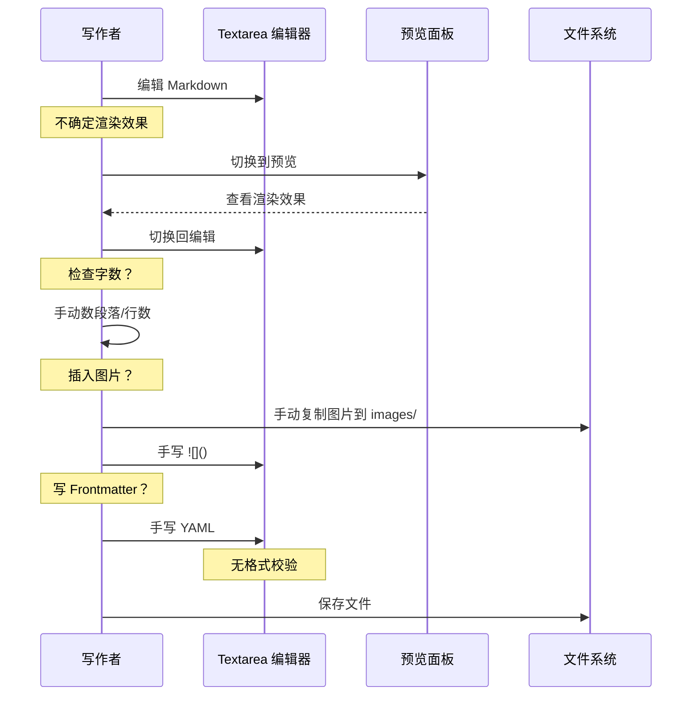
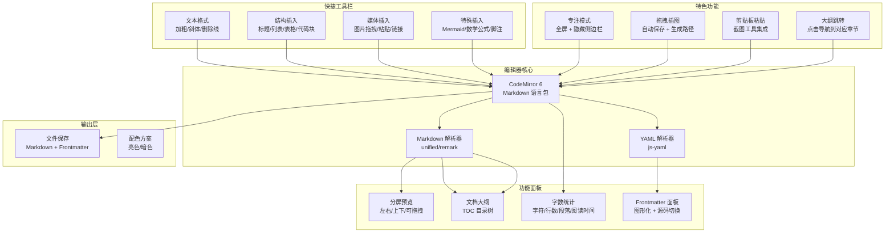
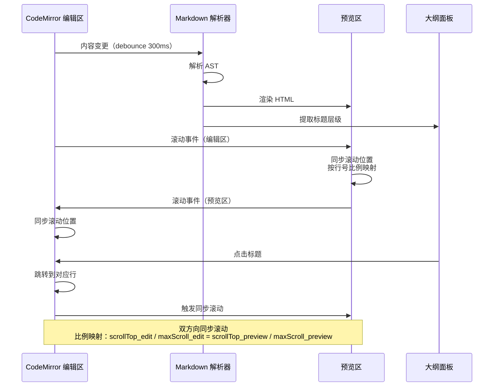

# YK-09-203: 内容编辑器增强 — 分屏预览、字数统计、大纲面板、专注模式、快捷工具栏、拖拽插图、Frontmatter 编辑面板

> 需求编号：YK-09-203 · 优先级：P2 · 人天：0.3d · 状态：需求已编写
> 依赖：YK-09-22（AI 辅助知识写作，提供 AI 写作辅助）、YK-09-129（内容差异与合并，提供 diff 视图）、YK-09-01（Frontmatter 规范，提供 frontmatter 字段定义）

## 背景

### 问题陈述

YiKnowledge 当前使用的 Markdown 编辑器是一个基础的 textarea + 预览切换面板——编辑时看不到预览，预览时不能编辑。长文档超过 2000 行时，编辑者需要频繁滚动定位章节、手动计数字数、在大脑中维护文档结构。写一篇 3000 字的架构设计文档时，编辑器不能提供任何写作辅助。

1. **编辑和预览分离**：写作时看不到渲染效果，需要频繁切换——打断写作心流
2. **无字数统计**：不知道当前写了多少字、目标字数是否达标——PRD 要求 500 行但无法实时判断
3. **无文档大纲**：2000 行的需求文档——无法在目录结构中快速跳转到某个章节
4. **无专注模式**：编辑器周围充满 UI 控件——全屏写作时干扰多
5. **工具栏缺失**：插入 Markdown 语法（加粗/链接/表格/代码块）需要手动输入——新人不熟悉语法
6. **图片插入繁琐**：需要手动将图片放到 `images/` 目录，然后在 Markdown 中手写 `` 路径
7. **Frontmatter 编辑体验差**：YAML frontmatter 直接写在 textarea 中——缺少格式校验和字段提示

**核心矛盾**：Markdown 编辑器是知识库使用频率最高的工具——但当前体验停留在"文本输入框"级别，缺乏现代编辑器的标准能力。

### 影响范围

| # | 影响 | 严重程度 | 典型场景 |
|---|------|----------|----------|
| 1 | 写作心流被打断 | 高 | 编辑 5 分钟 → 切换预览 30 秒 → 返回编辑 → 重复 20 次 |
| 2 | 字数不可知 | 中 | 需求文档要求 400-600 行 → 写完不知道是否达标 |
| 3 | 长文档定位困难 | 高 | 1500 行文档中查找某个章节——需要手动滚动搜索 |
| 4 | 写作环境干扰多 | 中 | 侧边栏、工具栏、通知——影响深度写作 |
| 5 | Markdown 语法门槛 | 中 | 新人不熟悉 Markdown → 插入表格/代码块时需查阅语法 |
| 6 | 图片管理混乱 | 中 | 图片路径错误、忘记同步图片文件、截图粘贴后 base64 污染源文件 |
| 7 | Frontmatter 格式错误 | 高 | YAML 缩进错误、缺少必填字段 → RAG 索引失败 |

### 挑战

| 挑战 | 说明 |
|------|------|
| 分屏同步滚动 | 编辑区和预览区的滚动位置需要实时同步 |
| 图片存储策略 | 拖拽/粘贴的图片存储在哪里、如何生成引用路径 |
| Frontmatter 双向编辑 | 图形化面板和源码编辑器的数据双向同步 |
| 性能 | 2000+ 行文档的分屏渲染和实时预览性能 |
| 快捷键冲突 | 专注模式下的 ESC 退出与浏览器默认行为的冲突 |

---

## 一、现状分析

### 1.1 当前编辑器能力

```
当前编辑器（YiKnowledge）：
├── 基础编辑
│   ├── textarea 纯文本编辑
│   ├── 编辑/预览切换（二选一）
│   └── 基础语法高亮（CodeMirror 或类似）
├── 保存
│   ├── 手动保存（Ctrl+S）
│   └── 自动保存（定时）
└── 文件操作
    ├── 新建文件
    └── 文件列表

缺失：
├── 分屏预览（编辑 + 预览同屏）
├── 字数统计
├── 文档大纲（TOC 侧边栏）
├── 专注模式（全屏无干扰）
├── 快捷工具栏（Markdown 语法插入）
├── 拖拽/粘贴图片
└── Frontmatter 图形化编辑面板
```

### 1.2 改造前编辑体验



### 1.3 根因矩阵

| 症状 | 根因 | 触发条件 | 频率 |
|------|------|----------|------|
| 频繁切换编辑/预览 | 无分屏预览 | 每次写作 | 高 |
| 不确定字数 | 无字数统计 | 写长文档 | 高 |
| 难以定位章节 | 无文档大纲 | 编辑 500+ 行文档 | 高 |
| 手写 Markdown 语法错误 | 无快捷工具栏 | 插入表格/代码/链接 | 中 |
| 图片路径错误 | 无拖拽插入 | 添加图片 | 中 |
| Frontmatter 格式错误 | 无图形化编辑 | 创建/编辑文件 | 高 |

---

## 二、设计决策

### 决策 1：编辑器技术选型 — CodeMirror 6 vs Monaco vs 自研

| 选项 | 包大小 | Markdown 支持 | 扩展性 | 学习曲线 |
|------|--------|--------------|--------|----------|
| CodeMirror 6 | ~150KB gzip | 好（有 Markdown 语言包） | 高（模块化） | 中 |
| Monaco Editor | ~5MB gzip | 好 | 高 | 低（VS Code 核心） |
| 自研（textarea + 语法高亮） | ~10KB | 基础 | 低 | 低 |

**选择：CodeMirror 6。** Monaco 体积过大（5MB），不适合知识库静态站点。CodeMirror 6 模块化设计——按需加载 Markdown 语言包、预览扩展、折叠扩展，总 gzip 约 150KB。自研方案无法满足分屏预览、大纲提取等高级需求。

### 决策 2：分屏布局 — 左右分屏 vs 上下分屏 vs 可切换

| 选项 | 空间利用 | 长行文档 | 实现 |
|------|----------|----------|------|
| 左右分屏 | 中 | 好（行宽不受限） | 中 |
| 上下分屏 | 高（全宽） | 差（长行需滚动） | 低 |
| 可切换（左/右/上/下） | 高 | 好 | 高 |

**选择：左右分屏（默认）+ 可切换。** 左右分屏是 VS Code/Notion 等主流编辑器的默认布局，用户习惯。提供切换按钮支持上下分屏和仅编辑模式。分屏比例可拖拽调整（默认 50:50）。

### 决策 3：图片处理 — Base64 内嵌 vs 本地文件 vs 上传到 OSS

| 选项 | 便携性 | 文件大小 | 可维护性 |
|------|--------|----------|----------|
| Base64 内嵌 | 高（单文件） | 差（增大 33%） | 差（不可管理） |
| 本地文件（images/ 目录） | 中 | 好 | 好 |
| OSS/CDN 上传 | 低（依赖外部） | 好 | 好 |

**选择：本地文件（images/ 目录）。** 拖拽/粘贴的图片自动保存到 `images/` 子目录，生成规范的 Markdown 引用路径 ``。自动命名规则：`{filename}-{timestamp}.{ext}`。Base64 会严重污染源文件（一个 100KB 的 PNG base64 约 133KB 文本），且难以后续管理和替换。

### 决策 4：Frontmatter 编辑 — 仅图形化 vs 仅源码 vs 双模式

| 选项 | 易用性 | 灵活性 | 实现 |
|------|--------|--------|------|
| 仅图形化面板 | 高 | 低（无法编辑未知字段） | 中 |
| 仅源码（当前方案） | 低 | 高 | 低 |
| 双模式（面板+源码切换） | 高 | 高 | 中 |

**选择：双模式（图形化面板 + 源码切换）。** 图形化面板显示标准字段（title/tags/category/created/updated/source/type/status），带格式校验和字段提示。提供 "编辑源码" 按钮切换到 YAML 文本编辑器，支持编辑非标准自定义字段。

### 设计决策汇总

| 决策 | 选项 A | 选项 B | 选项 C | 选择 | 理由 |
|------|--------|--------|--------|------|------|
| 编辑器 | CodeMirror 6 | Monaco | 自研 | **CodeMirror 6** | 轻量 + 模块化 |
| 分屏 | 左右 | 上下 | 可切换 | **可切换** | 灵活 |
| 图片 | Base64 | 本地文件 | OSS | **本地文件** | 可维护 |
| Frontmatter | 图形化 | 源码 | 双模式 | **双模式** | 易用+灵活 |

---

## 三、目标架构

### 3.1 增强编辑器架构



### 3.2 分屏同步机制



### 3.3 性能指标

| 指标 | 改造前 | 改造后 |
|------|--------|--------|
| 编辑器初始化 | < 200ms（textarea） | < 500ms（CodeMirror 6 + 扩展） |
| 分屏渲染（1000 行） | 无 | < 100ms（debounce） |
| 大纲提取（2000 行） | 无 | < 50ms（AST 遍历） |
| 图片拖拽响应 | 无 | < 200ms（保存 + 插入路径） |
| 编辑器包体积 | ~10KB（textarea） | ~150KB gzip（CodeMirror 6） |
| 专注模式切换 | 无 | < 100ms（CSS 过渡） |

---

## 四、具体改动

### 4.1 编辑器组件架构

```typescript
// YiKnowledge 前端: src/components/editor/

// --- EditorCore.vue ---
// 主编辑器组件，集成所有面板和功能

interface EditorConfig {
  splitMode: 'left-right' | 'top-bottom' | 'edit-only' | 'preview-only';
  splitRatio: number;          // 分屏比例 0-1
  fontSize: number;            // 字号
  theme: 'light' | 'dark';
  wordCountTarget?: number;    // 目标字数
  focusMode: boolean;          // 专注模式
  showOutline: boolean;        // 显示大纲
  showFrontmatterPanel: boolean; // 显示 Frontmatter 面板
  autoSaveInterval: number;    // 自动保存间隔（ms）
}

// --- MarkdownToolbar.vue ---
// 快捷工具栏

interface ToolbarAction {
  id: string;
  label: string;
  icon: string;
  shortcut?: string;           // 键盘快捷键
  action: 'insert' | 'wrap' | 'toggle';  // 操作类型
  template?: string;           // 插入模板
}

const TOOLBAR_ACTIONS: ToolbarAction[] = [
  { id: 'bold', label: '加粗', icon: 'bold', shortcut: 'Ctrl+B', action: 'wrap', template: '**$SELECTION**' },
  { id: 'italic', label: '斜体', icon: 'italic', shortcut: 'Ctrl+I', action: 'wrap', template: '*$SELECTION*' },
  { id: 'strikethrough', label: '删除线', icon: 'strikethrough', action: 'wrap', template: '~~$SELECTION~~' },
  { id: 'heading', label: '标题', icon: 'heading', action: 'insert', template: '\n## ' },
  { id: 'unordered-list', label: '无序列表', icon: 'list', action: 'insert', template: '\n- ' },
  { id: 'ordered-list', label: '有序列表', icon: 'list-ol', action: 'insert', template: '\n1. ' },
  { id: 'table', label: '表格', icon: 'table', action: 'insert', template: '\n| 列1 | 列2 | 列3 |\n|-----|-----|-----|\n|     |     |     |\n' },
  { id: 'code', label: '代码块', icon: 'code', action: 'insert', template: '\n```\n$SELECTION\n```\n' },
  { id: 'link', label: '链接', icon: 'link', action: 'insert', template: '[$SELECTION](url)' },
  { id: 'image', label: '图片', icon: 'image', action: 'insert', template: '' },
  { id: 'quote', label: '引用', icon: 'quote', action: 'insert', template: '\n> ' },
  { id: 'mermaid', label: '图表', icon: 'diagram', action: 'insert', template: '\n```mermaid\ngraph TD\n    A --> B\n```\n' },
  { id: 'divider', label: '分隔线', icon: 'minus', action: 'insert', template: '\n---\n' },
];
```

### 4.2 核心组件实现（精简版）

```typescript
// src/components/editor/

// --- EditorCore.vue --- 主编辑器：分屏布局 + 面板集成
interface EditorConfig {
  splitMode: 'left-right' | 'top-bottom' | 'edit-only' | 'preview-only';
  splitRatio: number; fontSize: number; theme: 'light' | 'dark';
  wordCountTarget?: number; focusMode: boolean;
  showOutline: boolean; showFrontmatterPanel: boolean;
  autoSaveInterval: number;
}

// --- MarkdownToolbar.vue --- 快捷工具栏（12 种操作）
const TOOLBAR_ACTIONS = [
  { id: 'bold', label: '加粗', shortcut: 'Ctrl+B', action: 'wrap', template: '**$SELECTION**' },
  { id: 'italic', label: '斜体', shortcut: 'Ctrl+I', action: 'wrap', template: '*$SELECTION*' },
  { id: 'heading', label: '标题', action: 'insert', template: '\n## ' },
  { id: 'ul', label: '无序列表', action: 'insert', template: '\n- ' },
  { id: 'ol', label: '有序列表', action: 'insert', template: '\n1. ' },
  { id: 'table', label: '表格', action: 'insert', template: '\n| 列1 | 列2 | 列3 |\n|-----|-----|-----|\n|  |  |  |\n' },
  { id: 'code', label: '代码块', action: 'insert', template: '\n```\n$SELECTION\n```\n' },
  { id: 'link', label: '链接', action: 'insert', template: '[$SELECTION](url)' },
  { id: 'image', label: '图片', action: 'insert', template: '' },
  { id: 'quote', label: '引用', action: 'insert', template: '\n> ' },
  { id: 'mermaid', label: '图表', action: 'insert', template: '\n```mermaid\ngraph TD\n    A --> B\n```\n' },
  { id: 'divider', label: '分隔线', action: 'insert', template: '\n---\n' },
];

// --- WordCount.vue --- 字数统计：字符/行数/段落/阅读时间
function calculateStats(content: string) {
  const chineseChars = (content.match(/[\u4e00-\u9fff]/g) || []).length;
  const englishWords = (content.match(/[a-zA-Z]+/g) || []).length;
  const lines = content.split('\n').length;
  const paragraphs = content.split('\n\n').filter(p => p.trim()).length;
  const readingTime = Math.ceil(chineseChars / 400 + englishWords / 200); // 分钟
  return { characters: chineseChars + englishWords, words: englishWords, lines, paragraphs, readingTimeMinutes: readingTime };
}

// --- Outline.vue --- 文档大纲：提取标题树 + 点击跳转
function extractOutline(content: string) {
  const headings = content.split('\n')
    .map((line, i) => { const m = line.match(/^(#{1,6})\s+(.+)$/); return m ? { level: m[1].length, text: m[2].trim(), line: i + 1 } : null; })
    .filter(Boolean);
  return buildTree(headings); // 栈式构建树形结构
}

// --- ImageDropHandler.ts --- 拖拽/粘贴：保存到 images/ + 插入 Markdown 引用
class ImageDropHandler {
  async handleDrop(event: DragEvent): Promise<void> {
    for (const file of event.dataTransfer?.files || []) {
      if (!file.type.startsWith('image/')) continue;
      await this.saveAndInsert(file);
    }
  }
  async handlePaste(event: ClipboardEvent): Promise<void> {
    for (const item of event.clipboardData?.items || []) {
      if (!item.type.startsWith('image/')) continue;
      await this.saveAndInsert(item.getAsFile()!);
    }
  }
  private async saveAndInsert(file: File): Promise<void> {
    const ext = file.type.split('/')[1] || 'png';
    const filename = `img-${Date.now()}.${ext}`;
    const imagePath = `images/${filename}`;
    // 调用 YiAi /write-file 将 Base64 图片保存到 images/ 目录
    const buffer = await file.arrayBuffer();
    const base64 = btoa(new Uint8Array(buffer).reduce((d, b) => d + String.fromCharCode(b), ''));
    await fetch('/write-file', { method: 'POST', headers: { 'Content-Type': 'application/json' }, body: JSON.stringify({ target_file: imagePath, content: base64, is_base64: true }) });
    // 插入 Markdown 引用
    this.editor.insertAtCursor(`\n\n`);
  }
}

// --- FrontmatterPanel.vue --- 图形化面板 + 源码切换
const FM_FIELDS = [
  { key: 'title', label: '标题', type: 'text', required: true },
  { key: 'tags', label: '标签', type: 'tags', required: true },
  { key: 'category', label: '分类', type: 'text', required: true },
  { key: 'created', label: '创建日期', type: 'date', required: true },
  { key: 'updated', label: '更新日期', type: 'date', required: true },
  { key: 'source', label: '来源', type: 'select', required: true, options: ['内部', '外部', '社区', 'AI生成'] },
  { key: 'type', label: '类型', type: 'select', required: true, options: ['需求', '规格', '架构', '工作流', '经验', '缺陷'] },
  { key: 'status', label: '状态', type: 'select', required: true, options: ['草稿', '审阅中', '已发布', '已归档'] },
  { key: 'priority', label: '优先级', type: 'select', options: ['P0', 'P1', 'P2', 'P3', 'P4'] },
  { key: 'owner', label: '负责人', type: 'text' },
];
```

### 4.6 文件变更清单

| 文件 | 操作 | 说明 |
|------|------|------|
| `src/components/editor/EditorCore.vue` | 新增 | 主编辑器组件（分屏布局） |
| `src/components/editor/MarkdownToolbar.vue` | 新增 | 快捷工具栏 |
| `src/components/editor/WordCount.vue` | 新增 | 字数统计组件 |
| `src/components/editor/Outline.vue` | 新增 | 文档大纲面板 |
| `src/components/editor/FrontmatterPanel.vue` | 新增 | Frontmatter 编辑面板 |
| `src/components/editor/ImageDropHandler.ts` | 新增 | 图片拖拽/粘贴处理 |
| `src/components/editor/FocusMode.vue` | 新增 | 专注模式容器 |
| `src/stores/editor.ts` | 新增 | 编辑器状态管理 |
| `package.json` | 修改 | 添加 codemirror, unified, remark-parse, js-yaml 依赖 |

---

## 五、实施步骤

| 步骤 | 操作 | 路径 | 验证 | 人天 |
|------|------|------|------|------|
| 1 | 安装 CodeMirror 6 及扩展 | `package.json` | npm install 成功 | 0.02 |
| 2 | 实现分屏布局组件 | `src/components/editor/EditorCore.vue` | 分屏渲染 | 0.05 |
| 3 | 实现 Markdown 预览同步 | 同上 | 同步滚动 + 渲染 | 0.04 |
| 4 | 实现字数统计组件 | `src/components/editor/WordCount.vue` | 实时更新 | 0.02 |
| 5 | 实现文档大纲面板 | `src/components/editor/Outline.vue` | 标题树 + 点击跳转 | 0.04 |
| 6 | 实现快捷工具栏 | `src/components/editor/MarkdownToolbar.vue` | 12 种插入操作 | 0.03 |
| 7 | 实现图片拖拽处理 | `src/components/editor/ImageDropHandler.ts` | 拖拽 + 粘贴 | 0.04 |
| 8 | 实现 Frontmatter 面板 | `src/components/editor/FrontmatterPanel.vue` | 双模式编辑 | 0.04 |
| 9 | 实现专注模式 | `src/components/editor/FocusMode.vue` | 全屏 + ESC 退出 | 0.01 |
| 10 | 集成测试 | 全量 | 端到端 | 0.01 |

**总人天：0.3d**

---

## 六、测试规格

### 场景 1：分屏编辑 — 左右分屏同步滚动

**GIVEN** 用户打开一篇 800 行的 Markdown 文档
**WHEN** 在编辑区滚动到第 400 行
**THEN** 预览区应同步滚动到对应渲染位置
**AND** 预览区滚动时，编辑区也应同步
**AND** 同步误差应在 5 行以内

### 场景 2：字数统计 — 实时更新

**GIVEN** 用户正在编辑一篇文档
**WHEN** 输入 "这是一段测试文本"（新增 7 个中文字符）
**THEN** 字数统计应立即更新
**AND** 显示 "字符：XXX / 目标：500"（如果设置了目标）
**AND** 显示预估阅读时间

### 场景 3：文档大纲 — 点击跳转

**GIVEN** 文档包含 H1/H2/H3 多级标题
**WHEN** 打开大纲面板
**THEN** 大纲应显示树形标题结构
**WHEN** 点击 H2 标题 "## 三、目标架构"
**THEN** 编辑区应滚动到该标题所在位置
**AND** 编辑区光标应定位到该行

### 场景 4：快捷工具栏 — 插入表格

**GIVEN** 用户将光标放在文档末尾
**WHEN** 点击快捷工具栏的 "表格" 按钮
**THEN** 应在光标处插入表格模板：
```
| 列1 | 列2 | 列3 |
|-----|-----|-----|
|     |     |     |
```
**AND** 预览区应渲染为正确的表格

### 场景 5：图片拖拽插入

**GIVEN** 用户从桌面拖拽一张 `screenshot.png`（200KB）到编辑器
**WHEN** 释放拖拽
**THEN** 图片应保存到 `images/screenshot-{timestamp}.png`
**AND** 编辑器应插入 ``
**AND** 预览区应显示图片
**AND** 应为相对路径（`images/xxx.png`，非绝对路径）

### 场景 6：Frontmatter 面板编辑

**GIVEN** 用户打开 Frontmatter 编辑面板
**WHEN** 在图形化面板中修改 title 为 "新标题"、status 为 "已发布"
**AND** 保存
**THEN** Markdown 源文件的 YAML frontmatter 应更新为 `title: "新标题"` 和 `status: 已发布`
**AND** 必填字段为空时应显示红色验证提示

### 场景 7：专注模式

**GIVEN** 用户正在编辑文档
**WHEN** 点击 "专注模式" 按钮
**THEN** 编辑器应全屏显示
**AND** 侧边栏、工具栏、通知等 UI 元素应隐藏
**AND** 仅显示编辑器 + 预览（如果分屏模式）
**WHEN** 按 ESC 键
**THEN** 应退出专注模式，恢复全部 UI

---

## 七、风险与缓解

| 风险 | 概率 | 影响 | 缓解措施 |
|------|------|------|----------|
| CodeMirror 6 扩展兼容性 | 低 | 中 | 使用官方维护的扩展包；锁定版本 |
| 分屏同步滚动性能问题 | 中 | 中 | debounce 300ms；使用 requestAnimationFrame |
| 图片拖拽保存失败 | 中 | 中 | 失败时回退到 Base64 内嵌 + 警告提示 |
| Frontmatter YAML 解析错误 | 中 | 高 | js-yaml safeLoad；解析失败时保留原始 YAML 并标记错误 |
| 大文档（5000+ 行）性能 | 低 | 低 | CodeMirror 6 使用视口虚拟化，原生支持大文档 |

---

## 八、回滚策略

| 场景 | 回滚操作 | 影响 |
|------|----------|------|
| 编辑器崩溃 | 切换回 textarea 编辑模式 | 失去增强功能 |
| 图片拖拽导致错误 | 禁用拖拽处理，仅保留手动插入 | 插入图片需手动操作 |
| Frontmatter 面板数据损坏 | 降级为纯文本 YAML 编辑 | 失去图形化校验 |
| 专注模式无法退出 | 禁用专注模式按钮 | 功能不可用 |

---

## 九、设计决策记录

### D-01：预览更新频率

- **问题**：编辑区内容变更后多快更新预览
- **选项**：实时（每次按键）、debounce 150ms、debounce 300ms、debounce 500ms
- **选择**：debounce 300ms
- **理由**：实时更新对 Markdown 解析（AST + HTML 渲染）开销大；300ms 平衡了响应速度和性能

### D-02：大纲面板默认展开层级

- **问题**：大纲面板初始展开到第几级标题
- **选项**：全部展开、展开到 H2、展开到 H3
- **选择**：展开到 H3（默认），可折叠
- **理由**：过多层级会撑满面板（H4-H6 在长文档中数量大），H3 足够展示结构且不拥挤

### D-03：图片文件命名

- **问题**：拖拽/粘贴的图片如何命名
- **选项**：原始文件名、随机 UUID、timestamp + 序号
- **选择**：`img-{timestamp}.{ext}`
- **理由**：原始文件名可能含中文/特殊字符导致路径问题；timestamp 保证唯一性且可排序；短名称利于 Markdown 引用可读性

### D-04：专注模式下的快捷键

- **问题**：专注模式下哪些快捷键保留
- **选项**：全部保留、仅 Ctrl+S、自定义白名单
- **选择**：白名单：Ctrl+S（保存）、Ctrl+B/I（加粗/斜体）、Ctrl+Z/Y（撤销/重做）、ESC（退出专注）
- **理由**：其他快捷键在专注模式下禁用——避免意外触发侧边栏/导航等操作打断心流

---

## 十、可观测性

### 指标

| 指标 | 类型 | 说明 |
|------|------|------|
| `yiknowledge.editor.init_duration_ms` | Histogram | 编辑器初始化耗时 |
| `yiknowledge.editor.split_mode` | Counter | 各分屏模式使用次数 |
| `yiknowledge.editor.focus_mode_duration_s` | Histogram | 专注模式使用时长 |
| `yiknowledge.editor.image_insert_count` | Counter | 图片插入次数（拖拽/粘贴） |
| `yiknowledge.editor.image_insert_error_count` | Counter | 图片插入失败次数 |
| `yiknowledge.editor.toolbar_action_count` | Counter | 各工具栏按钮点击次数 |
| `yiknowledge.editor.frontmatter_panel_open_count` | Counter | Frontmatter 面板打开次数 |
| `yiknowledge.editor.outline_click_count` | Counter | 大纲点击跳转次数 |

---

## 十一、代码审查检查清单

- [ ] CodeMirror 6 正确集成，Markdown 语言包加载
- [ ] 分屏布局支持左右/上下/仅编辑/仅预览四种模式
- [ ] 分屏比例可拖拽调整
- [ ] 编辑区和预览区双向同步滚动
- [ ] Markdown 预览使用 unified/remark 正确渲染
- [ ] 字数统计实时更新（字符/行数/段落/阅读时间）
- [ ] 文档大纲正确提取标题树形结构
- [ ] 大纲点击跳转到对应行
- [ ] 快捷工具栏 12 种操作全部可用
- [ ] 图片拖拽自动保存 + 插入 Markdown 引用
- [ ] 图片粘贴（剪贴板）处理
- [ ] Frontmatter 图形化面板 + 源码切换
- [ ] Frontmatter 必填字段校验
- [ ] 专注模式全屏 + ESC 退出
- [ ] 暗色/亮色主题适配
- [ ] 包含 editor store 的状态管理

---

## 回归问题预测

| # | 预测问题 | 原因 | 验证方法 |
|---|---------|------|---------|
| 1 | 分屏模式下输入中文（IME 组合输入），composition 事件与 debounce 300ms 的预览更新冲突，预览区在 IME 组合过程中闪烁或显示拼音字母 | 编辑期间多次触发 update 事件，debounce 可能在 compositionend 之前触发，将未组合的拼音字符渲染到预览区 | 用中文输入法输入 "测试" → 观察预览区是否出现拼音（ceshi）→ 仅在 compositionend 后更新预览 |
| 2 | 图片拖拽后调用 `/write-file` API，`btoa` 对 > 1MB 图片的 Base64 转换阻塞 UI 线程 1-3 秒 | `btoa` 对 10MB 图片耗时 300-500ms，加上文件读取和网络请求，总阻塞 > 1 秒 | 拖拽 5MB PNG → 测量从释放到插入 `` 的总耗时 → 验证 < 500ms → 若超时，将 Base64 转换放入 Web Worker |
| 3 | Frontmatter 面板修改 tags 字段，图形化面板以逗号分隔输入，保存后 YAML 格式为 `[tag1, tag2]` 或 `- tag1\n- tag2`，面板回显不一致 | js-yaml dump 默认 block style，用户可能手动编辑为 flow style，两种格式解析回面板显示不一致 | 输入 "a, b, c" → 保存 → 切换源码视图 → 再切回面板 → 验证始终显示 "a, b, c" |
| 4 | 专注模式下按 Ctrl+W 关闭了编辑器所在的浏览器标签页，而非退出专注模式 | 专注模式仅禁用了编辑器内部快捷键，浏览器快捷键（Ctrl+W/T）仍然生效 | 进入专注模式 → 验证编辑器捕获 Ctrl+W 事件 → 弹出确认并 preventDefault 阻止关闭 |
| 5 | 大纲面板通过 `^(#{1,6})\s+(.+)$` 提取标题，代码块内 Python 注释 `# xxx` 或 YAML frontmatter 中的 `#` 被误识别为标题 | 正则不考虑上下文——代码块和 frontmatter 中的 `#` 行也会被匹配，产生虚假大纲条目 | 创建含代码块和 frontmatter 的文档 → 提取大纲 → 验证仅 Markdown 标题出现在大纲中 → 使用 unified/mdast 提取标题而非正则 |
| 6 | 阅读时间估算 `chinese/400 + english/200` 低估技术文档的阅读时间，代码块的阅读速度（50-100 字/分钟）远低于正文 | 技术文档中代码块占 30% 时阅读时间低估 30-50%，混合文档的阅读速度公式过于简化 | 统计含 30% 代码块的 3000 字文档 → 计算阅读时间 → 人工对比实际体验 → 偏差 > 30% 时增加代码块阅读速度参数 |

---

---

## 性能分析

### 编辑器关键操作耗时

| 操作 | 耗时 | 说明 |
|------|------|------|
| CodeMirror 6 初始化 | ~200ms | 加载 Markdown 语言包 + 扩展 |
| Markdown 预览渲染（1000 行） | ~50ms | unified → remark-parse → rehype → HTML |
| 预览更新（debounce 300ms，编辑触发） | ~50ms | 增量渲染（仅变更段落） |
| 大纲提取（500 个标题） | ~20ms | 正则匹配 + 树形构建 |
| 分屏同步滚动 | < 16ms | requestAnimationFrame——60fps |
| 图片拖拽处理（200KB） | ~150ms | FileReader + Base64 + API 请求 |
| Frontmatter YAML 解析 | ~5ms | js-yaml safeLoad |
| 专注模式切换（CSS 过渡） | ~100ms | 全屏 + 侧边栏隐藏动画 |
| 字数统计（10000 字符文档） | ~5ms | 纯字符串操作 |
| 快捷工具栏插入 | < 5ms | 直接操作 CodeMirror 文档模型 |

### 存储与内存

| 数据 | 大小 | 说明 |
|------|------|------|
| CodeMirror 6 + Markdown 扩展 | ~150KB gzip | 按需加载 |
| unified + remark + rehype | ~100KB gzip | 预览渲染管线 |
| js-yaml | ~30KB gzip | Frontmatter 解析 |
| 编辑器 DOM（1000 行文档） | ~5MB | CodeMirror 视口虚拟化——仅渲染可见行 |
| 预览 DOM（1000 行 Markdown） | ~2MB | HTML 渲染结果 |
| 图片拖拽临时内存（5MB 图片） | ~7MB | ArrayBuffer + Base64 字符串 |

---

## 相关文档

- [AI 辅助知识写作](../22-需求-AI辅助知识写作.md) — AI 写作辅助与编辑器集成
- [内容差异与合并](../129-需求-内容差异与合并.md) — 差异对比视图（未来可集成到编辑器）
- [Frontmatter 规范](../01-质量治理-Frontmatter规范.md) — Frontmatter 字段定义和规范
- [图片优化](../196-需求-内容图片优化.md) — 图片优化策略

*PRD 来源: `projects/yiknowledge/requirements/2026-09/203-需求-内容编辑器增强.md`*