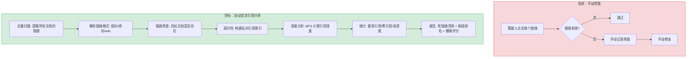
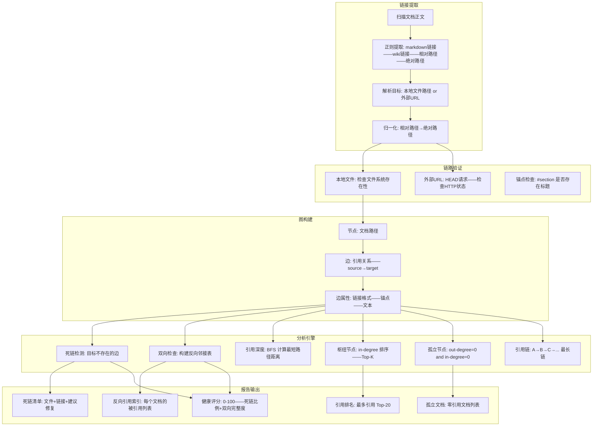

# YK-09-209: 内容交叉引用分析 — 链接拓扑、死链检测与引用质量评估

> 需求编号：YK-09-209 · 优先级：P2 · 人天：0.3d · 状态：需求已编写
> 依赖：YK-09-158（内容依赖图）、YK-09-164（内容引用网络）、YK-09-141（内容关系图谱）

## 背景

### 问题陈述

YiKnowledge 中大量文档包含指向其他知识文件的交叉引用——这些链接应该是双向可遍历的：A 引用 B——B 应知道 A 引用了它。但当前缺乏对引用关系的系统分析：无法自动检测死链接（链接指向不存在的文档）、无法识别引用深度模式（直接引用 vs 间接引用）、无法发现哪些文章是知识库的"枢纽节点"（被引用最多）。这些分析对于维护知识库的链接健康度和信息架构至关重要。

1. **死链接困扰用户**：点击文档中的引用链接 → 404 → 信任度降低
2. **单向引用隔离知识**：A 引用 B 但 B 的页面不显示反向引用——读者失去上下文
3. **引用质量未知**：不知道哪些文档是知识枢纽——无法优先维护
4. **引用深度不透明**：不知道一个文档依赖多深的知识链

**核心矛盾**：知识库是超链接系统但缺乏链接健康管理。交叉引用分析 = 链接解析 + 双向匹配 + 拓扑分析 + 死链检测。将超链接从单向信息通道升级为双向知识网络。

### 影响范围

| # | 影响 | 严重程度 | 典型场景 |
|---|------|----------|----------|
| 1 | 死链接导致用户导航中断——信任度下降 | 高 | 点击"参见 X 文档" → 404 页面 |
| 2 | 反向引用缺失——失去知识上下文 | 中 | 阅读 B 文档时不知道 A 文档引用了它 |
| 3 | 无法识别知识枢纽——维护优先级错误 | 中 | 高引用的基础文档未及时更新——影响面大 |
| 4 | 引用完整性无保障 | 中 | 文件重命名后引用链接未更新——死链增加 |

### 挑战

| 挑战 | 说明 |
|------|------|
| 引用格式多样性 | 相对路径、绝对路径、URL、wiki 链接 `[[]]`——多种格式需要统一解析 |
| 双向性维护 | A 引用 B 变更后——需要同步更新 B 的反向引用记录 |
| 引用深度计算 | 间接引用（A→B→C）需要构建完整引用图后计算 |
| 死链检测性能 | 全量扫描所有文档的引用链接——大量 I/O |

---

## 一、现状分析

### 1.1 当前引用相关功能

```
现有引用分析：
├── 内容依赖图 (YK-09-158)
│   ├── 依赖关系可视化 ✅
│   └── 引用质量分析 ❌——仅存在性检测
├── 内容引用网络 (YK-09-164)
│   ├── 引用网络构建 ✅
│   └── 双向链接同步 ❌
├── 内容关系图谱 (YK-09-141)
│   ├── 关系图谱可视化 ✅
│   └── 引用深度/统计 ❌
├── 链接拓扑可视化 (YK-09-27——链接拓扑可视化)
│   └── 链接图——无分析 ❌
└── 缺失
    ├── DeadLinkDetector: 死链接检测器              # ❌
    ├── BidirectionalLinkChecker: 双向链接检查器     # ❌
    ├── ReferenceDepthAnalyzer: 引用深度分析器       # ❌
    ├── HubNodeDetector: 枢纽节点检测器              # ❌
    └── LinkHealthReport: 链接健康报告              # ❌
```

### 1.2 交叉引用分析流程（现状 vs 目标）



### 1.3 根因矩阵

| 症状 | 根因 | 触发条件 | 频率 |
|------|------|----------|------|
| 死链接 404 | 被引用文档被重命名/删除/移动 | 文件操作后未更新引用 | 中 |
| 反向引用缺失 | 引用关系仅为单向——B 不知道 A 引用了它 | 文档 B 无反向引用索引 | 高 |
| 不知哪些文档最核心 | 没有引用计数统计 | 评估文档重要性时 | 中 |
| 链接格式不一致 | 有的用相对路径——有的用绝对路径——有的用 wiki 链接 | 不同策展人的写作习惯 | 中 |

---

## 二、设计决策

### 决策 1：链接格式统一 vs 多格式兼容

| 选项 | 实现复杂度 | 用户体验 | 迁移成本 |
|------|----------|---------|---------|
| 统一格式（强制所有链接使用相对路径） | 低 | 差——策展人习惯受限 | 高——需修改现有链接 |
| 多格式兼容（解析时支持多种格式） | 中 | 好——策展人自由 | 无 |
| 兼容 + 建议（支持多格式——但报告非标准格式） | 中 | 最佳 | 无 |

**选择：多格式兼容 + 标准化建议。** 解析时支持 markdown 链接 `[text](path)`、wiki 链接 `[[path]]`、相对路径 `../path.md`、绝对路径 `/path.md`。不强制统一格式——但在链接健康报告中标注使用了非推荐格式的链接。

### 决策 2：死链检测时机 — 全量扫描 vs 增量检测 vs 事件驱动

| 选项 | 实时性 | 性能开销 | 实现复杂度 |
|------|--------|---------|----------|
| 全量扫描（定时遍历所有文件的所有链接） | 低——定时执行 | 高——全量 I/O | 低 |
| 增量检测（文件变更时仅检测受影响链接） | 中 | 低 | 中 |
| 事件驱动（文件创建/删除/重命名触发链接更新） | 高——即时 | 最低 | 高 |

**选择：事件驱动（主） + 全量扫描（定期兜底）。** Knowledge Watcher 已监听文件变更——在文件创建/删除/重命名时触发受影响链接的检查。夜间定期全量扫描兜底——修复事件驱动可能遗漏的链接。

### 决策 3：引用深度分析 — 仅直接引用 vs 2 层 vs 全图 BFS

| 选项 | 计算量 | 信息量 | 复杂度 |
|------|--------|--------|--------|
| 仅直接引用（距离=1） | 最低 | 低 | 低 |
| 2 层（距离 <= 2） | 中 | 中 | 中 |
| 全图 BFS（完全连通分量） | 高 | 高——完整引用拓扑 | 中高 |

**选择：全图 BFS。** 知识库规模的引用图节点 < 1000——BFS 计算量 O(N+E) 约 1000+5000 级别——毫秒完成。全图分析可发现间接引用模式——如 A→B→C 中 C 应该考虑反向引用到 A。

### 设计决策记录

| 决策 | 选项 A | 选项 B | 选项 C | 选项 D | 选择 | 理由 |
|------|--------|--------|--------|--------|------|------|
| 链接格式 | 强制统一 | 多格式兼容 | 兼容+建议 | — | **兼容+建议** | 不破坏现有习惯 |
| 死链检测 | 全量扫描 | 增量检测 | 事件驱动 | — | **事件驱动+全量兜底** | 高实时性+完整保障 |
| 引用深度 | 1层 | 2层 | 全图BFS | — | **全图BFS** | 规模小计算量可忽略 |
| 反向引用存储 | 独立集合 | inlined | 计算字段 | — | **计算字段+缓存** | 减少冗余 |

---

## 三、目标架构

### 3.1 交叉引用分析架构



### 3.2 性能指标

| 指标 | 目标值 | 说明 |
|------|--------|------|
| 全量引用扫描（1000 文档） | < 5s | 扫描+解析+验证 |
| 引用图 BFS（1000 节点） | < 10ms | 内存图计算 |
| 死链检测实时性 | < 1s（事件触发） | 文件变更后的响应 |
| 外部 URL 检测 | < 5s/URL | HEAD 请求超时 3s |
| 反向引用索引更新 | < 100ms | 单文档引用变更 |

---

## 四、具体改动

### 4.1 数据模型

```python
# YiAi/src/domain/knowledge/crossref/models.py (新增)

from pydantic import BaseModel
from enum import Enum
from typing import Optional
from dataclasses import dataclass, field

class LinkFormat(str, Enum):
    MARKDOWN = "markdown"       # [text](path)
    WIKI = "wiki"               # [[path]]
    RELATIVE = "relative"       # ../path.md
    ABSOLUTE = "absolute"       # /path/to/file.md
    EXTERNAL_URL = "external"   # https://...

class LinkStatus(str, Enum):
    VALID = "valid"
    DEAD = "dead"
    EXTERNAL = "external"
    ANCHOR_MISSING = "anchor_missing"  # 文件存在但锚点不存在
    UNCHECKED = "unchecked"

@dataclass
class ResolvedLink:
    source_file: str            # 引用来源文档
    raw_link: str               # 原始链接文本
    format: LinkFormat
    target_file: str            # 解析后的目标路径
    anchor: Optional[str]       # #section 锚点
    link_text: str              # 链接显示文本
    line_number: int            # 所在行号

@dataclass
class LinkValidation:
    link: ResolvedLink
    status: LinkStatus
    message: str
    http_status: Optional[int] = None  # 外部链接的 HTTP 状态

@dataclass
class ReferenceGraph:
    nodes: list[str]                           # 文档路径列表
    adjacency: dict[str, list[str]]            # 邻接表: source → [targets]
    reverse_adjacency: dict[str, list[str]]    # 反向邻接: target → [sources]
    edges: list[tuple[str, str]]              # (source, target)

@dataclass
class ReferenceDepth:
    source: str
    target: str
    shortest_path: list[str]        # 最短路径上的文档
    distance: int                   # 跳数

@dataclass
class ReferenceStats:
    most_referenced: list[tuple[str, int]]   # (文档, 被引用次数)
    most_referencing: list[tuple[str, int]]  # (文档, 引用他文次数)
    orphans: list[str]                       # 孤立文档——零引用
    longest_chain: list[str]                 # 最长引用链
    avg_references_per_doc: float
    total_links: int
    dead_links: int
    health_score: float                      # 0-100

@dataclass
class CrossReferenceReport:
    dead_links: list[LinkValidation]
    bidirectional_gaps: list[tuple[str, str]]  # (A, B): A引用B但B无反引用
    depth_analysis: list[ReferenceDepth]       # 引用深度 > 2 的路径
    stats: ReferenceStats
    generated_at: str
    total_files_scanned: int
```

### 4.2 文件变更清单

| 文件 | 操作 | 说明 |
|------|------|------|
| `YiAi/src/domain/knowledge/crossref/__init__.py` | 新增 | 交叉引用模块入口 |
| `YiAi/src/domain/knowledge/crossref/models.py` | 新增 | LinkValidation/ReferenceGraph/Report 数据模型 |
| `YiAi/src/domain/knowledge/crossref/link_parser.py` | 新增 | 链接格式解析器——多格式兼容 |
| `YiAi/src/domain/knowledge/crossref/validator.py` | 新增 | 链路验证器——文件存在性/HTTP状态/锚点 |
| `YiAi/src/domain/knowledge/crossref/graph_builder.py` | 新增 | 引用图构建器——邻接表+反向邻接 |
| `YiAi/src/domain/knowledge/crossref/analyzer.py` | 新增 | 分析引擎——死链/深度/枢纽/孤立/健康 |
| `YiAi/src/domain/knowledge/crossref/reporter.py` | 新增 | 报告生成器 |
| `YiAi/src/domain/knowledge/watcher.py` | 修改 | 集成事件驱动死链检测 |
| `tests/test_crossref.py` | 新增 | 交叉引用测试 |

---

## 五、实施步骤

| 步骤 | 操作 | 路径 | 验证 | 人天 |
|------|------|------|------|------|
| 1 | 定义数据模型 | `crossref/models.py` | Pydantic 验证 | 0.03 |
| 2 | 实现链接格式解析器 | `crossref/link_parser.py` | 4 种格式解析正确 | 0.05 |
| 3 | 实现链路验证器 | `crossref/validator.py` | 死链/有效/锚点缺失 3 类 | 0.04 |
| 4 | 实现引用图构建器 | `crossref/graph_builder.py` | 邻接表+反向邻接双向正确 | 0.04 |
| 5 | 实现分析引擎 | `crossref/analyzer.py` | 死链/深度/枢纽/孤立/健康 | 0.05 |
| 6 | 实现报告生成器 | `crossref/reporter.py` | 5 类报告输出 | 0.03 |
| 7 | 集成到 Knowledge Watcher | `watcher.py` | 事件驱动+定期兜底 | 0.04 |
| 8 | 编写测试 | `tests/` | 解析/验证/图/分析/报告 | 0.02 |

**总人天：0.30d**

---

## 六、测试规格

### 场景 1：死链接检测——目标文件不存在

**GIVEN** 文档 A 包含链接 `[B文档](../b-file.md)`——但 `b-file.md` 不存在
**WHEN** 交叉引用扫描
**THEN** 链接标记为 dead——报告列出源文件 A、链接文本、目标路径
**AND** 状态 reason = "目标文件不存在"

### 场景 2：锚点缺失检测

**GIVEN** 文档 A 包含链接 `[B的章节](../b-file.md#missing-section)`——`b-file.md` 存在但无 `#missing-section` 标题
**WHEN** 交叉引用扫描
**THEN** 链接标记为 anchor_missing——状态 reason = "锚点 missing-section 在目标文件中不存在"

### 场景 3：反向引用索引

**GIVEN** 文档 A 引用 B——文档 C 引用 B——文档 D 引用 B
**WHEN** 构建反向引用索引
**THEN** B 的 reverse_adjacency = [A, C, D]
**AND** B 的 in-degree = 3

### 场景 4：引用深度分析

**GIVEN** 引用链 A→B→C→D
**WHEN** BFS 计算 A 到 D 的距离
**THEN** distance = 3——路径 = [A, B, C, D]
**AND** A 到 C distance = 2

### 场景 5：枢纽节点排名

**GIVEN** 知识库中 B 被 15 篇文档引用——C 被 8 篇引用——A 被 2 篇引用
**WHEN** 统计 most_referenced
**THEN** B 排名第 1（15）——C 排名第 2（8）——A 未进入前三

### 场景 6：健康评分计算

**GIVEN** 知识库共有 500 个链接——其中 15 个死链接——60% 的引用是双向的
**WHEN** 计算健康评分
**THEN** health_score = (1 - 15/500) * 0.6 + 0.6 * 0.4 ≈ 0.822 = 82.2 分

---

## 七、风险与缓解

| 风险 | 概率 | 影响 | 缓解措施 |
|------|------|------|----------|
| 外部 URL 检测超时——拖慢整体扫描 | 中 | 中 | 外部 URL 检测设置 3s 超时——异步并行——超时标记为 unchecked |
| 文件重命名后引用未更新——死链激增 | 高 | 中 | 事件驱动检测文件重命名——自动建议更新引用 |
| 循环引用导致 BFS 无限循环 | 低 | 低 | BFS 维护 visited 集合——循环引用正常跳过 |
| 大量锚点检查导致 I/O 瓶颈 | 中 | 低 | 锚点验证可配置开关——默认关闭——仅报告文件级死链 |

---

## 八、回滚策略

| 场景 | 回滚操作 | 影响 |
|------|----------|------|
| 交叉引用扫描严重影响 watcher 性能 | 关闭分析模块——仅保留事件驱动的死链检测 | 深度分析不可用 |
| 事件驱动误删大量链接 | 回退到仅全量扫描——调高扫描频率 | 实时性降低 |
| 外部 URL 检测被目标服务器限流 | 关闭外部 URL 检测——标记所有外部链接为 unchecked | 外部链接状态不可知 |

---

## 九、设计决策记录

### D-01：为什么反向引用是计算的而非存储的？

存储反向引用意味着每个文件维护一个"被谁引用"的列表——当引用方文档被删除时——需要找到所有被引用方并更新它们的反向引用列表。这是 O(N) 的更新操作——复杂且容易遗漏。计算方式（从引用图查询反向邻接）始终准确——因为引用图的数据源是各文档的引用声明——不存在同步问题。

### D-02：为什么需要引用深度分析？

直接引用（A→B）容易被发现——但间接引用（A→B→C）形成的知识链是隐式的。深度分析帮助读者理解知识的层级关系：阅读 A 前可能需要先理解 C（虽然 A 没有直接引用 C）。这对于内容编排与学习路径规划（YK-09-121）有直接价值。

### D-03：为什么健康评分公式不是纯死链比例？

仅用死链比例衡量链接健康忽略了单向引用的信息损失。双向引用意味着两个文档的读者都能发现彼此——是更健康的链接生态。公式 weight = 0.6（死链影响更大——用户直接受挫） + 0.4（双向完整度——影响知识发现）。

### D-04：为什么外部 URL 不在实时检测中？

外部 URL 检测需要 HTTP 请求——受网络速度、目标服务器响应时间影响——并且有隐私/安全考虑（HEAD 请求可能触发 SSRF 或 IP 泄露）。外部链接标记为 external 状态——仅在用户主动触发时检测——不在自动化管线中。

---

## 十、可观测性

### 指标

| 指标 | 类型 | 说明 |
|------|------|------|
| `yiknowledge.crossref.total_links` | Gauge | 总链接数 |
| `yiknowledge.crossref.dead_links` | Gauge | 死链接数 |
| `yiknowledge.crossref.anchor_missing` | Gauge | 锚点缺失数 |
| `yiknowledge.crossref.bidirectional_rate` | Gauge | 双向引用比例 |
| `yiknowledge.crossref.health_score` | Gauge | 整体健康评分 |
| `yiknowledge.crossref.scan_time_ms` | Histogram | 全量扫描耗时 |
| `yiknowledge.crossref.most_referenced` | Gauge (label: file) | Top-5 被引文档 |
| `yiknowledge.crossref.orphan_count` | Gauge | 孤立文档数 |
| `yiknowledge.crossref.event_driven_updates` | Counter | 事件驱动更新次数 |

---

## 十一、代码审查检查清单

- [ ] LinkParser: 支持 markdown `[text](path)`、wiki `[[path]]`、相对 `../`、绝对 `/path/` 四种格式
- [ ] LinkParser: 路径归一化——相对路径解析为绝对路径——去除 `../` 和 `./`
- [ ] Validator: 本地文件存在性检查使用 `os.path.isfile`——区分文件和目录
- [ ] Validator: 锚点检查默认关闭——仅在配置启用时解析目标文件的 markdown 标题
- [ ] Validator: 外部 URL 仅标记 external——不实际发送 HTTP 请求
- [ ] GraphBuilder: 邻接表和反向邻接表同时构建——保持同步
- [ ] Analyzer: BFS 维护 visited——避免循环引用无限循环
- [ ] Analyzer: 孤立文档定义为 in-degree=0 and out-degree=0
- [ ] Reporter: 死链报告按源文件分组——方便批量修复
- [ ] Watcher 集成: rename 事件中——旧路径作为引用目标的链接标记为 dead

---

## 回归问题预测

| # | 预测问题 | 原因 | 验证方法 |
|---|---------|------|---------|
| 1 | wiki 链接 `[[path]]` 与 markdown 链接 `[text](path)` 中——路径包含空格和中文时解析失败 | 路径中的空格和中文在 markdown 中可能被 URL 编码（%20）——正则表达式仅匹配无空格路径 | 测试包含空格和中文的文件路径引用——验证所有格式（wiki/markdown/相对/绝对）均正确解析 |
| 2 | 文件级死链检测通过——但锚点检查全部误报——因为标题格式（`##` vs `###` vs 自定义 ID）识别不完整 | markdown 锚点有多种形式——标准 `## title` → `#title`、HTML `<h2 id="custom">` → `#custom`、GFM auto-id——解析不完整导致假阳性 | 使用已知锚点标签的测试文档——验证 3 种锚点格式全部正确识别 |
| 3 | BFS 在大规模引用图中（500+ 节点——2000+ 边）耗时增长到 > 100ms——watcher 中频繁触发导致延迟 | 每次文件变更都触发全图 BFS——事件驱动模式下——连续修改多个文件时重复计算 | 批量化处理——文件变更累积 5 秒内的事件——合并为一次全图分析——减少重复计算 |
| 4 | 外部 URL 标记为 external 后——策展人困惑于"为什么有些链接不检查" | 用户界面可能将所有 external 状态显示为灰色——与 unchecked 状态混淆——策展人不知道何时检查外部链接 | UI 明确区分 external（不检查）和 unchecked（待检查）——external 显示地球图标——unchecked 显示问号 |
| 5 | 反向引用中包含已删除文档的残留引用——报告不准确 | A 拥有到 B 的链接——A 被删除——但反向引用索引的更新可能滞后——B 的 reverse_adjacency 仍包含 A | 定期全量重建反向引用索引——清除不再存在的 source 文件 |
| 6 | 同一行有多个链接时——行号报告正确但单个链接的列位置无法定位 | `[A](a.md) 和 [B](b.md)` 在同一行——两个链接的行号相同——修复时无法区分 | 链接精确定位到列范围（start_col, end_col）——报告包含列信息——IDE 可跳转到精确位置 |

---

## 性能分析

### 各操作耗时（1000 文档——5000 链接）

| 操作 | 耗时 | 说明 |
|------|------|------|
| 文件扫描（获取所有文件路径） | ~50ms | os.walk——1000 文件 |
| 链接正则提取（1000 文件） | ~500ms | 逐文件 markdown 解析——平均 5 链接/文件 |
| 路径归一化（1000 文件） | ~50ms | 相对→绝对——os.path.normpath |
| 文件存在性检查（5000 次） | ~200ms | os.path.isfile——缓存文件列表 |
| 引用图构建（邻接表+反向邻接） | ~100ms | 字典操作——内存 |
| BFS 全图深度分析 | ~50ms | O(V+E)——1000 节点 5000 边 |
| 统计计算（排名/比例/健康分） | ~30ms | 纯计算 |
| 报告 JSON 序列化 | ~20ms | ~50KB |
| **总计** | **~1000ms** | 在 5s 目标内 |
| 事件驱动增量（单文件变更） | ~50ms | 仅解析+验证+图增量更新 |

### 内存分析

| 数据 | 大小 | 说明 |
|------|------|------|
| 链接列表（ResolvedLink × 5000） | ~2MB | 结构化对象 |
| 邻接表（dict[str, list] × 1000 节点) | ~1MB | 字符串索引 |
| 反向邻接表 | ~1MB | 镜像邻接表 |
| BFS 队列+visited | ~0.5MB | 临时 |
| 报告 JSON | ~50KB | 序列化 |
| **峰值** | **~3MB** | 轻量 |

---

## 相关文档

- [内容依赖图](../158-需求-内容依赖图.md) — 依赖关系可视化基础
- [内容引用网络](../164-需求-内容引用网络.md) — 引用网络构建
- [内容关系图谱](../141-需求-内容关系图谱.md) — 关系图谱可视化
- [环路检测](../71-需求-环路检测.md) — 循环引用检测
- [链接拓扑可视化](../27-需求-链接拓扑可视化.md) — 链接图渲染

*PRD 来源: `projects/yiknowledge/requirements/2026-09/209-需求-内容交叉引用分析.md`*