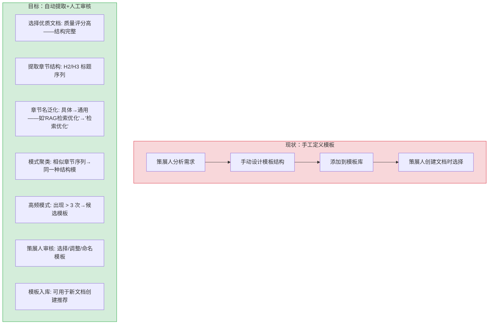

# YK-09-211: 内容结构模板生成 — 从优质文章中自动提取可复用模板

> 需求编号：YK-09-211 · 优先级：P2 · 人天：0.3d · 状态：需求已编写
> 依赖：YK-09-144（内容大纲生成）、YK-09-153（内容模板智能推荐）、YK-09-156（内容结构化模板）

## 背景

### 问题陈述

YiKnowledge 中的文档质量参差不齐——一部分文档结构清晰（背景→分析→方案→实施→验证）——另一部分则结构混乱（信息堆砌——缺乏逻辑主线）。好的结构模板应来自优质文档的自动提取——而非策展人凭空设计。当前缺乏从已有优质文档中提取章节模式和结构模式的能力——无法将成功经验固化为可复用的模板。

1. **结构模板凭空设计**：YK-09-156 的模板系统需要策展人手工定义模板——不反映知识库中实际有效的结构模式
2. **优质结构的经验无法传承**：某策展人写了一篇结构优秀的文档——其他策展人无法从中学习——只能自行摸索
3. **结构缺陷无自动发现**：新文档结构混乱——但缺乏"结构质量评分"机制来发现
4. **同类型文档结构不一致**：同为"架构设计"类型的 10 篇文档——有 5 种以上不同的章节结构——读者困惑

**核心矛盾**：知识库中有优质文档蕴含的结构智慧——但无法被提取和复用。结构模板生成 = 分析优质文档的章节模式 → 发现高频结构 → 抽象为模板 → 新文档创建时推荐。

### 影响范围

| # | 影响 | 严重程度 | 典型场景 |
|---|------|----------|----------|
| 1 | 新文档结构混乱——读者理解困难 | 高 | 无结构模板引导——策展人随意组织章节 |
| 2 | 同类型文档结构不统一——认知负担 | 高 | 5 篇架构文档 5 种结构——读者每篇都要重新适应 |
| 3 | 优质结构经验无法复用——效率低 | 中 | 策展人凭感觉组织文档——无最佳实践参考 |
| 4 | 模板系统与实际文档脱节 | 中 | 手工定义模板——不反映实际有效的写作模式 |

### 挑战

| 挑战 | 说明 |
|------|------|
| 优质文档的判定 | 什么样的文档算"优质"——基于哪些指标选择作为模板来源 |
| 章节模式的对齐 | 不同文档的章节名可能用词不同但结构相同——"背景" = "问题陈述" = "为什么" |
| 模板的颗粒度 | 应提取到哪一层级——H2 级别还是 H3 级别——是否包含子节结构 |
| 模板的泛化 | 从具体文档提取的章节名（如"RAG 架构设计"）→ 泛化为通用章节名（"架构设计"） |

---

## 一、现状分析

### 1.1 当前结构模板相关

```
现有模板相关功能：
├── 内容结构化模板 (YK-09-156)
│   ├── 手工定义模板 ✅
│   ├── 从文档中自动提取 ❌
│   └── 结构模式分析 ❌
├── 内容模板智能推荐 (YK-09-153)
│   ├── 基于文档类型的模板推荐 ✅
│   └── 基于内容的模板推荐 ❌
├── 内容大纲生成 (YK-09-144)
│   ├── 从标题自动生成大纲 ✅
│   └── 结构质量评估 ❌
├── 文档模板库与自动化 (YK-09-92)
│   ├── 模板库管理 ✅
│   └── 模板自动生成 ❌
└── 缺失
    ├── SectionPatternAnalyzer: 章节模式分析器        # ❌
    ├── TemplateExtractor: 模板提取器                 # ❌
    ├── StructureQualityScorer: 结构质量评分器        # ❌
    └── TemplateGeneralizer: 模板泛化器              # ❌
```

### 1.2 结构模板生成流程（现状 vs 目标）



### 1.3 根因矩阵

| 症状 | 根因 | 触发条件 | 频率 |
|------|------|----------|------|
| 模板与文档脱节 | 手工定义——不反映实际模式 | 模板设计时 | 中 |
| 同类型文档结构混乱 | 无结构一致性检查 | 多人协作 | 高 |
| 优质经验无法传承 | 结构模式不可见——不可提取 | 新策展人加入 | 中 |
| 结构缺陷无法自动发现 | 无结构质量评分 | 文档提交后 | 中 |

---

## 二、设计决策

### 决策 1：优质文档的筛选标准 — 单指标 vs 多指标

| 选项 | 覆盖面 | 公平性 | 复杂性 |
|------|--------|--------|--------|
| 单一指标（如引用数最高） | 窄——偏向外链多的文档 | 低——新文档永远不入选 | 低 |
| 多指标（结构完整性 + 内容质量 + 引用 + 时效） | 广——平衡新旧文档 | 高 | 中 |
| 策展人标注（手动标记优质文档） | 最高——人工判断 | 高——但主观 | 最低 |

**选择：多指标自动筛选 + 策展人标注优先。** 自动评分 = 0.3 × 结构完整性（至少有背景/分析/方案 3 个标准章节）+ 0.2 × 内容质量（可读性/术语一致性）+ 0.2 × 引用数 + 0.15 × 最近更新 + 0.15 × 字数范围（2000-5000 字最佳）。策展人标注的"优秀文档"直接入选。

### 决策 2：章节名的泛化方式 — 规则替换 vs 实体识别 vs 嵌入匹配

| 选项 | 准确度 | 覆盖率 | 维护成本 |
|------|--------|--------|---------|
| 规则替换（正则去除实体：`RAG检索优化`→`检索优化`） | 中 | 中——规则覆盖有限 | 中——需维护规则 |
| 实体识别（NER 标记实体——去除实体→通用名） | 中 | 高 | 低——复用已有 NER |
| 嵌入匹配（将章节名映射到预定义的通用章节名） | 高 | 高——覆盖所有 | 中——需定义通用章节名集合 |
| 混合——NER 去除实体 + 嵌入匹配 | 最高 | 最高 | 中 |

**选择：混合——NER 去除实体 + 嵌入匹配到通用章节名。** 先用 NER 识别并去除"RAG"、"MongoDB"等专有名词→"检索优化"——再计算去除后的章节名与通用章节名集合（背景/分析/方案/实施/验证等 20 个标准章节名）的 embedding 相似度→匹配到最近的通用章节名。

### 决策 3：模板粒度 — H2 级别 vs H2+H3 级别

| 选项 | 详细度 | 灵活性 | 泛化难度 |
|------|--------|--------|---------|
| 仅 H2 级别（如：[背景, 分析, 设计, 实施, 验证]） | 粗——仅一级结构 | 高——允许 H3 自由发挥 | 低——易泛化 |
| H2+H3 级别（如：[背景[问题, 影响, 挑战], 分析[...], ...]） | 细——两级结构 | 中——约束到 H3 | 中——泛化更难 |
| 自适应（相似度高的文档提取到 H3——差异大的仅到 H2） | 动态 | 最佳 | 高——实现复杂 |

**选择：H2 级别模板 + H3 级别可选子模板。** H2 是文档结构的主干——应标准化。H3 是 H2 节内的子结构——提供可选建议但不强制。这使得模板既保证了结构一致性（H2）——又保留了灵活空间（H3）。

### 设计决策记录

| 决策 | 选项 A | 选项 B | 选项 C | 选项 D | 选择 | 理由 |
|------|--------|--------|--------|--------|------|------|
| 优质文档筛选 | 单指标 | 多指标 | 策展人标注 | 标注优先 | **多指标+标注优先** | 覆盖度与准确性 |
| 章节名泛化 | 规则替换 | 实体识别 | 嵌入匹配 | 混合 | **NER+嵌入匹配** | 高准确率高覆盖 |
| 模板粒度 | 仅H2 | H2+H3 | 自适应 | — | **H2(强制)+H3(可选)** | 一致性与灵活性 |
| 模板生成频率 | 实时 | 每周 | 手动触发 | — | **每周+手动触发** | 避免频繁变化 |

---

## 三、目标架构

### 3.1 结构模板生成架构

```mermaid
graph TD
    subgraph "筛选: 优质文档池"
        A1[知识库全量文档]
        A2[质量评分: 结构完整性+内容质量+引用+时效]
        A3[策展人标注: 手动优质标记优先]
        A4[Top-30% 文档→优质文档池]
    end

    subgraph "提取: 章节结构"
        B1[解析 markdown: H1/H2/H3 标题树]
        B2[过滤: 非章节标题——如'相关文档' '参考']
        B3[章节名序列: [背景, 现状分析, 设计决策, ...]]
    end

    subgraph "泛化: 章节名标准化"
        C1[NER: 识别专有名词——去除]
        C2[标准化: 去除序号——'一、背景'→'背景']
        C3[Embedding 匹配: 映射到 20 个通用章节名]
    end

    subgraph "聚类: 结构模式"
        D1[章节序列→向量: h2 序列作为特征]
        D2[编辑距离聚类: Levenshtein 序列距离]
        D3[高频模式: 出现 >= 3 次——候选模板]
    end

    subgraph "生成: 模板输出"
        E1[候选模板: H2 列表 + 可选 H3 子项]
        E2[模板元数据: 适用文档类型——来源文档数——置信度]
        E3[策展人审核: 确认/修改/命名]
        E4[模板入库: YAML 格式——可用]
    end

    A1 --> A2 --> A4
    A3 --> A4
    A4 --> B1 --> B2 --> B3
    B3 --> C1 --> C2 --> C3
    C3 --> D1 --> D2 --> D3
    D3 --> E1 --> E2 --> E3 --> E4
```

### 3.2 性能指标

| 指标 | 目标值 | 说明 |
|------|--------|------|
| 1000 文档结构分析时间 | < 10s | 含 NER+Embedding 匹配 |
| 章节名泛化准确率 | > 85% | 与人工标注的通用章节名一致 |
| 模板提取——高频模式发现率 | > 90% | 已知模式中被提取的比例 |
| 模板生成——策展人采纳率 | > 60% | 自动生成的模板经审核后入库 |
| 通用章节名词典大小 | 20-30 | 覆盖知识库核心章节类型 |

---

## 四、具体改动

### 4.1 数据模型

```python
# YiAi/src/domain/knowledge/structure/models.py (新增)

from pydantic import BaseModel
from typing import Optional
from dataclasses import dataclass, field

@dataclass
class SectionNode:
    level: int                  # 标题层级 H2=2 H3=3
    raw_title: str              # 原始章节名——如"一、RAG检索优化"
    normalized_title: str       # 去除序号和实体后——如"检索优化"
    generic_title: str          # 映射到通用章节名——如"方案设计"
    generic_confidence: float   # 映射置信度
    children: list['SectionNode'] = field(default_factory=list)

@dataclass
class DocumentStructure:
    file_path: str
    h1_title: str
    sections: list[SectionNode]     # 章节树
    generic_sequence: list[str]     # 通用章节名序列——仅 H2——如["背景","现状","设计","实施"]
    completeness_score: float       # 结构完整性 (0-100)

@dataclass
class StructurePattern:
    pattern_id: str
    generic_sequence: list[str]     # 通用章节名序列
    occurrence_count: int           # 出现次数
    source_documents: list[str]     # 来源文档路径
    confidence: float               # 作为模板的置信度
    doc_type_distribution: dict[str, int]  # 来源文档的类型分布

@dataclass
class SectionTemplate:
    title: str                      # 章节通用名
    description: str                # 章节说明——该节应包含什么内容
    optional: bool                  # 是否可选
    suggested_h3: list[str]         # 建议的 H3 子节
    word_count_range: tuple[int, int]  # 建议字数范围

@dataclass
class StructureTemplate:
    template_id: str
    name: str                       # 模板名称——如"架构设计标准模板"
    applies_to: list[str]           # 适用的文档类型
    sections: list[SectionTemplate] # 章节模板列表
    source_pattern: Optional[StructurePattern]  # 来源模式
    curator_approved: bool
    curator_name: Optional[str]
    created_at: str
    version: int

@dataclass
class StructureReport:
    total_documents: int
    quality_documents: int          # 优质文档数
    patterns_discovered: int       # 发现的模式数
    templates_generated: int       # 生成的候选模板数
    templates_approved: int        # 策展人批准的模板数
    structure_diversity_score: float  # 结构多样性——高=结构混乱
    top_patterns: list[StructurePattern]
```

### 4.2 通用章节名词典

```yaml
# config/generic_sections.yaml (新增)

generic_sections:
  preamble:
    - 背景
    - 问题陈述
    - 目标
    - 范围
  analysis:
    - 现状分析
    - 根因分析
    - 需求分析
    - 可行性分析
  design:
    - 设计方案
    - 设计决策
    - 架构设计
    - 技术选型
  implementation:
    - 具体改动
    - 实现方案
    - 代码实现
    - 配置变更
  verification:
    - 测试规格
    - 验证方法
    - 性能分析
    - 回归测试
  operations:
    - 风险缓解
    - 回滚策略
    - 可观测性
    - 部署方案
  reference:
    - 相关文档
    - 参考链接
    - 附录
```

### 4.3 文件变更清单

| 文件 | 操作 | 说明 |
|------|------|------|
| `YiAi/src/domain/knowledge/structure/__init__.py` | 新增 | 结构分析模块入口 |
| `YiAi/src/domain/knowledge/structure/models.py` | 新增 | SectionNode/StructurePattern/StructureTemplate 数据模型 |
| `YiAi/src/domain/knowledge/structure/quality_scorer.py` | 新增 | 文档质量评分器——筛选优质文档 |
| `YiAi/src/domain/knowledge/structure/section_extractor.py` | 新增 | 章节提取器——markdown 标题树解析 |
| `YiAi/src/domain/knowledge/structure/section_normalizer.py` | 新增 | 章节名泛化——NER+标准化+Embedding匹配 |
| `YiAi/src/domain/knowledge/structure/pattern_clusterer.py` | 新增 | 结构模式聚类——编辑距离+高频发现 |
| `YiAi/src/domain/knowledge/structure/template_generator.py` | 新增 | 模板生成器——模式→模板格式 |
| `config/generic_sections.yaml` | 新增 | 通用章节名词典——20 个标准章节名 |
| `tests/test_structure.py` | 新增 | 结构分析测试 |

---

## 五、实施步骤

| 步骤 | 操作 | 路径 | 验证 | 人天 |
|------|------|------|------|------|
| 1 | 定义数据模型+通用章节名词典 | `models.py` + `generic_sections.yaml` | 20-30 章名覆盖知识库 | 0.03 |
| 2 | 实现质量评分器 | `quality_scorer.py` | Top-30% 文档包含已知优质文档 | 0.04 |
| 3 | 实现章节提取器 | `section_extractor.py` | 100 份文档正确提取标题树 | 0.04 |
| 4 | 实现章节名泛化 | `section_normalizer.py` | NER+标准化+Embedding 映射准确率 > 85% | 0.06 |
| 5 | 实现模式聚类 | `pattern_clusterer.py` | 编辑距离聚类——高频模式发现 | 0.05 |
| 6 | 实现模板生成器 | `template_generator.py` | 候选模板→审核→入库 | 0.04 |
| 7 | 集成策展人审核流程 | API 端点 | 策展人可查看/修改/批准模板 | 0.02 |
| 8 | 编写测试 | `tests/` | 质量评分/章节提取/泛化/聚类 | 0.02 |

**总人天：0.30d**

---

## 六、测试规格

### 场景 1：从 3 篇架构文档中提取一致结构模式

**GIVEN** 3 篇架构设计文档——章节序列分别为：[背景, 现状, 设计, 实施, 测试] × 2 和 [背景, 需求, 设计, 实施, 风险]
**WHEN** 结构模式聚类
**THEN** 应发现核心模式 [背景, 设计, 实施] —— 3 篇文档共有
**AND** 候选模板包含这 3 个核心章节 + 可选章节 [现状, 测试, 风险]

### 场景 2：章节名泛化——去除实体

**GIVEN** 章节名 "二、RAG检索与MongoDB集成方案"
**WHEN** 章节名泛化
**THEN** normalized = "检索与集成方案"（去除"二、"和实体"RAG""MongoDB"）
**AND** generic = "方案设计"（embedding 匹配到最近通用章节名）

### 场景 3：结构质量评分——低分文档

**GIVEN** 文档仅有一个 H2 "主要内容"——所有信息堆砌在单节中
**WHEN** 质量评分
**THEN** completeness_score < 40——缺少标准章节（背景/分析/方案）
**AND** 不入选优质文档池

### 场景 4：结构多样性过高——无高频模板

**GIVEN** 同类文档（架构设计）使用 8 种不同的章节结构——每种仅出现 1-2 次
**WHEN** 模式聚类
**THEN** 无高频模式（< 3 次）——不生成候选模板
**AND** structure_diversity_score 高——标记为"结构混乱——建议统一"

### 场景 5：策展人审核——修改自动生成的模板

**GIVEN** 自动生成的候选模板 [背景, 现状, 方案, 实施, 测试]
**WHEN** 策展人审核——添加"风险评估"——标记"方案"为可选
**THEN** 模板更新为 [背景, 现状, 方案(可选), 实施, 测试, 风险评估]
**AND** curator_approved = true——version 递增

### 场景 6：子模板（H3）提取

**GIVEN** 3 篇文档的"背景"节下都有 [问题陈述, 影响范围, 挑战] 三个 H3
**WHEN** H3 子结构分析
**THEN** "背景"节的 H3 子模板 = [问题陈述, 影响范围, 挑战]
**AND** 标记为 suggested_h3——供 H2 模板中的"背景"节引用

---

## 七、风险与缓解

| 风险 | 概率 | 影响 | 缓解措施 |
|------|------|------|----------|
| 章节名泛化错误——"测试"被映射到"验证"——丢失区分 | 中 | 中 | Embedding 匹配阈值——相似度 < 0.8 保留原始名——不入库通用名 |
| 模板过度泛化——失去领域特征 | 中 | 低 | 保留原始章节名作为注释——模板中同时显示通用名和原始名示例 |
| 优质文档池偏向某策展人——模板同质化 | 低 | 中 | 多指标筛选包含策展人多样性权重——避免单人文档占比过高 |
| 新类型文档无模板可参考 | 中 | 中 | 通用模板（如"技术文档标准模板"）作为兜底——不强制类型匹配 |

---

## 八、回滚策略

| 场景 | 回滚操作 | 影响 |
|------|------|------|
| 模板质量差——策展人普遍不采用 | 关闭自动模板生成——仅保留手工模板 | 回到手工定义模式 |
| 章节名泛化大量错误 | 跳过泛化步骤——使用原始章节名聚类 | 模板章节名不通用——可读性差 |
| 编辑距离聚类性能差 | 切换为 H2 序列精确匹配——仅发现完全相同序列 | 发现率降低 |

---

## 九、设计决策记录

### D-01：为什么选择编辑距离而非 embedding 聚类章节序列？

章节序列是离散的标签序列（如 [A, B, C, D]）——编辑距离（Levenshtein）是衡量序列相似度的经典方法——考虑了插入/删除/替换三种操作。两个仅差一个可选章节的序列（[A,B,C,D] vs [A,C,D]）编辑距离=1——比 embedding 更能体现"结构相似但有弹性"的特点。

### D-02：为什么优质文档池是 Top-30% 而非 Top-10%？

Top-10% 的样本太少——在 200 篇同类型文档中仅 20 篇——难以发现稳定模式（最少出现 3 次）。Top-30% 在样本量和质量之间取得平衡——既有足够的样本发现模式——又过滤了结构混乱的低质量文档。

### D-03：为什么通用章节名词典需要 20-30 个词？

太少（10 个）会导致不同章节被合并（"方案设计"和"架构设计"被映射到同一个"设计"）——失去区分力。太多（50 个）会导致相同意图的章节被分开（"问题陈述"和"背景介绍"没有合并）——模板碎片化。20-30 个是平衡点——覆盖核心章节类型而不过度区分。

### D-04：为什么策展人审核是模板生成的必经环节？

自动提取的模板可能有噪音——如同义章节名映射错误、不合理的章节顺序、过时的结构模式。策展人审核作为质量门禁——保证入库模板的可靠性。未来如果自动生成质量持续 > 80% 审核通过率——可以将常见模板类型绕过审核。

---

## 十、可观测性

### 指标

| 指标 | 类型 | 说明 |
|------|------|------|
| `yiknowledge.structure.quality_doc_count` | Gauge | 优质文档数 |
| `yiknowledge.structure.patterns_discovered` | Gauge | 发现的模式数 |
| `yiknowledge.structure.templates_generated` | Gauge | 生成的候选模板数 |
| `yiknowledge.structure.templates_approved` | Gauge | 批准的模板数 |
| `yiknowledge.structure.diversity_score` | Gauge | 结构多样性评分 |
| `yiknowledge.structure.section_normalize_accuracy` | Gauge | 章节名泛化准确率（人工标注vs自动） |
| `yiknowledge.structure.analysis_time_ms` | Histogram | 全量分析耗时 |
| `yiknowledge.structure.curator_approval_rate` | Gauge | 策展人批准率 |

---

## 十一、代码审查检查清单

- [ ] QualityScorer: 5 维度评分——权重可配置（YAML）
- [ ] QualityScorer: 策展人标注的优质文档直接入选——评分仅用于补充
- [ ] SectionExtractor: 解析 markdown——H1/H2/H3 构建树形结构
- [ ] SectionExtractor: 过滤非内容章节——"相关文档" "参考" "附录" 等
- [ ] SectionNormalizer: NER——去除人名/项目名/技术名
- [ ] SectionNormalizer: 标准化——去除"一、" "1." "1.1" 等序号前缀
- [ ] SectionNormalizer: Embedding——仅对标准化后的标题计算——20 个通用章名作为候选
- [ ] PatternClusterer: 编辑距离聚类——相似度阈值 0.7——出现 >= 3 次→候选
- [ ] TemplateGenerator: 候选模板→审核界面→策展人确认→入库
- [ ] 模板 YAML 格式兼容 YK-09-156 的模板系统

---

## 回归问题预测

| # | 预测问题 | 原因 | 验证方法 |
|---|---------|------|---------|
| 1 | 嵌套标题层级（H1→H2→H3→H4）在提取章节树时丢失了 H4 层级——结构不完整 | 仅提取到 H3 级别——部分文档的 H4 包含重要结构信息（如"端点参数"的每个参数是 H4） | 测试包含 H4 的文档——验证 H4 内容作为父 H3 的"内容块"被保留——而非完全丢失 |
| 2 | 章节名存在同义词——但 embedding 映射到错误通用章名 | "概要"和"摘要"不同但相近——embedding 可能将两者都映射到"摘要"——但"概要"实际应映射到"范围" | 构建同义词→标准名映射表——"概要/概述/简介"→"范围"——"摘要/总结/结论"→"总结" |
| 3 | 编辑距离聚类将长度差异大的序列错误聚类 | [背景, 分析, 设计] 和 [背景, 分析, 设计, 实现, 测试, 部署, 监控] 编辑距离=4——相对长度较大——但核心结构一致 | 测试长短序列编辑距离——验证使用归一化编辑距离（距离/max_len）——阈值 < 0.3 视为相似 |
| 4 | NER 过度去除——将章节名中的关键术语也去除了 | "Python编码规范"→NER 去除 Python→"编码规范"——但"Python"是分类信息——去除后与"JS编码规范"无法区分 | 验证章节名泛化保留分类术语——或使用术语白名单——技术词语在章节名中保留 |
| 5 | 优质文档的评分标准在跨类型文档中不适用——API 文档评分不应与架构文档同标准 | API 文档的结构模式与架构文档完全不同——"API 参数"和"错误码"等节在架构文档评分标准中被判为"结构不标准" | 按文档类型分组评分——不同类型使用不同的评分权重模板——API 文档使用 API 专用评分 |
| 6 | 策展人审核后模板版本递增——但已有文档使用的是旧版本模板——不一致 | 模板 v2 发布后——已有文档仍基于 v1 模板创建——后台不跟踪文档使用的模板版本 | 文档 frontmatter 记录 applied_template 和 template_version——模板更新后批量提示升级 |

---

## 性能分析

### 各阶段耗时（1000 文档——200 优质文档）

| 操作 | 耗时 | 说明 |
|------|------|------|
| 质量评分（1000 份） | ~500ms | 元数据查询+简单计算 |
| 筛选优质文档 | ~10ms | Top-30% 排序 |
| 章节提取（200 份） | ~400ms | markdown 解析——每份 ~2ms |
| 章节名 NER（200 份 × ~5 章节） | ~200ms | 约 1000 个章节名 |
| 章节名标准化+Embedding | ~500ms | 1000 个章节——embedding ~0.5ms/个 |
| 编辑距离聚类（200 个序列） | ~200ms | O(N²) 但仅 200 个 |
| 高频模式发现 | ~10ms | 简单统计 |
| 模板生成（~10 个候选） | ~50ms | 模板格式化 |
| **总计** | **~1870ms** | 作为每周任务——可接受 |

### 存储分析

| 数据 | 大小 | 说明 |
|------|------|------|
| 文档结构缓存（200 份） | ~2MB | 章节树 JSON |
| 结构模式（~15 个） | ~50KB | 序列+统计 |
| 候选模板（~10 个） | ~20KB | YAML 格式 |
| 通用章节名 Embedding（25 个） | ~75KB | 缓存——不重复计算 |
| **峰值** | **~2.2MB** | 轻量 |

---

## 相关文档

- [内容结构化模板](../156-需求-内容结构化模板.md) — 目标模板系统
- [内容模板智能推荐](../153-需求-内容模板智能推荐.md) — 新文档创建时的模板推荐
- [内容大纲生成](../144-需求-内容大纲生成.md) — 标题大纲自动生成
- [文档模板库与自动化](../92-需求-文档模板库与自动化.md) — 模板库管理

*PRD 来源: `projects/yiknowledge/requirements/2026-09/211-需求-内容结构模板生成.md`*