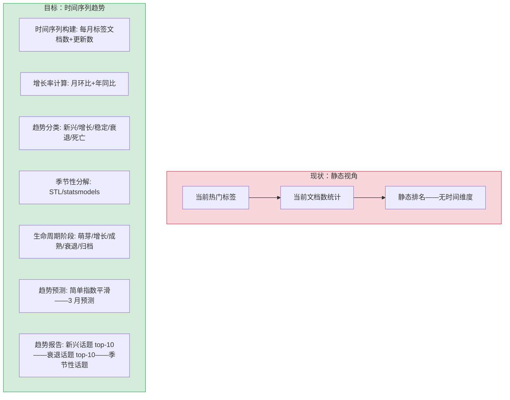

# YK-09-212: 内容话题趋势分析 — 话题生命周期、新兴/衰退趋势与季节性模式

> 需求编号：YK-09-212 · 优先级：P2 · 人天：0.3d · 状态：需求已编写
> 依赖：YK-09-18（搜索分析与趋势洞察）、YK-09-142（内容排行榜与热门）、YK-09-150（内容标签自动化）

## 背景

### 问题陈述

YiKnowledge 作为持续演进的知识库——话题有自然的生命周期：从萌芽（零星提及）→增长（关注度上升）→成熟（文档丰富）→衰退（关注度下降）→归档（不再更新）。当前缺乏对话题演进趋势的系统追踪——策展人凭直觉判断"哪些话题应该加大投入"和"哪些话题可能已经过时"。话题趋势分析旨在数据化这些直觉——通过时间序列分析揭示话题的兴衰模式。

1. **资源分配盲目**：不知道哪些话题正在兴起——应优先投入策展资源
2. **过时内容无人发现**：衰退话题的文档可能已经过时——但无人标记
3. **季节性规律未被利用**：某些话题有固定节奏（如年度评审相关话题）——可提前准备
4. **话题生命周期不可见**：不知道一个话题处于什么阶段——无法采用适当的维护策略

**核心矛盾**：知识库内容随时间演进——但缺乏时间维度的分析。话题趋势分析 = 标签时间序列汇总 + 增长率检测 + 季节性分解 + 生命周期阶段判定。将策展决策从直觉驱动转为数据驱动。

### 影响范围

| # | 影响 | 严重程度 | 典型场景 |
|---|------|----------|----------|
| 1 | 新兴技术话题缺乏文档——用户搜索无结果 | 高 | 新框架/工具发布——知识库无对应内容 |
| 2 | 过时内容误导读者 | 高 | 已弃用的 API 文档排在搜索结果首位 |
| 3 | 策展资源错配——在衰退话题上投入过多 | 中 | 策展人持续维护一个已不再关注的话题 |
| 4 | 季节性话题错过最佳更新时机 | 中 | 年度规划文档在规划季过后才更新 |

### 挑战

| 挑战 | 说明 |
|------|------|
| 话题粒度定义 | 话题是什么——标签级别还是主题级别——太细或太粗都不好 |
| 时间序列的稀疏性 | 知识库文档更新时间不均匀——可能长时间无数据 |
| 季节性检测的可靠性 | 知识库周期通常 < 2 年——不足 2 个完整周期——季节性不可靠 |
| 趋势预测的准确性 | 新兴话题数据量极少——预测困难 |

---

## 一、现状分析

### 1.1 当前趋势分析

```
现有趋势相关功能：
├── 搜索分析与趋势洞察 (YK-09-18)
│   ├── 搜索查询趋势 ✅
│   ├── 内容话题趋势 ❌
│   └── 生命周期分析 ❌
├── 内容排行榜与热门 (YK-09-142)
│   ├── 静态热门 ✅
│   └── 趋势变化（上升/下降） ❌
├── 内容标签自动化 (YK-09-150)
│   ├── 标签分配 ✅
│   └── 标签趋势追踪 ❌
├── 内容新鲜度扫描 (YK-09-34)
│   ├── 内容新鲜度 ✅
│   └── 话题级新鲜度 ❌
└── 缺失
    ├── TopicTrendAnalyzer: 话题趋势分析器        # ❌
    ├── LifecycleClassifier: 生命周期分类器       # ❌
    ├── SeasonalDetector: 季节性检测器            # ❌
    ├── TrendPredictor: 趋势预测器               # ❌
    └── TrendReport: 趋势报告                    # ❌
```

### 1.2 话题趋势分析流程（现状 vs 目标）



### 1.3 根因矩阵

| 症状 | 根因 | 触发条件 | 频率 |
|------|------|----------|------|
| 新兴话题无文档覆盖 | 缺乏趋势监控——不知道什么在兴起 | 新技术/方法出现 | 中 |
| 衰退话题占搜索结果首位 | 无时间信号排序——静态排名 | 关键词搜索 | 中 |
| 策展资源错配 | 缺乏话题增速数据——凭直觉分配 | 月度规划 | 中 |
| 不知哪些文档需要归档 | 无生命周期追踪——手动判断 | 内容治理 | 中 |

---

## 二、设计决策

### 决策 1：话题粒度 — 标签 vs 标签组 vs 主题聚类

| 选项 | 粒度 | 数据密度 | 可操作性 |
|------|------|---------|---------|
| 单标签（如 `RAG`、`MongoDB`、`FastAPI`） | 细——每个标签单独趋势 | 稀疏——单标签每月文档变化小 | 高——可直接行动 |
| 标签组（如 `AI/ML`、`数据库`、`前端`） | 中——人为分组 | 中等——每组变化可检测 | 中——需分组维护 |
| 主题聚类（embedding 自动聚类） | 动态——自动 | 高——聚类内变化大 | 低——聚类边界模糊 |

**选择：标签组（主） + 单标签（细看）。** 标签组作为趋势分析的主粒度——数据密度足够检测趋势——可操作性强。单标签作为钻取视图——策展人可展开标签组查看具体标签的表现。标签组从 YAML 配置中维护——策展人定义标签层级。

### 决策 2：趋势分类方法 — 阈值规则 vs 统计检验 vs 机器学习

| 选项 | 可解释性 | 鲁棒性 | 实现复杂度 |
|------|---------|--------|----------|
| 阈值规则（月环比 > 30%→新兴——< -20%→衰退） | 高 | 低——对噪声敏感 | 低 |
| 统计检验（Mann-Kendall 趋势检验 + Sen's slope） | 高——有统计显著性 | 高——对噪声鲁棒 | 中 |
| 机器学习（LSTM/Prophet 时间序列预测+分类） | 低——黑盒 | 高 | 高——不必要 |

**选择：Mann-Kendall 趋势检验。** 阈值规则对噪声敏感——某个月的数据波动可能误判趋势。Mann-Kendall 是非参数检验——不假设数据分布——对异常值鲁棒——且提供统计显著性（p-value）——避免小波动被当作趋势。

### 决策 3：生命周期阶段判定 — 基于增速 vs 基于S曲线拟合

| 选项 | 适用性 | 可解释性 | 预测能力 |
|------|--------|---------|---------|
| 基于增速（增速>50%→萌芽——增速-50%至50%→成熟——增速<-50%→衰退） | 简单——对早期阶段好 | 高 | 无预测 |
| 基于文档累积曲线拟合 S 曲线（Logistic） | 需要足够历史数据——冷启动时不可用 | 中 | 有预测——S 曲线拐点和上限 |
| 混合（数据少时用增速——数据多时用 S 曲线） | 最佳 | 中 | 有 |

**选择：基于增速（简化版）。** S 曲线拟合需要话题已走过至少一半生命周期——知识库历史通常仅 1-3 年——不足以拟合完整的 S 曲线。基于增速的简单判定适合知识库的规模和时间跨度。

### 设计决策记录

| 决策 | 选项 A | 选项 B | 选项 C | 选项 D | 选择 | 理由 |
|------|--------|--------|--------|--------|------|------|
| 话题粒度 | 单标签 | 标签组 | 主题聚类 | — | **标签组(主)+单标签** | 数据密度+可操作性 |
| 趋势分类 | 阈值规则 | Mann-Kendall | ML | — | **Mann-Kendall** | 统计显著性 |
| 生命周期 | 基于增速 | S曲线 | 混合 | — | **基于增速** | 数据量限制 |
| 预测方法 | 简单指数平滑 | Holt-Winters | Prophet | — | **简单指数平滑** | 3月预测够用 |

---

## 三、目标架构

### 3.1 话题趋势分析架构

```mermaid
graph TD
    subgraph "数据准备"
        A1[扫描所有文件 frontmatter: tags + created + updated]
        A2[按月分组: 标签→{月份: 文档数, 更新数}]
        A3[标签组映射: 单标签→标签组]
        A4[时间序列: 月级——每个标签组 12-36 个数据点]
    end

    subgraph "趋势检测"
        B1[Mann-Kendall 检验: 每个标签组——p-value + trend direction]
        B2[分类: 趋势方向 + 显著性 → 新兴/增长/稳定/衰退]
        B3[增长率: 月均复合增长率 %]
    end

    subgraph "季节性检测"
        C1[STL 分解: 趋势+季节+残差——需要 >= 24 月数据]
        C2[季节性强度: 季节分量方差/总方差]
        C3[季节性模式: 每年第 N 月高峰]
    end

    subgraph "生命周期判定"
        D1[文档累积曲线: 每月累计文档数]
        D2[阶段判定: 萌芽/增长/成熟/衰退/归档]
        D3[阶段转换检测: 进入新阶段的月份]
    end

    subgraph "预测与报告"
        E1[3 月预测: 简单指数平滑]
        E2[新兴话题 Top-10]
        E3[衰退话题 Top-10]
        E4[季节性话题列表]
        E5[趋势仪表盘 JSON]
    end

    A1 --> A2 --> A3 --> A4
    A4 --> B1 --> B2 --> B3
    A4 --> C1 --> C2 --> C3
    A4 --> D1 --> D2 --> D3
    B2 --> E2
    B2 --> E3
    C3 --> E4
    B3 --> E1
    E1 --> E5
    E2 --> E5
    E3 --> E5
    E4 --> E5
```

### 3.2 性能指标

| 指标 | 目标值 | 说明 |
|------|--------|------|
| 全量时间序列构建（500 标签组——36 月） | < 5s | 扫描+聚合 |
| Mann-Kendall 500 组趋势检验 | < 2s | 每个序列 ~4ms |
| 季节性分解（STL——24 月序列） | < 100ms/序列 | 仅 >= 24 月数据 |
| 趋势分类准确率 | > 80% | vs 策展人判断 |
| 月度趋势报告生成频率 | 每月自动 | 良好——不频繁 |

---

## 四、具体改动

### 4.1 数据模型

```python
# YiAi/src/domain/knowledge/trends/models.py (新增)

from pydantic import BaseModel
from enum import Enum
from typing import Optional
from dataclasses import dataclass, field

class TrendDirection(str, Enum):
    RISING = "rising"           # 显著上升——p < 0.05——Sen's slope > 0
    DECLINING = "declining"     # 显著下降——p < 0.05——Sen's slope < 0
    STABLE = "stable"           # 无显著趋势——p >= 0.05
    EMERGING = "emerging"       # 新兴——前期近似0——近期显著上升
    INACTIVE = "inactive"       # 无数据或数据极少

class LifecycleStage(str, Enum):
    GERMINATION = "germination"  # 萌芽——最近 3 月首次出现
    GROWTH = "growth"            # 增长——高增长率——文档数在增加
    MATURITY = "maturity"        # 成熟——低增长率——文档数稳定
    DECLINE = "decline"          # 衰退——负增长率——更新减少
    ARCHIVED = "archived"        # 归档——无更新超过 12 月

@dataclass
class MonthlyStats:
    year_month: str              # YYYY-MM
    doc_count: int               # 当月文档总数
    new_docs: int                # 当月新增文档
    updated_docs: int            # 当月更新文档
    total_words: int             # 当月总字数

@dataclass
class TimeSeries:
    topic: str                   # 标签或标签组名
    granularity: str             # "tag" or "tag_group"
    history: list[MonthlyStats]  # 按月份排序

@dataclass
class TrendResult:
    topic: str
    direction: TrendDirection
    p_value: float               # Mann-Kendall p值
    sen_slope: float             # Sen's slope——月均变化
    monthly_growth_rate: float   # 月均复合增长率 (%)
    confidence: float            # 置信度 (1 - p_value 归一化)

@dataclass
class SeasonalityResult:
    topic: str
    has_seasonality: bool
    seasonal_strength: float     # 0-1——1=强季节性
    peak_months: list[int]       # 高峰月份——1-12
    trough_months: list[int]     # 低谷月份
    data_months: int             # 数据月数

@dataclass
class LifecycleResult:
    topic: str
    stage: LifecycleStage
    months_in_stage: int         # 在当前阶段持续的月数
    cumulative_docs: list[int]   # 每月累计文档数
    stage_transitions: list[tuple[str, str]]  # (YYYY-MM, stage)

@dataclass
class TrendPrediction:
    topic: str
    predicted_months: list[str]       # YYYY-MM
    predicted_doc_counts: list[float]  # 预测文档数
    prediction_interval_80: list[tuple[float, float]]  # 80% 置信区间
    method: str                        # "simple_exponential_smoothing"

@dataclass
class TrendReport:
    generated_at: str
    data_range: tuple[str, str]        # 最早月份, 最晚月份
    total_topics: int
    emerging_topics: list[TrendResult]    # Top-10 上升
    declining_topics: list[TrendResult]   # Top-10 下降
    seasonal_topics: list[SeasonalityResult]
    lifecycle_distribution: dict[str, int]  # 各生命周期阶段话题数
    trending_dashboard: dict               # 仪表盘数据 JSON
```

### 4.2 标签组配置

```yaml
# config/tag_groups.yaml (新增)

tag_groups:
  AI与机器学习:
    tags: [LLM, RAG, embedding, agent, prompt, fine-tuning, ollama, llama_index]
    description: "AI 与机器学习相关话题"

  数据库与存储:
    tags: [MongoDB, IndexedDB, 数据模型, 查询优化, 索引, 数据持久化]
    description: "数据存储相关话题"

  前端技术:
    tags: [Vue3, TypeScript, Canvas, WebWorker, Chrome扩展, CSS, 组件化]
    description: "前端开发技术栈"

  架构与设计:
    tags: [架构设计, 设计模式, 单体仓库, RPC, API设计, 微服务]
    description: "系统架构与设计模式"

  工具与工作流:
    tags: [CI/CD, 构建工具, 测试, 部署, 监控, 可观测性]
    description: "开发工具与工作流"

  知识管理:
    tags: [frontmatter, 模板, 标签, 搜索, RAG检索, 知识图谱, 文档规范]
    description: "知识库自身管理"
```

### 4.3 文件变更清单

| 文件 | 操作 | 说明 |
|------|------|------|
| `YiAi/src/domain/knowledge/trends/__init__.py` | 新增 | 趋势分析模块入口 |
| `YiAi/src/domain/knowledge/trends/models.py` | 新增 | TimeSeries/TrendResult/LifecycleResult 数据模型 |
| `YiAi/src/domain/knowledge/trends/time_series_builder.py` | 新增 | 时间序列构建——扫描 frontmatter 按月聚合 |
| `YiAi/src/domain/knowledge/trends/trend_detector.py` | 新增 | Mann-Kendall 趋势检测 + Sen's slope |
| `YiAi/src/domain/knowledge/trends/seasonal_detector.py` | 新增 | STL 分解——季节性检测 |
| `YiAi/src/domain/knowledge/trends/lifecycle_classifier.py` | 新增 | 生命周期阶段判定 |
| `YiAi/src/domain/knowledge/trends/predictor.py` | 新增 | 简单指数平滑预测 |
| `YiAi/src/domain/knowledge/trends/reporter.py` | 新增 | 趋势报告生成 |
| `config/tag_groups.yaml` | 新增 | 标签组配置 |
| `tests/test_trends.py` | 新增 | 趋势分析测试 |

---

## 五、实施步骤

| 步骤 | 操作 | 路径 | 验证 | 人天 |
|------|------|------|------|------|
| 1 | 定义标签组配置 | `tag_groups.yaml` | 覆盖 80%+ 文档标签 | 0.03 |
| 2 | 实现时间序列构建器 | `time_series_builder.py` | 36 月历史——月级粒度 | 0.05 |
| 3 | 实现 Mann-Kendall 趋势检测 | `trend_detector.py` | p-value + Sen's slope 正确 | 0.05 |
| 4 | 实现 STL 季节性检测 | `seasonal_detector.py` | >= 24 月数据——季节性强度 | 0.04 |
| 5 | 实现生命周期分类器 | `lifecycle_classifier.py` | 5 阶段判定 | 0.04 |
| 6 | 实现简单指数平滑预测 | `predictor.py` | 3 月预测——80% 置信区间 | 0.03 |
| 7 | 实现趋势报告生成 | `reporter.py` | Top-10 新兴/衰退 + 仪表盘 | 0.03 |
| 8 | 集成月度定时任务 | 调度器 | 每月自动生成趋势报告 | 0.02 |
| 9 | 编写测试 | `tests/` | 趋势/季节/生命周期/预测 | 0.01 |

**总人天：0.30d**

---

## 六、测试规格

### 场景 1：新兴话题检测

**GIVEN** "RAG" 标签前 6 个月 0 文档——近 3 个月每月新增 3 篇文档
**WHEN** Mann-Kendall 趋势检测
**THEN** direction = rising——p-value < 0.05——Sen's slope > 0
**AND** 分类为 emerging——近期出现且持续增长

### 场景 2：稳定话题无趋势

**GIVEN** "frontmatter" 标签每月文档数在 45-55 之间波动——无明显升降趋势
**WHEN** Mann-Kendall 趋势检测
**THEN** direction = stable——p-value >= 0.05——无显著趋势
**AND** lifecycle = maturity

### 场景 3：衰退话题检测

**GIVEN** "jQuery" 标签近 12 月文档数从 30 持续下降到 8——月均 0 新增
**WHEN** Mann-Kendall 趋势检测
**THEN** direction = declining——p-value < 0.001——Sen's slope < 0
**AND** lifecycle = decline——建议归档

### 场景 4：季节性模式检测

**GIVEN** "年度规划" 标签每年 12 月和 1 月文档更新量显著高于其他月份
**WHEN** STL 季节性分解（>= 24 月数据）
**THEN** has_seasonality = true——seasonal_strength > 0.5
**AND** peak_months = [12, 1]——对应年度规划季

### 场景 5：生命周期阶段转换

**GIVEN** "RAG" 标签 12 个月数据——前 3 月 0-1 文档——中间 6 月增长到 10——最近 3 月在 10-12 稳定
**WHEN** 生命周期分类
**THEN** 前 3 月 = germination——中 6 月 = growth——近 3 月 = maturity
**AND** stage_transitions 记录两次阶段转换

### 场景 6：3 月趋势预测

**GIVEN** "TypeScript" 标签近 12 月文档数 [10, 12, 13, 15, 14, 16, 17, 18, 20, 19, 21, 22]
**WHEN** 简单指数平滑预测未来 3 月
**THEN** 预测值约 [23, 24, 25]——呈持续缓慢上升趋势
**AND** 80% 置信区间覆盖合理范围

---

## 七、风险与缓解

| 风险 | 概率 | 影响 | 缓解措施 |
|------|------|------|----------|
| 时间序列过短（< 12 月）——趋势不稳定 | 高 | 中 | 标记"数据不足——趋势仅供参考"——不使用短期数据进行预测 |
| 标签重命名/合并——时间序列断裂 | 中 | 中 | 标签别名系统——重命名历史与旧名关联——合并趋势数据 |
| 季节性误报（< 24 月数据强制 STL） | 中 | 低 | STL 仅对 >= 24 月数据运行——不足时跳过季节性检测 |
| Mann-Kendall 在样本 < 8 时统计力不足 | 中 | 中 | 样本 < 8 的仅报告方向——不报告 p-value——标记低置信度 |

---

## 八、回滚策略

| 场景 | 回滚操作 | 影响 |
|------|------|------|
| 趋势分析结果与策展人直觉严重冲突 | 降低自动分析权重——趋势报告标记为"仅供参考" | 策展决策依赖手动判断 |
| STL 季节性分解计算耗时影响月度任务 | 关闭季节性检测——仅保留趋势+生命周期 | 季节性模式不可见 |
| 预测结果精度差——策展人不再信任 | 关闭预测功能——仅保留历史趋势分析 | 无预测能力 |

---

## 九、设计决策记录

### D-01：为什么选择 Mann-Kendall 而非简单的线性回归？

线性回归需要正态分布假设——时间序列数据（尤其是文档数）通常不是正态分布（大量 0 值——偶尔爆发）。Mann-Kendall 是非参数检验——仅考虑序列的排序关系（递增/递减/不变）——不依赖分布假设。同时提供 Sen's slope（斜率的中位数估计）——对异常值鲁棒。

### D-02：为什么生命周期用简化基于增速方法而非 S 曲线拟合？

知识库中大多数话题仅有 1-3 年历史——不足以拟合完整的 S 曲线（需要涵盖萌芽到成熟的全过程）。基于增速的简化方法能在数据不足时作出合理判定。未来数据积累超过 3 年后可升级为 S 曲线方法。

### D-03：为什么预测仅 3 个月且使用简单指数平滑？

知识库话题的趋势受外部因素影响（技术发展、项目需求、人员变动）——长期预测几乎不可靠。3 个月是短期规划的有用窗口——简单指数平滑足够——不需要复杂的 Holt-Winters 或 Prophet。

### D-04：为什么标签组而非自动化主题聚类？

主题聚类（如 LDA、BERTopic）是黑盒——聚类边界不解释、不稳定（两次聚类结果不同）。标签组是策展人维护的显式分组——可解释、可审计、可调整。虽有人工维护成本——但对于趋势分析的可信度至关重要。

---

## 十、可观测性

### 指标

| 指标 | 类型 | 说明 |
|------|------|------|
| `yiknowledge.trends.total_topics` | Gauge | 总话题数 |
| `yiknowledge.trends.emerging_count` | Gauge | 新兴话题数 |
| `yiknowledge.trends.declining_count` | Gauge | 衰退话题数 |
| `yiknowledge.trends.seasonal_count` | Gauge | 季节性话题数 |
| `yiknowledge.trends.avg_slope` | Gauge | 全话题平均 Sen's slope |
| `yiknowledge.trends.avg_series_length` | Gauge | 平均时间序列长度（月） |
| `yiknowledge.trends.report_generation_time_ms` | Histogram | 报告生成耗时 |
| `yiknowledge.trends.short_series_count` | Gauge | 时间序列 < 12 月的话题数 |
| `yiknowledge.trends.prediction_error_mape` | Gauge | 上月预测 vs 实际的 MAPE |

---

## 十一、代码审查检查清单

- [ ] TimeSeriesBuilder: 按月聚合——new_docs/updated_docs/total_docs 三类计数
- [ ] TimeSeriesBuilder: 标签通过 YAML 配置映射到标签组——未映射标签归入"其他"
- [ ] TrendDetector: Mann-Kendall——双侧检验——p < 0.05 为显著
- [ ] TrendDetector: Sen's slope——中位数斜率——对异常值鲁棒
- [ ] TrendDetector: 样本 < 8 时仅报告方向——不报告 p-value
- [ ] SeasonalDetector: STL 分解使用 statsmodels——仅 >= 24 月数据运行
- [ ] SeasonalDetector: seasonal_strength = Var(seasonal) / Var(seasonal + residual)
- [ ] LifecycleClassifier: 5 阶段判定——基于增速和最近活动
- [ ] Predictor: 简单指数平滑——smoothing_level = 0.3——80% 预测区间
- [ ] 报告每月 1 号自动生成——存储到 MongoDB `trend_reports` 集合
- [ ] 仪表盘 JSON 包含 emerging/declining/seasonal/lifecycle 四类数据
- [ ] 趋势方向 + 置信度 + Sen's slope 三者一起展示——不单独看某一指标

---

## 回归问题预测

| # | 预测问题 | 原因 | 验证方法 |
|---|---------|------|---------|
| 1 | 小众标签（总文档数 < 5）的 Mann-Kendall 检验力不足——将随机波动误判为上升趋势 | 小样本（< 8 月数据）的 Mann-Kendall 统计量不稳定——1-2 篇文档的增减就会导致 p < 0.05 的显著性 | 测试小众标签（总文档 < 5）的趋势检测——验证样本 < 8 时不报告 p-value——仅陈述方向——标记低置信度 |
| 2 | 标签组映射遗漏了新的高频标签——标签组的趋势不反映最近兴起的话题 | 新出现的标签未在 `tag_groups.yaml` 中配置——归入"其他"组——该组混合了各种不相关标签——趋势无意义 | 每月检查"其他"组的成员——验证新标签出现后提醒策展人更新标签组配置 |
| 3 | 文档创建日期（created）和更新日期（updated）异常——如 created 在 future 或有 1970-01-01 | frontmatter 字段填写错误——`created: 2077-01-01` 导致时间序列数据异常 | 验证时间序列构建时过滤异常日期——created < 当前日期——updated >= created |
| 4 | 季节性检测需要至少 24 月数据——但知识库不足 2 年的标签组被跳过——无法发现季节性模式 | 新知识库或新话题无 24 月数据——季节性检测覆盖率低 | 验证 STL 仅在 >= 24 月时运行——报告中标注季节性检测覆盖率——不足两年的标记"数据积累中" |
| 5 | 预测误差（MAPE）在稳定话题上低——在新兴话题上高——策展人只关注新兴话题的预测 | 新兴话题数据点极少（< 6 个月）——简单指数平滑主要依赖近期值——转折点预测能力差 | 预测报告中标注预测置信度——数据点 < 6 的话题标记"预测不可靠——仅供参考" |
| 6 | 标签同时属于多个标签组时——趋势分析中同一标签的数据被重复计入多个组——自相关 | 如"RAG"同时属于"AI与机器学习"和"知识管理"两个标签组——该标签的数据在两个组中重复计数 | 验证标签组互斥——或文档统计不重复——按标签组聚合时数据唯一归属 |

---

## 性能分析

### 各阶段耗时（500 标签组——36 月数据）

| 操作 | 耗时 | 说明 |
|------|------|------|
| 文件扫描 + frontmatter 提取 | ~500ms | 1000 文件——tags + created + updated |
| 时间序列聚合 | ~200ms | 标签→每月文档数——Pandas groupby |
| 标签→标签组映射 | ~50ms | 配置查表 |
| Mann-Kendall 检验（500 序列） | ~2000ms | 每序列 ~4ms——statsmodels |
| STL 季节性分解（~100 序列——>= 24 月） | ~1000ms | 每序列 ~10ms |
| 生命周期分类（500 话题） | ~100ms | 基于增速的简单判定 |
| 简单指数平滑预测（500 序列） | ~100ms | 仅 3 步预测 |
| 趋势报告 JSON 生成 | ~100ms | ~200KB |
| **总计** | **~4050ms** | 月度任务——可接受 |

### 存储分析

| 数据 | 大小 | 说明 |
|------|------|------|
| 时间序列缓存（500 组 × 36 月） | ~1MB | Parquet 格式 |
| 趋势报告 JSON（每月一份） | ~200KB | MongoDB `trend_reports` |
| 趋势仪表盘缓存 | ~50KB | 最新一期——内存常驻 |

---

## 相关文档

- [搜索分析与趋势洞察](../18-需求-搜索分析与趋势洞察.md) — 搜索端趋势基础
- [内容排行榜与热门](../142-需求-内容排行榜与热门.md) — 静态热门——趋势分析是时间维度扩展
- [内容标签自动化](../150-需求-内容标签自动化.md) — 标签分配——趋势分析的数据基础
- [内容新鲜度扫描](../34-需求-内容新鲜度扫描.md) — 单文档新鲜度——话题级扩展
- [反馈数据湖与趋势分析](../50-需求-反馈数据湖与趋势分析.md) — 反馈信号的趋势分析

*PRD 来源: `projects/yiknowledge/requirements/2026-09/212-需求-内容话题趋势分析.md`*