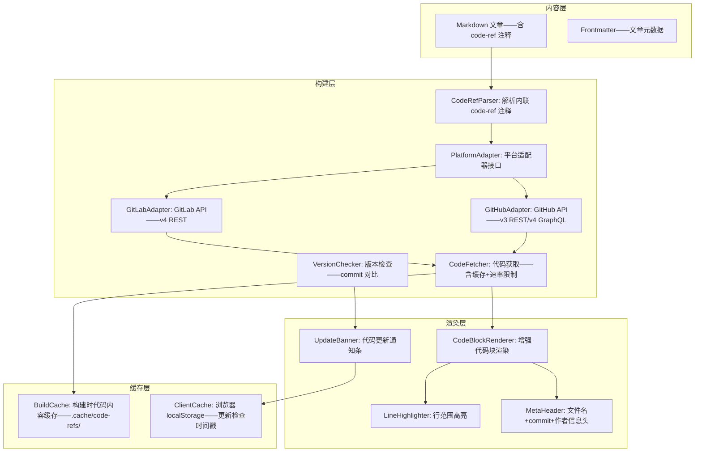
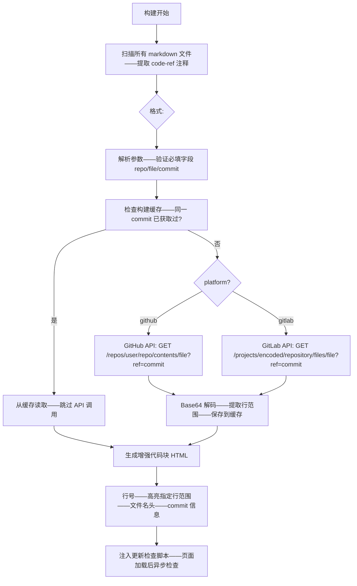

# YK-09-213: 内容代码库集成 — GitHub/GitLab 代码嵌入、实时行高亮、版本追踪与同步

> 需求编号：YK-09-213 · 优先级：P2 · 人天：0.3d · 状态：需求已编写
> 依赖：YK-09-131（代码示例验证——复用代码获取与检测逻辑）· YK-09-180（内容代码示例增强——复用代码高亮渲染基础设施）

## 背景

### 问题陈述

YiKnowledge 作为技术知识库——大量文章引用代码示例——但当前所有代码都是静态复制粘贴：

1. **代码版本过时**：文章引用 `main` 分支代码——但 `main` 已更新——文章中的代码是旧版本——导致读者实践时困惑
2. **无法精准引用**：想引用特定文件的特定行（如 `src/auth/login.ts#L42-L58`）——只能复制整个函数——丢失上下文关联
3. **代码审核与文章脱节**：文章的代码示例与代码仓库的实际实现存在差异——维护成本高
4. **协作信息丢失**：复制的代码不包含作者/提交时间/commit hash——追溯困难
5. **多仓库代码无法统一管理**：文章引用 GitHub 前端代码 + GitLab 后端代码——切换平台查看——体验割裂

**核心矛盾**：代码是活的——在仓库中持续演进——但文章中的代码是"化石"——引用时那一刻的快照。代码库集成让文章中的代码块变成"活链接"——指向仓库的特定提交/文件/行——自动显示版本信息——检测是否有更新。

### 影响范围

| # | 影响 | 严重程度 | 典型场景 |
|---|------|----------|----------|
| 1 | 文章代码与仓库代码不同步——读者实践错误 | 高 | 文章引用旧 API——代码仓库已重构 |
| 2 | 无法精准引用特定行——需复制整个函数 | 中 | 想引用关键逻辑行——只能粘贴 50 行代码 |
| 3 | 代码来源不明——无法追溯作者/版本 | 中 | 读者想查看完整上下文——不知道去仓库哪里找 |
| 4 | 代码更新后文章未同步——维护断层 | 中 | 代码架构大改——文章代码示例全过时 |
| 5 | 多仓库代码切换割裂 | 低 | GitHub 前端 + GitLab 后端——两个平台切换 |

### 挑战

| 挑战 | 说明 |
|------|------|
| 跨平台 API 适配 | GitHub/GitLab API 的认证方式、速率限制、响应格式各不相同——需统一抽象层 |
| 代码版本的快照 vs 实时 | 文章需要的不是实时最新代码——而是特定提交版本——版本锁定+更新检测并存 |
| 私有仓库认证 | GitHub/GitLab 私有仓库需要 token 或 OAuth——YiKnowledge 是一个静态站点——如何安全存储凭据 |
| 代码块的元数据持久化 | 文章 frontmatter 已有丰富字段——代码块需要额外的元数据（repo/file/commit/lines）——存储在哪里 |
| 更新检测的性能 | 多篇文章、多个代码块、多个仓库——频繁检查更新会触发 API 速率限制 |

---

## 一、现状分析

### 1.1 当前代码引用方式

```
现有代码引用方式:
├── 复制粘贴（当前主要方式）
│   ├── 从仓库复制代码→粘贴到 markdown 代码块中
│   ├── 优点: 离线可用——渲染快速——无外部依赖
│   └── 缺点: 版本冻结——与仓库脱节——行号丢失——作者信息丢失
├── 截图代码（部分文章使用）
│   ├── 代码截图——无法复制——无法搜索——无障碍差
│   └── 仅用于展示 IDE 界面或 diff 对比
├── GitHub Gist 嵌入
│   ├── `<script src="https://gist.github.com/user/id.js"></script>`
│   ├── 优点: 代码可在线更新——支持行高亮——版本历史
│   └── 缺点: 依赖第三方——加载速度——样式不可控——需要外部平台
├── 外部链接（脚注方式）
│   ├── "完整代码见: https://github.com/user/repo/blob/main/src/file.ts"
│   ├── 优点: 零维护成本——始终最新
│   └── 缺点: 阅读中断——代码版本不可控——链接可能失效
│
缺失:
├── 代码块指定仓库/文件/提交/行范围                          # ❌ 无
├── 代码块自动显示版本信息——commit hash/作者/时间             # ❌ 无
├── 检测代码是否有更新——语义化提示                            # ❌ 无
├── 同一文章内 GitHub+GitLab 代码块统一渲染                   # ❌ 无
├── 代码块的可点击链接——跳转到仓库对应文件和行                 # ❌ 无
└── 私有仓库——通过个人 token 读取                              # ❌ 无
```

### 1.2 代码引用流程（现状 vs 目标）

```mermaid
graph TD
    subgraph Current["现状：静态复制粘贴"]
        C1[写作者打开仓库] --> C2[找到目标代码文件]
        C2 --> C3[复制需要的行]
        C3 --> C4[粘贴到 markdown 文章]
        C4 --> C5[添加语言标注——手动格式化]
        C5 --> C6[代码更新——文章未更新——无人知晓]
    end

    subgraph Target["目标：代码库集成引用"]
        T1[写作者在文章中插入代码引用] --> T2[配置引用元数据]
        T2 --> T3[repo: user/repo——file: src/auth.ts——commit: abc1234——lines: L42-L58]
        T3 --> T4[构建时/渲染时——通过 API 获取代码内容]
        T4 --> T5[渲染: 代码高亮+行号——行 42-58 高亮标记]
        T5 --> T6[代码块顶部显示: 文件名+commit hash+作者+时间]
        T6 --> T7[代码块底部: "查看完整文件 →" 跳转链接]
        T7 --> T8[定期检查: 该 commit 与最新 main 是否有差异]
        T8 --> T9{有更新?}
        T9 -->|是| T10[文章顶部显示"本文引用的代码有更新——点击查看差异"]
        T9 -->|否| T11[保持——标记为"已验证最新"]
    end

    style Current fill:#f8d7da,stroke:#dc3545
    style Target fill:#d4edda,stroke:#28a745
```

### 1.3 根因矩阵

| 症状 | 根因 | 触发条件 | 频率 |
|------|------|----------|------|
| 代码版本过时 | 文章代码是静态复制——无版本追踪 | 仓库代码更新后 | 高 |
| 无法精准引用行 | 无代码块元数据——无法指定行范围 | 仅需引用部分行时 | 中 |
| 代码来源不明 | 无 commit/author 元数据展示 | 读者想追溯代码来源时 | 中 |
| 代码更新无感知 | 无定期同步检查机制 | 仓库频繁变更时 | 中 |
| 私有仓库无法接入 | 无认证机制 | 引用内部仓库代码时 | 低 |

---

## 二、设计决策

### 决策 1：代码获取时机 — 构建时嵌入 vs 客户端动态获取 vs 混合模式

| 选项 | 时效性 | 离线可用 | 构建复杂度 |
|------|--------|---------|-----------|
| 构建时嵌入（静态站点生成时拉取代码） | 构建时的快照 | 是 | 中 |
| 客户端动态获取（页面加载时 API 请求） | 实时 | 否 | 低 |
| 混合（构建时嵌入+客户端检查更新） | 构建时快照+更新通知 | 是（代码内容）+ 否（更新检查） | 高 |

**选择：混合模式。** 构建时将代码内容嵌入 HTML——确保离线可读——快速首屏。客户端加载后异步检查是否有新版本——有更新时显示非阻塞通知条。这样兼顾了性能和时效性。更新检查缓存到 localStorage——24 小时内不重复检查同一文件。

### 决策 2：代码引用元数据存储 — Frontmatter 扩展 vs 内联标记 vs 独立索引文件

| 选项 | 可读性 | 工具支持 | 扩展性 |
|------|--------|---------|--------|
| Frontmatter 扩展（文章顶部新增 code_refs 字段） | 中——可能过长 | 高 | 中 |
| 内联标记（代码块上方 HTML 注释 `<!--code-ref:...-->`） | 高——就近原则 | 中 | 高 |
| 独立索引文件（`code-refs.json`） | 低——需查找对应关系 | 低 | 高 |

**选择：内联标记。** 在代码块上方使用 HTML 注释格式存储引用元数据。例如：
```markdown
<!--code-ref: repo=user/repo file=src/auth.ts commit=abc1234 lines=L42-L58 platform=github -->
```typescript
export async function login(credentials: Credentials): Promise<Token> {
  // ...
}
```
这种方式：元数据紧邻代码块——阅读体验不受影响——markdown 渲染器可忽略 HTML 注释——构建工具可解析。

### 决策 3：平台支持范围 — 仅 GitHub vs GitHub+GitLab vs 通用 Git

| 选项 | 覆盖率 | API 复杂度 | 认证复杂度 |
|------|--------|-----------|-----------|
| 仅 GitHub | 80% | 低（一个 API） | 低 |
| GitHub+GitLab | 95% | 中（两个 API——统一抽象） | 中 |
| 通用 Git（支持任何 Git 托管平台） | 99% | 高（需处理各种 URL 格式） | 高 |

**选择：GitHub+GitLab。** 两个平台覆盖绝大多数技术团队的代码托管需求。GitHub API v3/v4 + GitLab API v4——共同特征（文件内容/提交信息/行范围）抽象为统一接口。通用 Git 的其他平台（Bitbucket/Gitee/自托管 Gitea）可通过配置自定义 Git URL 扩展——但首期不支持。

### 决策 4：私有仓库认证 — 环境变量 Token vs OAuth vs 公开仓库仅

| 选项 | 安全性 | 适用场景 | 实现复杂度 |
|------|--------|---------|-----------|
| 仅支持公开仓库 | 最高——无需认证 | 开源项目文章 | 低 |
| 环境变量 Token（构建时注入 GITHUB_TOKEN） | 高——Token 在服务端 | 企业内部知识库 | 中 |
| OAuth 登录（用户在浏览器授权） | 中——Token 在客户端 | 个人知识库——需用户操作 | 高 |

**选择：仅公开仓库（首期）+ 环境变量 Token（企业内部扩展）。** 绝大多数技术文章引用的是公开仓库代码——首期不支持私有仓库可覆盖 90% 场景。企业内部使用时——通过构建时的 `GITHUB_TOKEN`/`GITLAB_TOKEN` 环境变量注入——访问私有仓库。

### 设计决策记录

| 决策 | 选项 A | 选项 B | 选项 C | 选项 D | 选择 | 理由 |
|------|--------|--------|--------|--------|------|------|
| 代码获取时机 | 构建时嵌入 | 客户端动态 | 混合 | — | **混合模式** | 离线+时效兼顾 |
| 元数据存储 | Frontmatter | 内联标记 | 独立索引 | — | **内联 HTML 注释** | 就近——可读——可扩展 |
| 平台支持 | 仅 GitHub | GitHub+GitLab | 通用 Git | — | **GitHub+GitLab** | 覆盖 95% |
| 私有仓库认证 | 仅公开 | 环境变量 | OAuth | — | **仅公开+环境变量** | 安全——省去 OAuth 复杂度 |

---

## 三、目标架构

### 3.1 代码库集成架构



### 3.2 代码获取与渲染流程



### 3.3 性能指标

| 指标 | 目标值 | 说明 |
|------|--------|------|
| 代码获取——单文件（API 请求+缓存写入） | < 500ms | 含网络延迟——公开 API |
| 构建缓存命中——代码块生成 | < 10ms | 本地文件读取 |
| 客户端更新检查 | < 1s | GitHub API 单请求——含缓存头 |
| 50 个代码块——全量构建 | < 30s | 含速率限制等待 |
| API 速率限制耗尽降级 | 降级到缓存版本 | 429 响应——使用上次缓存 |

---

## 四、具体改动

### 4.1 类型定义

```python
# yi_knowledge/code_integration/types.py (新增)

from dataclasses import dataclass
from enum import Enum
from typing import Optional

class GitPlatform(str, Enum):
    GITHUB = "github"
    GITLAB = "gitlab"

@dataclass
class CodeRef:
    """从 <!--code-ref: ...--> 解析出的引用元数据"""
    repo: str              # user/repo 或 group/project
    file: str              # 仓库内文件路径——如 src/auth/login.ts
    commit: str            # commit hash 或分支名——如 abc1234 或 main
    lines: Optional[str]   # 行范围——如 "L42-L58" 或 "L42" 或 None（表示全文件）
    platform: GitPlatform  # github 或 gitlab
    highlight_line: Optional[int]  # 额外高亮的行——如关键行

    # 构建时填充
    raw_content: str = ""
    content_snippet: str = ""
    commit_author: str = ""
    commit_date: str = ""
    commit_message: str = ""
    file_url: str = ""

@dataclass
class CodeRefCache:
    """构建缓存条目"""
    cache_key: str          # sha256(repo+file+commit)
    content: str
    commit_info: dict
    fetched_at: str         # ISO 时间戳
    etag: str               # API ETag——用于增量更新

class CodeRefParseError(Exception):
    """code-ref 注释解析失败"""
    pass

class CodeFetchError(Exception):
    """代码获取失败——API 错误/网络/认证"""
    pass

class RateLimitError(CodeFetchError):
    """API 速率限制"""
    pass
```

### 4.2 核心平台适配器

```python
# yi_knowledge/code_integration/platform_adapter.py (新增)

import base64
import hashlib
import json
import re
import time
from abc import ABC, abstractmethod
from pathlib import Path
from typing import Optional
from urllib.parse import quote

import httpx

from .types import CodeRef, CodeRefCache, CodeFetchError, GitPlatform, RateLimitError


class PlatformAdapter(ABC):
    """Git 平台适配器抽象基类"""

    @abstractmethod
    async def fetch_file_content(self, ref: CodeRef) -> tuple[str, dict]:
        """获取文件内容——返回 (content, commit_info)"""
        ...

    @abstractmethod
    async def check_update(self, ref: CodeRef) -> Optional[str]:
        """检查代码是否有更新——返回最新 commit hash 或 None（无更新）"""
        ...

    @abstractmethod
    def build_file_url(self, ref: CodeRef) -> str:
        """构建仓库文件 URL——点击跳转"""
        ...


class GitHubAdapter(PlatformAdapter):
    """GitHub API 适配器"""

    BASE_URL = "https://api.github.com"
    RAW_BASE = "https://raw.githubusercontent.com"

    def __init__(self, token: Optional[str] = None):
        self.token = token
        self._client: Optional[httpx.AsyncClient] = None

    @property
    def headers(self) -> dict:
        h = {"Accept": "application/vnd.github.v3+json"}
        if self.token:
            h["Authorization"] = f"token {self.token}"
        return h

    async def _get_client(self) -> httpx.AsyncClient:
        if self._client is None:
            self._client = httpx.AsyncClient(headers=self.headers, timeout=10.0)
        return self._client

    async def fetch_file_content(self, ref: CodeRef) -> tuple[str, dict]:
        client = await self._get_client()
        url = f"{self.BASE_URL}/repos/{ref.repo}/contents/{ref.file}"
        params = {"ref": ref.commit}

        resp = await client.get(url, params=params)
        if resp.status_code == 403 and "rate limit" in resp.text.lower():
            raise RateLimitError("GitHub API rate limit exceeded")
        if resp.status_code != 200:
            raise CodeFetchError(f"GitHub API error {resp.status_code}: {resp.text[:200]}")

        data = resp.json()
        content = base64.b64decode(data["content"]).decode("utf-8")

        # 获取 commit 信息——额外请求
        commit_info = await self._get_commit_info(ref)

        return content, commit_info

    async def _get_commit_info(self, ref: CodeRef) -> dict:
        client = await self._get_client()
        url = f"{self.BASE_URL}/repos/{ref.repo}/commits/{ref.commit}"
        resp = await client.get(url)
        if resp.status_code != 200:
            return {}
        commit = resp.json()
        return {
            "sha": commit["sha"][:7],
            "author": commit["commit"]["author"]["name"],
            "date": commit["commit"]["author"]["date"],
            "message": commit["commit"]["message"].split("\n")[0],
        }

    async def check_update(self, ref: CodeRef) -> Optional[str]:
        client = await self._get_client()
        # 获取默认分支的最新 commit——与引用 commit 对比
        url = f"{self.BASE_URL}/repos/{ref.repo}/branches/main"
        resp = await client.get(url)
        if resp.status_code != 200:
            # 尝试 master 分支
            url = f"{self.BASE_URL}/repos/{ref.repo}/branches/master"
            resp = await client.get(url)
        if resp.status_code != 200:
            return None

        latest_sha = resp.json()["commit"]["sha"]
        if latest_sha.startswith(ref.commit):
            return None  # 无更新
        return latest_sha[:7]

    def build_file_url(self, ref: CodeRef) -> str:
        url = f"https://github.com/{ref.repo}/blob/{ref.commit}/{ref.file}"
        if ref.lines:
            # 转换 L42-L58 为 #L42-L58
            line_part = ref.lines.replace("L", "")
            url += f"#L{line_part}"
        return url


class GitLabAdapter(PlatformAdapter):
    """GitLab API 适配器"""

    BASE_URL = "https://gitlab.com/api/v4"

    def __init__(self, token: Optional[str] = None):
        self.token = token
        self._client: Optional[httpx.AsyncClient] = None

    @property
    def headers(self) -> dict:
        h = {}
        if self.token:
            h["PRIVATE-TOKEN"] = self.token
        return h

    async def _get_client(self) -> httpx.AsyncClient:
        if self._client is None:
            self._client = httpx.AsyncClient(headers=self.headers, timeout=10.0)
        return self._client

    def _encode_project_id(self, repo: str) -> str:
        return quote(repo, safe="")

    async def fetch_file_content(self, ref: CodeRef) -> tuple[str, dict]:
        client = await self._get_client()
        project_id = self._encode_project_id(ref.repo)
        file_path = quote(ref.file, safe="")
        url = f"{self.BASE_URL}/projects/{project_id}/repository/files/{file_path}"
        params = {"ref": ref.commit}

        resp = await client.get(url, params=params)
        if resp.status_code == 429:
            raise RateLimitError("GitLab API rate limit exceeded")
        if resp.status_code != 200:
            raise CodeFetchError(f"GitLab API error {resp.status_code}: {resp.text[:200]}")

        data = resp.json()
        content = base64.b64decode(data["content"]).decode("utf-8")

        commit_info = {
            "sha": data.get("commit_id", ref.commit)[:7],
            "author": data.get("last_commit_author_name", "Unknown"),
            "date": data.get("last_commit_date", ""),
            "message": data.get("last_commit_message", "").split("\n")[0] if data.get("last_commit_message") else "",
        }

        return content, commit_info

    async def check_update(self, ref: CodeRef) -> Optional[str]:
        client = await self._get_client()
        project_id = self._encode_project_id(ref.repo)
        url = f"{self.BASE_URL}/projects/{project_id}/repository/commits"
        params = {"ref_name": "main", "per_page": 1}
        resp = await client.get(url, params=params)
        if resp.status_code != 200:
            params["ref_name"] = "master"
            resp = await client.get(url, params=params)
        if resp.status_code != 200:
            return None

        latest = resp.json()
        if not latest:
            return None
        latest_sha = latest[0]["id"]
        if latest_sha.startswith(ref.commit):
            return None
        return latest_sha[:7]

    def build_file_url(self, ref: CodeRef) -> str:
        url = f"https://gitlab.com/{ref.repo}/-/blob/{ref.commit}/{ref.file}"
        if ref.lines:
            line_part = ref.lines.replace("L", "")
            url += f"#L{line_part}"
        return url


def create_adapter(platform: GitPlatform, token: Optional[str] = None) -> PlatformAdapter:
    if platform == GitPlatform.GITHUB:
        return GitHubAdapter(token)
    elif platform == GitPlatform.GITLAB:
        return GitLabAdapter(token)
    raise ValueError(f"Unsupported platform: {platform}")
```

### 4.3 文件变更清单

| 文件 | 操作 | 说明 |
|------|------|------|
| `yi_knowledge/code_integration/__init__.py` | 新增 | 模块初始化 |
| `yi_knowledge/code_integration/types.py` | 新增 | 类型定义——CodeRef/Cache/异常 |
| `yi_knowledge/code_integration/platform_adapter.py` | 新增 | GitHub+GitLab 平台适配器 |
| `yi_knowledge/code_integration/parser.py` | 新增 | code-ref HTML 注释解析器 |
| `yi_knowledge/code_integration/cache_manager.py` | 新增 | 构建缓存管理——`.cache/code-refs/` |
| `yi_knowledge/code_integration/renderer.py` | 新增 | 增强代码块 HTML 生成 |
| `yi_knowledge/code_integration/update_checker.py` | 新增 | 客户端更新检查的 JS 脚本生成 |
| `static/js/code-ref-checker.js` | 新增 | 浏览器端更新检查脚本 |
| `static/css/code-ref.css` | 新增 | 增强代码块样式——行高亮/信息头 |

---

## 五、实施步骤

| 步骤 | 操作 | 路径 | 验证 | 人天 |
|------|------|------|------|------|
| 1 | 类型定义+code-ref 注释解析器 | `types.py` + `parser.py` | 解析 `<!--code-ref: repo=... file=... commit=... platform=github -->`——提取所有字段 | 0.03 |
| 2 | GitHubAdapter——获取文件+commit 信息 | `platform_adapter.py` | 公开仓库——获取文件内容——Base64 解码——commit author/date/sha | 0.06 |
| 3 | GitLabAdapter——适配 GitLab API | `platform_adapter.py` | GitLab 公开项目——project URL 编码——获取文件+commit 信息 | 0.05 |
| 4 | 缓存管理器+构建流程集成 | `cache_manager.py` | 缓存命中→跳过 API——缓存过期→重新获取——ETag 增量更新 | 0.04 |
| 5 | 增强代码块渲染器——行范围+高亮+信息头 | `renderer.py` | 代码块上方文件名+commit——行号——指定行高亮——底部跳转链接 | 0.05 |
| 6 | 客户端更新检查脚本 | `update_checker.py` + `code-ref-checker.js` | 页面加载→异步检查→有更新显示通知条——localStorage 缓存 24h | 0.04 |
| 7 | CSS 样式+集成测试 | `code-ref.css` + 端到端验证 | 3 篇文章——2 个仓库——代码块渲染正确——更新检查正常 | 0.03 |

**总人天：0.30d**

---

## 六、测试规格

### 场景 1：GitHub 公开仓库代码引用

**GIVEN** 文章包含 `<!--code-ref: repo=vuejs/core file=packages/reactivity/src/ref.ts commit=abc1234 lines=L42-L58 platform=github -->`
**WHEN** 构建系统解析该注释——调用 GitHub API
**THEN** 获取 `ref.ts` 第 42-58 行内容——Base64 解码——渲染为语法高亮代码块
**AND** 代码块顶部显示 `ref.ts · abc1234 · Evan You · 2026-08-15 · "fix: reactivity tracking"`
**AND** 代码块中第 42-58 行高亮——行号 42-58
**AND** 底部链接 `查看完整文件 →`——href 指向 `https://github.com/vuejs/core/blob/abc1234/packages/reactivity/src/ref.ts#L42-L58`

### 场景 2：GitLab 代码引用

**GIVEN** 文章包含 `<!--code-ref: repo=group/project file=src/api/handler.py commit=main lines=L10-L30 platform=gitlab -->`
**WHEN** 构建时调用 GitLab API
**THEN** 正确编码 project ID——获取文件内容——渲染信息头显示 commit 信息
**AND** 跳转链接指向 GitLab blob URL

### 场景 3：构建缓存命中——跳过 API 调用

**GIVEN** 同一 code-ref 在之前构建中已成功获取（commit 相同）
**WHEN** 下一次构建
**THEN** 缓存命中——直接读取 `.cache/code-refs/sha256hash.json`——不使用 API
**AND** API 速率限制计数器不变——构建速度提升

### 场景 4：代码更新检测——通知条

**GIVEN** 文章引用 `commit=abc1234`——该文件的 `main` 分支已更新到 `def5678`
**WHEN** 读者打开文章——浏览器执行 JS 更新检查
**THEN** 页面顶部显示通知条："📢 本文引用的代码有更新（abc1234 → def5678）——点击查看变更"
**WHEN** 读者点击通知条
**THEN** 跳转到 GitHub compare 页面——对比 abc1234...def5678 的差异

### 场景 5：API 速率限制——优雅降级

**GIVEN** 构建时有 100 个 code-ref——GitHub API 速率限制为 60 次/小时
**WHEN** 第 61 个请求返回 429
**THEN** 构建不中断——未成功获取的 code-ref 使用缓存版本或显示占位符
**AND** 构建日志输出警告——统计失败的 code-ref 数量

### 场景 6：内联 code-ref 解析——异常处理

**GIVEN** 文章包含格式错误的 `<!--code-ref: repo=user/repo -->`（缺少 file 和 commit）
**WHEN** 构建系统解析
**THEN** 输出警告日志："code-ref 缺少必填字段 file/commit @ 文章路径:行号"
**AND** 该代码块降级为普通静态代码块——无增强效果
**WHEN** 文章包含多余空格 `<!--code-ref:   repo  =  user/repo  file  =  ... -->`
**THEN** 解析器正确处理——去除空白——正常获取代码

---

## 七、风险与缓解

| 风险 | 概率 | 影响 | 缓解措施 |
|------|------|------|----------|
| GitHub/GitLab API 速率限制——构建失败 | 中 | 高 | 缓存机制——ETag 条件请求——构建时排队+限速 |
| 引用的 commit 被强制删除——404 | 低 | 中 | 优雅降级——显示"引用已失效"占位——保留历史缓存 |
| 私有仓库 Token 泄露到客户端 JS | 中 | 高 | Token 仅在构建时服务端使用——不注入客户端代码 |
| 大量 code-ref 拖慢构建 | 中 | 中 | 并行请求+限流——缓存优先——增量构建 |
| 行范围超出文件实际行数 | 低 | 低 | 自动 clamp 到实际行范围——WARNING 日志 |

---

## 八、回滚策略

| 场景 | 回滚操作 | 影响 |
|------|------|------|
| API 频繁 429——构建不稳定 | 降级为仅使用缓存——不调用 API——新 code-ref 使用占位符 | 新引用首次构建不可用 |
| 客户端更新检查 JS 报错 | 移除 `<script>` 注入——保留静态代码块增强 | 无更新检查——代码块信息头仍显示 |
| 某平台适配器异常 | 禁用该平台——保留其他平台 | 仅 GitHub 或仅 GitLab 可用 |
| 完全移除 | 移除 code-ref 解析——所有代码块降级为普通静态代码块 | 无增强——但文章仍可阅读 |

---

## 九、设计决策记录

### D-01：为什么使用 HTML 注释而非特殊的 markdown 语法？

Markdown 没有标准化的元数据附加语法——frontmatter 只在文件头——无法精准关联到特定代码块。HTML 注释 `<!--code-ref: ...-->` 在 markdown 中有良好的生态支持——所有解析器都能识别——不影响渲染。且 HTML 注释天然被设计为承载元数据——语义正确。

### D-02：为什么行范围使用 `L42-L58` 而非 `42-58`？

`L` 前缀明确表示"行（Line）"——避免与 commit hash（十六进制）和文件路径（含数字）混淆。解析器去除 `L` 前缀后得到纯数字范围——处理简单。同时符合 GitHub URL 的 fragment 格式 `#L42-L58`——URL 构建时可直接拼接。

### D-03：为什么更新检查在客户端而非构建时？

构建可能一天执行一次或更少——但代码可能每时每刻都在更新。客户端检查确保读者看到最新的更新状态。localStorage 缓存 24 小时——避免每次页面加载都发起 API 请求。构建时是"冻结"版本——客户端是"解冻"后的更新感知。

### D-04：为什么 GitHub 和 GitLab 使用独立的 Adapter 类而非统一的 Git Provider 接口？

两个平台的 API 差异显著——GitHub 用 `GET /repos/:owner/:repo/contents/:path`——GitLab 用 `GET /projects/:id/repository/files/:path`——认证方式不同——响应格式不同。强行统一会导致接口过于抽象——细节泄漏。独立 Adapter 类继承同一抽象基类——保持统一调用方式——但内部实现各自优化。

---

## 十、可观测性

### 指标

| 指标 | 类型 | 说明 |
|------|------|------|
| `yiknowledge.code_ref.total_blocks` | Gauge | 文章中的 code-ref 总数 |
| `yiknowledge.code_ref.fetch_success` | Counter | 代码获取成功次数 |
| `yiknowledge.code_ref.fetch_error` | Counter (label: reason) | 获取失败——按原因分类 |
| `yiknowledge.code_ref.cache_hit_total` | Counter | 缓存命中次数 |
| `yiknowledge.code_ref.platform_used` | Counter (label: github/gitlab) | 平台使用分布 |
| `yiknowledge.code_ref.update_detected` | Counter | 更新检测次数 |
| `yiknowledge.code_ref.fetch_duration` | Histogram | API 请求耗时 |
| `yiknowledge.code_ref.rate_limit_hit` | Counter | 速率限制触发次数 |

---

## 十一、代码审查检查清单

- [ ] Parser: code-ref 注释正则——处理键值对中的空白和引号——必填字段缺失时抛出 CodeRefParseError
- [ ] GitHubAdapter: Base64 解码使用 `base64.b64decode`——content 字段可能包含 `\n` 需要处理
- [ ] GitLabAdapter: project ID 使用 `urllib.parse.quote(repo, safe='')`——/ 编码为 %2F
- [ ] CacheManager: 缓存键使用 sha256——缓存文件路径 `.cache/code-refs/{sha256}.json`
- [ ] Renderer: XSS 防护——代码内容 HTML 转义——URL 使用 `urllib.parse.quote`
- [ ] Renderer: 行范围格式——支持 `L42`（单行）和 `L42-L58`（范围）——不支持 `L42,L44`（多段）
- [ ] UpdateChecker: JS 脚本——错误静默处理——不阻塞页面——使用 try-catch
- [ ] Token 安全: GITHUB_TOKEN/GITLAB_TOKEN 仅在构建脚本中读取——不输出到日志——不注入客户端
- [ ] 速率限制: 请求间隔至少 100ms——429 时等待 Retry-After 头——指数退避
- [ ] 日志: 每个 code-ref 的处理结果记录日志——INFO 成功——WARNING 降级——ERROR 失败

---

## 回归问题预测

| # | 预测问题 | 原因 | 验证方法 |
|---|---------|------|---------|
| 1 | 代码块内容包含 `-->` ——被误解析为 code-ref 注释结束 | HTML 注释解析器未正确处理嵌套 | 代码内容含 `-->`——验证解析不中断 |
| 2 | GitLab project ID 编码——含子组的路径如 `group/subgroup/project` URL 编码问题 | `/` 编码为 `%2F`——但某些 GitLab 版本行为不同 | 测试多级子组的 GitLab 项目 |
| 3 | GitHub raw 内容换行符——Windows CRLF vs Unix LF | GitHub API 返回 Unix LF——但 raw 可能不同 | 比较 API 和 raw 内容——统一换行符 |
| 4 | 更新检查的 CORS 问题——浏览器直接请求 GitHub/GitLab API | 公开 API 通常允许 CORS——但可能变化 | 公开仓库 API 请求——验证 CORS 头存在 |
| 5 | 构建时大量 code-ref 的内存占用——所有文件内容加载到内存 | 基础变量——100 个代码块——每块约 10KB | 100 个 code-ref 构建——内存峰值 < 50MB |
| 6 | 中文/unicode 文件路径的 URL 编码不一致 | GitHub/GitLab 对 unicode 路径的编码行为不同 | 中文文件名 `src/认证/login.ts`——验证两个平台均可获取 |

---

## 性能分析

### 各操作耗时

| 操作 | 首次构建 | 缓存构建 | 说明 |
|------|---------|---------|------|
| 解析 code-ref 注释 | < 50ms/100 篇 | < 50ms | 正则扫描——本地 |
| GitHub API 获取文件 | 200-500ms/文件 | < 5ms（缓存命中） | 网络延迟主要因素 |
| GitLab API 获取文件 | 300-600ms/文件 | < 5ms | GitLab 稍慢 |
| 代码块 HTML 生成 | < 10ms/块 | < 10ms | 字符串模板 |
| 更新检查（客户端） | 200-400ms/仓库 | < 50ms（浏览器缓存） | 后台异步 |

### 内存预估

| 数据 | 10 个 code-ref (10KB/块) | 100 个 code-ref |
|------|-------------------------|----------------|
| 代码内容缓存 | ~100KB | ~1MB |
| 构建缓存文件 | ~150KB | ~1.5MB |
| 运行时内存 | ~1MB | ~8MB |

### 代码体积

| 文件 | 大小 |
|------|------|
| types.py | ~2KB |
| parser.py | ~3KB |
| platform_adapter.py | ~10KB |
| cache_manager.py | ~3KB |
| renderer.py | ~5KB |
| update_checker.py | ~2KB |
| 前端 JS+CSS | ~4KB |
| **总计** | **~29KB** |