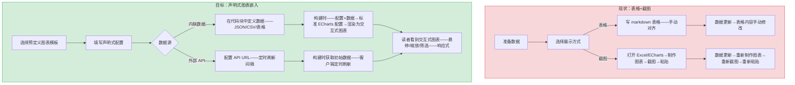
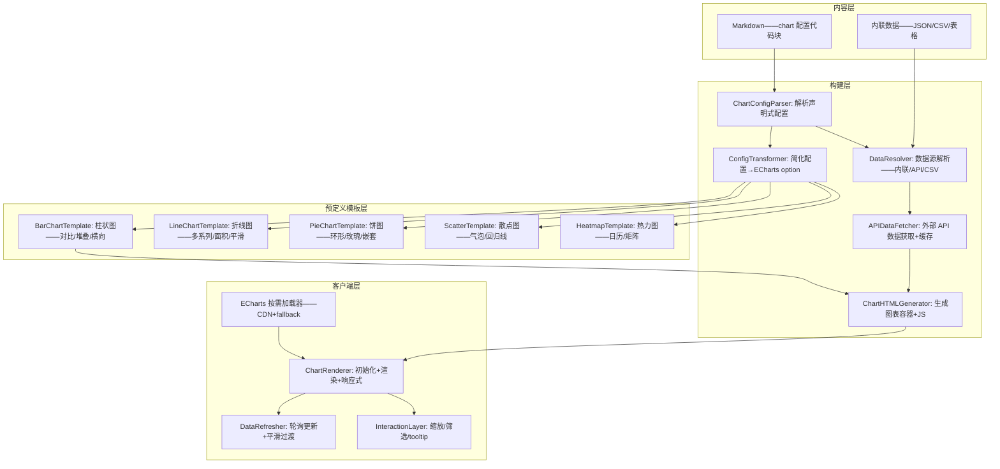
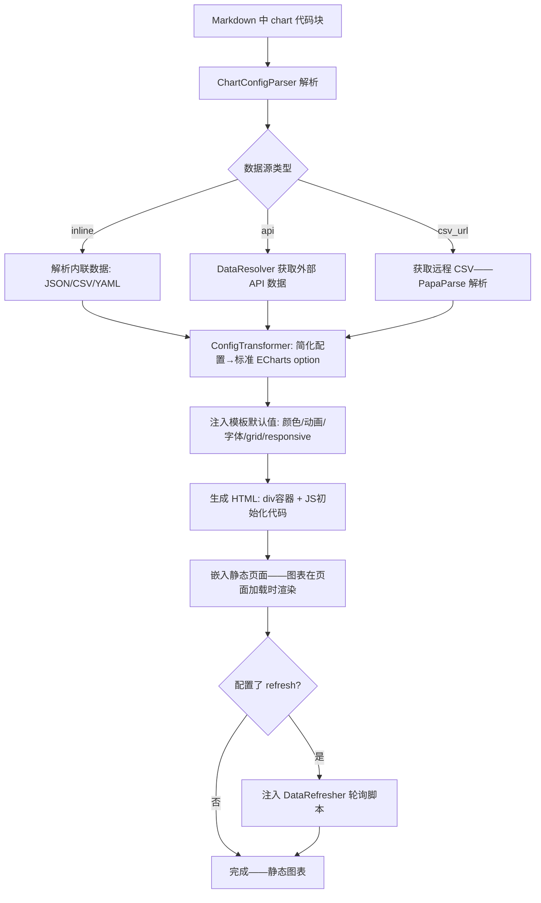

# YK-09-214: 内容数据可视化嵌入 — 交互式图表、外部 API 数据源与实时更新

> 需求编号：YK-09-214 · 优先级：P2 · 人天：0.3d · 状态：需求已编写
> 依赖：YK-09-120（图表与可视化嵌入——复用图表嵌入基础设施）· YK-09-52（SimHash 相似度检测——复用数据处理基础）· YK-09-97（内容统计仪表盘——复用统计图表类型）

## 背景

### 问题陈述

YiKnowledge 文章经常需要展示数据——性能基准测试结果、趋势分析、对比数据——但当前所有数据都以静态表格或截图方式呈现：

1. **静态表格缺乏视觉冲击力**：性能数据表格（500+ 行）读者很难发现趋势和异常——而折线图一目了然
2. **截图的图表无法交互**：截图柱状图的悬停提示、数据筛选、缩放——全部丢失——数据探索能力为零
3. **数据更新后文章图表未同步**：RAG 检索质量的周报数据变了——但文章中的截图仍是旧数据——需手动重新截图
4. **外部数据无法嵌入**：想展示 GitHub Star 增长趋势、NPM 下载量——只能截图或外部链接——无法嵌入文章
5. **图表配置门槛高**：ECharts/Chart.js 的配置 JSON 复杂——写作者通常不是前端——不会写图表配置

**核心矛盾**：数据可视化是现代技术文章的标配——但 YiKnowledge 作为静态 markdown 知识库——缺少图表嵌入能力。可视化嵌入让写作者用简单的声明式语法在文章中嵌入交互式图表——支持内联数据和外部 API 数据源——自动更新。

### 影响范围

| # | 影响 | 严重程度 | 典型场景 |
|---|------|----------|----------|
| 1 | 数据以静态表格呈现——可读性差 | 高 | 性能基准测试 50 行数据表格 |
| 2 | 截图图表失去交互性 | 高 | 柱状图的悬停提示/缩放/筛选能力丢失 |
| 3 | 数据更新需手动重新截图 | 中 | RAG 周报数据变化——文章图表不更新 |
| 4 | 外部数据源无法内嵌展示 | 中 | GitHub Star 趋势——NPM 下载量——API 监控数据 |
| 5 | 图表配置复杂——写作者不会写 | 中 | ECharts 配置 JSON 动辄 100+ 行 |

### 挑战

| 挑战 | 说明 |
|------|------|
| 图表库选择与体积 | ECharts 完整版约 1MB——按需加载——仅加载用到的图表类型 |
| 外部 API 数据源的可靠性与缓存 | 外部 API 可能不可用/限流——需本地缓存+降级策略 |
| 静态站点中的实时数据 | 静态 HTML 如何展示"实时"数据——构建时嵌入+客户端定时刷新 |
| 图表配置的简化——降低门槛 | ECharts 标准配置过于复杂——需简化为声明式语法——声明式→标准配置的转换层 |
| 响应式图表——不同屏幕尺寸 | 图表在桌面/移动端的尺寸适配——resize 监听+重绘 |

---

## 一、现状分析

### 1.1 当前数据展示方式

```
现有数据展示方式:
├── Markdown 表格（当前主要方式）
│   ├── 适用: 小数据量 (< 20 行) ——结构化对比
│   ├── 缺点: > 50 行难以阅读——无法发现趋势和异常——无视觉编码
│   └── 示例: 性能数据 10 个指标 x 8 个版本 = 80 单元格表格
├── 截图图表（当前常用替代方案）
│   ├── 从 Excel/ECharts/Grafana 截图 → 粘贴到文章
│   ├── 优点: 不需要写代码——所见即所得
│   └── 缺点: 无交互——数据更新需重新截图——截图模糊——无障碍差
├── 静态 SVG（少量使用）
│   ├── 手写或工具导出 SVG → 嵌入 markdown
│   ├── 优点: 矢量——缩放不失真——可内嵌链接
│   └── 缺点: 手写复杂——数据绑定困难——无交互
├── 外部链接（iframe 嵌入方案）
│   ├── Grafana Dashboard iframe / ObservableHQ 嵌入
│   ├── 优点: 完全交互——实时数据
│   └── 缺点: 安全风险——加载慢——外部依赖——可能被阻止
│
缺失:
├── 声明式图表语法——简单配置生成交互图表                    # ❌ 无
├── 内联数据——直接在 markdown 中定义数据                      # ❌ 无
├── 外部 API 数据源——URL 配置自动获取                          # ❌ 无
├── 图表交互——悬停提示/缩放/数据筛选                          # ❌ 无
├── 实时更新——定时刷新外部数据源                               # ❌ 无
└── 预定义图表模板——性能对比/时间线/热力图等                    # ❌ 无
```

### 1.2 可视化嵌入流程（现状 vs 目标）



### 1.3 根因矩阵

| 症状 | 根因 | 触发条件 | 频率 |
|------|------|----------|------|
| 数据表格可读性差 | 无图表可视化能力——仅文本表格 | 数据表格 > 20 行 | 高 |
| 截图图表无交互 | 无前端图表引擎集成——仅静态图片 | 任何图表场景 | 高 |
| 数据变化后图表不更新 | 截图/表格是静态的——无更新机制 | 源数据定期变化时 | 中 |
| 外部数据需平台切换查看 | 无 API 数据嵌入能力 | 引用外部监控/统计数据 | 中 |
| 图表配置复杂——写作者回避 | 无简化声明式语法 | 非前端写作者 | 中 |

---

## 二、设计决策

### 决策 1：图表渲染引擎 — Chart.js vs ECharts vs Observable Plot

| 选项 | 体积 | 交互能力 | 中文生态 | 按需加载 |
|------|------|---------|---------|---------|
| Chart.js | ~60KB | 基础——悬停+缩放 | 一般 | 否——完整加载 |
| ECharts | ~1MB（完整）/~300KB（按需） | 丰富——dataZoom/brush/tooltip | 优秀——中文文档+社区 | 是——按图表类型加载 |
| Observable Plot | ~60KB | 有限——悬停——无缩放 | 差 | 否 |

**选择：ECharts——按需加载。** ECharts 的中文生态和交互能力远优于 Chart.js——尤其是 dataZoom（区域缩放）、tooltip（格式化）、visualMap（视觉映射）——这些是技术文章中最需要的交互。按需加载只引入用到的图表类型（bar/line/pie/scatter/heatmap）——压缩后约 300KB——首次加载后可缓存。

### 决策 2：声明式图表语法 — 自定义 DSL vs 简化 JSON vs ECharts 子集

| 选项 | 学习成本 | 灵活性 | 转换难度 |
|------|---------|--------|---------|
| 自定义 DSL——如 `{chart:bar, x:..., y:..., title:...}` | 低 | 中 | 高——需完整 DSL 设计 |
| 简化 JSON——预设配置+数据分离 | 低 | 中 | 低 |
| ECharts 配置子集——直接使用 ECharts option | 高（对非前端） | 高 | 无转换 |

**选择：简化 JSON——预设配置+数据分离。** 写作者只需指定：图表类型、数据来源、标题、简化的轴配置。其余（颜色/动画/字体/网格线/responsive）由预设模板提供默认值。例如：
```yaml
chart: bar
title: "RAG 检索延迟对比"
x: ["基线", "优化后", "混合检索"]
y: [{ name: "P50(ms)", data: [320, 180, 95] }, { name: "P99(ms)", data: [890, 420, 210] }]
```

### 决策 3：外部 API 数据源 — 不支持 vs 预定义 API vs 通用 API

| 选项 | 灵活性 | 安全性 | 实现复杂度 |
|------|--------|--------|-----------|
| 不支持外部 API——仅内联数据 | 低 | 高 | 低 |
| 预定义 API（GitHub/NPM/Docker Hub 等） | 中 | 高 | 中 |
| 通用 API（任意 URL——JSONPath 提取） | 高 | 低——XSS/CSRF 风险 | 高 |

**选择：预定义 API 适配器 + 通用 API（沙箱）。** 首期提供 5 个预定义数据源：GitHub Stars、NPM Downloads、Docker Pulls、自定义 JSON API（JSONPath 提取）、CSV 文件 URL。通用 API 需要配置 data mapping（JSONPath/CSV column mapping）——在沙箱中处理——仅提取数值数据——不执行脚本。

### 决策 4：实时更新策略 — 无更新 vs 客户端轮询 vs WebSocket

| 选项 | 实时性 | 服务器负载 | 实现复杂度 |
|------|--------|-----------|-----------|
| 无更新——构建时快照 | 无 | 无 | 低 |
| 客户端定时轮询（setInterval + fetch） | 分钟级（5-60min） | 低（请求外部 API） | 中 |
| WebSocket 推送 | 秒级 | 高 | 高 |

**选择：客户端定时轮询——可配置间隔。** YiKnowledge 是静态站点——无后端推送能力。客户端轮询是最简单的实现——图表配置中可指定 `refresh: 3600`（秒）。默认不刷新——仅当明确配置刷新间隔时才轮询。轮询使用 Cache-Control/ETag 减少带宽。

### 设计决策记录

| 决策 | 选项 A | 选项 B | 选项 C | 选项 D | 选择 | 理由 |
|------|--------|--------|--------|--------|------|------|
| 渲染引擎 | Chart.js | ECharts | Observable | — | **ECharts 按需** | 交互丰富——中文生态——按需 300KB |
| 声明式语法 | 自定义 DSL | 简化 JSON | ECharts 子集 | — | **简化 JSON** | 低门槛——可扩展 |
| 外部数据源 | 不支持 | 预定义 API | 通用 API | — | **预定义+通用** | 覆盖主要场景 |
| 实时更新 | 无更新 | 客户端轮询 | WebSocket | — | **客户端轮询** | 简单——可配置——低负载 |

---

## 三、目标架构

### 3.1 数据可视化嵌入架构



### 3.2 图表渲染流程



### 3.3 性能指标

| 指标 | 目标值 | 说明 |
|------|--------|------|
| ECharts 按需加载（bar+line+pie） | < 300KB gzip | CDN 加载——首次后缓存 |
| 单图表初始化渲染 | < 200ms | 客户端 JS 执行 |
| 内联数据图表生成（构建时） | < 50ms/图表 | 纯配置转换 |
| API 数据获取+缓存写入 | < 1s | 含网络延迟 |
| 客户端轮询数据更新——图表平滑过渡 | < 100ms | merge 新数据——动画过渡 |
| 10 个图表同页渲染 | < 2s | 并行初始化 |

---

## 四、具体改动

### 4.1 声明式图表配置语法

```yaml
# 在 markdown 中使用 code block 定义图表——语言标记为 "chart"
# ```chart
# type: line
# title: "RAG 检索延迟趋势"
# subtitle: "P50/P99 延迟对比（单位: ms）"
# x:
#   data: ["W1", "W2", "W3", "W4", "W5", "W6", "W7", "W8"]
# y:
#   - name: "P50(优化前)"
#     data: [320, 315, 308, 310, 305, 312, 300, 298]
#   - name: "P50(优化后)"
#     data: [320, 280, 240, 200, 180, 170, 160, 150]
#   - name: "P99(优化前)"
#     data: [890, 880, 870, 860, 850, 840, 835, 830]
#   - name: "P99(优化后)"
#     data: [890, 720, 580, 450, 380, 340, 300, 280]
# options:
#   smooth: true
#   areaStyle: false
#   legend: bottom
#   yAxis:
#     name: "延迟 (ms)"
# ```

# API 数据源示例
# ```chart
# type: bar
# title: "GitHub Star 增长"
# dataSource:
#   type: api
#   url: "https://api.github.com/repos/vuejs/core"
#   mapping:
#     x: "stargazers_count"  # JSONPath 简写
#     y: [{ name: "Stars", path: "stargazers_count" }]
#   refresh: 86400  # 24 小时刷新
# ```
```

### 4.2 核心类型与配置转换器

```python
# yi_knowledge/visualization/types.py (新增)

from dataclasses import dataclass, field
from enum import Enum
from typing import Any, Optional

class ChartType(str, Enum):
    BAR = "bar"
    LINE = "line"
    PIE = "pie"
    SCATTER = "scatter"
    HEATMAP = "heatmap"
    RADAR = "radar"

class DataSourceType(str, Enum):
    INLINE = "inline"      # 数据直接写在配置中
    API = "api"            # JSON API 端点
    CSV_URL = "csv_url"    # 远程 CSV 文件

@dataclass
class YSeriesConfig:
    name: str
    data: list[float] = field(default_factory=list)
    type: Optional[str] = None  # bar/line/scatter——覆盖全局 type

@dataclass
class DataSourceConfig:
    type: DataSourceType
    url: Optional[str] = None            # API/CSV URL
    mapping: Optional[dict] = None       # 数据映射——JSONPath/列名
    refresh: int = 0                     # 刷新间隔——秒（0=不刷新）

@dataclass
class ChartConfig:
    type: ChartType
    title: str = ""
    subtitle: str = ""
    x: Optional[dict] = None             # { data: [...], name: "..." }
    y: list[YSeriesConfig] = field(default_factory=list)
    dataSource: Optional[DataSourceConfig] = None
    options: dict = field(default_factory=dict)  # 额外 ECharts 选项覆盖
    height: int = 400                    # 图表高度（px）
    width: str = "100%"                  # 图表宽度
```

```python
# yi_knowledge/visualization/config_transformer.py (新增)

import json
from typing import Any

from .types import ChartConfig, ChartType

class ConfigTransformer:
    """将声明式 ChartConfig 转换为标准 ECharts option"""

    # 预定义颜色调色板
    DEFAULT_COLORS = [
        "#5470c6", "#91cc75", "#fac858", "#ee6666",
        "#73c0de", "#3ba272", "#fc8452", "#9a60b4",
    ]

    def transform(self, config: ChartConfig) -> dict:
        option: dict[str, Any] = {
            "color": self.DEFAULT_COLORS,
            "title": {
                "text": config.title,
                "subtext": config.subtitle,
                "left": "center",
            },
            "tooltip": {
                "trigger": "axis" if config.type in (ChartType.BAR, ChartType.LINE) else "item",
            },
            "legend": {
                "bottom": 0,
                "type": "scroll",
            },
            "grid": {
                "left": "3%",
                "right": "4%",
                "bottom": "15%",
                "containLabel": True,
            },
            "animation": True,
            "animationDuration": 500,
        }

        # X 轴
        if config.x:
            option["xAxis"] = {
                "type": "category",
                "data": config.x.get("data", []),
                "name": config.x.get("name", ""),
                "axisLabel": {"rotate": 0},
            }

        # Y 轴
        option["yAxis"] = {"type": "value"}
        if config.options.get("yAxis"):
            option["yAxis"].update(config.options["yAxis"])

        # 系列数据
        option["series"] = []
        for i, y_series in enumerate(config.y):
            series_type = y_series.type or config.type.value
            series: dict[str, Any] = {
                "name": y_series.name,
                "type": series_type,
                "data": y_series.data,
                "smooth": config.options.get("smooth", False),
            }

            if config.options.get("areaStyle"):
                series["areaStyle"] = {}

            if config.options.get("stack"):
                series["stack"] = config.options["stack"]

            option["series"].append(series)

        # 饼图特殊处理
        if config.type == ChartType.PIE:
            option.pop("xAxis", None)
            option.pop("yAxis", None)
            option.pop("grid", None)
            option["series"] = [{
                "name": config.title,
                "type": "pie",
                "radius": config.options.get("radius", "60%"),
                "data": [{"name": s.name, "value": s.data[0] if s.data else 0} for s in config.y],
                "emphasis": {
                    "itemStyle": {"shadowBlur": 10, "shadowOffsetX": 0, "shadowColor": "rgba(0,0,0,0.5)"}
                },
            }]

        # 用户自定义选项覆盖
        user_options = config.options.copy()
        for key in ("smooth", "areaStyle", "stack", "radius", "yAxis"):
            user_options.pop(key, None)
        option.update(user_options)

        return option
```

### 4.3 文件变更清单

| 文件 | 操作 | 说明 |
|------|------|------|
| `yi_knowledge/visualization/__init__.py` | 新增 | 模块初始化 |
| `yi_knowledge/visualization/types.py` | 新增 | 图表配置类型定义 |
| `yi_knowledge/visualization/parser.py` | 新增 | chart 代码块 YAML/JSON 解析器 |
| `yi_knowledge/visualization/config_transformer.py` | 新增 | 声明式配置→ECharts option |
| `yi_knowledge/visualization/data_resolver.py` | 新增 | 数据源解析+API 获取+CSV 解析 |
| `yi_knowledge/visualization/chart_generator.py` | 新增 | HTML+JS 图表渲染代码生成 |
| `yi_knowledge/visualization/templates.py` | 新增 | 预定义图表模板 |
| `yi_knowledge/visualization/api_fetcher.py` | 新增 | 外部 API 数据获取+缓存 |
| `static/js/chart-loader.js` | 新增 | ECharts 按需加载器 |
| `static/js/data-refresher.js` | 新增 | 客户端轮询+图表数据更新 |
| `static/css/chart-embed.css` | 新增 | 图表容器响应式样式 |

---

## 五、实施步骤

| 步骤 | 操作 | 路径 | 验证 | 人天 |
|------|------|------|------|------|
| 1 | 类型定义+chart 解析器 | `types.py` + `parser.py` | YAML 解析——必填字段验证——异常处理 | 0.03 |
| 2 | ConfigTransformer——5 种图表类型 | `config_transformer.py` | bar/line/pie/scatter/heatmap→正确 ECharts option | 0.06 |
| 3 | 预定义模板——默认颜色/字体/动画 | `templates.py` | 每个类型默认配置合理——用户配置可覆盖 | 0.03 |
| 4 | DataResolver——内联/API/CSV 三种数据源 | `data_resolver.py` + `api_fetcher.py` | 内联数据直接使用——API 缓存——CSV PapaParse | 0.05 |
| 5 | HTML+JS 图表代码生成 | `chart_generator.py` | 生成完整 HTML——包含容器/初始化/响应式代码 | 0.04 |
| 6 | 客户端 ECharts 加载器+渲染器 | `chart-loader.js` | CDN 加载 on-demand——fallback——图表初始化和响应式 | 0.05 |
| 7 | 客户端轮询+数据刷新 | `data-refresher.js` | 定时 fetch→merge 数据→ECharts setOption——平滑过渡 | 0.04 |

**总人天：0.30d**

---

## 六、测试规格

### 场景 1：内联数据折线图

**GIVEN** 文章包含 chart 代码块——type: line——标题"RAG 延迟趋势"——3 条折线——4 个数据点
**WHEN** 构建生成 HTML——读者打开文章
**THEN** 渲染交互式折线图——3 种颜色——legend 在底部——悬停显示 tooltip（时间+数值）
**AND** 图表响应式——窗口缩小——图表自动缩放——图例不会被截断

### 场景 2：API 数据源——GitHub Stars

**GIVEN** chart 配置 dataSource: { type: api, url: "https://api.github.com/repos/vuejs/core" }
**WHEN** 构建时获取数据——提取 stargazers_count——构建时生成初始图表
**WHEN** 读者打开文章——refresh=86400
**THEN** 初始显示构建时的 Star 数——24 小时后下次打开——数据自动更新
**AND** 更新时图表使用 merge 动画——无缝过渡

### 场景 3：堆叠柱状图

**GIVEN** chart 配置——type: bar——options: { stack: "total" }
**WHEN** 3 个 Y 系列——data: [10,20,30]/[15,25,35]/[5,15,25]
**THEN** 渲染堆叠柱状图——每列总高度为三个系列之和——tooltip 显示各自数值+占比
**AND** legend 点击某个系列——该系列隐藏——其他系列重新堆叠

### 场景 4：远程 CSV 数据源

**GIVEN** chart dataSource: { type: csv_url, url: "https://example.com/benchmark.csv" }
**WHEN** 构建时获取 CSV——PapaParse 解析——mapping 指定 x 列和 y 列
**THEN** 渲染图表——数据来自 CSV 内容
**WHEN** CSV 中有非数值行（表头）
**THEN** 自动跳过——仅提取数值列

### 场景 5：饼图渲染

**GIVEN** chart 配置——type: pie——4 个数据项——options: { radius: "55%" }
**THEN** 渲染环形饼图——4 个扇区——不同的颜色——悬停某个扇区——该扇区突出+显示数值+百分比
**AND** 底部 legend——点击切换扇区显示/隐藏

### 场景 6：API 获取失败——降级处理

**GIVEN** chart 配置外部 API 数据源——但 API 返回 500 或超时
**WHEN** 构建时获取失败
**THEN** 图表区域显示降级占位符："图表数据暂时不可用——使用缓存数据（2026-09-08 15:30）"
**WHEN** 无缓存数据
**THEN** 显示"图表数据获取失败——请稍后刷新页面"

---

## 七、风险与缓解

| 风险 | 概率 | 影响 | 缓解措施 |
|------|------|------|----------|
| ECharts CDN 不可用——图表空白 | 低 | 高 | 提供本地 fallback——构建时可选打包 ECharts 到静态资源 |
| 外部 API 速率限制或不可用 | 中 | 中 | 构建时缓存数据——客户端显示缓存+最后更新时间 |
| 同页大量图表——渲染性能下降 | 低 | 中 | 懒加载——仅 viewport 内图表初始化——IntersectionObserver |
| 声明式语法无法覆盖复杂图表 | 中 | 低 | 高级用户可使用 options 覆盖——直接注入 ECharts option 片段 |
| JSONPath 提取错误——数据类型不匹配 | 中 | 低 | 数据验证——提取后检查类型——提供详细错误日志 |

---

## 八、回滚策略

| 场景 | 回滚操作 | 影响 |
|------|------|------|
| ECharts CDN 长期不可用 | 切换 fallback CDN——或本地打包 ECharts | 首次加载变慢——功能不变 |
| API 数据源导致构建失败 | 跳过 API 数据 fetch——降级为内联空数据+错误提示 | API 数据图表空白——内联数据正常 |
| 客户端轮询导致大量请求 | 禁用轮询——仅使用构建时数据 | 数据不更新——图表仍显示 |
| 完全移除 | 移除 chart 代码块解析——代码块降级为普通 YAML 展示 | 无图表——标记为纯文本 |

---

## 九、设计决策记录

### D-01：为什么选择 ECharts 而非更轻量的 Chart.js？

技术文章中的图表需求不仅是"展示数据"——更重要的是"数据探索"。ECharts 的 dataZoom（区域缩放）、brush（刷选）、visualMap（视觉映射）、丰富的 tooltip 格式化——这些交互能力让读者能深入理解数据。Chart.js 的交互能力局限于基础悬停提示——无法支持技术文章的深度数据分析需求。300KB 的按需加载体积在宽带环境下可接受。

### D-02：为什么声明式语法使用 YAML 而非 JSON？

YAML 更简洁——无需引号和逗号——写作者手写更友好。YAML 在 markdown 代码块中更常见（frontmatter 就是 YAML）。YAML 支持注释——写作者可以在配置中添加说明。构建时解析 YAML→Python dict→标准 ECharts option。

### D-03：为什么 API 数据源不使用服务端代理？

YiKnowledge 是静态站点——无持续运行的服务端。API 请求在构建时由 Python 脚本发起——不需要运行时服务端。客户端轮询直接从浏览器发起——依赖外部 API 的 CORS 支持。如果外部 API 不支持 CORS——用户需使用构建时数据+手动重建。

### D-04：为什么图表模板的默认颜色与 ECharts 默认色板不同？

ECharts 默认色板色彩饱和度高——在白色背景的技术文档中过于显眼。自定义色板降低饱和度——保持专业感——同时保持足够的区分度（每相邻颜色 Delta E > 20）。用户可通过 options.color 覆盖。

---

## 十、可观测性

### 指标

| 指标 | 类型 | 说明 |
|------|------|------|
| `yiknowledge.chart.total_charts` | Gauge | 所有文章中的图表总数 |
| `yiknowledge.chart.type_used` | Counter (label: type) | 图表类型使用分布 |
| `yiknowledge.chart.data_source_used` | Counter (label: inline/api/csv) | 数据源分布 |
| `yiknowledge.chart.api_fetch_success` | Counter | API 数据获取成功次数 |
| `yiknowledge.chart.api_fetch_error` | Counter | API 获取失败次数 |
| `yiknowledge.chart.render_duration` | Histogram | 客户端图表渲染耗时 |
| `yiknowledge.chart.refresh_count` | Counter | 客户端轮询刷新次数 |

---

## 十一、代码审查检查清单

- [ ] Parser: YAML 解析——安全加载——不使用 `yaml.load`（使用 `yaml.safe_load`）
- [ ] ConfigTransformer: 饼图——移除 xAxis/yAxis/grid——series 格式为 [{name, value},...]
- [ ] ConfigTransformer: 堆叠柱状图——每个 series 的 stack 值相同——名称自定义
- [ ] DataResolver: API 数据 JSONPath 提取——支持嵌套路径如 `data.stats.count`
- [ ] DataResolver: CSV 解析——跳过空行——数字字符串自动转为 float——非数字标记为 NaN
- [ ] ChartGenerator: HTML 生成——div 使用唯一 ID——`chart-{md5(title+index)}`
- [ ] ChartLoader: ECharts CDN fallback——`jsdelivr` → `unpkg` → `bootcdn`
- [ ] DataRefresher: 轮询——仅当配置 refresh > 0 且浏览器可见时才轮询——pagehide 停止
- [ ] DataRefresher: setOption 使用 `notMerge: false`——保留用户交互状态（zoom/brush）
- [ ] CSS: 图表容器 `min-height: 300px`——`max-width: 100%`——移动端 full-width

---

## 回归问题预测

| # | 预测问题 | 原因 | 验证方法 |
|---|---------|------|---------|
| 1 | 多图表页面的 div ID 冲突 | 简单 title 作为 ID 可能重复 | 同一页面 3 个相同 title 的图表——ID 不重复 |
| 2 | ECharts 图表初始化时容器尺寸为 0——渲染空白 | 容器在初始化时 display:none 或 width:0 | 图表在 tab 切换后渲染——resize 触发正常 |
| 3 | API 返回的 JSON 结构与 mapping 不匹配——数据为 undefined | JSONPath 提取路径硬编码——API 变更 | GitHub API 升级 v4——v3 不可用时——降级提示 |
| 4 | CSV 解析——中文列名编码问题 | 远程 CSV 文件编码可能是 GBK 而非 UTF-8 | 中文列名 CSV——PapaParse 正确解析 |
| 5 | 平滑过渡动画——数据点数量变化——旧数据残留 | setOption 时未清除旧数据——series 数量不同 | 折线 3 条→刷新后 4 条——旧第 4 条无残留——新第 4 条正常显示 |
| 6 | 同页大量图表——内存累积 | 每个图表持有 ECharts instance——未 dispose | 10 个图表页面——内存 < 50MB——离开页面后 dispose |

---

## 性能分析

### 各操作耗时

| 操作 | 首次加载 | 缓存命中 | 说明 |
|------|---------|---------|------|
| ECharts CDN 加载 (bar+line+pie) | 200-500ms | 0ms (304) | CDN——全球节点 |
| 单图表初始化+渲染 | 50-150ms | 同 | JavaScript 执行 |
| 内联数据图表构建 | < 50ms | < 10ms (HTML 预生成) | 构建时 |
| API 数据获取 | 200-1000ms | < 10ms | 外部 API 延迟 |
| 客户端轮询+图表更新 | 100-300ms | 同 | fetch+merge+动画 |

### 代码体积

| 文件 | 大小 |
|------|------|
| types.py | ~2KB |
| parser.py | ~3KB |
| config_transformer.py | ~6KB |
| data_resolver.py | ~4KB |
| chart_generator.py | ~4KB |
| templates.py | ~5KB |
| api_fetcher.py | ~3KB |
| 前端 JS (chart-loader + refresher) | ~6KB |
| 前端 CSS | ~2KB |
| **总计** | **~35KB** |