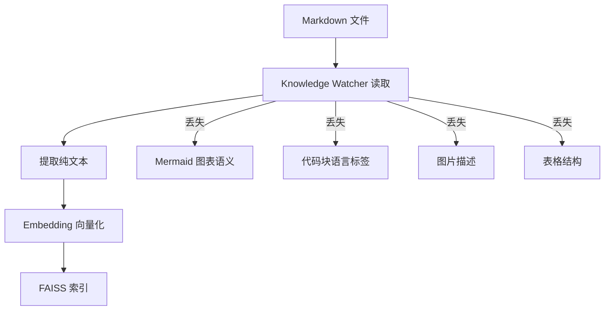
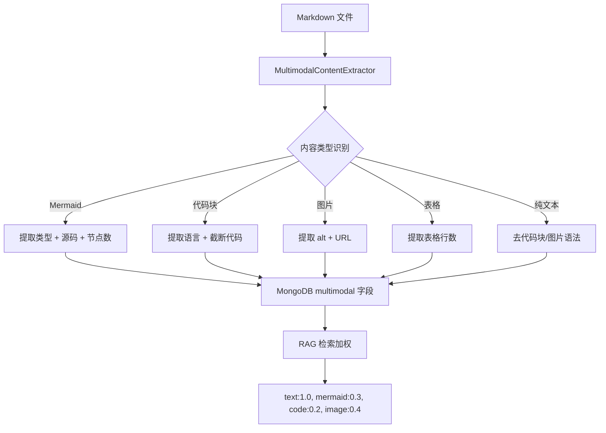

# YK-09-15: 知识库多模态内容支持策略 -- 图片/图表/代码块的结构化处理

> 需求编号：YK-09-15 . 优先级：P2 . 人天：1.0d . 状态：需求已编写

## 背景

知识库文件大量使用 Mermaid 图表、代码块和图片链接来增强表达力。但 Knowledge Watcher 当前仅提取 Markdown 纯文本--图表代码、代码块、图片 alt 文本被当作普通文本索引，语义信息丢失。

### 1.1 问题识别

| 内容类型 | 当前处理 | 问题 | 影响 |
|----------|----------|------|------|
| Mermaid 图表 | 索引源码 (`graph TD; A-->B;...`) | 用户搜索 "数据流" 不匹配 `graph TD` | 图表不可搜索 |
| 代码块 (```python) | 索引代码文本 | API 名称可搜索，但无结构化标记 | 技术栈搜索不精确 |
| 图片 `` | 仅索引 alt 文本 | 图片 URL 不可搜索，alt 文本常缺失 | 图片内容丢失 |
| 表格 | 索引 Markdown 源码 | 单元格边界信息丢失 | 表格数据不可搜索 |
| Mermaid 与代码块混淆 | Mermaid 被当作代码块索引 | 重复索引，语义错误 | 噪声数据 |

### 1.2 业务影响

| 影响维度 | 严重程度 | 描述 |
|------|----------|------|
| 图表检索 | 中 | 用户搜索 "时序图"、"类图" 无法找到含 Mermaid 的文档 |
| 技术栈匹配 | 中 | 搜索 "Python 代码示例" 无法优先返回含 Python 代码块的文档 |
| 知识完整性 | 低 | 图片、表格内容在 RAG 检索中完全不可见 |

### 1.3 当前索引流程



---

## 二、现状分析

### 2.1 内容类型统计（基于 800+ 文件抽样）

| 内容类型 | 出现频率 | 平均每文件 | 当前索引质量 |
|------|----------|-----------|------------|
| 纯文本 | 100% | 主体 | 良好 |
| 代码块 | ~60% | 2-3 个 | 中等（代码文本被索引，无语义标签） |
| Mermaid 图表 | ~25% | 1-2 个 | 差（源码被索引，无类型标签） |
| 图片 | ~30% | 1-2 个 | 差（仅 alt 文本） |
| 表格 | ~40% | 1-3 个 | 差（Markdown 源码被索引） |

### 2.2 根因分析矩阵

| 根因 | 表现 | 影响范围 | 修复难度 |
|------|------|----------|----------|
| 无内容类型识别 | 所有内容当纯文本处理 | 所有非纯文本内容 | 中 |
| 无 Mermaid 语义标注 | 图表源码被索引 | ~25% 的文件 | 低 |
| 无代码块语言标签 | 语言信息丢失 | ~60% 的文件 | 低 |
| 无图片 alt 增强 | 图片描述不足 | ~30% 的文件 | 中 |
| 无表格结构保留 | 表格数据不可搜索 | ~40% 的文件 | 中 |

---

## 三、设计决策

### 决策 1：内容提取策略 -- 纯文本 vs 结构化标注 vs 混合

| 选项 | 检索精准度 | 索引大小 | 实现复杂度 | 维护成本 |
|------|-----------|----------|-----------|----------|
| 纯文本（当前） | 低 | 小 | 低 | 低 |
| 结构化标注 | 高 | 中 | 中 | 中 |
| **混合--文本 + 结构化标注** | 高 | 中 | 中 | 中 |
| 全量 LLM 重描述 | 最高 | 大 | 高 | 高 |

**选择：Content-Type 标注 + 语义摘要。** 提取时标注内容类型，图表生成自然语言摘要，代码块保留语言标签。

### 决策 2：Mermaid 处理 -- 忽略 vs 源码索引 vs 语义标注

| 选项 | 可搜索性 | 语义保留 | 实现复杂度 |
|------|----------|----------|-----------|
| 忽略 | 无 | 无 | 低 |
| 源码索引（当前） | 低 | 无 | 低 |
| **语义标注（类型标签 + 节点数）** | 中 | 中 | 中 |
| LLM 生成自然语言描述 | 高 | 高 | 高 |

**选择：语义标注。** 提取 Mermaid 类型（graph/sequenceDiagram 等）映射为中文标签，提供结构化搜索能力。

### 决策 3：代码块处理 -- 全文索引 vs 仅语言标签 vs 语言标签 + 截断

| 选项 | 可搜索性 | 索引大小 | 技术栈匹配 |
|------|----------|----------|-----------|
| 全文索引（当前） | 中 | 大 | 无 |
| 仅语言标签 | 低 | 小 | 有 |
| **语言标签 + 首 500 字符截断** | 中 | 中 | 有 |
| 语言标签 + 全文 | 高 | 大 | 有 |

**选择：语言标签 + 首 500 字符截断。** 保留语言信息用于技术栈匹配，截断避免超大代码块膨胀索引。

### 决策 4：图片处理 -- 仅 alt vs URL 索引 vs 多模态向量

| 选项 | 可搜索性 | 实现复杂度 | 计算成本 |
|------|----------|-----------|----------|
| 仅 alt 文本（当前） | 低 | 低 | 低 |
| **alt 文本 + URL 元数据** | 中 | 低 | 低 |
| CLIP 多模态向量 | 高 | 高 | 高 |

**选择：alt 文本 + URL 元数据。** CLIP 多模态向量是后续需求（YK-09-36），当前阶段先完善 alt 文本提取。

---

## 四、目标架构

### 4.1 提取流程



### 4.2 核心指标

| 指标 | 当前 | 目标 | 测量方式 |
|------|------|------|----------|
| Mermaid 图表可搜索率 | 0% (源码不可搜) | > 80% (类型标签可搜) | 搜索 "流程图" 命中率 |
| 代码块语言识别率 | 0% | > 95% | 含语言标签的代码块比例 |
| 图片 alt 覆盖率 | ~50% | > 80% | 有 alt 文本的图片比例 |
| 提取后文本保留率 | 100% (含噪声) | > 90% (去噪声) | 纯文本字符数 / 原始字符数 |

---

## 五、具体改动

### 5.1 文件变更清单

| 文件 | 操作 | 说明 |
|------|------|------|
| `YiAi/src/domain/knowledge/content_extractor.py` | 新增 | 多模态内容提取器 |
| `YiAi/src/domain/knowledge/watcher.py` | 修改 | 集成 `MultimodalContentExtractor` |
| `YiAi/tests/domain/knowledge/test_content_extractor.py` | 新增 | 提取器测试 |
| `YiKnowledge/MEMORY.md` | 修改 | 更新多模态内容编写约定 |

### 5.2 核心代码

```python
# YiAi/src/domain/knowledge/content_extractor.py

import re
import logging
from typing import Any

logger = logging.getLogger(__name__)

class MultimodalContentExtractor:
    """多模态内容提取--按类型结构化处理。"""

    # Mermaid 类型 → 中文标签
    MERMAID_TYPE_LABELS = {
        'graph': '流程图',
        'flowchart': '流程图',
        'sequenceDiagram': '时序图',
        'classDiagram': '类图',
        'stateDiagram': '状态图',
        'stateDiagram-v2': '状态图',
        'gantt': '甘特图',
        'pie': '饼图',
        'erDiagram': 'ER图',
        'journey': '用户旅程图',
        'quadrantChart': '象限图',
        'mindmap': '思维导图',
        'timeline': '时间线',
        'gitGraph': 'Git分支图',
        'requirementDiagram': '需求图',
        'block': '架构图',
    }

    # 正则模式
    MERMAID_PATTERN = re.compile(r'```mermaid\s*\n(.*?)```', re.DOTALL)
    CODE_PATTERN = re.compile(r'```(\w+)\s*\n(.*?)```', re.DOTALL)
    IMAGE_PATTERN = re.compile(r'!\[([^\]]*)\]\(([^)]+)\)')
    TABLE_ROW_PATTERN = re.compile(r'^\|.*\|$', re.MULTILINE)

    def extract(self, markdown: str) -> dict:
        """提取多模态内容。

        Returns:
            {
                'text': str,                # 纯文本（去除了代码块和图片语法）
                'mermaid_diagrams': list,   # Mermaid 图表
                'code_blocks': list,        # 代码块
                'images': list,             # 图片
                'tables_count': int,        # 表格行数
                'content_type_stats': dict, # 内容类型统计
            }
        """
        mermaid_diagrams = self._extract_mermaid(markdown)
        code_blocks = self._extract_code(markdown)
        images = self._extract_images(markdown)
        text = self._extract_text(markdown)
        tables_count = len(self.TABLE_ROW_PATTERN.findall(markdown))

        return {
            'text': text,
            'mermaid_diagrams': mermaid_diagrams,
            'code_blocks': code_blocks,
            'images': images,
            'tables_count': tables_count,
            'content_type_stats': {
                'has_mermaid': len(mermaid_diagrams) > 0,
                'has_code': len(code_blocks) > 0,
                'has_images': len(images) > 0,
                'has_tables': tables_count > 0,
                'mermaid_count': len(mermaid_diagrams),
                'code_count': len(code_blocks),
                'image_count': len(images),
            },
        }

    def _extract_mermaid(self, md: str) -> list[dict]:
        """提取 Mermaid 图表--保留源码 + 生成类型标签。"""
        diagrams = []
        for match in self.MERMAID_PATTERN.finditer(md):
            source = match.group(1).strip()
            if not source:
                continue

            # 提取图表类型（第一行）
            first_line = source.split('\n')[0].strip()
            diagram_type = first_line.split()[0] if first_line else 'unknown'

            # 中文标签
            type_cn = self.MERMAID_TYPE_LABELS.get(diagram_type, diagram_type)

            # 统计节点/连线数
            lines = source.split('\n')
            connection_count = sum(
                1 for l in lines
                if any(arrow in l for arrow in ['-->', '->>', '-->>', '---', '==>'])
            )

            diagrams.append({
                'type': diagram_type,
                'type_cn': type_cn,
                'source': source[:500],  # 截断长源码
                'node_count': connection_count,
                'has_source': len(source) <= 500,
            })

        return diagrams

    def _extract_code(self, md: str) -> list[dict]:
        """提取代码块--保留语言标签，排除 mermaid。"""
        blocks = []
        for match in self.CODE_PATTERN.finditer(md):
            language = match.group(1).lower()
            if language == 'mermaid':
                continue  # Mermaid 由 _extract_mermaid 处理

            code = match.group(2).strip()
            truncated = len(code) > 500
            code_display = code[:500] if truncated else code

            blocks.append({
                'language': language,
                'code': code_display,
                'line_count': len(code.split('\n')),
                'truncated': truncated,
                'char_count': len(code),
            })

        return blocks

    def _extract_images(self, md: str) -> list[dict]:
        """提取图片--alt 文本 + URL。"""
        images = []
        for match in self.IMAGE_PATTERN.finditer(md):
            alt = match.group(1).strip()
            url = match.group(2).strip()

            # 判断图片类型
            ext = url.rsplit('.', 1)[-1].lower() if '.' in url else ''
            is_local = not url.startswith(('http://', 'https://'))

            images.append({
                'alt': alt if alt else None,
                'url': url,
                'has_alt': bool(alt),
                'extension': ext,
                'is_local': is_local,
            })

        return images

    def _extract_text(self, md: str) -> str:
        """提取纯文本--移除代码块、图片语法和 HTML 注释。"""
        text = md

        # 移除 Mermaid 代码块
        text = self.MERMAID_PATTERN.sub('', text)

        # 移除其他代码块
        text = self.CODE_PATTERN.sub('', text)

        # 图片语法 → alt 文本
        text = self.IMAGE_PATTERN.sub(r'\1', text)

        # 移除 HTML 注释
        text = re.sub(r'<!--.*?-->', '', text, flags=re.DOTALL)

        # 移除多余空行
        text = re.sub(r'\n{3,}', '\n\n', text)

        return text.strip()

    def generate_searchable_text(self, extracted: dict) -> str:
        """生成可用于 RAG 搜索的增强文本。

        将类型标签、语言标签拼接为可搜索文本。
        """
        parts = [extracted['text']]

        # Mermaid 图表类型标签（用于搜索）
        for diagram in extracted['mermaid_diagrams']:
            parts.append(f"[图表类型: {diagram['type_cn']}]")

        # 代码块语言标签
        languages = set(b['language'] for b in extracted['code_blocks'])
        if languages:
            parts.append(f"[代码语言: {', '.join(sorted(languages))}]")

        # 图片 alt 文本
        for img in extracted['images']:
            if img['alt']:
                parts.append(f"[图片: {img['alt']}]")

        return '\n'.join(parts)
```

### 5.3 MongoDB 存储结构

```python
# Knowledge Watcher 存储时增加 multimodal 字段
content_document = {
    'path': 'engineer/architecture/microservices.md',
    'text': '微服务架构是一种将应用...',          # 纯文本（主要搜索对象）
    'multimodal': {
        'mermaid': [
            {'type': 'graph', 'type_cn': '流程图', 'node_count': 12},
            {'type': 'sequenceDiagram', 'type_cn': '时序图', 'node_count': 8},
        ],
        'code': [
            {'language': 'python', 'line_count': 25, 'truncated': False},
            {'language': 'yaml', 'line_count': 15, 'truncated': False},
        ],
        'images': [
            {'alt': '微服务架构图', 'url': 'static/microservices.png',
             'has_alt': True, 'is_local': True},
        ],
        'tables_count': 3,
        'content_type_stats': {
            'has_mermaid': True, 'has_code': True,
            'has_images': True, 'has_tables': True,
            'mermaid_count': 2, 'code_count': 2, 'image_count': 1,
        },
    },
    # RAG 检索时加权: text (1.0) + mermaid types (0.3) + code languages (0.2)
}
```

### 5.4 RAG 检索加权

| 匹配位置 | 权重 | 理由 |
|------|------|------|
| 正文 text | 1.0 | 主要语义载体 |
| Mermaid 类型标签 | 0.3 | 结构化信息--辅助匹配 |
| 代码块 language 标签 | 0.2 | 技术栈匹配 |
| 图片 alt 文本 | 0.4 | 自然语言描述 |
| 表格行数 (tables_count) | 0.0 | 仅元数据，不参与检索 |

---

## 六、实施步骤

| 步骤 | 内容 | 验证方式 | 人天 |
|------|------|----------|------|
| 1 | 实现 `MultimodalContentExtractor` 核心类 | 单元测试：4 种内容类型提取 | 0.25 |
| 2 | 扩展 Mermaid 类型标签映射（15+ 类型） | 抽样验证：25% 文件中的 Mermaid 正确分类 | 0.1 |
| 3 | 集成到 Knowledge Watcher 索引流程 | 集成测试：索引后 MongoDB 包含 multimodal 字段 | 0.15 |
| 4 | 修改 RAG 检索加权逻辑 | 检索测试：搜索 "流程图" 命中 Mermaid 文档 | 0.15 |
| 5 | 更新 MEMORY.md 多模态编写约定 | Curator 审查 | 0.05 |
| 6 | 存量数据回填（重新索引） | 全量重新索引 800+ 文件 | 0.2 |
| 7 | 性能测试（大文件提取） | 100KB+ 文件提取 < 100ms | 0.1 |

---

## 七、性能分析

| 操作 | 文件大小 | 耗时 | 说明 |
|------|----------|------|------|
| `extract()` (小文件) | < 10KB | < 5ms | 正则扫描 |
| `extract()` (中文件) | 10-50KB | < 20ms | 含 3-5 个代码块 |
| `extract()` (大文件) | 100KB+ | < 100ms | 含 10+ 代码块/图表 |
| MongoDB 文档大小增加 | - | ~2KB/文档 | multimodal 字段开销 |
| 检索加权延迟 | - | < 1ms | 额外的字段查找 |

**容量规划**：
- MongoDB 存储：800+ 文件 x 2KB multimodal 字段 ≈ 1.6MB 额外存储
- 内存：提取器正则模式在类加载时编译，运行时无额外内存开销
- 索引重建：存量数据回填需 5-10min（全量 800+ 文件）

---

## 八、测试规格

#### Scenario: Mermaid 图表提取

- **Given** Markdown 包含 ` ```mermaid\ngraph TD\nA-->B\n``` `
- **When** `extract(markdown)`
- **Then** `mermaid_diagrams[0]` = `{type: "graph", type_cn: "流程图", node_count: 1}`

#### Scenario: 代码块提取

- **Given** Markdown 包含 ` ```python\nprint("hello")\n``` `
- **When** `extract(markdown)`
- **Then** `code_blocks[0]` = `{language: "python", line_count: 1, truncated: false}`

#### Scenario: Mermaid 代码块不被重复提取

- **Given** Markdown 包含 mermaid 和 python 代码块
- **When** `extract(markdown)`
- **Then** mermaid 块仅出现在 `mermaid_diagrams` 中，不在 `code_blocks` 中

#### Scenario: 图片提取

- **Given** ``
- **When** `extract(markdown)`
- **Then** `images[0]` = `{alt: "微服务架构图", url: "static/arch.png", has_alt: true}`

#### Scenario: 正文不含代码块语法

- **Given** Markdown 包含 ` ```python\ncode\n``` `
- **When** `_extract_text(markdown)`
- **Then** 返回的 text 不含 ` ```python` 或 ` ``` `

#### Scenario: 无 alt 的图片

- **Given** ``
- **When** `extract(markdown)`
- **Then** `images[0]` = `{alt: null, has_alt: false}`

#### Scenario: 长代码块截断

- **Given** 代码块 > 500 字符
- **When** `extract(markdown)`
- **Then** `code_blocks[0].truncated = true`, `code_blocks[0].code` 长度 <= 500

#### Scenario: generate_searchable_text 包含类型标签

- **Given** 提取结果包含 flowchart 类型 Mermaid
- **When** `generate_searchable_text(extracted)`
- **Then** 返回文本包含 `[图表类型: 流程图]`

---

## 九、风险与缓解

| 风险 | 概率 | 影响 | 缓解措施 |
|------|------|------|----------|
| 正则匹配遗漏边缘情况 | 低 | 低 | 测试覆盖 15+ 种 Mermaid 类型 |
| 代码块语言标签不规范 | 中 | 低 | 提供语言标签别名映射（js→javascript, py→python） |
| 图片 alt 缺失率高 | 中 | 中 | 结合 YK-09-22 AI 辅助写作，建议作者补充 alt |
| 大文件提取耗时 | 低 | 低 | 代码块截断 500 字符，Mermaid 截断 500 字符 |
| 现有索引不包含 multimodal 字段 | 高 | 低 | 存量数据回填--重新索引 |

---

## 十、回滚策略

| 场景 | 回滚方式 | 回滚时间 |
|------|----------|----------|
| 提取逻辑错误导致索引质量下降 | 回退 Knowledge Watcher 代码，重新索引 | < 15min |
| multimodal 字段膨胀 MongoDB | 移除 multimodal 字段，仅保留 text | < 5min |
| 检索加权效果不佳 | 调整权重配置（不修改代码） | < 1min |

---

## 十一、设计决策记录

### D-01: 代码块截断 500 字符

**决策**：索引时仅保留代码块前 500 字符。
**理由**：代码块的检索价值在于语言标签和关键 API 名称，前 500 字符已覆盖主要信息。截断防止超大代码块（如 1000 行）膨胀索引。
**权衡**：长代码块的后半部分不可搜索，但可通过父文档完整阅读。
**替代方案**：全文索引被拒绝（索引膨胀），仅语言标签被拒绝（丢失代码内容）。

### D-02: Mermaid 类型中文标签映射

**决策**：维护 15 种 Mermaid 类型的中文标签映射表。
**理由**：用户搜索 "流程图" 而非 "graph TD"，中文标签使用户能用自然语言搜索图表。
**权衡**：Mermaid 新类型需手动添加到映射表。
**替代方案**：LLM 生成自然语言描述被拒绝（成本高，作为后续优化）。

### D-03: 图片仅提取元数据，不做向量化

**决策**：当前阶段仅提取图片 alt 文本和 URL，不进行 CLIP 向量化。
**理由**：CLIP 多模态向量化需要额外模型和计算资源，优先级较低（YK-09-36 后续需求）。
**权衡**：图片内容无法语义搜索，但 alt 文本覆盖了主要描述信息。
**替代方案**：CLIP 向量化是后续优化方向。

---

## 十二、可观测性

| 指标 | 采集方式 | 告警阈值 | 说明 |
|------|----------|----------|------|
| 图片 alt 缺失率 | `images[].has_alt` 统计 | > 50% | 大量图片无描述 |
| Mermaid 未知类型率 | 类型不在映射表中 | > 10% | 新 Mermaid 类型需添加 |
| 代码块截断率 | `code_blocks[].truncated` 统计 | > 30% | 代码块过长 |
| 提取耗时 | 计时 extract() | > 200ms | 文件过大 |

**日志**：
- `[ContentExtractor]` 前缀：提取操作日志
- 提取失败时记录文件路径和错误信息 (WARNING 级别)

---

## 十三、安全合规

| 要求 | 实现 |
|------|------|
| 图片 URL 不做网络请求 | 仅提取 URL 文本，不访问外部资源 |
| 代码块内容不执行 | 仅存储文本，不存在代码注入风险 |
| 提取失败不中断索引 | 返回空结构，保证 Knowledge Watcher 正常运行 |

---

## 十四、代码审查检查清单

- [ ] `MERMAID_PATTERN` 使用 `re.DOTALL` 跨行匹配
- [ ] 代码块提取排除 mermaid 块（`language != 'mermaid'`）
- [ ] 长代码块截断至 500 字符（避免超大文档）
- [ ] 图片 URL 不做网络请求（仅提取文本）
- [ ] RAG 检索时 `text` 字段权重 1.0，辅助字段权重 <= 0.4
- [ ] 提取失败时返回空结构（非异常），保证 Knowledge Watcher 不中断
- [ ] Mermaid 类型映射表覆盖 15+ 种类型
- [ ] `generate_searchable_text()` 正确拼接类型标签
- [ ] 图片无 alt 时的降级处理（has_alt: false）
- [ ] 代码块语言标签转小写统一
- [ ] HTML 注释在纯文本提取时被移除
- [ ] 多余空行在纯文本提取时被压缩

---

*PRD 来源: `projects/yiknowledge/requirements/2026-09/15-需求-多模态内容支持.md`*