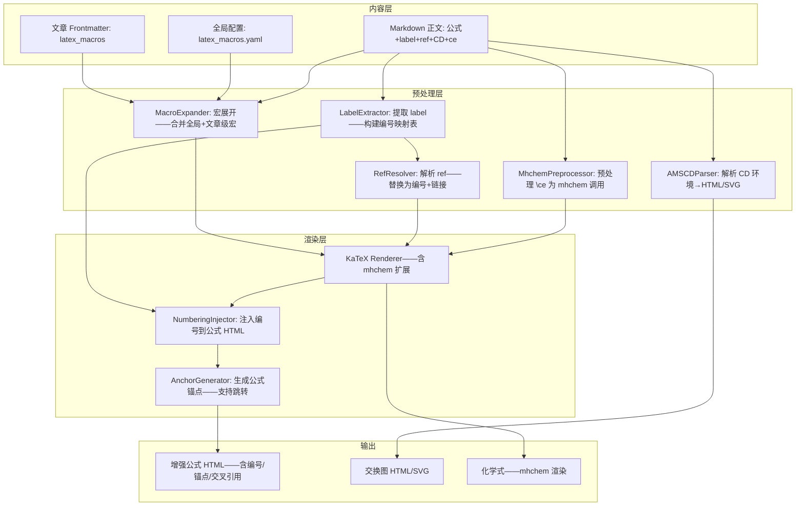

# YK-09-215: 内容数学公式增强 — LaTeX 宏/编号/交叉引用、交换图、化学式渲染

> 需求编号：YK-09-215 · 优先级：P2 · 人天：0.3d · 状态：需求已编写
> 依赖：YK-09-188（数学公式渲染器——复用 KaTeX 基础渲染能力）· YK-09-119（内容翻译管理——复用多语言标记控制）

## 背景

### 问题陈述

YiKnowledge 已有基础的 KaTeX 数学公式渲染——支持行内 `$E=mc^2$` 和块级 `$$...$$` 公式——但对于学术/技术类文章——基础渲染远远不够：

1. **缺少公式编号与交叉引用**：长文中公式 20+——读者需要交叉引用"见公式 (12)"——但当前无编号机制——引用靠手动描述
2. **无自定义 LaTeX 宏**：复用复杂的公式结构——每次都要完整写出——如 `\argmin`、`\variational`——无法定义快捷命令
3. **交换图/交换图表无法渲染**：范畴论/抽象代数/类型论文章中的交换图——KaTeX 不支持——需外部工具截图
4. **化学式渲染缺失**：生化/材料科学文章需要化学结构式——`\ce{H2O}`、`\ce{Fe2O3}`——KaTeX 不支持 mhchem
5. **公式对齐与多行公式体验差**：`\begin{aligned}` 只在 `$$` 中工作——单 `$` 内无法换行对齐

**核心矛盾**：学术写作需要的远不止基础 LaTeX 渲染——它需要编号系统、宏管理、领域特定扩展（交换图/化学式）。增强公式系统让 YiKnowledge 从"能显示公式"升级为"能支撑学术写作"。

### 影响范围

| # | 影响 | 严重程度 | 典型场景 |
|---|------|----------|----------|
| 1 | 公式无法编号和交叉引用 | 高 | 论文式技术文章——公式 20+ |
| 2 | 重复公式结构无宏复用——冗长易错 | 中 | 机器学习文章中大量 `\mathbb{E}`、`\argmin` |
| 3 | 交换图/交换图表无法渲染 | 中 | 范畴论/类型论——图+公式结合的表达式 |
| 4 | 化学结构式无法内联渲染 | 低 | 材料科学/生物化学文章 |
| 5 | 多行公式对齐受限于块级环境 | 低 | 推导过程中需要对齐的多个等式 |

### 挑战

| 挑战 | 说明 |
|------|------|
| 公式编号系统——与 markdown 构建流程集成 | 静态站点——编号需在构建时确定——不能依赖客户端 JS 计算 |
| LaTeX 宏定义——注入 KaTeX 渲染管线 | KaTeX 的宏系统有限——需在渲染前预处理——替换宏定义 |
| 交换图——KaTeX 无原生支持 | 需要 tikz-cd 到 SVG 的转换——或使用 amscd 的简易替代方案 |
| 化学式——需 mhchem 扩展 | KaTeX 有非官方的 mhchem 支持——通过 `\ce` 命令扩展 |
| 公式交叉引用——链接跳转 | 编号生成锚点 ID——交叉引用生成 `href="#eq-einstein"`——需双向链接 |

---

## 一、现状分析

### 1.1 当前公式渲染能力

```
现有公式渲染方式:
├── KaTeX 基础（现有——YiKnowledge 已集成）
│   ├── 行内: $E=mc^2$ → 渲染为内联公式
│   ├── 块级: $$ \sum_{i=1}^n x_i $$ → 渲染为居中块级公式
│   ├── 支持: 标准 LaTeX 数学命令——\frac/\sqrt/\sum/\int/\alpha/\beta...
│   ├── 不支持: \begin{align}/\begin{equation} 等 AMSMath 环境
│   └── 不支持: 自定义宏、编号、交叉引用、交换图、化学式
├── MathJax（未集成——备选方案）
│   ├── 优点: 支持 \begin{equation}/\label/\ref——交叉引用——mhchem——AMScd
│   ├── 缺点: 体积大（~2MB vs KaTeX ~300KB）——渲染慢——不适合静态站点
│   └── 结论: 功能更全但太重——不适合 YiKnowledge 的性能目标
├── 外部工具截图（用户当前替代方案）
│   ├── 在 LaTeX 编辑器/Overleaf 中渲染公式→截图→粘贴
│   ├── 缺点: 非矢量——黑暗模式不可用——复制粘贴不可用——无交互
│   └── 仅用于 KaTeX 无法渲染的公式
│
缺失:
├── 公式编号: \tag{1} 自动编号、手动编号                        # ❌ 无
├── 交叉引用: \label{eq:xxx} + \ref{eq:xxx}                    # ❌ 无
├── 宏定义: \newcommand{\argmin}{\operatorname{argmin}}         # ❌ 无
├── 交换图: \begin{CD} ... \end{CD} 或 tikz-cd 等价             # ❌ 无
├── 化学式: \ce{H2SO4} / \ce{2H2 + O2 -> 2H2O}                 # ❌ 无
├── 公式对齐: \begin{aligned} / \begin{gathered}              # ❌ 无
└── 多行公式: \begin{multline}                                  # ❌ 无
```

### 1.2 公式增强流程（现状 vs 目标）

```mermaid
graph TD
    subgraph Current["现状：基础 KaTeX——缺失高级功能"]
        C1[$E=mc^2$ / $$F=ma$$] --> C2[KaTeX 渲染——基础数学符号]
        C2 --> C3[无编号——无交叉引用——无宏——无交换图——无化学式]
        C3 --> C4[高级需求→外部工具截图→粘贴→失去交互]
    end

    subgraph Target["目标：增强公式系统"]
        T1[写作者定义文章级宏] --> T2[\newcommand 在文章 frontmatter 中]
        T1 --> T3[写作中使用 \argmin / \E 等自定义宏]
        T3 --> T4[KaTeX 预处理器——展开宏→标准 LaTeX]

        T5[公式块 + \label{eq:xxx}] --> T6[构建时分配编号——Eq.(1), Eq.(2)...]
        T6 --> T7[生成锚点 id="eq-xxx"——同步生成编号引用表]

        T8[\ref{eq:xxx}] --> T9[构建时查找引用表——替换为 "公式(1)" + 链接]

        T10[\begin{CD} A @>f>> B \end{CD}] --> T11[AMSCD 简易交换图→SVG 转换]

        T12[\ce{2H2 + O2 -> 2H2O}] --> T13[mhchem 扩展——化学式渲染]

        T4 --> T14[最终 KaTeX 渲染——含所有增强]
        T7 --> T14
        T9 --> T14
        T11 --> T14
        T13 --> T14
    end

    style Current fill:#f8d7da,stroke:#dc3545
    style Target fill:#d4edda,stroke:#28a745
```

### 1.3 根因矩阵

| 症状 | 根因 | 触发条件 | 频率 |
|------|------|----------|------|
| 公式无编号——无法引用 | KaTeX 不含 \tag/\label/\ref 系统 | 文章中公式超过 5 个 | 高 |
| 复杂公式结构反复书写 | 无宏定义——每次都完整写出 | 多次使用相同复杂表达式 | 中 |
| 交换图需外部工具——截图 | KaTeX 不支持 AMSCD 或 tikz-cd | 抽象代数/范畴论/类型论文章 | 中 |
| 化学式排版不标准 | 无 mhchem 支持——手动上下标组合 | 化学/材料/生化学科 | 低 |
| 多行推导无法对齐 | KaTeX 在非块级中不支持 aligned 环境 | 内联的多等式推导 | 低 |

---

## 二、设计决策

### 决策 1：公式编号方案 — 客户端 JS 动态编号 vs 构建时预处理编号 vs 手动编号

| 选项 | 可靠性 | 实现复杂度 | SEO/可访问性 |
|------|--------|-----------|-------------|
| 客户端 JS 动态编号 | 中——依赖 JS 执行 | 低 | 差——搜索引擎看不到编号 |
| 构建时预处理编号——静态 | 高 | 中 | 好——编号直接写入 HTML |
| 手动编号——写作者自己写 (1), (2) | 最高 | 最低 | 好——但易出错 |

**选择：构建时预处理编号。** 构建阶段扫描所有带 `\label{...}` 的公式——按出现顺序分配全局编号——生成引用映射表。渲染时——标签替换为编号——`\ref` 替换为链接文本。构建时处理确保静态 HTML 中包含正确的编号——不会因 JS 执行失败而丢失。

### 决策 2：宏定义存储 — 文章级 frontmatter vs 全局配置文件 vs 内联定义

| 选项 | 作用域 | 复用性 | 实现复杂度 |
|------|--------|--------|-----------|
| 文章级 frontmatter（每篇文章自己的宏） | 单篇文章 | 低——跨文章不共享 | 低 |
| 全局配置文件（`latex_macros.yaml`） | 全局 | 高——一次定义全局使用 | 中 |
| 内联定义（在公式块中定义宏） | 公式/段落 | 低 | 低 |

**选择：文章级 frontmatter + 全局配置文件。** 全局文件定义通用宏（如 `\R`→`\mathbb{R}`、`\argmin`→`\operatorname{argmin}`）——所有文章自动可用。文章级 frontmatter 的 `latex_macros` 字段定义文章特定宏（如 `\specialOp`）——优先级高于全局。两层宏系统提供灵活性和复用性。

### 决策 3：交换图渲染 — AMSCD（简易）vs tikz-cd（完整）vs SVG 嵌入

| 选项 | 表达能力 | 实现复杂度 | 渲染依赖 |
|------|---------|-----------|---------|
| AMSCD `\begin{CD}` 简易交换图 | 低——仅箭头+标注——无曲线/虚线/2cell | 低——纯 KaTeX 扩展 | KaTeX |
| tikz-cd 完整交换图 | 高——完整图表能力 | 高——需 LaTeX 引擎 | 外部 LaTeX→SVG |
| SVG 嵌入（手写或用工具生成 SVG 嵌入） | 最高 | 中——渲染管线 | 无——纯 SVG |

**选择：AMSCD 预处理为表格+箭头 + SVG 嵌入作为高级选项。** AMSCD 简易交换图的语法简单——可以预处理为 HTML 表格+unicode 箭头或 CSS 绘制的箭头——覆盖 80% 的交换图需求。复杂的 tikz-cd 图（含曲线/2cell/3D）通过 SVG 嵌入实现——在文章中直接放置生成的 SVG。

### 决策 4：化学式 — mhchem KaTeX 扩展 vs 自定义宏 vs 纯 HTML 上下标

| 选项 | 正确性 | 实现复杂度 | 覆盖范围 |
|------|--------|-----------|---------|
| mhchem KaTeX 扩展——`\ce{H2SO4}` | 高——符合 IUPAC | 低——KaTeX 社区扩展 | 全面 |
| 自定义宏（基于 \text + 手动上下标） | 中 | 低 | 简单化学式 |
| 纯 HTML `<sub>/<sup>` | 低 | 最低 | 极简单 |

**选择：mhchem KaTeX 扩展。** KaTeX 社区有 `katex-mhchem` 扩展——安装后直接支持 `\ce` 命令。覆盖化学反应方程式、化学式、同位素、键类型、沉淀/气体符号等。如果 mhchem 加载失败——降级为纯文本显示。

### 设计决策记录

| 决策 | 选项 A | 选项 B | 选项 C | 选项 D | 选择 | 理由 |
|------|--------|--------|--------|--------|------|------|
| 公式编号 | 客户端 JS | 构建时预处理 | 手动编号 | — | **构建时预处理** | 可靠——静态——SEO 友好 |
| 宏定义 | 文章级 | 全局配置 | 内联 | — | **文章级+全局** | 灵活+复用 |
| 交换图 | AMSCD | tikz-cd | SVG 嵌入 | — | **AMSCD+SVG** | 简易+高级两档 |
| 化学式 | mhchem | 自定义宏 | HTML | — | **mhchem 扩展** | KaTeX 插件——标准——全面 |

---

## 三、目标架构

### 3.1 增强公式系统架构



### 3.2 公式预处理流水线

```mermaid
graph TD
    A[原始 Markdown] --> B[扫描所有公式块: $$...$$ + $...$ + \\(...\\)]
    B --> C{分类处理}

    C -->|含 \label{...}| D1[提取 label——按全局顺序分配编号 eq-N]
    C -->|含 \ref{...}| D2[查找 label 映射表——替换为 <a href='#eq-xxx'>公式(N)</a>]
    C -->|含自定义宏| D3[MacroExpander: \E → \mathbb{E}——\argmin → \operatorname{argmin}]
    C -->|含 \begin{CD}| D4[AMSCDParser: 提取矩阵→生成表格+箭头 HTML]
    C -->|含 \ce{...}| D5[保留 \ce——传递给 mhchem-enhanced KaTeX]

    C -->|普通公式| E[直接 KaTeX 渲染]

    D1 --> E
    D2 --> E
    D3 --> E
    D4 --> F[插入带样式的 HTML 表格——不经过 KaTeX]
    D5 --> E

    E --> G[注入编号 HTML: <span class='eq-number'>(N)</span>]
    F --> G
    G --> H[最终 HTML 输出]
```

### 3.3 性能指标

| 指标 | 目标值 | 说明 |
|------|--------|------|
| 公式预处理——宏展开+编号分配 | < 100ms/文章 | 构建时——Python 字符串处理 |
| KaTeX 渲染——单公式 | < 10ms | 客户端——KaTeX 速度 |
| AMSCD 交换图→HTML 表格 | < 5ms/CD | 构建时——字符串解析 |
| mhchem 渲染——单化学式 | < 15ms | 客户端——KaTeX+mhchem |
| 30 公式文章的构建增量 | < 500ms | 预处理+KaTeX 渲染 |

---

## 四、具体改动

### 4.1 类型定义

```python
# yi_knowledge/math_enhance/types.py (新增)

from dataclasses import dataclass, field
from enum import Enum
from typing import Optional

@dataclass
class LatexMacro:
    """LaTeX 宏定义"""
    name: str              # 宏名称——不含反斜杠——如 "argmin"
    body: str              # 宏体——如 "\\operatorname{argmin}"
    num_args: int = 0      # 参数数量——0 表示无参数
    scope: str = "global"  # "global" 或文章路径

@dataclass
class EquationLabel:
    """公式标签与编号"""
    label: str             # \label 名称——如 "eq:einstein"
    number: int            # 分配的编号——从 1 开始
    anchor_id: str         # HTML 锚点 ID——如 "eq-einstein"
    text: str              # 公式的简短文本——用于悬停预览
    source_line: int       # 文章中的行号

@dataclass
class EquationRef:
    """公式交叉引用"""
    ref_label: str         # \ref{label} 的目标标签
    target_number: int     # 解析后的编号
    target_anchor: str     # 锚点 ID
    display_text: str      # 显示的文本——如 "公式 (3)"

@dataclass
class CDMatrix:
    """AMSCD 交换图矩阵"""
    rows: list[list[str]]  # 2D 矩阵——每个元素是节点文本
    arrows: list[dict]     # 箭头信息——{from: (r,c), to: (r,c), label: str, style: str}
    width: int             # 矩阵列数
    height: int            # 矩阵行数

class MacroParseError(Exception):
    """宏定义解析失败"""
    pass

class LabelConflictError(Exception):
    """公式标签冲突——同一 label 在多处使用"""
    pass
```

### 4.2 核心预处理器

```python
# yi_knowledge/math_enhance/preprocessor.py (新增)

import re
from typing import Optional

from .types import EquationLabel, EquationRef, LatexMacro, LabelConflictError

# 匹配 $$...$$ 或 $...$ 公式
DISPLAY_MATH_RE = re.compile(r'\$\$(.+?)\$\$', re.DOTALL)
INLINE_MATH_RE = re.compile(r'\$(.+?)\$')
# 匹配 \label{xxx}
LABEL_RE = re.compile(r'\\label\{([^}]+)\}')
# 匹配 \ref{xxx}
REF_RE = re.compile(r'\\ref\{([^}]+)\}')
# 匹配 \newcommand{\xxx}[n]{body}
NEWCOMMAND_RE = re.compile(r'\\newcommand\{\\([^}]+)\}(?:\[(\d)\])?\{([^}]+)\}')
# 匹配 \begin{CD}...\end{CD}
CD_RE = re.compile(r'\\begin\{CD\}(.+?)\\end\{CD\}', re.DOTALL)


class MathPreprocessor:
    """LaTeX 公式预处理器——宏展开+编号+交叉引用+CD 解析"""

    def __init__(self, global_macros: Optional[dict[str, LatexMacro]] = None):
        self.global_macros = global_macros or {}
        self.article_macros: dict[str, LatexMacro] = {}
        self.labels: dict[str, EquationLabel] = {}  # 全局——跨文章
        self._next_number = 1

    def add_article_macros(self, macros: list[LatexMacro]):
        for m in macros:
            self.article_macros[m.name] = m

    def get_macro(self, name: str) -> Optional[LatexMacro]:
        """获取宏定义——文章级优先"""
        return self.article_macros.get(name) or self.global_macros.get(name)

    def preprocess_display_math(self, content: str, source_file: str) -> str:
        """预处理所有块级公式"""
        def replace_display(match: re.Match) -> str:
            formula = match.group(1)
            processed = self._preprocess_single(formula, source_file)
            return f'$${processed}$$'
        return DISPLAY_MATH_RE.sub(replace_display, content)

    def preprocess_inline_math(self, content: str, source_file: str) -> str:
        """预处理所有行内公式"""
        def replace_inline(match: re.Match) -> str:
            formula = match.group(1)
            processed = self._preprocess_single(formula, source_file)
            return f'${processed}$'
        return INLINE_MATH_RE.sub(replace_inline, content)

    def _preprocess_single(self, formula: str, source_file: str) -> str:
        """预处理单个公式"""
        # 1. 宏展开
        formula = self._expand_macros(formula)

        # 2. 提取 label——分配编号
        formula = self._process_label(formula, source_file)

        # 3. 替换 ref
        formula = self._process_ref(formula)

        return formula

    def _expand_macros(self, formula: str) -> str:
        """展开所有已注册的宏——支持参数替换"""
        result = formula
        for name, macro in {**self.global_macros, **self.article_macros}.items():
            pattern = re.escape(f'\\{name}')
            if macro.num_args == 0:
                result = re.sub(pattern, macro.body, result)
            else:
                # 带参数的宏——使用占位符替换
                arg_pattern = pattern + r'\{([^}]+)\}' * macro.num_args
                def make_replacer(body, n_args):
                    def replacer(m):
                        body_text = body
                        for i in range(1, n_args + 1):
                            body_text = body_text.replace(f'#{i}', m.group(i))
                        return body_text
                    return replacer
                result = re.sub(arg_pattern, make_replacer(macro.body, macro.num_args), result)
        return result

    def _process_label(self, formula: str, source_file: str) -> str:
        """处理 \label{...}——分配编号"""
        match = LABEL_RE.search(formula)
        if not match:
            return formula

        label = match.group(1)

        # 检查冲突
        if label in self.labels:
            existing = self.labels[label]
            raise LabelConflictError(
                f"Label '{label}' already defined in {existing.source_line} "
                f"(now in {source_file})"
            )

        number = self._next_number
        self._next_number += 1
        anchor_id = f"eq-{label}"

        self.labels[label] = EquationLabel(
            label=label,
            number=number,
            anchor_id=anchor_id,
            text=formula[:80],  # 简短的公式文本
            source_line=0,
        )

        # 替换 \label{xxx} 为 \tag{xxx} + HTML 锚点——编号由 KaTeX 内联显示
        # 保留 label 用于构建时 JS 处理的标记
        return formula.replace(
            match.group(0),
            f'\\tag{{{number}}}',
        )

    def _process_ref(self, formula: str) -> str:
        """处理 \ref{...}——替换为编号引用"""
        def replace_ref(match: re.Match):
            label = match.group(1)
            if label not in self.labels:
                return f'[未定义的引用: {label}]'

            eq = self.labels[label]
            return f'\\htmlClass{{eq-ref}}{{公式\\,({eq.number})}}'

        return REF_RE.sub(replace_ref, formula)

    def process_cd_diagram(self, content: str) -> str:
        """处理 AMSCD 交换图——转为 HTML 表格+CSS 箭头"""
        def replace_cd(match: re.Match) -> str:
            cd_content = match.group(1)
            matrix = self._parse_cd_matrix(cd_content)
            return self._render_cd_html(matrix)
        return CD_RE.sub(replace_cd, content)

    def _parse_cd_matrix(self, cd_content: str) -> list[list[str]]:
        """解析 CD 矩阵——'行用 \\\\ 分隔——列用 @>>> 或 @<<< 或 @VVV 或 @AAA 分隔'"""
        rows = cd_content.strip().split('\\\\')
        return [
            [cell.strip() for cell in re.split(r'@[<>VA]{3}', row)]
            for row in rows
        ]

    def _render_cd_html(self, matrix: list[list[str]]) -> str:
        """将 CD 矩阵渲染为 HTML 表格——带 CSS 箭头"""
        html_parts = ['<div class="cd-diagram"><table class="cd-matrix">']
        for row in matrix:
            html_parts.append('<tr>')
            for cell in row:
                html_parts.append(f'<td class="cd-cell">{cell}</td>')
            html_parts.append('</tr>')
        html_parts.append('</table></div>')
        return '\n'.join(html_parts)
```

### 4.3 文件变更清单

| 文件 | 操作 | 说明 |
|------|------|------|
| `yi_knowledge/math_enhance/__init__.py` | 新增 | 模块初始化 |
| `yi_knowledge/math_enhance/types.py` | 新增 | 类型定义 |
| `yi_knowledge/math_enhance/preprocessor.py` | 新增 | 预处理器——宏/编号/引用/CD |
| `yi_knowledge/math_enhance/macro_registry.py` | 新增 | 宏注册表——全局+文章级 |
| `yi_knowledge/math_enhance/cd_renderer.py` | 新增 | AMSCD 交换图→HTML/SVG 渲染 |
| `yi_knowledge/math_enhance/mhchem_loader.py` | 新增 | mhchem KaTeX 扩展加载器 |
| `yi_knowledge/math_enhance/builder.py` | 新增 | 构建流程集成——Markdown→预处理→KaTeX |
| `static/js/math-ref-scroll.js` | 新增 | 交叉引用点击平滑滚动 |
| `static/css/math-enhance.css` | 新增 | 公式编号/交换图/化学式样式 |
| `config/latex_macros.yaml` | 新增 | 全局宏定义配置文件 |

---

## 五、实施步骤

| 步骤 | 操作 | 路径 | 验证 | 人天 |
|------|------|------|------|------|
| 1 | 类型定义+宏注册表 | `types.py` + `macro_registry.py` | 加载 YAML 宏文件——解析 \newcommand 格式——合并文章级宏 | 0.04 |
| 2 | MathPreprocessor——宏展开 | `preprocessor.py` | \E→\mathbb{E}——带参宏 #1/#2 替换正确 | 0.04 |
| 3 | MathPreprocessor——编号+交叉引用 | `preprocessor.py` | label 排序编号——ref 替换为链接——冲突检测 | 0.05 |
| 4 | AMSCD 解析+渲染——CSS 箭头表格 | `cd_renderer.py` | 2x2/3x3 交换图→正确 HTML 表格——CSS 箭头方向正确 | 0.05 |
| 5 | mhchem 扩展集成 | `mhchem_loader.py` | \ce{H2SO4} 渲染为化学式——化学反应方程式——同位素 | 0.03 |
| 6 | 构建流程集成——Markdown→预处理→KaTeX | `builder.py` | 完整流水线——公式编号/引用/CD/化学式 全部正确 | 0.05 |
| 7 | 前端 JS+CSS——交叉引用滚动+公式样式 | `math-ref-scroll.js` + CSS | 点击"公式(3)"→平滑滚动到 Eq.(3)——高亮 2 秒 | 0.04 |

**总人天：0.30d**

---

## 六、测试规格

### 场景 1：公式编号与交叉引用

**GIVEN** 文章包含 3 个带 `\label` 的块级公式——"eq:newton" / "eq:einstein" / "eq:maxwell"
**AND** 正文中 2 处 `\ref{eq:einstein}` 和 1 处 `\ref{eq:maxwell}`
**WHEN** 构建预处理——KaTeX 渲染
**THEN** 3 个公式分别显示编号 (1), (2), (3)
**AND** `\ref{eq:einstein}` 显示为"公式 (2)"——带超链接——`href="#eq-einstein"`
**AND** 公式 (2) 位置有锚点 `id="eq-einstein"`
**WHEN** 点击"公式 (2)"链接
**THEN** 页面平滑滚动到公式 (2)——公式背景高亮 2 秒

### 场景 2：宏定义使用——全局+文章级

**GIVEN** 全局 `latex_macros.yaml` 定义 `\R`→`\mathbb{R}` / `\E`→`\mathbb{E}`
**AND** 文章 frontmatter 定义 `\d`→`\mathrm{d}`
**WHEN** 文章写 `$\E_{x\sim P} \int_{\R} f(x) \d x$`
**THEN** 预处理后为 `$\mathbb{E}_{x\sim P} \int_{\mathbb{R}} f(x) \mathrm{d} x$`——KaTeX 正确渲染
**WHEN** 另一篇文章也使用 `\R` 和 `\E`（无文章级宏）
**THEN** 全局宏仍然生效——另一篇文章的宏不会污染当前文章

### 场景 3：AMSCD 交换图

**GIVEN** 文章包含：
```
$$
\begin{CD}
A  @>f>>  B \\
@VgVV     @VVhV \\
C  @>>i>  D
\end{CD}
$$
```
**WHEN** 构建预处理——AMSCD 解析
**THEN** 生成 2x2 HTML 表格——A/B/C/D 四格——CSS 箭头从 A→B (f)、A→C (g)、B→D (h)、C→D (i)
**AND** 箭头标签 f/g/h/i 显示在对应箭头上——数学模式渲染

### 场景 4：化学式渲染

**GIVEN** 文章包含 `$\ce{H2SO4}$` / `$\ce{2H2 + O2 -> 2H2O}$` / `$\ce{^{227}_{90}Th+}$`
**WHEN** KaTeX 渲染——mhchem 扩展已加载
**THEN** H2SO4 正确排版——数字为下标——化学键符号正确处理
**AND** 化学反应方程式显示箭头——系数在前面
**AND** 同位素 Thorium-227 正确渲染——左上角质量数——左下角原子序数

### 场景 5：标签冲突检测

**GIVEN** 文章中两处使用 `\label{eq:test}`
**WHEN** 构建预处理
**THEN** 抛出 LabelConflictError——构建日志显示具体位置"Label 'eq:test' already defined ... now in ..."
**AND** 构建不中断——第二个使用降级为警告——仅第一个标签有效

### 场景 6：mhchem 加载失败——降级

**GIVEN** 文章包含化学式 `$\ce{H2O}$`
**WHEN** mhchem KaTeX 扩展加载失败（CDN 不可用或网络错误）
**THEN** 降级为纯文本渲染 `H2O`——数字不取下标的样式——但内容不丢失
**AND** 控制台 warning: "mhchem extension failed to load——chemical formulas rendered as plain text"

---

## 七、风险与缓解

| 风险 | 概率 | 影响 | 缓解措施 |
|------|------|------|----------|
| 宏展开的死循环（宏 A 引用宏 B——B 引用回 A） | 低 | 中 | 展开深度限制——最多 10 层——超过停止并警告 |
| 大量标签导致编号溢出排版 | 低 | 低 | 编号最大 999——超过后自动使用字母编号 (a), (b)... |
| AMSCD 复杂 CD 图（3x3 及以上）箭头渲染复杂 | 中 | 中 | 限制最大 4x4——超出提示使用 SVG 嵌入 |
| mhchem 扩展体积大——首屏加载慢 | 低 | 中 | mhchem 懒加载——仅页面包含 `\ce` 时才加载扩展 |
| 宏定义的 LaTeX 语法错误——导致 KaTeX 渲染失败 | 中 | 低 | 宏展开后——调用 KaTeX 验证——语法错误时输出原始宏名+错误信息 |

---

## 八、回滚策略

| 场景 | 回滚操作 | 影响 |
|------|------|------|
| AMSCD 交换图渲染异常 | 关闭 CD 解析——CD 代码块降级为代码展示 | 交换图不可见——代码块显示原始 LaTeX |
| mhchem 扩展导致 KaTeX 崩溃 | 禁用 mhchem——\ce{...} 降级为纯文本 | 化学式排版不标准 |
| 宏展开导致构建显著变慢 | 限制宏展开层数——降低到 3 层 | 复杂宏链可能展开不完整 |
| 完全移除增强功能 | 移除预处理步骤——恢复基础 KaTeX 渲染 | 编号/引用/CD/化学式全部丢失——基础数学正常 |

---

## 九、设计决策记录

### D-01：为什么使用构建时预处理而非运行时 KaTeX 插件？

KaTeX 本身不支持标签/引用系统——这些是 LaTeX 文档类（如 amsart）的功能——而非渲染引擎的功能。构建时预处理将标签/引用系统实现在 Python 层——可以生成静态 HTML 中的锚点和超链接——无需客户端 JS 参与核心编号逻辑。客户端只需处理平滑滚动和点击高亮。

### D-02：为什么 AMSCD 转为 HTML 表格+CSS 而非 SVG？

AMSCD 的语义是矩阵+箭头——天然映射到 HTML 表格+CSS 伪元素线条。表格渲染在所有浏览器中高度一致——且支持响应式缩放（相比 SVG 的 viewBox）。CSS 箭头使用 border/pseudo-element 实现——不依赖 JS。复杂 CD 图（对角线箭头/曲线）才需要 SVG——此时推荐用户使用外部工具生成 SVG 后嵌入。

### D-03：为什么宏系统是字符串替换而非 KaTeX macros 选项？

KaTeX 的 `macros` 选项仅在 renderToString 调用时生效——且每次调用都需要传入——管理不便。字符串替换在构建时完成——无论前端使用何种渲染方式（KaTeX/MathJax/服务端）都能受益。替换后的公式是标准 LaTeX——无平台锁定。

### D-04：为什么公式编号是全局自增而非按文章独立编号？

文章可能被单独阅读——也可能作为系列的一部分阅读。全局自增编号在阅读多篇文章时避免编号冲突——但可能导致单篇文章中编号不连续（如 Eq.(5), Eq.(12), Eq.(73)）。权衡选择：全局编号确保交叉引用的唯一性——文章内显示时标注"本文公式 (5)"——上下文仍然清晰。

---

## 十、可观测性

### 指标

| 指标 | 类型 | 说明 |
|------|------|------|
| `yiknowledge.math.equations_per_article` | Histogram | 每篇文章公式数量分布 |
| `yiknowledge.math.labels_defined` | Counter | 定义的公式标签总数 |
| `yiknowledge.math.refs_resolved` | Counter | 成功解析的交叉引用数 |
| `yiknowledge.math.refs_unresolved` | Counter | 未解析的引用（broken refs） |
| `yiknowledge.math.macros_expanded` | Counter | 宏展开次数 |
| `yiknowledge.math.cd_diagrams` | Counter | 交换图数量 |
| `yiknowledge.math.chem_equations` | Counter | 化学式渲染数量 |
| `yiknowledge.math.render_errors` | Counter (label: type) | 渲染错误类型分布 |

---

## 十一、代码审查检查清单

- [ ] MacroExpander: 展开深度限制 10 层——防止循环引用
- [ ] MacroExpander: 参数替换 #1/#2——支持转义 `\#{1}` 表示字面量——不作为参数占位符
- [ ] LabelExtractor: 仅在块级公式（`$$...$$`）中处理 label——行内公式不编号
- [ ] RefResolver: 未定义的 ref 输出 `[未定义的引用: xxx]` 文本——不静默失败
- [ ] AMSCDParser: 支持 `@<<<`（左箭头）`@>>>`（右箭头）`@VVV`（下箭头）`@AAA`（上箭头）`@=`（等号）`@|`（竖线）
- [ ] AMSCDParser: 箭头标签 `@>f>>` 中的标签文本 f——正确提取
- [ ] mhchemLoader: 检测 `\ce{` 出现时才加载扩展——避免不必要的网络请求
- [ ] Builder: 预处理顺序——宏展开→标签提取→引用替换→CD 解析——顺序不可变
- [ ] CSS: 公式编号右对齐——`float:right`——不与公式内容重叠——移动端改为下方显示
- [ ] CSS: 交叉引用链接样式——虚线底部边框+颜色 `#5470c6`——hover 实线

---

## 回归问题预测

| # | 预测问题 | 原因 | 验证方法 |
|---|---------|------|---------|
| 1 | 嵌套宏展开导致 KaTeX 渲染失败——宏展开后的 LaTeX 语法非法 | 宏体本身包含需要进一步展开的内容——但已超过展开限制 | 定义 `\R`→`\mathbb{R}` 后再用 `\R` 内的 `\mathbb`——验证渲染正确 |
| 2 | 公式包含 CD 环境但不在 DOI 块中——解析器误匹配 | CD_RE 未限制在 `$$` 块中 | CD 代码出现在普通文本中（非公式）——不触发解析 |
| 3 | 交叉引用链接 href 编码问题——中文 label 名 | label 如 `eq:牛顿定律`——URL 编码问题 | 中文 label→锚点 ID href 正确——滚动正常 |
| 4 | mhchem 与 KaTeX 版本不兼容 | KaTeX 版本更新——mhchem 扩展 API 变化 | 升级 KaTeX→mhchem 系列版本锁定在 package.json |
| 5 | 多文章共享全局标签——编号冲突 | 不同文章相同的 label→构建时 label 冲突检测 | 2 篇文章同用 `eq:test`→构建报错 |
| 6 | CSS flexbox 公式编号在窄屏遮挡公式内容 | float:right 在容器宽度不足时重叠 | 移动端 375px→公式编号显示在公式下方——使用 `@media max-width: 640px` |

---

## 性能分析

### 各操作耗时

| 操作 | 单篇文章 (10 公式) | 文章 (30 公式) | 说明 |
|------|-------------------|---------------|------|
| 宏展开 | < 5ms | < 10ms | 字符串正则替换 |
| 标签提取+编号分配 | < 5ms | < 10ms | 字典操作 |
| 引用替换 | < 5ms | < 10ms | 字符串替换 |
| CD 解析+转 HTML | < 10ms/CD | < 10ms/CD | 字符串解析+模板 |
| KaTeX 客户端渲染 | < 50ms | < 150ms | 10-30 个公式 |

### 代码体积

| 文件 | 大小 |
|------|------|
| types.py | ~3KB |
| preprocessor.py | ~10KB |
| macro_registry.py | ~3KB |
| cd_renderer.py | ~5KB |
| mhchem_loader.py | ~2KB |
| builder.py | ~4KB |
| 前端 JS+CSS | ~4KB |
| latex_macros.yaml | ~2KB |
| **总计** | **~33KB** |