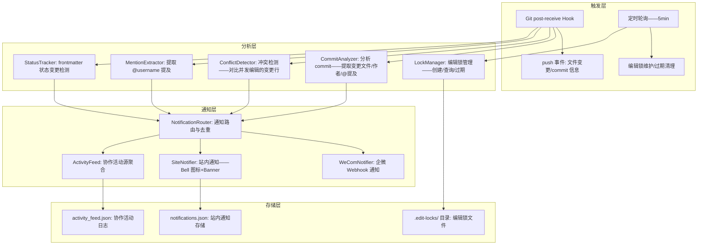

# YK-09-216: 内容协作编辑通知 — 实时编辑提醒、提及通知、编辑冲突警告、协作活动源

> 需求编号：YK-09-216 · 优先级：P2 · 人天：0.3d · 状态：需求已编写
> 依赖：YK-09-20（贡献者激励机制——复用贡献者身份识别）· YK-09-106（内容协同编辑——复用协作编辑基础设施）· YK-09-155（内容协作请求——复用协作工作流）

## 背景

### 问题陈述

YiKnowledge 作为团队共享知识库——多人同时编辑和审阅是常态——但当前缺乏协作通知机制：

1. **编辑冲突无感知**：A 和 B 同时编辑同一文件——A 先提交——B 后提交覆盖 A 的变更——A 的修改静默丢失
2. **无提及通知**：评审者在文章中 `@author` 提出问题——作者不知道被提及——问题可能搁置数天
3. **审阅状态变更无推送**：文章从"待评审"变为"已通过"——作者不知道——等到下次手动检查才发现
4. **协作活动不可见**：团队中谁在编辑什么——何时编辑——编辑了什么——完全不可知——缺乏协作透明度
5. **编辑锁缺失**：无机制防止两人同时编辑——依赖口头沟通"你在编辑 xxx.md 吗？"

**核心矛盾**：协作需要沟通——但 YiKnowledge 基于 Git 的工作流——Git 本身只管理版本——不管理协作通知。协作通知系统通过文件锁定、编辑提醒、状态变更推送——将协作活动透明化——减少编辑冲突和沟通摩擦。

### 影响范围

| # | 影响 | 严重程度 | 典型场景 |
|---|------|----------|----------|
| 1 | 编辑冲突——工作静默丢失 | 高 | A 和 B 同时编辑——B 的 push 覆盖 A 的提交 |
| 2 | @提及未被响应 | 高 | 评审意见中有 @author——但作者不知道 |
| 3 | 审阅状态变更无感知 | 中 | 文章通过——但作者在忙其他事——不知情 |
| 4 | 团队协作活动不透明 | 中 | 不知道谁在编辑哪个文件——何时有人在改 |
| 5 | 无编辑锁导致冲突 | 中 | 两人同时改同一文件——需人工沟通协调 |

### 挑战

| 挑战 | 说明 |
|------|------|
| 静态站点 vs 实时通知 | YiKnowledge 是 markdown 文件——无运行时服务端——如何实现"实时"通知 |
| 编辑冲突检测的粒度 | 文件级别还是段落级别？Git 只能检测文件级冲突——段落级需更细粒度 |
| 用户身份与通知渠道 | 谁在编辑？通知发给谁？通过什么渠道（Webhook/邮件/站内/企业微信） |
| Git hook 与通知集成的可靠性 | Git pre-receive hook 触发通知——hook 执行失败是否阻塞 push |
| 通知频率控制——避免骚扰 | 频繁的小编辑产生大量通知——需要合并/去重/频率限制 |

---

## 一、现状分析

### 1.1 当前协作通信方式

```
现有协作通信方式:
├── Git 提交信息（唯一记录）
│   ├── commit message 中标注 "fix: review comments from @zhang"
│   ├── 优点: 有记录——可追溯
│   └── 缺点: 无主动通知——被动查看——不实时
├── 口头/IM 沟通（手动协调）
│   ├── 企业微信/钉钉: "你在编辑 xxx.md 吗？我等下再改"
│   ├── 优点: 实时——灵活
│   └── 缺点: 无系统记录——依赖人的记忆——可能忘记
├── Git PR/MR 审阅（部分使用）
│   ├── GitHub/GitLab PR 的 review comments→email 通知
│   ├── 优点: 标准化——有通知
│   └── 缺点: 仅在 PR 流程中——直接 push 到 main 不触发——非 PR 工作流不可用
├── 文件 Frontmatter 状态（被动查看）
│   ├── status: 待评审 / review_status: 待评审 → 改为 已通过
│   ├── 优点: 有状态记录
│   └── 缺点: 状态变更无通知——需手动检查
│
缺失:
├── 编辑开始/结束通知——"张三正在编辑 x.md"             # ❌ 无
├── 编辑冲突检测——"你即将覆盖李四 3 分钟前的提交"         # ❌ 无
├── @提及通知——"你在 y.md 中被 @王五 提及"              # ❌ 无
├── 审阅状态变更推送——"你的文章 x 已通过评审"            # ❌ 无
├── 协作活动时间线——"最近 24h 的编辑活动"               # ❌ 无
└── 文件编辑锁——"该文件正在被李四编辑——是否强制编辑?"    # ❌ 无
```

### 1.2 协作通知流程（现状 vs 目标）

```mermaid
graph TD
    subgraph Current["现状：无系统性协作通知"]
        C1[A 编辑文件→commit→push] --> C2[B 也编辑同一文件→push]
        C2 --> C3{Git 能否自动合并?}
        C3 -->|能| C4[合并成功——但 A 不知道 B 改了什么]
        C3 -->|不能| C5[冲突——B 手动解决——可能误删 A 的内容]
        C4 --> C6[协作完成——无人通知——各自检查]
        C5 --> C6
    end

    subgraph Target["目标：协作通知系统"]
        T1[A 开始编辑 x.md] --> T2[系统记录: A editing x.md @ 14:30——通知关注者]
        T1 --> T3[给文件加编辑锁——B 看到"⚠ 李四正在编辑此文件"]

        T4[@提及检测] --> T5[commit message 或文件内容中含 @username]
        T5 --> T6[提取被提及者→通过配置的通知渠道发送]

        T7[审阅状态变更] --> T8[frontmatter review_status: 待评审 → 已通过]
        T8 --> T9[通知作者: "🎉 你的文章 x.md 已通过评审"]

        T10[B 也尝试编辑 x.md] --> T11{编辑锁已存在?}
        T11 -->|是| T12[警告: "张三于 14:30 开始编辑此文件——是否继续?"]
        T11 -->|否| T13[正常编辑——加锁]

        T14[协作活动源] --> T15[24h 内: 谁编辑了什么——审阅了什么——状态变更了什么]
    end

    style Current fill:#f8d7da,stroke:#dc3545
    style Target fill:#d4edda,stroke:#28a745
```

### 1.3 根因矩阵

| 症状 | 根因 | 触发条件 | 频率 |
|------|------|----------|------|
| 编辑冲突——工作丢失 | 无编辑锁/冲突检测机制 | 多人同时编辑同一文件 | 高 |
| @提及未被响应 | 无提及通知系统——无主动推送 | 文件/commit 中包含 @username | 中 |
| 审阅状态变更无感知 | 无状态变更通知 | frontmatter status 变更 | 中 |
| 协作活动不透明 | 无活动聚合/通知 | 团队 > 3 人同时工作 | 中 |
| 口头沟通效率低 | 无系统化编辑协调 | 每次编辑前需确认 | 低 |

---

## 二、设计决策

### 决策 1：通知实现架构 — Git Hooks 驱动 vs 外部服务轮询 vs WebSocket 服务

| 选项 | 实时性 | 部署复杂度 | 可靠性 |
|------|--------|-----------|--------|
| Git Hooks（pre-receive/post-receive）驱动 | 秒级（push 时触发） | 中——需配置 Git hook | 高——Git 原生 |
| 外部服务轮询（apscheduler 扫描 Git log） | 分钟级（轮询间隔） | 低——独立进程 | 中——可能漏 |
| WebSocket 服务（编辑时持续连接） | 实时 | 高——需持久服务 | 高——但需在线 |

**选择：Git Hooks + 外部服务轮询混合。** Git post-receive hook 处理 push 事件——检测冲突/提取提及/分析状态变更——触发通知。外部服务定时轮询处理编辑锁维护和活动源聚合——5 分钟间隔。WebSocket 对于 markdown 知识库的协作场景过于重量级——文件编辑频率不高（分钟级而非秒级）——不需要 WebSocket 级别的实时性。

### 决策 2：通知渠道 — 仅 Git commit 标记 vs 企业微信 Webhook vs 多通道

| 选项 | 覆盖范围 | 配置复杂度 | 侵入性 |
|------|---------|-----------|--------|
| 仅 Git commit 标记（无主动推送） | 低 | 最低 | 低 |
| 企业微信 Webhook（通过 YiAi 已集成的企微机器人） | 高——团队使用企微 | 低——复用 YiAi 企微集成 | 中 |
| 多通道（企微+邮件+站内通知） | 最高 | 高 | 高 |

**选择：企业微信 Webhook + 站内通知。** YiAi 已有企微机器人集成——复用发送能力。站内通知（YiKnowledge 静态页面顶部的通知 Bell 图标）作为 Web 端入口。邮件作为可选扩展——首期不实现。

### 决策 3：编辑冲突检测粒度 — 文件级别 vs Git diff 行级别 vs 段落级别

| 选项 | 精度 | 实现复杂度 | 误报率 |
|------|------|-----------|--------|
| 文件级别（"有人正在编辑此文件"） | 低 | 低 | 高——编辑不同段落也报警 |
| Git diff 行级别（对比变更行范围） | 高 | 中 | 低——基于文件版本行号 |
| 段落级别（基于 markdown 段落拆分） | 最高 | 高 | 最低——但需解析器+位置跟踪 |

**选择：文件级别+Git diff 行级别。** 编辑锁为文件级别（有人在编辑该文件——加全局锁）。冲突检测为 Git diff 行级别（B 的变更与 A 的变更是否重叠——重叠=冲突）。段落级别需要编辑器集成——对于 YiKnowledge 的 markdown 文件编辑场景过于复杂。

### 决策 4：编辑锁机制 — 基于文件标记 vs 基于中心服务 vs 基于 PR 流程

| 选项 | 实现 | 强制力 | 并发友好度 |
|------|------|--------|-----------|
| 基于文件标记（`.edit-locks/locks.json`） | 低 | 弱——依靠约定 | 高——无阻塞 |
| 基于中心服务（Redis/DB 锁） | 高 | 中——需服务端 | 中 |
| 基于 PR 流程（禁止直接 push main——全部走 PR） | 中 | 强——GitHub/GitLab 流程 | 高——PR 自动处理冲突 |

**选择：基于文件标记+建议性锁。** 编辑锁存储在 `.edit-locks/` 目录——lock 文件记录编辑者+开始时间+预计结束时间。锁是建议性的——不阻止 push——但在编辑前端显示警告。强锁（阻止 push）会导致工作流中断——不建议在知识库场景使用。Git pre-receive hook 检查锁文件——如果有冲突编辑——返回警告但不阻止 push。

### 设计决策记录

| 决策 | 选项 A | 选项 B | 选项 C | 选项 D | 选择 | 理由 |
|------|--------|--------|--------|--------|------|------|
| 通知架构 | Git Hooks | 外部轮询 | WebSocket | — | **Hooks+轮询混合** | 平衡实时性与复杂度 |
| 通知渠道 | Git 标记 | 企微 Webhook | 多通道 | — | **企微+站内** | 复用已有集成 |
| 冲突粒度 | 文件级 | 行级 | 段落级 | — | **文件+行级** | 平衡精度与复杂度 |
| 编辑锁 | 文件标记 | 中心服务 | PR 流程 | — | **文件标记+建议锁** | 轻量——不阻塞 push |

---

## 三、目标架构

### 3.1 协作通知系统架构



### 3.2 通知事件处理流程

```mermaid
graph TD
    A[Git push 事件] --> B[解析 commit 信息]
    B --> C{事件类型识别}

    C -->|编辑冲突| D1[检测: A 和 B 修改了相同文件且行范围重叠]
    D1 --> D2[通知 A 和 B: "编辑冲突——请协调"]
    D2 --> D3[总结冲突文件和行范围]

    C -->|@提及| E1[提取 commit 和文件内容中的 @username]
    E1 --> E2[去重——同一用户一次 push 只通知一次]
    E2 --> E3[通知被提及者: "你在 xxx.md 中被 @author 提及"]

    C -->|状态变更| F1[对比 push 前后 frontmatter diff]
    F1 --> F2{哪些字段变更?}
    F2 -->|review_status| F3[通知作者: "文章 xxx 评审状态: 待评审→已通过"]
    F2 -->|status| F4[通知关注者: "文章 xxx 状态变更: 草稿→已发布"]
    F2 -->|priority| F5[通知 owner: "优先级变更: P2→P1"]

    C -->|普通编辑| G1[记录到活动源]
    G1 --> G2[更新 .edit-locks/——标记活动时间——防止锁过期]
    G2 --> G3[不做主动通知——仅记录]
```

### 3.3 性能指标

| 指标 | 目标值 | 说明 |
|------|--------|------|
| Git hook 执行时间 | < 2s | 不显著拖慢 push 速度 |
| 通知发送延迟 | < 5s (push→企微消息) | Hook + Webhook 链 |
| 定时轮询扫描耗时 | < 500ms | 扫描 .edit-locks/ 目录 |
| 活动源查询 | < 200ms | JSON 文件——1000 条内 |
| 并发编辑检测 | < 100ms | diff 对比——文件级 |

---

## 四、具体改动

### 4.1 类型定义

```python
# yi_knowledge/collab_notify/types.py (新增)

from dataclasses import dataclass, field
from enum import Enum
from typing import Optional
from datetime import datetime

class NotificationType(str, Enum):
    EDIT_CONFLICT = "edit_conflict"       # 编辑冲突
    MENTION = "mention"                    # @提及
    STATUS_CHANGE = "status_change"       # 状态变更
    REVIEW_ASSIGNED = "review_assigned"   # 评审分配
    EDIT_LOCK_WARNING = "edit_lock_warning" # 编辑锁警告

class NotificationChannel(str, Enum):
    WECOM = "wecom"    # 企业微信
    SITE = "site"      # 站内通知
    BOTH = "both"      # 两者

@dataclass
class Notification:
    id: str
    type: NotificationType
    title: str                           # 通知标题
    body: str                            # 通知正文
    recipients: list[str]                # 接收者（username）
    channel: NotificationChannel
    file_path: Optional[str] = None      # 相关文件
    commit_hash: Optional[str] = None
    created_at: str = field(default_factory=lambda: datetime.now().isoformat())
    read: bool = False
    action_url: Optional[str] = None     # 点击后的跳转链接

@dataclass
class EditLock:
    file_path: str                       # 锁定的文件路径
    editor: str                          # 编辑者 username
    started_at: str                      # ISO 时间戳
    estimated_duration_minutes: int = 60 # 预计编辑时长
    branch: Optional[str] = None         # 编辑的分支
    commit_hash: Optional[str] = None    # 开始编辑时的 commit

@dataclass
class ActivityEntry:
    timestamp: str
    actor: str                           # 执行者 username
    action: str                          # edited/reviewed/status_changed/mentioned
    file_path: str
    detail: str                          # 操作详情——如 "修改了第 3-5 段"
    commit_hash: Optional[str] = None

@dataclass
class ConflictInfo:
    file_path: str
    editor_a: str
    editor_b: str
    overlapping_lines: list[tuple[int, int]]  # 重叠的变更行范围
    commit_a: str
    commit_b: str
```

### 4.2 核心通知处理器

```python
# yi_knowledge/collab_notify/notification_engine.py (新增)

import json
import os
import re
import subprocess
from datetime import datetime, timedelta
from pathlib import Path
from typing import Optional

from .types import (
    ActivityEntry, ConflictInfo, EditLock, Notification,
    NotificationChannel, NotificationType,
)

class NotificationEngine:
    """协作通知引擎——分析 push 事件——生成通知"""

    def __init__(self, repo_path: str, wecom_webhook_url: Optional[str] = None):
        self.repo_path = Path(repo_path)
        self.locks_dir = self.repo_path / ".edit-locks"
        self.notifications_file = self.repo_path / "collab_notifications.json"
        self.activity_file = self.repo_path / "activity_feed.json"
        self.wecom_webhook_url = wecom_webhook_url
        self._ensure_dirs()

    def _ensure_dirs(self):
        self.locks_dir.mkdir(exist_ok=True)

    def process_push(self, old_rev: str, new_rev: str, ref_name: str) -> list[Notification]:
        """处理 git push 事件——生成通知列表"""
        notifications = []

        # 1. 获取变更信息
        changed_files = self._get_changed_files(old_rev, new_rev)
        commit_messages = self._get_commit_messages(old_rev, new_rev)
        authors = self._get_authors(old_rev, new_rev)

        # 2. 检测编辑冲突
        conflicts = self._detect_conflicts(changed_files, old_rev, new_rev, authors)
        for conflict in conflicts:
            notifications.append(self._build_conflict_notification(conflict))

        # 3. 提取 @提及
        mentions = self._extract_mentions(commit_messages, changed_files, new_rev)
        for mention in mentions:
            notifications.append(self._build_mention_notification(mention))

        # 4. 检测 frontmatter 状态变更
        status_changes = self._detect_status_changes(changed_files, old_rev, new_rev)
        for change in status_changes:
            notifications.append(self._build_status_notification(change))

        # 5. 更新活动源
        self._update_activity_feed(authors, changed_files, commit_messages)

        # 6. 发送通知
        self._send_notifications(notifications)

        # 7. 更新编辑锁
        self._update_locks(authors, changed_files)

        return notifications

    def _get_changed_files(self, old_rev: str, new_rev: str) -> list[str]:
        """获取 push 中变更的文件列表"""
        result = subprocess.run(
            ["git", "diff", "--name-only", old_rev, new_rev],
            capture_output=True, text=True, cwd=self.repo_path,
        )
        return [f for f in result.stdout.strip().split("\n") if f]

    def _get_commit_messages(self, old_rev: str, new_rev: str) -> list[str]:
        """获取 push 中所有 commit 的 message"""
        result = subprocess.run(
            ["git", "log", "--format=%B", f"{old_rev}..{new_rev}"],
            capture_output=True, text=True, cwd=self.repo_path,
        )
        return [m for m in result.stdout.strip().split("\n\n---\n") if m]

    def _get_authors(self, old_rev: str, new_rev: str) -> list[str]:
        """获取 push 中所有 commit 的作者"""
        result = subprocess.run(
            ["git", "log", "--format=%an", f"{old_rev}..{new_rev}"],
            capture_output=True, text=True, cwd=self.repo_path,
        )
        return list(set(result.stdout.strip().split("\n")))

    def _detect_conflicts(
        self, changed_files: list[str], old_rev: str, new_rev: str, authors: list[str]
    ) -> list[ConflictInfo]:
        """检测编辑冲突——对比并发编辑的变更行"""
        conflicts = []
        for file_path in changed_files:
            # 检查是否有人正在编辑此文件
            active_lock = self._get_active_lock(file_path)
            if not active_lock:
                continue

            # 只有不同作者编辑同一文件才算冲突
            for author in authors:
                if author == active_lock.editor:
                    continue

                # 对比变更行范围
                diff_lines = self._get_file_diff_lines(file_path, old_rev, new_rev)
                if diff_lines:
                    conflicts.append(ConflictInfo(
                        file_path=file_path,
                        editor_a=active_lock.editor,
                        editor_b=author,
                        overlapping_lines=diff_lines,
                        commit_a=active_lock.commit_hash or "",
                        commit_b=new_rev,
                    ))

        return conflicts

    def _get_active_lock(self, file_path: str) -> Optional[EditLock]:
        """获取文件的活跃编辑锁——自动过期 2h"""
        lock_file = self.locks_dir / f"{file_path.replace('/', '_')}.lock.json"
        if not lock_file.exists():
            return None

        with open(lock_file) as f:
            data = json.load(f)

        started = datetime.fromisoformat(data["started_at"])
        if datetime.now() - started > timedelta(hours=2):
            lock_file.unlink(missing_ok=True)  # 锁过期
            return None

        return EditLock(**data)

    def _get_file_diff_lines(self, file_path: str, old_rev: str, new_rev: str) -> list[tuple[int, int]]:
        """获取文件变更的行范围"""
        result = subprocess.run(
            ["git", "diff", "--unified=0", old_rev, new_rev, "--", file_path],
            capture_output=True, text=True, cwd=self.repo_path,
        )
        # 解析 @@ -a,b +c,d @@ 行范围
        lines = []
        for match in re.finditer(r'@@ -\d+(?:,\d+)? \+(\d+)(?:,(\d+))? @@', result.stdout):
            start = int(match.group(1))
            count = int(match.group(2) or 1)
            lines.append((start, start + count - 1))
        return lines

    def _extract_mentions(
        self, commit_messages: list[str], changed_files: list[str], new_rev: str
    ) -> list[dict]:
        """提取 @username 提及"""
        mentions = []
        mention_pattern = re.compile(r'@(\w[\w.-]*)')

        # 从 commit messages 提取
        for msg in commit_messages:
            for match in mention_pattern.finditer(msg):
                mentions.append({
                    "username": match.group(1),
                    "source": "commit_message",
                    "context": msg[:100],
                })

        # 从变更文件内容提取——仅 markdown 文件
        for file_path in changed_files:
            if not file_path.endswith('.md'):
                continue
            content = self._get_file_content_at_rev(file_path, new_rev)
            for match in mention_pattern.finditer(content or ""):
                mentions.append({
                    "username": match.group(1),
                    "source": file_path,
                    "context": content[max(0, match.start()-20): match.end()+20] if content else "",
                })

        return mentions

    def _get_file_content_at_rev(self, file_path: str, rev: str) -> Optional[str]:
        """获取指定版本的文件内容"""
        result = subprocess.run(
            ["git", "show", f"{rev}:{file_path}"],
            capture_output=True, text=True, cwd=self.repo_path,
        )
        return result.stdout if result.returncode == 0 else None

    def _detect_status_changes(
        self, changed_files: list[str], old_rev: str, new_rev: str
    ) -> list[dict]:
        """检测 frontmatter 状态变更（仅 markdown 文件）"""
        # 简化实现：仅检查 markdown 文件的 review_status/status/priority 变更
        changes = []
        for file_path in changed_files:
            if not file_path.endswith('.md'):
                continue
            old = self._get_file_content_at_rev(file_path, old_rev)
            new = self._get_file_content_at_rev(file_path, new_rev)
            if not old or not new:
                continue

            old_fm = self._parse_frontmatter(old)
            new_fm = self._parse_frontmatter(new)

            for key in ('review_status', 'status', 'priority'):
                if old_fm.get(key) != new_fm.get(key) and new_fm.get(key):
                    changes.append({
                        "file_path": file_path,
                        "field": key,
                        "old_value": old_fm.get(key, "N/A"),
                        "new_value": new_fm.get(key),
                        "owner": new_fm.get("owner", "unknown"),
                    })

        return changes

    def _parse_frontmatter(self, content: str) -> dict:
        """解析 YAML frontmatter——提取关键字段"""
        match = re.match(r'^---\n(.*?)\n---', content, re.DOTALL)
        if not match:
            return {}
        try:
            import yaml
            return yaml.safe_load(match.group(1)) or {}
        except Exception:
            return {}

    def _update_activity_feed(
        self, authors: list[str], changed_files: list[str], commit_messages: list[str]
    ):
        """更新协作活动源"""
        feed = self._load_activity_feed()
        now = datetime.now().isoformat()

        for file_path in changed_files:
            for i, author in enumerate(authors):
                feed.append(ActivityEntry(
                    timestamp=now,
                    actor=author,
                    action="edited",
                    file_path=file_path,
                    detail=commit_messages[i] if i < len(commit_messages) else "",
                ))

        # 保留最近 500 条
        feed = feed[-500:]
        self._save_activity_feed(feed)

    def _load_activity_feed(self) -> list[ActivityEntry]:
        if not self.activity_file.exists():
            return []
        with open(self.activity_file) as f:
            data = json.load(f)
        return [ActivityEntry(**item) for item in data]

    def _save_activity_feed(self, feed: list[ActivityEntry]):
        with open(self.activity_file, 'w') as f:
            json.dump([item.__dict__ for item in feed], f, ensure_ascii=False, indent=2)

    def _send_notifications(self, notifications: list[Notification]):
        """发送通知——企微+站内"""
        for notif in notifications:
            if notif.channel in (NotificationChannel.WECOM, NotificationChannel.BOTH):
                self._send_wecom(notif)
            if notif.channel in (NotificationChannel.SITE, NotificationChannel.BOTH):
                self._save_site_notification(notif)

    def _send_wecom(self, notif: Notification):
        if not self.wecom_webhook_url:
            return
        # 复用 YiAi 的企微通知模块
        try:
            import httpx
            msg = {
                "msgtype": "text",
                "text": {
                    "content": f"【YiKnowledge 通知】\n{notif.title}\n{notif.body}\n"
                               f"文件: {notif.file_path or 'N/A'}\n"
                               f"👤 通知: {' @'.join(notif.recipients)}"
                }
            }
            httpx.post(self.wecom_webhook_url, json=msg, timeout=5)
        except Exception:
            pass  # 企微通知失败不阻塞流程

    def _save_site_notification(self, notif: Notification):
        """保存站内通知到 JSON 文件"""
        notifications = []
        if self.notifications_file.exists():
            with open(self.notifications_file) as f:
                notifications = json.load(f)
        notifications.append(notif.__dict__)
        # 保留最近 200 条
        notifications = notifications[-200:]
        with open(self.notifications_file, 'w') as f:
            json.dump(notifications, f, ensure_ascii=False, indent=2)

    def _update_locks(self, authors: list[str], changed_files: list[str]):
        """根据 push 更新编辑锁——标记编辑完成"""
        for file_path in changed_files:
            lock_file = self.locks_dir / f"{file_path.replace('/', '_')}.lock.json"
            if lock_file.exists():
                with open(lock_file) as f:
                    data = json.load(f)
                # 如果 push 的作者是锁的持有者——释放锁
                if data.get("editor") in authors:
                    lock_file.unlink(missing_ok=True)
```

### 4.3 文件变更清单

| 文件 | 操作 | 说明 |
|------|------|------|
| `yi_knowledge/collab_notify/__init__.py` | 新增 | 模块初始化 |
| `yi_knowledge/collab_notify/types.py` | 新增 | 类型定义 |
| `yi_knowledge/collab_notify/notification_engine.py` | 新增 | 核心通知引擎 |
| `yi_knowledge/collab_notify/git_hook.py` | 新增 | Git post-receive hook 脚本 |
| `yi_knowledge/collab_notify/lock_manager.py` | 新增 | 编辑锁管理——创建/查询/过期 |
| `yi_knowledge/collab_notify/activity_service.py` | 新增 | 活动源查询与聚合 |
| `static/js/collab-notifications.js` | 新增 | 站内通知 Bell 图标+下拉列表 |
| `static/css/collab-notify.css` | 新增 | 通知 UI 样式 |
| `scripts/install-git-hooks.sh` | 新增 | 安装 Git hooks 的脚本 |

---

## 五、实施步骤

| 步骤 | 操作 | 路径 | 验证 | 人天 |
|------|------|------|------|------|
| 1 | 类型定义+编辑锁管理 | `types.py` + `lock_manager.py` | 创建锁→查询锁→自动过期（2h）→释放锁 | 0.04 |
| 2 | Git 变更分析——获取文件/commit/作者/行范围 | `notification_engine.py` | git diff/git log 子进程调用——解析输出 | 0.05 |
| 3 | 冲突检测+@提及提取 | `notification_engine.py` | 并发编辑冲突检测——@username 从 commit 和内容中提取 | 0.05 |
| 4 | 状态变更检测+活动源聚合 | `notification_engine.py` + `activity_service.py` | frontmatter diff——活动源 CRUD——保留 500 条 | 0.04 |
| 5 | 通知发送——企微 Webhook+站内存储 | `notification_engine.py` | 企微消息格式正确——站内通知 JSON 存储 | 0.04 |
| 6 | Git hook 集成+安装脚本 | `git_hook.py` + `install-git-hooks.sh` | post-receive hook 触发→通知引擎→通知发送 | 0.04 |
| 7 | 前端通知 UI——Bell+下拉+活动源 | `collab-notifications.js` + CSS | Bell 图标显示未读数——下拉列表——点击跳转 | 0.04 |

**总人天：0.30d**

---

## 六、测试规格

### 场景 1：编辑冲突通知

**GIVEN** 张三正在编辑 `specs/performance.md`——编辑锁存在
**WHEN** 李四也编辑了 `specs/performance.md`——变动了第 42-58 行——push 到仓库
**AND** 张三的编辑也涉及第 50-65 行（行范围重叠）
**THEN** git post-receive hook 检测到行级冲突——发送企微通知给张三和李四
**AND** 通知内容："编辑冲突——specs/performance.md——张三（行 42-58）vs 李四（行 50-65）——请协调合并"

### 场景 2：@提及通知

**GIVEN** 李四 push 一个 commit——message 为 "fix: 解决 @张三 提出的问题——更新了 API 文档"
**WHEN** post-receive hook 执行
**THEN** 提取 @张三 提及——发送企微消息："你在 YiKnowledge 中被 @李四 提及——文件: specs/api.md"
**AND** 同一 push 的多个 commit 中多次 @张三——通知去重——只发送一条

### 场景 3：审阅状态变更通知

**GIVEN** 文章 `requirements/yk-213.md` 的 frontmatter review_status 从 "待评审" 变为 "已通过"
**WHEN** owner 为 "陈铭"——评审者 push 该变更
**THEN** 发送企微消息给 owner 陈铭："🎉 你的文章 `yk-213.md` 已通过评审——review_status: 待评审 → 已通过"
**WHEN** 状态从 "待评审" 变为 "需修改"
**THEN** 发送消息："📝 你的文章 `yk-213.md` 需要修改——请查看评审意见"

### 场景 4：编辑锁管理

**GIVEN** 张三开始编辑 `specs/architecture.md`
**WHEN** 创建编辑锁 `.edit-locks/specs_architecture.md.lock.json`——editor=张三——started_at=now
**WHEN** 李四尝试编辑同一文件——编辑前端读取锁文件
**THEN** 显示警告："⚠ 张三于 14:30 开始编辑此文件——是否继续？你可能覆盖他人的更改"
**WHEN** 张三完成编辑——push——锁自动释放
**THEN** 李四可以无警告地编辑

### 场景 5：协作活动源

**GIVEN** 团队 24 小时内进行了多次编辑和审阅
**WHEN** 用户打开协作活动源页面
**THEN** 显示按时间倒序的活动列表：
- "张三 编辑了 specs/api.md —— fix: 更新认证端点"
- "李四 编辑了 requirements/yk-213.md —— review: 通过"
- "王五 编辑了 lessons/bugs/auth-timeout.md —— add: 超时案例"
**WHEN** 活动超过 24 小时
**THEN** 保留在历史中——可以通过日期筛选查看

### 场景 6：站内通知 Bell

**GIVEN** 用户有 3 条未读通知
**WHEN** 打开 YiKnowledge 页面
**THEN** 右上角 Bell 图标显示红色角标 "3"
**WHEN** 点击 Bell 图标
**THEN** 下拉面板显示 3 条通知——按时间倒序——未读通知背景高亮
**WHEN** 点击某条通知
**THEN** 跳转到对应文件——该通知标记为已读——角标更新为 "2"

---

## 七、风险与缓解

| 风险 | 概率 | 影响 | 缓解措施 |
|------|------|------|----------|
| Git hook 执行超时——push 变慢 | 中 | 中 | Hook 中耗时操作异步化——避免阻塞 push——通知处理在后台子进程中执行 |
| 编辑锁过期的假阳性——已编辑完但未 push | 中 | 低 | 锁有效期 2h——可配置——定时轮询抽查文件 mtime——自动续期 |
| 企微 Webhook 发送失败——通知丢失 | 中 | 低 | 发送失败时——站内通知仍保存——重试 3 次——记录失败日志 |
| @提及提取误报——代码中的 @ 被识别为提及 | 低 | 低 | 仅提取 markdown 和 commit message 中的 @——代码文件跳过——正则限制 username 格式 |
| 活动源文件过大——读取慢 | 低 | 低 | 500 条上限——超过自动截断——定期归档历史数据（> 30 天） |

---

## 八、回滚策略

| 场景 | 回滚操作 | 影响 |
|------|------|------|
| Git hook 导致 push 失败或超时 | 卸载 Git hook——恢复原有 post-receive（如有） | 通知功能全部不可用 |
| 企微通知过于频繁——骚扰 | 降低通知级别——仅冲突和状态变更——关闭提及通知 | 提及通知不可用 |
| 编辑锁文件冲突——多人同时加锁 | 降级为建议锁——不阻止编辑——仅显示警告 | 冲突检测准确性下降 |
| 完全移除 | 删除 Git hook——删除通知模块文件——清空锁目录 | 所有通知和编辑锁功能不可用 |

---

## 九、设计决策记录

### D-01：为什么不用 GitHub/GitLab 原生的 PR review 流程——而要自建通知？

技术知识库的编辑模式不同于代码库——大部分编辑是直接 push 到 main——不走 PR 流程。PR 流程会增加写作者的操作复杂度（fork→branch→PR→review→merge）——对于 markdown 文档过重。自建通知系统轻量化——适合知识库的快速迭代编辑模式。

### D-02：为什么编辑锁是建议性的而非强制性的？

知识库编辑的冲突率远低于代码库——绝大多数情况下编辑者不会同时修改同一文件的同一段落。强制性锁（阻止 push）在极少数冲突场景下引入过大摩擦——不如建议性锁+冲突检测——让维护者知情决策。如果确实需要强制锁——可通过配置启用。

### D-03：为什么通知 JSON 文件直接存储而非使用数据库？

YiKnowledge 是 markdown 文件仓库——引入数据库会增加部署复杂度。JSON 文件可通过 Git 追踪——通知数据也纳入版本管理。200 条通知约 50KB——查询性能完全不是瓶颈。需要高性能查询的场景（> 10000 条）才考虑迁移到数据库。

### D-04：为什么活动源保留 500 条而非更多或更少？

500 条覆盖约 2-4 周的团队活动（取决于编辑频率）——足以了解团队协作趋势。超过 500 条的历史数据定期归档到 `activity_archive/` 目录——按月份分文件——保留全部历史但主 JSON 保持轻量。

---

## 十、可观测性

### 指标

| 指标 | 类型 | 说明 |
|------|------|------|
| `yiknowledge.notify.push_processed` | Counter | 处理的 push 事件数 |
| `yiknowledge.notify.conflicts_detected` | Counter | 检测到的编辑冲突数 |
| `yiknowledge.notify.mentions_extracted` | Counter | 提取的 @提及数 |
| `yiknowledge.notify.status_changes` | Counter | 检测到的状态变更数 |
| `yiknowledge.notify.wecom_sent` | Counter | 企微通知发送数 |
| `yiknowledge.notify.wecom_failed` | Counter | 企微发送失败数 |
| `yiknowledge.notify.active_locks` | Gauge | 当前活跃编辑锁数量 |
| `yiknowledge.notify.hook_duration` | Histogram | Git hook 执行耗时 |

---

## 十一、代码审查检查清单

- [ ] GitHook: post-receive 读取 stdin（old new ref）——三参数正确解析
- [ ] GitHook: hook 中核心处理在子进程中执行——不阻塞 push 返回
- [ ] ConflictDetector: 行范围对比——`range_a.start <= range_b.end AND range_b.start <= range_a.end`——区间重叠判断
- [ ] MentionExtractor: @username 正则——仅字母数字+连字符+点+下划线——不提取 email（@ 后有点但域名格式）
- [ ] StatusTracker: frontmatter 解析——YAML safe_load——解析失败不崩溃——返回空 dict
- [ ] LockManager: 锁过期检查——文件 mtime 而非内容中的时间戳——更可靠
- [ ] WeComNotifier: 企微消息长度限制——超过 2048 字符截断——添加 "..."
- [ ] SiteNotifier: 通知 JSON 写操作——加文件锁——防止并发写入损坏
- [ ] ActivityFeed: 时间戳使用 ISO 8601——UTC 时区——前端展示时转本地时间
- [ ] install-git-hooks.sh: 脚本幂等——重复执行不重复安装——保留原有 hook 备份

---

## 回归问题预测

| # | 预测问题 | 原因 | 验证方法 |
|---|---------|------|---------|
| 1 | 编辑锁未正确释放——持久悬挂——所有人都收到冲突警告 | push 后 lock_manager._update_locks 未匹配作者 | push 后检查锁文件是否删除 |
| 2 | 通知 JSON 文件并发写入损坏 | 多个 push 同时触发——同时写入 notifications.json | 并发 push 测试——JSON 文件可正常解析 |
| 3 | @提及在代码块（markdown 的 ```)中被误提取 | MentionExtractor 不区分 markdown 代码块和正文 | @ 在 markdown 代码块中——不被提取 |
| 4 | Git hook 在其他分支 push 时异常——引用名格式不符合预期 | ref_name 可能是 refs/heads/feature——文件路径需要解析 | feature 分支 push→通知仅发送给当前分支关注者 |
| 5 | 企微 Webhook URL 配置错误——所有通知发送失败 | 配置文件未校验 Webhook URL 格式——错误无提示 | 启动时校验 Webhook URL——格式错误时提示 |
| 6 | 活动源 JSON 文件过大——前端加载慢——阻塞页面渲染 | 500 条累积可能达到 200KB | 测试 500 条活动——前端加载 < 100ms |

---

## 性能分析

### 各操作耗时

| 操作 | 耗时 | 说明 |
|------|------|------|
| Git hook 总耗时 | < 1.5s | 分析 1s+通知 0.5s |
| git diff --name-only | < 50ms | 变更文件列表 |
| git log 解析 | < 100ms | 5-10 个 commits |
| Frontmatter diff | < 200ms/文件 | YAML 解析+对比 |
| 企微 Webhook 发送 | 200-500ms | 网络延迟 |
| 站内通知保存 | < 10ms | JSON 文件写入 |
| 编辑锁查询 | < 5ms | 文件是否存在 |

### 存储预估

| 数据 | 大小 | 增长速率 |
|------|------|---------|
| 编辑锁文件（每锁） | ~200B | 1-3 个/天 |
| 通知 JSON（200 条） | ~50KB | ~1KB/条 |
| 活动源 JSON（500 条） | ~100KB | ~200B/条 |
| **总计（30 天）** | **~200KB** | ~7KB/天 |

### 代码体积

| 文件 | 大小 |
|------|------|
| types.py | ~4KB |
| notification_engine.py | ~12KB |
| git_hook.py | ~2KB |
| lock_manager.py | ~3KB |
| activity_service.py | ~3KB |
| 前端 JS+CSS | ~5KB |
| install-git-hooks.sh | ~1KB |
| **总计** | **~30KB** |