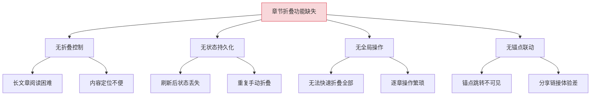
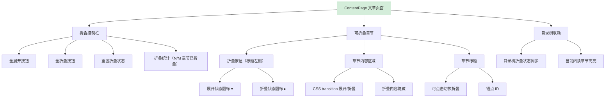
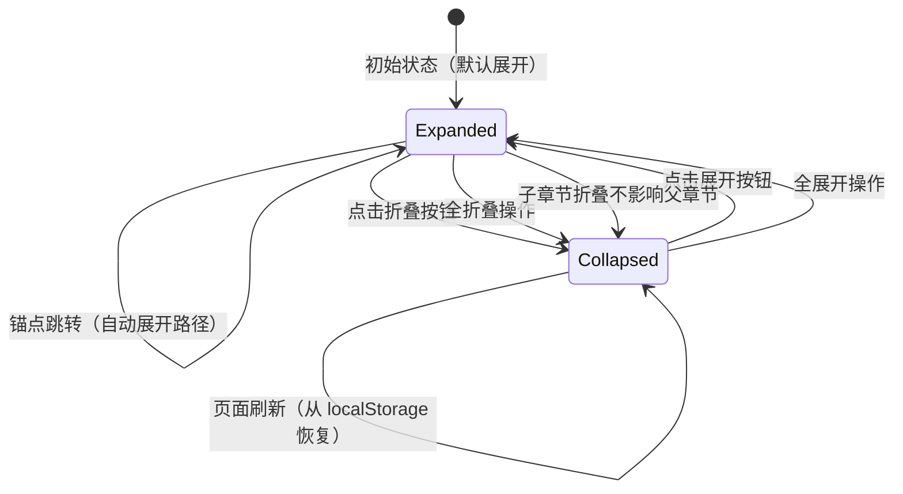

# YK-09-217: 内容章节折叠 — 可折叠文章章节、折叠状态持久化、全展开/折叠与锚点联动

> 需求编号：YK-09-217 · 优先级：P2 · 人天：0.3d · 状态：需求已编写
> 依赖：YK-09-190（内容相关文章推荐）、YK-09-112（内容导航树优化）

## 背景

### 问题陈述

YiKnowledge 知识库中的长文章通常包含多个章节（H1-H6 标题），用户在阅读时需要频繁上下滚动来定位内容。当前所有章节默认展开，导致长文章阅读体验差，用户难以快速了解文章结构并跳转到感兴趣的部分。

1. **长文章阅读困难**：所有章节展开，页面过长，难以定位内容
2. **无折叠控制**：用户无法折叠不需要的章节
3. **折叠状态不持久化**：刷新页面后折叠状态丢失
4. **无全局折叠操作**：无法一键折叠/展开所有章节
5. **锚点链接与折叠无联动**：通过锚点跳转时未自动展开目标章节

**核心矛盾**：长文章内容组织需要章节控制能力，但当前缺乏折叠功能，降低了阅读效率。

### 影响范围

| # | 影响 | 严重程度 | 典型场景 |
|---|------|----------|----------|
| 1 | 长文章阅读体验差 | 高 | 3000+ 字的文章，用户需频繁上下滚动 |
| 2 | 内容定位困难 | 中 | 无法快速跳转到感兴趣的章节 |
| 3 | 重复劳动 | 中 | 每次打开文章都需要重新折叠不需要的章节 |
| 4 | 锚点链接跳转不友好 | 中 | 分享锚点链接后，目标章节被折叠不可见 |
| 5 | 打印时无法控制输出 | 低 | 打印时所有章节都被展开，无法选择性打印 |

### 挑战

| 挑战 | 说明 |
|------|------|
| 折叠状态存储 | 折叠状态需要跨会话持久化，但存储空间有限 |
| 锚点联动 | 锚点跳转时需自动展开路径上的所有父章节 |
| 动画性能 | 大量章节折叠/展开动画时的性能 |
| 与现有渲染管线的兼容 | 不破坏现有的 Markdown → HTML 渲染流程 |

---

## 一、现状分析

### 1.1 当前文章页面结构

```
现有功能:
├── Markdown 渲染
│   ├── H1-H6 标题渲染
│   └── 内容格式化
├── 内容导航树（YK-09-112）
│   ├── 目录树展示
│   └── 点击跳转
├── 内容相关文章推荐（YK-09-190）
│   ├── 相关文章列表
│   └── 推荐算法

缺失:
├── 章节折叠功能                   # ❌ 不存在
├── 折叠状态持久化                  # ❌ 不存在
├── 全折叠/全展开操作                # ❌ 不存在
├── 锚点与折叠联动                  # ❌ 不存在
├── 折叠动画                        # ❌ 不存在
└── 打印时全部展开                  # ❌ 不存在
```

### 1.2 根因分析矩阵



| 根因 | 症状 | 影响 | 优先级 |
|------|------|------|--------|
| 折叠控制缺失 | 长文章阅读困难 | 用户体验差 | 高 |
| 状态持久化缺失 | 刷新后丢失 | 重复劳动 | 高 |
| 全局操作缺失 | 逐章操作繁琐 | 效率低下 | 中 |
| 锚点联动缺失 | 跳转不可见 | 导航失效 | 中 |

---

## 二、设计决策

### 决策 1：折叠粒度和实现方式

| 选项 | 描述 | 优点 | 缺点 |
|------|------|------|------|
| A: H2 级别折叠 | 仅 H2 章节可折叠 | 简单 | 粒度不够细 |
| B: 所有标题折叠 | H1-H6 均可折叠 | 灵活 | 嵌套层级多时 UI 复杂 |
| C: H2-H3 折叠 | H2 和 H3 可折叠 | 平衡 | 更深的标题不可折叠 |
| D: 可配置 | 用户可选折叠粒度 | 最灵活 | 0.3d 不够 |

**选择：B（所有标题折叠）。** 所有 H1-H6 标题均可折叠，但仅 H1-H3 默认显示折叠按钮（更常见的章节层级）。H4-H6 在 hover 时显示折叠按钮。每个标题折叠其后续内容，直到遇到同级或更高级标题。

### 决策 2：折叠状态持久化方式

| 选项 | 描述 | 优点 | 缺点 |
|------|------|------|------|
| A: localStorage | 浏览器本地存储 | 持久化，不依赖服务端 | 跨设备不同步 |
| B: 服务端存储 | 存储到后端用户偏好 | 跨设备同步 | 需要后端 API |
| C: URL hash | 折叠状态编码在 URL 中 | 可分享 | URL 过长，容量有限 |
| D: localStorage + URL | 默认 localStorage，URL 参数覆盖 | 兼顾持久与分享 | 实现复杂 |

**选择：A（localStorage）。** 0.3d 预算下，localStorage 是最务实的方案。以文章路径为 key 存储折叠状态，容量充足（5MB 限制对折叠状态绰绰有余）。跨设备同步可作为后续优化方向。

### 决策 3：折叠动画

| 选项 | 描述 | 优点 | 缺点 |
|------|------|------|------|
| A: 无动画 | 立即折叠/展开 | 简单，性能好 | 体验不够流畅 |
| B: CSS transition | 使用 CSS max-height transition | 平滑，实现简单 | max-height 动画需估算值 |
| C: JS 动画 | 使用 JS 计算实际高度 | 精确 | 实现复杂 |

**选择：B（CSS transition）。** 使用 CSS `max-height` transition 配合 `overflow: hidden` 实现平滑折叠动画。设置合理的 max-height 估算值（如 5000px），配合 `transition: max-height 0.3s ease`。对于内容极长的章节，动画时间可能需要调整。

### 决策 4：锚点链接联动策略

| 选项 | 描述 | 优点 | 缺点 |
|------|------|------|------|
| A: 不联动 | 锚点跳转不展开 | 简单 | 可能跳转到折叠内容 |
| B: 自动展开路径 | 跳转时展开到目标的所有父章节 | 目标可达 | 改变了用户的折叠状态 |
| C: 提示展开 | 锚点跳转后提示用户需要展开 | 不改变状态 | 体验差 |

**选择：B（自动展开路径）。** 锚点跳转时，自动展开从根到目标的所有父章节，确保目标内容可见。跳转后添加短暂的高亮效果标记目标位置。自动展开不影响其他无关章节的折叠状态。

### 设计决策总览

| 决策 | 选项 A | 选项 B | 选择 | 理由 |
|------|--------|--------|------|------|
| 折叠粒度 | H2 级别 | 所有标题 | **所有标题** | 灵活，H4-H6 低调处理 |
| 状态持久化 | localStorage | 服务端 | **localStorage** | 0.3d 预算 |
| 折叠动画 | 无动画 | CSS transition | **CSS transition** | 性能和体验平衡 |
| 锚点联动 | 不联动 | 自动展开 | **自动展开** | 保证内容可达 |

---

## 三、目标架构

### 3.1 章节折叠功能布局



### 3.2 章节折叠状态机



### 3.3 架构决策权衡

| 维度 | 改造前 | 改造后 | 权衡说明 |
|------|--------|--------|----------|
| 章节控制 | 全部展开 | 可折叠 + 全操作 | 阅读效率 vs UI 复杂度 |
| 状态记忆 | 每次重置 | localStorage 持久化 | 便捷 vs 存储管理 |
| 锚点跳转 | 可能不可见 | 自动展开路径 | 可达性 vs 状态变更 |
| 动画效果 | 无 | CSS transition | 流畅 vs 性能开销 |

---

## 四、具体改动

### 4.1 改动总览

| 改动点 | 类型 | 涉及文件 | 预估行数 |
|--------|------|---------|---------|
| 折叠控制栏组件 | 新增 | `components/content/CollapseToolbar.vue` | 60 行 |
| 可折叠章节组件 | 新增 | `components/content/CollapsibleSection.vue` | 120 行 |
| 折叠状态管理 composable | 新增 | `composables/useCollapseState.ts` | 80 行 |
| 锚点联动 composable | 新增 | `composables/useAnchorScroll.ts` | 60 行 |
| 内容渲染管道修改 | 扩展 | `components/content/ContentRenderer.vue` | 80 行 |
| 折叠样式 | 新增 | `styles/collapsible.css` | 60 行 |
| 类型定义 | 新增 | `types/collapse.ts` | 40 行 |
| 目录树联动更新 | 扩展 | `components/content/ContentToc.vue` | 40 行 |

### 4.2 涉及文件

```
src/
├── components/content/
│   ├── CollapseToolbar.vue               # 新增：折叠控制栏
│   ├── CollapsibleSection.vue            # 新增：可折叠章节
│   ├── ContentRenderer.vue               # 扩展：集成折叠功能
│   └── ContentToc.vue                    # 扩展：折叠状态同步
├── composables/
│   ├── useCollapseState.ts               # 新增：折叠状态管理
│   └── useAnchorScroll.ts                # 新增：锚点滚动联动
├── styles/
│   └── collapsible.css                   # 新增：折叠样式
└── types/
    └── collapse.ts                       # 新增：折叠类型定义
```

### 4.3 核心类型定义

```typescript
// types/collapse.ts

type SectionLevel = 1 | 2 | 3 | 4 | 5 | 6;

interface SectionInfo {
  id: string;                    // 锚点 ID
  level: SectionLevel;           // 标题级别
  title: string;                 // 标题文本
  startLine: number;             // 在渲染内容中的起始位置
  endLine: number;               // 结束位置（下一个同级或更高级标题之前）
  children: SectionInfo[];       // 子章节
  parentId: string | null;       // 父章节 ID
}

interface CollapseState {
  collapsed: boolean;
  manuallySet: boolean;          // 是否由用户手动设置（锚点联动不改变此标记）
}

type CollapseStateMap = Record<string, CollapseState>;

interface CollapseStorageKey {
  articlePath: string;           // 文章路径作为存储 key
}

interface AnchorScrollOptions {
  targetId: string;
  autoExpand: boolean;           // 是否自动展开路径
  highlight: boolean;            // 是否高亮目标
  smooth: boolean;               // 是否平滑滚动
  offset: number;                // 滚动偏移（如固定导航栏高度）
}

interface CollapseToolbarState {
  totalSections: number;
  collapsedSections: number;
  allExpanded: boolean;
  allCollapsed: boolean;
}
```

### 4.4 关键交互逻辑

```typescript
// composables/useCollapseState.ts

import { ref, watch } from 'vue';

const STORAGE_PREFIX = 'yk_collapse_';

export function useCollapseState(articlePath: string) {
  const storageKey = `${STORAGE_PREFIX}${articlePath}`;
  const stateMap = ref<CollapseStateMap>(loadState());

  function loadState(): CollapseStateMap {
    try {
      const stored = localStorage.getItem(storageKey);
      return stored ? JSON.parse(stored) : {};
    } catch {
      return {};
    }
  }

  function saveState(): void {
    try {
      localStorage.setItem(storageKey, JSON.stringify(stateMap.value));
    } catch {
      console.warn('[Collapse] Failed to save collapse state');
    }
  }

  function toggleSection(sectionId: string): void {
    const current = stateMap.value[sectionId];
    stateMap.value[sectionId] = {
      collapsed: !current?.collapsed,
      manuallySet: true,
    };
    saveState();
  }

  function collapseAll(sections: SectionInfo[]): void {
    for (const section of sections) {
      stateMap.value[section.id] = { collapsed: true, manuallySet: true };
      if (section.children.length > 0) {
        collapseChildren(section.children);
      }
    }
    saveState();
  }

  function expandAll(sections: SectionInfo[]): void {
    for (const section of sections) {
      stateMap.value[section.id] = { collapsed: false, manuallySet: true };
      if (section.children.length > 0) {
        expandChildren(section.children);
      }
    }
    saveState();
  }

  function expandPathTo(targetId: string, sections: SectionInfo[]): void {
    // 找到目标章节的路径，展开所有父章节
    const path = findSectionPath(targetId, sections);
    for (const sectionId of path) {
      if (!stateMap.value[sectionId]?.manuallySet) {
        stateMap.value[sectionId] = { collapsed: false, manuallySet: false };
      }
    }
    saveState();
  }

  function collapseChildren(children: SectionInfo[]): void {
    for (const child of children) {
      stateMap.value[child.id] = { collapsed: true, manuallySet: true };
      if (child.children.length > 0) collapseChildren(child.children);
    }
  }

  function expandChildren(children: SectionInfo[]): void {
    for (const child of children) {
      stateMap.value[child.id] = { collapsed: false, manuallySet: true };
      if (child.children.length > 0) expandChildren(child.children);
    }
  }

  function findSectionPath(targetId: string, sections: SectionInfo[]): string[] {
    for (const section of sections) {
      if (section.id === targetId) return [section.id];
      if (section.children.length > 0) {
        const childPath = findSectionPath(targetId, section.children);
        if (childPath.length > 0) return [section.id, ...childPath];
      }
    }
    return [];
  }

  function resetState(): void {
    stateMap.value = {};
    localStorage.removeItem(storageKey);
  }

  function getCollapseStats(sections: SectionInfo[]): CollapseToolbarState {
    const allSections = flattenSections(sections);
    const collapsed = allSections.filter(s => stateMap.value[s.id]?.collapsed);
    return {
      totalSections: allSections.length,
      collapsedSections: collapsed.length,
      allExpanded: collapsed.length === 0,
      allCollapsed: collapsed.length === allSections.length,
    };
  }

  function flattenSections(sections: SectionInfo[]): SectionInfo[] {
    return sections.flatMap(s => [s, ...flattenSections(s.children)]);
  }

  return {
    stateMap,
    toggleSection,
    collapseAll,
    expandAll,
    expandPathTo,
    resetState,
    getCollapseStats,
    isCollapsed: (id: string) => stateMap.value[id]?.collapsed ?? false,
  };
}
```

---

## 五、实施步骤

| 步骤 | 内容 | 涉及文件 | 验证方式 | 人天 |
|------|------|---------|---------|------|
| 1 | 类型定义 | `types/collapse.ts` | 类型检查通过 | 0.02 |
| 2 | 折叠状态管理 composable | `composables/useCollapseState.ts` | 状态读写正确 | 0.04 |
| 3 | 锚点联动 composable | `composables/useAnchorScroll.ts` | 锚点跳转正确 | 0.03 |
| 4 | 可折叠章节组件 | `CollapsibleSection.vue` | 折叠/展开正常 | 0.05 |
| 5 | 折叠控制栏组件 | `CollapseToolbar.vue` | 全局操作正常 | 0.04 |
| 6 | 折叠样式 | `styles/collapsible.css` | 动画流畅 | 0.03 |
| 7 | ContentRenderer 集成 | `ContentRenderer.vue` | 渲染带折叠功能 | 0.05 |
| 8 | ContentToc 联动 | `ContentToc.vue` | 目录树状态同步 | 0.04 |

**总计：0.3d**

---

## 六、测试规格

### 组件测试：CollapsibleSection

#### Scenario: 点击折叠按钮收起章节
- **GIVEN** 一个 H2 章节处于展开状态
- **WHEN** 点击折叠按钮
- **THEN** 章节内容以 CSS transition 动画收起（max-height → 0）
- **THEN** 折叠按钮图标从 ▾ 变为 ▸

#### Scenario: 点击标题展开章节
- **GIVEN** 一个 H2 章节处于折叠状态
- **WHEN** 点击章节标题（或展开按钮）
- **THEN** 章节内容以 CSS transition 动画展开
- **THEN** 展开按钮图标从 ▸ 变为 ▾

### 组件测试：CollapseToolbar

#### Scenario: 全折叠所有章节
- **GIVEN** 文章有 8 个章节，全部展开
- **WHEN** 点击"全折叠"按钮
- **THEN** 所有章节折叠，控制栏显示"8/8 章节已折叠"

#### Scenario: 全展开所有章节
- **GIVEN** 文章有 8 个章节，全部折叠
- **WHEN** 点击"全展开"按钮
- **THEN** 所有章节展开，控制栏显示"0/8 章节已折叠"

### composable 测试：useCollapseState

#### Scenario: localStorage 持久化
- **GIVEN** 用户折叠 3 个章节
- **WHEN** 刷新页面
- **THEN** 从 localStorage 恢复折叠状态，3 个章节仍为折叠

#### Scenario: 锚点自动展开路径
- **GIVEN** H2 章节"A"被折叠，其子章节 H3 "A-1"是锚点目标
- **WHEN** 通过锚点链接跳转到 "A-1"
- **THEN** 章节"A"自动展开，A-1 内容可见并高亮

### 集成测试：ContentRenderer + CollapseToolbar

#### Scenario: 打印时全部展开
- **GIVEN** 部分章节被折叠
- **WHEN** 触发打印（window.print 或 @media print）
- **THEN** 打印样式中所有章节内容展开（使用 CSS @media print）
- **THEN** 折叠按钮在打印时隐藏

---

## 七、风险与缓解

| 风险 | 概率 | 影响 | 等级 | 缓解措施 | 应急预案 |
|------|------|------|------|----------|----------|
| localStorage 容量不足 | 低 | 低 | 低 | 折叠状态数据极小（<10KB） | 限制存储的文章数，LRU 淘汰 |
| 大量章节折叠动画卡顿 | 中 | 低 | 低 | CSS transition，硬件加速 | 超过 50 个章节时禁用动画 |
| 折叠状态与目录树不同步 | 中 | 中 | 中 | 共享 useCollapseState | 提供"刷新同步"按钮 |
| 打印时折叠内容不可见 | 低 | 中 | 低 | @media print 样式覆盖 | 打印前自动全展开 |

---

## 八、回滚策略

| 回滚场景 | 回滚方式 | 影响范围 | 恢复时间 |
|----------|----------|----------|----------|
| 折叠功能异常 | `git revert` 相关提交 | 文章阅读页面 | < 1min |
| 折叠动画导致性能问题 | 禁用 CSS transition | 文章页面动画 | < 2min |
| localStorage 数据异常 | 清除 localStorage 前缀数据 | 用户折叠偏好 | < 1min |

**回滚验证：**
- 回滚后文章内容渲染正常
- 回滚后目录树导航不受影响
- 回滚后锚点跳转功能正常（回到无折叠联动模式）

---

## 九、设计决策记录

### D-01: 为什么选择所有标题级别都可折叠而非仅 H2？

不同文章的结构差异很大。有些文章只有 H1-H2，有些文章有 H1-H5。仅限制 H2 可折叠会导致深层标题的文章无法充分利用折叠功能。H4-H6 默认不显示折叠按钮（hover 时显示）是为了保持 UI 简洁，同时提供灵活性。

### D-02: 为什么选择 localStorage 而非 URL hash 存储折叠状态？

URL hash 虽然可分享，但容量有限。一篇有 30 个章节的文章，折叠状态编码到 URL 中会使 URL 超过 2000 字符，不实用。localStorage 提供了足够的存储空间，且不影响 URL 的简洁性。分享场景通过锚点自动展开路径来保证目标内容可见。

### D-03: 为什么锚点跳转自动展开路径而非提示用户手动展开？

锚点链接的设计初衷是快速定位内容。如果跳转后目标内容被折叠，用户需要手动找到并展开父章节，这违背了锚点链接的目的。自动展开路径确保用户到达目标内容，同时保留其他章节的折叠状态。

### D-04: 为什么打印时全部展开而非保持折叠状态？

打印的目的通常是获取完整内容。保持折叠状态打印会导致内容缺失，用户需要在打印前手动展开所有章节。使用 CSS `@media print` 规则自动展开所有章节，简化用户操作，是最符合打印场景的选择。

---

## 十、可观测性

### 关键指标

| 指标 | 采集方式 | 告警阈值 | 说明 |
|------|---------|---------|------|
| 折叠功能使用率 | 统计 toggleSection 调用 | — | 功能受欢迎程度 |
| 全折叠使用率 | 统计 collapseAll 调用 | — | 全局操作使用情况 |
| 折叠后章节平均数量 | 统计 collapsedSections | > 80% | 可能折叠太多，内容可读性差 |
| localStorage 存储大小 | 统计 JSON.stringify 长度 | > 100KB | 清理旧数据 |
| 锚点联动成功率 | 统计 expandPathTo 调用 + 目标可见性 | < 95% | 路径查找逻辑有问题 |

### 日志规范

| 日志级别 | 场景 | 示例 |
|---------|------|------|
| `INFO` | 章节折叠 | `[Collapse] Section collapsed: ${id}` |
| `INFO` | 全折叠/展开 | `[Collapse] All sections collapsed/expanded` |
| `WARN` | 存储失败 | `[Collapse] localStorage save failed: ${error}` |
| `INFO` | 锚点展开 | `[Collapse] Path expanded for anchor: ${targetId}` |

---

## 十一、代码审查检查清单

- [ ] CollapsibleSection 正确渲染折叠/展开图标
- [ ] CSS transition 动画流畅，无闪烁
- [ ] 折叠状态正确持久化到 localStorage
- [ ] 全折叠/全展开操作正确
- [ ] 锚点跳转时自动展开路径正确
- [ ] 打印样式（@media print）隐藏折叠按钮，展开所有内容
- [ ] 折叠不影响锚点 ID 的存在性
- [ ] 无 ESLint/Prettier 告警

---

## 回归问题预测

| # | 问题 | 发现场景 | 根因 | 修复方式 |
|---|------|---------|------|---------|
| 1 | 折叠后锚点 ID 重复导致跳转错误 | 折叠/展开切换后两个章节 ID 相同 | 展开/折叠修改了 DOM 结构 | 使用稳定的 ID 生成策略，不依赖 DOM 位置 |
| 2 | localStorage 数据过期 | 文章更新后折叠状态指向不存在的章节 | 章节 ID 基于旧版本生成 | 存储时附带文章版本号，版本变更时清除 |
| 3 | 折叠状态下子章节锚点跳转失败 | 子章节被父章节折叠隐藏 | 展开路径未找到正确路径 | 修复 findSectionPath 算法，确保完整路径 |
| 4 | 打印时 CSS transition 导致内容闪烁 | 打印时 max-height 动画未完成 | transition 在打印时仍然执行 | @media print 中禁用 transition |
| 5 | 全折叠后在目录树中点击子章节无法跳转 | 目录树点击触发了跳转但内容被折叠 | 目录树点击未联动折叠展开 | 目录树点击事件中调用 expandPathTo |
| 6 | 移动端折叠按钮过小难以点击 | 移动端触摸目标太小 | 折叠按钮未做移动端适配 | 移动端增大触摸目标至 44x44px |

---

## 性能分析

### 组件渲染性能

| 指标 | 无折叠功能 | 带折叠功能 | 说明 |
|------|----------|----------|------|
| ContentRenderer 首屏渲染 | ~120ms | ~150ms（+30ms 折叠逻辑） | 新增 SectionInfo 构建 |
| 单个章节折叠/展开 | — | ~50ms（CSS transition 0.3s） | 硬件加速 |
| 全折叠 30 个章节 | — | ~300ms（逐个更新） | 批量更新优化 |

### 内存分析

| 数据结构 | 大小 | 说明 |
|---------|------|------|
| SectionInfo 数组（30 章节） | ~10KB | 章节结构元数据 |
| CollapseStateMap（30 条目） | ~2KB | 折叠状态 |
| localStorage 存储 | ~2KB | 序列化后的折叠状态 |

### 网络请求分析

| 操作 | API 调用 | 说明 |
|------|---------|------|
| 页面加载 | 无额外请求 | 折叠状态从 localStorage 读取 |
| 折叠操作 | 无网络请求 | 纯前端操作 |
| 锚点跳转 | 无网络请求 | 纯前端操作 |

---

*PRD 来源: `projects/yiknowledge/requirements/2026-09/00-需求-需求总览.md`*