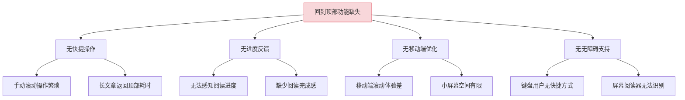
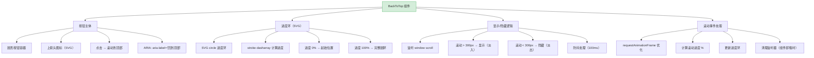
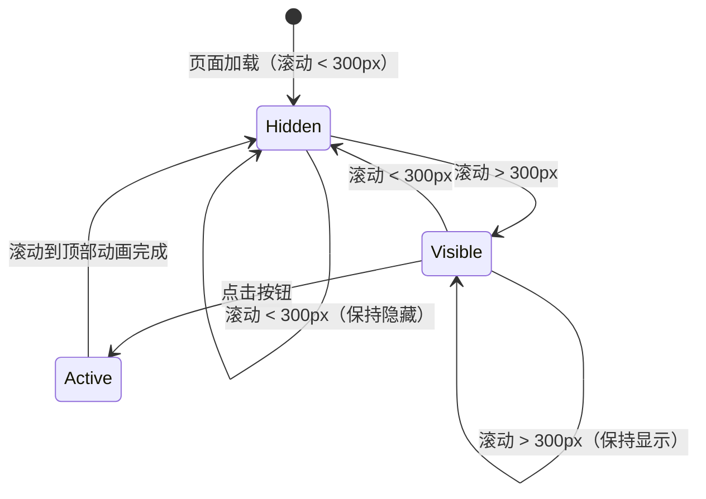

# YK-09-218: 内容回到顶部 — 悬浮回到顶部按钮、滚动进度环、移动端适配与无障碍支持

> 需求编号：YK-09-218 · 优先级：P2 · 人天：0.3d · 状态：需求已编写
> 依赖：YK-09-201（内容贡献者榜单）、YK-09-139（键盘导航优化）

## 背景

### 问题陈述

YiKnowledge 知识库中的长文章内容丰富，用户在阅读到底部后需要返回页面顶部（查看目录、导航或切换文章）时，只能通过手动滚动或浏览器的默认行为。对于 3000 字以上的长文章，手动滚回顶部操作繁琐且体验不佳。

1. **无回到顶部快捷方式**：用户需手动滚动或使用键盘 Home 键
2. **无法感知阅读进度**：用户不知道已阅读了多少内容
3. **移动端体验差**：小屏幕上手动滚动到顶部更加繁琐
4. **无障碍支持不足**：键盘用户和屏幕阅读器用户缺少便捷导航手段
5. **显示时机不当**：固定显示的按钮可能遮挡内容

**核心矛盾**：长文章需要便捷的回到顶部操作，但当前缺乏优雅的 UI 组件和交互设计。

### 影响范围

| # | 影响 | 严重程度 | 典型场景 |
|---|------|----------|----------|
| 1 | 阅读到底部后返回顶部不便 | 高 | 3000 字文章底部，需要滚动 10+ 次 |
| 2 | 无法感知阅读进度 | 中 | 用户不知道文章还剩多少内容 |
| 3 | 移动端滚动疲劳 | 中 | 手机上阅读长文章，拇指频繁滑动 |
| 4 | 键盘用户无快捷方式 | 低 | 纯键盘用户无法快速回到顶部 |
| 5 | 固定按钮遮挡内容 | 低 | 右下角按钮挡住评论区或文章内容 |

### 挑战

| 挑战 | 说明 |
|------|------|
| 显示时机 | 何时显示/隐藏按钮（滚动多少像素后显示） |
| 进度可视化 | 如何优雅地展示阅读进度（圆环 vs 条形 vs 百分比） |
| 移动端适配 | 小屏幕上按钮位置、大小和触摸目标 |
| 无障碍 | 需支持键盘操作和屏幕阅读器语义 |
| 与页面其他浮动元素共存 | 避免与右下角其他按钮（如反馈、分享）重叠 |

---

## 一、现状分析

### 1.1 当前页面滚动支持

```
现有功能:
├── 浏览器默认滚动
│   ├── 鼠标滚轮
│   ├── 键盘 PageUp/PageDown
│   └── 键盘 Home/End
├── 键盘导航优化（YK-09-139）
│   ├── 快捷键系统
│   └── 焦点管理

缺失:
├── 回到顶部按钮                   # ❌ 不存在
├── 滚动进度指示                    # ❌ 不存在
├── 智能显示/隐藏                   # ❌ 不存在
├── 平滑滚动动画                    # ❌ 不存在
├── 移动端适配                      # ❌ 不存在
└── 无障碍语义                      # ❌ 不存在
```

### 1.2 根因分析矩阵



| 根因 | 症状 | 影响 | 优先级 |
|------|------|------|--------|
| 快捷操作缺失 | 手动滚动 | 效率低下 | 高 |
| 进度反馈缺失 | 无感知 | 体验不佳 | 中 |
| 移动端优化缺失 | 体验差 | 移动用户受影响 | 中 |
| 无障碍缺失 | 无法使用 | 特殊用户群体 | 低 |

---

## 二、设计决策

### 决策 1：回到顶部按钮样式

| 选项 | 描述 | 优点 | 缺点 |
|------|------|------|------|
| A: 纯图标按钮 | 圆形按钮，上箭头图标 | 简洁 | 无进度反馈 |
| B: 进度环按钮 | 圆形按钮 + 外围滚动进度环 | 双重功能 | 视觉稍复杂 |
| C: 文字按钮 | "回到顶部"文字按钮 | 语义清晰 | 占用空间大 |
| D: 进度条 + 按钮 | 顶部进度条 + 独立按钮 | 分离清晰 | 两份空间 |

**选择：B（进度环按钮）。** 圆形按钮 + SVG 滚动进度环，将回到顶部和阅读进度合二为一。滚动时外围圆环显示阅读进度（0% - 100%），点击中心箭头回到顶部。这是现代 Web 应用中最优雅的设计模式。

### 决策 2：显示/隐藏时机

| 选项 | 描述 | 优点 | 缺点 |
|------|------|------|------|
| A: 始终显示 | 按钮始终可见 | 始终可操作 | 遮挡内容 |
| B: 滚动 N px 后显示 | 滚动超过阈值（如 300px）后显示 | 避免遮挡 | 阈值需调优 |
| C: 滚动 N% 后显示 | 滚动超过页面 20% 后显示 | 自适应 | 页面高度不同时行为不同 |
| D: 检测滚动方向 | 向上滚动时显示，向下隐藏 | 智能 | 实现稍复杂 |

**选择：B（滚动 300px 后显示）。** 最简单的实现方式。折半视口高度（约 300px）是合理的显示阈值——用户已经开始滚动阅读，可能需要回到顶部。按钮淡入淡出动画，0.3s CSS transition。

### 决策 3：移动端按钮位置和大小

| 选项 | 描述 | 优点 | 缺点 |
|------|------|------|------|
| A: 固定右下角 | 距离右下角 20px | 不干扰内容 | 可能遮挡操作区 |
| B: 固定右侧居中 | 垂直居中于视口右侧 | 醒目 | 可能遮挡内容 |
| C: 跟随底部导航 | 附加在底部导航栏上方 | 不遮挡 | 依赖底部导航 |
| D: 可拖拽位置 | 用户可拖动按钮位置 | 灵活 | 开发成本高 |

**选择：A（固定右下角）。** 桌面端距离右下角 24px，移动端距离右下角 16px。按钮大小桌面端 48x48px，移动端 44x44px（符合触摸目标标准）。设置 z-index: 1000 确保在其他浮动元素之上。

### 决策 4：滚动行为

| 选项 | 描述 | 优点 | 缺点 |
|------|------|------|------|
| A: 瞬间跳转 | scrollTop = 0 | 最快 | 突兀 |
| B: 平滑滚动 | scroll-behavior: smooth | 流畅 | 浏览器兼容性 |
| C: 自定义缓动 | 自定义 JS 缓动动画 | 可控 | 代码量稍多 |

**选择：B（平滑滚动）。** 使用 `window.scrollTo({ top: 0, behavior: 'smooth' })`，浏览器原生支持，性能好，代码简洁。不支持 `smooth` 的浏览器使用 polyfill 或降级为瞬间跳转。

### 设计决策总览

| 决策 | 选项 A | 选项 B | 选择 | 理由 |
|------|--------|--------|------|------|
| 按钮样式 | 纯图标 | 进度环 | **进度环** | 双重功能 |
| 显示时机 | 始终显示 | 滚动阈值 | **300px 阈值** | 简单可靠 |
| 移动端位置 | 右下角 | 右侧居中 | **右下角** | 不干扰阅读 |
| 滚动行为 | 瞬间 | 平滑滚动 | **平滑滚动** | 浏览器原生 |

---

## 三、目标架构

### 3.1 回到顶部按钮布局



### 3.2 按钮显示状态机



### 3.3 架构决策权衡

| 维度 | 改造前 | 改造后 | 权衡说明 |
|------|--------|--------|----------|
| 回到顶部 | 手动滚动 | 一键回到顶部 + 进度 | 便捷 vs 屏幕空间 |
| 进度指示 | 浏览器滚动条 | 进度环 + 百分比 | 额外反馈 vs 视觉复杂度 |
| 移动端 | 无优化 | 右下角适配 | 适配 vs 开发成本 |
| 无障碍 | 无 | ARIA + 键盘 | 包容性 vs 代码量 |

---

## 四、具体改动

### 4.1 改动总览

| 改动点 | 类型 | 涉及文件 | 预估行数 |
|--------|------|---------|---------|
| 回到顶部组件 | 新增 | `components/common/BackToTop.vue` | 120 行 |
| 滚动进度 composable | 新增 | `composables/useScrollProgress.ts` | 60 行 |
| 平滑滚动 composable | 新增 | `composables/useSmoothScroll.ts` | 40 行 |
| 按钮样式 | 新增 | `styles/back-to-top.css` | 60 行 |
| 内容页面集成 | 扩展 | `views/content/ContentPage.vue` | 10 行 |
| 类型定义 | 新增 | `types/scroll.ts` | 30 行 |

### 4.2 涉及文件

```
src/
├── components/common/
│   └── BackToTop.vue                     # 新增：回到顶部按钮组件
├── composables/
│   ├── useScrollProgress.ts              # 新增：滚动进度计算
│   └── useSmoothScroll.ts                # 新增：平滑滚动
├── styles/
│   └── back-to-top.css                   # 新增：按钮样式
├── views/content/
│   └── ContentPage.vue                   # 扩展：集成回到顶部
└── types/
    └── scroll.ts                         # 新增：滚动类型定义
```

### 4.3 核心类型定义

```typescript
// types/scroll.ts

interface ScrollProgress {
  percentage: number;             // 0-100 的滚动百分比
  scrolledPixels: number;        // 已滚动像素数
  totalScrollable: number;       // 可滚动总像素数
  isAtTop: boolean;              // 是否在顶部
  isAtBottom: boolean;           // 是否在底部
}

interface BackToTopOptions {
  showThreshold: number;         // 显示阈值（px），默认 300
  scrollBehavior: ScrollBehavior; // 滚动行为，默认 'smooth'
  position: {
    bottom: number;              // 距底部距离（px）
    right: number;               // 距右侧距离（px）
  };
  size: number;                  // 按钮大小（px）
  zIndex: number;                // 层级
  animationDuration: number;     // 显示/隐藏动画时长（ms）
  progressRing: {
    enabled: boolean;            // 是否显示进度环
    color: string;               // 进度环颜色
    bgColor: string;             // 进度环背景色
    strokeWidth: number;         // 环线宽度
  };
}

interface BackToTopProps {
  showThreshold?: number;
  scrollBehavior?: ScrollBehavior;
  position?: { bottom: number; right: number };
  size?: number;
  showProgress?: boolean;
  ariaLabel?: string;
}

interface BackToTopEmits {
  (e: 'reached-top'): void;
  (e: 'visibility-changed', visible: boolean): void;
}
```

### 4.4 关键交互逻辑

```typescript
// composables/useScrollProgress.ts

import { ref, onMounted, onUnmounted } from 'vue';

export function useScrollProgress() {
  const progress = ref<ScrollProgress>({
    percentage: 0,
    scrolledPixels: 0,
    totalScrollable: 0,
    isAtTop: true,
    isAtBottom: false,
  });

  let rafId: number | null = null;

  function calculate(): void {
    const scrollTop = window.scrollY || document.documentElement.scrollTop;
    const scrollHeight = document.documentElement.scrollHeight;
    const clientHeight = document.documentElement.clientHeight;
    const totalScrollable = scrollHeight - clientHeight;

    progress.value = {
      percentage: totalScrollable > 0
        ? Math.round((scrollTop / totalScrollable) * 100)
        : 0,
      scrolledPixels: scrollTop,
      totalScrollable,
      isAtTop: scrollTop === 0,
      isAtBottom: scrollTop + clientHeight >= scrollHeight - 5,
    };
  }

  function onScroll(): void {
    if (rafId) return;
    rafId = requestAnimationFrame(() => {
      calculate();
      rafId = null;
    });
  }

  onMounted(() => {
    calculate();
    window.addEventListener('scroll', onScroll, { passive: true });
  });

  onUnmounted(() => {
    window.removeEventListener('scroll', onScroll);
    if (rafId) cancelAnimationFrame(rafId);
  });

  return { progress };
}

// composables/useSmoothScroll.ts

export function useSmoothScroll() {
  function scrollToTop(behavior: ScrollBehavior = 'smooth'): void {
    window.scrollTo({ top: 0, behavior });
  }

  function scrollToElement(
    elementId: string,
    behavior: ScrollBehavior = 'smooth',
    offset: number = 0
  ): void {
    const element = document.getElementById(elementId);
    if (element) {
      const top = element.getBoundingClientRect().top + window.scrollY - offset;
      window.scrollTo({ top, behavior });
    }
  }

  return { scrollToTop, scrollToElement };
}
```

```vue
<!-- BackToTop.vue 核心模板 -->
<template>
  <button
    ref="buttonRef"
    :class="['back-to-top', { visible: isVisible }]"
    :aria-label="ariaLabel"
    :title="ariaLabel"
    @click="handleClick"
  >
    <svg :width="size" :height="size" viewBox="0 0 48 48">
      <!-- 进度环背景 -->
      <circle
        cx="24" cy="24" :r="radius"
        fill="none"
        :stroke="bgColor"
        :stroke-width="strokeWidth"
      />
      <!-- 进度环 -->
      <circle
        cx="24" cy="24" :r="radius"
        fill="none"
        :stroke="progressColor"
        :stroke-width="strokeWidth"
        :stroke-dasharray="circumference"
        :stroke-dashoffset="dashOffset"
        stroke-linecap="round"
        transform="rotate(-90 24 24)"
      />
    </svg>
    <!-- 上箭头图标 -->
    <span class="back-to-top__arrow" aria-hidden="true">
      <svg width="20" height="20" viewBox="0 0 20 20">
        <path d="M10 16V4M10 4L4 10M10 4L16 10"
              stroke="currentColor" stroke-width="2"
              fill="none" stroke-linecap="round" stroke-linejoin="round"/>
      </svg>
    </span>
  </button>
</template>
```

---

## 五、实施步骤

| 步骤 | 内容 | 涉及文件 | 验证方式 | 人天 |
|------|------|---------|---------|------|
| 1 | 类型定义 | `types/scroll.ts` | 类型检查通过 | 0.02 |
| 2 | 滚动进度 composable | `composables/useScrollProgress.ts` | 进度计算正确 | 0.04 |
| 3 | 平滑滚动 composable | `composables/useSmoothScroll.ts` | 滚动行为正常 | 0.03 |
| 4 | 回到顶部组件 | `BackToTop.vue` | 按钮交互正常 | 0.08 |
| 5 | 按钮样式 | `styles/back-to-top.css` | 动画流畅、响应式 | 0.05 |
| 6 | 移动端适配 | `BackToTop.vue`（响应式样式） | 移动端显示正常 | 0.04 |
| 7 | 无障碍支持 | `BackToTop.vue`（ARIA） | 屏幕阅读器可识别 | 0.02 |
| 8 | ContentPage 集成 | `ContentPage.vue` | 页面功能正常 | 0.02 |

**总计：0.3d**

---

## 六、测试规格

### 组件测试：BackToTop

#### Scenario: 滚动超过阈值后按钮显示
- **GIVEN** 页面可滚动，showThreshold=300
- **WHEN** 页面滚动 301px
- **THEN** 按钮以淡入动画显示（opacity 0→1）
- **THEN** 进度环显示对应进度

#### Scenario: 滚动不足阈值时按钮隐藏
- **GIVEN** 按钮当前显示，页面滚动到 200px
- **WHEN** 滚动停止
- **THEN** 按钮以淡出动画隐藏（opacity 1→0）

#### Scenario: 点击按钮回到顶部
- **GIVEN** 页面滚动到 800px，按钮可见
- **WHEN** 点击回到顶部按钮
- **THEN** 页面平滑滚动到顶部
- **THEN** 滚动到顶部后按钮隐藏

#### Scenario: 进度环正确反映滚动进度
- **GIVEN** 页面总可滚动 2000px
- **WHEN** 滚动到 1000px（50%）
- **THEN** 进度环显示 50%（stroke-dashoffset = circumference * 0.5）

### composable 测试：useScrollProgress

#### Scenario: 短页面（无滚动条）进度为 0
- **GIVEN** 页面内容高度小于视口高度，无滚动条
- **WHEN** 计算进度
- **THEN** percentage = 0, isAtTop = true, isAtBottom = true

#### Scenario: 滚到底部进度为 100
- **GIVEN** 页面可滚动
- **WHEN** 滚动到底部
- **THEN** percentage = 100, isAtBottom = true

### 无障碍测试：BackToTop

#### Scenario: 键盘操作
- **GIVEN** 按钮可见，键盘用户 Tab 导航到按钮
- **WHEN** 按 Enter 或 Space
- **THEN** 页面滚动到顶部

#### Scenario: 屏幕阅读器语义
- **GIVEN** 屏幕阅读器聚焦到按钮
- **WHEN** 朗读按钮
- **THEN** 朗读 aria-label "回到顶部"

---

## 七、风险与缓解

| 风险 | 概率 | 影响 | 等级 | 缓解措施 | 应急预案 |
|------|------|------|------|----------|----------|
| 与右下角其他浮动按钮重叠 | 中 | 中 | 中 | 设计阶段检查右下角元素，设置合适间距 | 调整按钮位置或 z-index |
| 移动端按钮过小 | 低 | 低 | 低 | 移动端使用 44x44px 最小触摸目标 | CSS 媒体查询调整大小 |
| 滚动性能问题 | 低 | 中 | 低 | requestAnimationFrame + passive 事件 | 降低进度更新频率（每 100ms） |
| 平滑滚动浏览器兼容 | 低 | 低 | 低 | 检测 smooth 支持，降级为 instant | polyfill 或降级 |

---

## 八、回滚策略

| 回滚场景 | 回滚方式 | 影响范围 | 恢复时间 |
|----------|----------|----------|----------|
| 按钮功能异常 | `git revert` 相关提交 | 文章页面 | < 1min |
| 按钮遮挡内容 | 调整 position CSS | 文章页面右下角 | < 2min |
| 滚动监听性能问题 | 移除组件引用 | 文章页面滚动 | < 1min |

**回滚验证：**
- 回滚后内容页面正常渲染
- 回滚后滚动行为不受影响
- 回滚后右下角区域恢复正常

---

## 九、设计决策记录

### D-01: 为什么选择进度环而非独立进度条？

进度环将回到顶部和阅读进度合二为一，节省屏幕空间。独立进度条（通常在页面顶部）需要额外的屏幕空间，且与回到顶部按钮功能分离，用户需要在两个位置操作。进度环是一个紧凑的、自包含的 UI 组件。

### D-02: 为什么 300px 作为显示阈值？

300px 约等于一般视口高度（600-900px）的 1/3 到 1/2。当用户滚动超过这个距离时，说明已经开始深度阅读，可能需要回到顶部。阈值可配置（通过 props），用户项目可自定义。

### D-03: 为什么移动端按钮大小设为 44x44px？

Apple HIG 和 Material Design 都推荐最小触摸目标为 44x44dp。低于此大小的按钮在移动端难以准确点击。桌面端使用 48x48px 视觉上更舒适，也符合 Apple HIG 建议的 44x44pt。

### D-04: 为什么使用 requestAnimationFrame 而非直接监听 scroll？

scroll 事件触发频率很高（可达 60fps+），直接处理可能导致性能问题。requestAnimationFrame 将进度计算限制在浏览器渲染帧率（通常 60fps），避免不必要的计算和重绘。配合 passive: true 进一步提升滚动性能。

---

## 十、可观测性

### 关键指标

| 指标 | 采集方式 | 告警阈值 | 说明 |
|------|---------|---------|------|
| 按钮点击率 | 统计 click 事件 | — | 功能使用频率 |
| 滚动到底部率 | 统计 isAtBottom 事件 | — | 内容完读率指标 |
| 移动端使用率 | 统计 userAgent | — | 移动端适配优先级 |
| 进度环渲染帧率 | PerformanceObserver | < 30fps | 滚动性能问题 |

### 日志规范

| 日志级别 | 场景 | 示例 |
|---------|------|------|
| `INFO` | 按钮点击 | `[BackToTop] Scroll to top triggered from ${scrollY}px` |
| `INFO` | 可见性变化 | `[BackToTop] Button visibility: ${visible}` |
| `WARN` | 滚动性能 | `[BackToTop] Slow scroll frame: ${duration}ms` |

---

## 十一、代码审查检查清单

- [ ] 进度环 SVG 在 0% 和 100% 时渲染正确
- [ ] 按钮显示/隐藏动画流畅（CSS transition）
- [ ] 移动端按钮大小 >= 44x44px
- [ ] ARIA label 正确设置
- [ ] 键盘 Enter/Space 触发回到顶部
- [ ] 组件卸载时 scroll 监听器正确清理
- [ ] requestAnimationFrame 正确取消
- [ ] 无 ESLint/Prettier 告警

---

## 回归问题预测

| # | 问题 | 发现场景 | 根因 | 修复方式 |
|---|------|---------|------|---------|
| 1 | 动态加载内容后进度环不准确 | 文章通过 AJAX 加载更多内容 | scrollHeight 变化后进度未更新 | 内容变化时重新计算进度 |
| 2 | 移动端按钮被软键盘遮挡 | 移动端输入评论时弹出软键盘 | 视口变化未处理 | 检测 visualViewport 变化，调整按钮位置 |
| 3 | 进度环在打印时可见 | 打印页面时按钮仍在 | @media print 未处理 | CSS @media print 隐藏按钮 |
| 4 | 多个页面共享同一个按钮实例 | SPA 路由切换时组件未重新挂载 | 组件缓存 | 路由切换时重置进度和可见性 |
| 5 | 滚动到底部后百分比不是 100 | 底部有 footer 或 padding | totalScrollable 计算不精确 | 使用精确的 scrollHeight - clientHeight |
| 6 | 深色模式下进度环颜色不合适 | 切换深色模式后进度环不可见 | 颜色未适配深色模式 | CSS 变量适配深色模式颜色 |

---

## 性能分析

### 组件渲染性能

| 指标 | 无按钮 | 有 BackToTop 按钮 | 说明 |
|------|--------|-----------------|------|
| 首屏渲染 | — | +2ms（按钮初始化） | 可忽略 |
| 滚动帧率 | 60fps | 58-60fps（rAF 优化） | 几乎无影响 |
| 按钮动画帧率 | — | 60fps（CSS transition） | 硬件加速 |

### 内存分析

| 数据结构 | 大小 | 说明 |
|---------|------|------|
| ScrollProgress 对象 | ~100 bytes | 单个 ref 对象 |
| SVG 进度环 DOM | ~500 bytes | 内联 SVG |
| 事件监听器 | ~200 bytes | scroll 监听器 + rAF |

### 网络请求分析

| 操作 | API 调用 | 说明 |
|------|---------|------|
| 组件加载 | 无额外请求 | 纯前端组件 |
| 按钮交互 | 无网络请求 | 纯客户端操作 |

---

*PRD 来源: `projects/yiknowledge/requirements/2026-09/00-需求-需求总览.md`*