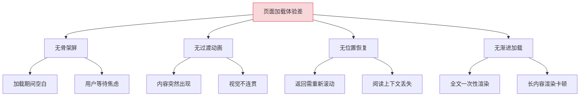
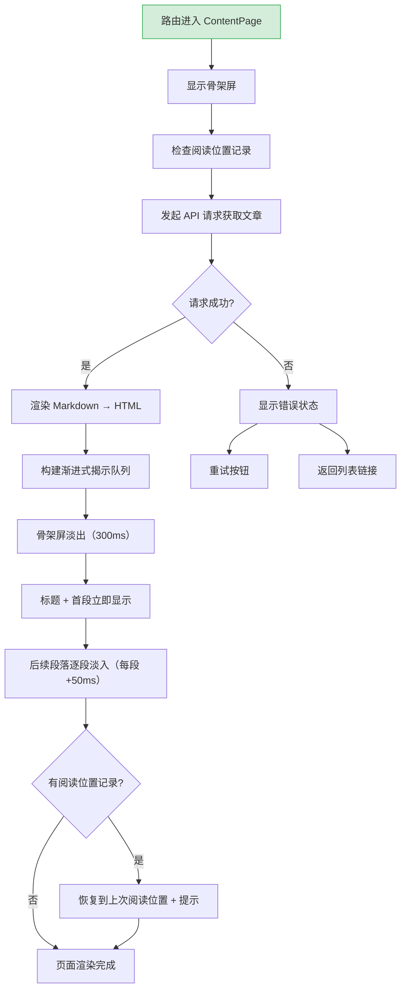
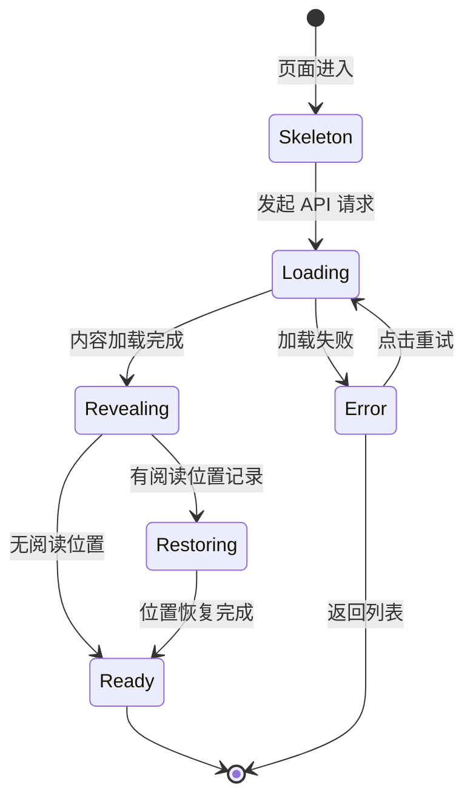

# YK-09-219: 内容页面加载动画 — 骨架屏内容、渐进式揭示、阅读位置恢复与平滑页面进入

> 需求编号：YK-09-219 · 优先级：P2 · 人天：0.3d · 状态：需求已编写
> 依赖：YK-09-217（内容章节折叠）、YK-09-34（骨架屏与加载模式库）

## 背景

### 问题陈述

YiKnowledge 知识库中的内容页面通过 API 异步加载，当前加载过程中页面呈现空白或简单的 spinner，等待体验差。加载完成后内容突然出现，缺乏平滑过渡。此外，用户从列表页返回已读文章时，阅读位置丢失，需要重新滚动定位。

1. **加载体验空白**：内容加载期间页面空白或仅显示 spinner
2. **内容突然出现**：加载完成后内容一次性渲染，无过渡效果
3. **阅读位置丢失**：返回已读文章时无法恢复到上次阅读位置
4. **渐进式加载缺失**：无法优先渲染标题和首段，后渲染全文
5. **加载状态不清晰**：用户不知道加载进度或预估等待时间

**核心矛盾**：异步加载的内容页面需要愉悦的等待体验和平滑的过渡，但当前缺乏骨架屏和渐进式渲染。

### 影响范围

| # | 影响 | 严重程度 | 典型场景 |
|---|------|----------|----------|
| 1 | 加载期间页面空白 | 高 | 网络较慢时用户看到白屏 3-5 秒 |
| 2 | 内容突然出现无过渡 | 中 | 加载完成后内容"闪现"在页面上 |
| 3 | 阅读位置丢失 | 中 | 从文章详情返回列表再点击，需重新滚动 |
| 4 | 长内容一次性渲染卡顿 | 低 | 10000 字文章渲染时页面短暂冻结 |
| 5 | 加载失败无友好提示 | 低 | 网络错误时仅显示空白 |

### 挑战

| 挑战 | 说明 |
|------|------|
| 骨架屏布局准确 | 骨架屏需要与实际内容布局一致，避免布局抖动 |
| 渐进式渲染与 SEO | 首屏渲染需要考虑搜索引擎抓取 |
| 阅读位置恢复精确 | 需要精确恢复到上次阅读的段落位置 |
| 与 SSR/SSG 兼容 | 如果后续引入服务端渲染，动画需要兼容 |

---

## 一、现状分析

### 1.1 当前内容页面加载

```
现有功能:
├── 骨架屏与加载模式库（YK-09-34）
│   ├── 通用骨架屏组件
│   └── 加载状态模式
├── 异步数据获取
│   ├── API 请求文章内容
│   └── Markdown → HTML 渲染

缺失:
├── 文章专用骨架屏                # ❌ 不存在
├── 渐进式内容揭示                 # ❌ 不存在
├── 阅读位置记录与恢复             # ❌ 不存在
├── 平滑页面进入动画               # ❌ 不存在
├── 加载进度指示                   # ❌ 不存在
└── 首屏优先级渲染                 # ❌ 不存在
```

### 1.2 根因分析矩阵



| 根因 | 症状 | 影响 | 优先级 |
|------|------|------|--------|
| 骨架屏缺失 | 加载空白 | 体验差 | 高 |
| 过渡动画缺失 | 内容闪现 | 视觉不连贯 | 高 |
| 位置恢复缺失 | 重新滚动 | 效率低下 | 中 |
| 渐进加载缺失 | 渲染卡顿 | 性能 | 中 |

---

## 二、设计决策

### 决策 1：骨架屏设计

| 选项 | 描述 | 优点 | 缺点 |
|------|------|------|------|
| A: 通用骨架屏 | 统一的骨架屏布局 | 简单 | 不匹配文章结构 |
| B: 文章结构骨架屏 | 模拟文章标题、段落、图片 | 视觉匹配 | 需针对文章设计 |
| C: 自适应骨架屏 | 根据文章 frontmatter 动态调整 | 精准 | 实现复杂 |
| D: Shimmer 骨架屏 | 带光泽动画的骨架屏 | 视觉好 | 性能开销稍高 |

**选择：B（文章结构骨架屏）+ D（Shimmer 动画）。** 骨架屏模拟文章典型结构：标题行（宽长条）、元数据行（短条）、多个段落行（不同宽度）、可选的图片占位。添加浅色 shimmer 动画（从左到右的光泽扫过），让用户感知到加载正在进行。

### 决策 2：内容揭示方式

| 选项 | 描述 | 优点 | 缺点 |
|------|------|------|------|
| A: 一次性渲染 | 全部渲染后一次性显示 | 简单 | 突兀 |
| B: 淡入动画 | 整体淡入 | 过渡自然 | 全文同时出现 |
| C: 渐进式揭示 | 逐段淡入，延迟递增 | 最流畅 | 实现稍复杂 |
| D: 视口触发 | 滚动到视口时淡入 | 性能好 | 失去整体过渡感 |

**选择：C（渐进式揭示）。** 内容加载后，标题和首段立即显示，后续段落和章节以 50ms 递增的延迟逐段淡入（从 opacity 0 到 1，translateY 10px → 0）。整体过渡在 500ms 内完成，给用户内容"展开"的视觉感受。

### 决策 3：阅读位置恢复策略

| 选项 | 描述 | 优点 | 缺点 |
|------|------|------|------|
| A: 不恢复 | 每次从顶部开始 | 简单 | 体验差 |
| B: 滚动到上次位置 | 记录 scrollTop 并恢复 | 精确 | 可能因布局变化不准 |
| C: 锚点恢复 | 记录最近的标题锚点 | 布局变化不影响 | 精度稍低 |
| D: 混合恢复 | 记录锚点 + 偏移量 | 最精确 | 实现复杂 |

**选择：D（混合恢复）。** 记录用户离开时的最近可见标题锚点和相对该标题的偏移量。恢复时先滚动到锚点位置，再微调偏移量。同时显示一个短暂的"恢复阅读位置"提示（3 秒后自动消失），告知用户已恢复到上次位置。

### 决策 4：页面进入过渡

| 选项 | 描述 | 优点 | 缺点 |
|------|------|------|------|
| A: 无过渡 | 路由切换立即显示 | 简单 | 突兀 |
| B: 页面整体淡入 | 路由切换后整体淡入 | 自然 | 等待时间略长 |
| C: 路由过渡动画 | Vue Router transition | 框架支持 | 需配置 |

**选择：B（页面整体淡入）。** 使用 CSS transition 实现页面从 opacity 0 → 1 的淡入效果（300ms）。配合骨架屏：先生成骨架屏 → 数据加载 → 骨架屏淡出 + 内容淡入（crossfade 效果）。

### 设计决策总览

| 决策 | 选项 A | 选项 B | 选择 | 理由 |
|------|--------|--------|------|------|
| 骨架屏 | 通用 | 文章结构 + Shimmer | **文章结构 + Shimmer** | 视觉匹配 + 加载感知 |
| 内容揭示 | 一次性 | 渐进式 | **渐进式** | 平滑过渡 |
| 位置恢复 | 不恢复 | 混合恢复 | **混合恢复** | 精确 + 健壮 |
| 页面进入 | 无过渡 | 整体淡入 | **整体淡入 + crossfade** | 连贯体验 |

---

## 三、目标架构

### 3.1 页面加载流程



### 3.2 加载状态机



### 3.3 架构决策权衡

| 维度 | 改造前 | 改造后 | 权衡说明 |
|------|--------|--------|----------|
| 加载体验 | 空白/spinner | 骨架屏 + Shimmer | 视觉反馈 vs 开发成本 |
| 内容出现 | 突然闪现 | 渐进式揭示 | 流畅 vs 等待时间 |
| 位置恢复 | 无 | 锚点 + 偏移混合 | 体验 vs 实现复杂度 |
| 页面进入 | 无过渡 | 骨架屏 crossfade | 连贯 vs 首屏渲染时间 |

---

## 四、具体改动

### 4.1 改动总览

| 改动点 | 类型 | 涉及文件 | 预估行数 |
|--------|------|---------|---------|
| 文章骨架屏组件 | 新增 | `components/skeleton/ArticleSkeleton.vue` | 80 行 |
| 渐进揭示组件 | 新增 | `components/content/ProgressiveReveal.vue` | 80 行 |
| 阅读位置 composable | 新增 | `composables/useReadingPosition.ts` | 70 行 |
| 页面过渡 composable | 新增 | `composables/usePageTransition.ts` | 50 行 |
| 内容加载状态管理 | 新增 | `composables/useContentLoader.ts` | 60 行 |
| 骨架屏样式 | 新增 | `styles/article-skeleton.css` | 60 行 |
| 过渡动画样式 | 新增 | `styles/page-transition.css` | 50 行 |
| 内容页面集成 | 扩展 | `views/content/ContentPage.vue` | 60 行 |
| 类型定义 | 新增 | `types/loading.ts` | 40 行 |

### 4.2 涉及文件

```
src/
├── components/skeleton/
│   └── ArticleSkeleton.vue               # 新增：文章骨架屏
├── components/content/
│   └── ProgressiveReveal.vue             # 新增：渐进式揭示
├── composables/
│   ├── useReadingPosition.ts             # 新增：阅读位置管理
│   ├── usePageTransition.ts              # 新增：页面过渡
│   └── useContentLoader.ts               # 新增：内容加载状态
├── styles/
│   ├── article-skeleton.css              # 新增：骨架屏样式
│   └── page-transition.css               # 新增：过渡动画样式
├── views/content/
│   └── ContentPage.vue                   # 扩展：集成加载动画
└── types/
    └── loading.ts                        # 新增：加载类型定义
```

### 4.3 核心类型定义

```typescript
// types/loading.ts

type LoadingPhase = 'skeleton' | 'loading' | 'revealing' | 'restoring' | 'ready' | 'error';

interface ContentLoadState {
  phase: LoadingPhase;
  progress: number;              // 0-100
  error: string | null;
  retryCount: number;
}

interface ReadingPosition {
  articlePath: string;
  anchorId: string | null;       // 最近的标题锚点
  offsetFromAnchor: number;      // 相对于锚点的滚动偏移（px）
  scrollPercentage: number;      // 滚动百分比
  timestamp: number;
  snippet?: string;              // 锚点标题文本快照
}

interface ProgressiveRevealQueue {
  totalItems: number;
  revealedItems: number;
  items: RevealItem[];
}

interface RevealItem {
  selector: string;              // CSS 选择器
  delay: number;                 // 揭示延迟（ms）
  duration: number;              // 动画时长（ms）
  status: 'pending' | 'animating' | 'revealed';
}

interface SkeletonConfig {
  titleLines: number;            // 标题行数
  paragraphLines: number;        // 段落行数
  paragraphGroups: number;       // 段落组数
  showMetadata: boolean;         // 是否显示元数据骨架
  showImage: boolean;            // 是否显示图片占位
  imageAspectRatio: string;      // 图片占位宽高比
}

interface PageTransitionOptions {
  enterDuration: number;         // 进入动画时长（ms）
  leaveDuration: number;         // 离开动画时长（ms）
  skeletonFadeDuration: number;  // 骨架屏淡出时长（ms）
  contentFadeDuration: number;   // 内容淡入时长（ms）
}
```

### 4.4 关键交互逻辑

```typescript
// composables/useReadingPosition.ts

const POSITION_STORAGE_PREFIX = 'yk_reading_pos_';
const MAX_POSITIONS = 50; // 最多保存 50 个文章位置

export function useReadingPosition() {
  function savePosition(articlePath: string): void {
    const anchor = findNearestVisibleAnchor();
    const scrollTop = window.scrollY;

    const position: ReadingPosition = {
      articlePath,
      anchorId: anchor?.id || null,
      offsetFromAnchor: anchor
        ? scrollTop - anchor.getBoundingClientRect().top - window.scrollY
        : 0,
      scrollPercentage: calculateScrollPercentage(),
      timestamp: Date.now(),
      snippet: anchor?.textContent?.substring(0, 100) || null,
    };

    try {
      const key = `${POSITION_STORAGE_PREFIX}${articlePath}`;
      localStorage.setItem(key, JSON.stringify(position));
      pruneOldPositions();
    } catch {
      // 静默失败
    }
  }

  function restorePosition(articlePath: string): boolean {
    try {
      const key = `${POSITION_STORAGE_PREFIX}${articlePath}`;
      const stored = localStorage.getItem(key);
      if (!stored) return false;

      const position: ReadingPosition = JSON.parse(stored);
      if (Date.now() - position.timestamp > 30 * 24 * 60 * 60 * 1000) {
        // 30 天过期
        localStorage.removeItem(key);
        return false;
      }

      if (position.anchorId) {
        const anchor = document.getElementById(position.anchorId);
        if (anchor) {
          anchor.scrollIntoView({ behavior: 'instant' });
          window.scrollBy(0, position.offsetFromAnchor);
          return true;
        }
      }

      // 降级：按百分比恢复
      const targetY = (position.scrollPercentage / 100) *
        (document.documentElement.scrollHeight - window.innerHeight);
      window.scrollTo({ top: targetY, behavior: 'instant' });
      return true;
    } catch {
      return false;
    }
  }

  function findNearestVisibleAnchor(): Element | null {
    const headings = document.querySelectorAll('h1[id], h2[id], h3[id]');
    const viewportTop = window.scrollY;

    let nearest: Element | null = null;
    let minDistance = Infinity;

    headings.forEach(h => {
      const rect = h.getBoundingClientRect();
      const distance = Math.abs(rect.top + viewportTop - viewportTop);
      if (distance < minDistance) {
        minDistance = distance;
        nearest = h;
      }
    });

    return nearest;
  }

  function pruneOldPositions(): void {
    const keys = Object.keys(localStorage)
      .filter(k => k.startsWith(POSITION_STORAGE_PREFIX));

    if (keys.length > MAX_POSITIONS) {
      const sorted = keys
        .map(k => ({ key: k, data: JSON.parse(localStorage.getItem(k) || '{}') }))
        .sort((a, b) => (a.data.timestamp || 0) - (b.data.timestamp || 0));

      const toRemove = sorted.slice(0, keys.length - MAX_POSITIONS);
      toRemove.forEach(item => localStorage.removeItem(item.key));
    }
  }

  function calculateScrollPercentage(): number {
    const scrollTop = window.scrollY;
    const total = document.documentElement.scrollHeight - window.innerHeight;
    return total > 0 ? Math.round((scrollTop / total) * 100) : 0;
  }

  return { savePosition, restorePosition };
}

// composables/useContentLoader.ts

export function useContentLoader() {
  const state = ref<ContentLoadState>({
    phase: 'skeleton',
    progress: 0,
    error: null,
    retryCount: 0,
  });

  function startLoading(): void {
    state.value = { phase: 'loading', progress: 0, error: null, retryCount: 0 };
  }

  function updateProgress(progress: number): void {
    state.value.progress = Math.min(100, Math.max(0, progress));
  }

  function startRevealing(): void {
    state.value.phase = 'revealing';
    state.value.progress = 100;
  }

  function ready(): void {
    state.value.phase = 'ready';
  }

  function error(message: string): void {
    state.value = { ...state.value, phase: 'error', error: message };
  }

  function retry(): void {
    state.value = {
      phase: 'loading',
      progress: 0,
      error: null,
      retryCount: state.value.retryCount + 1,
    };
  }

  return { state, startLoading, updateProgress, startRevealing, ready, error, retry };
}
```

---

## 五、实施步骤

| 步骤 | 内容 | 涉及文件 | 验证方式 | 人天 |
|------|------|---------|---------|------|
| 1 | 类型定义 | `types/loading.ts` | 类型检查通过 | 0.02 |
| 2 | 内容加载状态 composable | `composables/useContentLoader.ts` | 状态流转正确 | 0.04 |
| 3 | 文章骨架屏组件 | `ArticleSkeleton.vue` | 骨架屏渲染正确 | 0.05 |
| 4 | 骨架屏样式 + Shimmer | `styles/article-skeleton.css` | 动画流畅 | 0.04 |
| 5 | 渐进揭示组件 | `ProgressiveReveal.vue` | 逐段淡入正确 | 0.05 |
| 6 | 阅读位置 composable | `composables/useReadingPosition.ts` | 保存/恢复正确 | 0.04 |
| 7 | 页面过渡 composable | `composables/usePageTransition.ts` | crossfade 流畅 | 0.03 |
| 8 | ContentPage 集成 | `ContentPage.vue` | 完整流程正常 | 0.03 |

**总计：0.3d**

---

## 六、测试规格

### 组件测试：ArticleSkeleton

#### Scenario: 骨架屏基本渲染
- **GIVEN** 页面正在加载文章
- **WHEN** 渲染 ArticleSkeleton
- **THEN** 显示 1 个标题占位条（宽 60%）、3 组段落占位条（不同宽度）
- **THEN** 显示元数据占位（日期、标签位置）
- **THEN** Shimmer 动画从左到右循环播放

#### Scenario: 骨架屏无障碍
- **GIVEN** 骨架屏渲染
- **THEN** 包含 `aria-busy="true"` 属性
- **THEN** 包含 `aria-label="内容加载中"` 属性

### 组件测试：ProgressiveReveal

#### Scenario: 渐进式揭示内容
- **GIVEN** 内容加载完成，有 5 个段落
- **WHEN** 渲染 ProgressiveReveal
- **THEN** 第 1 段立即显示（delay=0ms）
- **THEN** 第 2 段 50ms 后显示
- **THEN** 第 3 段 100ms 后显示
- **THEN** 所有段落 250ms 内完成显示

#### Scenario: 用户滚动时跳过延迟
- **GIVEN** 渐进揭示正在进行中
- **WHEN** 用户主动滚动
- **THEN** 剩余段落立即显示（跳过延迟）

### composable 测试：useReadingPosition

#### Scenario: 保存和恢复阅读位置
- **GIVEN** 用户在文章 60% 位置，最近的标题是 "## 核心概念"
- **WHEN** 离开页面（保存位置）
- **THEN** localStorage 保存 {articlePath, anchorId, offsetFromAnchor, scrollPercentage}
- **WHEN** 重新进入同一文章
- **THEN** 页面自动滚动到 60% 位置，"核心概念"标题可见

#### Scenario: 阅读位置过期清理
- **GIVEN** 阅读位置记录超过 30 天
- **WHEN** 尝试恢复位置
- **THEN** 位置不恢复，localStorage 中对应记录被删除

### 集成测试：ContentPage 加载流程

#### Scenario: 完整加载流程
- **GIVEN** 用户点击文章链接
- **WHEN** 页面加载
- **THEN** 先显示骨架屏 → API 请求 → 骨架屏淡出 + 内容渐进淡入 → 恢复阅读位置（如有）
- **THEN** 整个过程在 1.5 秒内完成（本地网络）

#### Scenario: 加载失败重试
- **GIVEN** API 请求失败
- **WHEN** 显示错误状态
- **THEN** 显示"加载失败"提示 + "重试"按钮 + "返回列表"链接
- **WHEN** 点击重试
- **THEN** 重新发起 API 请求

---

## 七、风险与缓解

| 风险 | 概率 | 影响 | 等级 | 缓解措施 | 应急预案 |
|------|------|------|------|----------|----------|
| 渐进揭示动画在低端设备卡顿 | 中 | 中 | 中 | 检测设备性能，低端设备减少动画 | 低端设备使用整体淡入替代 |
| 阅读位置恢复不精确 | 中 | 低 | 低 | 锚点 + 偏移双重恢复 | 降级为百分比滚动 |
| 骨架屏与实际内容布局不一致 | 低 | 中 | 低 | 骨架屏设计对标内容布局 | 骨架屏 → 内容过渡时无 layout shift |
| localStorage 位置数据过大 | 低 | 低 | 低 | 最多 50 条，30 天过期 | LRU 淘汰旧数据 |

---

## 八、回滚策略

| 回滚场景 | 回滚方式 | 影响范围 | 恢复时间 |
|----------|----------|----------|----------|
| 加载动画异常 | `git revert` 相关提交 | 文章页面加载 | < 1min |
| 位置恢复导致滚动异常 | 禁用位置恢复 | 页面初始滚动 | < 2min |
| 骨架屏布局错乱 | CSS 修复 | 加载状态 UI | < 5min |

**回滚验证：**
- 回滚后内容页面正常加载（回到 spinner 模式）
- 回滚后文章渲染不受影响
- 回滚后 localStorage 位置数据保留（下次可用）

---

## 九、设计决策记录

### D-01: 为什么选择文章结构骨架屏而非通用骨架屏？

通用骨架屏（统一的矩形占位）虽然简单，但与文章实际布局不匹配，骨架屏到内容的过渡会产生明显的布局偏移（layout shift），影响 Core Web Vitals 中的 CLS 评分。文章结构骨架屏模拟标题、段落、元数据的实际布局，过渡更自然。

### D-02: 为什么渐进式揭示延迟设为 50ms 递增？

50ms 是人眼能感知的最小延迟单位。以 50ms 递增（0ms、50ms、100ms、150ms...）使得中等长度文章（5-10 个段落）在 500ms 内完成揭示，既给用户内容"展开"的视觉感受，又不会让等待过长。文章过长时（20+ 段落），滚动自动跳过剩余动画。

### D-03: 为什么阅读位置使用锚点 + 偏移而非纯 scrollTop？

纯 scrollTop 在页面内容发生变化时（如新增评论、动态广告加载）会不准确。锚点是稳定的 DOM 标识，即使页面高度变化，锚点位置也相对稳定。偏移量用于微调，使恢复位置更精确。

### D-04: 为什么阅读位置 30 天过期？

阅读位置对时效性敏感。用户 30 天后重新访问同一文章时，文章内容可能已更新，旧位置不再有意义。30 天也是 localStorage 容量管理的合理周期，配合最多 50 条的限制。

---

## 十、可观测性

### 关键指标

| 指标 | 采集方式 | 告警阈值 | 说明 |
|------|---------|---------|------|
| 骨架屏显示时间 | phase='loading' 时长 | > 3s | API 响应慢 |
| 渐进揭示完成时间 | phase='revealing' → 'ready' | > 1s | 动画过长 |
| 阅读位置恢复成功率 | restorePosition 返回值 | < 70% | 位置记录不准确 |
| 加载错误率 | phase='error' 次数 | > 5% | API 稳定性问题 |
| CLS 评分 | Web Vitals API | > 0.1 | 骨架屏到内容有布局偏移 |

### 日志规范

| 日志级别 | 场景 | 示例 |
|---------|------|------|
| `INFO` | 加载开始 | `[ContentLoader] Loading: ${articlePath}` |
| `INFO` | 加载完成 | `[ContentLoader] Ready: ${articlePath} in ${ms}ms` |
| `INFO` | 位置恢复 | `[ReadingPosition] Restored: ${articlePath}, anchor=${anchorId}` |
| `ERROR` | 加载失败 | `[ContentLoader] Error: ${articlePath}, ${error}` |

---

## 十一、代码审查检查清单

- [ ] ArticleSkeleton 渲染与实际内容布局一致（避免 CLS）
- [ ] Shimmer 动画性能良好（GPU 加速）
- [ ] ProgressiveReveal 渐进延迟正确递增
- [ ] 用户滚动时跳过剩余动画
- [ ] 阅读位置保存和恢复逻辑正确
- [ ] 骨架屏包含正确的 ARIA 属性
- [ ] 加载失败时错误状态完整展示
- [ ] 重试按钮功能正常
- [ ] 无 ESLint/Prettier 告警

---

## 回归问题预测

| # | 问题 | 发现场景 | 根因 | 修复方式 |
|---|------|---------|------|---------|
| 1 | 骨架屏到内容切换时布局偏移 | 骨架屏高度与内容高度不一致 | 骨架屏未匹配实际行高 | 使用与内容相同的 line-height 和 font-size |
| 2 | 渐进揭示中图片加载延迟导致体验差 | 图片在段落后才加载 | 图片未预加载 | 骨架屏阶段预加载图片 |
| 3 | 阅读位置恢复到被折叠的章节 | 上次阅读的章节被折叠功能折叠 | 折叠状态与位置恢复冲突 | 恢复位置前自动展开目标章节 |
| 4 | 页面离开时未保存阅读位置 | 用户快速关闭页面 | beforeunload 未触发 | 使用 visibilitychange 事件 + 定期自动保存 |
| 5 | 渐进揭示在深色模式下动画不自然 | 深色模式下淡入效果过于明显 | 颜色对比度高 | 深色模式下调低动画 opacity 起始值 |
| 6 | localStorage 清理过于激进导致位置丢失 | 清理策略删除了近期使用的位置 | LRU 算法按时间排序 | 保留最近 50 条而非按时间淘汰 |

---

## 性能分析

### 组件渲染性能

| 指标 | 无加载动画 | 带加载动画 | 说明 |
|------|----------|----------|------|
| 骨架屏渲染 | — | ~30ms | ArticleSkeleton 纯 CSS |
| Shimmer 动画帧率 | — | 60fps | CSS animation，GPU 加速 |
| 渐进揭示渲染 | — | ~50ms（10 段落） | DOM 操作 + CSS transition |
| 位置恢复 | — | ~20ms | scrollTo + 可选滚动动画 |

### 内存分析

| 数据结构 | 大小 | 说明 |
|---------|------|------|
| ContentLoadState | ~200 bytes | ref 对象 |
| ReadingPosition | ~300 bytes | 单条位置记录 |
| localStorage（50 条位置） | ~15KB | 阅读位置缓存 |

### 网络请求分析

| 操作 | API 调用 | 说明 |
|------|---------|------|
| 页面加载 | 1（getArticle） | 无额外请求 |
| 图片预加载 | 0-N（文章内图片） | 骨架屏阶段触发 |

---

*PRD 来源: `projects/yiknowledge/requirements/2026-09/00-需求-需求总览.md`*