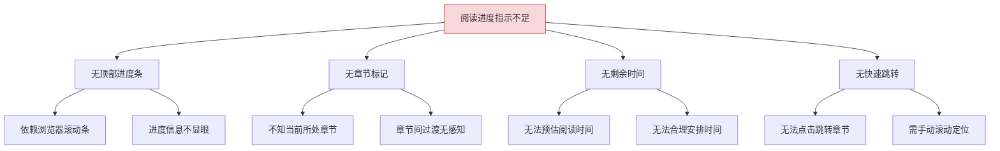
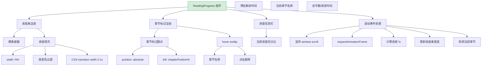
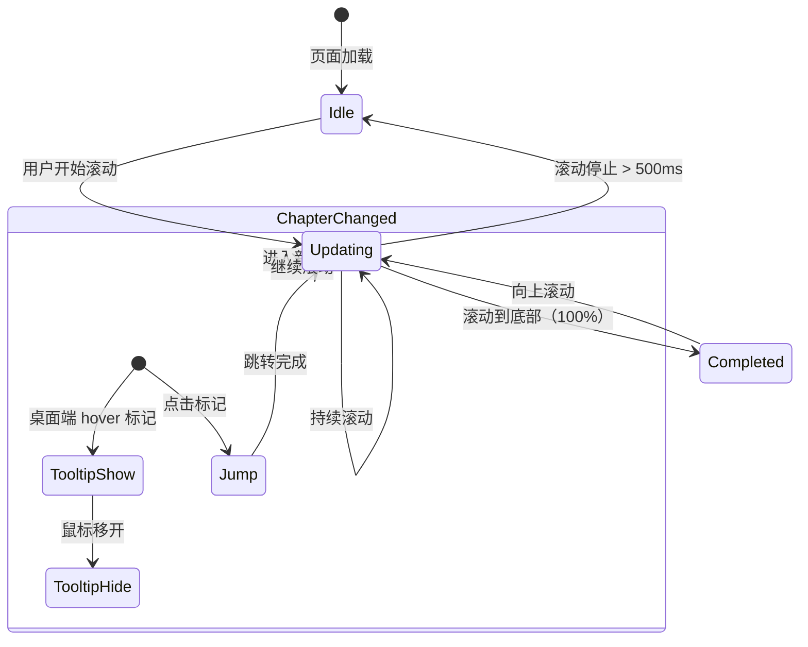

# YK-09-220: 内容滚动进度条 — 顶部阅读进度指示、章节标记、预估剩余时间与点击跳转

> 需求编号：YK-09-220 · 优先级：P2 · 人天：0.3d · 状态：需求已编写
> 依赖：YK-09-217（内容章节折叠）、YK-09-218（内容回到顶部）

## 背景

### 问题陈述

YiKnowledge 知识库中的长文章缺少阅读进度指示。虽然有浏览器默认的滚动条，但不够显眼且无法传达丰富的阅读上下文（如当前章节、预估剩余阅读时间）。用户在阅读长文章时需要一种直观的方式来感知阅读进度和剩余内容量。

1. **阅读进度不可见**：仅靠浏览器滚动条无法直观感知已读百分比
2. **章节位置不清晰**：不知道当前处于文章的哪个章节
3. **剩余阅读时间未知**：用户无法判断是否需要预留更多时间完成阅读
4. **无法快速跳转到章节**：需要通过目录树或手动滚动定位章节
5. **进度指示不连续**：页面刷新后进度重置

**核心矛盾**：长文章需要多层次（整体进度 + 章节位置 + 剩余时间）的阅读进度反馈，而当前仅有浏览器默认滚动条。

### 影响范围

| # | 影响 | 严重程度 | 典型场景 |
|---|------|----------|----------|
| 1 | 阅读进度不可见 | 高 | 5000 字文章，用户不知道读到一半还是快完了 |
| 2 | 章节导航不便 | 中 | 想跳到"总结"章节，只能手动滚动查找 |
| 3 | 阅读时间不可预估 | 中 | 用户不知道文章还需要多长时间读完 |
| 4 | 阅读动机不足 | 低 | 缺少进度感导致阅读动力不足 |
| 5 | 返回文章进度丢失 | 低 | 重新打开文章从头开始，不知道上次读到哪 |

### 挑战

| 挑战 | 说明 |
|------|------|
| 章节标记精度 | 如何在进度条上准确标记章节位置 |
| 剩余时间估算 | 如何准确估算基于用户阅读速度的剩余时间 |
| 进度条性能 | 频繁更新进度条时的渲染性能 |
| 与固定导航栏的关系 | 进度条与页面固定导航栏的层级和位置关系 |

---

## 一、现状分析

### 1.1 当前阅读进度支持

```
现有功能:
├── 浏览器默认滚动条
│   ├── 滚动条位置
│   └── 滚动条大小（反映内容占比）
├── 内容章节折叠（YK-09-217）
│   ├── 章节结构
│   └── 锚点 ID
├── 回到顶部按钮（YK-09-218）
│   ├── 滚动进度环
│   └── 平滑滚动

缺失:
├── 顶部阅读进度条                # ❌ 不存在
├── 章节位置标记                  # ❌ 不存在
├── 预估剩余阅读时间               # ❌ 不存在
├── 进度条点击跳转                 # ❌ 不存在
├── 章节标签提示                   # ❌ 不存在
└── 阅读进度持久化                 # ❌ 不存在（YK-09-219 中用位置恢复）
```

### 1.2 根因分析矩阵



| 根因 | 症状 | 影响 | 优先级 |
|------|------|------|--------|
| 顶部进度条缺失 | 进度不直观 | 阅读体验差 | 高 |
| 章节标记缺失 | 定位困难 | 导航不便 | 中 |
| 剩余时间缺失 | 无法预估 | 时间管理差 | 中 |
| 快速跳转缺失 | 手动滚动 | 效率低 | 中 |

---

## 二、设计决策

### 决策 1：进度条样式和位置

| 选项 | 描述 | 优点 | 缺点 |
|------|------|------|------|
| A: 顶部固定横条 | 页面顶部固定进度条 | 醒目，类似 YouTube | 可能与导航栏冲突 |
| B: 侧边滚动指示器 | 页面右侧竖向进度条 | 不占顶部空间 | 不够显眼 |
| C: 悬浮进度指示器 | 右下角浮动进度百分比 | 不干扰内容 | 信息量有限 |
| D: 顶部横条 + 悬浮百分比 | 顶部进度条 + 右下角百分比 | 信息完整 | 两个组件 |

**选择：A（顶部固定横条）。** 固定在导航栏下方（或页面最顶部），高度 3-4px，颜色渐变的横条。滚动时横条从左到右填充。这是最直观的阅读进度指示方式，用户无需刻意查看即可感知进度。

### 决策 2：章节标记交互

| 选项 | 描述 | 优点 | 缺点 |
|------|------|------|------|
| A: 仅标记位置 | 在进度条上标记章节位置（小圆点） | 简单 | 无法辨认章节 |
| B: hover 显示标签 | hover 标记时弹出章节名称 | 可辨认 | 移动端不支持 hover |
| C: 标记 + 点击跳转 | 标记位置，点击跳转到对应章节 | 交互完整 | 小屏幕点击精度 |
| D: 标记 + 下拉列表 | 标记 + 点击弹出章节列表 | 移动端友好 | UI 稍复杂 |

**选择：C（标记 + 点击跳转）。** 进度条上显示章节标记（小圆点），桌面端 hover 时显示章节名称 tooltip，点击跳转到对应章节。移动端使用 touch 事件（点击区域扩大到 24px 直径以支持手指操作）。

### 决策 3：剩余阅读时间估算

| 选项 | 描述 | 优点 | 缺点 |
|------|------|------|------|
| A: 固定速度 | 假设每分钟 250 字 | 简单 | 不准确 |
| B: 自适应速度 | 根据用户历史阅读速度计算 | 准确 | 需要数据积累 |
| C: 基于文章长度 | 纯字数/固定速度 | 简单可预测 | 不个性化 |
| D: 不显示时间 | 仅显示百分比 | 最简 | 信息不足 |

**选择：C（基于文章长度）。** 使用固定的平均阅读速度（中文 300 字/分钟，英文 200 词/分钟）乘以剩余内容比例。显示格式："预计还需 3 分钟"或"已读 45%（约 2 分钟剩余）"。速度和语言根据文章 frontmatter 中的 language 字段切换。

### 决策 4：进度条与导航栏的关系

| 选项 | 描述 | 优点 | 缺点 |
|------|------|------|------|
| A: 导航栏上方 | 进度条在页面最顶部 | 最显眼 | 可能与浏览器 UI 冲突 |
| B: 导航栏下方 | 紧贴导航栏底部 | 不冲突 | 需要导航栏预留空间 |
| C: 导航栏内部 | 进度条集成在导航栏内 | 节省空间 | 高度受限 |
| D: 粘性定位 | position: sticky，滚动时始终可见 | 始终可见 | 需要处理 z-index |

**选择：D（粘性定位）。** 进度条使用 `position: sticky; top: 0`，始终固定在页面顶部。如果页面有固定导航栏，进度条位于导航栏下方（`top: ${navbarHeight}px`）。这样无论滚动到何处，进度条始终可见。

### 设计决策总览

| 决策 | 选项 A | 选项 B | 选择 | 理由 |
|------|--------|--------|------|------|
| 进度条样式 | 顶部横条 | 侧边指示器 | **顶部横条** | 最直观 |
| 章节标记 | 仅标记 | 标记 + 点击 | **标记 + 点击** | 交互完整 |
| 剩余时间 | 固定速度 | 自适应 | **基于文章长度** | 简单可预测 |
| 导航栏关系 | 上方 | 下方 | **粘性定位** | 始终可见 |

---

## 三、目标架构

### 3.1 滚动进度条系统架构



### 3.2 进度条交互状态机



### 3.3 架构决策权衡

| 维度 | 改造前 | 改造后 | 权衡说明 |
|------|--------|--------|----------|
| 进度指示 | 浏览器滚动条 | 顶部进度条 + 章节标记 | 直观 vs 屏幕空间 |
| 章节导航 | 目录树 | 进度条标记点击 | 便捷 vs 标记精度 |
| 时间预估 | 无 | 基于字数的预估 | 有用 vs 准确度 |
| 性能 | 无额外开销 | scroll 监听 + rAF | 功能 vs 性能 |

---

## 四、具体改动

### 4.1 改动总览

| 改动点 | 类型 | 涉及文件 | 预估行数 |
|--------|------|---------|---------|
| 阅读进度条组件 | 新增 | `components/content/ReadingProgress.vue` | 120 行 |
| 章节标记组件 | 新增 | `components/content/ChapterMarkers.vue` | 80 行 |
| 进度信息栏组件 | 新增 | `components/content/ProgressInfo.vue` | 60 行 |
| 章节检测 composable | 新增 | `composables/useChapterDetection.ts` | 60 行 |
| 阅读时间估算 composable | 新增 | `composables/useReadingTime.ts` | 50 行 |
| 进度条样式 | 新增 | `styles/reading-progress.css` | 50 行 |
| 内容页面集成 | 扩展 | `views/content/ContentPage.vue` | 20 行 |
| 类型定义 | 新增 | `types/readingProgress.ts` | 40 行 |

### 4.2 涉及文件

```
src/
├── components/content/
│   ├── ReadingProgress.vue               # 新增：阅读进度条组件
│   ├── ChapterMarkers.vue                # 新增：章节标记组件
│   └── ProgressInfo.vue                  # 新增：进度信息栏
├── composables/
│   ├── useChapterDetection.ts            # 新增：章节检测
│   └── useReadingTime.ts                 # 新增：阅读时间估算
├── styles/
│   └── reading-progress.css              # 新增：进度条样式
├── views/content/
│   └── ContentPage.vue                   # 扩展：集成进度条
└── types/
    └── readingProgress.ts                # 新增：进度类型定义
```

### 4.3 核心类型定义

```typescript
// types/readingProgress.ts

interface ReadingProgress {
  percentage: number;            // 0-100 的阅读进度百分比
  scrolledPixels: number;       // 已滚动像素数
  totalPixels: number;          // 总可滚动像素数
  currentChapter: ChapterInfo | null;
  previousChapter: ChapterInfo | null;
  nextChapter: ChapterInfo | null;
  estimatedTimeRemaining: number; // 预估剩余秒数
  totalReadingTime: number;       // 预估总阅读秒数
  wordCount: number;             // 总字数
  wordsRead: number;             // 已读字数（估计）
}

interface ChapterInfo {
  id: string;                    // 锚点 ID
  level: number;                 // 标题级别 H1-H6
  title: string;                 // 章节标题
  positionPercentage: number;    // 在文章中的位置百分比
  startOffset: number;           // 章节起始位置（px from top）
  endOffset: number;             // 章节结束位置（px from top）
}

interface ChapterMarker {
  chapter: ChapterInfo;
  positionPercentage: number;
  isCurrent: boolean;
  isRead: boolean;
}

interface ReadingProgressBarStyle {
  height: number;                // 进度条高度（px）
  color: string;                 // 进度条颜色（可渐变）
  backgroundColor: string;       // 背景颜色
  position: 'sticky' | 'fixed' | 'absolute';
  topOffset: number;             // 距离顶部的偏移（px）
  zIndex: number;
  showChapterMarkers: boolean;   // 是否显示章节标记
  showTooltip: boolean;          // 是否显示章节 tooltip
  showTimeRemaining: boolean;    // 是否显示剩余时间
}

interface ReadingTimeConfig {
  wordsPerMinute: number;        // 中文阅读速度，默认 300
  englishWordsPerMinute: number; // 英文阅读速度，默认 200
  codeBlocksPerMinute: number;   // 代码块阅读速度，默认 100
  minDisplaySeconds: number;     // 最小显示秒数，默认 60
}

interface ChapterDetectionState {
  chapters: ChapterInfo[];
  currentChapterId: string | null;
  markers: ChapterMarker[];
  allChaptersRead: boolean;
}
```

### 4.4 关键交互逻辑

```typescript
// composables/useChapterDetection.ts

export function useChapterDetection(articleContent: Ref<string>) {
  const state = ref<ChapterDetectionState>({
    chapters: [],
    currentChapterId: null,
    markers: [],
    allChaptersRead: false,
  });

  function extractChapters(): void {
    // 从渲染后的 DOM 提取章节信息
    const headings = document.querySelectorAll(
      '.article-content h1[id], .article-content h2[id], .article-content h3[id]'
    );

    const chapters: ChapterInfo[] = [];
    headings.forEach((h, index) => {
      const rect = h.getBoundingClientRect();
      const nextHeading = headings[index + 1];

      chapters.push({
        id: h.id,
        level: parseInt(h.tagName[1]),
        title: h.textContent || '',
        positionPercentage: 0, // 稍后计算
        startOffset: rect.top + window.scrollY,
        endOffset: nextHeading
          ? nextHeading.getBoundingClientRect().top + window.scrollY
          : document.documentElement.scrollHeight,
      });
    });

    // 计算位置百分比
    const totalHeight = document.documentElement.scrollHeight;
    chapters.forEach(ch => {
      ch.positionPercentage = Math.round((ch.startOffset / totalHeight) * 100);
    });

    state.value.chapters = chapters;
  }

  function detectCurrentChapter(): void {
    const scrollTop = window.scrollY;
    const chapters = state.value.chapters;

    if (chapters.length === 0) {
      state.value.currentChapterId = null;
      return;
    }

    // 找到最近的已过章节
    let currentId = chapters[0].id;
    for (let i = chapters.length - 1; i >= 0; i--) {
      if (scrollTop >= chapters[i].startOffset - 50) {
        currentId = chapters[i].id;
        break;
      }
    }

    state.value.currentChapterId = currentId;

    // 更新标记状态
    state.value.markers = chapters.map(ch => ({
      chapter: ch,
      positionPercentage: ch.positionPercentage,
      isCurrent: ch.id === currentId,
      isRead: ch.startOffset < scrollTop,
    }));

    state.value.allChaptersRead = chapters.every(
      ch => ch.startOffset < scrollTop
    );
  }

  function scrollToChapter(chapterId: string): void {
    const element = document.getElementById(chapterId);
    if (element) {
      element.scrollIntoView({ behavior: 'smooth' });
    }
  }

  onMounted(() => {
    // 等待内容渲染后提取章节
    nextTick(() => {
      extractChapters();
      detectCurrentChapter();

      window.addEventListener('scroll', () => {
        requestAnimationFrame(detectCurrentChapter);
      }, { passive: true });
    });
  });

  return { state, scrollToChapter };
}

// composables/useReadingTime.ts

export function useReadingTime(
  wordCount: Ref<number>,
  language: Ref<'zh' | 'en'>
) {
  const CHINESE_WPM = 300;
  const ENGLISH_WPM = 200;
  const CODE_WPM = 100;

  const totalTime = computed(() => {
    const wpm = language.value === 'zh' ? CHINESE_WPM : ENGLISH_WPM;
    return Math.ceil((wordCount.value / wpm) * 60); // 秒
  });

  function estimateRemaining(progressPercentage: number): number {
    const remaining = totalTime.value * (1 - progressPercentage / 100);
    return Math.max(0, Math.ceil(remaining));
  }

  function formatTime(seconds: number): string {
    if (seconds < 60) return '不到 1 分钟';
    const minutes = Math.ceil(seconds / 60);
    if (minutes === 1) return '约 1 分钟';
    if (minutes < 60) return `约 ${minutes} 分钟`;
    const hours = Math.floor(minutes / 60);
    const remainMin = minutes % 60;
    return remainMin > 0
      ? `约 ${hours} 小时 ${remainMin} 分钟`
      : `约 ${hours} 小时`;
  }

  return { totalTime, estimateRemaining, formatTime };
}
```

---

## 五、实施步骤

| 步骤 | 内容 | 涉及文件 | 验证方式 | 人天 |
|------|------|---------|---------|------|
| 1 | 类型定义 | `types/readingProgress.ts` | 类型检查通过 | 0.02 |
| 2 | 阅读时间估算 composable | `composables/useReadingTime.ts` | 时间计算正确 | 0.03 |
| 3 | 章节检测 composable | `composables/useChapterDetection.ts` | 章节检测准确 | 0.04 |
| 4 | 阅读进度条组件 | `ReadingProgress.vue` | 进度条渲染正确 | 0.05 |
| 5 | 章节标记组件 | `ChapterMarkers.vue` | 标记位置准确 | 0.05 |
| 6 | 进度信息栏组件 | `ProgressInfo.vue` | 信息展示正确 | 0.04 |
| 7 | 进度条样式 | `styles/reading-progress.css` | 样式 + 动画流畅 | 0.04 |
| 8 | ContentPage 集成 | `ContentPage.vue` | 组件集成正常 | 0.03 |

**总计：0.3d**

---

## 六、测试规格

### 组件测试：ReadingProgress

#### Scenario: 进度条随滚动更新
- **GIVEN** 文章页面可滚动，总高度 5000px
- **WHEN** 滚动到 2500px（50%）
- **THEN** 进度条宽度为 50%，颜色平滑过渡
- **THEN** 进度信息显示"50%"

#### Scenario: 滚动到底部进度条满格
- **GIVEN** 文章页面可滚动
- **WHEN** 滚动到底部（scrollTop + clientHeight >= scrollHeight）
- **THEN** 进度条宽度为 100%
- **THEN** 进度信息显示"100%"，剩余时间"0 分钟"

#### Scenario: 粘性定位始终可见
- **GIVEN** 进度条使用 position: sticky; top: 0
- **WHEN** 滚动页面到任意位置
- **THEN** 进度条始终在页面顶部可见

### 组件测试：ChapterMarkers

#### Scenario: 章节标记渲染
- **GIVEN** 文章有 5 个 H2 章节
- **WHEN** 渲染 ChapterMarkers
- **THEN** 进度条上显示 5 个标记圆点，位置对应章节在文章中的位置

#### Scenario: 当前章节标记高亮
- **GIVEN** 用户滚动到第 3 个章节
- **WHEN** 更新标记
- **THEN** 第 1-2 个标记为"已读"样式（实心），第 3 个标记为"当前"样式（放大+高亮），第 4-5 个为"未读"样式（空心）

#### Scenario: 点击标记跳转
- **GIVEN** 进度条上有章节标记
- **WHEN** 点击第 4 个标记
- **THEN** 页面平滑滚动到第 4 个章节位置

### composable 测试：useReadingTime

#### Scenario: 中文文章时间估算
- **GIVEN** 文章 1500 字，语言为中文
- **WHEN** 计算阅读时间
- **THEN** 总阅读时间 = Math.ceil(1500/300 * 60) = 300 秒 = 5 分钟

#### Scenario: 剩余时间估算
- **GIVEN** 文章总阅读时间 10 分钟，当前进度 40%
- **WHEN** 估算剩余时间
- **THEN** 剩余时间 = 10 * (1 - 0.4) = 6 分钟

### 集成测试：ContentPage + ReadingProgress

#### Scenario: 完整阅读进度体验
- **GIVEN** 3800 字文章，5 个章节
- **WHEN** 用户从顶部开始阅读，滚动到底部
- **THEN** 进度条从 0% → 100% 流畅过渡
- **THEN** 章节标记按顺序从"未读"→"当前"→"已读"
- **THEN** 剩余时间从"约 13 分钟"递减到"0 分钟"

---

## 七、风险与缓解

| 风险 | 概率 | 影响 | 等级 | 缓解措施 | 应急预案 |
|------|------|------|------|----------|----------|
| 章节标记位置不准确 | 中 | 中 | 中 | DOM 加载后延迟提取章节位置 | 监听 resize 事件重新计算 |
| 进度条频繁更新影响性能 | 低 | 中 | 低 | requestAnimationFrame + passive 事件 | 降低更新频率至每 100ms |
| 预估时间与实际偏差大 | 中 | 低 | 低 | 使用业界标准阅读速度 | 标注"预估"字样 |
| 移动端标记点击精度低 | 中 | 低 | 低 | 扩大点击区域至 24px 直径 | 移动端使用章节下拉列表替代 |

---

## 八、回滚策略

| 回滚场景 | 回滚方式 | 影响范围 | 恢复时间 |
|----------|----------|----------|----------|
| 进度条功能异常 | `git revert` 相关提交 | 文章页面顶部 | < 1min |
| 章节检测错误导致标记错乱 | 禁用章节标记 | 进度条标记 | < 2min |
| 进度条与导航栏布局冲突 | CSS 调整 | 页面顶部布局 | < 5min |

**回滚验证：**
- 回滚后文章内容正常渲染
- 回滚后导航栏不受影响
- 回滚后滚动行为不受影响

---

## 九、设计决策记录

### D-01: 为什么选择顶部横条而非侧边指示器？

顶部横条是 Web 阅读体验中最常见的进度指示模式（Medium、dev.to、GitHub 文档均采用此模式）。用户浏览网页时视线主要在中上部，顶部横条位于最佳视觉区域。侧边指示器虽然不占顶部空间，但容易被忽略，且移动端屏幕宽度不足时会被隐藏。

### D-02: 为什么使用固定阅读速度而非自适应速度？

自适应阅读速度需要收集用户的历史阅读数据（每篇文章的停留时间和滚动行为），0.3d 预算下无法实现。固定速度（中文 300 字/分钟）是业界通用标准，且标注"预估"字样管理用户期望。自适应速度作为后续优化方向（可在进度信息中显示"基于你的阅读速度"）。

### D-03: 为什么章节标记放在进度条上而非独立组件？

进度条上直接标记章节位置，空间连续性好，用户一次眼动即可同时获取进度和章节信息。独立组件（如侧边章节指示器）需要用户在两个位置之间切换视线。章节标记圆点大小仅 6-8px，不干扰进度条的主体信息展示。

### D-04: 为什么进度条宽度使用 CSS transition 而非 JavaScript 动画？

进度条宽度变化是对滚动事件的响应，每个滚动事件都产生一个微小的宽度变化。JavaScript 动画无法精确控制每个微小变化的动画时长。CSS transition（0.1s）提供了自然的过渡效果，且浏览器原生优化，性能更优。

---

## 十、可观测性

### 关键指标

| 指标 | 采集方式 | 告警阈值 | 说明 |
|------|---------|---------|------|
| 进度条渲染帧率 | PerformanceObserver | < 30fps | 滚动性能 |
| 章节检测准确率 | 手动验证 | — | 标记位置是否准确 |
| 章节标记点击率 | 统计标记点击事件 | — | 功能使用情况 |
| 用户完读率 | 统计 100% 事件 | — | 内容质量指标 |
| 平均阅读深度 | 统计最终进度分布 | — | 内容匹配度 |

### 日志规范

| 日志级别 | 场景 | 示例 |
|---------|------|------|
| `INFO` | 开始阅读 | `[Progress] Reading started: ${articlePath}, ${wordCount} words` |
| `INFO` | 章节切换 | `[Progress] Chapter changed: ${chapterId}` |
| `INFO` | 阅读完成 | `[Progress] Reading completed: ${articlePath}` |
| `WARN` | 章节检测失败 | `[Progress] Chapter detection failed: no headings found` |

---

## 十一、代码审查检查清单

- [ ] ReadingProgress 粘性定位在各浏览器中正确生效
- [ ] 进度条宽度 0% 和 100% 时渲染正确
- [ ] 章节标记位置与章节实际位置对应
- [ ] 当前章节检测逻辑正确
- [ ] 点击章节标记跳转流畅（smooth scroll）
- [ ] 剩余时间估算正确（基于字数/阅读速度）
- [ ] requestAnimationFrame 在组件卸载时取消
- [ ] 移动端标记点击区域 >= 24px
- [ ] 无 ESLint/Prettier 告警

---

## 回归问题预测

| # | 问题 | 发现场景 | 根因 | 修复方式 |
|---|------|---------|------|---------|
| 1 | 动态加载内容后进度条总长度不变 | 文章通过"加载更多"追加内容 | scrollHeight 更新后未重新计算 | 使用 ResizeObserver 监听内容高度变化 |
| 2 | 章节标记与折叠章节冲突 | 章节被折叠后标记位置计算错误 | 折叠改变了章节 offsetTop | 折叠状态变化时重新计算标记位置 |
| 3 | 图片懒加载导致进度条跳动 | 图片加载后页面高度变化 | 进度条基于初始高度计算 | 监听图片加载完成事件，重新校准 |
| 4 | 移动端 Safari 底部工具栏遮挡进度条 | Safari 底部工具栏显示/隐藏时视口变化 | sticky 定位基于视口 | 使用 visualViewport API 调整 |
| 5 | 快速滚动时章节检测落后 | 快速滚动时 detectCurrentChapter 未及时更新 | rAF 队列积压 | 添加 debounce，滚动停止后再更新 |
| 6 | 打印时进度条可见 | 打印页面时进度条仍然显示 | @media print 未处理 | CSS @media print 隐藏进度条和标记 |

---

## 性能分析

### 组件渲染性能

| 指标 | 无进度条 | 有 ReadingProgress | 说明 |
|------|--------|-------------------|------|
| 进度条初始渲染 | — | ~10ms | 纯 CSS + 少量 DOM |
| 进度条宽度更新 | — | ~2ms/次（rAF） | CSS transition |
| 章节检测 | — | ~5ms（初始）+ ~1ms/次 | DOM 查询 + 计算 |
| 剩余时间估算 | — | <1ms | 简单数学计算 |

### 内存分析

| 数据结构 | 大小 | 说明 |
|---------|------|------|
| ChapterInfo 数组（20 章节） | ~5KB | 章节元数据 |
| ReadingProgress ref 对象 | ~300 bytes | 进度状态 |
| ChapterMarkers 数组 | ~2KB | 标记渲染数据 |

### 网络请求分析

| 操作 | API 调用 | 说明 |
|------|---------|------|
| 页面加载 | 无额外请求 | 章节从 DOM 提取 |
| 进度更新 | 无网络请求 | 纯客户端计算 |

---

*PRD 来源: `projects/yiknowledge/requirements/2026-09/00-需求-需求总览.md`*